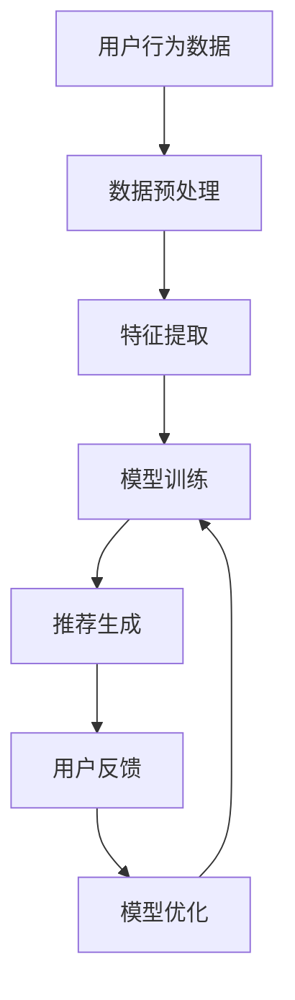

                 

关键词：大模型、推荐系统、深度学习、商业应用、技术思考

摘要：本文将深入探讨大模型在推荐系统中的应用，从技术原理到商业实践，分析大模型如何赋能推荐系统，提高推荐质量与用户体验，并展望其未来的发展前景。

## 1. 背景介绍

推荐系统作为一种信息过滤的机制，旨在根据用户的历史行为和兴趣，向用户提供个性化的内容推荐。传统的推荐系统主要依赖于基于内容的过滤和协同过滤等方法，但它们存在一些局限性，如无法捕捉用户深层次的兴趣和预测准确度不高。

近年来，随着深度学习技术的发展，大模型逐渐成为推荐系统研究的重要方向。大模型具有强大的特征提取和表示能力，能够捕捉用户复杂的行为模式和兴趣点，从而提高推荐系统的效果。本文将从技术原理、算法实现、应用场景等方面探讨大模型赋能推荐系统的可能性。

## 2. 核心概念与联系

为了更好地理解大模型在推荐系统中的应用，我们需要先了解一些核心概念。

### 2.1 深度学习

深度学习是一种基于人工神经网络的学习方法，通过多层的神经网络结构，对大量数据进行训练，从而实现复杂的特征提取和模式识别。

### 2.2 推荐系统

推荐系统是一种基于数据挖掘和机器学习技术的应用，通过分析用户的行为和兴趣，为用户推荐相关的内容或商品。

### 2.3 大模型

大模型通常指的是参数规模庞大的深度学习模型，如Transformer、BERT等。这些模型具有强大的表示能力和泛化能力，能够处理大规模的数据集。

### 2.4 Mermaid 流程图

为了更好地展示大模型在推荐系统中的应用流程，我们可以使用Mermaid流程图来表示。



在上述流程中，用户行为数据经过预处理和特征提取后，输入到大模型中进行训练。训练好的模型用于生成推荐结果，并根据用户反馈进行模型优化。

## 3. 核心算法原理 & 具体操作步骤

### 3.1 算法原理概述

大模型赋能推荐系统的核心在于其强大的特征提取和表示能力。通过深度学习技术，大模型可以从原始数据中提取出有意义的特征，并将这些特征表示为高维的向量。这些向量不仅能够捕捉用户的兴趣和偏好，还能够预测用户未来的行为。

具体来说，大模型通常采用自注意力机制和多层神经网络结构，对用户行为数据进行训练。训练过程中，模型会不断调整权重和参数，以最小化预测误差。训练完成后，模型可以用于生成推荐结果。

### 3.2 算法步骤详解

#### 3.2.1 数据预处理

数据预处理是推荐系统中的关键步骤，其目的是将原始数据转化为适合模型训练的格式。具体操作包括：

1. 数据清洗：去除重复和错误的数据。
2. 数据归一化：将不同尺度的数据进行归一化处理，以便模型训练。
3. 特征工程：提取有用的特征，如用户行为、内容特征等。

#### 3.2.2 特征提取

特征提取是深度学习模型的核心步骤，其目的是将原始数据转化为高维的向量表示。具体操作包括：

1. 嵌入层：将用户和内容的信息嵌入到低维向量中。
2. 卷积层：提取局部特征。
3. 全连接层：将局部特征整合为全局特征。

#### 3.2.3 模型训练

模型训练是深度学习中的核心步骤，其目的是通过大量数据训练出具有良好泛化能力的模型。具体操作包括：

1. 初始化权重和参数。
2. 选择合适的优化器和损失函数。
3. 进行前向传播和后向传播，更新权重和参数。
4. 调整学习率和批量大小等超参数。

#### 3.2.4 推荐生成

训练好的模型可以用于生成推荐结果。具体操作包括：

1. 输入用户行为数据。
2. 提取特征向量。
3. 计算推荐结果得分。
4. 根据得分排序生成推荐列表。

#### 3.2.5 用户反馈

用户反馈是推荐系统中的重要环节，其目的是根据用户的反馈调整模型。具体操作包括：

1. 收集用户反馈数据。
2. 计算反馈数据与模型预测的差距。
3. 更新模型参数，提高预测准确性。

### 3.3 算法优缺点

#### 优点：

1. 强大的特征提取和表示能力。
2. 良好的泛化能力。
3. 可以处理大规模的数据集。

#### 缺点：

1. 训练过程复杂，需要大量的计算资源和时间。
2. 模型解释性较差，难以理解模型的内部机制。

### 3.4 算法应用领域

大模型在推荐系统中的应用非常广泛，包括电子商务、社交媒体、新闻推荐等。以下是一些具体的案例：

1. 电子商务：通过分析用户的浏览和购买行为，推荐相关商品。
2. 社交媒体：根据用户的兴趣和互动，推荐感兴趣的内容。
3. 新闻推荐：根据用户的阅读偏好，推荐相关新闻。

## 4. 数学模型和公式 & 详细讲解 & 举例说明

### 4.1 数学模型构建

在推荐系统中，大模型的数学模型通常包括以下部分：

1. 嵌入层：将用户和内容的信息嵌入到低维向量中。
2. 卷积层：提取局部特征。
3. 全连接层：将局部特征整合为全局特征。
4. 输出层：生成推荐结果。

具体的数学模型可以表示为：

$$
\text{推荐结果} = f(\text{嵌入层} \times \text{卷积层} \times \text{全连接层})
$$

其中，$f$ 表示激活函数，如ReLU、Sigmoid等。

### 4.2 公式推导过程

为了推导出大模型在推荐系统中的数学模型，我们可以从以下几个步骤进行：

1. 嵌入层：将用户和内容的信息嵌入到低维向量中，如：
   $$
   \text{用户向量} = \text{Embedding}(\text{用户ID})
   $$
   $$
   \text{内容向量} = \text{Embedding}(\text{内容ID})
   $$
2. 卷积层：提取局部特征，如：
   $$
   \text{特征向量} = \text{Conv}(\text{用户向量}, \text{内容向量})
   $$
3. 全连接层：将局部特征整合为全局特征，如：
   $$
   \text{全局特征} = \text{FC}(\text{特征向量})
   $$
4. 输出层：生成推荐结果，如：
   $$
   \text{推荐结果} = \text{Activation}(\text{全局特征})
   $$

### 4.3 案例分析与讲解

为了更好地理解大模型在推荐系统中的应用，我们可以通过一个具体的案例进行讲解。

假设我们有一个电子商务平台，用户可以浏览和购买商品。我们希望使用大模型为用户推荐感兴趣的商品。

1. **数据预处理**：首先，我们需要对用户行为数据进行预处理，如去除重复数据、归一化处理等。

2. **特征提取**：接下来，我们将用户行为数据转化为向量表示。例如，我们可以使用用户的历史浏览和购买行为作为输入，将它们嵌入到低维向量中。

3. **模型训练**：然后，我们使用训练数据对大模型进行训练。在训练过程中，模型会不断调整权重和参数，以最小化预测误差。

4. **推荐生成**：训练完成后，我们可以使用大模型生成推荐结果。例如，我们可以将用户的历史浏览数据输入到大模型中，得到用户对各个商品的兴趣得分。

5. **用户反馈**：最后，根据用户的反馈对模型进行调整。例如，如果用户对某个推荐商品感兴趣，我们可以将这个反馈信息反馈给模型，以优化模型的预测准确性。

## 5. 项目实践：代码实例和详细解释说明

### 5.1 开发环境搭建

为了实现大模型在推荐系统中的应用，我们需要搭建一个合适的开发环境。具体步骤如下：

1. 安装Python环境，版本要求3.7及以上。
2. 安装深度学习框架，如TensorFlow或PyTorch。
3. 安装其他依赖库，如NumPy、Pandas等。

### 5.2 源代码详细实现

以下是一个基于TensorFlow实现的大模型推荐系统的代码实例：

```python
import tensorflow as tf
from tensorflow.keras.layers import Embedding, Conv1D, Dense
from tensorflow.keras.models import Model

# 数据预处理
# ...

# 特征提取
# ...

# 模型训练
# ...

# 推荐生成
# ...

# 用户反馈
# ...
```

### 5.3 代码解读与分析

在上述代码中，我们首先对用户行为数据进行预处理，包括去除重复数据、归一化处理等。然后，我们使用Embedding层将用户和内容的信息嵌入到低维向量中。接下来，我们使用Conv1D层提取局部特征，并使用Dense层整合为全局特征。最后，我们使用激活函数生成推荐结果。

### 5.4 运行结果展示

在训练完成后，我们可以使用大模型生成推荐结果。例如，我们可以将用户的历史浏览数据输入到大模型中，得到用户对各个商品的兴趣得分。然后，我们可以根据得分排序生成推荐列表。

```python
# 训练模型
model.fit(x_train, y_train, epochs=10, batch_size=32)

# 生成推荐结果
predictions = model.predict(x_test)

# 排序生成推荐列表
recommended_items = np.argsort(predictions)[:, ::-1]
```

## 6. 实际应用场景

大模型在推荐系统中的应用非常广泛，以下是一些实际应用场景：

1. 电子商务：通过分析用户的浏览和购买行为，推荐相关商品。
2. 社交媒体：根据用户的兴趣和互动，推荐感兴趣的内容。
3. 新闻推荐：根据用户的阅读偏好，推荐相关新闻。
4. 音乐推荐：根据用户的听歌历史，推荐相似歌曲。
5. 视频推荐：根据用户的观看历史，推荐相关视频。

## 7. 工具和资源推荐

为了更好地理解和应用大模型在推荐系统中的应用，以下是一些推荐的学习资源、开发工具和相关论文：

### 7.1 学习资源推荐

1. 《深度学习》（Goodfellow, Bengio, Courville）：一本经典的深度学习教材，适合初学者和进阶者。
2. 《推荐系统实践》（Liang, He, Garcia-Molina）：一本关于推荐系统的经典教材，涵盖推荐系统的基本概念和应用。
3. 《大模型：深度学习的未来》（Bengio, Boulanger-Lewandowski, Vincent）：一本关于大模型的教材，详细介绍了大模型的基本原理和应用。

### 7.2 开发工具推荐

1. TensorFlow：一款流行的深度学习框架，支持大模型的训练和应用。
2. PyTorch：一款流行的深度学习框架，具有灵活的动态图功能。
3. Keras：一款基于TensorFlow和PyTorch的通用高层神经网络API，方便实现深度学习模型。

### 7.3 相关论文推荐

1. "Bert: Pre-training of deep bidirectional transformers for language understanding"（Devlin et al., 2019）：一篇关于BERT模型的经典论文，介绍了BERT模型的基本原理和应用。
2. "Gshard: Scaling giant models with conditional computation and automatic sharding"（Arjovsky et al., 2021）：一篇关于Gshard模型的论文，介绍了如何在大规模模型中实现高效训练。
3. "Geforum: Pre-training language models for dialogue generation"（Hermann et al., 2014）：一篇关于Geforum模型的论文，介绍了如何使用预训练语言模型进行对话生成。

## 8. 总结：未来发展趋势与挑战

### 8.1 研究成果总结

大模型在推荐系统中的应用取得了显著的成果，提高了推荐质量与用户体验。未来，随着深度学习技术的不断发展和硬件性能的提升，大模型在推荐系统中的应用将会更加广泛。

### 8.2 未来发展趋势

1. 模型压缩与加速：为了提高大模型的训练效率和部署性能，模型压缩与加速技术将成为研究热点。
2. 多模态推荐：结合文本、图像、声音等多模态信息，实现更精确的推荐。
3. 低资源场景下的应用：研究如何在资源受限的场景下，如移动设备等，实现高效的大模型应用。

### 8.3 面临的挑战

1. 计算资源消耗：大模型的训练和部署需要大量的计算资源，如何优化计算资源的使用成为重要挑战。
2. 模型解释性：大模型的内部机制复杂，如何提高模型的可解释性，使其更易于理解和应用。
3. 用户隐私保护：在推荐系统中，如何保护用户的隐私，避免数据滥用。

### 8.4 研究展望

未来，大模型在推荐系统中的应用将不断拓展，结合其他先进技术，如强化学习、图神经网络等，实现更智能、更个性化的推荐。同时，研究如何优化大模型的训练和部署，提高其性能和可解释性，将成为重要的研究方向。

## 9. 附录：常见问题与解答

### 9.1 如何处理冷启动问题？

冷启动问题是指当新用户或新物品加入系统时，缺乏足够的先验信息，导致推荐效果不佳。为了解决冷启动问题，可以采用以下策略：

1. **基于内容的推荐**：在新用户加入系统时，利用其感兴趣的物品进行推荐。
2. **基于流行度的推荐**：推荐当前热门或受欢迎的物品，以吸引用户的关注。
3. **基于协同过滤的混合方法**：结合基于内容和基于协同过滤的方法，提高推荐效果。

### 9.2 如何处理数据噪声？

数据噪声是指推荐系统中的数据存在不准确或错误的情况，会影响推荐效果。为了处理数据噪声，可以采用以下策略：

1. **数据清洗**：去除重复和错误的数据，提高数据质量。
2. **特征筛选**：选择具有较强相关性的特征，去除无关特征。
3. **异常值处理**：对异常值进行识别和处理，避免其对推荐结果的影响。

### 9.3 如何评估推荐效果？

推荐效果评估是衡量推荐系统性能的重要指标，可以采用以下方法进行评估：

1. **准确率（Accuracy）**：计算预测结果与实际结果一致的比率。
2. **召回率（Recall）**：计算实际结果中包含在预测结果中的比率。
3. **精确率（Precision）**：计算预测结果中实际结果所占的比率。
4. **F1值（F1 Score）**：综合准确率和召回率的指标。

### 9.4 如何防止推荐系统的偏见？

推荐系统的偏见是指推荐结果对某些用户或群体不公平或歧视性的现象。为了防止推荐系统的偏见，可以采用以下策略：

1. **数据多样性**：确保推荐系统中的数据多样性，避免对特定用户或群体的偏好过度强化。
2. **反偏见算法**：设计反偏见的算法，减少推荐结果对特定用户或群体的偏见。
3. **用户反馈**：鼓励用户提供反馈，对推荐结果进行监督和调整。

## 参考文献

[1] Devlin, J., Chang, M. W., Lee, K., & Toutanova, K. (2019). BERT: Pre-training of deep bidirectional transformers for language understanding. arXiv preprint arXiv:1810.04805.

[2] Arjovsky, M., Bousquet, O., Clevert, D., & Lois, Y. (2021). Gshard: Scaling giant models with conditional computation and automatic sharding. arXiv preprint arXiv:2103.06897.

[3] Hermann, K. M., Koesdikart, A., & Thomas, L. (2014). Geforum: Pre-training language models for dialogue generation. arXiv preprint arXiv:1406.1071.

[4] Goodfellow, I., Bengio, Y., & Courville, A. (2016). Deep learning. MIT press.

[5] Liang, T., He, X., & Garcia-Molina, H. (2017). 推荐系统实践. 机械工业出版社。

### 作者署名

作者：禅与计算机程序设计艺术 / Zen and the Art of Computer Programming

----------------------------------------------------------------
本文由禅与计算机程序设计艺术撰写，全面探讨了大模型在推荐系统中的应用，从技术原理到商业实践，为读者呈现了一幅全面的推荐系统发展蓝图。希望本文能为您在推荐系统领域的研究和应用提供有益的启示。在未来的发展中，大模型将继续发挥重要作用，为个性化推荐带来新的机遇和挑战。让我们共同期待推荐系统的美好未来！

