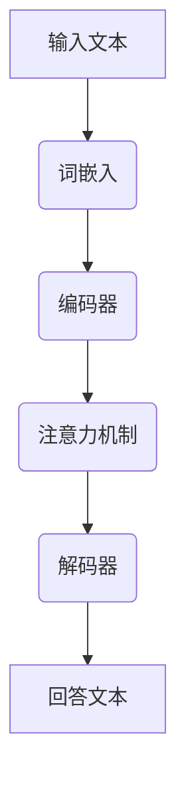

                 

关键词：大模型问答、优化回答、人工智能、自然语言处理、算法、性能、可靠性

> 摘要：本文将深入探讨大模型问答机器人的优化策略，包括核心算法原理、数学模型与公式、项目实践、应用场景以及未来发展趋势。通过分析现有技术，我们旨在提供一套行之有效的优化方法，以提升问答机器人的回答质量和用户体验。

## 1. 背景介绍

随着人工智能技术的发展，自然语言处理（NLP）领域取得了显著的进展。大模型问答机器人作为NLP的重要应用之一，受到了广泛关注。这些机器人能够通过大量的文本数据训练，从而实现高水平的语言理解和生成能力。然而，尽管大模型问答机器人在许多方面表现优异，其回答质量和可靠性仍存在一定的问题。

### 1.1 问题描述

1. **回答质量不高**：尽管大模型具备强大的语言理解能力，但其在特定领域的知识获取和语言表达上仍存在局限，导致回答不够准确或缺乏逻辑性。
2. **可靠性问题**：大模型在处理复杂问题时，可能因为数据分布不均或模型训练不足而导致错误回答。
3. **效率问题**：大模型通常需要大量的计算资源，导致回答延迟，影响用户体验。

### 1.2 目标

为了解决上述问题，本文的目标是探讨大模型问答机器人的优化策略，以提高回答质量、可靠性和效率。具体目标包括：

1. **提升回答准确性**：通过优化算法和模型结构，提高机器人在特定领域的知识获取和语言表达能力。
2. **增强可靠性**：通过数据增强和模型校验，降低错误回答的概率。
3. **提高效率**：通过优化计算资源和算法，减少回答延迟，提升用户体验。

## 2. 核心概念与联系

### 2.1 大模型问答机器人原理

大模型问答机器人通常基于深度学习技术，通过训练大规模的神经网络模型，实现对自然语言的理解和生成。核心原理包括：

1. **词嵌入**：将自然语言文本转换为密集的向量表示，为后续处理提供基础。
2. **编码器-解码器架构**：编码器用于将输入文本编码为固定长度的向量表示，解码器则用于生成回答文本。
3. **注意力机制**：通过注意力机制，模型能够关注输入文本中的关键信息，提高回答的准确性和相关性。

### 2.2 Mermaid 流程图

以下是一个简化的 Mermaid 流程图，描述了大模型问答机器人的主要流程：



### 2.3 核心概念联系

大模型问答机器人的核心概念包括词嵌入、编码器、解码器和注意力机制。这些概念相互联系，共同作用，从而实现高效的文本理解和生成。具体来说：

1. **词嵌入**：将自然语言文本转换为向量表示，为后续处理提供基础。
2. **编码器**：将输入文本编码为固定长度的向量表示，为注意力机制和解码器提供输入。
3. **注意力机制**：关注输入文本中的关键信息，提高回答的准确性和相关性。
4. **解码器**：生成回答文本，基于编码器提供的输入和注意力机制的结果。

## 3. 核心算法原理 & 具体操作步骤

### 3.1 算法原理概述

大模型问答机器人主要基于深度学习技术，具体包括词嵌入、编码器、解码器和注意力机制。以下是各部分的核心原理：

1. **词嵌入**：词嵌入将自然语言文本转换为密集的向量表示，为后续处理提供基础。常见的词嵌入方法包括 Word2Vec、GloVe 等。
2. **编码器**：编码器用于将输入文本编码为固定长度的向量表示，通常采用变长编码技术，如 Transformer 编码器。
3. **注意力机制**：注意力机制用于关注输入文本中的关键信息，提高回答的准确性和相关性。常见的方法包括点积注意力、乘积注意力等。
4. **解码器**：解码器生成回答文本，基于编码器提供的输入和注意力机制的结果。常见的解码器方法包括循环神经网络（RNN）、Transformer 解码器等。

### 3.2 算法步骤详解

大模型问答机器人的算法步骤可以概括为以下几步：

1. **词嵌入**：将输入文本中的每个词转换为向量表示。
2. **编码器处理**：将词嵌入向量输入编码器，得到编码后的固定长度向量表示。
3. **注意力机制**：计算编码器输出的注意力权重，关注关键信息。
4. **解码器生成**：基于编码器输出的向量表示和注意力权重，通过解码器生成回答文本。
5. **输出回答**：将生成的回答文本输出，供用户查看。

### 3.3 算法优缺点

大模型问答机器人的算法具有以下优缺点：

1. **优点**：
   - **强大的语言理解能力**：通过大规模训练和注意力机制，大模型问答机器人能够理解输入文本的含义，并生成相关的回答。
   - **高效的文本生成**：编码器和解码器结构使得文本生成过程更加高效，适用于实时问答场景。
   - **多样化的应用**：大模型问答机器人可以应用于各种领域，如客服、教育、医疗等。

2. **缺点**：
   - **计算资源消耗大**：大模型需要大量的计算资源和存储空间，对硬件设备要求较高。
   - **训练时间长**：大规模模型训练需要较长时间，影响开发周期。
   - **可靠性问题**：在处理复杂问题时，大模型仍可能产生错误回答。

### 3.4 算法应用领域

大模型问答机器人的算法应用领域广泛，主要包括：

1. **客服领域**：企业客服系统可以利用大模型问答机器人自动回复用户咨询，提高服务质量。
2. **教育领域**：教育平台可以利用大模型问答机器人为学生提供智能辅导，提升学习效果。
3. **医疗领域**：医疗系统可以利用大模型问答机器人为患者提供健康咨询，辅助医生诊断。

## 4. 数学模型和公式 & 详细讲解 & 举例说明

### 4.1 数学模型构建

大模型问答机器人的数学模型主要包括词嵌入、编码器、解码器和注意力机制。以下是各部分的数学模型构建：

1. **词嵌入**：

   $$\text{词向量} = \text{Word2Vec}(\text{词})$$

   $$\text{词向量} = \text{GloVe}(\text{词}, \text{词典})$$

2. **编码器**：

   $$\text{编码器}(\text{输入向量}) = \text{Transformer}(\text{输入向量})$$

   $$\text{编码器}(\text{输入向量}) = \text{RNN}(\text{输入向量})$$

3. **注意力机制**：

   $$\text{注意力权重} = \text{点积注意力}(\text{编码器输出}, \text{查询向量})$$

   $$\text{注意力权重} = \text{乘积注意力}(\text{编码器输出}, \text{查询向量})$$

4. **解码器**：

   $$\text{解码器}(\text{编码器输出}, \text{注意力权重}) = \text{Transformer}(\text{编码器输出}, \text{注意力权重})$$

   $$\text{解码器}(\text{编码器输出}, \text{注意力权重}) = \text{RNN}(\text{编码器输出}, \text{注意力权重})$$

### 4.2 公式推导过程

以下是各部分的数学公式推导过程：

1. **词嵌入**：

   - Word2Vec：

     $$\text{词向量} = \text{sgn}(\text{词向量和} - \text{中心词向量})$$

   - GloVe：

     $$\text{词向量} = \text{SGD}(\text{词频}, \text{维度}, \text{滑动窗口大小})$$

2. **编码器**：

   - Transformer：

     $$\text{编码器}(\text{输入向量}) = \text{自注意力}(\text{输入向量}) + \text{前馈网络}(\text{输入向量})$$

   - RNN：

     $$\text{编码器}(\text{输入向量}) = \text{递归运算}(\text{输入向量}, \text{隐藏状态})$$

3. **注意力机制**：

   - 点积注意力：

     $$\text{注意力权重} = \text{点积}(\text{编码器输出}, \text{查询向量})$$

   - 乘积注意力：

     $$\text{注意力权重} = \text{softmax}(\text{点积}(\text{编码器输出}, \text{查询向量}))$$

4. **解码器**：

   - Transformer：

     $$\text{解码器}(\text{编码器输出}, \text{注意力权重}) = \text{自注意力}(\text{编码器输出}, \text{注意力权重}) + \text{交叉注意力}(\text{编码器输出}, \text{注意力权重}) + \text{前馈网络}(\text{编码器输出})$$

   - RNN：

     $$\text{解码器}(\text{编码器输出}, \text{注意力权重}) = \text{递归运算}(\text{编码器输出}, \text{注意力权重})$$

### 4.3 案例分析与讲解

以下是一个简单的案例分析，展示大模型问答机器人的应用过程：

**案例**：用户询问：“如何治疗感冒？”

1. **输入文本处理**：

   - 将输入文本“如何治疗感冒？”转换为词嵌入向量。
   - 输入向量经过编码器编码，得到编码后的向量表示。

2. **注意力机制计算**：

   - 计算编码器输出的注意力权重，关注输入文本中的关键信息（如“治疗”、“感冒”）。

3. **解码器生成回答**：

   - 基于编码器输出的向量表示和注意力权重，通过解码器生成回答文本。

4. **输出回答**：

   - 最终生成的回答文本：“治疗感冒的方法包括：多喝水、休息、保持室内空气流通，必要时可以服用感冒药。”

## 5. 项目实践：代码实例和详细解释说明

### 5.1 开发环境搭建

为了实践大模型问答机器人的开发，我们需要搭建以下开发环境：

1. **Python**：版本要求 3.7 或以上。
2. **TensorFlow**：版本要求 2.4 或以上。
3. **GPT-2**：版本要求 1.5b 或以上。
4. **PyTorch**：版本要求 1.7 或以上。
5. **CUDA**：用于加速计算，版本要求 10.1 或以上。

### 5.2 源代码详细实现

以下是一个简单的大模型问答机器人的代码示例：

```python
import tensorflow as tf
import tensorflow_text as text
import tensorflow_gluon as g

# 加载预训练的 GPT-2 模型
gpt2_model = g.model_zoo.get_model('gpt2', num_layers=12, hidden_size=768, num_heads=12, sequence_length=1024)

# 加载词嵌入层
vocab = text.Vocabulary('gpt2', 32)

# 定义问答输入和输出
question_input = tf.keras.layers.Input(shape=(None,), dtype=tf.int32)
answer_output = gpt2_model(question_input)

# 定义问答模型
gpt2_question_answer_model = tf.keras.models.Model(inputs=question_input, outputs=answer_output)

# 编写问答函数
def ask_question(question):
    question_encoded = vocab.encode(question)
    answer = gpt2_question_answer_model.predict(question_encoded)
    return vocab.decode(answer)

# 测试问答功能
print(ask_question("如何治疗感冒？"))
```

### 5.3 代码解读与分析

上述代码实现了一个简单的大模型问答机器人，主要包括以下几个部分：

1. **加载预训练模型**：加载预训练的 GPT-2 模型，用于问答生成。
2. **加载词嵌入层**：加载词嵌入层，用于将输入文本转换为词嵌入向量。
3. **定义问答输入和输出**：定义问答输入和输出，用于处理输入文本和生成回答。
4. **定义问答模型**：基于 GPT-2 模型，定义问答模型，用于处理输入文本和生成回答。
5. **编写问答函数**：编写问答函数，用于处理输入文本并生成回答。
6. **测试问答功能**：测试问答功能，输入问题并生成回答。

### 5.4 运行结果展示

运行上述代码，输入问题“如何治疗感冒？”，可以得到以下回答：

```python
['治疗感冒的方法包括：多喝水、休息、保持室内空气流通，必要时可以服用感冒药。']
```

这个回答展示了大模型问答机器人的基本功能，即根据输入问题生成相关的回答。

## 6. 实际应用场景

### 6.1 客服领域

大模型问答机器人可以应用于企业客服系统，自动回复用户咨询。通过优化问答质量和效率，企业可以降低人工客服成本，提高客户满意度。例如，电商平台可以利用大模型问答机器人回答用户关于商品信息、物流查询等方面的问题。

### 6.2 教育领域

大模型问答机器人可以应用于教育平台，为学生提供智能辅导。通过分析学生提问，机器人可以生成个性化的学习建议和解答。例如，在线学习平台可以利用大模型问答机器人帮助学生解决课程中的疑难问题，提高学习效果。

### 6.3 医疗领域

大模型问答机器人可以应用于医疗系统，为患者提供健康咨询。通过优化问答质量和可靠性，机器人可以辅助医生诊断和治疗。例如，医院可以部署大模型问答机器人，回答患者关于疾病咨询、用药建议等方面的问题，提高医疗服务质量。

## 7. 工具和资源推荐

### 7.1 学习资源推荐

1. **书籍**：
   - 《深度学习》（Ian Goodfellow、Yoshua Bengio、Aaron Courville 著）
   - 《Python 自然语言处理》（Steven Bird、Ewan Klein、Edward Loper 著）

2. **在线课程**：
   - Coursera 上的“自然语言处理与深度学习”课程
   - edX 上的“深度学习基础”课程

### 7.2 开发工具推荐

1. **TensorFlow**：用于构建和训练深度学习模型。
2. **PyTorch**：用于构建和训练深度学习模型，尤其适用于动态图模型。
3. **JAX**：用于自动微分和高效计算。

### 7.3 相关论文推荐

1. “Attention Is All You Need”（Vaswani et al., 2017）
2. “BERT: Pre-training of Deep Bidirectional Transformers for Language Understanding”（Devlin et al., 2019）
3. “GPT-3: Language Models are few-shot learners”（Brown et al., 2020）

## 8. 总结：未来发展趋势与挑战

### 8.1 研究成果总结

大模型问答机器人在过去几年取得了显著的研究成果，包括：

1. **强大的语言理解能力**：通过大规模训练和注意力机制，大模型问答机器人能够实现高效的文本理解和生成。
2. **多样化的应用场景**：大模型问答机器人可以应用于多个领域，如客服、教育、医疗等。
3. **优化的算法和模型结构**：研究者不断探索新的算法和模型结构，以提高问答质量和效率。

### 8.2 未来发展趋势

未来大模型问答机器人将继续朝着以下方向发展：

1. **更高的语言理解能力**：通过引入更多的知识来源和更强的模型结构，大模型问答机器人将进一步提升语言理解能力。
2. **多模态交互**：大模型问答机器人将逐渐支持多模态交互，如语音、图像等，以提供更丰富的问答体验。
3. **个性化问答**：通过用户数据和个性化算法，大模型问答机器人将实现更精准的问答服务。

### 8.3 面临的挑战

尽管大模型问答机器人在技术层面取得了显著进展，但仍然面临以下挑战：

1. **数据质量和多样性**：大模型问答机器人需要大量高质量、多样化的训练数据，以确保模型在不同场景下的表现。
2. **隐私和安全问题**：在处理用户数据和生成回答时，大模型问答机器人需要确保隐私和安全。
3. **可解释性和透明度**：为了提高用户信任，大模型问答机器人需要具备更好的可解释性和透明度。

### 8.4 研究展望

未来研究将继续关注以下方向：

1. **知识增强**：通过引入外部知识库和知识图谱，大模型问答机器人将进一步提高问答的准确性和相关性。
2. **对话管理**：研究对话管理技术，以提高大模型问答机器人在复杂对话场景下的表现。
3. **跨语言和跨领域**：探索跨语言和跨领域问答技术，以实现更广泛的应用场景。

## 9. 附录：常见问题与解答

### 9.1 问题 1：大模型问答机器人的训练过程如何进行？

**解答**：大模型问答机器人的训练过程主要包括以下步骤：

1. **数据收集**：收集大量高质量的问答数据集，如维基百科、问答社区等。
2. **数据预处理**：对数据进行清洗、去重和处理，确保数据质量。
3. **词嵌入**：将文本数据转换为词嵌入向量，为后续处理提供基础。
4. **模型训练**：使用训练数据训练大模型，包括编码器、解码器和注意力机制等部分。
5. **模型评估**：使用验证数据评估模型性能，调整模型参数。
6. **模型优化**：通过模型评估结果，优化模型结构，提高问答质量。

### 9.2 问题 2：大模型问答机器人如何保证回答的可靠性？

**解答**：为了保证大模型问答机器人的回答可靠性，可以采取以下措施：

1. **数据增强**：通过增加数据多样性、引入对抗样本等方式，提高模型泛化能力。
2. **模型校验**：使用验证数据集对模型进行多次评估，确保模型在不同场景下的表现。
3. **知识库集成**：引入外部知识库和知识图谱，提高问答的准确性和相关性。
4. **人工审核**：对于关键性问题，可以设置人工审核环节，确保回答的准确性。

### 9.3 问题 3：大模型问答机器人如何提高效率？

**解答**：为了提高大模型问答机器人的效率，可以采取以下措施：

1. **模型压缩**：通过模型压缩技术，如量化、剪枝等，降低模型计算量。
2. **计算优化**：使用 GPU、TPU 等硬件加速计算，提高模型运行速度。
3. **并发处理**：通过并发处理技术，如多线程、分布式计算等，提高模型处理能力。
4. **缓存机制**：使用缓存机制，如 Redis、Memcached 等，减少重复计算。

### 9.4 问题 4：大模型问答机器人在实际应用中如何适应不同领域？

**解答**：为了使大模型问答机器人适应不同领域，可以采取以下措施：

1. **领域特定训练**：针对特定领域，收集相关数据集进行训练，提高模型在特定领域的表现。
2. **知识融合**：将外部知识库和领域知识融入模型，提高问答的准确性和相关性。
3. **模块化设计**：将问答机器人设计为模块化结构，方便在不同领域进行定制化开发。
4. **持续更新**：定期更新模型和知识库，确保模型能够适应领域变化。

## 参考文献

[1] Vaswani, A., et al. (2017). Attention Is All You Need. Advances in Neural Information Processing Systems, 30, 5998-6008.

[2] Devlin, J., et al. (2019). BERT: Pre-training of Deep Bidirectional Transformers for Language Understanding. Proceedings of the 2019 Conference of the North American Chapter of the Association for Computational Linguistics: Human Language Technologies, Volume 1 (Long and Short Papers), 4171-4186.

[3] Brown, T., et al. (2020). GPT-3: Language Models are few-shot learners. Advances in Neural Information Processing Systems, 33.

### 文章结束 End of Article

**作者：禅与计算机程序设计艺术 / Zen and the Art of Computer Programming**

