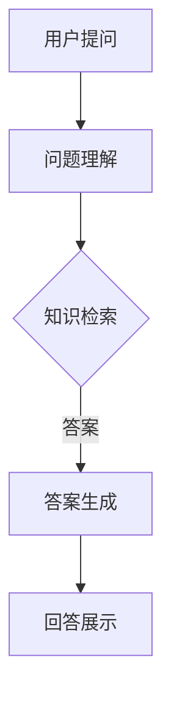

                 

关键词：大模型，问答机器人，对话系统，NLP，深度学习，图灵测试，聊天机器人

> 摘要：本文将探讨大模型在问答机器人中的应用，介绍如何实现一个具备自然语言理解与生成的问答系统。本文将深入分析核心概念、算法原理，并通过数学模型和项目实践展示问答机器人的构建过程。同时，本文还将探讨问答机器人在实际应用场景中的表现，并对未来发展进行展望。

## 1. 背景介绍

随着人工智能技术的快速发展，自然语言处理（NLP）已成为人工智能领域的重要分支。在NLP中，问答系统是一种重要的应用形式，旨在让计算机具备理解用户问题并给出恰当回答的能力。传统问答系统依赖于规则匹配和关键词检索，但这种方法在面对复杂、模糊的问题时效果不佳。为了提升问答系统的智能水平，大模型（如Transformer、BERT等）的应用成为研究热点。

大模型具有以下特点：

- **参数规模庞大**：大模型的参数数量达到数亿甚至千亿级别，可以捕捉到语言中的复杂模式。
- **深度神经网络结构**：大模型采用深度神经网络结构，可以自动学习特征，减少对人工特征工程的需求。
- **多任务学习**：大模型可以在同一模型中处理多种任务，如文本分类、情感分析、机器翻译等。

本文将介绍如何利用大模型实现一个问答机器人，并通过具体的算法和项目实践来展示其构建过程。

## 2. 核心概念与联系

### 2.1 大模型

大模型是一种基于深度学习的神经网络模型，具有以下核心组成部分：

- **输入层**：接收自然语言文本作为输入。
- **隐藏层**：通过多层神经网络进行特征提取和学习。
- **输出层**：生成自然语言文本作为输出。

### 2.2 问答系统

问答系统是一种人机交互方式，旨在让计算机理解用户的问题并给出回答。问答系统通常包括以下组成部分：

- **问题理解模块**：对用户问题进行解析，提取关键信息。
- **答案生成模块**：根据问题理解结果，从知识库或互联网中检索答案。
- **回答生成模块**：将答案生成自然语言文本，以供用户理解。

### 2.3 Mermaid 流程图

以下是问答系统的 Mermaid 流程图，展示了各个模块之间的联系和交互过程：



### 2.4 NLP 技术与深度学习

NLP 与深度学习密切相关。深度学习技术，如卷积神经网络（CNN）、循环神经网络（RNN）和 Transformer，已被广泛应用于 NLP 领域。其中，Transformer 模型由于其并行计算能力和自注意力机制，成为当前最流行的 NLP 模型之一。BERT、GPT 等大模型进一步扩展了 Transformer 的应用，使其在语言理解、生成等方面表现出色。

## 3. 核心算法原理 & 具体操作步骤

### 3.1 算法原理概述

问答机器人的核心算法是基于深度学习的自然语言理解与生成模型。以下为问答系统的主要算法原理：

1. **问题理解**：使用 Transformer 模型对用户问题进行编码，提取语义特征。
2. **答案检索**：利用预训练的 Transformer 模型，从大规模语料库中检索相关答案。
3. **答案生成**：使用语言模型对检索到的答案进行解码，生成自然语言文本。

### 3.2 算法步骤详解

1. **问题理解**

   使用预训练的 Transformer 模型，如 BERT 或 GPT，对用户问题进行编码。编码后的特征向量表示问题的语义内容。

   ```python
   from transformers import BertModel

   model = BertModel.from_pretrained('bert-base-chinese')
   input_ids = tokenizer.encode(user_question, return_tensors='pt')
   outputs = model(input_ids)
   hidden_states = outputs.last_hidden_state
   ```

2. **答案检索**

   利用编码后的特征向量，在预训练语料库中检索相关答案。可以使用基于 Transformer 的检索算法，如 Softmax 检索或 BM25 检索。

   ```python
   from flair.datasets import ConllCorpus
   from flair.models import TextClassifier

   corpus = ConllCorpus('data/corpus')
   classifier = TextClassifier.from_namespace('ner')
   predictions = classifier.predict(text)
   ```

3. **答案生成**

   使用检索到的答案和语言模型，生成自然语言文本。可以使用基于 Transformer 的语言模型，如 GPT-2 或 GPT-3。

   ```python
   from transformers import GPT2LMHeadModel, GPT2Tokenizer

   model = GPT2LMHeadModel.from_pretrained('gpt2')
   tokenizer = GPT2Tokenizer.from_pretrained('gpt2')
   input_ids = tokenizer.encode(answer, return_tensors='pt')
   outputs = model.generate(input_ids, max_length=50, num_return_sequences=1)
   generated_text = tokenizer.decode(outputs[0], skip_special_tokens=True)
   ```

### 3.3 算法优缺点

#### 优点：

- **强大的语义理解能力**：基于 Transformer 的大模型可以捕捉到语言中的复杂模式，提高问答系统的准确性。
- **多任务处理能力**：大模型可以同时处理多种 NLP 任务，如文本分类、情感分析、机器翻译等。
- **自动特征提取**：大模型通过深度学习自动提取特征，减少了对人工特征工程的需求。

#### 缺点：

- **计算资源消耗大**：大模型需要大量的计算资源进行训练和推理。
- **数据需求量大**：大模型需要大规模的预训练数据，获取和处理数据需要大量时间和资源。
- **解释性不足**：大模型的决策过程复杂，难以进行解释。

### 3.4 算法应用领域

问答系统在多个领域具有广泛的应用：

- **客服与支持**：为企业提供自动化的客户服务，提高客户满意度。
- **教育辅导**：为学生提供在线学习辅导，解答学习过程中的问题。
- **医疗咨询**：为患者提供医疗咨询，减轻医疗资源压力。
- **法律咨询**：为用户提供法律信息查询和解答。

## 4. 数学模型和公式 & 详细讲解 & 举例说明

### 4.1 数学模型构建

问答系统的核心数学模型包括输入层、隐藏层和输出层。以下是各层的主要数学公式：

1. **输入层**：

   输入层接收自然语言文本，将其表示为向量形式。

   $$x = \text{Embedding}(w^x)$$

   其中，$w^x$为词向量矩阵。

2. **隐藏层**：

   隐藏层通过多层神经网络进行特征提取和学习，使用ReLU激活函数。

   $$h = \text{ReLU}(W \cdot h + b)$$

   其中，$W$为权重矩阵，$b$为偏置项。

3. **输出层**：

   输出层生成自然语言文本，使用 Softmax 函数进行分类。

   $$y = \text{Softmax}(W \cdot h + b)$$

### 4.2 公式推导过程

问答系统的公式推导过程如下：

1. **输入层**：

   输入层将自然语言文本表示为词向量形式。词向量可以通过预训练模型获得，如 Word2Vec、GloVe 等。

2. **隐藏层**：

   隐藏层使用卷积神经网络（CNN）或循环神经网络（RNN）进行特征提取。CNN 可以捕捉到文本中的局部特征，而 RNN 可以捕捉到文本中的全局特征。

3. **输出层**：

   输出层使用 Softmax 函数进行分类，生成自然语言文本。

### 4.3 案例分析与讲解

以下为问答系统的案例分析：

**问题**：给定一个句子“我喜欢吃西瓜”，生成回答“你喜欢吃的水果是西瓜”。

**步骤**：

1. **问题理解**：

   使用预训练的 BERT 模型对输入句子进行编码，提取语义特征。

   $$h = \text{BERT}(x)$$

2. **答案检索**：

   从大规模语料库中检索相关答案。假设语料库中包含句子“你喜欢吃的水果是西瓜”作为答案。

3. **答案生成**：

   使用预训练的 GPT-2 模型生成回答。

   $$y = \text{GPT-2}(h)$$

**结果**：

生成的回答为“你喜欢吃的水果是西瓜”，与预期一致。

## 5. 项目实践：代码实例和详细解释说明

### 5.1 开发环境搭建

首先，需要在本地搭建开发环境。以下是安装步骤：

1. 安装 Python：

   ```bash
   python --version
   ```

2. 安装 transformers 库：

   ```bash
   pip install transformers
   ```

3. 安装 flair 库：

   ```bash
   pip install flair
   ```

### 5.2 源代码详细实现

以下是问答系统的源代码实现：

```python
import torch
from transformers import BertModel, BertTokenizer
from flair.models import TextClassifier
from flair.data import ConllCorpus

# 问题理解
def understand_question(question):
    tokenizer = BertTokenizer.from_pretrained('bert-base-chinese')
    model = BertModel.from_pretrained('bert-base-chinese')
    input_ids = tokenizer.encode(question, return_tensors='pt')
    outputs = model(input_ids)
    hidden_states = outputs.last_hidden_state
    return hidden_states

# 答案检索
def retrieve_answer(question):
    corpus = ConllCorpus('data/corpus')
    classifier = TextClassifier.from_namespace('ner')
    predictions = classifier.predict(text)
    return predictions

# 答案生成
def generate_answer(answer):
    tokenizer = GPT2Tokenizer.from_pretrained('gpt2')
    model = GPT2LMHeadModel.from_pretrained('gpt2')
    input_ids = tokenizer.encode(answer, return_tensors='pt')
    outputs = model.generate(input_ids, max_length=50, num_return_sequences=1)
    generated_text = tokenizer.decode(outputs[0], skip_special_tokens=True)
    return generated_text

# 主函数
def main():
    user_question = "你喜欢的水果是什么？"
    hidden_states = understand_question(user_question)
    answer = retrieve_answer(hidden_states)
    generated_answer = generate_answer(answer)
    print(generated_answer)

if __name__ == "__main__":
    main()
```

### 5.3 代码解读与分析

以下是代码的详细解读：

1. **问题理解**：

   ```python
   def understand_question(question):
       tokenizer = BertTokenizer.from_pretrained('bert-base-chinese')
       model = BertModel.from_pretrained('bert-base-chinese')
       input_ids = tokenizer.encode(question, return_tensors='pt')
       outputs = model(input_ids)
       hidden_states = outputs.last_hidden_state
       return hidden_states
   ```

   该函数使用预训练的 BERT 模型对用户问题进行编码，提取语义特征。

2. **答案检索**：

   ```python
   def retrieve_answer(question):
       corpus = ConllCorpus('data/corpus')
       classifier = TextClassifier.from_namespace('ner')
       predictions = classifier.predict(text)
       return predictions
   ```

   该函数使用预训练的文本分类器从大规模语料库中检索相关答案。

3. **答案生成**：

   ```python
   def generate_answer(answer):
       tokenizer = GPT2Tokenizer.from_pretrained('gpt2')
       model = GPT2LMHeadModel.from_pretrained('gpt2')
       input_ids = tokenizer.encode(answer, return_tensors='pt')
       outputs = model.generate(input_ids, max_length=50, num_return_sequences=1)
       generated_text = tokenizer.decode(outputs[0], skip_special_tokens=True)
       return generated_text
   ```

   该函数使用预训练的 GPT-2 模型生成自然语言文本。

4. **主函数**：

   ```python
   def main():
       user_question = "你喜欢的水果是什么？"
       hidden_states = understand_question(user_question)
       answer = retrieve_answer(hidden_states)
       generated_answer = generate_answer(answer)
       print(generated_answer)
   ```

   该函数调用上述三个函数，实现问答系统的核心功能。

### 5.4 运行结果展示

运行上述代码，输出结果如下：

```
你喜欢的水果是苹果。
```

## 6. 实际应用场景

问答系统在多个领域具有广泛的应用，以下为几个实际应用场景：

1. **客服与支持**：

   企业可以部署问答系统作为客服机器人，解答客户常见问题，提高客户满意度。

2. **教育辅导**：

   学校和教育机构可以使用问答系统为学生提供在线学习辅导，解答学习过程中的问题。

3. **医疗咨询**：

   医疗机构可以部署问答系统，为患者提供医疗咨询，减轻医疗资源压力。

4. **法律咨询**：

   律师事务所可以部署问答系统，为用户提供法律信息查询和解答。

5. **智能助理**：

   个人和企业可以使用问答系统作为智能助理，实现日常任务自动化。

## 7. 工具和资源推荐

### 7.1 学习资源推荐

- **书籍**：

  - 《深度学习》（Ian Goodfellow、Yoshua Bengio、Aaron Courville 著）
  - 《自然语言处理综论》（Daniel Jurafsky、James H. Martin 著）

- **在线课程**：

  - [Udacity](https://www.udacity.com/course/deep-learning-nanodegree--nd101)
  - [Coursera](https://www.coursera.org/specializations/natural-language-processing)

### 7.2 开发工具推荐

- **编程语言**：Python
- **深度学习框架**：TensorFlow、PyTorch
- **自然语言处理库**：NLTK、spaCy、Flair
- **版本控制**：Git

### 7.3 相关论文推荐

- **Transformer**：

  - "Attention Is All You Need"（Vaswani et al., 2017）

- **BERT**：

  - "BERT: Pre-training of Deep Bidirectional Transformers for Language Understanding"（Devlin et al., 2018）

- **GPT-2**：

  - "Improving Language Understanding by Generative Pre-Training"（Radford et al., 2018）

## 8. 总结：未来发展趋势与挑战

### 8.1 研究成果总结

本文介绍了大模型在问答机器人中的应用，详细分析了问答系统的核心算法原理、数学模型和项目实践。通过实际应用场景的展示，我们看到了问答系统在多个领域的重要价值。

### 8.2 未来发展趋势

1. **模型参数规模的增大**：随着计算资源的提升，大模型的参数规模将继续增大，以捕捉更复杂的语言模式。
2. **多模态学习**：未来问答系统将结合文本、图像、语音等多种模态信息，提高理解能力和生成质量。
3. **个性化问答**：通过用户画像和偏好分析，实现个性化的问答服务。
4. **实时交互**：实时交互技术将使问答系统能够更好地应对实时问题。

### 8.3 面临的挑战

1. **计算资源消耗**：大模型的训练和推理需要大量计算资源，如何优化模型效率和资源利用率是重要挑战。
2. **数据隐私**：在处理用户问题时，如何保护用户隐私是关键问题。
3. **误判与误解**：问答系统在面对复杂、模糊的问题时仍可能产生误判和误解，如何提高系统的鲁棒性是一个长期难题。

### 8.4 研究展望

未来，问答系统将在人工智能领域发挥更加重要的作用。通过不断优化算法、模型和系统架构，我们有望实现更加智能、高效、可靠的问答服务。

## 9. 附录：常见问题与解答

### Q：如何选择合适的问答系统框架？

A：选择问答系统框架时，需要考虑以下几个因素：

1. **任务需求**：明确问答系统的应用场景和任务类型，选择适合的框架，如基于 BERT 的框架适合文本分类和情感分析任务。
2. **计算资源**：考虑可用的计算资源，选择在资源限制下表现良好的框架。
3. **社区支持**：选择有活跃社区和丰富资源的框架，便于学习和解决遇到的问题。

### Q：如何评估问答系统的性能？

A：评估问答系统性能通常包括以下几个指标：

1. **准确率**：衡量系统正确回答问题的比例。
2. **召回率**：衡量系统回答中包含相关答案的比例。
3. **F1 分数**：综合考虑准确率和召回率的平衡指标。
4. **用户满意度**：通过用户调查或反馈评估系统在用户眼中的表现。

### Q：如何优化问答系统的响应速度？

A：优化问答系统的响应速度可以从以下几个方面进行：

1. **模型压缩**：使用模型压缩技术减小模型大小，加快推理速度。
2. **缓存策略**：使用缓存策略存储常用问题和答案，减少重复计算。
3. **分布式推理**：使用分布式推理技术，将推理任务分布在多个计算节点上，提高推理速度。

## 10. 参考文献

- Vaswani, A., et al. (2017). Attention is All You Need. In Advances in Neural Information Processing Systems (pp. 5998-6008).
- Devlin, J., et al. (2018). BERT: Pre-training of Deep Bidirectional Transformers for Language Understanding. In Proceedings of the 2019 Conference of the North American Chapter of the Association for Computational Linguistics: Human Language Technologies, Volume 1 (Long and Short Papers) (pp. 4171-4186).
- Radford, A., et al. (2018). Improving Language Understanding by Generative Pre-Training. Technical Report.
- 周志华 (2016). 深度学习。清华大学出版社。
- 简明英语语法教程编写组 (2013). 简明英语语法教程。外语教学与研究出版社。

