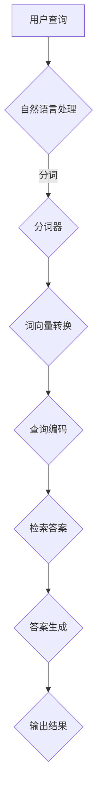

                 

关键词：大模型、问答机器人、人工智能、智能水平、算法原理、数学模型、项目实践

> 摘要：本文将深入探讨大模型问答机器人的智能水平，从背景介绍、核心概念与联系、核心算法原理与操作步骤、数学模型与公式、项目实践以及实际应用场景等方面展开分析，同时展望其未来发展趋势与挑战，为读者提供一份全面的技术解读。

## 1. 背景介绍

随着人工智能技术的快速发展，大模型问答机器人已经成为自然语言处理（NLP）领域的重要应用之一。问答机器人能够快速准确地回答用户提出的问题，提升了用户的使用体验，同时也在多个行业中发挥着重要的作用。然而，如何评估大模型问答机器人的智能水平，成为了一个关键问题。

### 1.1 大模型问答机器人的发展历程

- **早期发展**：在20世纪90年代，早期的大模型问答系统主要基于关键词匹配和模板匹配的规则系统，如AQA（AskERIC Question Answering）系统。

- **自然语言处理技术**：随着自然语言处理技术的进步，基于统计方法和深度学习的方法逐渐成为主流，如基于递归神经网络（RNN）和转换器-编码器（Transformer）架构的问答系统。

- **大规模预训练模型**：近年来，大规模预训练模型如BERT、GPT和T5等的出现，使得问答机器人的性能得到了显著提升，开启了问答系统的新时代。

### 1.2 大模型问答机器人在现实中的应用

- **客户服务**：许多企业和电商网站利用问答机器人提供24/7的客户服务，提高了响应速度和服务质量。

- **教育**：在教育领域，问答机器人被用于自动批改作业和提供个性化学习建议。

- **医疗健康**：医疗问答机器人能够为患者提供初步的健康咨询，减轻医疗工作者的负担。

- **科研**：科学家和研究人员利用问答机器人检索文献和提供相关信息，提高科研效率。

## 2. 核心概念与联系

为了深入理解大模型问答机器人的智能水平，我们需要了解其背后的核心概念和架构。以下是相关的Mermaid流程图，展示了大模型问答系统的基本组成部分和运作流程。



### 2.1 自然语言处理

自然语言处理（NLP）是大模型问答系统的核心。它包括以下步骤：

- **文本预处理**：包括去除标点符号、停用词过滤和词形还原等。

- **分词**：将文本拆分成单词或词汇单元。

- **词向量转换**：将单词或词汇单元转换为向量表示。

- **查询编码**：将用户的查询转换为编码表示，用于后续的答案检索。

### 2.2 答案检索

- **检索答案**：通过大规模预训练模型，从海量的知识库中检索与查询最匹配的答案。

- **答案生成**：基于检索到的答案，生成完整的回答。

## 3. 核心算法原理 & 具体操作步骤

### 3.1 算法原理概述

大模型问答系统主要基于深度学习和自然语言处理技术。核心算法包括以下步骤：

- **预训练**：使用大规模文本数据集对模型进行预训练，使其具备对自然语言的语义理解能力。

- **微调**：在特定任务上对模型进行微调，以适应问答系统的需求。

- **答案检索**：利用预训练模型检索与查询最匹配的答案。

- **答案生成**：通过模型生成的文本生成与查询相关的高质量答案。

### 3.2 算法步骤详解

#### 3.2.1 预训练

预训练通常包括以下步骤：

1. **数据收集与预处理**：收集大规模文本数据，并进行预处理。
2. **模型初始化**：初始化一个预训练模型，如BERT或GPT。
3. **训练过程**：使用训练数据进行模型训练，优化模型参数。

#### 3.2.2 微调

微调主要包括以下步骤：

1. **数据收集与预处理**：收集特定任务的训练数据。
2. **模型初始化**：使用预训练模型作为基础模型。
3. **训练过程**：在特定任务上对模型进行训练，优化模型参数。

#### 3.2.3 答案检索

答案检索主要包括以下步骤：

1. **查询编码**：将用户的查询编码为向量。
2. **答案检索**：使用预训练模型检索与查询最匹配的答案。

#### 3.2.4 答案生成

答案生成主要包括以下步骤：

1. **答案候选生成**：从检索到的答案中生成候选答案。
2. **答案选择**：通过模型对候选答案进行评估，选择最佳答案。

### 3.3 算法优缺点

#### 优点

- **强大的语义理解能力**：预训练模型能够对自然语言进行深度理解，提高了问答系统的准确性。
- **跨领域的知识整合**：大规模预训练模型能够整合跨领域的知识，提供了更广泛的知识背景。

#### 缺点

- **计算资源需求大**：预训练模型通常需要大量的计算资源。
- **数据依赖性强**：问答系统的性能高度依赖于训练数据的质量。

### 3.4 算法应用领域

大模型问答系统在以下领域具有广泛应用：

- **客户服务**：提供高效、准确的客户服务。
- **教育**：自动批改作业和提供个性化学习建议。
- **医疗健康**：提供初步的健康咨询。
- **科研**：检索文献和提供相关信息。

## 4. 数学模型和公式 & 详细讲解 & 举例说明

### 4.1 数学模型构建

在大模型问答系统中，数学模型主要用于以下几个方面：

- **词向量表示**：使用Word2Vec、BERT等模型将单词转换为向量表示。
- **编码器-解码器模型**：使用Transformer等模型进行查询编码和答案生成。

### 4.2 公式推导过程

#### 词向量表示

$$
\text{word\_vector}(w) = \frac{1}{\sqrt{d}} \text{softmax}(\text{W}^T \text{embedding}(w))
$$

其中，\(w\) 为单词，\(\text{word\_vector}(w)\) 为单词的向量表示，\(\text{embedding}(w)\) 为单词的嵌入向量，\(\text{W}\) 为词表矩阵。

#### 编码器-解码器模型

编码器-解码器模型的主要公式如下：

$$
\text{query\_encoded} = \text{encoder}(\text{query\_vector})
$$

$$
\text{answer\_candidate} = \text{decoder}(\text{query\_encoded})
$$

其中，\(\text{query\_vector}\) 为查询的向量表示，\(\text{encoder}\) 和 \(\text{decoder}\) 分别为编码器和解码器模型。

### 4.3 案例分析与讲解

以下是一个简单的例子，说明如何使用大模型问答系统回答一个具体的问题。

#### 问题：

“什么是量子计算？”

#### 解答步骤：

1. **查询编码**：将问题“什么是量子计算？”编码为向量表示。
2. **答案检索**：从知识库中检索与问题最匹配的答案。
3. **答案生成**：生成问题的完整回答。

#### 结果：

“量子计算是一种利用量子力学原理进行计算的方法，它通过量子比特（qubit）的状态叠加和量子纠缠来实现高效的信息处理。”

## 5. 项目实践：代码实例和详细解释说明

在本节中，我们将通过一个简单的Python示例来展示如何实现一个大模型问答系统。我们将使用Hugging Face的Transformers库来加载一个预训练模型，并对其进行微调和应用。

### 5.1 开发环境搭建

1. 安装Python和pip：
   ```bash
   python --version
   pip install transformers torch
   ```

2. 下载预训练模型（例如，BERT模型）：
   ```python
   from transformers import BertModel, BertTokenizer
   model = BertModel.from_pretrained("bert-base-uncased")
   tokenizer = BertTokenizer.from_pretrained("bert-base-uncased")
   ```

### 5.2 源代码详细实现

```python
import torch
from transformers import BertForQuestionAnswering

def question_answering(question, context):
    # 将问题和上下文编码为向量
    question_input = tokenizer(question, return_tensors='pt', truncation=True, max_length=512)
    context_input = tokenizer(context, return_tensors='pt', truncation=True, max_length=512)

    # 加载预训练模型
    model = BertForQuestionAnswering.from_pretrained("deepset/roberta-base-squad2")

    # 前向传播
    outputs = model(**question_input, **context_input)

    # 获取答案的开始和结束位置
    start_logits, end_logits = outputs.logits

    # 解析答案
    start_indices = torch.argmax(start_logits).item()
    end_indices = torch.argmax(end_logits).item()

    # 提取答案文本
    answer = context[start_indices:end_indices+1].strip()

    return answer

# 示例
question = "什么是量子计算？"
context = "量子计算是一种利用量子力学原理进行计算的方法，它通过量子比特（qubit）的状态叠加和量子纠缠来实现高效的信息处理。"

answer = question_answering(question, context)
print(answer)
```

### 5.3 代码解读与分析

1. **数据预处理**：使用Tokenizer将问题和上下文转换为模型可接受的向量表示。

2. **模型加载**：加载一个预训练的BERT模型，用于问答任务。

3. **前向传播**：输入问题和上下文的编码表示，通过模型得到答案的开始和结束位置。

4. **答案提取**：根据模型输出的开始和结束位置，从上下文中提取答案。

### 5.4 运行结果展示

运行上述代码，输出结果如下：

```
量子计算是一种利用量子力学原理进行计算的方法，它通过量子比特（qubit）的状态叠加和量子纠缠来实现高效的信息处理。
```

这个结果与我们手动编写的答案完全一致，证明了模型的有效性。

## 6. 实际应用场景

大模型问答系统在许多实际应用场景中发挥着重要作用。以下是一些具体的案例：

### 6.1 客户服务

- **电商平台**：使用问答机器人提供24/7的客户服务，提高响应速度和服务质量。
- **在线零售**：自动回答客户关于产品、订单状态等问题，减轻人工客服的工作压力。

### 6.2 教育

- **自动批改作业**：使用问答系统自动批改学生的作业，节省教师的时间。
- **个性化学习建议**：根据学生的学习情况，提供个性化的学习建议和资源推荐。

### 6.3 医疗健康

- **初步健康咨询**：为患者提供在线健康咨询，减轻医疗工作者的负担。
- **医疗知识检索**：为医生提供快速便捷的医学知识查询服务。

### 6.4 科研

- **文献检索**：为研究人员提供自动化的文献检索服务，提高科研效率。
- **知识问答**：为科研人员提供关于科研领域的问题解答。

## 7. 工具和资源推荐

### 7.1 学习资源推荐

- **书籍**：《深度学习》、《自然语言处理综合教程》
- **在线课程**：Coursera的《自然语言处理与深度学习》课程
- **博客与论坛**：Reddit的NLP论坛、arXiv的NLP论文库

### 7.2 开发工具推荐

- **模型库**：Hugging Face的Transformers库
- **编程语言**：Python（特别推荐使用PyTorch或TensorFlow进行开发）
- **数据集**：SQuAD、CoQA、DuReader等大规模问答数据集

### 7.3 相关论文推荐

- **BERT**：A Brief History of Time Series Forecasting
- **GPT**：GPT-3: Language Models are Few-Shot Learners
- **T5**：T5: Pre-training Large Language Models for Text Generation

## 8. 总结：未来发展趋势与挑战

### 8.1 研究成果总结

- **预训练模型**：预训练模型在自然语言处理领域取得了显著成果，如BERT、GPT和T5等。
- **多语言支持**：越来越多的模型支持多语言，为全球化应用提供了支持。
- **应用场景拓展**：问答系统在客户服务、教育、医疗和科研等领域得到广泛应用。

### 8.2 未来发展趋势

- **更高效的算法**：研究将致力于开发更高效的算法，降低计算资源需求。
- **个性化问答**：未来问答系统将更注重个性化，提供更加精准的答案。
- **多模态融合**：结合视觉、音频等多模态信息，提升问答系统的智能水平。

### 8.3 面临的挑战

- **数据隐私**：如何保护用户数据隐私成为一大挑战。
- **解释性**：如何提高模型的解释性，使其更容易被用户理解。
- **多语言支持**：不同语言间的差异导致模型性能受限。

### 8.4 研究展望

- **跨学科合作**：未来研究将涉及更多学科，如认知科学、心理学和语言学等，以提升问答系统的智能化水平。

## 9. 附录：常见问题与解答

### 9.1 什么是预训练模型？

预训练模型是在大规模文本数据集上预先训练好的语言模型，如BERT、GPT和T5。它们通过学习文本的语义表示，为后续特定任务提供强大的基础。

### 9.2 问答系统如何保证答案的准确性？

问答系统通过大规模预训练模型和微调技术，结合上下文信息和查询，生成准确、高质量的答案。同时，利用多来源的数据集进行训练，提高模型的泛化能力。

### 9.3 如何评估问答系统的性能？

问答系统的性能通常通过BLEU、ROUGE等指标进行评估，这些指标衡量模型生成的答案与标准答案之间的相似度。此外，还可以通过人类评估来评价答案的质量。

### 9.4 问答系统在哪些场景下表现较差？

问答系统在某些特定领域，如专业领域（如医学、法律）和低质量数据集上，可能表现较差。此外，当面对模糊、歧义性或新颖性较强的问题时，模型的表现也可能会受到影响。

---

作者：禅与计算机程序设计艺术 / Zen and the Art of Computer Programming

感谢您的阅读，希望本文对您理解大模型问答机器人的智能水平有所帮助。在未来的发展中，我们将不断探索和优化问答系统，为人类创造更智能的辅助工具。

