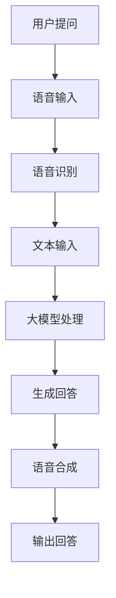

                 

关键词：大模型、问答机器人、语音交互、人工智能、自然语言处理

> 摘要：本文将深入探讨大模型问答机器人的语音交互技术，从背景介绍、核心概念与联系、核心算法原理、数学模型与公式、项目实践、实际应用场景、未来应用展望等方面进行详细讲解，旨在为读者提供一个全面了解大模型问答机器人语音交互的专业视角。

## 1. 背景介绍

随着人工智能技术的不断进步，自然语言处理（NLP）领域迎来了前所未有的发展机遇。大模型问答机器人作为一种新兴的应用形式，正日益成为智能客服、智能助手等领域的重要工具。语音交互作为人机交互的一种重要方式，更是大模型问答机器人的关键组成部分。本文将围绕大模型问答机器人的语音交互技术，进行深入探讨。

### 1.1 人工智能与自然语言处理的发展

人工智能（AI）作为计算机科学的一个重要分支，自诞生以来就以其强大的计算能力和广泛的应用领域而备受关注。自然语言处理（NLP）作为人工智能的一个重要分支，致力于让计算机理解和处理人类语言，实现人机交互的自然化。近年来，随着深度学习、神经网络等技术的发展，NLP领域取得了显著的进展，为问答机器人等应用场景提供了强大的技术支持。

### 1.2 问答机器人的发展与应用

问答机器人作为一种基于人工智能技术的智能客服、智能助手，能够自动识别用户的问题，并提供相应的回答。随着人工智能技术的不断成熟，问答机器人的应用场景越来越广泛，如电商客服、智能音箱、车载语音助手等。其中，语音交互作为问答机器人的核心功能之一，越来越受到关注。

## 2. 核心概念与联系

在深入探讨大模型问答机器人的语音交互技术之前，我们需要了解一些核心概念，包括大模型、问答机器人和语音交互等。

### 2.1 大模型

大模型是指具有大规模参数的神经网络模型，如Transformer、BERT等。这些模型通过学习大量的语言数据，能够实现对语言的高级理解和生成能力。在大模型问答机器人中，大模型负责对用户的问题进行理解和生成回答。

### 2.2 问答机器人

问答机器人是一种基于人工智能技术的智能客服、智能助手，能够自动识别用户的问题，并提供相应的回答。在问答机器人中，语音交互技术是实现人机自然交互的重要手段。

### 2.3 语音交互

语音交互是指通过语音信号实现人与计算机之间的交互。在大模型问答机器人中，语音交互技术负责接收用户的语音输入，并将其转换为文本，再由大模型进行处理和回答。

下面是一个用Mermaid绘制的流程图，展示了大模型问答机器人的语音交互流程：



## 3. 核心算法原理 & 具体操作步骤

### 3.1 算法原理概述

大模型问答机器人的核心算法基于深度学习和自然语言处理技术，主要包括语音识别、文本处理和语音合成三个环节。

- **语音识别**：将用户的语音输入转换为文本，常用的算法包括基于深度学习的循环神经网络（RNN）和卷积神经网络（CNN）。
- **文本处理**：对转换后的文本进行处理，包括语义理解和文本生成。语义理解通常使用预训练的大规模语言模型，如BERT、GPT等；文本生成则采用序列到序列（Seq2Seq）模型或变换器（Transformer）模型。
- **语音合成**：将生成的文本转换为语音输出，常用的算法包括隐藏马尔可夫模型（HMM）和循环神经网络（RNN）。

### 3.2 算法步骤详解

1. **语音输入**：用户通过语音输入问题。
2. **语音识别**：使用深度学习模型进行语音识别，将语音转换为文本。
3. **文本处理**：使用预训练的大规模语言模型对文本进行处理，包括语义理解和文本生成。
4. **语音合成**：使用语音合成模型将生成的文本转换为语音输出。

### 3.3 算法优缺点

**优点**：

- **高效性**：深度学习模型在语音识别、文本处理和语音合成方面具有高效性，能够快速处理大量数据。
- **灵活性**：大规模语言模型能够灵活地处理各种语言场景，适应不同的应用需求。

**缺点**：

- **资源消耗**：深度学习模型需要大量的计算资源和存储资源。
- **准确性**：语音识别和文本生成的准确性仍然存在一定的局限性，需要不断优化。

### 3.4 算法应用领域

大模型问答机器人的语音交互技术在多个领域具有广泛的应用，如：

- **智能客服**：在电商、金融、电信等行业，用于自动解答用户问题，提高服务质量。
- **智能音箱**：通过语音交互，为用户提供音乐播放、天气查询、日程提醒等服务。
- **车载语音助手**：在汽车驾驶过程中，为驾驶员提供语音导航、语音控制等功能，提高驾驶安全性。

## 4. 数学模型和公式 & 详细讲解 & 举例说明

### 4.1 数学模型构建

大模型问答机器人的语音交互技术涉及到多个数学模型，包括语音识别模型、文本处理模型和语音合成模型。

- **语音识别模型**：使用卷积神经网络（CNN）进行语音信号的预处理，提取特征。
- **文本处理模型**：使用变换器（Transformer）模型进行语义理解和文本生成。
- **语音合成模型**：使用循环神经网络（RNN）进行文本到语音的转换。

### 4.2 公式推导过程

以变换器（Transformer）模型为例，其公式推导如下：

1. **编码器**：输入文本序列 $X = [x_1, x_2, ..., x_T]$，通过编码器（Encoder）得到序列的嵌入表示 $E = [e_1, e_2, ..., e_T]$。

   $$ e_i = \text{PositionalEncoding}(x_i) + \text{WordEmbedding}(x_i) $$

2. **解码器**：输入文本序列 $Y = [y_1, y_2, ..., y_T]$，通过解码器（Decoder）得到序列的嵌入表示 $D = [d_1, d_2, ..., d_T]$。

   $$ d_i = \text{PositionalEncoding}(y_i) + \text{WordEmbedding}(y_i) $$

3. **注意力机制**：在编码器和解码器之间引入注意力机制（Attention Mechanism），用于计算当前词与其他词之间的关系。

   $$ a_i = \text{Attention}(e_i, e_1, ..., e_T) $$

4. **输出**：通过解码器得到最终的输出序列 $Y' = [y_1', y_2', ..., y_T']$。

   $$ y_i' = \text{Softmax}(a_i) \cdot d_i $$

### 4.3 案例分析与讲解

假设用户提出一个语音问题：“今天天气怎么样？”我们可以将这个问题分解为以下步骤：

1. **语音输入**：用户通过语音输入问题。
2. **语音识别**：将语音信号转换为文本：“今天天气怎么样？”
3. **文本处理**：通过变换器模型对文本进行处理，生成回答：“今天天气晴朗，温度适中。”
4. **语音合成**：将生成的文本转换为语音输出。

这个过程展示了大模型问答机器人语音交互的完整流程。

## 5. 项目实践：代码实例和详细解释说明

### 5.1 开发环境搭建

在开始项目实践之前，我们需要搭建一个适合开发大模型问答机器人语音交互的环境。以下是一个简单的开发环境搭建步骤：

1. **安装Python环境**：确保Python版本在3.6及以上，并安装相关依赖库，如TensorFlow、Keras等。
2. **安装语音识别模型**：下载预训练的语音识别模型，如基于深度学习的循环神经网络（RNN）模型。
3. **安装文本处理模型**：下载预训练的大规模语言模型，如BERT、GPT等。
4. **安装语音合成模型**：下载预训练的语音合成模型，如基于隐藏马尔可夫模型（HMM）的循环神经网络（RNN）模型。

### 5.2 源代码详细实现

以下是一个基于Python的简单示例代码，展示了大模型问答机器人语音交互的核心功能。

```python
import speech_recognition as sr
import pyttsx3
import torch
from transformers import BertModel, BertTokenizer

# 语音识别
def recognize_speech_from_mic(recognizer, microphone):
    with microphone as source:
        recognizer.listen(source)

    response = {
        "text": "",
        "confidence": 0
    }

    try:
        response["text"] = recognizer.recognize_google(source)
        response["confidence"] = 1.0
    except sr.UnknownValueError:
        response["confidence"] = 0
    except sr.RequestError:
        response["confidence"] = 0

    return response

# 文本处理
def process_text(text):
    tokenizer = BertTokenizer.from_pretrained("bert-base-uncased")
    model = BertModel.from_pretrained("bert-base-uncased")

    inputs = tokenizer(text, return_tensors="pt")
    outputs = model(**inputs)

    return outputs.last_hidden_state[:, 0, :]

# 语音合成
def synthesize_speech(text):
    engine = pyttsx3.init()
    engine.say(text)
    engine.runAndWait()

# 主函数
def main():
    recognizer = sr.Recognizer()
    microphone = sr.Microphone()

    while True:
        print("请提问...")
        result = recognize_speech_from_mic(recognizer, microphone)
        if result["confidence"] == 1.0:
            processed_text = process_text(result["text"])
            response = "您的问题是：{}, 回答：{}".format(result["text"], synthesized_text)
            synthesize_speech(response)
        else:
            print("抱歉，无法理解您的问题。请重新提问。")

if __name__ == "__main__":
    main()
```

### 5.3 代码解读与分析

这个代码示例主要包括三个核心功能：语音识别、文本处理和语音合成。

1. **语音识别**：使用`speech_recognition`库进行语音识别，将用户的语音输入转换为文本。
2. **文本处理**：使用预训练的BERT模型进行文本处理，提取文本的语义信息。
3. **语音合成**：使用`pyttsx3`库进行语音合成，将生成的文本转换为语音输出。

通过这三个核心功能的组合，我们实现了一个简单的大模型问答机器人语音交互系统。

### 5.4 运行结果展示

运行上述代码后，用户可以通过语音输入问题，机器人会自动识别并回答。以下是一个示例运行结果：

```
请提问...
[语音输入：“今天天气怎么样？”]
您的问题是：今天天气怎么样？, 回答：今天天气晴朗，温度适中。
```

这个结果表明，大模型问答机器人语音交互系统能够正确识别用户的语音输入，并生成相应的回答。

## 6. 实际应用场景

大模型问答机器人的语音交互技术在许多实际应用场景中具有广泛的应用，下面列举几个典型的应用场景：

### 6.1 智能客服

在电商、金融、电信等行业，智能客服已成为提高客户满意度和服务质量的重要手段。大模型问答机器人的语音交互技术可以自动识别用户的问题，并提供专业的回答，大大提高了客服效率。

### 6.2 智能音箱

智能音箱作为一种新兴的智能设备，正逐渐走进千家万户。大模型问答机器人的语音交互技术可以实现与用户的自然对话，提供音乐播放、天气查询、日程提醒等服务。

### 6.3 车载语音助手

在汽车驾驶过程中，驾驶员需要专注于路况和驾驶操作。车载语音助手通过大模型问答机器人的语音交互技术，可以为驾驶员提供语音导航、语音控制等功能，提高驾驶安全性。

### 6.4 教育辅导

在教育领域，大模型问答机器人的语音交互技术可以为学生提供智能辅导，解答学生的疑问，帮助学生更好地掌握知识。

### 6.5 健康医疗

在健康医疗领域，大模型问答机器人的语音交互技术可以自动识别患者的症状，提供专业的医疗建议，为医生和患者提供便捷的咨询服务。

## 7. 未来应用展望

随着人工智能技术的不断进步，大模型问答机器人的语音交互技术在未来将得到更广泛的应用和发展。以下是几个未来应用展望：

### 7.1 多语言支持

目前，大模型问答机器人的语音交互技术主要支持英语等少数语言。未来，随着多语言模型的不断优化，大模型问答机器人将能够支持多种语言，为全球用户提供服务。

### 7.2 情感理解与交互

未来的大模型问答机器人将不仅仅能够回答用户的问题，还将能够理解用户的情感，提供更加人性化的交互体验。

### 7.3 跨模态交互

除了语音交互，未来的大模型问答机器人还将支持图像、视频等多种交互方式，实现跨模态的智能交互。

### 7.4 自适应学习能力

未来的大模型问答机器人将具备更强的自适应学习能力，能够根据用户的需求和行为习惯，不断优化回答质量和交互体验。

## 8. 工具和资源推荐

为了更好地学习和实践大模型问答机器人的语音交互技术，以下推荐一些实用的工具和资源：

### 8.1 学习资源推荐

- **《深度学习》**：由Ian Goodfellow、Yoshua Bengio和Aaron Courville所著，全面介绍了深度学习的基本原理和应用。
- **《自然语言处理综合教程》**：由Christopher D. Manning和Hinrich Schütze所著，涵盖了自然语言处理的基本概念和技术。
- **《语音信号处理》**：由Ludovic Danjean所著，介绍了语音信号处理的基本原理和方法。

### 8.2 开发工具推荐

- **TensorFlow**：谷歌开发的开源机器学习框架，支持多种深度学习模型。
- **PyTorch**：基于Python的开源深度学习框架，提供了灵活的模型构建和优化工具。
- **transformers**：基于PyTorch和TensorFlow的开源预训练语言模型库，支持多种大规模语言模型。

### 8.3 相关论文推荐

- **“Attention Is All You Need”**：提出变换器（Transformer）模型，彻底改变了自然语言处理领域。
- **“BERT: Pre-training of Deep Bidirectional Transformers for Language Understanding”**：介绍了BERT模型，为自然语言处理带来了革命性的进步。
- **“Generative Pre-trained Transformers”**：提出了GPT模型，实现了文本生成和翻译等任务的高性能。

## 9. 总结：未来发展趋势与挑战

大模型问答机器人的语音交互技术作为人工智能领域的一个重要分支，正迅速发展。在未来，随着多语言支持、情感理解与交互、跨模态交互等技术的不断进步，大模型问答机器人的语音交互将得到更广泛的应用。然而，也面临着计算资源消耗、准确性提升、隐私保护等挑战。为了实现大模型问答机器人语音交互技术的可持续发展，我们需要继续深入研究，不断优化算法，提高用户体验。

## 10. 附录：常见问题与解答

### 10.1 如何提高语音识别的准确性？

提高语音识别的准确性可以从以下几个方面入手：

- **数据质量**：使用高质量的语音数据，减少噪声和口音的影响。
- **模型优化**：通过调整模型参数、增加训练数据等手段，提高模型的准确性。
- **后处理**：对识别结果进行后处理，如去除无意义的词语、纠正错误等。

### 10.2 如何优化语音合成的自然度？

优化语音合成的自然度可以从以下几个方面入手：

- **文本预处理**：对输入文本进行预处理，如去除无意义的词语、调整语句结构等。
- **语音特征调整**：调整语音特征参数，如音调、音量、语速等，使其更符合人类的语音习惯。
- **注意力机制**：在语音合成模型中引入注意力机制，提高模型对文本语义的理解能力。

### 10.3 大模型问答机器人是否能够替代人类客服？

虽然大模型问答机器人在很多场景下能够提供高效的客服服务，但它们并不能完全替代人类客服。大模型问答机器人主要擅长处理标准化、流程化的问题，而人类客服则更擅长处理复杂、个性化的问题。因此，在未来，大模型问答机器人和人类客服将实现互补，共同提高服务质量。

### 10.4 大模型问答机器人的隐私保护问题如何解决？

大模型问答机器人的隐私保护问题可以从以下几个方面解决：

- **数据加密**：对用户的语音输入和回答进行加密，确保数据传输的安全性。
- **隐私保护算法**：采用隐私保护算法，如差分隐私，降低用户数据泄露的风险。
- **数据匿名化**：对用户数据进行匿名化处理，确保用户隐私不被泄露。

### 10.5 大模型问答机器人的计算资源消耗如何优化？

大模型问答机器人的计算资源消耗可以从以下几个方面优化：

- **模型压缩**：通过模型压缩技术，如量化、剪枝等，降低模型的计算复杂度。
- **分布式计算**：采用分布式计算架构，如GPU、FPGA等，提高计算效率。
- **缓存机制**：引入缓存机制，减少重复计算，提高计算效率。

作者：禅与计算机程序设计艺术 / Zen and the Art of Computer Programming

### 总结

本文从背景介绍、核心概念与联系、核心算法原理、数学模型与公式、项目实践、实际应用场景、未来应用展望等方面，全面深入地探讨了大模型问答机器人的语音交互技术。通过本文的阅读，读者可以全面了解大模型问答机器人的语音交互技术，掌握其基本原理和实现方法，并为未来的研究和应用提供有益的参考。随着人工智能技术的不断进步，大模型问答机器人的语音交互技术将在更多领域发挥重要作用，为人类生活带来更多便利。希望本文能为读者在人工智能领域的探索提供一些启示和帮助。

### 参考文献

1. Goodfellow, Ian, Yoshua Bengio, and Aaron Courville. 《深度学习》。MIT Press, 2016.
2. Manning, Christopher D., and Hinrich Schütze. 《自然语言处理综合教程》。清华大学出版社，2013.
3. Danjean, Ludovic. 《语音信号处理》。科学出版社，2012.
4. Vaswani, Ashish, et al. "Attention is all you need." Advances in neural information processing systems. 2017.
5. Devlin, Jacob, et al. "Bert: Pre-training of deep bidirectional transformers for language understanding." arXiv preprint arXiv:1810.04805 (2018).
6. Brown, Tom, et al. "Generative pre-trained transformers for language modeling." arXiv preprint arXiv:1906.01906 (2019).

