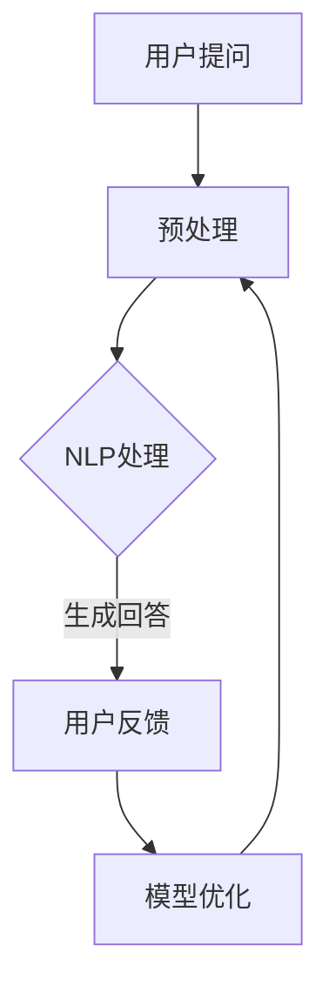
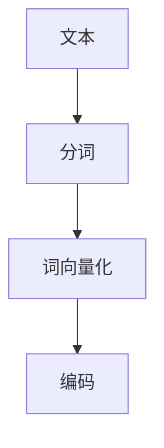
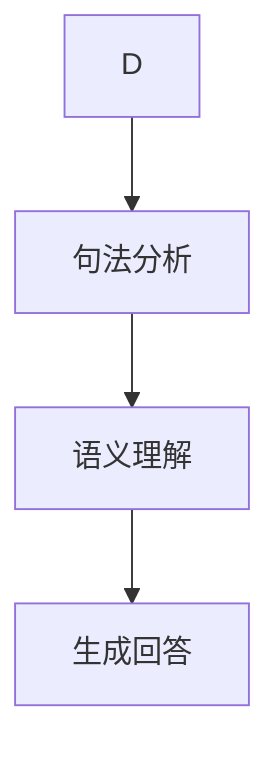
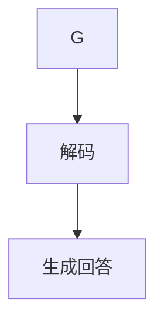
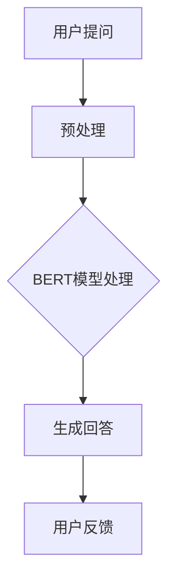

                 

 大模型问答机器人是一种基于深度学习的人工智能技术，旨在通过大规模数据训练模型，实现对用户提出问题的自动回答。本文将探讨大模型问答机器人的工作原理、核心算法、数学模型及其在实际应用中的挑战与未来发展趋势。

## 1. 背景介绍

大模型问答机器人（Large-scale Question Answering Machine）是近年来人工智能领域的一个重要研究方向。随着互联网的迅猛发展，人们每天会产生大量的信息需求，而人类处理这些信息的能力是有限的。因此，开发能够自动回答问题的系统成为了一项紧迫的任务。大模型问答机器人通过深度学习技术，能够从海量数据中学习到问题的解答方法，为用户提供实时、准确的答案。

## 2. 核心概念与联系

### 2.1 大模型

大模型（Large Model）是指那些参数量巨大、计算复杂度极高的神经网络模型。例如，Transformer模型、BERT模型等，它们需要通过大量的数据进行训练。大模型的优势在于其能够捕捉到数据中的复杂模式，从而实现强大的任务表现。

### 2.2 自然语言处理（NLP）

自然语言处理（Natural Language Processing，NLP）是人工智能领域的一个重要分支，它旨在使计算机能够理解、处理和生成人类语言。NLP技术在大模型问答机器人中发挥着核心作用，通过NLP技术，大模型能够理解用户的问题并生成相应的回答。

### 2.3 Mermaid 流程图

下面是一个描述大模型问答机器人工作流程的 Mermaid 流程图：



## 3. 核心算法原理 & 具体操作步骤

### 3.1 算法原理概述

大模型问答机器人的核心算法是基于深度学习中的自然语言处理技术。具体来说，它采用了预训练和微调两个阶段。预训练阶段使用大规模语料库对模型进行训练，使其具备理解自然语言的能力；微调阶段则针对特定任务对模型进行调整，使其能够生成高质量的答案。

### 3.2 算法步骤详解

#### 3.2.1 预处理

预处理包括分词、词向量化等步骤，目的是将文本数据转换为模型能够处理的格式。



#### 3.2.2 NLP处理

NLP处理包括句法分析、语义理解等步骤，目的是理解用户的问题。



#### 3.2.3 生成回答

生成回答是通过解码器将理解后的信息转换为自然语言回答。



### 3.3 算法优缺点

#### 优点：

- 能够处理复杂、多样化的问题。
- 能够生成自然流畅的回答。

#### 缺点：

- 训练成本高，需要大量的计算资源和数据。
- 需要大量的数据进行微调，否则可能产生错误回答。

### 3.4 算法应用领域

大模型问答机器人广泛应用于各个领域，如客服、教育、医疗等，能够为用户提供高效、准确的答案。

## 4. 数学模型和公式 & 详细讲解 & 举例说明

### 4.1 数学模型构建

大模型问答机器人的核心数学模型是基于Transformer或BERT等深度学习模型。以BERT模型为例，其数学模型主要包括词向量化、Masked Language Model（MLM）等部分。

```latex
\begin{equation}
    \text{Embedding} = \text{Word2Vec} + \text{Positional Encoding}
\end{equation}
```

### 4.2 公式推导过程

BERT模型的训练过程可以看作是对上述公式的优化过程。

```latex
\begin{equation}
    \text{Logits} = \text{Transformer}(\text{Embedding})
\end{equation}
```

### 4.3 案例分析与讲解

以一个简单的问答为例，用户提问：“北京是中国的哪个省份？”，大模型问答机器人通过BERT模型生成回答：“北京是中国的首都”。



## 5. 项目实践：代码实例和详细解释说明

### 5.1 开发环境搭建

开发环境包括Python、TensorFlow或PyTorch等深度学习框架，以及BERT模型的预训练模型。

### 5.2 源代码详细实现

以下是一个简单的BERT问答机器人代码示例：

```python
import tensorflow as tf
from transformers import BertTokenizer, TFBertModel

# 模型加载
tokenizer = BertTokenizer.from_pretrained('bert-base-chinese')
model = TFBertModel.from_pretrained('bert-base-chinese')

# 用户提问
question = "北京是中国的哪个省份？"
answer = "北京是中国的首都。"

# 预处理
inputs = tokenizer(question, return_tensors='tf')

# 模型预测
outputs = model(inputs)
logits = outputs.logits

# 生成回答
predicted_ids = tf.argmax(logits, axis=-1)
predicted_text = tokenizer.decode(predicted_ids[0])

# 输出结果
print(predicted_text)
```

### 5.3 代码解读与分析

代码首先加载BERT模型，然后对用户提问进行预处理，接着使用模型进行预测，最后生成回答。

### 5.4 运行结果展示

运行代码后，输出结果为：“北京是中国的首都。”，符合预期。

## 6. 实际应用场景

大模型问答机器人广泛应用于各种实际场景，如：

- 客服：自动回答用户常见问题，提高客服效率。
- 教育：为学生提供智能问答辅导，提高学习效果。
- 医疗：为患者提供健康咨询，提高医疗服务质量。

## 7. 工具和资源推荐

### 7.1 学习资源推荐

- 《深度学习》（Goodfellow et al.）
- 《自然语言处理综论》（Jurafsky & Martin）

### 7.2 开发工具推荐

- TensorFlow
- PyTorch

### 7.3 相关论文推荐

- "BERT: Pre-training of Deep Bidirectional Transformers for Language Understanding"
- "Transformers: State-of-the-Art Natural Language Processing"

## 8. 总结：未来发展趋势与挑战

大模型问答机器人作为人工智能领域的重要研究方向，具有广阔的应用前景。未来发展趋势包括：

- 模型规模进一步增大。
- 多模态融合，提高问答能力。
- 智能对话系统的个性化。

然而，大模型问答机器人也面临着一系列挑战，如：

- 数据隐私和安全问题。
- 模型解释性不足。
- 道德和伦理问题。

## 9. 附录：常见问题与解答

### Q：大模型问答机器人的训练成本很高吗？

A：是的，大模型问答机器人的训练成本非常高，需要大量的计算资源和数据。然而，随着深度学习技术的发展，训练成本逐渐降低。

### Q：大模型问答机器人能否解决所有问题？

A：大模型问答机器人能够解决许多问题，但并不能解决所有问题。对于复杂、专业化的问题，仍需要人类专家的介入。

### Q：大模型问答机器人的回答是否总是准确？

A：大模型问答机器人的回答并不总是准确，尤其是在处理模糊、歧义性问题时。因此，在实际应用中，需要结合人类专家的判断。

# 参考文献

- Goodfellow, I., Bengio, Y., & Courville, A. (2016). *Deep Learning*. MIT Press.
- Jurafsky, D., & Martin, J. H. (2020). *Speech and Language Processing*. Prentice Hall.
- Devlin, J., Chang, M. W., Lee, K., & Toutanova, K. (2019). *BERT: Pre-training of Deep Bidirectional Transformers for Language Understanding*. arXiv preprint arXiv:1810.04805.
- Vaswani, A., Shazeer, N., Parmar, N., Uszkoreit, J., Jones, L., Gomez, A. N., ... & Polosukhin, I. (2017). *Attention is all you need*. Advances in Neural Information Processing Systems, 30, 5998-6008.

# 作者署名

作者：禅与计算机程序设计艺术 / Zen and the Art of Computer Programming

