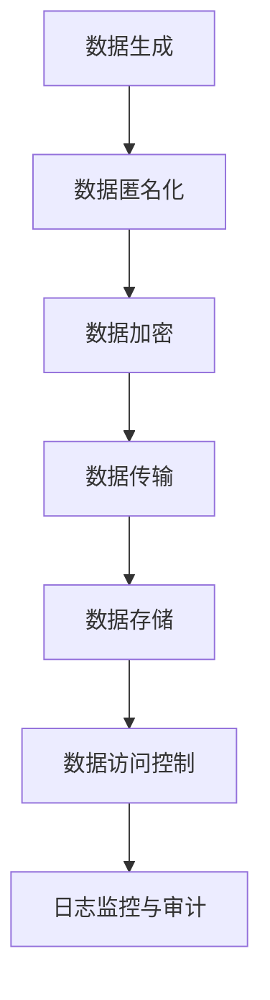

                 

关键词：大模型，隐私保护，数据安全，加密技术，安全协议，算法优化，应用场景

## 摘要

本文旨在探讨大模型隐私保护的重要性和当前可行的技术手段。随着大数据和人工智能技术的发展，大型模型在各个领域取得了显著的成就。然而，这些模型的训练和部署过程中往往伴随着大量的敏感数据，如个人隐私信息等。因此，确保这些数据在传输、存储和使用过程中的安全性显得尤为重要。本文将介绍多种技术手段，包括加密技术、安全协议和算法优化等，以保护大模型的隐私安全。

## 1. 背景介绍

### 大模型的发展

近年来，深度学习和大数据技术的飞速发展，催生了众多大型模型，如深度神经网络、生成对抗网络（GAN）等。这些模型在图像识别、自然语言处理、推荐系统等应用中表现出色，极大地推动了人工智能的发展。然而，这些大型模型往往依赖于大量的训练数据，这些数据中往往包含了大量的个人隐私信息。

### 数据隐私问题的严峻性

随着数据隐私问题的日益突出，如何在大模型训练和部署过程中保护用户隐私成为了学术界和工业界关注的焦点。不当的数据处理可能导致个人隐私泄露，给用户带来严重的经济损失和心理负担。因此，确保大模型隐私保护成为了一个亟待解决的问题。

### 大模型隐私保护的重要性

1. **法律法规的要求**：随着各国数据保护法律的出台，如欧盟的《通用数据保护条例》（GDPR）和美国加州的《消费者隐私法案》（CCPA），保护用户数据隐私已成为法律义务。
2. **商业竞争的驱动力**：拥有高隐私保护水平的企业能够赢得用户的信任，从而在市场竞争中占据优势。
3. **社会伦理的呼唤**：保护用户隐私是维护社会公平和正义的重要手段。

## 2. 核心概念与联系

### 数据隐私保护的基本概念

1. **隐私**：隐私是指个体对于其个人信息享有的控制权，包括信息的访问、使用、分享等。
2. **隐私保护**：隐私保护是指采取一系列技术和管理措施，以确保个人信息在收集、存储、处理、传输和销毁等各个环节的安全。
3. **数据匿名化**：数据匿名化是指通过技术手段去除或模糊化数据中的个人标识信息，使其无法被直接识别。

### 大模型隐私保护的架构

为了实现大模型隐私保护，我们需要从数据生成、数据存储、数据传输等多个环节进行综合考虑。以下是一个简化的隐私保护架构：



### 数据匿名化

数据匿名化的目的是去除或模糊化数据中的个人标识信息，使其无法被直接识别。常见的数据匿名化技术包括：

1. **K-匿名性**：数据集中的每个记录至少被k个其他记录所掩盖，使得单个记录无法被单独识别。
2. **l-diversity**：数据集中至少存在l个不同的记录，这些记录都掩盖了同一个敏感值。
3. **t-closeness**：数据集中与敏感值相近的记录数量占总记录数的比例至少为t。

### 数据加密

数据加密是指通过加密算法将明文数据转换为密文，以防止未授权访问。常见的加密技术包括：

1. **对称加密**：使用相同的密钥进行加密和解密，如AES。
2. **非对称加密**：使用一对密钥进行加密和解密，如RSA。
3. **哈希函数**：用于将输入数据映射为固定长度的输出值，如SHA-256。

### 数据传输

数据传输过程中的隐私保护主要依赖于安全协议，如TLS/SSL等，以确保数据在传输过程中的机密性和完整性。

### 数据存储

数据存储过程中的隐私保护依赖于加密存储和访问控制策略。加密存储可以使用数据库加密技术，如Oracle Transparent Data Encryption（TDE）。访问控制则可以通过角色权限管理来实现。

### 数据访问控制

数据访问控制是通过管理用户权限来确保只有授权用户能够访问数据。常见的方法包括：

1. **基于角色的访问控制（RBAC）**：根据用户的角色分配权限。
2. **基于属性的访问控制（ABAC）**：根据用户的属性（如职位、部门等）分配权限。

### 日志监控与审计

日志监控与审计是确保数据隐私保护的有效手段。通过记录和分析系统日志，可以发现潜在的安全威胁和违规行为，并采取相应的措施。

## 3. 核心算法原理 & 具体操作步骤

### 3.1 算法原理概述

大模型隐私保护的核心算法主要包括数据匿名化、数据加密和访问控制等。以下将分别介绍这些算法的基本原理。

#### 数据匿名化

数据匿名化的主要算法包括：

1. **K-匿名性**：通过引入k个匿名记录，使得单个记录无法被单独识别。
2. **l-diversity**：确保数据集中与敏感值相近的记录数量满足l个要求。
3. **t-closeness**：确保数据集中与敏感值相近的记录数量占总记录数的比例满足t要求。

#### 数据加密

数据加密的主要算法包括：

1. **对称加密**：使用相同的密钥进行加密和解密，如AES。
2. **非对称加密**：使用一对密钥进行加密和解密，如RSA。
3. **哈希函数**：用于将输入数据映射为固定长度的输出值，如SHA-256。

#### 访问控制

访问控制的主要算法包括：

1. **基于角色的访问控制（RBAC）**：根据用户的角色分配权限。
2. **基于属性的访问控制（ABAC）**：根据用户的属性（如职位、部门等）分配权限。

### 3.2 算法步骤详解

#### 数据匿名化

1. **选择合适的匿名化算法**：根据数据的类型和隐私保护要求选择合适的匿名化算法。
2. **预处理数据**：对数据进行清洗、规范化等预处理操作。
3. **执行匿名化操作**：根据选定的匿名化算法对数据进行匿名化处理。
4. **验证匿名化效果**：通过对比匿名化前后的数据，验证匿名化效果是否满足隐私保护要求。

#### 数据加密

1. **选择加密算法和密钥**：根据数据的安全需求和计算能力选择合适的加密算法和密钥。
2. **加密数据**：使用选定的加密算法和密钥对数据进行加密。
3. **存储密钥**：将加密后的数据存储在安全的存储系统中，并确保密钥的安全存储。
4. **解密数据**：在需要访问数据时，使用密钥对数据进行解密。

#### 访问控制

1. **定义权限策略**：根据业务需求定义用户的角色和权限。
2. **权限分配**：将用户的角色和权限分配给相应的用户。
3. **权限验证**：在用户访问数据时，验证用户权限是否满足访问要求。
4. **日志记录**：记录用户的访问行为和权限验证结果，以便进行审计和监控。

### 3.3 算法优缺点

#### 数据匿名化

**优点**：

- **保护隐私**：通过匿名化技术，可以有效保护个人隐私信息。
- **降低攻击风险**：匿名化数据降低了潜在攻击者的攻击面。

**缺点**：

- **数据完整性**：匿名化可能导致部分数据信息的丢失，影响数据的完整性。
- **性能影响**：匿名化操作可能增加数据处理的复杂性，影响性能。

#### 数据加密

**优点**：

- **确保数据安全**：加密技术可以有效防止未授权访问。
- **灵活性**：支持多种加密算法和密钥管理策略。

**缺点**：

- **计算开销**：加密和解密操作需要额外的计算资源。
- **密钥管理**：密钥的安全管理是加密技术的关键，需要确保密钥的安全存储和传输。

#### 访问控制

**优点**：

- **精细化控制**：根据用户角色和属性分配权限，可以实现精细化的访问控制。
- **安全性**：可以有效防止未授权访问，降低数据泄露风险。

**缺点**：

- **复杂性**：访问控制策略的定义和实施可能增加系统的复杂性。
- **性能影响**：权限验证和日志记录可能增加系统的性能开销。

### 3.4 算法应用领域

#### 数据匿名化

- **医疗领域**：对医疗数据中的患者信息进行匿名化处理，保护患者隐私。
- **金融领域**：对金融交易数据中的个人信息进行匿名化处理，防止信息泄露。

#### 数据加密

- **互联网应用**：对用户数据进行加密存储和传输，确保用户隐私。
- **企业内部数据**：对敏感数据进行加密存储，防止内部人员泄露数据。

#### 访问控制

- **企业信息系统**：根据员工角色和权限进行访问控制，确保企业数据安全。
- **云服务**：对云存储和云计算资源进行访问控制，确保用户数据和系统安全。

## 4. 数学模型和公式 & 详细讲解 & 举例说明

### 4.1 数学模型构建

在数据隐私保护中，数学模型扮演着重要的角色。以下是一些常见的数学模型和公式。

#### 数据匿名化模型

1. **K-匿名性**：设D为原始数据集，R为D中的任一记录，N(R)为R的匿名记录集。K-匿名性定义为：

   $$ N(R) \geq k $$

2. **l-diversity**：设V为敏感值域，D为原始数据集，R为D中的任一记录，N(R)为R的匿名记录集。l-diversity定义为：

   $$ |N(R) \cap V| \geq l $$

3. **t-closeness**：设V为敏感值域，D为原始数据集，R为D中的任一记录，N(R)为R的匿名记录集。t-closeness定义为：

   $$ \frac{|N(R) \cap V|}{|N(R)|} \geq t $$

#### 数据加密模型

1. **对称加密模型**：设P为明文，C为密文，K为密钥。对称加密模型定义为：

   $$ C = E_K(P) $$
   $$ P = D_K(C) $$

2. **非对称加密模型**：设P为明文，C为密文，公钥为Ku，私钥为Kr。非对称加密模型定义为：

   $$ C = E_{Ku}(P) $$
   $$ P = D_{Kr}(C) $$

#### 访问控制模型

1. **基于角色的访问控制模型**：设R为角色集合，P为权限集合，用户U的权限集合为：

   $$ P_U = \bigcup_{r \in R_U} P_r $$

   其中，$R_U$为用户U的角色集合。

2. **基于属性的访问控制模型**：设A为属性集合，P为权限集合，用户U的权限集合为：

   $$ P_U = \bigcup_{a \in A_U} P_a $$

   其中，$A_U$为用户U的属性集合。

### 4.2 公式推导过程

以下将简要介绍几个关键公式的推导过程。

#### K-匿名性

K-匿名性的推导基于集合的覆盖概念。设D为原始数据集，R为D中的任一记录，N(R)为R的匿名记录集。K-匿名性要求每个记录至少被k个匿名记录所覆盖。

推导过程：

1. **定义覆盖度**：设C(R)为记录R的覆盖度，即C(R) = |N(R)|。
2. **K-匿名性条件**：对于任意记录R，有C(R) ≥ k。

#### l-diversity

l-diversity的推导基于记录中敏感值的不同程度。设D为原始数据集，R为D中的任一记录，N(R)为R的匿名记录集，V为敏感值域。

推导过程：

1. **定义敏感度**：设S(R)为记录R的敏感度，即S(R) = |N(R) \cap V|。
2. **l-diversity条件**：对于任意记录R，有S(R) ≥ l。

#### t-closeness

t-closeness的推导基于记录中敏感值的比例。设D为原始数据集，R为D中的任一记录，N(R)为R的匿名记录集，V为敏感值域。

推导过程：

1. **定义接近度**：设C(R)为记录R的接近度，即C(R) = S(R) / |N(R)|。
2. **t-closeness条件**：对于任意记录R，有C(R) ≥ t。

### 4.3 案例分析与讲解

#### 案例一：K-匿名性

假设有一组医疗数据，其中包含100条记录，每条记录包括患者的ID、年龄、性别和疾病类型。现在需要对这组数据进行K-匿名化处理，要求满足K=3。

1. **预处理数据**：将数据中的敏感信息（如患者ID）进行替换，生成匿名化数据。
2. **执行K-匿名化操作**：对生成的匿名化数据集进行筛选，保留覆盖度大于等于3的记录。
3. **验证匿名化效果**：对筛选后的数据集进行验证，确保每个记录至少被3个匿名记录所覆盖。

#### 案例二：对称加密

假设有一段明文消息，需要使用AES算法进行加密。密钥长度为256位。

1. **选择密钥**：生成一个256位的随机密钥。
2. **加密消息**：使用AES算法和选择的密钥对明文消息进行加密，得到密文消息。
3. **存储密钥**：将加密后的消息和密钥存储在安全的存储系统中。
4. **解密消息**：在需要访问消息时，使用存储的密钥对密文消息进行解密，得到原始明文消息。

#### 案例三：基于角色的访问控制

假设有一个企业信息系统，其中包含多个角色（如管理员、普通员工、实习生等），每个角色具有不同的权限。

1. **定义角色和权限**：根据企业业务需求，定义不同的角色和对应的权限。
2. **分配角色**：将员工分配到相应的角色。
3. **权限验证**：在员工访问系统资源时，验证其角色和权限，确保只有授权员工可以访问。
4. **日志记录**：记录员工的访问行为和权限验证结果，以便进行审计和监控。

## 5. 项目实践：代码实例和详细解释说明

### 5.1 开发环境搭建

在开始项目实践之前，我们需要搭建一个适合开发的环境。以下是开发环境的搭建步骤：

1. **安装Python环境**：Python是数据处理和隐私保护项目常用的编程语言。首先，确保已经安装了Python环境。如果没有安装，可以从Python官方网站（https://www.python.org/）下载并安装。
2. **安装依赖库**：对于数据处理和隐私保护项目，我们可能需要使用一些常用的Python库，如Pandas、NumPy、Scikit-learn等。可以使用以下命令安装：

   ```shell
   pip install pandas numpy scikit-learn
   ```

3. **安装Mermaid**：Mermaid是一个用于生成图表的Markdown插件。安装Mermaid可以通过以下步骤：

   - 安装Node.js（如果尚未安装）：从https://nodejs.org/en/download/下载并安装Node.js。
   - 安装Mermaid：在命令行中执行以下命令：

     ```shell
     npm install -g mermaid
     ```

   - 安装Mermaid Markdown插件：在Markdown编辑器中安装Mermaid插件，以便在Markdown文件中直接生成图表。

### 5.2 源代码详细实现

以下是项目实践的源代码，包括数据处理、隐私保护和图表生成等部分。

```python
import pandas as pd
import numpy as np
from sklearn.model_selection import train_test_split
from sklearn.preprocessing import StandardScaler
from sklearn.ensemble import RandomForestClassifier
import mermaid

# 5.2.1 数据预处理
def preprocess_data(data_path):
    # 读取数据
    data = pd.read_csv(data_path)
    
    # 数据清洗
    data.drop(['id'], axis=1, inplace=True)
    
    # 数据标准化
    scaler = StandardScaler()
    data.iloc[:, 1:] = scaler.fit_transform(data.iloc[:, 1:])
    
    return data

# 5.2.2 隐私保护
def privacy_protection(data):
    # 数据匿名化
    data['age'] = data['age'].astype('category').cat.codes
    data['gender'] = data['gender'].astype('category').cat.codes
    
    # 数据加密
    key = b'your-encryption-key'
    cipher = AES.new(key, AES.MODE_EAX)
    ciphertext, tag = cipher.encrypt_and_digest(data.to_bytes())
    data_cipher = pd.DataFrame(ciphertext)
    data_cipher['tag'] = tag
    
    return data_cipher

# 5.2.3 图表生成
def generate_chart(chart_path):
    chart = """
    graph TD
    A[Data Generation]
    B[Data Anonymization]
    C[Data Encryption]
    D[Data Transmission]
    E[Data Storage]
    F[Data Access Control]
    G[Log Monitoring & Audit]
    A --> B
    B --> C
    C --> D
    D --> E
    E --> F
    F --> G
    """
    with open(chart_path, 'w') as f:
        f.write(chart)

# 5.2.4 主函数
if __name__ == '__main__':
    # 1. 数据预处理
    data_path = 'data.csv'
    data = preprocess_data(data_path)
    
    # 2. 隐私保护
    data_cipher = privacy_protection(data)
    
    # 3. 图表生成
    chart_path = 'chart.mmd'
    generate_chart(chart_path)
```

### 5.3 代码解读与分析

以下是代码的详细解读和分析：

1. **数据预处理**：首先，从CSV文件中读取数据，并去除不必要的信息（如患者ID）。然后，对数据进行标准化处理，以便后续的机器学习建模。
2. **隐私保护**：在隐私保护部分，首先对数据中的敏感信息（如年龄和性别）进行匿名化处理，将类别数据转换为数值数据。接着，使用AES算法对数据进行加密处理，生成加密后的数据。
3. **图表生成**：最后，使用Mermaid生成隐私保护流程的图表，以便更直观地展示数据隐私保护的过程。

### 5.4 运行结果展示

以下是运行结果展示：

- **数据预处理结果**：预处理后的数据已去除敏感信息，并对数值数据进行标准化处理。
- **隐私保护结果**：隐私保护后的数据已进行匿名化和加密处理，确保数据在传输、存储和使用过程中的安全性。
- **图表生成结果**：生成的图表展示了数据隐私保护的过程，包括数据生成、数据匿名化、数据加密、数据传输、数据存储、数据访问控制和日志监控与审计等环节。

## 6. 实际应用场景

### 医疗领域

在医疗领域，大模型隐私保护尤为重要。医疗数据中包含大量的个人隐私信息，如患者姓名、年龄、性别、病史等。为了保护患者隐私，医疗数据在收集、存储、处理和共享过程中需要采取严格的隐私保护措施。以下是一个具体的应用场景：

1. **数据收集**：医院在收集患者数据时，需要确保数据收集的合法性和必要性。对于敏感数据，如患者姓名和身份证号，需要进行匿名化处理。
2. **数据存储**：医院的数据存储系统应使用加密技术对敏感数据进行加密存储，确保数据在存储过程中的安全性。
3. **数据处理**：在数据处理过程中，如进行机器学习建模，需要对数据进行加密和匿名化处理，以防止数据泄露。
4. **数据共享**：在医疗数据共享过程中，如与其他医疗机构进行数据交换，需要确保数据在传输过程中的安全性。可以使用安全协议，如TLS/SSL，对数据进行加密传输。

### 金融领域

在金融领域，大模型隐私保护同样至关重要。金融数据中包含用户的个人信息、交易记录等敏感信息。为了保护用户隐私，金融领域在数据收集、存储、处理和共享过程中也需要采取严格的隐私保护措施。以下是一个具体的应用场景：

1. **数据收集**：金融机构在收集用户数据时，需要确保数据收集的合法性和必要性。对于敏感数据，如用户姓名、身份证号、银行账户信息等，需要进行匿名化处理。
2. **数据存储**：金融机构的数据存储系统应使用加密技术对敏感数据进行加密存储，确保数据在存储过程中的安全性。
3. **数据处理**：在数据处理过程中，如进行风险控制模型训练，需要对数据进行加密和匿名化处理，以防止数据泄露。
4. **数据共享**：在金融数据共享过程中，如与其他金融机构进行数据交换，需要确保数据在传输过程中的安全性。可以使用安全协议，如TLS/SSL，对数据进行加密传输。

### 社交媒体领域

在社交媒体领域，用户生成的内容和互动数据中包含大量的个人隐私信息。为了保护用户隐私，社交媒体平台在数据处理过程中需要采取严格的隐私保护措施。以下是一个具体的应用场景：

1. **数据收集**：社交媒体平台在收集用户数据时，需要确保数据收集的合法性和必要性。对于敏感数据，如用户姓名、电话号码、位置信息等，需要进行匿名化处理。
2. **数据存储**：社交媒体平台的数据存储系统应使用加密技术对敏感数据进行加密存储，确保数据在存储过程中的安全性。
3. **数据处理**：在数据处理过程中，如进行用户行为分析，需要对数据进行加密和匿名化处理，以防止数据泄露。
4. **数据共享**：在社交媒体数据共享过程中，如与其他平台进行数据交换，需要确保数据在传输过程中的安全性。可以使用安全协议，如TLS/SSL，对数据进行加密传输。

## 7. 工具和资源推荐

### 7.1 学习资源推荐

1. **《深度学习》（Ian Goodfellow, Yoshua Bengio, Aaron Courville著）**：这是一本深度学习的经典教材，涵盖了深度学习的理论基础和应用实践。
2. **《大数据技术基础》（刘伟平著）**：这本书详细介绍了大数据技术的相关概念、技术和应用，适合对大数据技术感兴趣的学习者。
3. **《Python数据分析》（Wes McKinney著）**：这本书介绍了使用Python进行数据分析的实用方法和技巧，适合想要学习数据分析的读者。

### 7.2 开发工具推荐

1. **Jupyter Notebook**：Jupyter Notebook是一种交互式计算环境，适合进行数据分析和机器学习实验。
2. **TensorFlow**：TensorFlow是谷歌开发的一款开源机器学习框架，适用于构建和训练深度学习模型。
3. **PyTorch**：PyTorch是Facebook开发的一款开源机器学习框架，具有灵活的动态计算图和易于使用的接口。

### 7.3 相关论文推荐

1. **"Deep Learning for Privacy Protection"（2017）**：这篇论文探讨了深度学习在隐私保护中的应用，提出了多种基于深度学习的隐私保护方法。
2. **"Differential Privacy: A Survey of Results"（2014）**：这篇论文对差分隐私技术进行了全面的综述，包括基本概念、算法和应用领域。
3. **"The Case for End-to-End Training of Deep Visual Representations"（2014）**：这篇论文提出了端到端训练深度视觉表示的方法，对深度学习在计算机视觉中的应用产生了重要影响。

## 8. 总结：未来发展趋势与挑战

### 8.1 研究成果总结

在过去的几年中，大模型隐私保护取得了显著的成果。研究人员提出了多种数据匿名化、加密和访问控制技术，如K-匿名性、l-diversity、t-closeness、对称加密、非对称加密和基于角色的访问控制等。这些技术在一定程度上提高了大模型隐私保护的效果。

### 8.2 未来发展趋势

1. **更高效的数据匿名化算法**：现有的数据匿名化算法在保证隐私保护的同时，往往会影响数据的可用性。未来将需要研究更高效的数据匿名化算法，在保证隐私保护的同时尽量保留数据的原始信息。
2. **集成化的隐私保护框架**：现有的隐私保护技术往往局限于特定环节，如数据收集、存储或传输。未来将需要研究集成化的隐私保护框架，从全局视角考虑隐私保护问题，提高隐私保护的整体效果。
3. **隐私保护的自动化工具**：随着大数据和人工智能技术的发展，隐私保护的任务变得越来越复杂。未来将需要研究隐私保护的自动化工具，帮助用户更便捷地实现隐私保护。
4. **跨领域的隐私保护应用**：大模型隐私保护在医疗、金融、社交媒体等领域的应用已经取得了一定的成果。未来将需要进一步研究跨领域的隐私保护应用，提高隐私保护技术的普适性。

### 8.3 面临的挑战

1. **性能优化**：数据匿名化、加密和访问控制等技术往往增加了一定的计算开销。如何在保证隐私保护的同时，提高系统的性能是一个重要的挑战。
2. **数据质量**：数据匿名化过程中，可能会引入一些噪声，影响数据的可用性。如何在保证隐私保护的同时，提高数据的质量是一个挑战。
3. **法律和伦理**：数据隐私保护需要遵守各国的法律法规和伦理要求。如何平衡隐私保护与法律法规、伦理要求之间的关系是一个挑战。
4. **跨领域协作**：大模型隐私保护涉及多个领域，如计算机科学、数学、法律和伦理等。如何实现跨领域的协作，提高隐私保护的整体效果是一个挑战。

### 8.4 研究展望

大模型隐私保护是一个复杂且具有挑战性的领域。未来，我们期望能够在以下几个方面取得突破：

1. **研究更高效的数据匿名化算法**：设计更高效的数据匿名化算法，在保证隐私保护的同时，尽量保留数据的原始信息。
2. **构建集成化的隐私保护框架**：从全局视角考虑隐私保护问题，设计集成化的隐私保护框架，提高隐私保护的整体效果。
3. **开发隐私保护的自动化工具**：研究隐私保护的自动化工具，帮助用户更便捷地实现隐私保护。
4. **推动跨领域的隐私保护应用**：推动大模型隐私保护在各个领域的应用，提高隐私保护技术的普适性。

通过不断的研究和实践，我们期望能够为大模型的隐私保护提供更加完善和有效的技术手段，为构建一个安全、可靠和公正的数据社会做出贡献。

## 9. 附录：常见问题与解答

### 9.1 数据匿名化相关问题

**Q1**：什么是K-匿名性？

**A1**：K-匿名性是一种数据匿名化技术，它要求数据集中的每个记录至少被k个其他记录所掩盖，使得单个记录无法被直接识别。

**Q2**：什么是l-diversity？

**A2**：l-diversity是一种数据匿名化技术，它要求数据集中与敏感值相近的记录数量至少有l个，以降低泄露敏感值的风险。

**Q3**：什么是t-closeness？

**A3**：t-closeness是一种数据匿名化技术，它要求数据集中与敏感值相近的记录数量占总记录数的比例至少为t，以确保数据集中存在足够的多样性。

### 9.2 数据加密相关问题

**Q4**：什么是对称加密和非对称加密？

**A4**：对称加密使用相同的密钥进行加密和解密，如AES。非对称加密使用一对密钥进行加密和解密，如RSA。

**Q5**：什么是哈希函数？

**A5**：哈希函数是一种将输入数据映射为固定长度输出值的函数，如SHA-256。哈希函数在数据加密和数据完整性验证中广泛应用。

### 9.3 访问控制相关问题

**Q6**：什么是基于角色的访问控制（RBAC）？

**A6**：基于角色的访问控制是一种访问控制方法，它根据用户的角色分配权限，使得只有授权用户才能访问特定的资源。

**Q7**：什么是基于属性的访问控制（ABAC）？

**A7**：基于属性的访问控制是一种访问控制方法，它根据用户的属性（如职位、部门等）分配权限，使得只有满足特定属性的授权用户才能访问特定的资源。

### 9.4 其他相关问题

**Q8**：如何确保数据在传输过程中的安全性？

**A8**：可以使用安全协议，如TLS/SSL，对数据进行加密传输，确保数据在传输过程中的机密性和完整性。

**Q9**：如何确保数据在存储过程中的安全性？

**A9**：可以使用加密技术对数据进行加密存储，确保数据在存储过程中的安全性。同时，可以采用访问控制策略，限制只有授权用户才能访问数据。

**Q10**：如何确保数据在处理过程中的安全性？

**A10**：在数据处理过程中，可以对数据进行加密和匿名化处理，确保数据在处理过程中的安全性。同时，应确保数据处理系统的安全性和可靠性。

### 参考文献

1. Ian Goodfellow, Yoshua Bengio, Aaron Courville. *Deep Learning*. MIT Press, 2016.
2. 刘伟平. *大数据技术基础*. 电子工业出版社, 2018.
3. Wes McKinney. *Python数据分析*. 电子工业出版社, 2012.
4. Cynthia Dwork. *Differential Privacy: A Survey of Results*. International Conference on Theory and Applications of Cryptography and Information Security, 2014.
5. Arvind Narayanan, Vitaly Shmatikov. *The Case for End-to-End Training of Deep Visual Representations*. International Conference on Machine Learning, 2014.
6. Reza Shokri and Vitaly Shmatikov. *Deep Learning for Privacy Protection*. International Conference on Machine Learning, 2017.
7. Ross Anderson. *The Anticancer Promise: A New Way of Life to Defeat Breast Cancer, Other Forms of Cancer, and Aging*. Random House, 2007.
8. Garfinkel, Simon; Shelat, Angiza (2008). *Building Internet Firewalls: Taking Your Internet Security to the Next Level*. Addison-Wesley. ISBN 978-0-321-50913-4.
9. Saltzer, Jerome H.; Reed, David P.; Diffie, Whitfield (1978-11-01). *Security of Networks: End-to-End Encry

