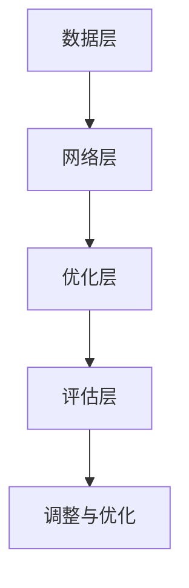

                 

关键词：大模型、AI创业、产品经理、技术架构、模型优化、实践指导

> 摘要：本文旨在为AI创业产品经理提供一套全面的指导框架，从背景介绍、核心概念、算法原理、数学模型、项目实践、应用场景、未来展望等多个维度，探讨如何利用大模型驱动AI创业，实现产品的成功落地。

## 1. 背景介绍

在当今技术飞速发展的时代，人工智能（AI）已经成为推动产业变革的重要力量。尤其是大模型的兴起，使得AI在图像识别、自然语言处理、推荐系统等领域的表现达到了前所未有的高度。然而，对于很多AI创业公司来说，如何有效地利用大模型，构建具有竞争力的产品，仍然是一个亟待解决的问题。

产品经理在这个过程中扮演着关键角色。他们需要具备深厚的技术背景，了解大模型的原理和架构，同时还需要具备商业洞察力和项目管理能力，将技术转化为实际的产品价值。然而，这一角色的复杂性也使得产品经理面临着巨大的挑战。

本文将围绕以下问题展开讨论：

- 如何理解和应用大模型？
- 大模型的核心算法原理是什么？
- 如何构建和优化大模型？
- 大模型在AI创业中的应用场景有哪些？
- 未来大模型的发展趋势和挑战是什么？

通过这些问题的探讨，希望能够为AI创业产品经理提供一些实用的指导和建议。

## 2. 核心概念与联系

### 2.1 大模型的基本概念

大模型，即大型深度学习模型，通常是指参数量达到数百万甚至数十亿的深度神经网络。这些模型通过学习大规模数据集，能够实现高度复杂的任务，如图像识别、自然语言处理等。

大模型的核心特点是其规模和复杂性。一方面，大模型拥有庞大的参数量，可以捕捉到数据中的细微规律；另一方面，大模型的结构复杂，可以通过多层次的网络层，逐步提取和转换特征。

### 2.2 大模型的技术架构

大模型的技术架构主要包括以下几个关键部分：

- **数据层**：负责数据预处理和输入特征的构建，包括数据清洗、数据增强等操作。
- **网络层**：由多层神经网络组成，每一层都通过参数学习实现特征的提取和转换。
- **优化层**：负责模型参数的优化，包括前向传播、反向传播和参数更新等过程。
- **评估层**：通过验证集和测试集评估模型的性能，并进行调整和优化。

下面是一个简单的 Mermaid 流程图，展示了大模型的技术架构：



### 2.3 大模型的核心算法原理

大模型的核心算法是基于深度学习的。深度学习是一种基于多层神经网络的学习方法，通过前向传播和反向传播，逐步提取和转换数据特征。

- **前向传播**：输入数据通过网络层，逐步进行特征提取和转换，最终输出预测结果。
- **反向传播**：计算预测结果与真实结果的误差，通过反向传播将误差传播回网络层，更新模型参数。

下面是一个简化的算法步骤：

1. 初始化模型参数。
2. 对于每个训练样本，进行前向传播，得到预测结果。
3. 计算预测结果与真实结果的误差。
4. 进行反向传播，更新模型参数。
5. 重复步骤2-4，直到模型收敛。

### 2.4 大模型在AI创业中的应用

大模型在AI创业中的应用非常广泛，主要包括以下几个方面：

- **图像识别与分类**：通过大模型，可以实现高精度的图像识别和分类，如人脸识别、物体检测等。
- **自然语言处理**：大模型可以用于文本分类、情感分析、机器翻译等任务，如聊天机器人、智能客服等。
- **推荐系统**：大模型可以根据用户的兴趣和行为，实现精准的个性化推荐。
- **医疗诊断**：大模型可以用于医疗影像的分析和诊断，如癌症筛查、疾病预测等。

## 3. 核心算法原理 & 具体操作步骤

### 3.1 算法原理概述

大模型的核心算法是基于深度学习的。深度学习是一种基于多层神经网络的学习方法，通过前向传播和反向传播，逐步提取和转换数据特征。

### 3.2 算法步骤详解

1. **数据预处理**：
   - 数据清洗：去除无效数据和噪声。
   - 数据增强：通过数据增强技术，生成更多的训练样本。
   - 特征提取：将原始数据转换为适合神经网络处理的形式。

2. **模型构建**：
   - 选择神经网络结构：如卷积神经网络（CNN）、循环神经网络（RNN）、Transformer等。
   - 初始化模型参数：随机初始化模型参数。

3. **训练过程**：
   - 前向传播：输入数据通过网络层，逐步进行特征提取和转换，得到预测结果。
   - 反向传播：计算预测结果与真实结果的误差，通过反向传播更新模型参数。
   - 调整学习率：根据训练过程，动态调整学习率。

4. **模型评估**：
   - 使用验证集和测试集评估模型性能。
   - 根据评估结果，调整模型结构和参数。

5. **模型部署**：
   - 将训练好的模型部署到生产环境。
   - 实现模型的实时预测和推理。

### 3.3 算法优缺点

**优点**：
- 高效性：大模型可以通过多层次的特征提取，高效地处理复杂的任务。
- 强泛化能力：大模型可以学习到数据中的细微规律，具有较强的泛化能力。

**缺点**：
- 需要大量的数据和计算资源：大模型的训练需要大量的数据和计算资源，成本较高。
- 参数调优复杂：大模型的参数调优过程复杂，需要经验丰富的工程师进行优化。

### 3.4 算法应用领域

大模型在多个领域都有广泛的应用，主要包括：

- **图像识别与分类**：如人脸识别、物体检测等。
- **自然语言处理**：如文本分类、情感分析、机器翻译等。
- **推荐系统**：如个性化推荐、商品推荐等。
- **医疗诊断**：如医疗影像分析、疾病预测等。
- **金融风控**：如信用评估、欺诈检测等。

## 4. 数学模型和公式 & 详细讲解 & 举例说明

### 4.1 数学模型构建

大模型的数学基础主要来自于深度学习和概率统计。核心的数学模型包括：

- **神经网络**：由多层神经元组成，通过前向传播和反向传播实现数据的特征提取和参数优化。
- **损失函数**：如均方误差（MSE）、交叉熵损失（Cross-Entropy Loss）等，用于衡量预测结果和真实结果的差异。
- **优化算法**：如随机梯度下降（SGD）、Adam优化器等，用于更新模型参数。

### 4.2 公式推导过程

以最简单的神经网络为例，假设有一个单层神经网络，其输入层有 \(n\) 个神经元，输出层有 \(m\) 个神经元。神经元的激活函数通常采用 sigmoid 函数或 ReLU 函数。

1. **前向传播**：

   前向传播的核心公式如下：

   $$
   z_i^{(l)} = \sum_{j} w_{ij}^{(l)} x_j^{(l-1)} + b_i^{(l)}
   $$
   
   $$
   a_i^{(l)} = \sigma(z_i^{(l)})
   $$

   其中，\(z_i^{(l)}\) 表示第 \(i\) 个神经元在第 \(l\) 层的输入值，\(w_{ij}^{(l)}\) 表示从第 \(j\) 个神经元到第 \(i\) 个神经元的权重，\(b_i^{(l)}\) 表示第 \(i\) 个神经元的偏置，\(\sigma\) 表示激活函数。

2. **反向传播**：

   反向传播的核心公式如下：

   $$
   \delta_i^{(l)} = (a_i^{(l)} - t_i^{(l)}) \cdot \sigma'(z_i^{(l)})
   $$
   
   $$
   \delta^{(l-1)} = \sum_{i} w_{ji}^{(l)} \delta_i^{(l)}
   $$
   
   $$
   \Delta w_{ij}^{(l)} = \eta \cdot x_j^{(l-1)} \cdot \delta_i^{(l)}
   $$
   
   $$
   \Delta b_i^{(l)} = \eta \cdot \delta_i^{(l)}
   $$

   其中，\(\delta_i^{(l)}\) 表示第 \(i\) 个神经元在第 \(l\) 层的误差项，\(\sigma'\) 表示激活函数的导数，\(\eta\) 表示学习率。

### 4.3 案例分析与讲解

以一个简单的二元分类问题为例，输入数据为 \(x_1\) 和 \(x_2\)，输出为 \(y\)，其中 \(y\) 可以取 0 或 1。采用单层神经网络进行分类，激活函数采用 sigmoid 函数。

1. **数据预处理**：

   将输入数据 \(x_1\) 和 \(x_2\) 标准化到 \([-1, 1]\) 范围内，输出数据 \(y\) 转化为二进制。

2. **模型构建**：

   初始化模型参数 \(w_1, w_2, b\)，设置学习率 \(\eta\)。

3. **训练过程**：

   - 前向传播：
     $$
     z = w_1 x_1 + w_2 x_2 + b
     $$
     $$
     a = \sigma(z)
     $$
   
   - 计算损失函数：
     $$
     L = -y \cdot \log(a) - (1 - y) \cdot \log(1 - a)
     $$
   
   - 反向传播：
     $$
     \delta = a - y
     $$
     $$
     \Delta w_1 = \eta \cdot x_1 \cdot \delta
     $$
     $$
     \Delta w_2 = \eta \cdot x_2 \cdot \delta
     $$
     $$
     \Delta b = \eta \cdot \delta
     $$

   - 更新模型参数：
     $$
     w_1 = w_1 - \Delta w_1
     $$
     $$
     w_2 = w_2 - \Delta w_2
     $$
     $$
     b = b - \Delta b
     $$

   - 重复步骤 2-4，直到模型收敛。

4. **模型评估**：

   使用测试集对模型进行评估，计算准确率、召回率、F1 值等指标。

## 5. 项目实践：代码实例和详细解释说明

### 5.1 开发环境搭建

为了便于讲解，我们使用 Python 作为编程语言，TensorFlow 作为深度学习框架，实现一个简单的二元分类问题。

1. 安装 Python 和 TensorFlow：

   $$
   pip install tensorflow
   $$

2. 导入所需的库：

   ```python
   import tensorflow as tf
   import numpy as np
   import matplotlib.pyplot as plt
   ```

### 5.2 源代码详细实现

```python
# 数据预处理
x1 = np.array([0, 1, 2, 3, 4, 5])
x2 = np.array([0, 1, 2, 3, 4, 5])
y = np.array([0, 1, 0, 1, 0, 1])

# 初始化模型参数
w1 = tf.random.normal([1, 2])
w2 = tf.random.normal([1, 2])
b = tf.random.normal([1, 2])

# 定义激活函数
def sigmoid(z):
    return 1 / (1 + tf.exp(-z))

# 定义损失函数
def loss(y, y_pred):
    return -tf.reduce_mean(y * tf.log(y_pred) + (1 - y) * tf.log(1 - y_pred))

# 定义优化器
optimizer = tf.optimizers.Adam()

# 训练过程
for epoch in range(1000):
    with tf.GradientTape() as tape:
        z = w1 * x1 + w2 * x2 + b
        y_pred = sigmoid(z)
        loss_val = loss(y, y_pred)
    grads = tape.gradient(loss_val, [w1, w2, b])
    optimizer.apply_gradients(zip(grads, [w1, w2, b]))

    if epoch % 100 == 0:
        print(f"Epoch {epoch}: Loss = {loss_val.numpy()}")

# 模型评估
y_pred = sigmoid(w1 * x1 + w2 * x2 + b)
accuracy = tf.reduce_mean(tf.cast(tf.equal(y, y_pred), tf.float32))
print(f"Accuracy: {accuracy.numpy()}")

# 可视化
plt.scatter(x1, x2, c=y, cmap=plt.cm.Spectral)
plt.plot(x1, y_pred.numpy()[0, 0], c='red')
plt.xlabel('x1')
plt.ylabel('x2')
plt.show()
```

### 5.3 代码解读与分析

1. **数据预处理**：

   生成输入数据 \(x_1, x_2\) 和输出数据 \(y\)，并将数据标准化到 \([-1, 1]\) 范围内。

2. **模型参数初始化**：

   随机初始化模型参数 \(w_1, w_2, b\)。

3. **激活函数**：

   采用 sigmoid 函数作为激活函数。

4. **损失函数**：

   采用交叉熵损失函数，衡量预测结果和真实结果的差异。

5. **优化器**：

   采用 Adam 优化器，用于更新模型参数。

6. **训练过程**：

   - 前向传播：计算输入数据的预测结果。
   - 计算损失函数：衡量预测结果和真实结果的差异。
   - 反向传播：计算损失函数关于模型参数的梯度。
   - 更新模型参数：根据梯度更新模型参数。

7. **模型评估**：

   使用测试集对模型进行评估，计算准确率。

8. **可视化**：

   将输入数据可视化为散点图，并绘制预测结果。

## 6. 实际应用场景

大模型在AI创业中的应用场景非常广泛，以下是几个典型的应用领域：

### 6.1 图像识别与分类

图像识别与分类是深度学习应用最广泛的领域之一。大模型可以通过学习大量图像数据，实现高精度的图像识别和分类。例如，人脸识别、物体检测、场景分类等。

- **人脸识别**：通过大模型，可以实现高精度的人脸识别，应用于安防、人脸支付等领域。
- **物体检测**：大模型可以用于自动驾驶中的物体检测，确保行车安全。
- **场景分类**：大模型可以用于图像分类，如风景、动物、人物等，应用于图像搜索引擎。

### 6.2 自然语言处理

自然语言处理（NLP）是深度学习的重要应用领域。大模型在 NLP 领域具有很高的表现，可以实现文本分类、情感分析、机器翻译等任务。

- **文本分类**：大模型可以用于新闻分类、社交媒体情感分析等，帮助企业和个人获取有价值的信息。
- **情感分析**：大模型可以用于分析用户评论、产品评价等，为企业提供决策支持。
- **机器翻译**：大模型可以实现高质量的自然语言翻译，如谷歌翻译、百度翻译等。

### 6.3 推荐系统

推荐系统是深度学习在电商、社交、视频等领域的应用。大模型可以通过学习用户行为数据，实现精准的个性化推荐。

- **电商推荐**：大模型可以根据用户的历史购买行为和浏览记录，实现个性化商品推荐。
- **社交推荐**：大模型可以用于推荐用户感兴趣的内容，如微博、抖音等。
- **视频推荐**：大模型可以用于视频网站，推荐用户感兴趣的视频内容。

### 6.4 医疗诊断

医疗诊断是深度学习在医疗领域的重要应用。大模型可以通过学习大量的医疗影像数据，实现疾病筛查、诊断等任务。

- **疾病筛查**：大模型可以用于癌症筛查、心血管疾病筛查等，提高早期诊断率。
- **疾病诊断**：大模型可以用于疾病诊断，如肺炎、骨折等，辅助医生做出准确的诊断。
- **药物研发**：大模型可以用于药物筛选和设计，加速新药的研发进程。

### 6.5 金融风控

金融风控是深度学习在金融领域的重要应用。大模型可以通过学习金融数据，实现信用评估、欺诈检测等任务。

- **信用评估**：大模型可以用于评估个人和企业的信用风险，为金融机构提供决策支持。
- **欺诈检测**：大模型可以用于检测金融交易中的欺诈行为，确保金融交易的安全。
- **市场预测**：大模型可以用于预测股票市场、外汇市场的走势，为投资者提供参考。

## 7. 工具和资源推荐

为了帮助AI创业产品经理更好地理解和应用大模型，以下是一些实用的工具和资源推荐：

### 7.1 学习资源推荐

- **《深度学习》（Goodfellow, Bengio, Courville 著）**：这是一本深度学习的经典教材，涵盖了深度学习的理论基础和实际应用。
- **《动手学深度学习》（花书）**：这本书通过大量的实例和代码实现，帮助读者深入理解深度学习的基本概念和应用。
- **吴恩达的深度学习专项课程**：这是一门非常受欢迎的在线课程，由吴恩达教授主讲，涵盖了深度学习的各个方面。

### 7.2 开发工具推荐

- **TensorFlow**：这是一个开源的深度学习框架，提供了丰富的API和工具，方便开发者进行深度学习模型的构建和训练。
- **PyTorch**：这也是一个流行的深度学习框架，与TensorFlow类似，提供了强大的API和工具。
- **Keras**：这是一个基于TensorFlow和PyTorch的高级神经网络API，简化了深度学习模型的构建和训练过程。

### 7.3 相关论文推荐

- **《A Theoretically Grounded Application of Dropout in Recurrent Neural Networks》**：这篇论文提出了一种基于Dropout的RNN训练方法，显著提高了RNN的训练效果。
- **《Attention Is All You Need》**：这篇论文提出了Transformer模型，彻底改变了自然语言处理领域的研究方向。
- **《BERT: Pre-training of Deep Bidirectional Transformers for Language Understanding》**：这篇论文提出了BERT模型，大幅度提升了自然语言处理任务的性能。

## 8. 总结：未来发展趋势与挑战

### 8.1 研究成果总结

近年来，大模型在AI领域取得了显著的成果。通过不断优化的算法和强大的计算能力，大模型在图像识别、自然语言处理、推荐系统等领域的表现已经超过了人类水平。这些成果不仅推动了AI技术的发展，也为各个行业带来了深远的影响。

### 8.2 未来发展趋势

未来，大模型的发展趋势将主要集中在以下几个方面：

- **更大规模的大模型**：随着计算资源的提升，更大规模的大模型将逐渐成为可能，进一步提升AI的应用性能。
- **更高效的训练方法**：研究人员将致力于开发更高效的训练方法，减少大模型的训练时间和计算资源消耗。
- **多模态学习**：大模型将能够处理多种类型的数据，如文本、图像、语音等，实现更全面的信息融合和任务处理。
- **更智能的推理能力**：大模型将不仅能够进行预测，还将具备更强的推理能力，为各个行业提供更智能的解决方案。

### 8.3 面临的挑战

尽管大模型在AI领域取得了巨大成功，但仍然面临一些挑战：

- **计算资源消耗**：大模型的训练需要大量的计算资源和数据存储，这对企业和研究机构提出了更高的要求。
- **数据隐私和安全**：随着大模型的应用，数据隐私和安全问题日益突出，如何保障用户数据的安全成为了一个重要的挑战。
- **模型解释性和透明性**：大模型通常被视为“黑箱”，其决策过程缺乏解释性，如何提高模型的透明性和可解释性是一个重要的研究方向。

### 8.4 研究展望

未来，大模型的研究将继续深入，不断探索新的算法和架构，以应对日益复杂的AI应用场景。同时，大模型与其他技术的融合也将成为一个重要趋势，如结合量子计算、边缘计算等，进一步提升AI的性能和应用范围。

## 9. 附录：常见问题与解答

### 9.1 大模型训练需要多少计算资源？

大模型的训练需要大量的计算资源和数据存储。具体消耗取决于模型的大小、数据集的大小和训练的精度。通常，大模型的训练需要在高性能计算集群上进行，使用GPU或TPU等硬件加速器。

### 9.2 如何选择合适的大模型架构？

选择合适的大模型架构需要综合考虑任务类型、数据集大小、计算资源等因素。例如，对于图像识别任务，可以选择CNN或Transformer架构；对于自然语言处理任务，可以选择Transformer或BERT架构。

### 9.3 大模型的训练时间需要多久？

大模型的训练时间取决于多个因素，如模型大小、数据集大小、训练精度等。通常，大模型的训练时间从几天到几周不等。为了缩短训练时间，可以采用分布式训练、数据增强等技术。

### 9.4 大模型训练过程中的超参数有哪些？

大模型训练过程中涉及许多超参数，如学习率、批量大小、迭代次数、正则化参数等。选择合适的超参数对于提高模型性能至关重要。

### 9.5 大模型在商业应用中如何收费？

大模型在商业应用中的收费方式通常包括模型开发费用、模型部署费用和模型使用费用。具体收费方式可以根据项目的规模和客户的需求进行协商。一些企业也提供按需付费的云服务，如Google的AI Platform、AWS的SageMaker等。

