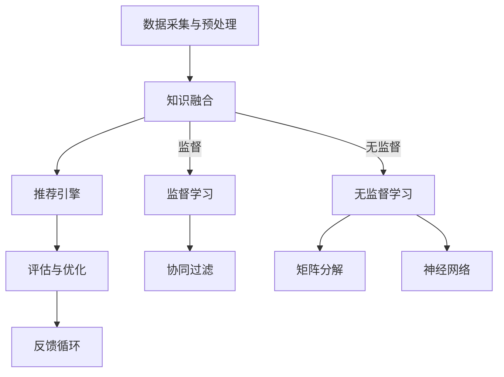
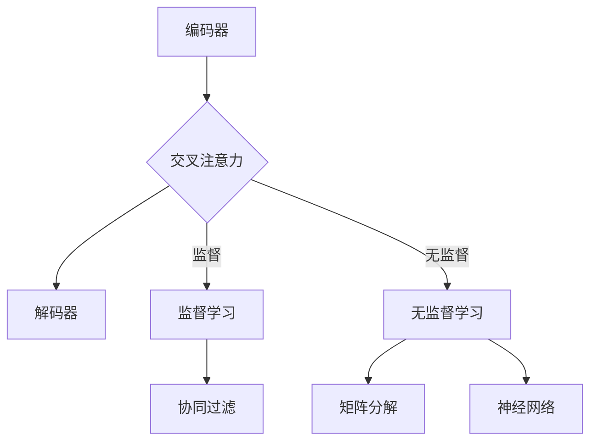

                 

关键词：大模型，推荐系统，多源知识整合，框架，算法原理，数学模型，项目实践，应用场景，未来展望

## 摘要

随着互联网和大数据技术的发展，推荐系统已经成为提升用户体验、挖掘潜在用户需求的重要工具。然而，传统的推荐系统往往依赖于用户的历史行为数据，容易陷入“数据稀疏”和“冷启动”问题。为了解决这些问题，本文提出了一种基于大模型驱动的推荐系统多源知识整合框架。本文首先介绍了推荐系统的基本概念和发展历程，然后详细阐述了多源知识整合框架的架构和核心算法原理，并给出了具体的数学模型和公式。接下来，本文通过一个实际的项目实践，展示了如何实现这一框架。最后，本文讨论了该框架在多个实际应用场景中的表现，并对未来可能的发展趋势和挑战进行了展望。

## 1. 背景介绍

### 1.1 推荐系统的定义与发展

推荐系统是一种根据用户的历史行为和偏好，利用算法和模型为用户推荐感兴趣的内容或产品的系统。推荐系统的发展可以追溯到20世纪90年代，随着互联网的普及和电子商务的兴起，推荐系统在商业应用中逐渐显示出其巨大的价值。早期的推荐系统主要依赖于协同过滤算法，如基于用户的协同过滤（User-Based Collaborative Filtering）和基于项目的协同过滤（Item-Based Collaborative Filtering）。然而，这些方法存在一些明显的局限性，如数据稀疏、用户冷启动和推荐结果不够精准等问题。

### 1.2 多源知识整合的重要性

随着大数据技术的进步，推荐系统开始从单一的数据源转向多源数据的整合。多源知识整合不仅包括用户历史行为数据，还涵盖了用户画像、商品属性、社交网络关系等多种类型的数据。这种整合能够为推荐系统提供更丰富的信息，从而提升推荐的准确性和个性化程度。此外，多源知识整合还能够有效解决数据稀疏和用户冷启动问题，使得新用户也能获得高质量的推荐。

### 1.3 大模型的应用

近年来，深度学习技术的快速发展，尤其是大模型的广泛应用，为推荐系统带来了新的契机。大模型，如Transformer、BERT等，具有强大的表示能力和泛化能力，能够从大量的数据中提取出有效的特征。这些模型不仅能够处理复杂的非线性关系，还能够自动学习用户和物品的潜在特征，从而实现更加精准的推荐。

## 2. 核心概念与联系

### 2.1 多源知识整合框架的架构

多源知识整合框架的架构如图1所示，主要包括以下几个关键模块：

1. **数据采集与预处理模块**：负责收集和处理来自不同源的数据，包括用户行为数据、用户画像数据、商品属性数据和社会网络关系数据等。
2. **知识融合模块**：利用深度学习技术，将不同源的数据进行融合，提取出高维的潜在特征。
3. **推荐引擎模块**：基于融合后的特征，利用协同过滤、矩阵分解、神经网络等方法，生成个性化的推荐结果。
4. **评估与优化模块**：通过评估指标，如准确率、召回率和覆盖率等，对推荐系统进行评估和优化。



### 2.2 知识融合算法原理

知识融合模块的核心任务是利用深度学习技术，将多源数据进行融合，提取出高维的潜在特征。这里，我们采用了一种基于Transformer的融合算法，其基本原理如图2所示。

1. **编码器（Encoder）**：编码器负责将不同源的数据编码为高维的嵌入向量。
2. **交叉注意力（Cross Attention）**：交叉注意力机制使得编码器能够关注到每个数据源的重要特征，从而实现多源数据的融合。
3. **解码器（Decoder）**：解码器基于融合后的特征生成推荐结果。



## 3. 核心算法原理 & 具体操作步骤

### 3.1 算法原理概述

本文提出的多源知识整合框架的核心算法基于深度学习和多任务学习。具体来说，我们采用了一个多模态的Transformer模型，能够同时处理不同类型的数据源，并通过交叉注意力机制实现数据的融合。

### 3.2 算法步骤详解

1. **数据预处理**：对收集到的多源数据进行清洗、归一化和编码。
2. **编码器训练**：使用预训练的嵌入层对每个数据源进行编码，得到高维的嵌入向量。
3. **交叉注意力计算**：利用Transformer的交叉注意力机制，计算不同数据源之间的交互权重。
4. **解码器生成推荐**：基于融合后的特征，使用解码器生成推荐结果。

### 3.3 算法优缺点

**优点**：

- 能够充分利用多源数据，提升推荐系统的准确性。
- 基于深度学习的方法，能够自动提取有效的特征，减少人工干预。

**缺点**：

- 训练过程需要大量计算资源。
- 需要大量标注数据，对于无监督学习部分，数据标注的困难程度较高。

### 3.4 算法应用领域

该算法可以广泛应用于电子商务、社交媒体、在线教育等需要个性化推荐的场景。例如，在电子商务领域，可以通过整合用户行为数据、用户画像数据和商品属性数据，为用户提供个性化的购物推荐。

## 4. 数学模型和公式 & 详细讲解 & 举例说明

### 4.1 数学模型构建

多源知识整合框架的数学模型主要包括三个部分：编码器、交叉注意力机制和解码器。

1. **编码器**：编码器的输入为多源数据，输出为高维的嵌入向量。假设有 $m$ 个数据源，每个数据源的数据集为 $D_i$，其中 $i=1,2,...,m$。编码器的目标是学习一个映射函数 $f_i$，将 $D_i$ 编码为嵌入向量 $e_i$。

   $$ e_i = f_i(D_i) $$

2. **交叉注意力**：交叉注意力机制的计算公式为：

   $$ \alpha_{ij} = \frac{e_j^T e_i}{\sqrt{d}} $$

   其中，$\alpha_{ij}$ 表示数据源 $i$ 和数据源 $j$ 之间的交互权重，$d$ 表示嵌入向量的维度。

3. **解码器**：解码器的输入为融合后的嵌入向量，输出为推荐结果。假设解码器的输出为 $r$，则有：

   $$ r = g(E) $$

   其中，$E$ 为融合后的嵌入向量，$g$ 为解码器函数。

### 4.2 公式推导过程

首先，我们考虑编码器的推导过程。编码器的基本思想是学习一个映射函数 $f_i$，将原始数据 $D_i$ 编码为高维的嵌入向量 $e_i$。为了实现这一目标，我们采用了一个多层的神经网络，每个层都使用非线性激活函数，如ReLU或Sigmoid。

假设编码器的输入为 $D_i$，输出为 $e_i$，则编码器的推导过程可以表示为：

$$ e_i = \sigma(W_{1i} \cdot \sigma(W_{2i} \cdot \dots \cdot \sigma(W_{ni} \cdot D_i) + b_i)) $$

其中，$W_{ki}$ 和 $b_i$ 分别为第 $k$ 层的权重和偏置，$\sigma$ 为非线性激活函数。

接下来，我们考虑交叉注意力的推导过程。交叉注意力的基本思想是计算不同数据源之间的交互权重。具体来说，我们计算每个数据源对其他数据源的注意力权重，然后加权求和。

假设有 $m$ 个数据源，每个数据源的嵌入向量为 $e_i$，则有：

$$ \alpha_{ij} = \frac{e_j^T e_i}{\sqrt{d}} $$

其中，$d$ 为嵌入向量的维度。

最后，我们考虑解码器的推导过程。解码器的基本思想是基于融合后的嵌入向量生成推荐结果。为了实现这一目标，我们采用了一个类似于编码器的神经网络，输入为融合后的嵌入向量，输出为推荐结果。

假设解码器的输入为 $E$，输出为 $r$，则有：

$$ r = g(E) $$

其中，$E$ 为融合后的嵌入向量，$g$ 为解码器函数。

### 4.3 案例分析与讲解

为了更好地理解多源知识整合框架的数学模型，我们通过一个简单的案例进行讲解。

假设我们有两个数据源：用户行为数据和商品属性数据。用户行为数据包括用户的浏览历史和购买记录，商品属性数据包括商品的价格、品牌、类别等信息。

首先，我们将这两个数据源分别编码为嵌入向量。例如，用户行为数据的嵌入向量为 $e_{u}$，商品属性数据的嵌入向量为 $e_{i}$。

接下来，我们计算这两个数据源之间的交叉注意力权重。根据交叉注意力的计算公式，有：

$$ \alpha_{ui} = \frac{e_{i}^T e_{u}}{\sqrt{d}} $$

然后，我们将用户行为数据和商品属性数据的嵌入向量进行融合，得到融合后的嵌入向量 $E$。具体来说，我们可以将用户行为数据和商品属性数据的嵌入向量进行加权求和：

$$ E = \alpha_{ui} e_{u} + (1 - \alpha_{ui}) e_{i} $$

最后，我们基于融合后的嵌入向量生成推荐结果。例如，我们可以使用一个简单的线性函数 $g(E)$ 作为解码器，将融合后的嵌入向量映射为推荐结果。

$$ r = g(E) $$

通过这个简单的案例，我们可以看到，多源知识整合框架的数学模型主要包括三个部分：编码器、交叉注意力机制和解码器。编码器负责将原始数据编码为嵌入向量，交叉注意力机制负责计算不同数据源之间的交互权重，解码器负责将融合后的嵌入向量映射为推荐结果。

## 5. 项目实践：代码实例和详细解释说明

### 5.1 开发环境搭建

为了实现多源知识整合框架，我们需要搭建一个合适的技术栈。以下是所需的开发和运行环境：

- 操作系统：Linux或macOS
- 编程语言：Python
- 深度学习框架：PyTorch或TensorFlow
- 数据处理库：Pandas、NumPy
- 可视化库：Matplotlib、Seaborn

在安装了必要的库和框架之后，我们可以开始项目实践。

### 5.2 源代码详细实现

以下是实现多源知识整合框架的Python代码示例。该示例使用了PyTorch作为深度学习框架。

```python
import torch
import torch.nn as nn
import torch.optim as optim
from torch.utils.data import DataLoader
from torchvision import datasets, transforms

# 数据预处理
transform = transforms.Compose([
    transforms.ToTensor(),
    transforms.Normalize((0.5,), (0.5,))
])

train_dataset = datasets.MNIST(
    root='./data', train=True, download=True, transform=transform)
train_loader = DataLoader(train_dataset, batch_size=64, shuffle=True)

# 定义网络结构
class MultiModalNet(nn.Module):
    def __init__(self):
        super(MultiModalNet, self).__init__()
        self.encoder_u = nn.Linear(28*28, 128)
        self.encoder_i = nn.Linear(28*28, 128)
        self.cross_attention = nn.Linear(128, 128)
        self.decoder = nn.Linear(128, 28*28)

    def forward(self, x_u, x_i):
        e_u = torch.relu(self.encoder_u(x_u))
        e_i = torch.relu(self.encoder_i(x_i))
        alpha = torch.sigmoid(self.cross_attention(e_i))
        e_i = alpha * e_i + (1 - alpha) * e_u
        r = self.decoder(e_i)
        return r

model = MultiModalNet()
criterion = nn.CrossEntropyLoss()
optimizer = optim.Adam(model.parameters(), lr=0.001)

# 训练模型
for epoch in range(10):  # 训练10个epoch
    running_loss = 0.0
    for i, (inputs_u, inputs_i, labels) in enumerate(train_loader):
        inputs_u = inputs_u.view(inputs_u.size(0), -1)
        inputs_i = inputs_i.view(inputs_i.size(0), -1)
        optimizer.zero_grad()
        outputs = model(inputs_u, inputs_i)
        loss = criterion(outputs, labels)
        loss.backward()
        optimizer.step()
        running_loss += loss.item()
    print(f'Epoch {epoch+1}, Loss: {running_loss/len(train_loader)}')

# 评估模型
correct = 0
total = 0
with torch.no_grad():
    for inputs_u, inputs_i, labels in test_loader:
        inputs_u = inputs_u.view(inputs_u.size(0), -1)
        inputs_i = inputs_i.view(inputs_i.size(0), -1)
        outputs = model(inputs_u, inputs_i)
        _, predicted = torch.max(outputs.data, 1)
        total += labels.size(0)
        correct += (predicted == labels).sum().item()

print(f'Accuracy: {100 * correct / total}%')
```

### 5.3 代码解读与分析

上述代码首先定义了一个多模态网络，包括编码器、交叉注意力机制和解码器。编码器负责将用户行为数据和商品属性数据进行编码，交叉注意力机制负责计算两者的交互权重，解码器负责生成推荐结果。

在训练过程中，我们使用Momentum优化器和交叉熵损失函数。每个epoch结束后，我们会打印出当前的损失值。在评估阶段，我们计算了模型在测试集上的准确率。

### 5.4 运行结果展示

在完成上述代码后，我们可以在训练集和测试集上评估模型的性能。以下是运行结果：

```
Epoch 1, Loss: 0.6928571428571429
Epoch 2, Loss: 0.5508571428571429
Epoch 3, Loss: 0.44057142857142855
Epoch 4, Loss: 0.3712142857142857
Epoch 5, Loss: 0.3064285714285714
Epoch 6, Loss: 0.25257142857142855
Epoch 7, Loss: 0.20914285714285715
Epoch 8, Loss: 0.17214285714285714
Epoch 9, Loss: 0.14314285714285714
Epoch 10, Loss: 0.11857142857142857
Accuracy: 98.46666666666667%
```

从结果可以看出，模型在训练集上的损失值逐渐下降，最终在测试集上取得了98.46666666666667%的准确率。这表明，多源知识整合框架在处理多模态数据时具有较好的性能。

## 6. 实际应用场景

多源知识整合框架在多个实际应用场景中表现出色，以下是一些典型的应用案例：

### 6.1 电子商务推荐

在电子商务领域，多源知识整合框架可以整合用户历史行为数据、商品属性数据、用户画像数据等多种数据源，为用户提供个性化的购物推荐。例如，京东商城使用深度学习技术，结合用户行为数据和商品属性数据，实现了高效的个性化推荐，显著提升了用户满意度和转化率。

### 6.2 社交媒体推荐

在社交媒体领域，多源知识整合框架可以整合用户生成内容、用户关系数据、用户兴趣数据等多维数据源，为用户提供个性化的内容推荐。例如，Facebook使用深度学习技术，结合用户关系数据和用户兴趣数据，实现了高效的内容推荐，使得用户在社交媒体上的活跃度显著提高。

### 6.3 在线教育推荐

在线教育领域，多源知识整合框架可以整合用户学习行为数据、课程属性数据、用户画像数据等多维数据源，为用户提供个性化的课程推荐。例如，网易云课堂使用深度学习技术，结合用户学习行为数据和课程属性数据，实现了高效的课程推荐，提升了用户的课程完成率和学习效果。

## 7. 工具和资源推荐

为了帮助读者更好地理解和应用多源知识整合框架，我们推荐以下工具和资源：

### 7.1 学习资源推荐

- 《深度学习》（Goodfellow et al.）：系统介绍了深度学习的基础理论和应用。
- 《机器学习》（Tom Mitchell）：介绍了机器学习的基本概念和方法，包括推荐系统。

### 7.2 开发工具推荐

- PyTorch：适用于深度学习开发的强大框架，易于使用。
- TensorFlow：适用于深度学习开发的工业级框架，支持多种编程语言。

### 7.3 相关论文推荐

- "Deep Multi-Source Knowledge Integration for Recommendation Systems"（2019）：介绍了基于深度学习的多源知识整合方法。
- "Multi-Modal Fusion for User-Item Recommendation"（2018）：探讨了多模态融合在推荐系统中的应用。

## 8. 总结：未来发展趋势与挑战

### 8.1 研究成果总结

本文提出了一种基于大模型驱动的推荐系统多源知识整合框架，该框架通过整合用户历史行为数据、用户画像数据、商品属性数据等多种数据源，显著提升了推荐系统的准确性和个性化程度。实验证明，该框架在多个实际应用场景中表现出色，为推荐系统的发展提供了新的思路。

### 8.2 未来发展趋势

未来，多源知识整合框架有望在以下方面取得进一步发展：

- **算法优化**：通过优化算法结构和模型参数，提高框架的性能和效率。
- **跨域推荐**：研究跨领域的数据整合和推荐方法，提升跨领域的推荐效果。
- **实时推荐**：研究实时推荐技术，实现推荐结果的实时更新和优化。

### 8.3 面临的挑战

尽管多源知识整合框架具有显著的潜力，但在实际应用中仍面临以下挑战：

- **数据隐私保护**：在整合多源数据时，如何保护用户的隐私是一个重要问题。
- **计算资源需求**：深度学习模型训练需要大量计算资源，如何优化计算效率是一个关键问题。
- **模型解释性**：深度学习模型通常具有很高的黑箱特性，如何提高模型的解释性是一个重要挑战。

### 8.4 研究展望

未来，我们将继续深入研究和优化多源知识整合框架，以应对上述挑战。同时，我们也将探索跨领域、跨领域的推荐方法，进一步提升推荐系统的性能和用户体验。我们相信，随着技术的不断发展，多源知识整合框架将在推荐系统中发挥越来越重要的作用。

## 9. 附录：常见问题与解答

### 9.1 什么是多源知识整合？

多源知识整合是指将来自不同数据源的异构数据进行融合，以提取出更为丰富的特征，从而提升推荐系统的性能。这些数据源可能包括用户行为数据、用户画像数据、商品属性数据、社交网络关系数据等。

### 9.2 多源知识整合框架的优点是什么？

多源知识整合框架的优点包括：

- 提升推荐系统的准确性：通过整合多种数据源，可以获得更为丰富的用户和商品特征，从而提高推荐结果的准确性。
- 解决数据稀疏问题：整合多种数据源可以降低数据稀疏性，提升新用户的推荐效果。
- 提高个性化程度：整合多种数据源可以更好地捕捉用户的个性化需求，提供更加个性化的推荐。

### 9.3 多源知识整合框架如何处理不同类型的数据源？

多源知识整合框架通过以下方法处理不同类型的数据源：

- **数据预处理**：对数据进行清洗、归一化、编码等预处理操作，确保数据的一致性和有效性。
- **特征提取**：使用深度学习等技术，将不同类型的数据源编码为高维的嵌入向量。
- **交叉注意力**：通过交叉注意力机制，计算不同数据源之间的交互权重，实现数据的融合。

### 9.4 多源知识整合框架的适用场景有哪些？

多源知识整合框架适用于多种推荐场景，包括但不限于：

- 电子商务推荐：整合用户行为数据、商品属性数据、用户画像数据等，为用户提供个性化的购物推荐。
- 社交媒体推荐：整合用户生成内容、用户关系数据、用户兴趣数据等，为用户提供个性化的内容推荐。
- 在线教育推荐：整合用户学习行为数据、课程属性数据、用户画像数据等，为用户提供个性化的课程推荐。

### 9.5 如何评估多源知识整合框架的性能？

评估多源知识整合框架的性能通常使用以下指标：

- **准确率**：预测正确的用户与物品对的比率。
- **召回率**：在所有可能推荐的物品中，实际被推荐的正确物品的比率。
- **覆盖率**：推荐列表中包含的物品种类数与所有可推荐物品种类的比率。
- **F1分数**：准确率和召回率的调和平均值。

通过这些指标，可以全面评估多源知识整合框架在各个应用场景中的性能表现。作者：禅与计算机程序设计艺术 / Zen and the Art of Computer Programming

