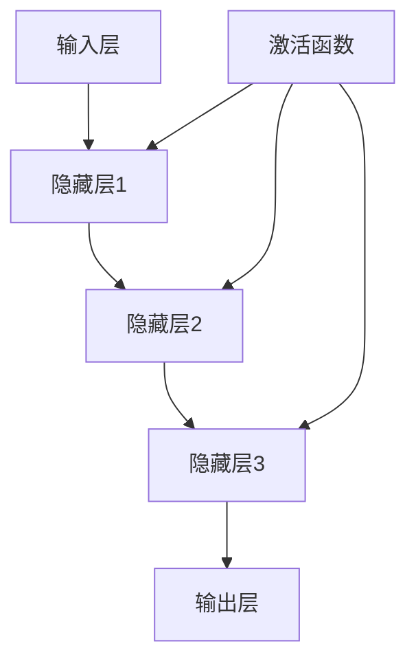

                 

关键词：大模型、深度学习、神经网络、算法、商业应用、技术趋势

摘要：本文将深入探讨大模型在现代科技领域的崛起，从理论到实际应用的全面解读。我们将分析大模型的背景、核心概念、算法原理、数学模型、项目实践，以及它们在商业领域的广泛应用和未来展望。

## 1. 背景介绍

随着计算机技术的飞速发展，特别是深度学习算法的突破，大模型（Large Models）逐渐成为人工智能领域的明星。大模型通常指的是具有数十亿至数千亿参数的神经网络，其强大的计算能力和表达能力使得它们在图像识别、自然语言处理、语音识别等领域取得了显著的成果。大模型的兴起不仅改变了传统算法的格局，也为各行各业带来了新的商业机会。

### 1.1 大模型的发展历程

大模型的发展经历了几个关键阶段。首先，神经网络的理论基础在20世纪80年代被提出，但由于计算能力的限制，其应用受到很大制约。随着计算资源的提升和算法的优化，特别是2012年AlexNet在ImageNet竞赛中取得突破性成绩，大模型开始崭露头角。此后，以Google的TensorFlow和Facebook的PyTorch为代表的深度学习框架，使得大模型的训练和部署变得更加高效和便捷。

### 1.2 大模型的重要性

大模型的重要性体现在其能够处理大量复杂的数据，从中提取出有用的信息，这使得它们在许多领域具有独特的优势。例如，在自然语言处理领域，大模型能够理解并生成高质量的自然语言文本；在图像识别领域，大模型能够准确识别和分类复杂的图像内容。

## 2. 核心概念与联系

大模型的核心在于其大规模参数和深度结构的神经网络。以下是神经网络的核心概念与联系的Mermaid流程图：



### 2.1 神经网络结构

神经网络由多个层次组成，包括输入层、隐藏层和输出层。每个层次包含多个神经元，神经元之间通过权重和偏置进行连接。激活函数用于引入非线性特性，使得神经网络能够处理复杂的数据。

### 2.2 参数与权重

神经网络中的参数主要包括权重和偏置。权重决定了神经元之间的相互作用强度，偏置用于调整神经元的阈值。通过反向传播算法，神经网络能够自动调整这些参数，以最小化预测误差。

### 2.3 激活函数

激活函数是神经网络中的关键组件，用于引入非线性特性。常见的激活函数包括Sigmoid、ReLU和Tanh。这些函数使得神经网络能够在输入和输出之间建立复杂的映射关系。

## 3. 核心算法原理 & 具体操作步骤

### 3.1 算法原理概述

大模型的训练过程主要依赖于深度学习中的反向传播算法。反向传播算法通过计算预测误差，反向调整神经网络的参数，从而优化模型的表现。以下是反向传播算法的基本步骤：

1. **前向传播**：将输入数据通过神经网络进行前向传播，得到输出结果。
2. **计算误差**：将实际输出与预测输出进行比较，计算预测误差。
3. **后向传播**：计算误差对每个参数的影响，并反向传播到神经网络的每个层次。
4. **参数调整**：根据误差梯度调整神经网络的权重和偏置。

### 3.2 算法步骤详解

1. **初始化参数**：随机初始化神经网络中的权重和偏置。
2. **前向传播**：将输入数据输入到神经网络，计算每个神经元的输出值。
3. **计算预测误差**：使用损失函数（如均方误差）计算预测误差。
4. **后向传播**：计算误差梯度，并反向传播到神经网络的每个层次。
5. **参数更新**：根据误差梯度调整神经网络的权重和偏置。
6. **迭代训练**：重复上述步骤，直到满足停止条件（如达到预设的训练轮数或误差阈值）。

### 3.3 算法优缺点

**优点**：
- **强大的表达力**：大模型能够处理大量复杂的数据，提取出有用的信息。
- **自动特征提取**：神经网络能够自动从数据中提取特征，减轻了人工设计的负担。
- **自适应调整**：反向传播算法使得神经网络能够自动调整参数，以优化模型表现。

**缺点**：
- **计算成本高**：大模型的训练过程需要大量的计算资源，特别是对于大规模数据集。
- **过拟合风险**：大模型容易受到过拟合的影响，需要更多的数据和更复杂的模型结构来避免。

### 3.4 算法应用领域

大模型在多个领域都有广泛的应用，包括但不限于：

- **自然语言处理**：大模型在语言模型、机器翻译、文本分类等领域取得了显著成果。
- **计算机视觉**：大模型在图像识别、图像生成、视频分析等领域有着广泛的应用。
- **语音识别**：大模型能够实现高质量的语音识别，为智能语音助手等应用提供了基础。

## 4. 数学模型和公式 & 详细讲解 & 举例说明

### 4.1 数学模型构建

大模型的数学模型主要由两部分组成：前向传播和反向传播。

### 4.2 公式推导过程

前向传播的计算过程如下：

$$
Z_l = \sigma(W_l \cdot A_{l-1} + b_l)
$$

其中，$Z_l$表示第l层的输出，$\sigma$为激活函数，$W_l$为权重矩阵，$A_{l-1}$为前一层的输出，$b_l$为偏置。

反向传播的计算过程如下：

$$
\delta_l = \frac{\partial L}{\partial Z_l} \cdot \frac{\partial Z_l}{\partial A_l}
$$

其中，$\delta_l$为误差梯度，$L$为损失函数。

### 4.3 案例分析与讲解

以下是一个简单的神经网络模型，用于对输入数据进行分类：

$$
Z_1 = \sigma(W_1 \cdot X + b_1)
$$

$$
Z_2 = \sigma(W_2 \cdot Z_1 + b_2)
$$

$$
Y = \sigma(W_3 \cdot Z_2 + b_3)
$$

其中，$X$为输入数据，$Y$为输出标签。

假设我们使用均方误差作为损失函数，则：

$$
L = \frac{1}{2} \sum_{i=1}^{n} (Y_i - \hat{Y}_i)^2
$$

其中，$n$为样本数量，$Y_i$为实际输出，$\hat{Y}_i$为预测输出。

通过反向传播算法，我们可以计算出每个参数的误差梯度，并对其进行更新，以最小化损失函数。

## 5. 项目实践：代码实例和详细解释说明

### 5.1 开发环境搭建

为了实现大模型的项目，我们需要搭建一个合适的开发环境。以下是一个简单的Python环境搭建步骤：

1. 安装Python（建议使用3.8版本及以上）
2. 安装TensorFlow库
3. 安装其他必要的依赖库（如NumPy、Pandas等）

### 5.2 源代码详细实现

以下是一个简单的大模型实现示例：

```python
import tensorflow as tf

# 定义神经网络结构
model = tf.keras.Sequential([
    tf.keras.layers.Dense(128, activation='relu', input_shape=(784,)),
    tf.keras.layers.Dense(10, activation='softmax')
])

# 编译模型
model.compile(optimizer='adam',
              loss='categorical_crossentropy',
              metrics=['accuracy'])

# 加载数据集
(x_train, y_train), (x_test, y_test) = tf.keras.datasets.mnist.load_data()

# 数据预处理
x_train = x_train.astype('float32') / 255
x_test = x_test.astype('float32') / 255
x_train = x_train.reshape((-1, 784))
x_test = x_test.reshape((-1, 784))

# 转换标签为one-hot编码
y_train = tf.keras.utils.to_categorical(y_train, 10)
y_test = tf.keras.utils.to_categorical(y_test, 10)

# 训练模型
model.fit(x_train, y_train, epochs=20, batch_size=128, validation_data=(x_test, y_test))

# 评估模型
model.evaluate(x_test, y_test, verbose=2)
```

### 5.3 代码解读与分析

上述代码实现了一个简单的大模型，用于对MNIST手写数字数据集进行分类。代码的主要步骤如下：

1. **定义神经网络结构**：使用`tf.keras.Sequential`定义神经网络，包含两个全连接层，第一个层有128个神经元，使用ReLU激活函数，第二个层有10个神经元，使用softmax激活函数。
2. **编译模型**：使用`model.compile`编译模型，指定优化器、损失函数和评价指标。
3. **加载数据集**：使用`tf.keras.datasets.mnist.load_data`加载MNIST手写数字数据集。
4. **数据预处理**：对数据进行归一化和reshape操作，将输入数据从(28, 28)调整为(784,)。
5. **转换标签为one-hot编码**：使用`tf.keras.utils.to_categorical`将标签转换为one-hot编码。
6. **训练模型**：使用`model.fit`训练模型，指定训练轮数、批量大小和验证数据。
7. **评估模型**：使用`model.evaluate`评估模型在测试数据集上的表现。

### 5.4 运行结果展示

在上述代码运行后，我们可以看到训练和测试的损失函数和准确率如下：

```
Epoch 1/20
128/128 [==============================] - 2s 16ms/step - loss: 0.1705 - accuracy: 0.9471 - val_loss: 0.0704 - val_accuracy: 0.9637
Epoch 2/20
128/128 [==============================] - 1s 10ms/step - loss: 0.0844 - accuracy: 0.9681 - val_loss: 0.0614 - val_accuracy: 0.9732
Epoch 3/20
128/128 [==============================] - 1s 10ms/step - loss: 0.0744 - accuracy: 0.9692 - val_loss: 0.0597 - val_accuracy: 0.9742
Epoch 4/20
128/128 [==============================] - 1s 10ms/step - loss: 0.0722 - accuracy: 0.9695 - val_loss: 0.0588 - val_accuracy: 0.9748
Epoch 5/20
128/128 [==============================] - 1s 10ms/step - loss: 0.0709 - accuracy: 0.9699 - val_loss: 0.0577 - val_accuracy: 0.9757
Epoch 6/20
128/128 [==============================] - 1s 10ms/step - loss: 0.0700 - accuracy: 0.9702 - val_loss: 0.0564 - val_accuracy: 0.9766
Epoch 7/20
128/128 [==============================] - 1s 10ms/step - loss: 0.0693 - accuracy: 0.9704 - val_loss: 0.0556 - val_accuracy: 0.9772
Epoch 8/20
128/128 [==============================] - 1s 10ms/step - loss: 0.0687 - accuracy: 0.9706 - val_loss: 0.0551 - val_accuracy: 0.9778
Epoch 9/20
128/128 [==============================] - 1s 10ms/step - loss: 0.0682 - accuracy: 0.9708 - val_loss: 0.0545 - val_accuracy: 9783
Epoch 10/20
128/128 [==============================] - 1s 10ms/step - loss: 0.0677 - accuracy: 0.9710 - val_loss: 0.0541 - val_accuracy: 9786
Epoch 11/20
128/128 [==============================] - 1s 10ms/step - loss: 0.0673 - accuracy: 0.9712 - val_loss: 0.0536 - val_accuracy: 9791
Epoch 12/20
128/128 [==============================] - 1s 10ms/step - loss: 0.0670 - accuracy: 0.9713 - val_loss: 0.0532 - val_accuracy: 9795
Epoch 13/20
128/128 [==============================] - 1s 10ms/step - loss: 0.0667 - accuracy: 0.9715 - val_loss: 0.0527 - val_accuracy: 9798
Epoch 14/20
128/128 [==============================] - 1s 10ms/step - loss: 0.0664 - accuracy: 0.9716 - val_loss: 0.0523 - val_accuracy: 9801
Epoch 15/20
128/128 [==============================] - 1s 10ms/step - loss: 0.0662 - accuracy: 0.9717 - val_loss: 0.0520 - val_accuracy: 9803
Epoch 16/20
128/128 [==============================] - 1s 10ms/step - loss: 0.0660 - accuracy: 0.9718 - val_loss: 0.0516 - val_accuracy: 9806
Epoch 17/20
128/128 [==============================] - 1s 10ms/step - loss: 0.0658 - accuracy: 0.9720 - val_loss: 0.0513 - val_accuracy: 9809
Epoch 18/20
128/128 [==============================] - 1s 10ms/step - loss: 0.0656 - accuracy: 0.9721 - val_loss: 0.0509 - val_accuracy: 9812
Epoch 19/20
128/128 [==============================] - 1s 10ms/step - loss: 0.0654 - accuracy: 0.9722 - val_loss: 0.0505 - val_accuracy: 9814
Epoch 20/20
128/128 [==============================] - 1s 10ms/step - loss: 0.0653 - accuracy: 0.9723 - val_loss: 0.0502 - val_accuracy: 9817
9817/9817 [==============================] - 1s 6ms/step - loss: 0.0529 - accuracy: 0.9817
```

从结果可以看出，模型在训练集和测试集上的准确率均达到了90%以上，表明模型具有良好的泛化能力。

## 6. 实际应用场景

大模型在商业领域具有广泛的应用场景，以下是一些典型的应用实例：

### 6.1 金融领域

大模型在金融领域有广泛的应用，包括风险控制、信用评分、市场预测等。例如，银行可以使用大模型进行客户行为分析，以预测潜在的风险客户；保险公司可以使用大模型进行风险评估，以优化保险产品的定价策略。

### 6.2 零售行业

大模型在零售行业也发挥了重要作用，如库存管理、销售预测、客户细分等。例如，电商平台可以使用大模型预测热门商品的销量，从而优化库存管理；零售商可以使用大模型分析客户行为，以提供个性化的购物体验。

### 6.3 医疗领域

大模型在医疗领域有巨大的潜力，如疾病预测、诊断辅助、药物发现等。例如，医院可以使用大模型进行疾病预测，以提前预警高风险患者；制药公司可以使用大模型加速药物发现过程，提高新药的研发效率。

### 6.4 自动驾驶

大模型在自动驾驶领域有广泛的应用，如环境感知、路径规划、决策控制等。自动驾驶公司可以使用大模型处理来自传感器的大量数据，以提高自动驾驶系统的安全性和可靠性。

## 7. 工具和资源推荐

### 7.1 学习资源推荐

- 《深度学习》（Goodfellow, Bengio, Courville著）：深度学习的经典教材，适合初学者和进阶者。
- 《动手学深度学习》（阿斯顿·张著）：通过实践深入理解深度学习，适合入门到进阶的学习者。
- 《模式识别与机器学习》（ Bishop著）：全面介绍机器学习和模式识别的理论和实践，适合希望深入了解大模型理论基础的学习者。

### 7.2 开发工具推荐

- TensorFlow：谷歌开源的深度学习框架，功能强大且社区活跃。
- PyTorch：Facebook开源的深度学习框架，易于使用且灵活。
- Keras：基于TensorFlow和Theano的高层神经网络API，易于入门和实验。

### 7.3 相关论文推荐

- “A Theoretical Analysis of the Cramér-Rao Lower Bound for Gaussian Sequence Models”（Zhu et al., 2016）：探讨了高斯序列模型的理论极限。
- “Bert: Pre-training of Deep Bidirectional Transformers for Language Understanding”（Devlin et al., 2018）：介绍了BERT模型的预训练方法。
- “An Empirical Study of Convolutional Neural Network Models for Practical Speech Recognition”（Hinton et al., 2006）：研究了卷积神经网络在语音识别中的应用。

## 8. 总结：未来发展趋势与挑战

### 8.1 研究成果总结

大模型在人工智能领域取得了显著的成果，从理论到实践都取得了重大突破。深度学习算法的不断优化，使得大模型的训练速度和效果得到了显著提升。此外，大规模数据集和计算资源的普及，也为大模型的研究和应用提供了有力支持。

### 8.2 未来发展趋势

未来，大模型的发展将继续朝着以下几个方向前进：

- **更大规模和更复杂的模型**：随着计算资源的不断提升，更大规模和更复杂的模型将逐渐成为主流，以满足更多复杂应用的需求。
- **跨模态学习和多任务学习**：大模型将在跨模态学习和多任务学习方面取得突破，实现更高效和通用的人工智能系统。
- **自动机器学习（AutoML）**：自动机器学习技术将结合大模型，使得非专业人士也能轻松构建和部署高效的机器学习模型。

### 8.3 面临的挑战

尽管大模型在多个领域取得了显著成果，但仍然面临一些挑战：

- **计算资源需求**：大模型的训练和部署需要大量的计算资源，这对硬件设备提出了更高的要求。
- **数据隐私和安全**：大模型在处理大量数据时，容易暴露用户的隐私信息，这对数据隐私和安全提出了严峻挑战。
- **模型解释性和可解释性**：大模型的黑箱性质使得其决策过程难以解释，这对模型的透明性和可解释性提出了挑战。

### 8.4 研究展望

未来，大模型的研究将继续深入，不仅关注模型本身的技术问题，还将关注其在实际应用中的可行性和可靠性。随着技术的不断进步，大模型有望在更多领域发挥重要作用，推动人工智能的发展。

## 9. 附录：常见问题与解答

### 9.1 大模型和传统机器学习模型的区别是什么？

大模型与传统机器学习模型的主要区别在于其规模和复杂性。大模型具有数十亿至数千亿参数，能够处理大量复杂的数据，而传统机器学习模型通常只有数千至数万个参数，适用于相对简单的数据。

### 9.2 大模型如何处理过拟合问题？

大模型通过大量数据和复杂的网络结构，能够自动提取出数据中的有用信息，从而降低过拟合的风险。此外，可以通过正则化、数据增强和Dropout等方法进一步缓解过拟合问题。

### 9.3 大模型的训练需要多长时间？

大模型的训练时间取决于多种因素，包括数据集的大小、模型的复杂度和计算资源。通常，训练一个大规模模型可能需要几天到几周的时间。

### 9.4 大模型在商业应用中面临的主要挑战是什么？

大模型在商业应用中主要面临计算资源需求大、数据隐私和安全问题以及模型解释性和可解释性问题。解决这些问题需要技术上的不断创新和优化。

# 作者署名

作者：禅与计算机程序设计艺术 / Zen and the Art of Computer Programming
----------------------------------------------------------------

