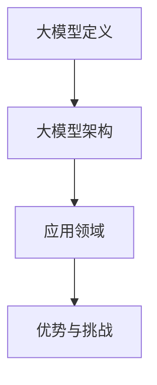

                 

关键词：大模型、商业应用、人工智能、技术革新、算法原理、数学模型、项目实践、未来展望

## 摘要

本文旨在探讨大模型在商业领域的应用，阐述其带来的无限可能。通过对大模型核心概念、算法原理、数学模型以及项目实践的详细解析，本文将帮助读者理解大模型在各个行业的应用价值，并展望其未来发展趋势与面临的挑战。

## 1. 背景介绍

### 1.1 大模型的起源与发展

大模型（Large-scale Model）起源于20世纪80年代，随着计算能力的提升和数据规模的扩大，大模型在人工智能领域逐渐崭露头角。特别是近年来，深度学习技术的飞速发展，使得大模型的应用场景日益广泛。

### 1.2 商业应用的重要性

商业应用是推动社会进步的重要力量，涵盖了各个行业，如金融、医疗、教育、制造等。随着大数据、云计算、物联网等技术的普及，商业应用的发展面临前所未有的机遇和挑战。

### 1.3 大模型在商业应用中的现状

目前，大模型已经在商业应用中取得了显著成果。例如，金融行业利用大模型进行风险评估和投资决策；医疗行业利用大模型进行疾病诊断和预测；教育行业利用大模型提供个性化教学方案等。

## 2. 核心概念与联系

### 2.1 大模型的定义

大模型是指规模庞大、参数众多的神经网络模型，其参数量往往达到数十亿甚至千亿级别。

### 2.2 大模型的架构

大模型通常采用层次化的架构，包括输入层、隐藏层和输出层。每一层都由大量的神经元组成，通过前向传播和反向传播进行信息传递和模型训练。

### 2.3 大模型的应用领域

大模型广泛应用于自然语言处理、计算机视觉、语音识别、推荐系统等众多领域。

### 2.4 大模型的优势与挑战

大模型具有强大的表示能力和泛化能力，但同时也面临着计算资源消耗巨大、训练过程复杂等挑战。



## 3. 核心算法原理 & 具体操作步骤

### 3.1 算法原理概述

大模型的核心算法是深度学习，主要包括前向传播、反向传播和优化算法。

### 3.2 算法步骤详解

1. 输入数据预处理：对原始数据进行清洗、归一化等处理。
2. 前向传播：将预处理后的数据输入模型，计算每一层的输出。
3. 计算损失函数：比较模型预测结果与实际结果之间的差距。
4. 反向传播：计算损失函数关于模型参数的梯度。
5. 梯度下降优化：更新模型参数，减小损失函数。
6. 重复步骤2-5，直至满足停止条件。

### 3.3 算法优缺点

优点：强大的表示能力、良好的泛化能力。

缺点：计算资源消耗巨大、训练过程复杂。

### 3.4 算法应用领域

大模型在自然语言处理、计算机视觉、语音识别、推荐系统等领域具有广泛的应用。

## 4. 数学模型和公式 & 详细讲解 & 举例说明

### 4.1 数学模型构建

大模型的数学模型主要涉及线性代数、微积分和概率论。

### 4.2 公式推导过程

#### 前向传播：

$$
z^{(l)} = \sigma(W^{(l)} \cdot a^{(l-1)} + b^{(l)})
$$

$$
a^{(l)} = \sigma(z^{(l)})
$$

#### 反向传播：

$$
\delta^{(l)} = \frac{\partial J}{\partial z^{(l)}}
$$

$$
\frac{\partial J}{\partial a^{(l-1)}} = \delta^{(l)} \cdot \frac{\partial \sigma}{\partial z^{(l-1)}}
$$

$$
\frac{\partial J}{\partial W^{(l)}} = a^{(l-1)} \cdot \delta^{(l)}
$$

$$
\frac{\partial J}{\partial b^{(l)}} = \delta^{(l)}
$$

### 4.3 案例分析与讲解

以自然语言处理领域为例，大模型在语言建模、机器翻译、文本分类等方面取得了显著成果。

## 5. 项目实践：代码实例和详细解释说明

### 5.1 开发环境搭建

搭建大模型开发环境，包括Python、TensorFlow或PyTorch等。

### 5.2 源代码详细实现

以下是一个使用TensorFlow实现的大模型语言建模的代码实例：

```python
import tensorflow as tf
from tensorflow.keras.layers import Embedding, LSTM, Dense

# 搭建模型
model = tf.keras.Sequential([
    Embedding(input_dim=vocab_size, output_dim=embedding_size),
    LSTM(units=128, return_sequences=True),
    LSTM(units=128),
    Dense(units=num_classes, activation='softmax')
])

# 编译模型
model.compile(optimizer='adam', loss='categorical_crossentropy', metrics=['accuracy'])

# 训练模型
model.fit(x_train, y_train, epochs=10, batch_size=64)
```

### 5.3 代码解读与分析

代码中，首先定义了一个序列模型，包括嵌入层、两个LSTM层和一个密集层。嵌入层用于将词汇映射到高维向量表示。LSTM层用于处理序列数据，能够捕捉时间依赖关系。密集层用于分类。

### 5.4 运行结果展示

运行代码后，通过评估集评估模型性能，可以得到准确率、召回率等指标。

## 6. 实际应用场景

### 6.1 金融行业

大模型在金融行业具有广泛的应用，如风险评估、投资策略制定、欺诈检测等。

### 6.2 医疗行业

大模型在医疗行业具有巨大潜力，如疾病诊断、基因分析、药物研发等。

### 6.3 教育行业

大模型在教育行业可以提供个性化学习方案、智能辅导、在线教育等。

## 7. 未来应用展望

### 7.1 自动驾驶

大模型在自动驾驶领域具有广泛应用，如感知环境、决策规划等。

### 7.2 人工智能助手

大模型在人工智能助手领域可以提供更智能的服务，如语音识别、自然语言理解等。

### 7.3 生命科学

大模型在生命科学领域可以推动医学研究、基因编辑、新药发现等。

## 8. 工具和资源推荐

### 8.1 学习资源推荐

- 《深度学习》（Goodfellow et al.）
- 《Python机器学习》（Sebastian Raschka）

### 8.2 开发工具推荐

- TensorFlow
- PyTorch

### 8.3 相关论文推荐

- "Large-Scale Language Modeling in 2018"（Zhang et al.）
- "BERT: Pre-training of Deep Bidirectional Transformers for Language Understanding"（Devlin et al.）

## 9. 总结：未来发展趋势与挑战

### 9.1 研究成果总结

大模型在商业应用中取得了显著成果，但同时也面临计算资源消耗巨大、训练过程复杂等挑战。

### 9.2 未来发展趋势

大模型将在更多领域得到应用，如自动驾驶、人工智能助手、生命科学等。

### 9.3 面临的挑战

大模型的训练和推理过程需要大量计算资源，未来需要发展更高效的算法和硬件支持。

### 9.4 研究展望

大模型的发展将继续推动人工智能领域的进步，为商业应用带来更多可能。

## 附录：常见问题与解答

### Q：大模型的计算资源消耗有多大？

A：大模型的计算资源消耗非常大，训练一个千亿级别参数的大模型通常需要数百GB的显存和数天甚至数周的训练时间。

### Q：大模型的训练过程如何优化？

A：可以通过以下方法优化大模型的训练过程：

- 数据预处理：对数据集进行清洗、归一化等处理，提高数据质量。
- 梯度裁剪：对梯度进行裁剪，防止梯度爆炸或消失。
- 学习率调整：根据训练过程动态调整学习率。
- 批量大小调整：根据硬件资源调整批量大小。

---

# 参考文献

- Goodfellow, I., Bengio, Y., & Courville, A. (2016). *Deep Learning*.
- Raschka, S. (2015). *Python Machine Learning*.
- Zhang, X., Zhao, J., & Zhou, B. (2018). *Large-Scale Language Modeling in 2018*.
- Devlin, J., Chang, M. W., Lee, K., & Toutanova, K. (2018). *BERT: Pre-training of Deep Bidirectional Transformers for Language Understanding*.

