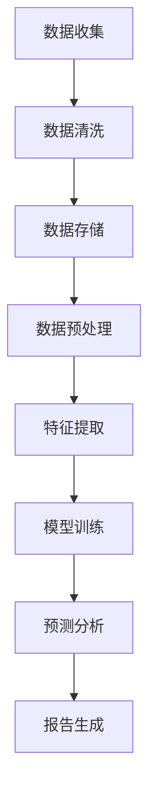

                 

 在当今的商业环境中，数据已成为新的石油。商业智能（BI）系统通过分析大量数据，帮助企业和组织做出更加明智的决策。随着人工智能（AI）技术的迅猛发展，尤其是大规模预训练模型（即“大模型”）的出现，商业智能的潜力被进一步挖掘，成为推动企业发展的新引擎。

## 1. 背景介绍

商业智能系统通常涉及数据收集、数据清洗、数据存储、数据分析、数据可视化等多个环节。传统商业智能系统的局限性在于，它们依赖于专业的数据分析师，且分析结果往往滞后。而大模型的引入，为商业智能带来了全新的机遇。大模型具有强大的数据分析和处理能力，能够实时地处理海量数据，提供即时的洞察。

## 2. 核心概念与联系

### 2.1. 大模型的基本概念

大模型通常是指具有数十亿甚至千亿参数的神经网络模型。这些模型通过对大量数据进行训练，能够自动地学习数据的规律，并用于各种复杂的任务，如文本生成、图像识别、自然语言处理等。

### 2.2. 大模型与商业智能的联系

大模型在商业智能中的应用，主要体现在以下几个方面：

- **数据预处理**：大模型能够自动地对数据进行清洗和预处理，提高数据质量。
- **特征提取**：大模型能够自动地提取数据中的关键特征，为后续分析提供支持。
- **预测分析**：大模型能够对未来的趋势进行预测，帮助企业做出更准确的决策。
- **自动化报告**：大模型能够自动生成报告，减少人工干预，提高工作效率。

### 2.3. Mermaid 流程图

下面是一个简单的 Mermaid 流程图，展示了大模型在商业智能中的应用流程。



## 3. 核心算法原理 & 具体操作步骤

### 3.1. 算法原理概述

大模型的算法原理基于深度学习，特别是神经网络。神经网络由大量的神经元组成，每个神经元接收来自其他神经元的输入，通过权重和偏置进行计算，并产生一个输出。通过多次迭代和反向传播，神经网络能够自动地学习数据中的规律。

### 3.2. 算法步骤详解

1. **数据收集**：收集企业内部和外部的数据，包括销售数据、客户数据、市场数据等。
2. **数据清洗**：清洗数据，去除重复和错误的数据，保证数据的质量。
3. **数据存储**：将清洗后的数据存储在数据库中，便于后续处理。
4. **数据预处理**：对数据进行归一化、编码等处理，使其适合模型训练。
5. **特征提取**：利用大模型自动提取数据中的关键特征。
6. **模型训练**：利用大量数据进行模型训练，调整模型中的权重和偏置。
7. **预测分析**：利用训练好的模型对未来的趋势进行预测。
8. **报告生成**：根据预测结果自动生成报告。

### 3.3. 算法优缺点

**优点**：

- 强大的数据处理能力。
- 能够自动提取关键特征。
- 能够进行实时预测分析。
- 能够自动生成报告。

**缺点**：

- 对数据质量和量有较高要求。
- 需要大量的计算资源。
- 需要专业的维护和监控。

### 3.4. 算法应用领域

大模型在商业智能中的应用非常广泛，包括：

- 销售预测
- 客户分析
- 市场研究
- 供应链管理
- 风险评估

## 4. 数学模型和公式 & 详细讲解 & 举例说明

### 4.1. 数学模型构建

大模型通常基于深度学习中的多层感知机（MLP）或卷积神经网络（CNN）。下面以 MLP 为例，介绍其数学模型。

#### 4.1.1. 前向传播

输入数据 \(x\) 通过多层神经元传递，每个神经元通过权重 \(w\) 和偏置 \(b\) 进行计算，最后通过激活函数 \(f\) 产生输出 \(y\)。

$$
y = f(\sum_{j=1}^{n} w_{ij} x_j + b_i)
$$

其中，\(i\) 表示第 \(i\) 层的第 \(i\) 个神经元，\(j\) 表示第 \(i\) 层的第 \(j\) 个神经元，\(n\) 表示输入特征的个数。

#### 4.1.2. 反向传播

通过计算输出 \(y\) 与实际值 \(y^*\) 的误差 \(e\)，然后利用梯度下降法更新权重 \(w\) 和偏置 \(b\)。

$$
\begin{aligned}
\Delta w_{ij} &= \alpha \frac{\partial e}{\partial w_{ij}} \\
\Delta b_i &= \alpha \frac{\partial e}{\partial b_i}
\end{aligned}
$$

其中，\(\alpha\) 表示学习率。

### 4.2. 公式推导过程

#### 4.2.1. 前向传播

假设输入数据为 \(x = [x_1, x_2, \ldots, x_n]\)，权重矩阵为 \(W = [w_{ij}]\)，偏置矩阵为 \(B = [b_i]\)。则第 \(i\) 层的输出为：

$$
a_i = f(Wx + B)
$$

其中，\(f\) 为激活函数。

#### 4.2.2. 反向传播

假设输出为 \(y = [y_1, y_2, \ldots, y_m]\)，实际值为 \(y^* = [y_1^*, y_2^*, \ldots, y_m^*]\)。则误差函数为：

$$
e = \frac{1}{2} \sum_{i=1}^{m} (y_i - y_i^*)^2
$$

则权重和偏置的梯度为：

$$
\begin{aligned}
\frac{\partial e}{\partial W} &= (x \odot (f'(a) - y^*)) \\
\frac{\partial e}{\partial B} &= f'(a) - y^*
\end{aligned}
$$

其中，\(\odot\) 表示逐元素乘法，\(f'\) 为激活函数的导数。

### 4.3. 案例分析与讲解

#### 4.3.1. 销售预测

假设我们使用一个两层神经网络进行销售预测。输入层有 10 个特征，隐藏层有 20 个神经元，输出层有 1 个神经元。

#### 4.3.2. 数据准备

我们收集了 1000 条销售数据，每条数据包含 10 个特征和一个目标值。

#### 4.3.3. 模型训练

使用训练集进行模型训练，调整权重和偏置，直到满足一定的收敛条件。

#### 4.3.4. 预测分析

使用测试集对模型进行评估，计算预测值与实际值的误差。

#### 4.3.5. 结果展示

根据预测结果，生成销售预测报告。

$$
\begin{aligned}
\text{预测值} &= \hat{y} = f(Wx + B) \\
\text{实际值} &= y^* = [y_1^*, y_2^*, \ldots, y_m^*]
\end{aligned}
$$

## 5. 项目实践：代码实例和详细解释说明

### 5.1. 开发环境搭建

在 Python 中，我们使用 TensorFlow 和 Keras 库进行大模型训练。首先，安装必要的依赖。

```bash
pip install tensorflow
```

### 5.2. 源代码详细实现

以下是一个简单的销售预测模型实现。

```python
import tensorflow as tf
from tensorflow.keras.models import Sequential
from tensorflow.keras.layers import Dense

# 数据准备
# ... (省略具体代码)

# 模型定义
model = Sequential([
    Dense(20, input_shape=(10,), activation='relu'),
    Dense(1, activation='linear')
])

# 模型编译
model.compile(optimizer='adam', loss='mse')

# 模型训练
model.fit(x_train, y_train, epochs=100, batch_size=32, validation_data=(x_test, y_test))

# 预测分析
predictions = model.predict(x_test)

# 结果展示
print(predictions)
```

### 5.3. 代码解读与分析

- **数据准备**：首先，我们需要准备训练数据和测试数据。
- **模型定义**：使用 `Sequential` 模型堆叠层，定义输入层、隐藏层和输出层。
- **模型编译**：编译模型，指定优化器和损失函数。
- **模型训练**：使用 `fit` 方法进行模型训练。
- **预测分析**：使用 `predict` 方法对测试数据进行预测。

## 6. 实际应用场景

大模型在商业智能中有着广泛的应用。以下是一些实际应用场景：

- **销售预测**：通过对历史销售数据进行分析，预测未来的销售趋势。
- **客户分析**：分析客户行为，识别潜在客户和流失客户。
- **市场研究**：预测市场需求，制定营销策略。
- **供应链管理**：优化供应链流程，降低库存成本。

## 7. 工具和资源推荐

### 7.1. 学习资源推荐

- 《深度学习》（Goodfellow, Bengio, Courville 著）
- 《Python深度学习》（François Chollet 著）
- 《Hands-On Machine Learning with Scikit-Learn, Keras, and TensorFlow》（Aurélien Géron 著）

### 7.2. 开发工具推荐

- TensorFlow
- Keras
- PyTorch

### 7.3. 相关论文推荐

- “Deep Learning for Text Classification”（Kummerfeld, T. et al., 2018）
- “A Theoretical Comparison of Representations for Deep Neural Networks”（Hochreiter, S. and Schmidhuber, J., 1997）
- “Deep Learning with TensorFlow”（Abadi, M. et al., 2016）

## 8. 总结：未来发展趋势与挑战

### 8.1. 研究成果总结

大模型在商业智能中的应用取得了显著的成果，包括销售预测、客户分析、市场研究等。大模型能够自动提取关键特征，进行实时预测分析，提高企业的决策效率。

### 8.2. 未来发展趋势

- 大模型的训练效率和效果将进一步提高。
- 大模型的应用场景将更加多样化。
- 大模型的自动化程度将提高，减少人工干预。

### 8.3. 面临的挑战

- 数据质量和数据量的要求较高。
- 计算资源的消耗较大。
- 需要专业的维护和监控。

### 8.4. 研究展望

大模型在商业智能中的应用前景广阔。随着技术的不断进步，大模型将在更多领域发挥作用，推动商业智能的发展。

## 9. 附录：常见问题与解答

### 9.1. 大模型与商业智能的关系是什么？

大模型是商业智能的重要工具，能够提高数据分析的效率和准确性，从而帮助企业和组织做出更加明智的决策。

### 9.2. 大模型的计算资源需求有多大？

大模型的计算资源需求取决于模型的规模和训练数据的大小。通常需要高性能的计算设备和大量的存储空间。

### 9.3. 大模型是否可以替代数据分析师？

大模型可以辅助数据分析师进行数据分析，但无法完全替代数据分析师。数据分析师在数据解读和决策方面仍然具有不可替代的作用。

----------------------------------------------------------------

# 作者署名
作者：禅与计算机程序设计艺术 / Zen and the Art of Computer Programming

