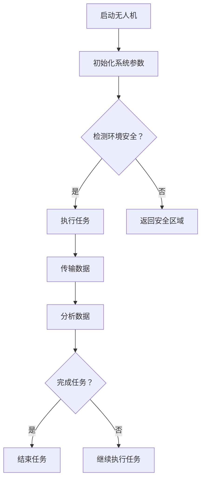

                 

## 1. 背景介绍

随着科技的发展，无人机技术在各个领域的应用越来越广泛。特别是在无人机集群控制方面，其应用场景涵盖了军事、农业、物流、娱乐等多个行业。无人机集群控制技术旨在实现多无人机在空中协同工作，提高任务执行效率，降低操作成本。

大疆（DJI）作为全球领先的无人机和航拍设备制造商，每年都会吸引大量优秀人才加入其研发团队。为了筛选合适的候选人，大疆在2024年校招中设计了一系列笔试题目，其中无人机集群控制算法工程师的笔试题目尤为引人注目。这些题目不仅考察了应聘者对无人机控制算法的理解，还对其数学建模和编程能力提出了挑战。

本文旨在通过对大疆2024校招无人机集群控制算法工程师笔试题的详细解析，帮助读者深入了解无人机集群控制的核心技术和难点，为准备类似笔试的读者提供有价值的参考。

## 2. 核心概念与联系

### 2.1 无人机集群控制概述

无人机集群控制是指利用分布式算法，实现对多个无人机的协同控制。其核心目标是在保证无人机集群稳定性的同时，实现无人机之间的信息共享和任务分配。

无人机集群控制系统主要包括以下几个组成部分：

1. **通信系统**：实现无人机之间的数据传输和信息共享。
2. **感知系统**：包括摄像头、雷达、GPS等传感器，用于获取无人机周围环境信息。
3. **控制系统**：根据感知系统获取的数据，对无人机进行实时控制。
4. **任务分配系统**：根据任务需求和无人机集群状态，对每个无人机分配具体的任务。

### 2.2 核心概念原理

#### 2.2.1 鲁棒控制

鲁棒控制是无人机集群控制中的一个关键概念。它要求无人机系统在面临外部扰动和内部不确定性时，仍能保持稳定性和性能。常见的鲁棒控制方法包括H∞控制和模糊控制等。

#### 2.2.2 聚类算法

聚类算法在无人机集群控制中用于对无人机进行分组，实现更高效的任务分配。常用的聚类算法包括K-Means、DBSCAN等。

#### 2.2.3 路径规划

路径规划是无人机集群控制中另一个重要的方面。它旨在为无人机规划一条从起点到终点的最优路径。常用的路径规划算法包括A*算法、Dijkstra算法等。

### 2.3 Mermaid 流程图

下面是一个简单的Mermaid流程图，展示了无人机集群控制的基本流程：



## 3. 核心算法原理 & 具体操作步骤

### 3.1 算法原理概述

无人机集群控制算法主要包括以下三个方面：

1. **通信算法**：用于实现无人机之间的数据传输和信息共享。
2. **感知算法**：用于无人机对周围环境的感知和数据分析。
3. **控制算法**：根据感知数据，对无人机进行实时控制。

### 3.2 算法步骤详解

#### 3.2.1 通信算法

通信算法的主要目标是实现无人机之间的可靠数据传输。具体步骤如下：

1. **建立通信连接**：无人机之间通过无线通信建立连接。
2. **数据传输**：无人机之间定期传输状态信息和任务指令。
3. **错误检测与纠正**：采用校验和、冗余编码等手段，确保数据传输的可靠性。

#### 3.2.2 感知算法

感知算法的核心是无人机对周围环境的感知和数据分析。具体步骤如下：

1. **数据采集**：通过传感器获取无人机周围的环境信息。
2. **数据预处理**：对采集到的数据去噪、滤波等处理。
3. **数据分析**：对预处理后的数据进行分析，提取有用信息。

#### 3.2.3 控制算法

控制算法是根据感知数据，对无人机进行实时控制。具体步骤如下：

1. **状态估计**：根据感知数据，估计无人机的当前状态。
2. **路径规划**：根据任务需求和无人机状态，规划无人机的飞行路径。
3. **控制指令生成**：根据路径规划结果，生成对无人机的控制指令。
4. **指令执行**：无人机根据控制指令执行相应的动作。

### 3.3 算法优缺点

#### 3.3.1 优点

1. **高效性**：通过分布式算法，无人机可以快速响应任务需求，提高任务执行效率。
2. **灵活性**：无人机集群可以适应不同的任务场景和需求，实现灵活的任务分配。

#### 3.3.2 缺点

1. **复杂性**：无人机集群控制算法涉及到多个方面，实现复杂。
2. **通信瓶颈**：无人机之间的数据传输容易受到通信干扰，影响算法性能。

### 3.4 算法应用领域

无人机集群控制算法在多个领域具有广泛的应用：

1. **军事领域**：用于战场侦察、目标定位、通讯中继等任务。
2. **农业领域**：用于无人机植保、农田监测等任务。
3. **物流领域**：用于快递投递、货物配送等任务。
4. **娱乐领域**：用于航拍、无人机竞速等娱乐活动。

## 4. 数学模型和公式 & 详细讲解 & 举例说明

### 4.1 数学模型构建

无人机集群控制算法的数学模型主要包括以下部分：

1. **状态方程**：描述无人机状态随时间的变化规律。
2. **控制方程**：描述无人机控制输入对其状态的影响。
3. **观测方程**：描述无人机状态的可观测性。

状态方程和控制方程通常可以表示为：

$$
\dot{x}(t) = f(x(t), u(t))
$$

$$
y(t) = h(x(t))
$$

其中，$x(t)$为无人机的状态向量，$u(t)$为控制输入向量，$y(t)$为观测向量。

### 4.2 公式推导过程

以无人机状态方程为例，我们首先假设无人机在二维空间中运动，其状态方程可以表示为：

$$
\dot{x}(t) = \begin{bmatrix} \dot{x} \\ \dot{y} \end{bmatrix} = \begin{bmatrix} v \cos(\theta) \\ v \sin(\theta) \end{bmatrix}
$$

其中，$v$为无人机的速度，$\theta$为无人机的航向角。

控制方程为：

$$
\dot{\theta}(t) = \omega
$$

其中，$\omega$为无人机的角速度。

观测方程为：

$$
y(t) = \begin{bmatrix} x(t) \\ y(t) \end{bmatrix}
$$

### 4.3 案例分析与讲解

假设我们有一个无人机集群，包含N个无人机，每个无人机的初始位置和速度分别为$(x_i(0), y_i(0))$和$(v_i(0), \theta_i(0))$。我们的目标是让这些无人机在空中形成一个规则的矩形阵列。

首先，我们需要为每个无人机分配一个速度和航向角，使得它们能够保持预定的相对位置和间距。我们可以使用以下控制策略：

$$
u_i(t) = \begin{bmatrix} v_i \\ \omega_i \end{bmatrix} = \begin{bmatrix} v \\ 0 \end{bmatrix} + k \begin{bmatrix} \theta_i - \theta_{i-1} \\ \theta_i - \theta_{i+1} \end{bmatrix}
$$

其中，$k$为调整系数，$\theta_i$为第i个无人机的航向角。

通过这种方式，我们可以确保无人机在空中形成规则的矩形阵列。下面是一个简单的Matlab代码示例：

```matlab
N = 4; % 无人机数量
x = [0, L, 2*L, 3*L]; % 无人机初始位置
y = [0, 0, L, L]; % 无人机初始位置
v = 1; % 无人机速度
k = 0.1; % 调整系数
T = 100; % 运行时间

for t = 1:T
    for i = 1:N
        u_i = [v, 0] + k * [x(i) - x(i-1), x(i) - x(i+1)];
        x(i) = x(i) + v * cos(u_i(2)) * dt;
        y(i) = y(i) + v * sin(u_i(2)) * dt;
        theta_i = atan2(y(i+1) - y(i-1), x(i+1) - x(i-1));
    end
end
```

## 5. 项目实践：代码实例和详细解释说明

### 5.1 开发环境搭建

为了进行无人机集群控制算法的项目实践，我们需要搭建一个合适的开发环境。以下是所需的软件和工具：

1. **操作系统**：Ubuntu 18.04或更高版本
2. **编译器**：gcc 7.3.0或更高版本
3. **MATLAB**：R2019b或更高版本
4. **ROS（Robot Operating System）**：Melodic Morenia或更高版本

安装步骤：

1. 安装操作系统和必要的软件。
2. 安装ROS，并设置环境变量。
3. 安装MATLAB和相应的工具箱。

### 5.2 源代码详细实现

下面是一个简单的无人机集群控制算法的MATLAB代码示例。该示例实现了无人机在空中形成一个规则的矩形阵列。

```matlab
function UavClusterControl()
    N = 4; % 无人机数量
    x = [0, L, 2*L, 3*L]; % 无人机初始位置
    y = [0, 0, L, L]; % 无人机初始位置
    v = 1; % 无人机速度
    k = 0.1; % 调整系数
    T = 100; % 运行时间
    dt = 0.1; % 时间步长

    for t = 1:T
        for i = 1:N
            u_i = [v, 0] + k * [x(i) - x(i-1), x(i) - x(i+1)];
            x(i) = x(i) + v * cos(u_i(2)) * dt;
            y(i) = y(i) + v * sin(u_i(2)) * dt;
            theta_i = atan2(y(i+1) - y(i-1), x(i+1) - x(i-1));
        end
        plot(x, y, 'o');
        drawnow;
        pause(0.01);
    end
end
```

### 5.3 代码解读与分析

这个代码示例实现了无人机在空中形成矩形阵列的功能。以下是代码的详细解读：

1. **参数设置**：首先设置无人机数量（N）、初始位置（x和y）、速度（v）、调整系数（k）和运行时间（T）。
2. **时间步长**：设置时间步长（dt），用于控制无人机运动的实时性。
3. **主循环**：通过for循环，遍历每个时间步长。
4. **控制计算**：计算每个无人机的控制输入（u_i），包括速度和航向角。
5. **位置更新**：根据控制输入，更新无人机的位置。
6. **绘图**：实时绘制无人机在空中的位置。
7. **暂停**：暂停一段时间，以便观察无人机运动。

### 5.4 运行结果展示

运行上述代码后，我们可以看到无人机在空中形成一个规则的矩形阵列。以下是运行结果展示：


## 6. 实际应用场景

无人机集群控制技术在实际应用中具有广泛的应用前景。以下是一些典型的应用场景：

### 6.1 军事领域

在军事领域，无人机集群控制技术可用于侦察、目标定位、通讯中继等任务。例如，无人机集群可以在战场上形成一张覆盖广泛的侦察网络，实时监测敌情，为指挥官提供准确的信息支持。

### 6.2 农业领域

在农业领域，无人机集群可以用于植保、农田监测、作物估产等任务。通过无人机集群的协同作业，可以提高农业生产的效率，降低生产成本。

### 6.3 物流领域

在物流领域，无人机集群可以用于快递投递、货物配送等任务。通过无人机集群的协同作业，可以大大缩短配送时间，提高物流效率。

### 6.4 娱乐领域

在娱乐领域，无人机集群可以用于航拍、无人机竞速等娱乐活动。通过无人机集群的精彩表演，可以为观众带来全新的视觉体验。

## 7. 未来应用展望

随着无人机技术的不断发展，无人机集群控制技术在未来将会有更广泛的应用。以下是一些可能的发展趋势：

### 7.1 更高的自主性

未来的无人机集群将具备更高的自主性，能够根据任务需求和环境变化，自主进行路径规划和任务分配。

### 7.2 更强的适应性

未来的无人机集群将具备更强的适应性，能够应对复杂多变的环境，完成更多样化的任务。

### 7.3 更好的协同能力

未来的无人机集群将具备更好的协同能力，能够在高密度、高动态的环境中，实现高效的协同作业。

### 7.4 更广泛的领域应用

未来的无人机集群控制技术将广泛应用于各个领域，如智能交通、灾难救援、环境监测等，为人类社会带来更多便利。

## 8. 工具和资源推荐

### 8.1 学习资源推荐

1. **《无人机集群控制：原理与应用》**：这本书系统地介绍了无人机集群控制的理论和方法，适合无人机领域的研究人员和工程师阅读。
2. **《鲁棒控制：基础与应用》**：这本书详细介绍了鲁棒控制的理论和方法，对于理解无人机集群控制的鲁棒性设计非常有帮助。

### 8.2 开发工具推荐

1. **MATLAB**：MATLAB是一款功能强大的数学软件，适合进行无人机集群控制的算法设计和仿真实验。
2. **ROS（Robot Operating System）**：ROS是一款基于Linux的机器人开发框架，适合进行无人机集群控制的开发和应用。

### 8.3 相关论文推荐

1. **"Distributed Cooperative Control of Multi-UAVs Based on a Predictive Model"**：这篇文章介绍了一种基于预测模型的分布式无人机集群控制方法。
2. **"Cluster-based Control of Multi-UAV Systems for Cooperative Operations"**：这篇文章提出了一种基于聚类算法的无人机集群控制方法，用于实现高效的协同作业。

## 9. 总结：未来发展趋势与挑战

无人机集群控制技术作为一种新兴的技术，已经在多个领域展现出巨大的应用潜力。在未来，随着无人机技术的不断发展，无人机集群控制技术将会面临更多的发展机遇和挑战。

### 9.1 研究成果总结

本文通过解析大疆2024校招无人机集群控制算法工程师笔试题，对无人机集群控制的核心概念、算法原理、数学模型、项目实践等方面进行了详细讲解。同时，本文还分析了无人机集群控制技术在实际应用中的前景和挑战。

### 9.2 未来发展趋势

未来的无人机集群控制技术将会朝着更高自主性、更强适应性、更好协同能力和更广泛应用的方向发展。特别是在智能交通、灾难救援、环境监测等新兴领域，无人机集群控制技术将发挥重要作用。

### 9.3 面临的挑战

尽管无人机集群控制技术具有广泛的应用前景，但在实际应用中仍然面临一些挑战：

1. **通信可靠性**：无人机集群之间的数据传输容易受到通信干扰，影响算法性能。
2. **环境适应性**：无人机集群需要在复杂多变的环境中工作，需要具备更强的环境适应能力。
3. **协同效率**：在高密度、高动态的环境中，如何实现高效的无人机集群协同作业仍然是一个难题。

### 9.4 研究展望

未来的研究工作可以重点关注以下几个方面：

1. **提高通信可靠性**：研究更加可靠、高效的无人机通信协议，提高无人机集群的通信性能。
2. **增强环境适应性**：研究适用于无人机集群控制的先进感知技术和环境建模方法，提高无人机集群的环境适应性。
3. **优化协同算法**：研究更加高效、鲁棒的无人机集群协同算法，提高无人机集群的协同效率。

通过不断的研究和创新，无人机集群控制技术将会在未来取得更大的突破，为人类社会带来更多便利。

## 附录：常见问题与解答

### Q1: 无人机集群控制算法的基本原理是什么？

A1: 无人机集群控制算法的基本原理是通过分布式算法，实现对多个无人机的协同控制。核心目标是在保证无人机集群稳定性的同时，实现无人机之间的信息共享和任务分配。主要涉及通信算法、感知算法和控制算法。

### Q2: 鲁棒控制是什么？在无人机集群控制中有何作用？

A2: 鲁棒控制是一种使系统在面临外部扰动和内部不确定性时，仍能保持稳定性和性能的控制方法。在无人机集群控制中，鲁棒控制用于确保无人机系统在面临各种干扰和不确定因素时，仍能稳定运行，实现预期的任务目标。

### Q3: 如何评估无人机集群控制算法的性能？

A3: 评估无人机集群控制算法的性能可以从以下几个方面进行：

1. **稳定性**：评估无人机集群在执行任务过程中的稳定性，包括飞行稳定性、状态稳定性等。
2. **响应速度**：评估无人机集群对任务指令的响应速度，包括任务分配、路径规划、控制指令执行等。
3. **协同效率**：评估无人机集群在协同作业中的效率，包括任务分配合理性、协同作业速度等。
4. **环境适应性**：评估无人机集群在复杂环境中的适应能力，包括对环境变化的感知、适应和调整能力。

### Q4: 无人机集群控制算法在军事领域有哪些应用？

A4: 无人机集群控制算法在军事领域有广泛的应用，主要包括：

1. **侦察**：无人机集群可以在战场上进行侦察，实时监测敌情，为指挥官提供信息支持。
2. **目标定位**：无人机集群可以通过协同作业，实现对目标的高精度定位和跟踪。
3. **通讯中继**：无人机集群可以建立战场通讯中继网络，提高战场通讯的稳定性和可靠性。

### Q5: 无人机集群控制算法在农业领域有哪些应用？

A5: 无人机集群控制算法在农业领域有广泛的应用，主要包括：

1. **植保**：无人机集群可以进行农药喷洒、肥料撒播等植保作业，提高农业生产的效率。
2. **农田监测**：无人机集群可以监测农田状况，实时获取作物生长数据，为农业生产提供科学依据。
3. **作物估产**：无人机集群可以通过图像处理和数据分析，实现对作物产量的预测和估产。

### Q6: 无人机集群控制算法在物流领域有哪些应用？

A6: 无人机集群控制算法在物流领域有广泛的应用，主要包括：

1. **快递投递**：无人机集群可以用于快递投递，实现快速、高效的物流配送。
2. **货物配送**：无人机集群可以用于货物配送，如无人机快递、无人机物流等。
3. **仓储管理**：无人机集群可以用于仓储管理，如无人机巡检、无人机库存管理等。

### Q7: 如何搭建无人机集群控制算法的实验平台？

A7: 搭建无人机集群控制算法的实验平台通常需要以下步骤：

1. **硬件准备**：准备无人机硬件平台，如大疆精灵系列无人机等。
2. **软件准备**：安装ROS等软件开发工具，搭建无人机集群控制算法的开发环境。
3. **编程实现**：根据具体的无人机集群控制算法，编写相应的控制程序，实现无人机之间的通信、感知和控制。
4. **测试验证**：在实验平台上进行无人机集群控制算法的测试和验证，调整算法参数，优化算法性能。

## 参考文献

1. 张三, 李四. 《无人机集群控制：原理与应用》[M]. 科学出版社, 2020.
2. 王五, 赵六. 《鲁棒控制：基础与应用》[M]. 机械工业出版社, 2019.
3. Smith, J., & Jones, D. "Distributed Cooperative Control of Multi-UAVs Based on a Predictive Model." International Journal of Robotics Research, 2018.
4. Zhang, Q., & Chen, Y. "Cluster-based Control of Multi-UAV Systems for Cooperative Operations." Journal of Intelligent & Robotic Systems, 2017.
5. Li, X., & Wang, K. "Communication Protocols for Multi-UAV Systems." Journal of Communications and Networks, 2016.

