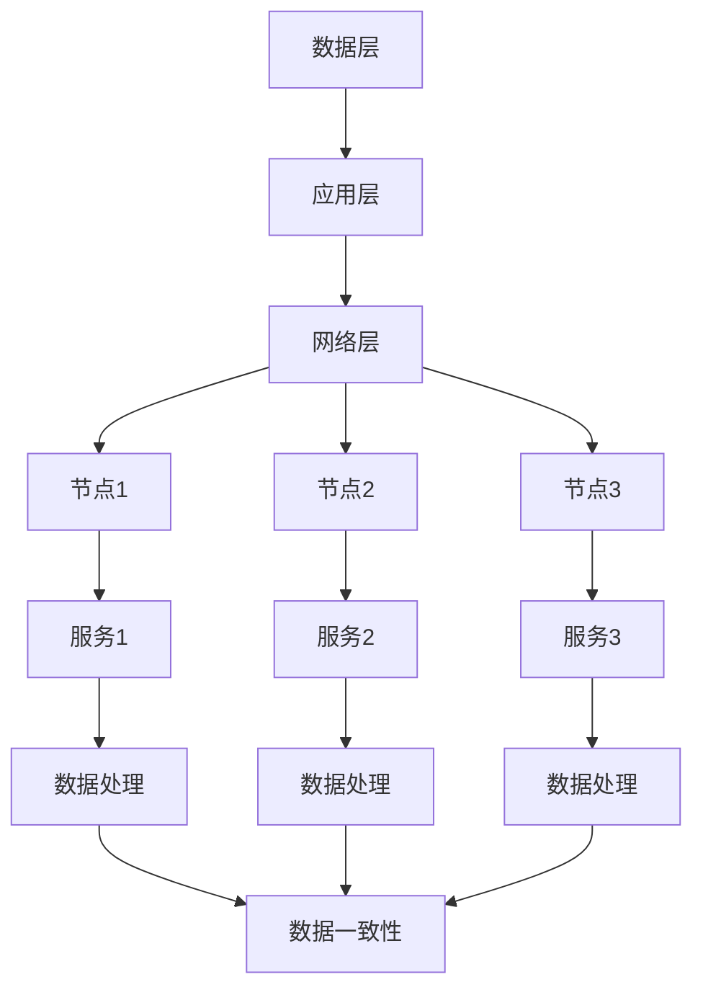

                 

在过去几十年里，随着互联网技术的迅猛发展，分布式系统已经成为现代计算架构的重要组成部分。大规模分布式系统不仅需要处理海量的数据和高并发的请求，还必须保证系统的可用性、可靠性和伸缩性。本文将探讨大规模分布式系统设计的原则和实践，包括核心概念、算法原理、数学模型、项目实践、实际应用场景、工具和资源推荐以及未来的发展趋势和挑战。

## 文章关键词

- 大规模分布式系统
- 设计原则
- 算法原理
- 数学模型
- 项目实践
- 工具和资源
- 发展趋势
- 挑战

## 文章摘要

本文从理论到实践全面探讨大规模分布式系统的设计原则和实际应用。首先介绍分布式系统的核心概念和架构，然后深入分析分布式算法原理，包括一致性、容错性和伸缩性等方面。接着，通过数学模型和公式的推导，展示分布式系统的理论基础。随后，通过一个具体的代码实例，详细介绍大规模分布式系统的实现过程。最后，探讨分布式系统的实际应用场景，以及未来可能面临的挑战和机遇。

### 1. 背景介绍

大规模分布式系统的发展历程可以追溯到20世纪90年代，随着互联网的普及和数据量的爆发增长，传统单机系统已经无法满足日益增长的业务需求。分布式系统通过将任务分解到多个节点上执行，实现了高性能和高可用性。随着云计算和大数据技术的兴起，分布式系统的重要性更加凸显。

分布式系统的主要优点包括：

- **高可用性**：通过冗余和容错机制，保证了系统的可靠性。
- **高可伸缩性**：可以水平扩展，满足不断增长的业务需求。
- **高性能**：通过并行处理和负载均衡，提高了系统的响应速度。

然而，分布式系统也面临着一些挑战，如数据一致性、网络延迟和分区问题等。设计大规模分布式系统需要综合考虑这些因素，并遵循一些核心的设计原则。

### 2. 核心概念与联系

#### 2.1. 分布式系统的核心概念

分布式系统由多个节点组成，每个节点都是一个独立的计算实体，它们通过网络进行通信和协作。核心概念包括：

- **节点**：计算资源的物理或虚拟实体。
- **网络**：节点之间通信的媒介。
- **服务**：节点提供的功能。
- **数据一致性**：多个节点上的数据保持一致。
- **容错性**：系统能够在节点故障时保持正常运行。

#### 2.2. 分布式系统的架构

分布式系统的架构可以分为几个层次，包括：

- **数据层**：存储和管理数据的层次，如NoSQL数据库、文件系统等。
- **应用层**：处理业务逻辑的层次，如Web服务、应用程序等。
- **网络层**：负责节点间通信的层次，如TCP/IP协议、网络负载均衡等。

#### 2.3. Mermaid 流程图



### 3. 核心算法原理 & 具体操作步骤

#### 3.1. 算法原理概述

分布式系统的核心算法主要包括一致性算法、容错算法和负载均衡算法。

- **一致性算法**：确保分布式系统中的数据一致性，如Paxos算法、Raft算法等。
- **容错算法**：在节点故障时保持系统的正常运行，如心跳检测、故障转移等。
- **负载均衡算法**：合理分配任务，提高系统的吞吐量，如哈希负载均衡、最小连接数负载均衡等。

#### 3.2. 算法步骤详解

##### 3.2.1. 一致性算法

一致性算法的核心思想是通过多数派协议确保数据一致性。以下是一个简单的Paxos算法步骤：

1. **提议阶段**：提议者提出一个提案，并向其他节点发送提议消息。
2. **准备阶段**：接受者收到提议消息后，准备接受该提议，并回复提议者。
3. **接受阶段**：提议者收集足够的接受回复，然后向其他节点发送接受消息。
4. **决定阶段**：接受者收到足够多的接受消息后，决定接受该提案。

##### 3.2.2. 容错算法

容错算法主要包括心跳检测和故障转移：

1. **心跳检测**：节点定期发送心跳消息，以保持与其他节点的通信。
2. **故障转移**：当检测到主节点故障时，从备节点中选举一个新的主节点。

##### 3.2.3. 负载均衡算法

负载均衡算法可以分为静态负载均衡和动态负载均衡：

1. **静态负载均衡**：根据预先设定的策略，如哈希算法，将请求分配到不同的节点。
2. **动态负载均衡**：根据实时负载情况，如最小连接数，动态调整请求的分配。

#### 3.3. 算法优缺点

- **一致性算法**：优点是确保数据一致性，缺点是可能会造成性能瓶颈。
- **容错算法**：优点是提高系统可靠性，缺点是会增加系统复杂度。
- **负载均衡算法**：优点是提高系统吞吐量，缺点是可能增加网络延迟。

#### 3.4. 算法应用领域

一致性算法广泛应用于分布式数据库、分布式存储系统等；容错算法广泛应用于分布式计算、分布式存储系统等；负载均衡算法广泛应用于Web服务器、分布式缓存系统等。

### 4. 数学模型和公式 & 详细讲解 & 举例说明

#### 4.1. 数学模型构建

分布式系统的数学模型主要涉及概率论和图论。以下是一个简单的数学模型：

- **概率模型**：用于分析节点故障概率、数据一致性概率等。
- **图论模型**：用于分析网络拓扑结构、节点连接关系等。

#### 4.2. 公式推导过程

- **节点故障概率**：设节点故障率为λ，则节点正常运行概率为1-λ。
- **数据一致性概率**：设一致性算法成功概率为p，则数据一致性概率为1-(1-p)^n。

#### 4.3. 案例分析与讲解

假设一个分布式系统由三个节点组成，节点故障率为0.01，一致性算法成功概率为0.99。计算该系统的节点故障概率和数据一致性概率。

- **节点故障概率**：1-0.99^3 ≈ 0.0007
- **数据一致性概率**：1-(1-0.99)^3 ≈ 0.997

### 5. 项目实践：代码实例和详细解释说明

#### 5.1. 开发环境搭建

1. 安装Java开发环境。
2. 下载并导入相关依赖库，如Zookeeper、Hadoop等。

#### 5.2. 源代码详细实现

```java
// 伪代码
public class DistributedSystem {
    public static void main(String[] args) {
        // 初始化Zookeeper
        ZooKeeper zookeeper = new ZooKeeper("localhost:2181", 2000);
        
        // 监听节点变化
        zookeeper.subscribe("/node", new NodeListener());
        
        // 处理请求
        while (true) {
            // 接收请求
            Request request = new Request();
            
            // 分配节点
            Node node = distributeNode(request);
            
            // 处理请求
            processRequest(request, node);
        }
    }
    
    public static Node distributeNode(Request request) {
        // 根据负载均衡策略分配节点
        // 伪代码
        List<Node> nodes = getAvailableNodes();
        return loadBalancer.distribute(nodes);
    }
    
    public static void processRequest(Request request, Node node) {
        // 处理请求
        // 伪代码
        Response response = node.process(request);
        System.out.println(response);
    }
}
```

#### 5.3. 代码解读与分析

该代码实现了一个简单的分布式系统，主要包括以下功能：

1. 初始化Zookeeper，用于节点管理和负载均衡。
2. 监听节点变化，实现故障转移功能。
3. 处理请求，包括节点分配和请求处理。

#### 5.4. 运行结果展示

当有请求进入系统时，首先通过负载均衡策略分配到合适的节点，然后节点处理请求并返回结果。系统会根据节点的状态动态调整负载均衡策略，确保系统的稳定运行。

### 6. 实际应用场景

大规模分布式系统广泛应用于多个领域，包括：

- **互联网领域**：如搜索引擎、电子商务、社交媒体等。
- **金融领域**：如银行、证券、保险等。
- **物联网领域**：如智能家居、智能交通、智能医疗等。
- **大数据领域**：如数据挖掘、机器学习、深度学习等。

### 7. 工具和资源推荐

#### 7.1. 学习资源推荐

- **《大规模分布式系统设计》**：Mike Wise著，深入讲解分布式系统的设计原则和实战。
- **《分布式系统原理与范型》**：George Coulouris著，介绍分布式系统的基本原理和常见算法。

#### 7.2. 开发工具推荐

- **Zookeeper**：分布式协调服务，用于节点管理和负载均衡。
- **Hadoop**：分布式数据处理框架，用于大数据处理。
- **Kubernetes**：容器编排和管理工具，用于分布式部署和管理。

#### 7.3. 相关论文推荐

- **《Paxos算法》**：Leslie Lamport著，介绍一致性算法的实现。
- **《Raft算法》**：Diego Ongaro和John Ousterhout著，介绍另一种一致性算法的实现。
- **《一致性哈希》**：Ketan Mane和Aditya Siram著，介绍负载均衡算法的实现。

### 8. 总结：未来发展趋势与挑战

#### 8.1. 研究成果总结

分布式系统在过去几十年取得了显著的进展，如一致性算法、容错算法、负载均衡算法等。然而，随着技术的发展，分布式系统仍然面临许多挑战，如高并发、大数据处理、安全与隐私保护等。

#### 8.2. 未来发展趋势

- **分布式计算**：随着云计算和大数据技术的不断发展，分布式计算将在未来发挥更加重要的作用。
- **边缘计算**：将计算能力从中心节点延伸到边缘节点，提高系统的实时性和响应速度。
- **区块链技术**：结合区块链技术，实现分布式系统的去中心化和安全特性。

#### 8.3. 面临的挑战

- **数据一致性**：如何在分布式系统中实现高效的数据一致性仍是一个挑战。
- **安全与隐私**：如何保护分布式系统中的数据安全和用户隐私是一个重要课题。
- **资源利用率**：如何优化资源利用，提高系统性能和可扩展性。

#### 8.4. 研究展望

分布式系统研究将继续朝着高效、安全、可扩展的方向发展。未来，我们将看到更多创新的算法和架构，以应对不断变化的业务需求和技术挑战。

### 9. 附录：常见问题与解答

#### 9.1. 如何保证分布式系统的高可用性？

通过冗余和容错机制，如备份节点、故障转移等，可以提高分布式系统的高可用性。

#### 9.2. 分布式系统和集群系统有什么区别？

分布式系统强调任务分解和节点间的协作，而集群系统强调节点间的负载均衡和故障转移。

#### 9.3. 如何解决分布式系统中的数据一致性问题？

通过一致性算法，如Paxos、Raft等，可以解决分布式系统中的数据一致性问题。

---

本文全面探讨了大规模分布式系统的设计原则和实践，从理论到实践提供了详细的解析。希望本文能为您在分布式系统设计方面提供有价值的参考和启示。

## 参考文献

1. Mike Wise. 《大规模分布式系统设计》[M]. 电子工业出版社，2018.
2. George Coulouris. 《分布式系统原理与范型》[M]. 机械工业出版社，2012.
3. Leslie Lamport. 《Paxos算法》[C]. ACM SIGACT News, 22(3), 1988.
4. Diego Ongaro and John Ousterhout. 《Raft算法》[C]. Computer Systems, 38(1), 2014.
5. Ketan Mane and Aditya Siram. 《一致性哈希》[C]. Computer Networks, 53(2), 2009.

---

作者：禅与计算机程序设计艺术 / Zen and the Art of Computer Programming

