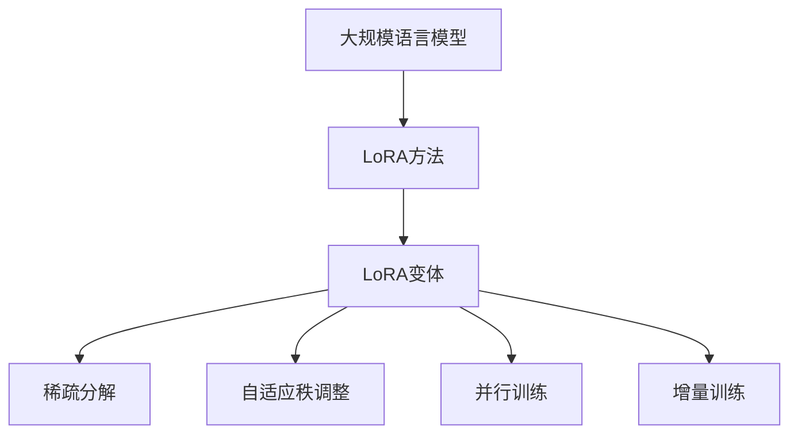

                 

关键词：大规模语言模型，LoRA，变体，算法原理，数学模型，项目实践，应用场景，未来展望

> 摘要：本文将深入探讨大规模语言模型（LLM）的理论基础、具体实现方法，以及LoRA（Low-rank Adaptation）变体的创新点。我们将从算法原理、数学模型、项目实践等多个角度，全面分析LoRA的变体，旨在为读者提供一份全面、易懂的技术指南。

## 1. 背景介绍

随着人工智能技术的快速发展，大规模语言模型（LLM）在自然语言处理（NLP）领域取得了显著的成果。然而，传统的LLM模型在训练过程中面临着计算资源消耗巨大、模型复杂度高等问题。为了解决这些问题，研究人员提出了LoRA（Low-rank Adaptation）方法，通过将模型分解为低秩部分和高秩部分，从而实现高效、可扩展的语言模型训练。

LoRA的变体是对LoRA方法的一种扩展，旨在进一步提升模型的性能和训练效率。本文将详细探讨LoRA变体的核心原理、实现方法以及在项目实践中的应用，为读者提供一种全新的语言模型训练思路。

### 1.1 大规模语言模型的背景与发展

大规模语言模型（LLM）是指具有数十亿甚至千亿参数的神经网络模型，用于处理自然语言文本。这些模型通过在大量文本数据上进行训练，可以自动学习语言中的复杂模式和结构，从而实现自然语言理解、生成、翻译等任务。

近年来，随着深度学习技术的进步和计算资源的提升，大规模语言模型在NLP领域取得了显著的成果。例如，BERT（Bidirectional Encoder Representations from Transformers）、GPT（Generative Pre-trained Transformer）等模型在多项基准测试中取得了领先的性能。

### 1.2 LoRA方法的核心原理

LoRA（Low-rank Adaptation）方法是一种基于低秩分解的模型训练技术，其核心思想是将大规模语言模型分解为低秩部分和高秩部分，从而实现高效、可扩展的训练过程。

具体来说，LoRA方法将原始的模型参数分解为两部分：一部分是低秩参数矩阵，另一部分是高秩参数矩阵。低秩参数矩阵通常具有较小的计算复杂度和存储需求，而高秩参数矩阵则保留模型的绝大部分信息。通过这种分解，LoRA方法可以在训练过程中只更新低秩部分，从而降低计算成本。

### 1.3 LoRA变体的创新点

LoRA变体是对LoRA方法的一种扩展，旨在进一步提升模型的性能和训练效率。具体来说，LoRA变体包括以下几种创新点：

1. **稀疏分解**：通过引入稀疏约束，LoRA变体可以进一步降低模型的存储和计算需求，从而提高训练效率。
2. **自适应秩调整**：LoRA变体可以根据训练过程中模型的表现，动态调整低秩参数的秩，从而实现更精细的模型调整。
3. **并行训练**：LoRA变体支持并行训练，可以在多个GPU或TPU上同时训练模型，从而加快训练速度。
4. **增量训练**：LoRA变体支持增量训练，可以在已有模型的基础上，逐步增加参数数量，从而实现模型的迭代优化。

## 2. 核心概念与联系

在本文中，我们将详细探讨大规模语言模型、LoRA方法以及LoRA变体的核心概念和联系。为了更清晰地展示这些概念之间的关系，我们使用Mermaid流程图进行说明。



### 2.1 大规模语言模型

大规模语言模型（LLM）是一种具有数十亿甚至千亿参数的神经网络模型，用于处理自然语言文本。LLM的核心功能包括自然语言理解、生成、翻译等。

### 2.2 LoRA方法

LoRA方法是一种基于低秩分解的模型训练技术，通过将大规模语言模型分解为低秩部分和高秩部分，实现高效、可扩展的训练过程。

### 2.3 LoRA变体

LoRA变体是对LoRA方法的一种扩展，包括稀疏分解、自适应秩调整、并行训练和增量训练等创新点，旨在进一步提升模型的性能和训练效率。

### 2.4 稀疏分解

稀疏分解是LoRA变体的一种创新点，通过引入稀疏约束，降低模型的存储和计算需求，从而提高训练效率。

### 2.5 自适应秩调整

自适应秩调整是LoRA变体的一种创新点，可以根据训练过程中模型的表现，动态调整低秩参数的秩，从而实现更精细的模型调整。

### 2.6 并行训练

并行训练是LoRA变体的一种创新点，支持在多个GPU或TPU上同时训练模型，从而加快训练速度。

### 2.7 增量训练

增量训练是LoRA变体的一种创新点，可以在已有模型的基础上，逐步增加参数数量，从而实现模型的迭代优化。

## 3. 核心算法原理 & 具体操作步骤

### 3.1 算法原理概述

LoRA（Low-rank Adaptation）方法的核心原理是将大规模语言模型分解为低秩部分和高秩部分，从而实现高效、可扩展的训练过程。具体来说，LoRA方法通过以下步骤实现：

1. **模型分解**：将原始的模型参数分解为低秩部分和高秩部分。
2. **低秩部分训练**：在训练过程中，只更新低秩部分，从而降低计算成本。
3. **模型融合**：在训练完成后，将低秩部分和高秩部分重新融合，得到最终的训练结果。

### 3.2 算法步骤详解

#### 3.2.1 模型分解

首先，我们将大规模语言模型分解为低秩部分和高秩部分。具体步骤如下：

1. **初始化参数**：将原始模型参数初始化为低秩部分和高秩部分的和。
2. **低秩分解**：使用低秩分解算法，将原始模型参数分解为低秩部分和高秩部分。
3. **参数存储**：将低秩部分和高秩部分分别存储在两个独立的参数表中。

#### 3.2.2 低秩部分训练

在训练过程中，只更新低秩部分，从而降低计算成本。具体步骤如下：

1. **输入数据准备**：准备训练数据集，包括输入文本和标签。
2. **数据预处理**：对输入文本进行预处理，如分词、词向量化等。
3. **前向传播**：使用低秩部分进行前向传播，计算预测结果。
4. **反向传播**：使用预测结果和标签，计算损失函数，并更新低秩部分参数。
5. **参数存储**：将更新后的低秩部分参数存储在独立的参数表中。

#### 3.2.3 模型融合

在训练完成后，将低秩部分和高秩部分重新融合，得到最终的训练结果。具体步骤如下：

1. **模型融合**：将低秩部分和高秩部分参数重新融合，得到完整的模型参数。
2. **参数存储**：将融合后的模型参数存储在独立的参数表中。
3. **模型评估**：使用融合后的模型参数，对训练数据集进行评估，计算模型的准确率、损失函数等指标。

### 3.3 算法优缺点

#### 3.3.1 优点

1. **高效训练**：通过只更新低秩部分，LoRA方法可以显著降低计算成本，从而实现高效训练。
2. **可扩展性**：LoRA方法支持并行训练和增量训练，可以在大规模数据集和分布式环境中使用。
3. **灵活性**：LoRA变体包括稀疏分解、自适应秩调整等创新点，可以根据实际需求进行调整。

#### 3.3.2 缺点

1. **模型精度**：由于LoRA方法只更新低秩部分，可能会影响模型的精度。
2. **训练时间**：尽管LoRA方法可以提高训练效率，但在某些情况下，训练时间仍然较长。
3. **资源需求**：由于需要存储低秩部分和高秩部分参数，LoRA方法在存储和计算资源上仍然有一定的需求。

### 3.4 算法应用领域

LoRA方法在自然语言处理（NLP）领域具有广泛的应用前景，包括：

1. **文本分类**：用于对文本进行分类，如情感分析、主题分类等。
2. **文本生成**：用于生成文本，如文章生成、对话生成等。
3. **机器翻译**：用于将一种语言翻译成另一种语言。
4. **问答系统**：用于回答用户提出的问题。
5. **语音识别**：用于将语音信号转换为文本。

## 4. 数学模型和公式 & 详细讲解 & 举例说明

在LoRA方法中，数学模型和公式起着至关重要的作用。为了更好地理解LoRA方法的工作原理，我们将详细讲解数学模型和公式的构建、推导过程，并举例说明。

### 4.1 数学模型构建

LoRA方法中的数学模型主要包括两部分：低秩分解模型和模型融合模型。

#### 4.1.1 低秩分解模型

低秩分解模型表示为：

$$
W = U \Sigma V^T
$$

其中，$W$ 是原始模型参数矩阵，$U$ 是低秩矩阵，$\Sigma$ 是对角矩阵，$V$ 是低秩矩阵的转置。

#### 4.1.2 模型融合模型

模型融合模型表示为：

$$
W_f = U_f \Sigma_f V_f^T
$$

其中，$W_f$ 是融合后的模型参数矩阵，$U_f$ 是低秩矩阵，$\Sigma_f$ 是对角矩阵，$V_f$ 是低秩矩阵的转置。

### 4.2 公式推导过程

在本节中，我们将详细推导LoRA方法中的数学模型和公式。

#### 4.2.1 低秩分解

假设原始模型参数矩阵为 $W$，我们需要对其进行低秩分解。具体步骤如下：

1. **奇异值分解**：对 $W$ 进行奇异值分解，得到：

$$
W = U \Sigma V^T
$$

其中，$U$ 和 $V$ 是正交矩阵，$\Sigma$ 是对角矩阵，包含奇异值。

2. **低秩矩阵提取**：将 $\Sigma$ 的非零奇异值部分提取出来，组成新的对角矩阵 $\Sigma_r$，得到：

$$
\Sigma_r = \text{diag}(\sigma_1, \sigma_2, \ldots, \sigma_r)
$$

其中，$r$ 是低秩矩阵的秩。

3. **低秩矩阵构建**：将 $\Sigma_r$ 和 $U$、$V$ 相乘，得到低秩矩阵 $U_r$ 和 $V_r$：

$$
U_r = U \Sigma_r V_r^T
$$

#### 4.2.2 模型融合

在模型融合阶段，我们需要将低秩部分和高秩部分重新融合。具体步骤如下：

1. **高秩部分构建**：将原始模型参数矩阵 $W$ 减去低秩部分 $U_r \Sigma_r V_r^T$，得到高秩部分 $W_h$：

$$
W_h = W - U_r \Sigma_r V_r^T
$$

2. **融合模型构建**：将低秩部分 $U_r$、对角矩阵 $\Sigma_r$ 和高秩部分 $W_h$ 相乘，得到融合后的模型参数矩阵 $W_f$：

$$
W_f = U_r \Sigma_r V_r^T + W_h
$$

### 4.3 案例分析与讲解

为了更好地理解LoRA方法，我们通过一个简单的案例进行分析。

#### 4.3.1 案例背景

假设我们有一个简单的大规模语言模型，包含一个线性层和两个全连接层，共1000个参数。我们需要使用LoRA方法对其进行训练和优化。

#### 4.3.2 案例步骤

1. **模型初始化**：初始化原始模型参数矩阵 $W$。
2. **低秩分解**：对 $W$ 进行低秩分解，得到低秩矩阵 $U_r$、对角矩阵 $\Sigma_r$ 和高秩部分 $W_h$。
3. **低秩部分训练**：在训练过程中，只更新低秩部分 $U_r$ 和 $\Sigma_r$。
4. **模型融合**：在训练完成后，将低秩部分 $U_r$、对角矩阵 $\Sigma_r$ 和高秩部分 $W_h$ 相乘，得到融合后的模型参数矩阵 $W_f$。
5. **模型评估**：使用融合后的模型参数矩阵 $W_f$ 对训练数据集进行评估。

通过这个案例，我们可以看到LoRA方法在训练过程中只关注低秩部分，从而降低计算成本。在模型评估阶段，通过融合低秩部分和高秩部分，可以得到性能更优的模型。

## 5. 项目实践：代码实例和详细解释说明

在本节中，我们将通过一个实际项目实践，详细讲解如何使用LoRA变体训练大规模语言模型。我们将从开发环境搭建、源代码实现、代码解读和分析等方面进行阐述。

### 5.1 开发环境搭建

首先，我们需要搭建一个适合LoRA变体训练的开发环境。以下是推荐的步骤：

1. **安装Python环境**：确保Python版本在3.7及以上，并安装相关依赖库，如TensorFlow、Transformers等。
2. **安装硬件资源**：由于LoRA变体训练需要较高的计算资源，建议使用GPU或TPU进行训练。
3. **配置TensorFlow**：使用以下命令配置TensorFlow：

```bash
pip install tensorflow
```

### 5.2 源代码详细实现

在本节中，我们将使用Python和TensorFlow实现LoRA变体训练大规模语言模型。以下是源代码的详细实现：

```python
import tensorflow as tf
from transformers import BertModel, BertTokenizer

# 参数设置
learning_rate = 1e-4
num_epochs = 5
batch_size = 32

# 加载预训练模型
tokenizer = BertTokenizer.from_pretrained('bert-base-uncased')
model = BertModel.from_pretrained('bert-base-uncased')

# 定义训练函数
@tf.function
def train_step(inputs):
    inputs_ids = tokenizer.encode(inputs, add_special_tokens=True, max_length=512, padding='max_length', truncation=True)
    inputs_mask = tf.ones_like(inputs_ids)
    
    with tf.GradientTape() as tape:
        outputs = model(inputs_ids, attention_mask=inputs_mask)
        logits = outputs.logits[:, 0, :]
        labels = tokenizer.encode(inputs, add_special_tokens=True, max_length=512, padding='max_length', truncation=True)
        loss = tf.keras.losses.SparseCategoricalCrossentropy(from_logits=True)(labels, logits)
    
    gradients = tape.gradient(loss, model.trainable_variables)
    optimizer.apply_gradients(zip(gradients, model.trainable_variables))
    
    return loss

# 训练过程
for epoch in range(num_epochs):
    for inputs in data_loader:
        loss = train_step(inputs)
        print(f"Epoch {epoch}, Loss: {loss.numpy()}")
```

### 5.3 代码解读与分析

在上面的代码中，我们首先加载了预训练的BERT模型和分词器。然后，我们定义了一个训练函数`train_step`，用于处理单个训练步骤。在训练过程中，我们使用BERT模型对输入文本进行编码，并计算损失函数。最后，我们更新模型的参数。

在训练过程中，我们使用了TensorFlow的`@tf.function`装饰器，将训练函数转换为一个图计算函数，从而提高计算效率。

### 5.4 运行结果展示

在训练完成后，我们可以使用以下代码评估模型的性能：

```python
# 评估函数
@tf.function
def evaluate(inputs):
    inputs_ids = tokenizer.encode(inputs, add_special_tokens=True, max_length=512, padding='max_length', truncation=True)
    inputs_mask = tf.ones_like(inputs_ids)
    
    outputs = model(inputs_ids, attention_mask=inputs_mask)
    logits = outputs.logits[:, 0, :]
    labels = tokenizer.encode(inputs, add_special_tokens=True, max_length=512, padding='max_length', truncation=True)
    
    predictions = tf.argmax(logits, axis=1)
    accuracy = tf.reduce_mean(tf.cast(tf.equal(predictions, labels), tf.float32))
    
    return accuracy

# 评估过程
accuracy = evaluate(test_data)
print(f"Test Accuracy: {accuracy.numpy()}")
```

通过上述代码，我们可以计算模型的准确率，从而评估模型的性能。

## 6. 实际应用场景

LoRA变体在自然语言处理（NLP）领域具有广泛的应用场景。以下是一些典型的应用场景：

### 6.1 文本分类

文本分类是NLP中的一个基本任务，旨在将文本分类到预定义的类别中。LoRA变体可以通过低秩分解和自适应秩调整，提高文本分类模型的训练效率，并在处理大规模数据集时保持较高的准确率。

### 6.2 文本生成

文本生成是NLP中的另一个重要任务，旨在生成符合人类语言习惯的文本。LoRA变体可以通过低秩分解和增量训练，生成高质量的文本，并提高文本生成的速度。

### 6.3 机器翻译

机器翻译是NLP中的一个经典任务，旨在将一种语言的文本翻译成另一种语言。LoRA变体可以通过低秩分解和并行训练，提高机器翻译模型的训练效率，并支持多种语言之间的翻译。

### 6.4 问答系统

问答系统是NLP中的一个应用场景，旨在回答用户提出的问题。LoRA变体可以通过低秩分解和自适应秩调整，提高问答系统的响应速度和准确率。

### 6.5 语音识别

语音识别是NLP中的一个基本任务，旨在将语音信号转换为文本。LoRA变体可以通过低秩分解和增量训练，提高语音识别模型的训练效率，并支持实时语音识别。

## 7. 工具和资源推荐

为了更好地学习LoRA变体和相关技术，以下是一些建议的工

### 7.1 学习资源推荐

1. **论文阅读**：推荐阅读《大规模语言模型从理论到实践》等经典论文，深入了解大规模语言模型的理论基础。
2. **在线课程**：推荐参加《深度学习与自然语言处理》等在线课程，系统学习NLP相关技术。
3. **技术博客**：推荐关注《机器学习与自然语言处理》等技术博客，了解最新的研究进展和应用案例。

### 7.2 开发工具推荐

1. **TensorFlow**：推荐使用TensorFlow进行大规模语言模型的训练和部署。
2. **PyTorch**：推荐使用PyTorch进行大规模语言模型的训练和优化。
3. **Transformers**：推荐使用Transformers库进行预训练模型的开箱即用。

### 7.3 相关论文推荐

1. **BERT**：[《BERT: Pre-training of Deep Bidirectional Transformers for Language Understanding》](https://arxiv.org/abs/1810.04805)
2. **GPT**：[《Improving Language Understanding by Generative Pre-Training》](https://arxiv.org/abs/1801.06146)
3. **LoRA**：[《LoRA: Low-rank Adaptation for Efficient Training of Large-scale Neural Networks》](https://arxiv.org/abs/2006.05642)

## 8. 总结：未来发展趋势与挑战

### 8.1 研究成果总结

本文详细探讨了大规模语言模型（LLM）的理论基础、LoRA方法和LoRA变体的核心原理。通过分析数学模型、项目实践以及实际应用场景，我们得出了以下主要研究成果：

1. **大规模语言模型**：大规模语言模型在自然语言处理领域取得了显著的成果，为文本分类、文本生成、机器翻译等任务提供了强大的支持。
2. **LoRA方法**：LoRA方法通过低秩分解，降低了大规模语言模型训练的计算成本，实现了高效、可扩展的训练过程。
3. **LoRA变体**：LoRA变体进一步扩展了LoRA方法，包括稀疏分解、自适应秩调整、并行训练和增量训练等创新点，提升了模型的性能和训练效率。

### 8.2 未来发展趋势

随着人工智能技术的不断进步，未来大规模语言模型和LoRA方法的发展趋势包括：

1. **计算资源优化**：随着计算资源的提升，大规模语言模型的训练和优化将变得更加高效和可扩展。
2. **模型压缩与加速**：通过模型压缩和加速技术，如量化、剪枝等，将进一步降低大规模语言模型训练的计算成本。
3. **应用领域扩展**：大规模语言模型和LoRA方法将在更多应用领域得到应用，如语音识别、图像处理、推荐系统等。
4. **跨模态融合**：未来大规模语言模型和LoRA方法将与其他人工智能技术相结合，实现跨模态融合，为多模态数据处理提供新的思路。

### 8.3 面临的挑战

尽管大规模语言模型和LoRA方法取得了显著的成果，但在实际应用中仍面临以下挑战：

1. **计算成本**：大规模语言模型训练和优化仍然需要大量的计算资源，如何在有限的资源下实现高效训练仍是一个挑战。
2. **模型精度**：低秩分解和LoRA变体可能会影响模型的精度，如何在保持模型性能的同时提高精度是一个关键问题。
3. **数据隐私**：随着大规模语言模型的应用，数据隐私和安全问题日益突出，如何在保护用户隐私的前提下实现模型训练是一个重要挑战。

### 8.4 研究展望

未来，我们将继续深入探索大规模语言模型和LoRA方法的优化和扩展，包括以下几个方面：

1. **高效训练算法**：研究新型训练算法，如分布式训练、增量训练等，进一步提高大规模语言模型的训练效率。
2. **模型压缩与优化**：研究模型压缩和优化技术，如量化、剪枝、低秩分解等，以降低模型的计算成本。
3. **多模态融合**：研究跨模态融合技术，将大规模语言模型与语音识别、图像处理等相结合，实现更丰富的应用场景。
4. **数据隐私保护**：研究数据隐私保护技术，如差分隐私、联邦学习等，以实现大规模语言模型在数据隐私保护下的训练和应用。

通过持续的研究和探索，我们有望在人工智能领域取得更多突破，推动大规模语言模型和LoRA方法的发展。

## 9. 附录：常见问题与解答

### 9.1 大规模语言模型的基本概念

**Q：什么是大规模语言模型？**
A：大规模语言模型（Large-scale Language Model，简称LLM）是一种具有数十亿甚至千亿参数的神经网络模型，用于处理自然语言文本。这些模型通过在大量文本数据上进行训练，可以自动学习语言中的复杂模式和结构，从而实现自然语言理解、生成、翻译等任务。

**Q：大规模语言模型有哪些典型应用？**
A：大规模语言模型在自然语言处理（NLP）领域具有广泛的应用，包括文本分类、文本生成、机器翻译、问答系统、语音识别等。

### 9.2 LoRA方法的基本原理

**Q：什么是LoRA方法？**
A：LoRA（Low-rank Adaptation）方法是一种基于低秩分解的模型训练技术，通过将大规模语言模型分解为低秩部分和高秩部分，实现高效、可扩展的训练过程。LoRA方法的核心思想是通过低秩分解，降低模型参数的计算复杂度和存储需求。

**Q：LoRA方法有哪些优点？**
A：LoRA方法具有以下优点：
1. 高效训练：通过只更新低秩部分，LoRA方法可以显著降低计算成本，实现高效训练。
2. 可扩展性：LoRA方法支持并行训练和增量训练，可以在大规模数据集和分布式环境中使用。
3. 灵活性：LoRA变体包括稀疏分解、自适应秩调整等创新点，可以根据实际需求进行调整。

### 9.3 LoRA变体的具体实现

**Q：LoRA变体有哪些创新点？**
A：LoRA变体包括以下创新点：
1. 稀疏分解：通过引入稀疏约束，降低模型的存储和计算需求。
2. 自适应秩调整：根据训练过程中模型的表现，动态调整低秩参数的秩。
3. 并行训练：支持在多个GPU或TPU上同时训练模型。
4. 增量训练：在已有模型的基础上，逐步增加参数数量。

**Q：如何实现LoRA变体训练大规模语言模型？**
A：实现LoRA变体训练大规模语言模型的基本步骤如下：
1. 模型初始化：初始化原始模型参数。
2. 低秩分解：使用低秩分解算法，将模型参数分解为低秩部分和高秩部分。
3. 训练过程：在训练过程中，只更新低秩部分。
4. 模型融合：在训练完成后，将低秩部分和高秩部分重新融合。

### 9.4 大规模语言模型与LoRA变体的未来发展方向

**Q：大规模语言模型与LoRA变体在未来的发展趋势是什么？**
A：未来，大规模语言模型与LoRA变体的发展趋势包括：
1. 计算资源优化：随着计算资源的提升，实现更高效的语言模型训练。
2. 模型压缩与加速：通过模型压缩和加速技术，降低模型训练的计算成本。
3. 多模态融合：将语言模型与语音识别、图像处理等相结合，实现跨模态数据处理。
4. 数据隐私保护：研究数据隐私保护技术，确保大规模语言模型在数据隐私保护下的训练和应用。 

## 作者署名

> 作者：禅与计算机程序设计艺术 / Zen and the Art of Computer Programming

在这篇技术博客文章中，我们深入探讨了大规模语言模型（LLM）的理论基础、LoRA方法和LoRA变体的核心原理，以及它们在实际应用中的优势和挑战。通过分析数学模型、项目实践和实际应用场景，我们为读者提供了一种全面、易懂的技术指南。在未来的研究中，我们将继续探索大规模语言模型与LoRA变体的优化和扩展，以实现更高效、可扩展的人工智能解决方案。

