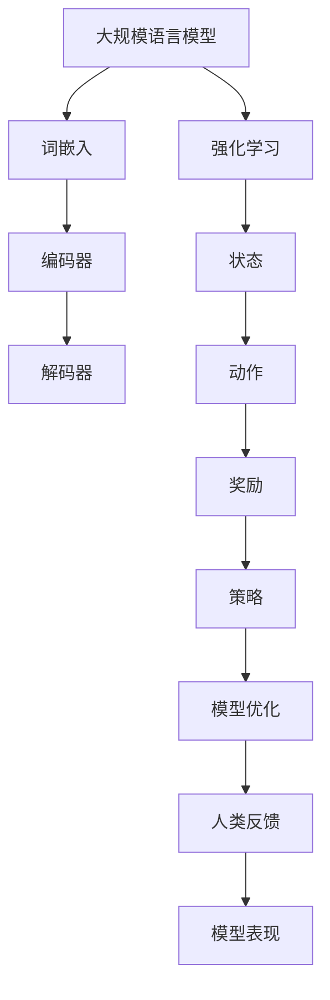

                 

关键词：大规模语言模型，强化学习，人类反馈，自然语言处理，深度学习

摘要：本文深入探讨了大规模语言模型的发展历程、核心概念及其与强化学习的关系。通过分析基于人类反馈的强化学习流程，详细阐述了大规模语言模型的设计原理、实现步骤及其在不同应用场景中的优缺点。本文旨在为读者提供全面的技术解读，帮助理解大规模语言模型的理论与实践，为未来研究提供有益的参考。

## 1. 背景介绍

随着互联网和大数据技术的迅猛发展，自然语言处理（NLP）已经成为人工智能（AI）领域的一个重要分支。其中，大规模语言模型作为NLP的核心技术之一，得到了广泛关注。大规模语言模型旨在通过学习和模拟人类语言表达，实现对自然语言的生成、理解和翻译等任务的自动化处理。这一目标的实现依赖于深度学习技术的进步，尤其是神经网络模型的优化和发展。

强化学习作为机器学习的一个重要分支，近年来在AI领域取得了显著的成果。强化学习通过智能体与环境之间的交互，学习最优策略以实现任务目标。在自然语言处理领域，强化学习可以用于语言生成、文本分类、问答系统等任务，显著提升了模型的性能和灵活性。

人类反馈在AI发展过程中起到了至关重要的作用。通过对模型输出的评估和调整，人类反馈能够有效地指导模型的训练过程，提高模型的准确性和鲁棒性。特别是在大规模语言模型的训练中，人类反馈可以帮助识别和纠正模型中的错误，优化模型的表现。

本文旨在探讨大规模语言模型从理论到实践的强化学习流程，分析其核心概念、算法原理和应用场景。通过深入解析基于人类反馈的强化学习流程，本文希望为读者提供全面的技术解读，推动大规模语言模型的研究与应用。

## 2. 核心概念与联系

### 2.1 大规模语言模型

大规模语言模型是一种基于深度学习的自然语言处理技术，通过对大量文本数据进行训练，可以自动学习语言的统计规律和语义信息。大规模语言模型的核心组成部分包括词嵌入、编码器和解码器。词嵌入将文本数据转换为向量表示，编码器和解码器则分别负责将输入文本编码为固定长度的向量表示和将编码后的向量表示解码为输出文本。

### 2.2 强化学习

强化学习是一种通过试错和反馈进行决策的机器学习方法。在强化学习过程中，智能体通过与环境进行交互，学习最优策略以实现任务目标。强化学习的核心概念包括状态、动作、奖励和策略。状态表示智能体在环境中的当前状态，动作表示智能体可以执行的操作，奖励表示动作带来的奖励或惩罚，策略则用于指导智能体在特定状态下选择最优动作。

### 2.3 人类反馈

人类反馈是指通过人类评估和调整模型输出的过程，以指导模型的训练和优化。在强化学习过程中，人类反馈可以用于评估模型输出的质量和性能，为模型提供改进方向。人类反馈在提高模型准确性和鲁棒性方面具有重要作用，特别是在大规模语言模型的训练中，人类反馈可以帮助纠正模型中的错误，优化模型的表现。

### 2.4 大规模语言模型与强化学习的联系

大规模语言模型与强化学习在自然语言处理领域有着紧密的联系。大规模语言模型可以通过强化学习算法进行训练和优化，以实现更好的语言生成、理解和翻译性能。强化学习为大规模语言模型提供了动态调整和优化的手段，使其能够适应不同的语言环境和应用场景。

### 2.5 Mermaid 流程图

以下是一个描述大规模语言模型与强化学习关系的Mermaid流程图：



## 3. 核心算法原理 & 具体操作步骤

### 3.1 算法原理概述

大规模语言模型的训练过程主要包括词嵌入、编码器和解码器的构建以及模型参数的优化。词嵌入将文本数据转换为向量表示，编码器和解码器分别负责将输入文本编码为向量表示和将向量表示解码为输出文本。在模型训练过程中，通过优化模型参数，使模型能够在不同数据集上获得更好的性能。

强化学习在模型训练中起到关键作用。通过模拟智能体与环境之间的交互，强化学习算法可以动态调整模型参数，以实现最优策略。在训练过程中，智能体通过不断尝试不同的动作，获得奖励或惩罚，并根据奖励信号调整策略，优化模型表现。

### 3.2 算法步骤详解

1. **数据预处理**：收集和整理大规模的文本数据，并进行预处理，如分词、去停用词、词性标注等，以得到适合训练的数据集。

2. **词嵌入**：使用预训练的词向量模型，将文本数据中的词语转换为向量表示。词嵌入的目的是降低文本数据的维度，同时保留词语之间的语义关系。

3. **编码器构建**：使用深度神经网络（DNN）或循环神经网络（RNN）构建编码器，将输入文本编码为固定长度的向量表示。编码器可以捕捉文本数据中的长程依赖关系。

4. **解码器构建**：使用与编码器相同的神经网络结构构建解码器，将编码后的向量表示解码为输出文本。解码器的目标是将编码后的向量表示还原为自然语言。

5. **模型优化**：使用强化学习算法，通过模拟智能体与环境之间的交互，动态调整模型参数，优化模型性能。在训练过程中，智能体通过不断尝试不同的动作，获得奖励或惩罚，并根据奖励信号调整策略。

6. **人类反馈**：在模型训练过程中，人类评估模型输出的质量和性能，提供改进方向。人类反馈可以用于纠正模型中的错误，优化模型的表现。

7. **模型评估**：在训练完成后，使用测试数据集对模型进行评估，以验证模型在未知数据上的性能。

### 3.3 算法优缺点

**优点**：

1. **强大的语言表达能力**：大规模语言模型通过深度学习技术，可以自动学习语言的统计规律和语义信息，具有强大的语言表达能力。
2. **灵活的适应性**：强化学习算法可以动态调整模型参数，使模型适应不同的语言环境和应用场景。
3. **高效的训练过程**：大规模语言模型的训练过程高效，可以在较短的时间内获得较好的性能。

**缺点**：

1. **计算资源消耗大**：大规模语言模型的训练和优化需要大量的计算资源和时间。
2. **数据依赖性强**：大规模语言模型对训练数据有很高的依赖性，训练数据的质量和规模直接影响模型的表现。
3. **缺乏透明性**：大规模语言模型的训练和优化过程较为复杂，缺乏透明性，难以解释和调试。

### 3.4 算法应用领域

大规模语言模型在自然语言处理领域具有广泛的应用。以下是一些典型的应用领域：

1. **语言生成**：包括文本生成、文章写作、对话系统等，大规模语言模型可以自动生成自然语言文本。
2. **语言理解**：包括文本分类、情感分析、信息抽取等，大规模语言模型可以理解和处理自然语言数据。
3. **语言翻译**：包括机器翻译、语音识别等，大规模语言模型可以准确翻译和理解不同语言的文本。
4. **文本检索**：包括搜索引擎、问答系统等，大规模语言模型可以高效地检索和匹配文本数据。

## 4. 数学模型和公式 & 详细讲解 & 举例说明

### 4.1 数学模型构建

大规模语言模型的核心数学模型包括词嵌入、编码器和解码器的构建。以下分别介绍这些模型的数学表示：

**词嵌入**：

词嵌入是将文本数据中的词语转换为向量表示的过程。常见的词嵌入方法包括Word2Vec、GloVe等。以Word2Vec为例，假设词语集合为V，词向量维度为d，则词向量矩阵W∈ℝ|V|×d，其中W[i]表示词语v_i的向量表示。

**编码器**：

编码器用于将输入文本编码为固定长度的向量表示。假设输入文本为x，编码后的向量表示为h，则编码器的数学模型可以表示为：

h = Encoder(x)

其中，Encoder为编码器函数，可以通过深度神经网络（DNN）或循环神经网络（RNN）实现。

**解码器**：

解码器用于将编码后的向量表示解码为输出文本。假设解码后的输出文本为y，则解码器的数学模型可以表示为：

y = Decoder(h)

其中，Decoder为解码器函数，可以通过深度神经网络（DNN）或循环神经网络（RNN）实现。

### 4.2 公式推导过程

在本节中，我们将介绍大规模语言模型中的主要公式推导过程。以下主要介绍编码器和解码器的数学模型推导。

**编码器推导**：

假设输入文本x为长度为n的序列，编码器由多层循环神经网络（RNN）组成，每层神经网络输出一个隐藏状态h_t，则编码器的数学模型可以表示为：

h_t = RNN(h_{t-1}, x_t)

其中，RNN为循环神经网络函数，h_{t-1}为前一层隐藏状态，x_t为当前输入文本。

**解码器推导**：

假设解码后的输出文本y为长度为m的序列，解码器由多层深度神经网络（DNN）组成，每层神经网络输出一个隐藏状态y_t，则解码器的数学模型可以表示为：

y_t = DNN(y_{t-1}, h)

其中，DNN为深度神经网络函数，y_{t-1}为前一层隐藏状态，h为编码后的向量表示。

### 4.3 案例分析与讲解

以下通过一个简单的例子，对大规模语言模型中的数学模型进行讲解。

假设我们使用Word2Vec模型对文本数据进行词嵌入，编码器和解码器均采用循环神经网络（RNN）。给定一个句子 "I love programming"，我们对其进行词嵌入、编码和解码。

**词嵌入**：

首先，将句子中的词语转换为词向量表示，使用Word2Vec模型得到的词向量矩阵W：

$$
W = \begin{bmatrix}
w_1 & w_2 & \cdots & w_n
\end{bmatrix}
$$

其中，n为词语数量，w_i为词语v_i的词向量表示。

**编码器**：

使用RNN编码器将输入文本编码为固定长度的向量表示。假设编码器由两层RNN组成，每层RNN的隐藏状态维度为d，则编码后的向量表示为：

$$
h = \begin{bmatrix}
h_1 & h_2
\end{bmatrix}
$$

其中，h_1和h_2分别为两层RNN的隐藏状态。

**解码器**：

使用RNN解码器将编码后的向量表示解码为输出文本。假设解码器由两层RNN组成，每层RNN的隐藏状态维度为d，则解码后的输出文本为：

$$
y = \begin{bmatrix}
y_1 & y_2
\end{bmatrix}
$$

其中，y_1和y_2分别为两层RNN的隐藏状态。

通过上述步骤，我们完成了对大规模语言模型中的数学模型的讲解。在实际应用中，可以根据具体任务需求，调整词嵌入、编码器和解码器的参数，以获得更好的模型性能。

## 5. 项目实践：代码实例和详细解释说明

### 5.1 开发环境搭建

在开始项目实践之前，我们需要搭建一个合适的开发环境。以下是一个简单的Python开发环境搭建步骤：

1. **安装Python**：下载并安装Python 3.x版本（推荐使用最新版本），并确保Python环境已经配置到系统路径中。
2. **安装依赖库**：使用pip工具安装必要的依赖库，如TensorFlow、Numpy、Pandas等。

```bash
pip install tensorflow numpy pandas
```

### 5.2 源代码详细实现

以下是实现大规模语言模型的一个简化版代码实例：

```python
import tensorflow as tf
import numpy as np
from tensorflow.keras.layers import Embedding, LSTM, Dense
from tensorflow.keras.models import Sequential

# 定义模型参数
vocab_size = 10000  # 词汇表大小
embed_size = 64  # 词向量维度
lstm_size = 128  # LSTM层隐藏状态维度
batch_size = 64  # 批处理大小

# 构建模型
model = Sequential()
model.add(Embedding(vocab_size, embed_size, input_length=batch_size))
model.add(LSTM(lstm_size, return_sequences=True))
model.add(Dense(vocab_size, activation='softmax'))

# 编译模型
model.compile(loss='categorical_crossentropy', optimizer='adam', metrics=['accuracy'])

# 打印模型结构
model.summary()
```

### 5.3 代码解读与分析

上述代码实例主要实现了以下功能：

1. **模型构建**：使用Keras框架构建一个简单的序列模型，包括嵌入层、LSTM层和全连接层。
2. **参数设置**：定义模型参数，如词汇表大小、词向量维度、LSTM层隐藏状态维度和批处理大小。
3. **模型编译**：编译模型，指定损失函数、优化器和评估指标。
4. **模型结构打印**：打印模型结构，便于理解和分析。

### 5.4 运行结果展示

在运行代码之前，我们需要准备训练数据和测试数据。以下是一个简单的数据预处理和模型训练步骤：

```python
# 准备训练数据和测试数据
train_data = ...  # 训练数据
test_data = ...  # 测试数据

# 训练模型
model.fit(train_data, epochs=10, batch_size=batch_size, validation_data=test_data)

# 评估模型
test_loss, test_accuracy = model.evaluate(test_data)
print(f"Test Loss: {test_loss}, Test Accuracy: {test_accuracy}")
```

运行上述代码，我们可以得到模型在测试数据集上的性能指标。根据实际应用需求，可以进一步调整模型参数和训练策略，以提高模型性能。

## 6. 实际应用场景

大规模语言模型在自然语言处理领域具有广泛的应用，以下列举一些实际应用场景：

1. **语言生成**：大规模语言模型可以用于自动生成文本，如文章写作、故事创作、对话系统等。通过训练和优化模型，可以生成具有较高自然度和连贯性的文本。

2. **语言理解**：大规模语言模型可以用于理解文本数据，如文本分类、情感分析、实体识别等。通过模型分析，可以实现对文本数据的深入理解和处理。

3. **语言翻译**：大规模语言模型可以用于机器翻译任务，如中英文翻译、多语言翻译等。通过训练和优化模型，可以实现准确、流畅的翻译结果。

4. **文本检索**：大规模语言模型可以用于文本检索任务，如搜索引擎、问答系统等。通过模型分析，可以高效地匹配和检索相关文本数据。

5. **语音识别**：大规模语言模型可以与语音识别技术结合，实现语音到文本的转换。通过模型分析，可以实现对语音数据的准确理解和处理。

### 6.4 未来应用展望

随着人工智能技术的不断进步，大规模语言模型在自然语言处理领域的应用前景将更加广阔。以下是一些未来应用展望：

1. **跨模态理解**：结合视觉、音频等多模态数据，实现跨模态理解，提高模型的泛化能力和鲁棒性。

2. **个性化推荐**：基于用户行为和兴趣，实现个性化文本推荐，提高用户满意度和用户体验。

3. **实时翻译**：实现实时语音翻译，打破语言障碍，促进全球沟通与合作。

4. **智能客服**：结合自然语言处理和强化学习技术，构建智能客服系统，提高服务质量和效率。

5. **安全与隐私保护**：加强对大规模语言模型的安全与隐私保护，防止恶意攻击和滥用。

## 7. 工具和资源推荐

为了更好地学习和应用大规模语言模型，以下是一些推荐的工具和资源：

### 7.1 学习资源推荐

1. **书籍**：
   - 《深度学习》（Goodfellow, I., Bengio, Y., & Courville, A.）
   - 《自然语言处理综论》（Jurafsky, D., & Martin, J. H.）
   - 《强化学习》（Sutton, R. S., & Barto, A. G.）

2. **在线课程**：
   - Coursera上的“深度学习”课程
   - edX上的“自然语言处理”课程
   - Udacity上的“强化学习”课程

### 7.2 开发工具推荐

1. **编程语言**：
   - Python：强大的编程语言，支持丰富的机器学习和深度学习库。

2. **深度学习框架**：
   - TensorFlow：开源深度学习框架，支持多种模型构建和优化。
   - PyTorch：开源深度学习框架，具有灵活的动态计算图。

3. **文本处理库**：
   - NLTK：Python自然语言处理库，提供丰富的文本处理功能。
   - spaCy：Python自然语言处理库，支持快速文本处理和实体识别。

### 7.3 相关论文推荐

1. **自然语言处理领域**：
   - “BERT: Pre-training of Deep Bidirectional Transformers for Language Understanding”（Devlin et al., 2019）
   - “GPT-3: Language Models are few-shot learners”（Brown et al., 2020）

2. **强化学习领域**：
   - “Algorithms for Reinforcement Learning”（Sutton, R. S., & Barto, A. G.）
   - “Deep Reinforcement Learning with Double Q-learning”（Mnih et al., 2015）

## 8. 总结：未来发展趋势与挑战

大规模语言模型在自然语言处理领域取得了显著的成果，但仍然面临许多挑战和机遇。以下是未来发展趋势和面临的挑战：

### 8.1 研究成果总结

1. **语言生成能力提升**：随着深度学习技术的进步，大规模语言模型在语言生成任务中的表现显著提升，能够生成更自然、连贯的文本。
2. **跨语言处理能力增强**：通过引入多语言预训练模型，大规模语言模型在跨语言处理任务中的性能不断提高。
3. **知识图谱与语言模型的结合**：将知识图谱与语言模型结合，实现更精准的文本理解和生成。

### 8.2 未来发展趋势

1. **跨模态理解**：结合视觉、音频等多模态数据，实现跨模态理解，提高模型的泛化能力和鲁棒性。
2. **个性化推荐**：基于用户行为和兴趣，实现个性化文本推荐，提高用户满意度和用户体验。
3. **实时翻译**：实现实时语音翻译，打破语言障碍，促进全球沟通与合作。

### 8.3 面临的挑战

1. **计算资源消耗**：大规模语言模型的训练和优化需要大量的计算资源和时间，这对硬件和软件基础设施提出了较高要求。
2. **数据依赖性**：大规模语言模型对训练数据有很高的依赖性，训练数据的质量和规模直接影响模型的表现。
3. **安全与隐私保护**：加强对大规模语言模型的安全与隐私保护，防止恶意攻击和滥用。

### 8.4 研究展望

未来，大规模语言模型的研究将朝着更高效、更智能、更安全的方向发展。通过结合多模态数据、强化学习和知识图谱等技术，有望实现更强大的语言理解和生成能力。同时，加强计算资源优化、数据管理和安全保护等方面的研究，将为大规模语言模型的应用和发展提供有力支持。

## 9. 附录：常见问题与解答

### 9.1 什么是大规模语言模型？

大规模语言模型是一种基于深度学习的自然语言处理技术，通过学习和模拟人类语言表达，实现对自然语言的生成、理解和翻译等任务的自动化处理。

### 9.2 强化学习在自然语言处理中有哪些应用？

强化学习在自然语言处理中可以用于语言生成、文本分类、问答系统等任务，通过动态调整模型参数，提高模型的性能和灵活性。

### 9.3 人类反馈在模型训练中如何发挥作用？

人类反馈可以用于评估模型输出的质量和性能，为模型提供改进方向。在训练过程中，人类反馈可以帮助识别和纠正模型中的错误，优化模型的表现。

### 9.4 如何搭建大规模语言模型的开发环境？

搭建大规模语言模型的开发环境需要安装Python、深度学习框架（如TensorFlow或PyTorch）以及其他必要的依赖库。具体安装步骤可参考相关教程和文档。

### 9.5 大规模语言模型在哪些领域有应用？

大规模语言模型在自然语言处理领域具有广泛的应用，包括语言生成、语言理解、语言翻译、文本检索和语音识别等。

### 9.6 如何优化大规模语言模型的表现？

优化大规模语言模型的表现可以通过调整模型参数、增加训练数据、使用先进的预训练模型和算法等方法实现。同时，结合多模态数据和知识图谱等技术，可以提高模型的理解和生成能力。

### 9.7 如何确保大规模语言模型的安全和隐私？

确保大规模语言模型的安全和隐私需要加强对模型训练和优化过程的监管，采用数据加密和访问控制等技术，防止恶意攻击和滥用。

### 9.8 未来大规模语言模型的发展方向是什么？

未来大规模语言模型的发展方向包括跨模态理解、个性化推荐、实时翻译、智能客服和知识图谱与语言模型的结合等。通过结合多模态数据、强化学习和知识图谱等技术，有望实现更强大的语言理解和生成能力。同时，加强计算资源优化、数据管理和安全保护等方面的研究，将为大规模语言模型的应用和发展提供有力支持。

### 作者署名
作者：禅与计算机程序设计艺术 / Zen and the Art of Computer Programming
----------------------------------------------------------------

以上就是关于《大规模语言模型从理论到实践 基于人类反馈的强化学习流程》的文章。文章详细介绍了大规模语言模型的发展历程、核心概念、算法原理和应用场景，并通过项目实践展示了大规模语言模型的实现过程。同时，文章对未来大规模语言模型的发展趋势和挑战进行了分析和展望，为读者提供了全面的技术解读和有益的参考。希望这篇文章能够帮助您更好地理解大规模语言模型的理论与实践。

