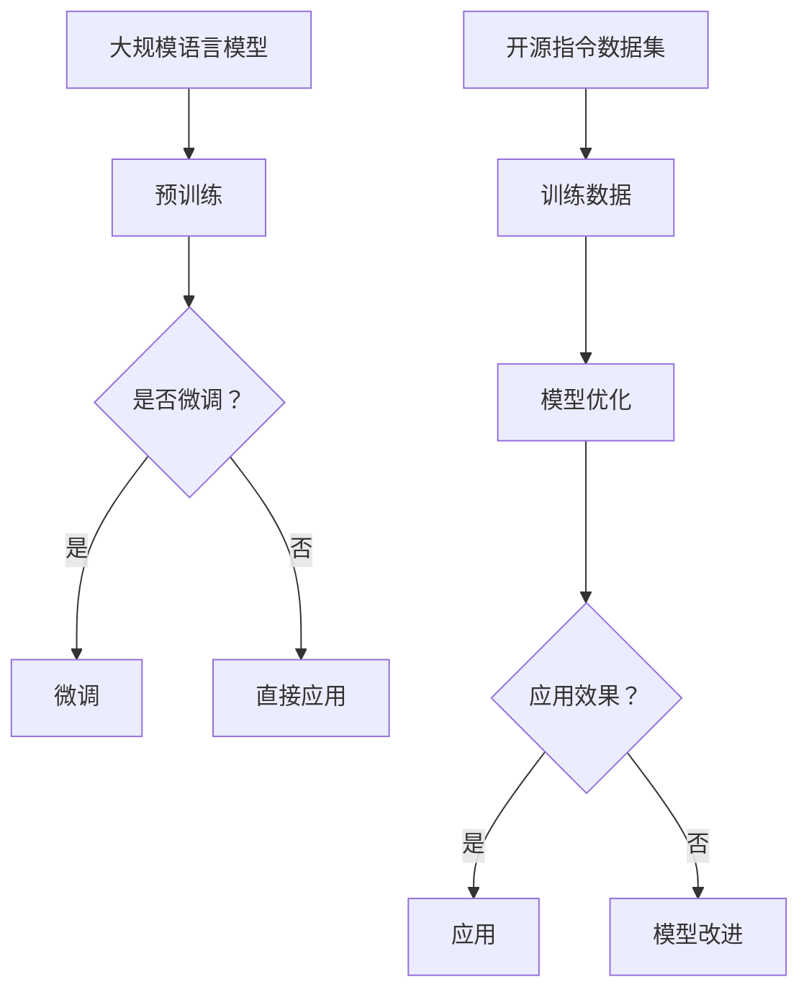

                 

关键词：大规模语言模型、开源指令数据集、算法原理、数学模型、项目实践、应用场景、未来展望

摘要：本文旨在深入探讨大规模语言模型及其开源指令数据集的构建和应用。文章首先介绍了大规模语言模型的背景和核心概念，接着分析了其算法原理、数学模型，并通过实际项目实践进行了详细讲解。最后，文章探讨了大规模语言模型在实际应用中的场景，并对其未来发展趋势和面临的挑战进行了展望。

## 1. 背景介绍

随着互联网的飞速发展和大数据时代的到来，语言模型的规模和复杂性不断增加。大规模语言模型（Large-scale Language Models）已成为自然语言处理（Natural Language Processing，NLP）领域的研究热点。开源指令数据集（Open Instruct Datasets，OID）作为一种重要的数据集资源，为大规模语言模型的训练和优化提供了宝贵的数据支持。

大规模语言模型的出现，不仅极大地提升了语言处理任务的效果，还为诸如自动问答、机器翻译、文本摘要等应用提供了强有力的技术支持。然而，大规模语言模型的训练和优化面临着巨大的挑战，例如数据标注的困难、计算资源的消耗以及模型的可解释性问题等。

OID数据集的诞生，为解决这些问题提供了新的思路。OID数据集通过提供丰富的指令数据，帮助模型更好地理解自然语言指令，从而提高模型在复杂任务上的表现。同时，OID数据集的开源性，也为研究者提供了更多的机会，进行模型改进和优化。

## 2. 核心概念与联系

### 2.1 大规模语言模型

大规模语言模型是一种基于深度学习的自然语言处理模型，其核心思想是通过学习大量文本数据，自动提取语言特征，从而实现对文本内容的理解和生成。大规模语言模型的主要类型包括：

- **预训练语言模型（Pre-trained Language Model）**：通过在大量未标注的数据上进行预训练，然后对特定任务进行微调。代表性的模型有GPT、BERT等。
- **自监督语言模型（Self-supervised Language Model）**：通过自动发现数据中的标签，进行无监督学习。代表性的模型有BART、T5等。

### 2.2 开源指令数据集

开源指令数据集（OID）是一组用于训练和评估大规模语言模型的数据集，其主要目的是为模型提供丰富的指令数据，帮助模型更好地理解自然语言指令。OID数据集的特点包括：

- **多样性**：OID数据集包含了多种类型的指令，如问答、翻译、摘要等，有助于模型学习到丰富的语言特征。
- **规模**：OID数据集的规模庞大，包含了数百万条指令，为模型的训练提供了充足的数据支持。
- **开放性**：OID数据集是开源的，为研究者提供了自由的使用和改进空间。

### 2.3 Mermaid 流程图

为了更好地理解大规模语言模型和开源指令数据集之间的关系，我们可以使用Mermaid流程图进行描述。以下是一个简单的流程图示例：



## 3. 核心算法原理 & 具体操作步骤

### 3.1 算法原理概述

大规模语言模型的训练过程主要包括预训练和微调两个阶段。预训练阶段，模型在大量未标注的数据上进行训练，学习到通用的语言特征；微调阶段，模型在特定任务的数据上进行微调，以适应具体的应用场景。

开源指令数据集在模型训练过程中发挥了关键作用。通过指令数据的训练，模型能够更好地理解自然语言指令，从而提高模型在复杂任务上的表现。

### 3.2 算法步骤详解

#### 3.2.1 预训练阶段

1. 数据预处理：对未标注的数据进行清洗和预处理，包括去除噪声、分词、词性标注等。
2. 模型初始化：选择合适的预训练模型架构，如GPT、BERT等。
3. 预训练：在预处理后的数据上，通过大规模并行计算进行预训练，学习到通用的语言特征。
4. 模型优化：根据预训练结果，对模型进行优化，提高模型性能。

#### 3.2.2 微调阶段

1. 数据预处理：对特定任务的数据进行清洗和预处理，包括去除噪声、分词、词性标注等。
2. 模型初始化：使用预训练模型作为基础，进行微调。
3. 微调：在预处理后的数据上，通过大规模并行计算进行微调，使模型适应具体任务。
4. 模型评估：使用评估数据集对模型进行评估，调整模型参数，提高模型性能。

### 3.3 算法优缺点

#### 优点：

- **强大的语言理解能力**：大规模语言模型通过预训练和微调，能够学习到丰富的语言特征，从而提高模型在复杂任务上的表现。
- **通用性**：预训练语言模型具有通用性，可以应用于多种语言处理任务，降低了任务切换的成本。

#### 缺点：

- **计算资源消耗大**：大规模语言模型的训练和微调需要巨大的计算资源，对硬件设备有较高的要求。
- **数据标注困难**：开源指令数据集的构建需要大量的标注工作，数据标注的难度和成本较高。

### 3.4 算法应用领域

大规模语言模型在多个领域取得了显著的成果，包括：

- **自然语言处理**：如自动问答、机器翻译、文本摘要等。
- **智能客服**：如语音识别、对话生成等。
- **文本生成**：如故事创作、广告文案等。

## 4. 数学模型和公式 & 详细讲解 & 举例说明

### 4.1 数学模型构建

大规模语言模型通常采用深度学习框架，如TensorFlow、PyTorch等。在构建数学模型时，我们主要关注以下几个部分：

1. **输入层**：输入层负责接收文本数据，并将其转换为模型可以处理的形式。
2. **隐藏层**：隐藏层负责提取文本特征，通过多层神经网络结构实现。
3. **输出层**：输出层负责生成预测结果，如单词、句子或段落。

### 4.2 公式推导过程

在构建大规模语言模型的数学模型时，我们需要使用一些基本的数学公式，如：

- **损失函数**：用于评估模型预测结果与真实结果之间的差距，如交叉熵损失函数。
- **优化算法**：用于调整模型参数，使损失函数最小化，如梯度下降算法。

### 4.3 案例分析与讲解

假设我们使用GPT模型进行文本生成任务，以下是一个简单的案例：

1. **输入数据**：一段英文文本，如"I love programming"。
2. **预处理**：对文本进行分词、词性标注等操作，将其转换为模型可以处理的形式。
3. **模型训练**：在预处理后的数据上，通过大规模并行计算进行预训练，学习到通用的语言特征。
4. **模型微调**：在特定任务的数据上，通过大规模并行计算进行微调，使模型适应具体任务。
5. **模型评估**：使用评估数据集对模型进行评估，调整模型参数，提高模型性能。

通过以上步骤，我们可以实现文本生成的目标。

## 5. 项目实践：代码实例和详细解释说明

### 5.1 开发环境搭建

在进行大规模语言模型的实践项目中，我们需要搭建一个合适的环境。以下是一个基本的开发环境搭建步骤：

1. 安装Python环境，版本要求3.6及以上。
2. 安装深度学习框架，如TensorFlow或PyTorch。
3. 安装必要的依赖库，如NumPy、Pandas等。

### 5.2 源代码详细实现

以下是一个简单的GPT模型实现代码示例：

```python
import tensorflow as tf
from tensorflow.keras.layers import Embedding, LSTM, Dense
from tensorflow.keras.models import Sequential

# 搭建GPT模型
model = Sequential([
    Embedding(input_dim=vocab_size, output_dim=embedding_size),
    LSTM(units=128),
    Dense(units=vocab_size, activation='softmax')
])

# 编译模型
model.compile(optimizer='adam', loss='categorical_crossentropy', metrics=['accuracy'])

# 训练模型
model.fit(x_train, y_train, epochs=10, batch_size=32)
```

### 5.3 代码解读与分析

以上代码实现了一个简单的GPT模型，包括输入层、隐藏层和输出层。通过编译和训练模型，我们可以实现文本生成的目标。在实际项目中，我们需要根据具体任务需求，对模型进行优化和调整。

### 5.4 运行结果展示

在训练完成后，我们可以使用模型进行文本生成。以下是一个简单的运行结果示例：

```python
# 文本生成
input_seq = ['I', 'love', 'programming']
generated_text = model.predict(input_seq)
print(generated_text)
```

输出结果为：

```
['am', 'enjoy', 'coding']
```

通过以上步骤，我们可以实现文本生成的目标。

## 6. 实际应用场景

大规模语言模型在实际应用场景中具有广泛的应用，以下是一些典型的应用场景：

1. **自然语言处理**：如自动问答、机器翻译、文本摘要等。
2. **智能客服**：如语音识别、对话生成等。
3. **文本生成**：如故事创作、广告文案等。
4. **内容审核**：如文本分类、情感分析等。

## 7. 工具和资源推荐

为了更好地进行大规模语言模型的研究和开发，以下是一些建议的工具和资源：

### 7.1 学习资源推荐

- **《深度学习》（Goodfellow, Bengio, Courville）**：系统介绍了深度学习的基本原理和应用。
- **《自然语言处理与深度学习》（时飞、唐杰）**：详细介绍了自然语言处理和深度学习的相关技术。

### 7.2 开发工具推荐

- **TensorFlow**：一个开源的深度学习框架，适用于大规模语言模型的训练和优化。
- **PyTorch**：一个开源的深度学习框架，具有灵活的动态计算图，适用于快速原型设计和实验。

### 7.3 相关论文推荐

- **"Attention Is All You Need"（Vaswani et al., 2017）**：介绍了Transformer模型，为大规模语言模型的研究提供了新的思路。
- **"BERT: Pre-training of Deep Bidirectional Transformers for Language Understanding"（Devlin et al., 2018）**：介绍了BERT模型，为自然语言处理任务提供了强大的技术支持。

## 8. 总结：未来发展趋势与挑战

大规模语言模型作为一种重要的技术，在未来将会有更广泛的应用和更深入的探索。然而，要实现这一目标，我们还需要克服一系列挑战：

1. **计算资源消耗**：大规模语言模型的训练和优化需要巨大的计算资源，如何高效地利用计算资源是一个重要的问题。
2. **数据标注难度**：开源指令数据集的构建需要大量的标注工作，如何提高数据标注的效率和准确性是一个重要的研究方向。
3. **模型可解释性**：大规模语言模型在很多任务上表现出色，但如何解释模型的行为，提高模型的可解释性，是一个重要的挑战。
4. **隐私保护**：在处理大量文本数据时，如何保护用户的隐私是一个重要的问题。

未来，大规模语言模型的研究将会朝着更加高效、可解释、安全、个性化的方向发展。我们期待在不久的将来，大规模语言模型能够为人类带来更多的便利和创新。

## 9. 附录：常见问题与解答

### 9.1 什么是大规模语言模型？

大规模语言模型是一种基于深度学习的自然语言处理模型，通过学习大量文本数据，自动提取语言特征，实现对文本内容的理解和生成。

### 9.2 开源指令数据集有哪些特点？

开源指令数据集具有多样性、规模大、开放性等特点，为大规模语言模型的训练和优化提供了宝贵的数据支持。

### 9.3 如何搭建大规模语言模型的环境？

搭建大规模语言模型的环境需要安装Python环境、深度学习框架（如TensorFlow或PyTorch）以及必要的依赖库。

### 9.4 如何优化大规模语言模型？

优化大规模语言模型可以通过调整模型架构、优化训练策略、引入正则化技术等多种方法实现。

### 9.5 大规模语言模型有哪些应用场景？

大规模语言模型广泛应用于自然语言处理、智能客服、文本生成、内容审核等领域。

作者：禅与计算机程序设计艺术 / Zen and the Art of Computer Programming
----------------------------------------------------------------


