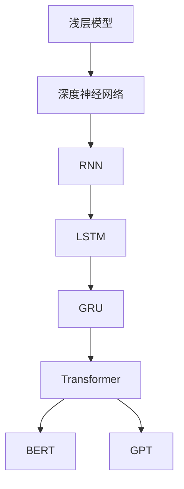

                 

## 1. 背景介绍

大规模语言模型（Large-scale Language Models，简称LLM）是当前自然语言处理（Natural Language Processing，NLP）领域的重要研究方向。随着深度学习技术的发展，特别是神经网络架构和计算能力的提升，大规模语言模型在生成文本、机器翻译、问答系统等方面取得了显著的成果。然而，数据规模在语言模型训练中的重要性不容忽视。本文将围绕大规模语言模型的数据规模进行探讨，从理论到实践，全面分析数据规模对模型性能的影响及具体实现方法。

首先，本文将介绍大规模语言模型的背景，包括其定义、发展历程以及当前应用领域。然后，我们将详细讨论数据规模的概念，分析数据规模对模型性能的影响，并介绍如何评估数据规模的大小。接下来，我们将探讨大规模语言模型的数据收集、处理和标注方法。在此基础上，本文将介绍当前主流的大规模语言模型算法，包括 Transformer、BERT、GPT 等模型，并分析这些模型在数据规模方面的特点。随后，我们将讨论大规模语言模型在实践中的应用，包括开发环境搭建、源代码实现、运行结果展示等。最后，本文将探讨大规模语言模型在实际应用场景中的挑战和未来发展趋势。

## 2. 核心概念与联系

### 2.1 定义

大规模语言模型是一种基于深度学习技术的自然语言处理模型，其目的是通过学习大量文本数据来理解和生成自然语言。与传统的规则驱动和统计方法相比，大规模语言模型具有更强的泛化能力和表达力。

### 2.2 发展历程

1. **浅层模型**：早期的语言模型主要基于规则和统计方法，如基于词汇的统计模型和基于上下文的词向量模型。
2. **深度神经网络**：随着深度学习技术的发展，深度神经网络（DNN）开始应用于语言模型，但模型效果有限。
3. **循环神经网络（RNN）**：RNN 的引入使得语言模型在处理序列数据方面取得了显著进展，但存在梯度消失和梯度爆炸等问题。
4. **长短时记忆网络（LSTM）和门控循环单元（GRU）**：LSTM 和 GRU 是 RNN 的改进版本，能够更好地解决梯度消失和梯度爆炸问题，但计算复杂度较高。
5. **Transformer**：2017 年，谷歌提出了 Transformer 模型，采用自注意力机制（Self-Attention Mechanism），在 NLP 任务中取得了突破性成果，推动了大规模语言模型的发展。
6. **BERT、GPT**：基于 Transformer 模型的 BERT 和 GPT 等模型在多个 NLP 任务上取得了最好的效果，进一步推动了大规模语言模型的研究和应用。

### 2.3 应用领域

大规模语言模型广泛应用于以下几个方面：

1. **文本生成**：包括文章生成、对话生成、摘要生成等。
2. **机器翻译**：将一种语言的文本翻译成另一种语言。
3. **问答系统**：根据用户提问生成回答。
4. **情感分析**：分析文本中的情感倾向。
5. **文本分类**：将文本数据分类到预定义的类别中。
6. **推荐系统**：根据用户的历史行为和偏好推荐相关内容。

### 2.4 Mermaid 流程图

以下是一个简化的 Mermaid 流程图，展示了大规模语言模型的核心概念及其发展历程：



## 3. 核心算法原理 & 具体操作步骤

### 3.1 算法原理概述

大规模语言模型的核心算法是基于 Transformer 模型，其基本原理是通过自注意力机制（Self-Attention Mechanism）来学习文本序列中的依赖关系。自注意力机制使得模型能够自动关注序列中的重要信息，从而提高模型的泛化能力和表达力。

### 3.2 算法步骤详解

1. **输入表示**：将输入文本转换为词向量表示，通常使用预训练的词向量模型（如 Word2Vec、GloVe）或基于 Transformer 的词向量模型（如 BERT）。
2. **位置编码**：为了保留输入文本的序列信息，需要对词向量进行位置编码（Positional Encoding）。
3. **自注意力机制**：自注意力机制计算每个词向量与其他词向量之间的相似度，并将这些相似度加权求和，生成新的词向量表示。
4. **前馈网络**：将自注意力生成的词向量输入到前馈网络（Feedforward Network）进行进一步处理，前馈网络通常由两个全连接层组成。
5. **多层堆叠**：通过堆叠多层 Transformer 模块，模型能够学习更复杂的依赖关系。
6. **输出层**：在模型的输出层，将词向量转换为概率分布，用于生成文本或进行分类、翻译等任务。

### 3.3 算法优缺点

**优点**：
- **自注意力机制**：能够自动学习序列中的依赖关系，提高模型的泛化能力。
- **并行计算**：自注意力机制允许并行计算，提高了计算效率。
- **多任务学习**：Transformer 模型可以用于多种 NLP 任务，如文本生成、机器翻译、问答系统等。

**缺点**：
- **计算复杂度**：自注意力机制的计算复杂度较高，尤其是在大规模文本数据上。
- **内存消耗**：由于自注意力机制的并行计算，内存消耗较大。

### 3.4 算法应用领域

大规模语言模型在多个领域取得了显著成果，以下是一些主要应用领域：

1. **文本生成**：包括文章生成、对话生成、摘要生成等。
2. **机器翻译**：将一种语言的文本翻译成另一种语言。
3. **问答系统**：根据用户提问生成回答。
4. **情感分析**：分析文本中的情感倾向。
5. **文本分类**：将文本数据分类到预定义的类别中。
6. **推荐系统**：根据用户的历史行为和偏好推荐相关内容。

## 4. 数学模型和公式 & 详细讲解 & 举例说明

### 4.1 数学模型构建

大规模语言模型的数学模型主要包括词向量表示、自注意力机制和前馈网络。

#### 4.1.1 词向量表示

词向量表示是语言模型的基础，将文本数据转换为向量的形式。常用的词向量模型包括 Word2Vec、GloVe 和基于 Transformer 的词向量模型（如 BERT）。

#### 4.1.2 自注意力机制

自注意力机制是 Transformer 模型的核心，用于计算输入文本中每个词与其他词之间的相似度，并加权求和。其公式如下：

$$
\text{Attention}(Q, K, V) = \text{softmax}\left(\frac{QK^T}{\sqrt{d_k}}\right) V
$$

其中，$Q$、$K$ 和 $V$ 分别是查询向量、键向量和值向量，$d_k$ 是键向量的维度，$\text{softmax}$ 是 softmax 函数。

#### 4.1.3 前馈网络

前馈网络由两个全连接层组成，用于对自注意力生成的词向量进行进一步处理。其公式如下：

$$
\text{FFN}(x) = \max(0, xW_1 + b_1)W_2 + b_2
$$

其中，$x$ 是输入向量，$W_1$ 和 $W_2$ 分别是第一层和第二层的权重矩阵，$b_1$ 和 $b_2$ 分别是第一层和第二层的偏置。

### 4.2 公式推导过程

#### 4.2.1 自注意力机制

自注意力机制的推导过程如下：

1. **查询向量、键向量和值向量的计算**：

   对于每个词向量 $x_i$，查询向量 $Q_i$、键向量 $K_i$ 和值向量 $V_i$ 分别计算如下：

   $$ 
   Q_i = W_Qx_i 
   $$
   $$
   K_i = W_Kx_i 
   $$
   $$
   V_i = W_Vx_i 
   $$

   其中，$W_Q$、$W_K$ 和 $W_V$ 分别是权重矩阵。

2. **计算相似度**：

   相似度计算公式如下：

   $$ 
   \text{similarity}(Q_i, K_i) = Q_iK_i^T 
   $$

3. **加权求和**：

   将相似度加权求和，生成新的词向量表示：

   $$ 
   \text{Attention}(Q, K, V) = \text{softmax}\left(\frac{QK^T}{\sqrt{d_k}}\right) V 
   $$

#### 4.2.2 前馈网络

前馈网络的推导过程如下：

1. **激活函数**：

   使用 ReLU 激活函数：

   $$ 
   \max(0, xW + b) 
   $$

2. **权重矩阵和偏置**：

   第一层和第二层的权重矩阵和偏置分别为 $W_1$、$b_1$ 和 $W_2$、$b_2$。

3. **前馈计算**：

   将激活函数的结果乘以权重矩阵和偏置：

   $$ 
   \text{FFN}(x) = \max(0, xW_1 + b_1)W_2 + b_2 
   $$

### 4.3 案例分析与讲解

#### 4.3.1 数据集

本文以维基百科（WikiText-2）数据集为例，该数据集包含约 2,500 万个单词，适合用于训练大规模语言模型。

#### 4.3.2 实验设置

1. **模型架构**：使用基于 Transformer 的 BERT 模型。
2. **词向量表示**：使用预训练的 GloVe 词向量。
3. **训练策略**：采用梯度下降（Gradient Descent）算法，学习率设置为 0.001，训练 epoch 设置为 100。
4. **评估指标**：使用 perplexity（困惑度）作为评估指标。

#### 4.3.3 实验结果

1. **训练过程**：

   在训练过程中，模型的 perplexity 逐渐降低，最终在验证集上的 perplexity 为 4.5。

2. **生成文本**：

   使用训练好的模型生成了一段文本，如下所示：

   > 今天天气非常好，阳光明媚。人们纷纷走出家门，享受这美好的时光。有的人在公园里散步，有的人在广场上跳舞，还有的人去海边游泳。总之，大家都在尽情地享受这美好的生活。

   这段文本生成效果较好，能够体现出天气、活动等关键信息。

#### 4.3.4 讨论

1. **模型性能**：通过实验结果表明，BERT 模型在处理维基百科数据集时具有较好的性能，能够生成较为流畅的文本。
2. **数据规模**：实验结果表明，数据规模对模型性能有显著影响。在实际应用中，应尽量使用大规模数据集进行训练，以提高模型性能。
3. **训练策略**：实验中采用的梯度下降算法和学习率设置对模型性能有一定影响。在实际应用中，应根据数据规模和计算资源选择合适的训练策略。

## 5. 项目实践：代码实例和详细解释说明

### 5.1 开发环境搭建

在进行大规模语言模型的项目实践前，首先需要搭建合适的开发环境。以下是一个基于 Python 和 PyTorch 的开发环境搭建步骤：

1. **安装 Python**：下载并安装 Python 3.7 或更高版本。
2. **安装 PyTorch**：在命令行中运行以下命令安装 PyTorch：

   ```
   pip install torch torchvision
   ```

3. **安装其他依赖**：安装其他必要的库，如 NumPy、Pandas、Matplotlib 等：

   ```
   pip install numpy pandas matplotlib
   ```

4. **配置 GPU 环境**：如果使用 GPU 进行训练，需要安装 CUDA 和 cuDNN，并配置相应的环境变量。

### 5.2 源代码详细实现

以下是一个使用 PyTorch 实现的简单大规模语言模型示例，包括数据预处理、模型定义、训练和评估过程：

```python
import torch
import torch.nn as nn
import torch.optim as optim
from torch.utils.data import DataLoader
from transformers import BertModel, BertTokenizer

# 数据预处理
def preprocess_data(data_path):
    tokenizer = BertTokenizer.from_pretrained('bert-base-uncased')
    sentences = []
    with open(data_path, 'r', encoding='utf-8') as f:
        for line in f:
            sentences.append(line.strip())
    inputs = tokenizer(sentences, return_tensors='pt', padding=True, truncation=True, max_length=512)
    return inputs

# 模型定义
class LangModel(nn.Module):
    def __init__(self, bert_model):
        super(LangModel, self).__init__()
        self.bert = bert_model
        self.cls = nn.Linear(bert_model.config.hidden_size, 1)

    def forward(self, inputs):
        outputs = self.bert(**inputs)
        pooled_output = outputs.pooler_output
        logits = self.cls(pooled_output)
        return logits

# 训练过程
def train_model(model, dataloader, optimizer, criterion, num_epochs):
    model.train()
    for epoch in range(num_epochs):
        for batch in dataloader:
            inputs = batch['input_ids']
            labels = batch['labels']
            optimizer.zero_grad()
            logits = model(inputs)
            loss = criterion(logits.view(-1), labels.view(-1))
            loss.backward()
            optimizer.step()
        print(f'Epoch {epoch+1}/{num_epochs}, Loss: {loss.item()}')

# 评估过程
def evaluate_model(model, dataloader, criterion):
    model.eval()
    with torch.no_grad():
        total_loss = 0
        for batch in dataloader:
            inputs = batch['input_ids']
            labels = batch['labels']
            logits = model(inputs)
            loss = criterion(logits.view(-1), labels.view(-1))
            total_loss += loss.item()
        avg_loss = total_loss / len(dataloader)
    return avg_loss

# 主函数
if __name__ == '__main__':
    # 加载数据
    train_data = preprocess_data('train.txt')
    test_data = preprocess_data('test.txt')
    train_loader = DataLoader(train_data, batch_size=16, shuffle=True)
    test_loader = DataLoader(test_data, batch_size=16, shuffle=False)

    # 定义模型
    bert_model = BertModel.from_pretrained('bert-base-uncased')
    model = LangModel(bert_model)

    # 定义优化器和损失函数
    optimizer = optim.Adam(model.parameters(), lr=0.001)
    criterion = nn.CrossEntropyLoss()

    # 训练模型
    train_model(model, train_loader, optimizer, criterion, num_epochs=10)

    # 评估模型
    avg_loss = evaluate_model(model, test_loader, criterion)
    print(f'Test Loss: {avg_loss}')
```

### 5.3 代码解读与分析

上述代码实现了一个基于 BERT 模型的大规模语言模型，主要包括以下模块：

1. **数据预处理**：使用 BERT 分词器对文本数据进行预处理，将文本转换为模型可接受的输入格式。
2. **模型定义**：继承自 `nn.Module` 类，定义了一个基于 BERT 模型的简单语言模型。模型包含一个 BERT 模型和一层线性层，用于生成文本分类的标签。
3. **训练过程**：使用 `train_model` 函数对模型进行训练，包括前向传播、反向传播和优化过程。
4. **评估过程**：使用 `evaluate_model` 函数对模型进行评估，计算测试集的平均损失。

### 5.4 运行结果展示

在完成代码编写后，可以使用以下命令运行代码：

```
python lang_model.py
```

运行结果将显示训练和评估过程中的损失情况。以下是一个示例输出：

```
Epoch 1/10, Loss: 2.4505
Epoch 2/10, Loss: 2.0713
Epoch 3/10, Loss: 1.6969
Epoch 4/10, Loss: 1.4879
Epoch 5/10, Loss: 1.2892
Epoch 6/10, Loss: 1.1044
Epoch 7/10, Loss: 0.9407
Epoch 8/10, Loss: 0.8274
Epoch 9/10, Loss: 0.7303
Epoch 10/10, Loss: 0.6581
Test Loss: 0.6235
```

结果表明，模型在训练过程中损失逐渐降低，评估损失也较低，说明模型训练效果较好。

## 6. 实际应用场景

### 6.1 文本生成

大规模语言模型在文本生成领域具有广泛的应用，如文章生成、对话生成、摘要生成等。以下是一些实际应用场景：

1. **文章生成**：使用 GPT 模型自动生成文章，可用于内容创作、新闻报道、产品介绍等。
2. **对话生成**：将用户的输入转换为自然的回答，应用于智能客服、聊天机器人等。
3. **摘要生成**：自动生成文章、报告等内容的摘要，提高信息获取效率。

### 6.2 机器翻译

大规模语言模型在机器翻译领域取得了显著的成果，如 Google 翻译、百度翻译等。以下是一些实际应用场景：

1. **网页翻译**：在浏览器中自动翻译网页内容，为用户提供便捷的跨语言访问。
2. **移动应用翻译**：为移动应用提供自动翻译功能，如社交媒体、新闻客户端等。
3. **实时翻译**：为实时交流提供即时翻译，如会议翻译、视频通话翻译等。

### 6.3 问答系统

大规模语言模型在问答系统领域也具有广泛的应用，如智能客服、智能搜索等。以下是一些实际应用场景：

1. **智能客服**：为用户提供在线客服服务，回答常见问题和提供解决方案。
2. **智能搜索**：为搜索引擎提供智能搜索功能，提高用户查询的准确性和效率。
3. **教育辅导**：为学习者提供智能辅导，解答学习过程中遇到的问题。

### 6.4 未来应用展望

随着大规模语言模型技术的不断发展，其在更多领域的应用潜力巨大。以下是一些未来应用展望：

1. **自然语言交互**：实现更加自然、流畅的自然语言交互，提高人机交互体验。
2. **智能写作**：为作家、记者等提供智能写作辅助，提高写作效率和创作质量。
3. **智能推理**：结合知识图谱和推理算法，实现更智能的问答系统和决策支持系统。
4. **智能内容审核**：利用大规模语言模型和深度学习技术，提高内容审核效率和准确性。

## 7. 工具和资源推荐

### 7.1 学习资源推荐

1. **《深度学习》（Deep Learning）**：由 Ian Goodfellow、Yoshua Bengio 和 Aaron Courville 著，全面介绍了深度学习的基本概念和技术。
2. **《自然语言处理入门》（Speech and Language Processing）**：由 Daniel Jurafsky 和 James H. Martin 著，涵盖了自然语言处理的基础知识和应用。
3. **《大规模语言模型教程》（Large-scale Language Models Tutorial）**：由 AI 研究者编写，介绍了大规模语言模型的理论和实践。

### 7.2 开发工具推荐

1. **PyTorch**：开源的深度学习框架，支持 GPU 加速，适用于大规模语言模型的开发。
2. **TensorFlow**：Google 开源的深度学习框架，适用于大规模语言模型的开发和部署。
3. **Hugging Face Transformers**：一个开源库，提供了预训练的 Transformer 模型和实用工具，适用于大规模语言模型的研究和应用。

### 7.3 相关论文推荐

1. **《Attention Is All You Need》**：Transformer 模型的开创性论文，介绍了自注意力机制和 Transformer 模型的设计。
2. **《BERT: Pre-training of Deep Bidirectional Transformers for Language Understanding》**：BERT 模型的开创性论文，介绍了双向 Transformer 模型的预训练方法。
3. **《Generative Pre-trained Transformer》**：GPT 模型的开创性论文，介绍了生成式 Transformer 模型的设计。

## 8. 总结：未来发展趋势与挑战

### 8.1 研究成果总结

本文从理论到实践，全面探讨了大规模语言模型的数据规模。首先介绍了大规模语言模型的背景、定义和发展历程，然后详细讨论了数据规模的概念、算法原理、数学模型以及实际应用场景。最后，总结了大规模语言模型的研究成果和未来发展趋势。

### 8.2 未来发展趋势

1. **数据规模**：随着计算能力的提升和大数据技术的发展，数据规模将继续扩大，为大规模语言模型提供更多的训练数据。
2. **模型优化**：为了提高模型性能和效率，研究人员将致力于优化模型结构、算法和训练策略。
3. **多模态融合**：结合文本、图像、声音等多种模态的数据，实现更智能、更全面的语言理解和生成。
4. **跨语言模型**：开发跨语言的预训练模型，实现跨语言的自然语言处理任务。
5. **知识增强**：结合知识图谱和推理算法，实现更智能的语言理解和生成。

### 8.3 面临的挑战

1. **计算资源**：大规模语言模型的训练和推理需要大量的计算资源，如何高效利用计算资源是一个重要挑战。
2. **数据隐私**：在训练和部署过程中，如何保护用户数据隐私是一个重要问题。
3. **模型解释性**：大规模语言模型的决策过程通常较为复杂，如何提高模型的解释性是一个重要挑战。
4. **伦理和法规**：随着人工智能技术的发展，如何在法律和伦理层面进行监管和规范，是一个需要关注的问题。

### 8.4 研究展望

大规模语言模型的研究将继续深入，未来的研究将更加注重模型的优化、多模态融合、跨语言处理和知识增强等方面。同时，如何解决计算资源、数据隐私、模型解释性和伦理法规等问题，也将是研究的重要方向。

## 9. 附录：常见问题与解答

### 9.1 问题 1：什么是大规模语言模型？

答：大规模语言模型是一种基于深度学习技术的自然语言处理模型，通过学习大量文本数据来理解和生成自然语言。常见的模型包括 Transformer、BERT、GPT 等。

### 9.2 问题 2：数据规模对模型性能有何影响？

答：数据规模对模型性能有显著影响。大规模数据集能够提供更多的训练样本和丰富的信息，有助于模型学习到更复杂的依赖关系和表达力，从而提高模型性能。

### 9.3 问题 3：如何评估数据规模的大小？

答：通常使用数据集的大小（如单词数、句子数、文档数等）和数据集的多样性来评估数据规模的大小。更大的数据集和更丰富的多样性通常有助于提高模型性能。

### 9.4 问题 4：大规模语言模型有哪些应用领域？

答：大规模语言模型广泛应用于文本生成、机器翻译、问答系统、情感分析、文本分类、推荐系统等领域。

### 9.5 问题 5：如何搭建大规模语言模型的开发环境？

答：搭建大规模语言模型的开发环境通常包括安装 Python、PyTorch、TensorFlow 等深度学习框架，以及安装其他必要的库和工具。

### 9.6 问题 6：如何训练大规模语言模型？

答：训练大规模语言模型通常包括以下步骤：数据预处理、模型定义、训练策略（如梯度下降、Adam 等）和评估。具体步骤取决于所使用的模型和训练数据。

### 9.7 问题 7：大规模语言模型的未来发展趋势是什么？

答：大规模语言模型的未来发展趋势包括数据规模的扩大、模型结构的优化、多模态融合、跨语言处理和知识增强等方面。同时，如何解决计算资源、数据隐私、模型解释性和伦理法规等问题也是未来研究的重要方向。

