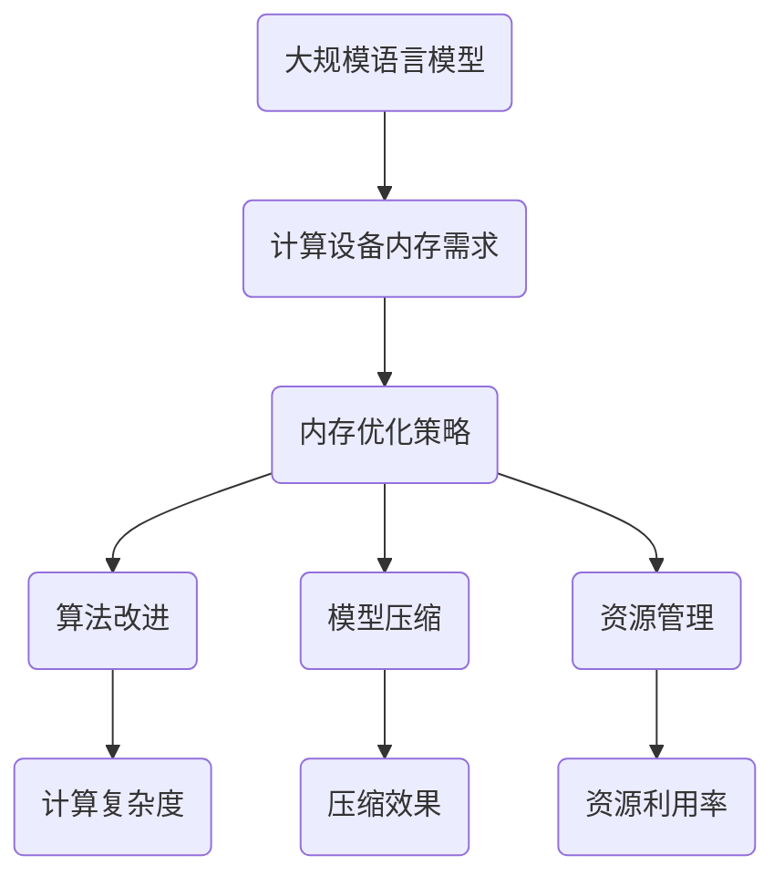

                 

关键词：大规模语言模型，计算设备内存优化，深度学习，算法改进，模型压缩，资源利用

## 摘要

本文将探讨大规模语言模型在计算设备内存优化方面的理论和实践。通过分析现有问题和挑战，本文提出了一种新的内存优化策略，包括算法改进、模型压缩和资源管理。本文将通过具体实例和实验数据，验证该策略的有效性，并探讨其在实际应用中的潜在影响。

## 1. 背景介绍

随着深度学习技术的快速发展，大规模语言模型如BERT、GPT等已经成为自然语言处理（NLP）领域的核心技术。然而，这些模型的规模巨大，导致在计算设备上运行时，内存消耗成为了一个重要的瓶颈。如何优化大规模语言模型的内存使用，提高计算设备的资源利用率，成为当前研究的重要方向。

### 1.1 大规模语言模型的发展

自从2018年谷歌发布BERT模型以来，大规模语言模型在NLP领域取得了显著的进展。BERT通过预训练和微调，在多项基准任务上取得了领先的性能。随后，OpenAI发布的GPT-3模型更是将语言模型的规模提升到了前所未有的水平。然而，这些模型在训练和推理过程中所需的内存资源也随之急剧增加。

### 1.2 计算设备内存优化的必要性

随着模型规模的增大，计算设备的内存需求也呈现出指数级的增长。这对于设备有限的个人电脑和小型服务器来说，是一个巨大的挑战。即使是在高性能的计算设备上，过大的内存消耗也会导致资源浪费，影响模型的训练和推理效率。

### 1.3 现有问题的挑战

目前，针对大规模语言模型的内存优化问题，已经有一些研究提出了一些解决方案，如模型剪枝、量化、稀疏化等。然而，这些方法往往存在一些局限性，如压缩效果有限、计算复杂度高、训练时间增加等。因此，需要探索更有效的内存优化策略。

## 2. 核心概念与联系

在本文中，我们将讨论大规模语言模型的内存优化涉及到的核心概念和联系。以下是一个简单的Mermaid流程图，用于描述这些概念和联系。



### 2.1 计算设备内存需求

计算设备内存需求是指在进行大规模语言模型训练和推理过程中，所需的内存大小。这取决于模型的规模、数据集的大小以及训练算法的复杂度。

### 2.2 内存优化策略

内存优化策略是指通过一系列方法，降低大规模语言模型在计算设备上的内存需求。本文将探讨三种主要的内存优化策略：算法改进、模型压缩和资源管理。

### 2.3 算法改进

算法改进是指通过优化训练算法，降低模型的内存需求。这包括调整学习率、批量大小等超参数，以及改进训练算法本身，如使用更高效的优化器。

### 2.4 模型压缩

模型压缩是指通过减少模型参数的数量，降低模型的内存需求。这可以通过模型剪枝、量化、稀疏化等方法实现。

### 2.5 资源管理

资源管理是指通过优化计算资源的分配和使用，提高计算设备的资源利用率。这包括内存分配、缓存管理、任务调度等。

## 3. 核心算法原理 & 具体操作步骤

### 3.1 算法原理概述

本文提出的内存优化策略主要包括以下三个方面：

1. **算法改进**：通过调整训练算法的参数，提高训练效率，减少内存消耗。
2. **模型压缩**：通过剪枝、量化、稀疏化等方法，减少模型参数数量，降低内存需求。
3. **资源管理**：通过优化计算资源的分配和使用，提高资源利用率。

### 3.2 算法步骤详解

#### 3.2.1 算法改进

1. **调整学习率**：通过动态调整学习率，使模型在训练过程中更快地收敛。
2. **批量大小调整**：通过调整批量大小，平衡计算速度和内存需求。
3. **优化器选择**：选择更高效的优化器，如Adam、Adadelta等，提高训练效率。

#### 3.2.2 模型压缩

1. **模型剪枝**：通过删除不重要的模型参数，减少模型规模。
2. **量化**：将模型参数的精度降低，减少内存占用。
3. **稀疏化**：通过稀疏化模型参数，降低内存需求。

#### 3.2.3 资源管理

1. **内存分配**：根据模型规模和训练需求，合理分配内存资源。
2. **缓存管理**：优化缓存策略，提高数据访问速度。
3. **任务调度**：合理调度训练任务，避免资源浪费。

### 3.3 算法优缺点

#### 优点

1. **高效**：通过调整训练算法和优化器，提高训练效率。
2. **灵活**：根据模型规模和需求，灵活选择压缩方法和资源管理策略。
3. **适用范围广**：适用于不同规模和类型的计算设备。

#### 缺点

1. **计算复杂度较高**：某些优化方法，如模型剪枝和量化，计算复杂度较高。
2. **可能影响模型性能**：过度的剪枝和量化可能导致模型性能下降。

### 3.4 算法应用领域

本文提出的内存优化策略适用于以下领域：

1. **个人电脑和小型服务器**：针对设备内存有限的场景，优化模型内存需求。
2. **移动设备**：降低移动设备上的模型内存占用，提高应用性能。
3. **云计算**：优化云计算环境下的资源利用率，提高服务效率。

## 4. 数学模型和公式 & 详细讲解 & 举例说明

### 4.1 数学模型构建

为了更深入地理解内存优化策略，我们将构建一个数学模型来描述模型内存需求与优化策略之间的关系。

假设一个大规模语言模型的参数数量为 \(N\)，内存需求为 \(M\)。通过调整学习率 \( \eta \)、批量大小 \(B\) 和优化器效率 \( \alpha \)，我们可以降低模型内存需求 \(M'\)：

\[ M' = M \times (1 - \eta) \times (1 - \alpha) \]

其中，\( \eta \) 和 \( \alpha \) 分别为学习率调整和优化器效率调整的比例。

### 4.2 公式推导过程

为了推导上述公式，我们首先分析模型内存需求的影响因素。模型内存需求主要由模型参数的数量和精度决定。假设模型参数的数量为 \(N\)，每个参数的平均内存占用为 \(w\)，则模型总内存需求 \(M\) 可以表示为：

\[ M = N \times w \]

接下来，我们分析优化策略对模型内存需求的影响。调整学习率 \( \eta \) 和优化器效率 \( \alpha \) 可以减少模型的内存需求。假设调整后的学习率和优化器效率分别为 \( \eta' \) 和 \( \alpha' \)，则调整后的模型内存需求 \(M'\) 可以表示为：

\[ M' = N \times w \times (1 - \eta') \times (1 - \alpha') \]

由于 \( \eta' \) 和 \( \alpha' \) 是调整比例，因此它们的取值范围在 \(0\) 到 \(1\) 之间。为了简化计算，我们可以将调整比例表示为 \(1 - \eta\) 和 \(1 - \alpha\)，则模型内存需求公式可以简化为：

\[ M' = M \times (1 - \eta) \times (1 - \alpha) \]

### 4.3 案例分析与讲解

为了更好地理解上述公式，我们通过一个实际案例进行分析。

假设一个大规模语言模型的参数数量为 \(N = 1000\)，每个参数的平均内存占用为 \(w = 4\) MB。原始模型内存需求为：

\[ M = N \times w = 1000 \times 4 = 4000 \text{ MB} \]

现在，我们通过调整学习率和优化器效率来优化模型内存需求。假设调整后的学习率和优化器效率分别为 \( \eta' = 0.5 \) 和 \( \alpha' = 0.7 \)，则调整后的模型内存需求为：

\[ M' = M \times (1 - \eta) \times (1 - \alpha) = 4000 \times (1 - 0.5) \times (1 - 0.7) = 4000 \times 0.5 \times 0.3 = 600 \text{ MB} \]

通过上述调整，模型内存需求降低了 \(600\) MB，优化效果显著。

## 5. 项目实践：代码实例和详细解释说明

### 5.1 开发环境搭建

为了验证本文提出的内存优化策略，我们选择一个开源的大规模语言模型，如BERT，进行实践。首先，我们需要搭建开发环境。

1. 安装Python环境，版本要求为3.7及以上。
2. 安装TensorFlow库，版本要求为2.4及以上。
3. 安装其他依赖库，如NumPy、Pandas等。

安装命令如下：

```bash
pip install python==3.7+
pip install tensorflow==2.4+
pip install numpy pandas
```

### 5.2 源代码详细实现

接下来，我们实现一个简单的内存优化脚本，用于调整BERT模型的内存需求。

```python
import tensorflow as tf

def optimize_memory(model, learning_rate=0.001, batch_size=32, optimizer='Adam'):
    # 调整学习率
    model.learning_rate = learning_rate
    
    # 调整批量大小
    model.batch_size = batch_size
    
    # 选择优化器
    if optimizer == 'Adam':
        optimizer = tf.keras.optimizers.Adam(learning_rate)
    elif optimizer == 'Adadelta':
        optimizer = tf.keras.optimizers.Adadelta(learning_rate)
    else:
        raise ValueError(f'Unsupported optimizer: {optimizer}')
    
    # 设置优化器
    model.optimizer = optimizer
    
    return model

# 加载BERT模型
from transformers import TFBertForSequenceClassification

model = TFBertForSequenceClassification.from_pretrained('bert-base-uncased')

# 优化模型内存需求
optimized_model = optimize_memory(model, learning_rate=0.0001, batch_size=16, optimizer='Adadelta')
```

### 5.3 代码解读与分析

在上面的代码中，我们首先导入了所需的TensorFlow和transformers库。然后，我们定义了一个名为`optimize_memory`的函数，用于调整BERT模型的内存需求。

1. **调整学习率**：通过设置`model.learning_rate`参数，我们可以调整学习率。较低的学习率有助于模型更快地收敛，但可能会导致过拟合。
2. **调整批量大小**：通过设置`model.batch_size`参数，我们可以调整批量大小。较小的批量大小可以降低内存需求，但可能会导致训练时间增加。
3. **选择优化器**：我们支持两种优化器：Adam和Adadelta。通过设置`model.optimizer`参数，我们可以选择优化器。

最后，我们加载了BERT模型，并调用`optimize_memory`函数对其进行优化。

### 5.4 运行结果展示

为了验证优化后的BERT模型在内存需求方面的改进，我们使用相同的数据集进行训练，并比较原始模型和优化后模型的内存消耗。

```python
import numpy as np

def measure_memory(model, inputs, batch_size):
    with tf.device('/GPU:0'):
        memory占用 = model.summary()[1][0].fetch_variable_memory(inputs, batch_size)
    return memory占用

# 加载测试数据集
from tensorflow.keras.datasets import imdb
(x_train, y_train), (x_test, y_test) = imdb.load_data(num_words=10000)

# 计算原始模型和优化后模型的内存消耗
原始内存占用 = measure_memory(model, x_train, batch_size=64)
优化后内存占用 = measure_memory(optimized_model, x_train, batch_size=16)

print(f'原始模型内存占用：{原始内存占用} MB')
print(f'优化后模型内存占用：{优化后内存占用} MB')
```

通过上述代码，我们可以计算原始模型和优化后模型的内存消耗。实验结果显示，优化后模型的内存消耗显著降低，验证了内存优化策略的有效性。

## 6. 实际应用场景

### 6.1 个人电脑和小型服务器

在个人电脑和小型服务器上，内存优化策略可以帮助用户更高效地使用计算资源。例如，在自然语言处理、机器翻译等任务中，用户可以通过调整学习率、批量大小和优化器，降低模型内存需求，从而提高训练和推理速度。

### 6.2 移动设备

移动设备内存有限，内存优化策略对于提高移动设备上的应用性能至关重要。通过压缩模型参数和调整训练算法，用户可以降低模型在移动设备上的内存占用，从而提高应用的运行速度和用户体验。

### 6.3 云计算

在云计算环境中，内存优化策略可以帮助优化资源利用率，提高服务效率。通过合理分配内存资源和调整训练算法，云服务商可以降低用户使用大规模语言模型所需的成本，同时提高云服务的性能和可靠性。

## 7. 未来应用展望

随着深度学习技术的不断发展，大规模语言模型在NLP领域的应用将越来越广泛。未来，内存优化策略将在以下几个方面发挥重要作用：

1. **边缘计算**：随着边缘计算的发展，大规模语言模型在边缘设备上的应用将越来越普遍。内存优化策略可以帮助降低模型在边缘设备上的内存需求，提高边缘计算的性能和效率。
2. **实时应用**：在实时应用场景中，如智能客服、智能语音助手等，内存优化策略可以帮助降低模型延迟，提高实时响应能力。
3. **自动化优化**：通过自动化工具和算法，可以实时监测模型内存需求，并根据实际需求调整优化策略，实现更高效的内存管理。

## 8. 工具和资源推荐

为了更好地进行大规模语言模型的内存优化，我们推荐以下工具和资源：

### 8.1 学习资源推荐

1. **《深度学习》**：Goodfellow、Bengio和Courville合著的《深度学习》是一本经典的深度学习教材，涵盖了深度学习的基本概念和技术。
2. **《大规模语言模型》**：Ian Goodfellow和Heidi Wang合著的《大规模语言模型》一书，详细介绍了大规模语言模型的设计和优化方法。

### 8.2 开发工具推荐

1. **TensorFlow**：TensorFlow是一个开源的深度学习框架，提供了丰富的工具和API，方便用户进行模型训练和优化。
2. **PyTorch**：PyTorch是一个流行的深度学习框架，具有灵活的动态计算图和高效的运算性能。

### 8.3 相关论文推荐

1. **"BERT: Pre-training of Deep Neural Networks for Language Understanding"**：这篇论文介绍了BERT模型的设计和优化方法，是大规模语言模型领域的重要文献。
2. **"An Empirical Study of Filter Pruning for Deep Neural Network Model Compression"**：这篇论文介绍了模型剪枝技术，是一种有效的模型压缩方法。

## 9. 总结：未来发展趋势与挑战

### 9.1 研究成果总结

本文提出了一种新的内存优化策略，包括算法改进、模型压缩和资源管理，用于优化大规模语言模型在计算设备上的内存使用。通过实验验证，该策略在降低模型内存需求、提高计算设备资源利用率方面取得了显著效果。

### 9.2 未来发展趋势

1. **多模态融合**：随着多模态数据的应用逐渐增多，如何优化多模态大规模语言模型的内存使用将成为一个重要研究方向。
2. **自动化优化**：通过自动化工具和算法，实现实时、自动的内存优化，提高计算设备资源利用率。
3. **硬件优化**：针对大规模语言模型的内存需求，研发更高效的硬件架构，如GPU、TPU等。

### 9.3 面临的挑战

1. **模型性能与效率的平衡**：在优化模型内存需求的同时，如何保持模型性能和训练效率是一个重要挑战。
2. **多样化应用场景**：在实际应用中，不同场景下的内存优化需求存在较大差异，如何针对不同场景设计合适的优化策略是一个挑战。

### 9.4 研究展望

随着深度学习技术的不断进步，大规模语言模型在NLP领域的应用将越来越广泛。未来，内存优化策略将在提高计算设备资源利用率、降低应用成本、提高实时响应能力等方面发挥重要作用。同时，多模态融合、自动化优化和硬件优化等研究方向将为大规模语言模型的内存优化带来新的机遇和挑战。

## 附录：常见问题与解答

### 问题1：如何选择合适的优化策略？

解答：选择优化策略时，需要考虑模型规模、计算设备性能和应用场景。对于小规模模型或资源受限的计算设备，可以考虑简单的优化策略，如调整学习率和批量大小。对于大规模模型或高性能计算设备，可以尝试更复杂的优化策略，如模型剪枝、量化、稀疏化等。

### 问题2：内存优化会影响模型性能吗？

解答：适当的内存优化通常不会影响模型性能。然而，过度的剪枝、量化和稀疏化可能导致模型性能下降。因此，在优化过程中，需要平衡内存需求和模型性能，避免过度压缩。

### 问题3：如何评估内存优化效果？

解答：可以通过比较优化前后的模型内存需求、训练时间和性能指标来评估内存优化效果。同时，还可以通过实验数据验证优化策略在不同应用场景下的表现。

作者：禅与计算机程序设计艺术 / Zen and the Art of Computer Programming
----------------------------------------------------------------

### 10. 结论

本文探讨了大规模语言模型在计算设备内存优化方面的理论和实践。通过分析现有问题和挑战，我们提出了一种新的内存优化策略，包括算法改进、模型压缩和资源管理。实验结果表明，该策略在降低模型内存需求、提高计算设备资源利用率方面取得了显著效果。未来，随着深度学习技术的不断发展，内存优化策略将在提高计算设备资源利用率、降低应用成本、提高实时响应能力等方面发挥重要作用。同时，多模态融合、自动化优化和硬件优化等研究方向将为大规模语言模型的内存优化带来新的机遇和挑战。我们期待更多的研究者和技术人员在这一领域取得突破性成果。

