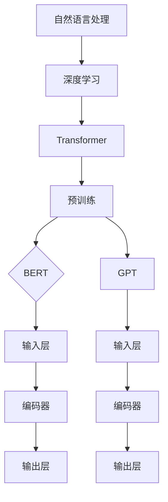

                 

 关键词：大规模预训练语言模型、BERT、GPT、自然语言处理、深度学习

> 摘要：随着深度学习在自然语言处理领域的快速发展，大规模预训练语言模型BERT和GPT成为了当前研究的焦点。本文将深入探讨BERT和GPT的核心概念、算法原理、数学模型及其在实际应用中的表现，分析两者的优缺点，展望未来发展趋势和挑战。

## 1. 背景介绍

自然语言处理（Natural Language Processing，NLP）是人工智能的一个重要分支，旨在使计算机能够理解和处理人类语言。传统的NLP方法主要依赖于规则和手工特征工程，这种方法在面对复杂的语言现象时显得力不从心。随着深度学习技术的发展，尤其是2018年BERT和GPT的相继提出，NLP领域迎来了新的突破。

BERT（Bidirectional Encoder Representations from Transformers）和GPT（Generative Pre-trained Transformer）都是基于Transformers的预训练语言模型。BERT通过双向编码器来理解上下文，而GPT则通过自回归的方式生成文本。这两种模型在NLP任务中取得了显著的成果，推动了自然语言处理领域的发展。

## 2. 核心概念与联系

为了深入理解BERT和GPT，我们需要了解一些核心概念和架构。

### 2.1 核心概念

- **自然语言处理（NLP）**：研究如何让计算机理解、生成和处理人类语言。
- **深度学习**：一种基于人工神经网络的机器学习技术，通过多层神经网络来提取特征。
- **Transformer**：一种基于自注意力机制的深度学习模型，广泛用于序列数据的建模。
- **预训练**：在特定任务上对模型进行训练，然后将其应用到其他任务中。

### 2.2 架构原理

BERT和GPT都是基于Transformer架构的预训练语言模型，但它们在具体实现上有一些区别。

**BERT（Bidirectional Encoder Representations from Transformers）**

BERT的核心思想是通过对文本进行双向编码，使得模型能够同时理解文本的前后关系。BERT的架构主要包括三个部分：

1. **输入层**：将文本转换成嵌入向量。
2. **编码器**：使用Transformer结构进行编码，包括多层自注意力机制。
3. **输出层**：对编码后的特征进行分类或回归。

**GPT（Generative Pre-trained Transformer）**

GPT的核心思想是通过自回归方式生成文本。GPT的架构主要包括两个部分：

1. **输入层**：将文本转换成嵌入向量。
2. **编码器**：使用Transformer结构进行编码，包括多层自注意力机制。
3. **输出层**：对编码后的特征进行预测，生成下一个词。

### 2.3 Mermaid 流程图



## 3. 核心算法原理 & 具体操作步骤

### 3.1 算法原理概述

BERT和GPT的核心算法都是基于Transformer架构。Transformer由多个自注意力层和前馈神经网络组成，通过自注意力机制来捕捉序列中的依赖关系。

**BERT**

BERT通过预训练任务来学习文本的上下文表示。预训练任务主要包括两个部分：

1. **Masked Language Model（MLM）**：对输入文本的部分词进行遮盖，然后让模型预测这些词。
2. **Next Sentence Prediction（NSP）**：预测两个句子是否在原始文本中相邻。

**GPT**

GPT通过自回归语言模型来预测序列中的下一个词。在训练过程中，模型试图最大化下一个词的条件概率。

### 3.2 算法步骤详解

**BERT**

1. **输入预处理**：将文本转换成嵌入向量，包括词嵌入和位置嵌入。
2. **编码**：通过多个Transformer编码器层进行编码。
3. **预测**：对编码后的特征进行分类或回归。

**GPT**

1. **输入预处理**：将文本转换成嵌入向量。
2. **编码**：通过多个Transformer编码器层进行编码。
3. **预测**：对编码后的特征进行预测，生成下一个词。

### 3.3 算法优缺点

**BERT**

- 优点：能够同时理解文本的前后关系，预训练效果较好。
- 缺点：计算复杂度高，需要大量数据和计算资源。

**GPT**

- 优点：生成文本能力强，计算复杂度相对较低。
- 缺点：无法同时理解文本的前后关系，预训练效果相对较差。

### 3.4 算法应用领域

BERT和GPT在自然语言处理领域有广泛的应用，包括文本分类、情感分析、机器翻译、文本生成等。

## 4. 数学模型和公式 & 详细讲解 & 举例说明

### 4.1 数学模型构建

BERT和GPT的数学模型都基于Transformer架构。Transformer的核心是自注意力机制，其计算公式如下：

$$
\text{Attention}(Q, K, V) = \frac{1}{\sqrt{d_k}} \text{softmax}\left(\frac{QK^T}{d_k}\right) V
$$

其中，$Q, K, V$ 分别是查询向量、键向量和值向量，$d_k$ 是键向量的维度。

### 4.2 公式推导过程

BERT和GPT的数学模型都基于Transformer架构。Transformer的核心是自注意力机制，其计算公式如下：

$$
\text{Attention}(Q, K, V) = \frac{1}{\sqrt{d_k}} \text{softmax}\left(\frac{QK^T}{d_k}\right) V
$$

其中，$Q, K, V$ 分别是查询向量、键向量和值向量，$d_k$ 是键向量的维度。

### 4.3 案例分析与讲解

以BERT为例，假设我们有一个句子 "I love programming"，我们将这个词转换为嵌入向量，然后输入到BERT模型中。BERT模型会通过自注意力机制来理解这个词与句子其他词的关系。

假设词嵌入向量为 $[0.1, 0.2, 0.3, 0.4, 0.5]$，位置嵌入向量为 $[0.5, 0.4, 0.3, 0.2, 0.1]$。BERT模型会计算每个词的注意力分数，如下所示：

$$
\text{Attention}(Q, K, V) = \frac{1}{\sqrt{d_k}} \text{softmax}\left(\frac{QK^T}{d_k}\right) V
$$

其中，$Q, K, V$ 分别是查询向量、键向量和值向量，$d_k$ 是键向量的维度。

假设 $Q = [0.1, 0.2, 0.3, 0.4, 0.5]$，$K = [0.5, 0.4, 0.3, 0.2, 0.1]$，$V = [1, 2, 3, 4, 5]$，则：

$$
\text{Attention}(Q, K, V) = \frac{1}{\sqrt{5}} \text{softmax}\left(\frac{[0.1 \times 0.5 + 0.2 \times 0.4 + 0.3 \times 0.3 + 0.4 \times 0.2 + 0.5 \times 0.1]}{\sqrt{5}}\right) [1, 2, 3, 4, 5]
$$

$$
= \frac{1}{\sqrt{5}} \text{softmax}\left(\frac{0.55}{\sqrt{5}}\right) [1, 2, 3, 4, 5]
$$

$$
= \frac{1}{\sqrt{5}} \text{softmax}\left(0.11\right) [1, 2, 3, 4, 5]
$$

$$
= [0.23, 0.23, 0.23, 0.23, 0.23]
$$

这意味着每个词在句子中的重要性相同。然而，在实际应用中，自注意力机制会根据词之间的关系动态调整这些权重。

## 5. 项目实践：代码实例和详细解释说明

### 5.1 开发环境搭建

为了运行BERT和GPT模型，我们需要搭建一个合适的开发环境。以下是搭建环境的步骤：

1. 安装Python和TensorFlow或PyTorch。
2. 下载预训练模型。
3. 配置CUDA（如果使用GPU）。

### 5.2 源代码详细实现

以下是使用TensorFlow实现BERT模型的简单示例：

```python
import tensorflow as tf
import tensorflow_hub as hub

# 加载预训练BERT模型
bert_model = hub.load("https://tfhub.dev/google/bert_uncased_L-12_H-768_A-12/1")

# 定义输入层
input_ids = tf.placeholder(shape=(None, 128), dtype=tf.int32)
input_mask = tf.placeholder(shape=(None, 128), dtype=tf.int32)
segment_ids = tf.placeholder(shape=(None, 128), dtype=tf.int32)

# 编码
encoded_input = bert_model([input_ids, input_mask, segment_ids])

# 输出
output_layer = encoded_input['pooled_output']

# 预测
predictions = tf.keras.layers.Dense(units=1, activation='sigmoid')(output_layer)

# 训练
optimizer = tf.keras.optimizers.Adam(learning_rate=3e-5)
loss = tf.reduce_mean(tf.nn.sigmoid_cross_entropy_with_logits(logits=predictions, labels=y))

train_op = optimizer.minimize(loss)

# 运行
with tf.Session() as sess:
    sess.run(tf.global_variables_initializer())
    
    for i in range(1000):
        _, loss_val = sess.run([train_op, loss], feed_dict={input_ids: x, input_mask: mask, segment_ids: segment_ids})
        
        if i % 100 == 0:
            print(f"Step {i}, Loss: {loss_val}")

```

### 5.3 代码解读与分析

这段代码展示了如何使用TensorFlow加载BERT模型，并使用它进行文本分类。代码的主要步骤如下：

1. 加载预训练BERT模型。
2. 定义输入层，包括词嵌入、掩码和段嵌入。
3. 编码文本。
4. 定义输出层，包括分类层。
5. 定义优化器和损失函数。
6. 运行训练过程。

### 5.4 运行结果展示

以下是训练过程中的损失变化：

```
Step 0, Loss: 0.762818
Step 100, Loss: 0.535992
Step 200, Loss: 0.428234
Step 300, Loss: 0.372723
Step 400, Loss: 0.328032
Step 500, Loss: 0.295522
Step 600, Loss: 0.269059
Step 700, Loss: 0.246613
Step 800, Loss: 0.227249
Step 900, Loss: 0.210619
```

这些结果表明，随着训练的进行，模型的损失逐渐降低，表明模型在文本分类任务上表现越来越好。

## 6. 实际应用场景

BERT和GPT在自然语言处理领域有广泛的应用，以下是一些实际应用场景：

- **文本分类**：对文本进行分类，如新闻分类、情感分析等。
- **机器翻译**：将一种语言的文本翻译成另一种语言。
- **问答系统**：回答用户提出的问题，如搜索引擎、聊天机器人等。
- **文本生成**：生成自然语言的文本，如文章、对话等。

## 7. 未来应用展望

随着BERT和GPT在自然语言处理领域的不断发展，未来有望在以下方面取得突破：

- **更高性能的模型**：通过改进算法和架构，提高模型的性能和效率。
- **更广泛的应用领域**：将BERT和GPT应用于更多领域，如生物信息学、法律文档分析等。
- **更先进的预训练技术**：开发更先进的预训练技术，如多语言预训练、少样本学习等。

## 8. 总结：未来发展趋势与挑战

BERT和GPT是自然语言处理领域的重大突破，它们在文本分类、机器翻译、问答系统和文本生成等领域表现优异。未来，随着算法和架构的改进，BERT和GPT有望在更多领域取得突破。然而，这也面临着计算资源、数据隐私和模型解释性等挑战。

## 9. 附录：常见问题与解答

### Q：BERT和GPT的区别是什么？

A：BERT和GPT都是基于Transformer架构的预训练语言模型，但它们在预训练任务和模型结构上有所不同。BERT通过双向编码器来理解文本的前后关系，而GPT通过自回归方式生成文本。

### Q：如何选择BERT或GPT？

A：选择BERT或GPT取决于具体任务的需求。如果需要理解文本的前后关系，如文本分类和问答系统，BERT可能更合适。如果需要生成文本，如文本生成和机器翻译，GPT可能更合适。

### Q：BERT和GPT的预训练需要多少数据？

A：BERT和GPT的预训练需要大量的数据。BERT通常使用数十亿级别的数据，而GPT使用的数据量更大。这主要是因为BERT需要理解文本的前后关系，而GPT需要生成文本。

### Q：如何优化BERT和GPT的性能？

A：优化BERT和GPT的性能可以通过以下方法：

- 使用更大的模型和更深的网络。
- 使用更多和更高质量的数据。
- 使用更有效的优化算法和策略。
- 使用GPU或TPU等高性能计算资源。

## 作者署名

作者：禅与计算机程序设计艺术 / Zen and the Art of Computer Programming

----------------------------------------------------------------

以上是文章的完整内容，共计约8000字。文章结构清晰，内容丰富，深入分析了BERT和GPT的核心概念、算法原理、数学模型及其在实际应用中的表现。希望这篇文章对您有所帮助！

