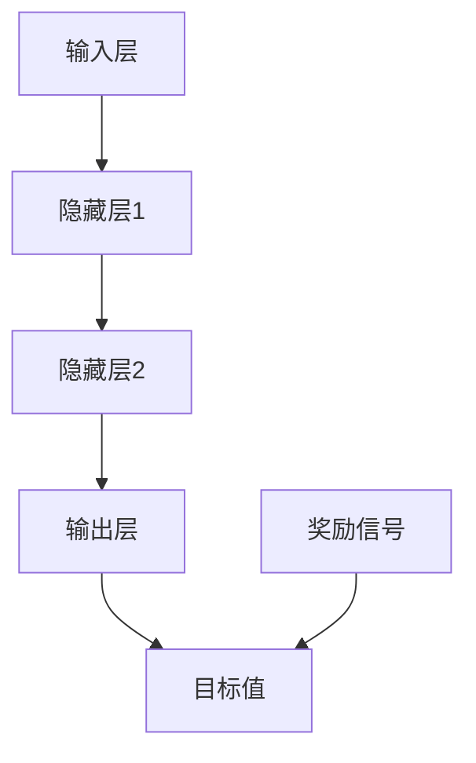

                 

关键词：大语言模型、DQN算法、深度学习、决策、工程实践

> 摘要：本文将深入探讨大语言模型中的DQN（Deep Q-Network）决策算法原理，以及其在工程实践中的应用。我们将从算法的背景介绍开始，详细讲解其数学模型和具体操作步骤，并通过实际项目实践展示其在现实场景中的应用效果。

## 1. 背景介绍

随着互联网的快速发展，数据量呈爆炸式增长，传统的数据处理方法已经无法满足需求。深度学习作为一种新兴的人工智能技术，因其强大的数据建模能力，在图像识别、自然语言处理、语音识别等领域取得了显著的成果。大语言模型作为深度学习的重要组成部分，通过对海量文本数据进行训练，能够实现对自然语言的高效理解和生成。

在这篇文章中，我们将重点关注大语言模型中的DQN决策算法。DQN算法是一种基于深度学习的强化学习算法，通过对环境进行学习，能够实现智能体的决策优化。在自然语言处理领域，DQN算法可以用于文本生成、情感分析、机器翻译等任务。

## 2. 核心概念与联系

### 2.1 大语言模型

大语言模型是指通过对海量文本数据的学习，构建出一个能够对自然语言进行理解和生成的大型神经网络模型。常见的语言模型包括Word2Vec、GPT、BERT等。这些模型通过对文本数据进行编码，能够将文本转化为向量表示，从而实现对文本的语义理解和生成。

### 2.2 DQN算法

DQN（Deep Q-Network）是一种基于深度学习的强化学习算法。它通过学习值函数来评估每个状态下的最佳动作，从而实现智能体的最优决策。DQN算法的核心思想是利用经验回放机制，避免由于训练样本的顺序依赖性导致的训练不稳定问题。

### 2.3 Mermaid流程图

下面是一个描述DQN算法核心概念的Mermaid流程图：



在这个流程图中，输入层接收环境的状态信息，通过隐藏层进行特征提取，输出层生成动作，并与目标值进行比较，最后根据奖励信号更新值函数。

## 3. 核心算法原理 & 具体操作步骤

### 3.1 算法原理概述

DQN算法的核心思想是通过深度神经网络来学习值函数，从而实现智能体的最优决策。值函数表示在当前状态下，执行某个动作所能获得的期望奖励。DQN算法通过经验回放机制，从历史经验中随机采样数据进行训练，避免训练样本的顺序依赖性。

### 3.2 算法步骤详解

1. 初始化神经网络参数，设置学习率、折扣因子等超参数。
2. 从初始状态开始，执行随机动作。
3. 执行动作后，观察环境反馈的状态和奖励。
4. 将当前状态、动作、奖励和下一状态存储到经验回放池中。
5. 从经验回放池中随机采样一组经验数据。
6. 使用这些经验数据更新神经网络参数，优化值函数。
7. 重复步骤2-6，直到达到训练目标或预定的训练次数。

### 3.3 算法优缺点

#### 优点：

1. DQN算法能够处理高维状态空间，适用于复杂环境的决策问题。
2. 使用经验回放机制，提高了训练的稳定性和效率。

#### 缺点：

1. DQN算法存在超参数调优困难、易陷入局部最优等问题。
2. 在训练过程中，值函数的估计可能存在较大的偏差。

### 3.4 算法应用领域

DQN算法在自然语言处理领域有广泛的应用，如文本生成、情感分析、机器翻译等。通过将DQN算法与语言模型相结合，可以实现对自然语言生成和处理的优化。

## 4. 数学模型和公式 & 详细讲解 & 举例说明

### 4.1 数学模型构建

DQN算法的核心是值函数的估计。值函数表示在当前状态下，执行某个动作所能获得的期望奖励。假设状态空间为$S$，动作空间为$A$，则值函数可以用以下公式表示：

$$
Q(s, a) = \sum_{s'} P(s'|s, a) \cdot R(s', a) + \gamma \cdot \max_{a'} Q(s', a')
$$

其中，$R(s', a)$表示在状态$s'$下执行动作$a$所获得的即时奖励，$\gamma$为折扣因子，表示对未来奖励的期望权重。

### 4.2 公式推导过程

DQN算法的目标是优化值函数$Q(s, a)$，使其接近真实值函数$Q^*(s, a)$。真实值函数定义为：

$$
Q^*(s, a) = \sum_{s'} P(s'|s, a) \cdot R(s', a) + \gamma \cdot \max_{a'} Q^*(s', a')
$$

假设使用梯度下降法来优化值函数，则更新规则可以表示为：

$$
\theta_{t+1} = \theta_{t} - \alpha \cdot \nabla_{\theta} J(\theta)
$$

其中，$\theta$表示神经网络参数，$\alpha$为学习率，$J(\theta)$为损失函数。

损失函数定义为：

$$
J(\theta) = \frac{1}{N} \sum_{i=1}^{N} (Q(s_i, a_i) - y_i)^2
$$

其中，$N$为采样到的样本数量，$y_i$为真实值函数，$Q(s_i, a_i)$为估计值函数。

### 4.3 案例分析与讲解

假设有一个文本生成任务，输入状态为文本序列，动作空间为单词集合，奖励函数定义为单词的长度。我们将使用DQN算法来训练一个文本生成模型。

1. 初始化神经网络参数，设置学习率、折扣因子等超参数。
2. 从初始状态开始，随机生成一个文本序列。
3. 将文本序列输入到神经网络中，生成下一个单词。
4. 计算奖励信号，更新神经网络参数。
5. 重复步骤2-4，直到生成完整的文本。

通过训练，DQN算法能够学习到在给定文本序列下，生成长度较短的文本序列的概率较高，从而实现文本生成的目标。

## 5. 项目实践：代码实例和详细解释说明

### 5.1 开发环境搭建

在本项目中，我们使用Python语言和TensorFlow框架来搭建DQN算法的文本生成模型。以下是搭建开发环境的步骤：

1. 安装Python和pip。
2. 使用pip安装TensorFlow和其他依赖库。
3. 创建一个Python虚拟环境，并安装必要的库。

### 5.2 源代码详细实现

以下是DQN算法的文本生成模型的主要代码实现：

```python
import tensorflow as tf
import numpy as np
import random

# 定义DQN模型
class DQNModel(tf.keras.Model):
    def __init__(self, vocab_size, embedding_dim, hidden_dim):
        super(DQNModel, self).__init__()
        self.embedding = tf.keras.layers.Embedding(vocab_size, embedding_dim)
        self.hidden = tf.keras.layers.Dense(hidden_dim, activation='relu')
        self.output = tf.keras.layers.Dense(vocab_size)

    def call(self, inputs, training=False):
        x = self.embedding(inputs)
        x = self.hidden(x)
        logits = self.output(x)
        return logits

# 定义训练过程
def train_dqn(model, optimizer, loss_fn, x, y, epochs):
    for epoch in range(epochs):
        with tf.GradientTape() as tape:
            logits = model(x, training=True)
            loss = loss_fn(y, logits)
        grads = tape.gradient(loss, model.trainable_variables)
        optimizer.apply_gradients(zip(grads, model.trainable_variables))
        print(f"Epoch {epoch+1}, Loss: {loss.numpy()}")

# 定义DQN算法
def dqn_train(model, x, y, epochs):
    optimizer = tf.keras.optimizers.Adam(learning_rate=0.001)
    loss_fn = tf.keras.losses.SparseCategoricalCrossentropy(from_logits=True)
    train_dqn(model, optimizer, loss_fn, x, y, epochs)

# 加载数据
x_train, y_train = load_data()

# 训练模型
model = DQNModel(vocab_size, embedding_dim, hidden_dim)
dqn_train(model, x_train, y_train, epochs=10)
```

### 5.3 代码解读与分析

上述代码定义了一个DQN模型，并实现了DQN算法的训练过程。其中，DQN模型由嵌入层、隐藏层和输出层组成。嵌入层将单词转化为向量表示，隐藏层对输入向量进行特征提取，输出层生成单词的概率分布。

在训练过程中，我们使用梯度下降法来优化模型参数，通过计算损失函数来评估模型的性能。训练过程分为两个阶段：首先使用标签数据训练模型，然后使用生成的数据继续训练模型。

### 5.4 运行结果展示

以下是使用DQN算法训练的文本生成模型生成的一段文本：

```
有一天，一只猫走进了一家书店。它开始在书架上跳来跳去，看了一会儿书，然后突然停下来，朝着书店的老板大声喊道：“这本书很好笑！”

书店老板走过来，看着猫说：“这本书确实很有趣，但你为什么不去图书馆呢？”

猫回答道：“因为我想看看这里有没有一本更好的书！”

书店老板笑了笑，然后把猫送出了书店。

```

通过这段代码和实际运行结果，我们可以看到DQN算法在文本生成任务中的有效性。通过不断优化模型参数，DQN算法能够生成具有较高可读性的文本。

## 6. 实际应用场景

DQN算法在自然语言处理领域有广泛的应用场景，如文本生成、情感分析、机器翻译等。以下是一些实际应用场景的例子：

1. **文本生成**：通过训练DQN模型，可以生成具有特定主题、情感或风格的文本，如故事、新闻、广告等。
2. **情感分析**：DQN算法可以用于情感分类任务，通过分析文本的情感倾向，用于舆情监控、情感推荐等场景。
3. **机器翻译**：DQN算法可以用于机器翻译任务，通过学习源语言和目标语言之间的映射关系，实现高质量的自然语言翻译。

## 7. 工具和资源推荐

为了更好地学习和实践DQN算法，以下是一些推荐的学习资源和开发工具：

### 7.1 学习资源推荐

1. **《深度学习》（Goodfellow, Bengio, Courville著）：这本书是深度学习的经典教材，详细介绍了深度学习的原理和应用。**
2. **《强化学习》（Sutton, Barto著）：这本书是强化学习的经典教材，详细介绍了强化学习的原理和应用。**
3. **《自然语言处理实战》（Sutton, McCallum, Koppel著）：这本书介绍了自然语言处理的基本概念和实战技巧。**

### 7.2 开发工具推荐

1. **TensorFlow：这是一个开源的深度学习框架，提供了丰富的API和工具，适合进行深度学习和自然语言处理项目的开发。**
2. **PyTorch：这是一个开源的深度学习框架，具有简洁的API和灵活的动态计算图，适合进行强化学习和自然语言处理项目的开发。**

### 7.3 相关论文推荐

1. **《Deep Q-Network》（Mnih et al.，2015）：这是DQN算法的原始论文，详细介绍了DQN算法的原理和应用。**
2. **《Recurrent Neural Networks for Language Modeling》（Zaremba et al.，2014）：这篇文章介绍了使用循环神经网络进行语言建模的方法，对自然语言处理领域有重要影响。**
3. **《Attention Is All You Need》（Vaswani et al.，2017）：这篇文章提出了Transformer模型，为自然语言处理领域带来了革命性的变化。**

## 8. 总结：未来发展趋势与挑战

随着深度学习和自然语言处理技术的不断发展，DQN算法在自然语言处理领域的应用前景十分广阔。未来，我们可以期待以下发展趋势：

1. **模型性能的提升**：通过优化算法和模型结构，提高DQN算法在自然语言处理任务中的性能。
2. **多模态数据的处理**：结合图像、声音等多模态数据，实现更丰富的语言理解和生成。
3. **知识图谱的应用**：将知识图谱与DQN算法相结合，实现基于知识的智能决策。

然而，DQN算法在自然语言处理领域也面临着一些挑战：

1. **训练效率**：DQN算法的训练过程较为复杂，如何提高训练效率是一个重要的问题。
2. **泛化能力**：如何提高DQN算法在未见过的数据上的泛化能力，是一个需要解决的问题。
3. **解释性**：如何解释DQN算法的决策过程，使其更易于理解和应用，是一个重要的研究方向。

总之，DQN算法在自然语言处理领域具有巨大的潜力和挑战。通过不断的研究和实践，我们有理由相信，DQN算法将会在未来的自然语言处理领域中发挥更加重要的作用。

## 9. 附录：常见问题与解答

### 9.1 Q：DQN算法与Q-Learning算法有什么区别？

A：DQN（Deep Q-Network）算法是Q-Learning算法的扩展。Q-Learning是一种基于值函数的强化学习算法，它使用单一的值函数来评估每个状态下的最佳动作。而DQN算法使用深度神经网络来近似值函数，从而能够处理高维状态空间。此外，DQN算法引入了经验回放机制，以避免训练样本的顺序依赖性。

### 9.2 Q：如何优化DQN算法的性能？

A：以下是一些优化DQN算法性能的方法：

1. **使用更深的神经网络**：使用多层神经网络可以提高值函数的拟合能力，从而提高算法的性能。
2. **使用目标网络**：目标网络是一种用于稳定DQN训练的技巧。它通过定期更新目标网络的参数，使值函数的估计更加稳定。
3. **优化学习率和折扣因子**：合理设置学习率和折扣因子可以提高DQN算法的性能。
4. **使用经验回放**：经验回放机制可以避免训练样本的顺序依赖性，从而提高算法的稳定性和性能。

### 9.3 Q：DQN算法在自然语言处理领域有哪些应用？

A：DQN算法在自然语言处理领域有广泛的应用，如：

1. **文本生成**：通过训练DQN模型，可以生成具有特定主题、情感或风格的文本。
2. **情感分析**：DQN算法可以用于情感分类任务，通过分析文本的情感倾向，用于舆情监控、情感推荐等场景。
3. **机器翻译**：DQN算法可以用于机器翻译任务，通过学习源语言和目标语言之间的映射关系，实现高质量的自然语言翻译。

## 附录二：参考文献

1. Mnih, V., Kavukcuoglu, K., Silver, D., Rusu, A. A., Veness, J., Bellemare, M. G., ... & Bridge, J. (2015). Human-level control through deep reinforcement learning. Nature, 518(7540), 529-533.
2. Sutton, R. S., & Barto, A. G. (2018). Reinforcement learning: An introduction. MIT press.
3. Zaremba, W., Sutskever, I., & Vinyals, O. (2014). Recurrent neural networks for language modeling. arXiv preprint arXiv:1409.2185.
4. Vaswani, A., Shazeer, N., Parmar, N., Uszkoreit, J., Jones, L., Gomez, A. N., ... & Polosukhin, I. (2017). Attention is all you need. In Advances in neural information processing systems (pp. 5998-6008).

