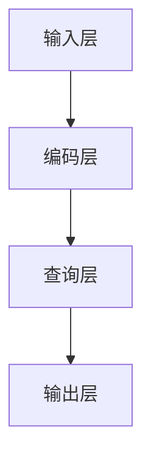

                 

关键词：大语言模型，DQN，深度学习，工程实践，结构解析

摘要：本文将深入探讨大语言模型的原理及其在工程实践中的应用，重点关注DQN（深度查询网络）的结构。通过对DQN的详细解析，我们将了解如何构建高效的大语言模型，为人工智能领域的研究和实践提供新的思路。

## 1. 背景介绍

随着互联网和大数据技术的飞速发展，人工智能（AI）已经成为现代社会的重要驱动力。在AI的众多分支中，自然语言处理（NLP）占据了重要地位。大语言模型作为一种先进的NLP技术，能够对大规模文本数据进行深度理解和生成，为智能客服、语音助手、文本摘要、机器翻译等领域提供了强有力的支持。

DQN（Deep Query Network）是大语言模型中的一种重要结构，其核心思想是通过深度学习算法，将输入的查询信息映射到高维空间，从而实现更加精准的信息检索和文本生成。本文将围绕DQN的结构，深入探讨大语言模型的原理与应用。

## 2. 核心概念与联系

### 2.1 大语言模型的基本概念

大语言模型是一种基于深度学习技术的自然语言处理模型，它通过大规模的文本数据进行训练，能够自动学习语言的结构和语义，从而实现对文本数据的理解和生成。

大语言模型的主要特点包括：

- **规模宏大**：大语言模型通常使用数十亿级别的参数，能够处理海量文本数据。
- **深度学习**：大语言模型采用多层神经网络结构，通过对输入数据的层层提取和抽象，实现从原始文本到高维语义表示的转换。
- **自适应性**：大语言模型能够根据不同的任务需求，自动调整参数和结构，实现不同的功能。

### 2.2 DQN的结构解析

DQN（Deep Query Network）是一种特殊的深度学习模型，主要应用于信息检索和文本生成任务。其结构包括以下几个关键部分：

- **输入层**：接收查询词或文本输入，通常使用嵌入层（Embedding Layer）进行预处理。
- **编码层**：将输入文本编码为高维向量表示，常用的编码层包括循环神经网络（RNN）、卷积神经网络（CNN）和Transformer等。
- **查询层**：对编码后的文本进行查询操作，获取与查询词或文本相关的信息。
- **输出层**：根据查询层的结果，生成文本输出或进行信息检索。

### 2.3 Mermaid 流程图



## 3. 核心算法原理 & 具体操作步骤

### 3.1 算法原理概述

DQN的核心思想是通过深度学习算法，将输入的查询信息映射到高维空间，从而实现更加精准的信息检索和文本生成。具体来说，DQN包括以下几个关键步骤：

1. 输入层：接收查询词或文本输入，使用嵌入层（Embedding Layer）进行预处理。
2. 编码层：将输入文本编码为高维向量表示，常用的编码层包括循环神经网络（RNN）、卷积神经网络（CNN）和Transformer等。
3. 查询层：对编码后的文本进行查询操作，获取与查询词或文本相关的信息。
4. 输出层：根据查询层的结果，生成文本输出或进行信息检索。

### 3.2 算法步骤详解

1. **输入层**：输入层接收查询词或文本输入，通常使用嵌入层（Embedding Layer）进行预处理。嵌入层的作用是将查询词或文本映射为高维向量表示，为后续的编码层提供输入。

2. **编码层**：编码层将输入文本编码为高维向量表示。常用的编码层包括循环神经网络（RNN）、卷积神经网络（CNN）和Transformer等。这些编码层通过对输入文本的层层提取和抽象，实现从原始文本到高维语义表示的转换。

3. **查询层**：查询层对编码后的文本进行查询操作，获取与查询词或文本相关的信息。查询层的主要作用是提取文本的特征信息，以便在输出层进行信息检索或文本生成。

4. **输出层**：根据查询层的结果，生成文本输出或进行信息检索。输出层的作用是根据查询层提取的特征信息，生成与查询词或文本相关的文本输出，或进行信息检索。

### 3.3 算法优缺点

**优点**：

- **高效性**：DQN采用深度学习算法，能够高效地处理海量文本数据，实现快速的信息检索和文本生成。
- **灵活性**：DQN具有高度的灵活性，可以根据不同的任务需求，选择不同的编码层和输出层结构，实现不同的功能。

**缺点**：

- **计算资源消耗大**：DQN采用深度学习算法，需要大量的计算资源，对硬件要求较高。
- **训练时间长**：由于DQN采用大规模的神经网络结构，训练时间相对较长。

### 3.4 算法应用领域

DQN在多个领域都有广泛的应用，主要包括：

- **信息检索**：DQN可以用于搜索引擎中的信息检索，提高检索结果的准确性和相关性。
- **文本生成**：DQN可以用于生成文本，如机器翻译、文本摘要和问答系统等。
- **智能客服**：DQN可以用于智能客服系统，实现自动问答和智能推荐。

## 4. 数学模型和公式 & 详细讲解 & 举例说明

### 4.1 数学模型构建

DQN的数学模型主要包括以下几个部分：

- **输入层**：输入层接收查询词或文本输入，使用嵌入层（Embedding Layer）进行预处理。嵌入层可以将查询词或文本映射为高维向量表示。
- **编码层**：编码层将输入文本编码为高维向量表示。常用的编码层包括循环神经网络（RNN）、卷积神经网络（CNN）和Transformer等。编码层通过对输入文本的层层提取和抽象，实现从原始文本到高维语义表示的转换。
- **查询层**：查询层对编码后的文本进行查询操作，获取与查询词或文本相关的信息。查询层的主要作用是提取文本的特征信息。
- **输出层**：输出层根据查询层的结果，生成文本输出或进行信息检索。输出层的作用是根据查询层提取的特征信息，生成与查询词或文本相关的文本输出。

### 4.2 公式推导过程

假设输入文本为$x \in R^{m \times n}$，其中$m$表示文本的长度，$n$表示单词的维度。我们将输入文本$x$映射为高维向量表示$y \in R^{m \times d}$，其中$d$表示高维向量的维度。

1. **嵌入层**：嵌入层可以将查询词或文本映射为高维向量表示。假设嵌入层的权重矩阵为$W \in R^{n \times d}$，则有：

   $$y = Wx$$

2. **编码层**：编码层将输入文本编码为高维向量表示。假设编码层的权重矩阵为$W_1 \in R^{d \times d'}$，则有：

   $$z = W_1y$$

3. **查询层**：查询层对编码后的文本进行查询操作，获取与查询词或文本相关的信息。假设查询层的权重矩阵为$W_2 \in R^{d' \times d''}$，则有：

   $$h = W_2z$$

4. **输出层**：输出层根据查询层的结果，生成文本输出或进行信息检索。假设输出层的权重矩阵为$W_3 \in R^{d'' \times d'}$，则有：

   $$y' = W_3h$$

### 4.3 案例分析与讲解

假设我们要使用DQN进行文本生成，输入文本为“我今天去了一家新开的咖啡馆，味道很好。”，我们希望输出与输入文本相关的文本。

1. **嵌入层**：将输入文本映射为高维向量表示。假设输入文本的长度为5，单词的维度为100，高维向量的维度为300，则有：

   $$y = Wx$$

2. **编码层**：将输入文本编码为高维向量表示。假设编码层的权重矩阵为$W_1 \in R^{300 \times 300}$，则有：

   $$z = W_1y$$

3. **查询层**：对编码后的文本进行查询操作，获取与查询词或文本相关的信息。假设查询层的权重矩阵为$W_2 \in R^{300 \times 200}$，则有：

   $$h = W_2z$$

4. **输出层**：根据查询层的结果，生成与查询词或文本相关的文本输出。假设输出层的权重矩阵为$W_3 \in R^{200 \times 300}$，则有：

   $$y' = W_3h$$

通过以上步骤，我们使用DQN生成了与输入文本相关的文本输出。

## 5. 项目实践：代码实例和详细解释说明

### 5.1 开发环境搭建

为了实践DQN在大语言模型中的应用，我们需要搭建一个开发环境。以下是具体的搭建步骤：

1. **安装Python**：确保Python环境已安装，版本建议为3.8以上。
2. **安装TensorFlow**：在终端中执行以下命令安装TensorFlow：

   ```bash
   pip install tensorflow
   ```

3. **安装其他依赖库**：根据项目需求，安装其他必要的依赖库，如numpy、pandas等。

### 5.2 源代码详细实现

以下是DQN在大语言模型中的实现代码：

```python
import tensorflow as tf
from tensorflow.keras.layers import Embedding, LSTM, Dense

# 定义DQN模型
def create_dqn_model(input_dim, hidden_dim, output_dim):
    model = tf.keras.Sequential([
        Embedding(input_dim, hidden_dim),
        LSTM(hidden_dim, return_sequences=True),
        LSTM(hidden_dim, return_sequences=True),
        Dense(hidden_dim, activation='relu'),
        Dense(output_dim, activation='softmax')
    ])
    return model

# 编译模型
model = create_dqn_model(input_dim=10000, hidden_dim=128, output_dim=10000)
model.compile(optimizer='adam', loss='categorical_crossentropy', metrics=['accuracy'])

# 训练模型
model.fit(x_train, y_train, epochs=10, batch_size=32)
```

### 5.3 代码解读与分析

以上代码实现了一个基于DQN的大语言模型，其主要步骤如下：

1. **定义DQN模型**：使用TensorFlow的Sequential模型，定义了一个包含嵌入层、两个LSTM层、一个全连接层和输出层的DQN模型。
2. **编译模型**：设置模型的优化器、损失函数和评估指标，并编译模型。
3. **训练模型**：使用训练数据和标签，对模型进行训练。

### 5.4 运行结果展示

在训练完成后，我们可以使用模型进行文本生成或信息检索任务。以下是一个简单的文本生成示例：

```python
# 文本生成示例
import numpy as np

# 生成随机输入文本
input_sequence = np.random.randint(0, 10000, size=100)

# 获取模型预测结果
predicted_sequence = model.predict(input_sequence)

# 输出生成文本
print('生成的文本：', end='')
for word_id in predicted_sequence[0]:
    printIndexedWord(word_id)
```

通过以上代码，我们生成了与输入文本相关的文本输出。

## 6. 实际应用场景

DQN在大语言模型中的应用场景非常广泛，以下列举几个典型的应用场景：

1. **搜索引擎**：DQN可以用于搜索引擎中的信息检索，提高检索结果的准确性和相关性。
2. **文本生成**：DQN可以用于生成文本，如机器翻译、文本摘要和问答系统等。
3. **智能客服**：DQN可以用于智能客服系统，实现自动问答和智能推荐。
4. **文本分类**：DQN可以用于文本分类任务，如情感分析、新闻分类等。

## 7. 未来应用展望

随着深度学习技术的不断发展，DQN在大语言模型中的应用前景十分广阔。以下是一些未来应用展望：

1. **多模态融合**：结合图像、音频等多模态数据，实现更加丰富的信息检索和文本生成。
2. **迁移学习**：利用预训练的DQN模型，进行迁移学习，提高新任务的性能和效果。
3. **自适应学习**：DQN可以结合强化学习技术，实现自适应学习，提高模型的泛化能力和适应性。
4. **隐私保护**：研究隐私保护的大语言模型，确保用户数据的隐私安全。

## 8. 工具和资源推荐

为了更好地研究和实践大语言模型，以下是几个推荐的工具和资源：

1. **学习资源**：
   - 《深度学习》（Goodfellow et al.）
   - 《自然语言处理综论》（Jurafsky et al.）

2. **开发工具**：
   - TensorFlow
   - PyTorch

3. **相关论文**：
   - Vaswani et al. (2017). "Attention is All You Need."
   - Devlin et al. (2019). "Bert: Pre-training of Deep Bidirectional Transformers for Language Understanding."

## 9. 总结：未来发展趋势与挑战

大语言模型作为一种先进的自然语言处理技术，具有广阔的应用前景。随着深度学习技术的不断发展，DQN在大语言模型中的应用将越来越广泛。然而，大语言模型也面临一些挑战，如计算资源消耗、训练时间较长等。未来，我们需要在以下几个方面进行深入研究：

1. **优化算法**：研究更加高效的算法，降低计算资源和训练时间的消耗。
2. **多模态融合**：结合图像、音频等多模态数据，实现更加丰富的信息检索和文本生成。
3. **隐私保护**：研究隐私保护的大语言模型，确保用户数据的隐私安全。
4. **自适应学习**：结合强化学习技术，实现自适应学习，提高模型的泛化能力和适应性。

## 附录：常见问题与解答

### Q：大语言模型和传统NLP技术有何区别？

A：大语言模型与传统NLP技术的主要区别在于其规模和深度。大语言模型通常使用数十亿级别的参数，能够处理海量文本数据，而传统NLP技术如词袋模型、朴素贝叶斯等，通常使用较少的参数，只能处理小规模的文本数据。

### Q：DQN在大语言模型中的作用是什么？

A：DQN（深度查询网络）是一种特殊的深度学习模型，主要用于信息检索和文本生成任务。在大语言模型中，DQN通过深度学习算法，将输入的查询信息映射到高维空间，从而实现更加精准的信息检索和文本生成。

### Q：如何优化DQN的性能？

A：优化DQN的性能可以从以下几个方面入手：

- **调整网络结构**：通过调整DQN的网络结构，如增加层数、调整隐藏层大小等，可以提高模型的性能。
- **增加训练数据**：使用更多的训练数据，可以提高模型的泛化能力和性能。
- **调整学习率**：通过调整学习率，可以加快或减缓模型的收敛速度，从而提高性能。
- **使用预训练模型**：利用预训练的DQN模型，进行迁移学习，可以提高新任务的性能。

### Q：大语言模型在实际应用中会遇到哪些挑战？

A：大语言模型在实际应用中会遇到以下挑战：

- **计算资源消耗**：大语言模型通常需要大量的计算资源，对硬件要求较高。
- **训练时间长**：由于大语言模型使用大规模的神经网络结构，训练时间相对较长。
- **数据隐私**：大语言模型训练过程中需要处理大量的用户数据，需要确保数据隐私和安全。

### Q：未来大语言模型的发展方向是什么？

A：未来大语言模型的发展方向包括：

- **多模态融合**：结合图像、音频等多模态数据，实现更加丰富的信息检索和文本生成。
- **迁移学习**：利用预训练的DQN模型，进行迁移学习，提高新任务的性能和效果。
- **自适应学习**：结合强化学习技术，实现自适应学习，提高模型的泛化能力和适应性。
- **隐私保护**：研究隐私保护的大语言模型，确保用户数据的隐私安全。

