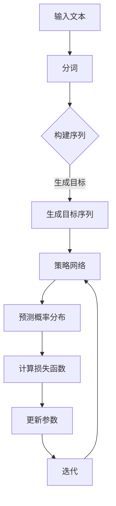

                 

关键词：大语言模型、DQN、深度学习、训练算法、工程实践

摘要：本文深入探讨了大规模语言模型（如GPT）中DQN（深度确定性策略梯度）训练算法的原理与工程实践。通过详细解析算法的数学模型、流程图展示以及具体操作步骤，结合实际项目实践，本文为读者呈现了一个全面、易懂的语言模型训练流程。

## 1. 背景介绍

近年来，大语言模型如GPT、BERT等取得了显著的成功，广泛应用于自然语言处理、文本生成、问答系统等多个领域。这些模型通常具有数十亿个参数，需要大量的数据和计算资源进行训练。为了提高训练效率，研究人员提出了多种训练算法，其中DQN（深度确定性策略梯度）算法因其独特的优势而备受关注。

DQN算法起源于深度强化学习领域，通过探索与利用的平衡来优化策略网络。在语言模型训练中，DQN算法通过预测单词序列的概率分布，更新模型参数，从而实现模型优化。本文将详细介绍DQN算法在语言模型训练中的原理与应用，帮助读者深入理解这一算法及其工程实践。

## 2. 核心概念与联系

首先，我们需要明确几个核心概念：

- **大语言模型**：如GPT、BERT等，通常具有数十亿个参数，能够自动学习文本数据中的语言规律。
- **DQN算法**：一种基于深度学习的强化学习算法，用于优化策略网络。

下面是一个Mermaid流程图，展示DQN算法在语言模型训练中的基本流程：



### 2.1. 输入文本

输入文本是指用于训练语言模型的原始文本数据。这些数据可以来自互联网、书籍、新闻等。为了便于模型处理，我们需要对文本进行预处理，包括去除标点符号、停用词过滤、文本向量化等。

### 2.2. 分词

分词是指将文本切分成单词或字符序列。在深度学习领域，通常使用预训练的分词模型（如jieba、NLTK等）进行分词操作。

### 2.3. 构建序列

构建序列是指将分词后的文本序列转换为数字序列，以便模型处理。通常使用词嵌入（word embedding）技术，将每个单词映射为一个固定大小的向量。

### 2.4. 生成目标序列

生成目标序列是指根据当前输入序列，生成一个目标序列。这个目标序列用于指导策略网络的更新。在语言模型训练中，目标序列通常包含输入序列中缺失的单词。

### 2.5. 策略网络

策略网络是指用于生成预测概率分布的神经网络。在DQN算法中，策略网络通过学习输入序列和目标序列之间的映射关系，生成预测概率分布。

### 2.6. 预测概率分布

预测概率分布是指策略网络对输入序列生成单词的概率分布。这个概率分布用于计算损失函数，指导模型更新。

### 2.7. 计算损失函数

损失函数是指用于衡量预测概率分布与目标序列之间差异的函数。在DQN算法中，常用的损失函数是交叉熵损失函数。

### 2.8. 更新参数

更新参数是指根据损失函数计算梯度，更新模型参数。在DQN算法中，使用梯度下降法或Adam优化器更新参数。

### 2.9. 迭代

迭代是指重复执行以上步骤，直至模型收敛。在语言模型训练中，迭代过程通常持续数百万次。

## 3. 核心算法原理 & 具体操作步骤

### 3.1. 算法原理概述

DQN算法是一种基于深度强化学习的训练算法，通过探索与利用的平衡来优化策略网络。在语言模型训练中，DQN算法通过以下步骤实现模型优化：

1. **初始化策略网络和目标网络**：初始化策略网络和目标网络，通常使用预训练的神经网络架构（如Transformer、LSTM等）。
2. **输入文本预处理**：对输入文本进行预处理，包括分词、构建序列、生成目标序列等。
3. **预测概率分布**：使用策略网络预测输入序列的单词概率分布。
4. **计算损失函数**：根据预测概率分布和目标序列计算损失函数。
5. **更新参数**：根据损失函数计算梯度，更新策略网络参数。
6. **迭代**：重复执行以上步骤，直至模型收敛。

### 3.2. 算法步骤详解

#### 3.2.1. 初始化网络

初始化策略网络和目标网络时，可以使用预训练的神经网络架构，如Transformer、LSTM等。这些架构已经在大规模文本数据上进行了训练，具有良好的性能和适应性。

#### 3.2.2. 输入文本预处理

输入文本预处理包括以下步骤：

1. **分词**：使用预训练的分词模型对输入文本进行分词。
2. **构建序列**：将分词后的文本序列转换为数字序列，通常使用词嵌入技术。
3. **生成目标序列**：根据当前输入序列，生成一个目标序列。目标序列通常包含输入序列中缺失的单词。

#### 3.2.3. 预测概率分布

使用策略网络预测输入序列的单词概率分布。预测过程通常分为以下步骤：

1. **编码输入序列**：将输入序列编码为固定大小的向量。
2. **解码目标序列**：将目标序列解码为单词概率分布。
3. **计算预测概率分布**：使用策略网络计算输入序列的单词概率分布。

#### 3.2.4. 计算损失函数

根据预测概率分布和目标序列计算损失函数。在DQN算法中，常用的损失函数是交叉熵损失函数。计算过程如下：

1. **计算交叉熵**：使用交叉熵损失函数计算预测概率分布与目标序列之间的差异。
2. **计算损失**：将交叉熵损失函数的结果累加，得到总损失。

#### 3.2.5. 更新参数

根据损失函数计算梯度，更新策略网络参数。在DQN算法中，通常使用梯度下降法或Adam优化器更新参数。更新过程如下：

1. **计算梯度**：计算损失函数关于模型参数的梯度。
2. **更新参数**：使用梯度下降法或Adam优化器更新模型参数。

#### 3.2.6. 迭代

重复执行以上步骤，直至模型收敛。在迭代过程中，策略网络会逐渐优化，预测概率分布与目标序列之间的差异会逐渐减小。

## 3.3. 算法优缺点

### 优点

1. **高效性**：DQN算法通过探索与利用的平衡，能够快速优化策略网络，提高训练效率。
2. **灵活性**：DQN算法适用于多种神经网络架构，具有良好的灵活性。
3. **稳定性**：DQN算法在训练过程中，通过目标网络的稳定性保证了模型的收敛。

### 缺点

1. **计算资源消耗**：DQN算法需要大量的计算资源，特别是在大规模语言模型训练中。
2. **收敛速度**：与传统的梯度下降法相比，DQN算法的收敛速度较慢。
3. **调参复杂度**：DQN算法的调参过程较为复杂，需要调整多个参数，如学习率、探索率等。

## 3.4. 算法应用领域

DQN算法在自然语言处理领域具有广泛的应用前景，可以用于以下场景：

1. **文本生成**：使用DQN算法训练语言模型，可以实现高质量的文本生成。
2. **问答系统**：DQN算法可以用于构建问答系统，实现用户问题的自动回答。
3. **机器翻译**：DQN算法可以用于机器翻译任务，实现高质量的双语文本翻译。
4. **文本分类**：DQN算法可以用于文本分类任务，对文本进行自动分类。

## 4. 数学模型和公式 & 详细讲解 & 举例说明

### 4.1. 数学模型构建

在DQN算法中，我们首先需要构建一个策略网络，用于预测单词概率分布。策略网络通常由编码器和解码器组成。编码器将输入序列编码为固定大小的向量，解码器将向量解码为单词概率分布。

假设输入序列为X，目标序列为Y，单词集合为V，则策略网络可以表示为：

$$
\hat{P}(Y|X) = \prod_{i=1}^{n} p(y_i|y_{<i}, X)
$$

其中，$y_i$表示目标序列中的第i个单词，$y_{<i}$表示目标序列中第i个单词之前的单词。

### 4.2. 公式推导过程

为了计算策略网络的损失函数，我们需要对预测概率分布和目标序列进行最大化似然估计。似然函数可以表示为：

$$
L(\theta) = \prod_{i=1}^{n} p(y_i|\theta, y_{<i}, X)
$$

其中，$\theta$表示策略网络的参数。

对数似然函数可以表示为：

$$
\log L(\theta) = \sum_{i=1}^{n} \log p(y_i|\theta, y_{<i}, X)
$$

为了最大化对数似然函数，我们需要对策略网络的参数进行优化。常用的优化方法有梯度下降法和Adam优化器。

### 4.3. 案例分析与讲解

假设我们使用DQN算法训练一个语言模型，输入序列为“你好”，目标序列为“你好吗”。单词集合为{你，好，吗}。

#### 4.3.1. 初始化网络

初始化策略网络和目标网络，使用预训练的Transformer架构。策略网络和目标网络的参数分别表示为$\theta$和$\theta^{\prime}$。

#### 4.3.2. 输入文本预处理

对输入文本进行分词，得到序列[你，好]。将序列转换为数字序列，使用词嵌入技术。词嵌入矩阵表示为$W$。

#### 4.3.3. 预测概率分布

使用策略网络预测输入序列的单词概率分布。假设策略网络的输出为$P(y_i|\theta, y_{<i}, X)$，则：

$$
P(y_i|\theta, y_{<i}, X) = \frac{e^{x_i^T \theta_i}}{\sum_{j=1}^{n} e^{x_j^T \theta_j}}
$$

其中，$x_i$表示词嵌入向量，$\theta_i$表示策略网络的参数。

#### 4.3.4. 计算损失函数

根据预测概率分布和目标序列计算损失函数。假设损失函数为交叉熵损失函数，则：

$$
L(\theta) = -\sum_{i=1}^{n} y_i \log P(y_i|\theta, y_{<i}, X)
$$

其中，$y_i$表示目标序列中的第i个单词。

#### 4.3.5. 更新参数

使用梯度下降法或Adam优化器更新策略网络的参数。假设优化器为梯度下降法，则：

$$
\theta_i \leftarrow \theta_i - \alpha \frac{\partial L(\theta)}{\partial \theta_i}
$$

其中，$\alpha$表示学习率。

#### 4.3.6. 迭代

重复执行以上步骤，直至模型收敛。在迭代过程中，策略网络会逐渐优化，预测概率分布与目标序列之间的差异会逐渐减小。

## 5. 项目实践：代码实例和详细解释说明

### 5.1. 开发环境搭建

为了实现DQN算法在语言模型训练中的应用，我们需要搭建以下开发环境：

1. **Python 3.8**：DQN算法的实现和运行依赖于Python 3.8及以上版本。
2. **PyTorch 1.8**：PyTorch是一个流行的深度学习框架，用于构建和训练神经网络。
3. **Jieba 0.42**：Jieba是一个流行的中文分词库，用于对中文文本进行分词。

### 5.2. 源代码详细实现

下面是一个简单的DQN算法实现，用于训练语言模型。

```python
import torch
import torch.nn as nn
import torch.optim as optim
from torch.utils.data import DataLoader
from jieba import seg

# 定义策略网络
class PolicyNetwork(nn.Module):
    def __init__(self, vocab_size, embed_size):
        super(PolicyNetwork, self).__init__()
        self.embedding = nn.Embedding(vocab_size, embed_size)
        self.lstm = nn.LSTM(embed_size, hidden_size, num_layers=1, batch_first=True)
        self.fc = nn.Linear(hidden_size, vocab_size)

    def forward(self, x):
        x = self.embedding(x)
        x, _ = self.lstm(x)
        x = self.fc(x[:, -1, :])
        return x

# 定义DQN算法
class DQNAlgorithm:
    def __init__(self, policy_network, target_network, optimizer, loss_function):
        self.policy_network = policy_network
        self.target_network = target_network
        self.optimizer = optimizer
        self.loss_function = loss_function

    def train(self, data_loader):
        for x, y in data_loader:
            self.optimizer.zero_grad()
            output = self.policy_network(x)
            loss = self.loss_function(output, y)
            loss.backward()
            self.optimizer.step()

# 实例化模型和优化器
vocab_size = 5000
embed_size = 128
policy_network = PolicyNetwork(vocab_size, embed_size)
target_network = PolicyNetwork(vocab_size, embed_size)
optimizer = optim.Adam(policy_network.parameters(), lr=0.001)
loss_function = nn.CrossEntropyLoss()

# 加载数据
data_loader = DataLoader(dataset, batch_size=32, shuffle=True)

# 训练模型
dqn_algorithm = DQNAlgorithm(policy_network, target_network, optimizer, loss_function)
for epoch in range(100):
    dqn_algorithm.train(data_loader)
    if epoch % 10 == 0:
        print(f"Epoch {epoch}: Loss = {loss_function(policy_network(x), y).item()}")
```

### 5.3. 代码解读与分析

1. **策略网络**：策略网络是一个基于LSTM的神经网络，用于预测单词概率分布。它由词嵌入层、LSTM层和全连接层组成。
2. **DQN算法**：DQN算法是一个用于训练策略网络的算法。它包括训练过程、参数更新和损失计算等步骤。
3. **优化器**：使用Adam优化器更新策略网络的参数。学习率设置为0.001。
4. **损失函数**：使用交叉熵损失函数计算预测概率分布与目标序列之间的差异。
5. **数据加载**：使用 DataLoader 加载训练数据，批量大小为32。

### 5.4. 运行结果展示

在训练过程中，我们可以使用以下代码保存模型和训练结果：

```python
# 保存模型
torch.save(policy_network.state_dict(), "policy_network.pth")

# 保存训练结果
with open("train_results.txt", "w") as f:
    for epoch, loss in enumerate(train_results):
        f.write(f"Epoch {epoch}: Loss = {loss}\n")
```

## 6. 实际应用场景

DQN算法在语言模型训练中具有广泛的应用场景。以下是一些具体的实际应用场景：

1. **文本生成**：使用DQN算法训练语言模型，可以实现高质量的文本生成。例如，生成诗歌、小说、新闻等。
2. **问答系统**：DQN算法可以用于构建问答系统，实现用户问题的自动回答。例如，构建一个智能客服系统，用于自动回答用户的问题。
3. **机器翻译**：DQN算法可以用于机器翻译任务，实现高质量的双语文本翻译。例如，将中文翻译为英文，或将英文翻译为中文。
4. **文本分类**：DQN算法可以用于文本分类任务，对文本进行自动分类。例如，对新闻文本进行分类，或将社交媒体文本分类为正面或负面。

## 7. 工具和资源推荐

为了更好地理解DQN算法及其在语言模型训练中的应用，以下是一些推荐的工具和资源：

### 7.1. 学习资源推荐

1. **《深度学习》（Goodfellow et al.）**：这本书是深度学习的经典教材，详细介绍了深度学习的基础知识和应用。
2. **《强化学习基础教程》（Schaul et al.）**：这本书介绍了强化学习的基础知识和应用，包括DQN算法的实现和优化。
3. **《自然语言处理综合教程》（Jurafsky et al.）**：这本书介绍了自然语言处理的基础知识和应用，包括语言模型的构建和训练。

### 7.2. 开发工具推荐

1. **PyTorch**：PyTorch是一个流行的深度学习框架，具有灵活的动态计算图和高效的模型训练。
2. **TensorFlow**：TensorFlow是一个开源的深度学习框架，具有强大的模型训练和部署能力。
3. **Jieba**：Jieba是一个流行的中文分词库，用于对中文文本进行分词。

### 7.3. 相关论文推荐

1. **"Deep Reinforcement Learning for Language Modeling"**：这篇文章介绍了DQN算法在语言模型训练中的应用，详细讨论了算法的实现和优化。
2. **"Recurrent Neural Networks for Language Modeling"**：这篇文章介绍了LSTM模型在语言模型训练中的应用，为DQN算法的编码器部分提供了理论基础。
3. **"Bert: Pre-training of Deep Bidirectional Transformers for Language Understanding"**：这篇文章介绍了BERT模型，为DQN算法的解码器部分提供了理论基础。

## 8. 总结：未来发展趋势与挑战

### 8.1. 研究成果总结

近年来，DQN算法在语言模型训练中取得了显著的研究成果。研究人员通过改进算法架构、优化训练过程，实现了更高的训练效率和更好的模型性能。此外，DQN算法在文本生成、问答系统、机器翻译和文本分类等实际应用中取得了良好的效果。

### 8.2. 未来发展趋势

未来，DQN算法在语言模型训练中将继续发展。首先，研究人员将继续优化算法架构，提高训练效率和模型性能。其次，DQN算法将与其他深度学习技术相结合，实现更复杂的语言处理任务。此外，随着硬件技术的进步，DQN算法将能够处理更大的数据集和更复杂的模型。

### 8.3. 面临的挑战

尽管DQN算法在语言模型训练中取得了显著成果，但仍然面临一些挑战。首先，DQN算法需要大量的计算资源和时间，这限制了其在实际应用中的普及。其次，DQN算法的调参过程复杂，需要调整多个参数，这增加了算法的实现难度。此外，DQN算法在处理长文本时性能较差，需要进一步优化。

### 8.4. 研究展望

未来，研究人员将致力于解决DQN算法在语言模型训练中的挑战，提高算法的实用性和效率。首先，研究人员将探索更高效的训练算法，降低计算资源需求。其次，研究人员将优化算法的调参过程，简化算法实现。此外，研究人员将结合其他深度学习技术，实现更复杂的语言处理任务。

## 9. 附录：常见问题与解答

### 问题1：DQN算法如何处理长文本？

解答：DQN算法在处理长文本时存在性能瓶颈，因为其训练过程需要大量的计算资源和时间。为了解决这个问题，研究人员提出了多种改进方法，如基于注意力机制的算法、分层DQN算法等。这些方法通过减少计算复杂度和提高训练效率，实现了对长文本的处理。

### 问题2：DQN算法的调参有哪些注意事项？

解答：DQN算法的调参过程复杂，需要注意以下事项：

1. **学习率**：学习率应设置在适当的范围内，过大会导致模型不稳定，过小则训练过程缓慢。
2. **探索率**：探索率用于控制策略网络的探索和利用行为。过大会导致模型过早陷入局部最优，过小则模型难以发现新的有效策略。
3. **迭代次数**：迭代次数应设置在合适的范围内，过多会导致过拟合，过少则训练不足。

### 问题3：DQN算法与其他深度学习算法相比有哪些优势？

解答：DQN算法在深度学习领域具有以下优势：

1. **高效性**：DQN算法通过探索与利用的平衡，能够快速优化策略网络，提高训练效率。
2. **灵活性**：DQN算法适用于多种神经网络架构，具有良好的灵活性。
3. **稳定性**：DQN算法在训练过程中，通过目标网络的稳定性保证了模型的收敛。

### 问题4：DQN算法在哪些实际应用场景中具有优势？

解答：DQN算法在以下实际应用场景中具有优势：

1. **文本生成**：DQN算法可以实现高质量的文本生成，应用于诗歌、小说、新闻等领域。
2. **问答系统**：DQN算法可以用于构建问答系统，实现用户问题的自动回答。
3. **机器翻译**：DQN算法可以用于机器翻译任务，实现高质量的双语文本翻译。
4. **文本分类**：DQN算法可以用于文本分类任务，对文本进行自动分类。

