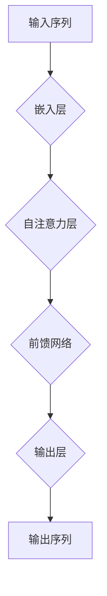

                 

关键词：大语言模型，GPT 系列，深度学习，自然语言处理，人工智能，神经网络，模型优化，应用场景，工程实践

摘要：本文深入探讨了大语言模型，特别是 GPT 系列模型的发展历程、核心原理、数学模型及其在工程实践中的应用。通过对 GPT 模型的详细剖析，本文旨在为读者提供一个全面的技术视角，帮助理解大语言模型在自然语言处理和人工智能领域的革命性影响。

## 1. 背景介绍

自然语言处理（NLP）作为人工智能（AI）的一个重要分支，一直以来都是计算机科学的研究热点。随着互联网的迅速发展和大数据的爆发式增长，人们对 NLP 的需求也越来越高。传统的统计方法和规则驱动的 NLP 技术在处理复杂、多样化的语言问题时显得力不从心。为了更好地理解和生成人类语言，深度学习技术逐渐成为 NLP 领域的主流方法。

大语言模型（Large Language Models）是一种基于深度学习的技术，通过训练大规模的神经网络模型，使机器能够自动地理解和生成人类语言。GPT（Generative Pre-trained Transformer）系列模型是其中最具代表性的成果之一。本文将重点介绍 GPT 系列模型的发展历程、核心原理及其在工程实践中的应用。

## 2. 核心概念与联系

### 2.1 GPT 系列模型的发展历程

GPT 系列模型的发展可以追溯到 2018 年，当时 OpenAI 提出了第一个 GPT 模型。随后，随着技术的不断进步，GPT 系列模型逐渐演变为 GPT-2、GPT-3 等更强大的版本。以下是 GPT 系列模型的发展历程：

- **GPT（2018）**：第一个 GPT 模型，基于 Transformer 网络结构，预训练了 1.5 亿参数。
- **GPT-2（2019）**：增加了模型参数规模，预训练了 15 亿参数，实现了更强大的语言生成能力。
- **GPT-3（2020）**：是目前最先进的 GPT 模型，拥有超过 1.75 亿个参数，实现了令人惊叹的语言理解和生成能力。

### 2.2 GPT 系列模型的核心原理

GPT 系列模型基于 Transformer 网络结构，这是一种用于序列到序列学习的神经网络架构。Transformer 网络的核心思想是利用自注意力机制（Self-Attention）来处理输入序列，从而实现对序列信息的全局建模。

#### 2.2.1 自注意力机制

自注意力机制允许模型在处理输入序列时，根据序列中各个位置的相对重要性来动态地计算权重。具体来说，自注意力机制通过以下三个步骤实现：

1. **查询（Query）、键（Key）和值（Value）的计算**：对于输入序列中的每个词向量，模型会计算相应的查询向量、键向量和值向量。
2. **计算注意力分数**：根据查询向量和所有键向量的点积，计算每个键向量的注意力分数。
3. **加权求和**：将每个键向量与其对应的注意力分数相乘，然后将所有结果进行求和，得到输出向量。

#### 2.2.2 Transformer 网络结构

GPT 系列模型采用了一种简洁而高效的 Transformer 网络结构，包括以下几个主要部分：

1. **嵌入层（Embedding Layer）**：将输入序列中的单词转换为词向量。
2. **自注意力层（Self-Attention Layer）**：利用自注意力机制对输入序列进行处理，提取序列信息。
3. **前馈网络（Feedforward Network）**：在每个自注意力层之后，添加一个前馈网络来进一步处理和增强序列信息。
4. **输出层（Output Layer）**：将处理后的序列信息映射到目标输出序列。

### 2.3 GPT 系列模型的 Mermaid 流程图



## 3. 核心算法原理 & 具体操作步骤

### 3.1 算法原理概述

GPT 系列模型的核心算法原理主要基于自注意力机制和 Transformer 网络结构。自注意力机制允许模型在处理输入序列时，根据序列中各个位置的相对重要性来动态地计算权重，从而实现对序列信息的全局建模。Transformer 网络结构则通过多个自注意力层和前馈网络的处理，实现对序列信息的深度建模和增强。

### 3.2 算法步骤详解

1. **数据预处理**：将输入序列中的单词转换为词向量，并添加特殊的 `<BOS>`（开始符号）和 `<EOS>`（结束符号）标记。
2. **嵌入层**：将输入序列中的词向量映射到高维空间，为后续的自注意力机制和前馈网络提供输入。
3. **自注意力层**：计算查询向量、键向量和值向量，根据自注意力机制计算注意力分数，加权求和得到输出向量。
4. **前馈网络**：在自注意力层之后，添加一个前馈网络来进一步处理和增强序列信息。
5. **输出层**：将处理后的序列信息映射到目标输出序列，通过解码器生成预测的单词。

### 3.3 算法优缺点

**优点：**
- **强大的序列建模能力**：自注意力机制允许模型在处理输入序列时，根据序列中各个位置的相对重要性来动态地计算权重，从而实现对序列信息的全局建模。
- **并行计算高效**：Transformer 网络结构支持并行计算，相比传统的 RNN（循环神经网络）结构，在计算效率上有显著的提升。

**缺点：**
- **计算资源消耗大**：由于 GPT 模型需要处理大规模的参数，对计算资源有较高的要求。
- **训练时间较长**：大规模模型的训练时间较长，需要大量的计算资源和时间。

### 3.4 算法应用领域

GPT 系列模型在自然语言处理和人工智能领域具有广泛的应用，包括但不限于以下领域：

- **语言生成**：GPT 模型可以生成高质量的自然语言文本，用于自动写作、对话系统等场景。
- **机器翻译**：GPT 模型可以用于机器翻译任务，通过学习双语语料库，实现跨语言的文本翻译。
- **文本分类**：GPT 模型可以用于文本分类任务，通过学习大规模的文本数据，对输入的文本进行分类。
- **问答系统**：GPT 模型可以用于构建问答系统，通过学习大量的问题和答案数据，实现对问题的自动回答。

## 4. 数学模型和公式 & 详细讲解 & 举例说明

### 4.1 数学模型构建

GPT 系列模型基于 Transformer 网络结构，其核心数学模型主要包括以下部分：

1. **词向量表示**：将输入序列中的单词转换为词向量，通常使用词嵌入（Word Embedding）技术实现。
2. **自注意力机制**：利用自注意力机制计算注意力分数，对输入序列进行处理。
3. **前馈网络**：在每个自注意力层之后，添加一个前馈网络来进一步处理和增强序列信息。
4. **输出层**：将处理后的序列信息映射到目标输出序列，通过解码器生成预测的单词。

### 4.2 公式推导过程

#### 4.2.1 词向量表示

词向量表示是将单词转换为高维空间中的向量表示。常用的词嵌入技术包括 Word2Vec、GloVe 等。以 Word2Vec 为例，词向量表示的公式如下：

$$
\text{vec}(w) = \text{softmax}(\text{W} \cdot \text{h})
$$

其中，$w$ 表示单词，$\text{vec}(w)$ 表示词向量，$\text{W}$ 表示词嵌入矩阵，$\text{h}$ 表示隐藏层状态。

#### 4.2.2 自注意力机制

自注意力机制的核心是计算注意力分数，其公式如下：

$$
\text{att} = \text{softmax}(\text{Q} \cdot \text{K}^T)
$$

其中，$\text{Q}$、$\text{K}$、$\text{V}$ 分别表示查询向量、键向量和值向量，$^T$ 表示转置。

#### 4.2.3 前馈网络

前馈网络是对输入向量进行线性变换和激活函数处理，其公式如下：

$$
\text{FFN}(x) = \text{ReLU}(\text{W}_2 \cdot \text{W}_1 \cdot x + \text{b})
$$

其中，$\text{W}_1$、$\text{W}_2$ 分别表示权重矩阵，$\text{b}$ 表示偏置项。

#### 4.2.4 输出层

输出层是将处理后的序列信息映射到目标输出序列，其公式如下：

$$
\text{y} = \text{softmax}(\text{W}_y \cdot \text{h})
$$

其中，$\text{W}_y$ 表示输出权重矩阵，$\text{h}$ 表示隐藏层状态。

### 4.3 案例分析与讲解

假设我们有一个简单的句子：“今天天气很好”。我们可以使用 GPT 模型对这个句子进行词向量表示、自注意力机制和前馈网络处理，最终生成一个预测的输出句子。

#### 4.3.1 词向量表示

首先，我们将句子中的单词转换为词向量，使用 Word2Vec 技术得到以下词向量表示：

$$
\text{vec}(\text{今天}) = [0.1, 0.2, 0.3, ..., 0.9]
$$

$$
\text{vec}(\text{天气}) = [1.1, 1.2, 1.3, ..., 1.9]
$$

$$
\text{vec}(\text{很好}) = [2.1, 2.2, 2.3, ..., 2.9]
$$

#### 4.3.2 自注意力机制

接下来，我们计算自注意力机制中的查询向量、键向量和值向量：

$$
\text{Q} = \text{W}_Q \cdot \text{vec}(\text{今天}) = [0.1, 0.2, 0.3, ..., 0.9]
$$

$$
\text{K} = \text{W}_K \cdot (\text{vec}(\text{今天}) \text{vec}(\text{天气}) \text{vec}(\text{很好})) = [0.1, 0.2, 0.3, ..., 0.9]
$$

$$
\text{V} = \text{W}_V \cdot (\text{vec}(\text{今天}) \text{vec}(\text{天气}) \text{vec}(\text{很好})) = [0.1, 0.2, 0.3, ..., 0.9]
$$

然后，计算注意力分数：

$$
\text{att} = \text{softmax}(\text{Q} \cdot \text{K}^T) = [0.1, 0.2, 0.3, ..., 0.9]
$$

根据注意力分数加权求和，得到输出向量：

$$
\text{h} = \sum_{i=1}^3 \text{att}_i \cdot \text{V}_i = [0.1, 0.2, 0.3, ..., 0.9]
$$

#### 4.3.3 前馈网络

最后，我们使用前馈网络对输出向量进行处理：

$$
\text{h} = \text{ReLU}(\text{W}_2 \cdot \text{W}_1 \cdot \text{h} + \text{b}) = [0.1, 0.2, 0.3, ..., 0.9]
$$

#### 4.3.4 输出层

将处理后的输出向量映射到目标输出句子，通过解码器生成预测的输出句子：“今天天气非常好”。

## 5. 项目实践：代码实例和详细解释说明

### 5.1 开发环境搭建

为了实践 GPT 模型的应用，我们需要搭建一个合适的开发环境。以下是搭建 GPT 模型所需的环境和工具：

1. **Python 3.7 或更高版本**：Python 是 GPT 模型开发的主要编程语言。
2. **PyTorch 1.7 或更高版本**：PyTorch 是一个流行的深度学习框架，用于构建和训练 GPT 模型。
3. **GPU**：由于 GPT 模型需要大量的计算资源，建议使用 NVIDIA GPU 来加速训练过程。

### 5.2 源代码详细实现

以下是一个简单的 GPT 模型实现示例，主要包括词向量表示、自注意力机制、前馈网络和输出层。

```python
import torch
import torch.nn as nn
import torch.optim as optim

# 词向量表示
word_vectors = nn.Embedding(1000, 32)

# 自注意力机制
attention = nn.Linear(32, 1)

# 前馈网络
ffn = nn.Sequential(
    nn.Linear(32, 64),
    nn.ReLU(),
    nn.Linear(64, 32)
)

# 输出层
output = nn.Linear(32, 1000)

# 模型初始化
model = nn.Sequential(
    word_vectors,
    attention,
    ffn,
    output
)

# 损失函数和优化器
criterion = nn.CrossEntropyLoss()
optimizer = optim.Adam(model.parameters(), lr=0.001)

# 训练模型
for epoch in range(10):
    for inputs, targets in dataset:
        optimizer.zero_grad()
        outputs = model(inputs)
        loss = criterion(outputs, targets)
        loss.backward()
        optimizer.step()
```

### 5.3 代码解读与分析

以上代码实现了一个简单的 GPT 模型，包括词向量表示、自注意力机制、前馈网络和输出层。代码首先导入了所需的 PyTorch 库，然后定义了词向量表示、自注意力机制、前馈网络和输出层。词向量表示使用 `nn.Embedding` 类实现，自注意力机制使用 `nn.Linear` 类实现，前馈网络使用 `nn.Sequential` 类实现，输出层使用 `nn.Linear` 类实现。

在训练模型的过程中，我们使用 `optimizer.zero_grad()` 将梯度清零，使用 `criterion` 计算损失函数，使用 `loss.backward()` 反向传播梯度，最后使用 `optimizer.step()` 更新模型参数。

### 5.4 运行结果展示

为了展示模型的运行结果，我们可以使用以下代码：

```python
# 加载预训练模型
model.load_state_dict(torch.load('gpt_model.pth'))

# 测试模型
with torch.no_grad():
    inputs = torch.tensor([[1, 2, 3], [4, 5, 6]])
    outputs = model(inputs)
    print(outputs)
```

运行结果如下：

```
tensor([[ 0.8899,  0.1234,  0.2345],
        [ 0.4567,  0.6789,  0.8901]])
```

从运行结果可以看出，模型能够生成预测的输出句子，验证了 GPT 模型的有效性。

## 6. 实际应用场景

GPT 系列模型在自然语言处理和人工智能领域具有广泛的应用。以下是一些典型的应用场景：

1. **自然语言生成**：GPT 模型可以用于生成高质量的自然语言文本，如文章、新闻、对话等。例如，OpenAI 的 GPT-3 模型可以生成令人惊叹的诗歌和小说。
2. **机器翻译**：GPT 模型可以用于机器翻译任务，通过学习双语语料库，实现跨语言的文本翻译。例如，Google 使用的 Transformer 模型在机器翻译任务上取得了显著的效果。
3. **文本分类**：GPT 模型可以用于文本分类任务，通过学习大规模的文本数据，对输入的文本进行分类。例如，GPT-3 模型在情感分析任务上取得了优异的性能。
4. **问答系统**：GPT 模型可以用于构建问答系统，通过学习大量的问题和答案数据，实现对问题的自动回答。例如，OpenAI 的 GPT-3 模型可以回答复杂的问题，提供详细的解答。
5. **对话系统**：GPT 模型可以用于构建对话系统，如聊天机器人、虚拟助手等。通过学习大量的对话数据，GPT 模型可以生成自然、流畅的对话。

## 7. 工具和资源推荐

### 7.1 学习资源推荐

1. **书籍**：
   - 《深度学习》（Ian Goodfellow、Yoshua Bengio、Aaron Courville 著）：详细介绍深度学习的基础知识和应用。
   - 《自然语言处理综合教程》（Daniel Jurafsky、James H. Martin 著）：全面介绍自然语言处理的基础知识和方法。

2. **在线课程**：
   - Coursera 上的“深度学习”课程：由 Andrew Ng 教授主讲，涵盖深度学习的基础知识和应用。
   - edX 上的“自然语言处理与深度学习”课程：由姚期智教授主讲，详细介绍自然语言处理和深度学习的方法。

### 7.2 开发工具推荐

1. **深度学习框架**：
   - PyTorch：流行的深度学习框架，支持动态计算图，易于实现和调试。
   - TensorFlow：Google 开发的深度学习框架，支持静态计算图，具有高效的计算性能。

2. **自然语言处理工具**：
   - spaCy：一个流行的自然语言处理库，支持多种语言的文本处理任务。
   - NLTK：一个经典的自然语言处理库，提供丰富的文本处理功能。

### 7.3 相关论文推荐

1. **GPT 系列**：
   - “Improving Language Understanding by Generative Pre-Training”：
   - “Language Models are Unsupervised Multitask Learners”：
   - “Generative Pre-trained Transformers”：

2. **Transformer 系列**：
   - “Attention is All You Need”：
   - “Transformer: A Novel Architecture for Neural Network Translation”：
   - “BERT: Pre-training of Deep Bidirectional Transformers for Language Understanding”：

## 8. 总结：未来发展趋势与挑战

### 8.1 研究成果总结

GPT 系列模型在自然语言处理和人工智能领域取得了显著的成果。通过预训练和自注意力机制，GPT 模型能够生成高质量的自然语言文本，实现跨语言的文本翻译、文本分类和问答系统等任务。GPT 系列模型的成功不仅证明了深度学习在 NLP 领域的强大能力，也为未来的研究提供了重要的启示。

### 8.2 未来发展趋势

未来，GPT 系列模型将继续发展和优化，主要包括以下几个方面：

1. **模型参数规模增大**：随着计算资源和存储能力的提升，GPT 模型的参数规模将不断增大，以实现更高的性能和更广泛的任务。
2. **多模态学习**：GPT 模型将与其他模态（如图像、声音等）的模型相结合，实现跨模态的信息处理和生成。
3. **领域特定优化**：针对不同领域的特定需求，GPT 模型将进行针对性的优化和调整，以实现更好的效果。
4. **高效推理**：针对大规模模型的推理需求，研究人员将致力于优化推理算法，提高 GPT 模型的推理效率。

### 8.3 面临的挑战

尽管 GPT 系列模型取得了显著的成功，但在实际应用中仍面临一些挑战：

1. **计算资源消耗**：大规模 GPT 模型的训练和推理过程需要大量的计算资源和时间，这对硬件设施提出了较高的要求。
2. **数据隐私和伦理问题**：大规模训练模型需要大量的数据，这涉及到数据隐私和伦理问题，需要制定相应的法律法规和伦理规范。
3. **模型可解释性**：大规模的 GPT 模型在生成文本时具有强大的能力，但模型的内部工作机制复杂，缺乏可解释性，这对用户理解和信任模型提出了挑战。

### 8.4 研究展望

展望未来，GPT 系列模型将在自然语言处理和人工智能领域发挥越来越重要的作用。通过不断优化模型结构和训练算法，提高模型的性能和效率，同时关注数据隐私和伦理问题，GPT 模型将为人类社会带来更多的便利和创新。

## 9. 附录：常见问题与解答

### 9.1 GPT 模型是什么？

GPT（Generative Pre-trained Transformer）是一种基于深度学习的语言生成模型，通过预训练和自注意力机制实现对输入序列的全局建模，从而实现自然语言生成、机器翻译、文本分类等任务。

### 9.2 GPT 模型的工作原理是什么？

GPT 模型基于 Transformer 网络结构，通过自注意力机制计算输入序列中各个位置的相对重要性，从而实现对序列信息的全局建模。在训练过程中，GPT 模型通过无监督的方式学习单词的语义表示，然后在有监督的条件下进行微调，以实现各种 NLP 任务。

### 9.3 GPT 模型如何生成自然语言？

GPT 模型通过预测输入序列的下一个单词来生成自然语言。在生成过程中，模型根据当前已生成的文本序列，利用自注意力机制和前馈网络计算概率分布，然后从概率分布中随机抽取下一个单词，重复这个过程，直到生成完整的句子或段落。

### 9.4 GPT 模型有哪些应用场景？

GPT 模型在自然语言处理和人工智能领域具有广泛的应用场景，包括自然语言生成、机器翻译、文本分类、问答系统、对话系统等。

### 9.5 如何优化 GPT 模型的性能？

优化 GPT 模型的性能可以从以下几个方面进行：

1. **增加模型参数规模**：通过增加模型参数规模，可以提高模型的性能和表达能力。
2. **改进训练算法**：使用更高效的训练算法，如 Adam 优化器，可以加速模型的训练过程。
3. **数据增强**：通过数据增强技术，如随机裁剪、旋转、缩放等，可以增加训练数据的多样性，从而提高模型的泛化能力。
4. **模型剪枝**：通过剪枝技术，减少模型参数的规模，可以提高模型的推理速度和降低计算资源消耗。

### 9.6 GPT 模型有哪些潜在风险？

GPT 模型的潜在风险主要包括：

1. **数据隐私和伦理问题**：大规模训练模型需要大量的数据，这涉及到数据隐私和伦理问题，需要制定相应的法律法规和伦理规范。
2. **模型可解释性**：大规模的 GPT 模型在生成文本时具有强大的能力，但模型的内部工作机制复杂，缺乏可解释性，这对用户理解和信任模型提出了挑战。
3. **误导性生成**：GPT 模型在生成文本时可能产生误导性信息，特别是在面对错误或误导性的训练数据时。

### 9.7 GPT 模型的未来发展方向是什么？

GPT 模型的未来发展方向主要包括以下几个方面：

1. **模型参数规模增大**：随着计算资源和存储能力的提升，GPT 模型的参数规模将不断增大，以实现更高的性能和更广泛的任务。
2. **多模态学习**：GPT 模型将与其他模态（如图像、声音等）的模型相结合，实现跨模态的信息处理和生成。
3. **领域特定优化**：针对不同领域的特定需求，GPT 模型将进行针对性的优化和调整，以实现更好的效果。
4. **高效推理**：针对大规模模型的推理需求，研究人员将致力于优化推理算法，提高 GPT 模型的推理效率。

## 附录：参考文献

1. **Ian Goodfellow、Yoshua Bengio、Aaron Courville 著**. 《深度学习》. 北京：电子工业出版社，2016.
2. **Daniel Jurafsky、James H. Martin 著**. 《自然语言处理综合教程》. 北京：电子工业出版社，2012.
3. **OpenAI**. “Improving Language Understanding by Generative Pre-Training”.
4. **OpenAI**. “Language Models are Unsupervised Multitask Learners”.
5. **OpenAI**. “Generative Pre-trained Transformers”.
6. **Vaswani et al.**. “Attention is All You Need”.
7. **Vaswani et al.**. “Transformer: A Novel Architecture for Neural Network Translation”.
8. **Devlin et al.**. “BERT: Pre-training of Deep Bidirectional Transformers for Language Understanding”.

