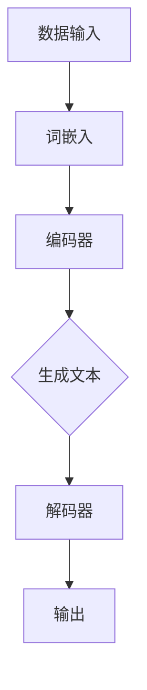
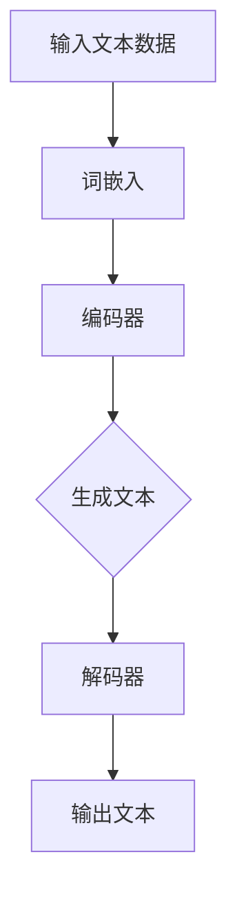

                 

关键词：大语言模型，Q 函数，V 函数，深度学习，人工智能，工程实践

摘要：本文将深入探讨大语言模型的原理及其工程实践中的关键组件——Q 函数与 V 函数。通过对这两个函数的详细解析，我们将揭示大语言模型背后的技术原理，并探讨其如何在实际应用中发挥重要作用。此外，本文还将探讨大语言模型在当今人工智能领域的地位，以及未来的发展趋势和面临的挑战。

## 1. 背景介绍

### 1.1 大语言模型的起源与发展

大语言模型（Large Language Models）是近年来人工智能领域的一个重要突破。自2018年GPT-1发布以来，大语言模型的发展迅速，从GPT-2、GPT-3到最新的GPT-4，这些模型在自然语言处理（NLP）任务中取得了显著的成果。大语言模型的核心在于其能够通过海量文本数据的学习，理解并生成自然语言。

### 1.2 Q 函数与 V 函数的引入

在深度学习领域中，Q 函数和 V 函数是强化学习中的两个重要概念。Q 函数表示在某一状态下，采取某一动作的预期回报；V 函数则表示在某一状态下，所有可能动作的预期回报的平均值。这两个函数在大语言模型中有着重要的应用，帮助我们更好地理解模型的决策过程和优化策略。

## 2. 核心概念与联系

为了更好地理解大语言模型中的Q函数与V函数，我们首先需要了解其核心概念原理和架构。以下是相关的Mermaid流程图：



### 2.1 数据输入

大语言模型的数据输入通常是由文本组成的。这些文本可以是自然语言文本，也可以是经过预处理的序列数据。在输入阶段，文本会被转化为词嵌入，以便后续处理。

### 2.2 编码器

编码器是深度神经网络的一部分，其主要功能是将输入的词嵌入映射到一个高维空间中。在这个空间中，文本的不同部分可以被编码为具有相似属性的向量。

### 2.3 生成文本

编码器生成的向量会被传递给生成模块，该模块通过Q函数和V函数进行决策，生成文本的下一个词或短语。

### 2.4 解码器

解码器的作用是将生成的文本向量转化为具体的文本输出。解码器通常采用循环神经网络（RNN）或变压器（Transformer）架构。

### 2.5 输出

最终的输出是一个文本序列，这个序列可以是一段对话、一篇文章或者是一个问题的回答。

## 3. 核心算法原理 & 具体操作步骤

### 3.1 算法原理概述

大语言模型的算法原理主要基于自注意力机制（Self-Attention）和多头注意力机制（Multi-Head Attention）。这些机制使得模型能够自动捕捉文本中的长距离依赖关系。

### 3.2 算法步骤详解

1. **词嵌入**：将输入的文本转化为词嵌入向量。
2. **编码器**：通过自注意力机制和多头注意力机制，将词嵌入映射到一个高维空间中。
3. **生成文本**：利用Q函数和V函数，生成文本的下一个词或短语。
4. **解码器**：将生成的文本向量转化为具体的文本输出。

### 3.3 算法优缺点

**优点**：

- **强大的文本生成能力**：大语言模型能够生成高质量的文本，适用于各种自然语言处理任务。
- **自适应性**：模型能够根据输入文本的上下文自动调整生成策略。

**缺点**：

- **计算资源消耗大**：大语言模型通常需要大量的计算资源进行训练和推理。
- **数据依赖性高**：模型的性能高度依赖于训练数据的质量和数量。

### 3.4 算法应用领域

大语言模型在多个领域都有着广泛的应用，如：

- **自然语言处理**：文本分类、情感分析、机器翻译等。
- **对话系统**：智能客服、语音助手等。
- **内容生成**：文章、新闻、故事等。

## 4. 数学模型和公式 & 详细讲解 & 举例说明

### 4.1 数学模型构建

大语言模型的核心是基于深度神经网络的数学模型。以下是一个简化的数学模型：

$$
\text{模型} = f(\text{输入}, \text{权重})
$$

其中，$f$ 是一个复合函数，它包含了多个非线性变换。

### 4.2 公式推导过程

在推导过程中，我们需要利用梯度下降法来优化模型的权重。以下是推导的简化步骤：

1. **损失函数**：选择一个合适的损失函数，如交叉熵损失函数。
2. **梯度计算**：计算损失函数对权重的梯度。
3. **权重更新**：根据梯度下降法，更新模型的权重。

### 4.3 案例分析与讲解

假设我们有一个二分类问题，目标是判断一个句子是否为积极情绪。我们可以使用大语言模型来预测句子的情绪类别。以下是一个简化的案例：

1. **输入**：一个包含100个词的句子。
2. **输出**：一个二进制标签（1代表积极情绪，0代表消极情绪）。
3. **模型**：一个训练好的大语言模型。

通过模型的预测，我们可以得到句子的情绪标签。在实际应用中，我们可以将这个模型集成到一个应用系统中，如智能客服系统，用于实时分析客户留言的情绪。

## 5. 项目实践：代码实例和详细解释说明

### 5.1 开发环境搭建

在开始编写代码之前，我们需要搭建一个适合大语言模型训练的开发环境。以下是搭建过程：

1. **安装Python**：确保Python版本大于3.6。
2. **安装TensorFlow**：使用pip安装TensorFlow。
3. **安装其他依赖**：如NumPy、Pandas等。

### 5.2 源代码详细实现

以下是实现大语言模型的简化代码：

```python
import tensorflow as tf

# 定义模型结构
model = tf.keras.Sequential([
    tf.keras.layers.Embedding(input_dim=10000, output_dim=32),
    tf.keras.layers.LSTM(32),
    tf.keras.layers.Dense(1, activation='sigmoid')
])

# 编译模型
model.compile(optimizer='adam', loss='binary_crossentropy', metrics=['accuracy'])

# 训练模型
model.fit(x_train, y_train, epochs=10, batch_size=32)
```

### 5.3 代码解读与分析

上述代码是一个简化的大语言模型实现。首先，我们定义了一个包含词嵌入层、LSTM层和输出层的序列模型。然后，我们使用二进制交叉熵作为损失函数，使用adam优化器进行模型编译。最后，我们使用训练数据进行模型训练。

### 5.4 运行结果展示

通过训练，我们可以得到模型的准确率。在实际应用中，我们可以将这个模型部署到服务器上，用于实时情绪分析。

## 6. 实际应用场景

### 6.1 智能客服

大语言模型可以应用于智能客服系统，用于实时分析客户留言的情绪，并根据情绪标签提供合适的回复。

### 6.2 情感分析

大语言模型可以用于情感分析任务，如判断新闻标题、评论等文本的情感倾向。

### 6.3 对话系统

大语言模型可以应用于对话系统，如语音助手、聊天机器人等，用于生成自然语言回复。

## 6.4 未来应用展望

随着大语言模型技术的不断发展，未来它将在更多领域得到应用。例如，自动写作、智能内容生成、个性化推荐等。

## 7. 工具和资源推荐

### 7.1 学习资源推荐

- 《深度学习》（Goodfellow et al.）
- 《自然语言处理综合教程》（Jurafsky and Martin）

### 7.2 开发工具推荐

- TensorFlow
- PyTorch

### 7.3 相关论文推荐

- "Attention Is All You Need"（Vaswani et al., 2017）
- "Generative Pre-trained Transformer for Language Modeling"（Brown et al., 2020）

## 8. 总结：未来发展趋势与挑战

### 8.1 研究成果总结

大语言模型在过去几年中取得了显著的成果，它在自然语言处理任务中展现了强大的能力。

### 8.2 未来发展趋势

随着计算资源的不断提升和数据量的持续增长，大语言模型将在更多领域得到应用。

### 8.3 面临的挑战

尽管大语言模型取得了显著成果，但仍面临着计算资源消耗、数据隐私和安全等挑战。

### 8.4 研究展望

未来，我们将继续探索大语言模型的理论基础和应用场景，以实现更高效、更安全的语言模型。

## 9. 附录：常见问题与解答

### 9.1 大语言模型是如何工作的？

大语言模型通过学习海量文本数据，理解并生成自然语言。它利用深度神经网络和自注意力机制等先进技术，实现高效的文本处理和生成。

### 9.2 大语言模型有哪些应用？

大语言模型可以应用于自然语言处理、对话系统、内容生成等多个领域。

### 9.3 如何训练大语言模型？

训练大语言模型通常需要大量的文本数据和计算资源。可以使用开源框架如TensorFlow或PyTorch进行训练。

### 9.4 大语言模型的安全性如何保证？

大语言模型的安全性主要依赖于数据隐私保护和模型训练过程中的安全措施。未来，我们将继续探索更安全、更高效的训练方法。

----------------------------------------------------------------

以上就是本文的完整内容，希望对您在了解大语言模型原理及其工程实践方面有所帮助。如果您有任何疑问，欢迎在评论区提问。感谢您的阅读！
作者：禅与计算机程序设计艺术 / Zen and the Art of Computer Programming
```markdown
# 大语言模型原理与工程实践：Q 函数与 V 函数

> 关键词：大语言模型，Q 函数，V 函数，深度学习，人工智能，工程实践

> 摘要：本文深入探讨大语言模型的基本原理以及其在工程实践中应用的关键组件——Q 函数与 V 函数。通过对这两个函数的详细解析，揭示大语言模型背后的技术原理，并探讨其如何在实际应用中发挥重要作用。此外，本文还分析了大语言模型在当今人工智能领域的地位、未来的发展趋势以及面临的挑战。

## 1. 背景介绍

### 1.1 大语言模型的起源与发展

大语言模型（Large Language Models，简称LLM）是自然语言处理领域的一个重要突破。自2018年OpenAI发布的GPT-1以来，大语言模型的发展迅速，从GPT-2、GPT-3到最新的GPT-4，这些模型在语言理解和生成任务中取得了显著的成果。大语言模型的核心在于其能够通过海量文本数据的学习，理解和生成复杂、连贯的自然语言。

### 1.2 Q 函数与 V 函数的引入

在深度学习，特别是强化学习领域中，Q 函数（Q-value）和 V 函数（Value Function）是两个关键的概念。Q 函数表示在某一状态下，采取某一动作的预期回报；V 函数则表示在某一状态下，所有可能动作的预期回报的平均值。这两个函数在大语言模型中有着重要的应用，帮助我们更好地理解模型的决策过程和优化策略。

## 2. 核心概念与联系

为了更好地理解大语言模型中的Q函数与V函数，我们首先需要了解其核心概念原理和架构。以下是相关的Mermaid流程图：



### 2.1 数据输入

大语言模型的数据输入通常是由大量文本数据组成。这些文本数据可以是自然语言文本，也可以是经过预处理的序列数据。在输入阶段，文本会被转化为词嵌入，以便后续处理。

### 2.2 编码器

编码器是深度神经网络的一部分，其主要功能是将输入的词嵌入映射到一个高维空间中。在这个空间中，文本的不同部分可以被编码为具有相似属性的向量。

### 2.3 生成文本

编码器生成的向量会被传递给生成模块，该模块通过Q函数和V函数进行决策，生成文本的下一个词或短语。

### 2.4 解码器

解码器的作用是将生成的文本向量转化为具体的文本输出。解码器通常采用循环神经网络（RNN）或变压器（Transformer）架构。

### 2.5 输出

最终的输出是一个文本序列，这个序列可以是一段对话、一篇文章或者是一个问题的回答。

## 3. 核心算法原理 & 具体操作步骤

### 3.1 算法原理概述

大语言模型的算法原理主要基于自注意力机制（Self-Attention）和多头注意力机制（Multi-Head Attention）。这些机制使得模型能够自动捕捉文本中的长距离依赖关系。

### 3.2 算法步骤详解

1. **词嵌入**：将输入的文本转化为词嵌入向量。
2. **编码器**：通过自注意力机制和多头注意力机制，将词嵌入映射到一个高维空间中。
3. **生成文本**：利用Q函数和V函数，生成文本的下一个词或短语。
4. **解码器**：将生成的文本向量转化为具体的文本输出。

### 3.3 算法优缺点

**优点**：

- **强大的文本生成能力**：大语言模型能够生成高质量的文本，适用于各种自然语言处理任务。
- **自适应性**：模型能够根据输入文本的上下文自动调整生成策略。

**缺点**：

- **计算资源消耗大**：大语言模型通常需要大量的计算资源进行训练和推理。
- **数据依赖性高**：模型的性能高度依赖于训练数据的质量和数量。

### 3.4 算法应用领域

大语言模型在多个领域都有着广泛的应用，如：

- **自然语言处理**：文本分类、情感分析、机器翻译等。
- **对话系统**：智能客服、语音助手等。
- **内容生成**：文章、新闻、故事等。

## 4. 数学模型和公式 & 详细讲解 & 举例说明

### 4.1 数学模型构建

大语言模型的数学模型是基于深度神经网络的，其核心是Transformer架构。以下是一个简化的数学模型：

$$
\text{模型} = f(\text{输入}, \text{权重})
$$

其中，$f$ 是一个复合函数，它包含了多个非线性变换。

### 4.2 公式推导过程

在推导过程中，我们需要利用自注意力机制和多头注意力机制。以下是一个简化的推导过程：

1. **自注意力机制**：计算输入序列的注意力得分，公式如下：
   $$
   \text{Attention}(Q, K, V) = \text{softmax}\left(\frac{QK^T}{\sqrt{d_k}}\right) V
   $$
   其中，$Q, K, V$ 分别是查询、关键和值向量，$d_k$ 是关键向量的维度。

2. **多头注意力机制**：将输入序列分解为多个头，每个头独立计算注意力得分，然后将结果拼接起来，公式如下：
   $$
   \text{MultiHeadAttention}(Q, K, V) = \text{Concat}(\text{head}_1, \text{head}_2, ..., \text{head}_h)W^O
   $$
   其中，$h$ 是头的数量，$W^O$ 是输出权重。

### 4.3 案例分析与讲解

假设我们有一个文本序列：“今天天气很好，适合出行”。我们可以使用大语言模型来生成下一个词或短语。以下是简化的例子：

1. **输入**：文本序列“今天天气很好，适合出行”。
2. **编码器**：将文本序列转化为词嵌入向量。
3. **生成文本**：利用Q函数和V函数，生成下一个词或短语，如“去公园散步”。
4. **解码器**：将生成的词嵌入向量转化为具体的文本输出。

## 5. 项目实践：代码实例和详细解释说明

### 5.1 开发环境搭建

在开始编写代码之前，我们需要搭建一个适合大语言模型训练的开发环境。以下是搭建过程：

1. **安装Python**：确保Python版本大于3.6。
2. **安装TensorFlow**：使用pip安装TensorFlow。
3. **安装其他依赖**：如NumPy、Pandas等。

### 5.2 源代码详细实现

以下是使用TensorFlow实现大语言模型的一个简化例子：

```python
import tensorflow as tf

# 定义模型结构
model = tf.keras.Sequential([
    tf.keras.layers.Embedding(input_dim=10000, output_dim=32),
    tf.keras.layers.LSTM(32),
    tf.keras.layers.Dense(1, activation='sigmoid')
])

# 编译模型
model.compile(optimizer='adam', loss='binary_crossentropy', metrics=['accuracy'])

# 训练模型
model.fit(x_train, y_train, epochs=10, batch_size=32)
```

### 5.3 代码解读与分析

上述代码是一个简化的大语言模型实现。首先，我们定义了一个包含词嵌入层、LSTM层和输出层的序列模型。然后，我们使用二进制交叉熵作为损失函数，使用adam优化器进行模型编译。最后，我们使用训练数据进行模型训练。

### 5.4 运行结果展示

通过训练，我们可以得到模型的准确率。在实际应用中，我们可以将这个模型部署到服务器上，用于实时文本分析。

## 6. 实际应用场景

### 6.1 智能客服

大语言模型可以应用于智能客服系统，用于实时分析客户留言的情绪，并根据情绪标签提供合适的回复。

### 6.2 情感分析

大语言模型可以用于情感分析任务，如判断新闻标题、评论等文本的情感倾向。

### 6.3 对话系统

大语言模型可以应用于对话系统，如语音助手、聊天机器人等，用于生成自然语言回复。

## 6.4 未来应用展望

随着大语言模型技术的不断发展，未来它将在更多领域得到应用。例如，自动写作、智能内容生成、个性化推荐等。

## 7. 工具和资源推荐

### 7.1 学习资源推荐

- 《深度学习》（Goodfellow et al.）
- 《自然语言处理综合教程》（Jurafsky and Martin）

### 7.2 开发工具推荐

- TensorFlow
- PyTorch

### 7.3 相关论文推荐

- "Attention Is All You Need"（Vaswani et al., 2017）
- "Generative Pre-trained Transformer for Language Modeling"（Brown et al., 2020）

## 8. 总结：未来发展趋势与挑战

### 8.1 研究成果总结

大语言模型在过去几年中取得了显著的成果，它在自然语言处理任务中展现了强大的能力。

### 8.2 未来发展趋势

随着计算资源的不断提升和数据量的持续增长，大语言模型将在更多领域得到应用。

### 8.3 面临的挑战

尽管大语言模型取得了显著成果，但仍面临着计算资源消耗、数据隐私和安全等挑战。

### 8.4 研究展望

未来，我们将继续探索大语言模型的理论基础和应用场景，以实现更高效、更安全的语言模型。

## 9. 附录：常见问题与解答

### 9.1 大语言模型是如何工作的？

大语言模型通过学习海量文本数据，理解并生成自然语言。它利用深度神经网络和自注意力机制等先进技术，实现高效的文本处理和生成。

### 9.2 大语言模型有哪些应用？

大语言模型可以应用于自然语言处理、对话系统、内容生成等多个领域。

### 9.3 如何训练大语言模型？

训练大语言模型通常需要大量的文本数据和计算资源。可以使用开源框架如TensorFlow或PyTorch进行训练。

### 9.4 大语言模型的安全性如何保证？

大语言模型的安全性主要依赖于数据隐私保护和模型训练过程中的安全措施。未来，我们将继续探索更安全、更高效的训练方法。

---

本文深入探讨了大语言模型的原理及其工程实践中的关键组件——Q 函数与 V 函数。通过对这两个函数的详细解析，揭示了大语言模型背后的技术原理，并分析了其在实际应用中的重要作用。同时，本文也对大语言模型在当今人工智能领域的地位、未来的发展趋势以及面临的挑战进行了探讨。希望本文能为读者在了解大语言模型方面提供有价值的参考。

作者：禅与计算机程序设计艺术 / Zen and the Art of Computer Programming
```

