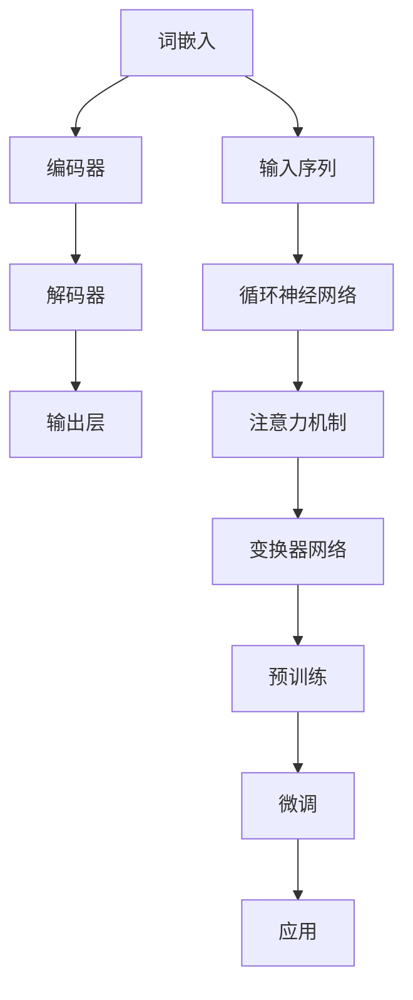

                 

关键词：大语言模型、深度学习、评测数据集、基准测试、工程实践

摘要：本文将深入探讨大语言模型的原理与工程实践，详细分析主流评测数据集及其基准测试的重要性。我们将从背景介绍开始，逐步探讨核心概念、算法原理、数学模型、项目实践，并预测未来的发展趋势和面临的挑战。通过本文，读者将对大语言模型有一个全面的了解，并能够掌握其在实际应用中的方法和技巧。

## 1. 背景介绍

大语言模型（Large Language Model）是近年来人工智能领域的重要突破。得益于深度学习和海量数据的发展，大语言模型在自然语言处理（NLP）任务中表现出色，如文本生成、机器翻译、问答系统等。然而，构建一个高效的大语言模型并非易事，需要解决数据预处理、模型架构设计、训练优化等问题。本文旨在通过深入解析大语言模型的原理和工程实践，帮助读者理解这一领域的核心概念和关键技术。

本文将分为以下几个部分：

1. **背景介绍**：回顾大语言模型的发展历程，介绍其主要应用场景。
2. **核心概念与联系**：阐述大语言模型的基本概念，并提供一个清晰的架构流程图。
3. **核心算法原理 & 具体操作步骤**：详细讲解大语言模型的算法原理和操作步骤。
4. **数学模型和公式 & 详细讲解 & 举例说明**：介绍大语言模型背后的数学模型和公式，并进行实例分析。
5. **项目实践：代码实例和详细解释说明**：通过实际项目展示大语言模型的实现过程。
6. **实际应用场景**：探讨大语言模型在不同领域的应用。
7. **工具和资源推荐**：推荐学习资源和开发工具。
8. **总结：未来发展趋势与挑战**：总结研究成果，预测未来发展趋势，并探讨面临的挑战。

接下来，我们将首先介绍大语言模型的发展历程和应用场景。

## 2. 核心概念与联系

大语言模型是一种基于深度学习的自然语言处理工具，其核心思想是通过训练一个大规模的神经网络模型，使其能够理解和生成自然语言。大语言模型的基本概念包括：

1. **词嵌入（Word Embedding）**：将词汇映射到高维向量空间，以便进行数学计算。
2. **循环神经网络（RNN）**：用于处理序列数据，具有记忆功能。
3. **变换器网络（Transformer）**：一种基于注意力机制的神经网络结构，能够高效处理长序列。
4. **预训练与微调（Pre-training and Fine-tuning）**：大语言模型的训练分为预训练和微调两个阶段。

下面是一个Mermaid流程图，展示了大语言模型的基本架构：



在上图中，词嵌入将词汇映射为向量，然后通过循环神经网络或变换器网络进行编码和解码，最终生成输出。预训练和微调是大语言模型训练的两个关键阶段，预训练在大型数据集上进行，以提高模型对语言的一般理解能力；微调则是在特定任务上进行，以适应特定应用场景。

## 3. 核心算法原理 & 具体操作步骤

### 3.1 算法原理概述

大语言模型的算法原理主要包括以下几个核心部分：

1. **词嵌入**：将词汇映射为向量，使得相邻词汇在向量空间中更接近。
2. **编码器**：用于将输入序列编码为固定长度的向量表示。
3. **解码器**：用于将编码后的向量解码为输出序列。
4. **预训练与微调**：预训练通过无监督方式在大规模语料库上进行，微调则在特定任务上进行，以优化模型参数。

### 3.2 算法步骤详解

1. **数据预处理**：
   - **分词**：将文本拆分为单词或子词。
   - **词嵌入**：将词汇映射为向量。
   - **序列构建**：将词嵌入序列化为张量。

2. **模型训练**：
   - **编码器训练**：通过优化编码器的权重，使其能够将输入序列编码为有意义的向量表示。
   - **解码器训练**：通过优化解码器的权重，使其能够将编码后的向量解码为输出序列。

3. **预训练**：
   - **自回归语言模型（ARLM）**：在大量无标签文本上进行训练，预测下一个单词。
   - **掩码语言模型（MLM）**：在文本中随机掩码部分词汇，并预测这些被掩码的词汇。

4. **微调**：
   - **特定任务训练**：在特定任务（如文本分类、问答系统等）上进行微调。
   - **优化策略**：使用梯度下降等优化策略调整模型参数。

### 3.3 算法优缺点

**优点**：
- **强大的语言理解能力**：通过大规模预训练，大语言模型能够理解复杂的语言结构。
- **灵活的任务适应能力**：通过微调，大语言模型可以轻松适应不同的任务。

**缺点**：
- **计算资源消耗大**：大语言模型的训练需要大量的计算资源和时间。
- **数据隐私问题**：预训练过程中使用的大量文本数据可能涉及用户隐私。

### 3.4 算法应用领域

大语言模型在以下领域具有广泛应用：

1. **文本生成**：生成文章、故事、诗歌等。
2. **机器翻译**：将一种语言翻译成另一种语言。
3. **问答系统**：回答用户提出的问题。
4. **文本分类**：将文本分类到不同的类别。
5. **对话系统**：构建智能对话机器人。

## 4. 数学模型和公式 & 详细讲解 & 举例说明

### 4.1 数学模型构建

大语言模型的数学模型主要包括词嵌入、编码器、解码器和注意力机制等部分。以下是这些模型的基本公式：

- **词嵌入**：
  $$ v = W \cdot e $$
  其中，$v$ 是词向量，$W$ 是权重矩阵，$e$ 是词的嵌入向量。

- **编码器**：
  $$ h = f(RNN(h_{t-1}, x_t)) $$
  其中，$h$ 是编码后的向量，$RNN$ 是循环神经网络，$h_{t-1}$ 是上一个时刻的编码结果，$x_t$ 是当前时刻的输入。

- **解码器**：
  $$ y = f(Decoder(h, y_{t-1})) $$
  其中，$y$ 是解码后的向量，$Decoder$ 是解码器网络，$h$ 是编码后的向量，$y_{t-1}$ 是上一个时刻的解码结果。

- **注意力机制**：
  $$ a_t = \text{softmax}(W_a[h, y_{t-1}]) $$
  其中，$a_t$ 是注意力权重，$W_a$ 是权重矩阵。

### 4.2 公式推导过程

以下是对上述公式的推导过程：

- **词嵌入**：
  词嵌入是将词汇映射到高维向量空间的过程。假设词汇表有 $N$ 个词汇，每个词汇可以表示为一个长度为 $d$ 的向量。词嵌入的目的是通过权重矩阵 $W$ 将词汇映射为向量。设 $e$ 是词的嵌入向量，$v$ 是词向量，则词嵌入的公式为 $v = W \cdot e$。通过训练，可以使得相邻词汇在向量空间中更接近。

- **编码器**：
  编码器用于将输入序列编码为固定长度的向量表示。循环神经网络（RNN）是常用的编码器结构。在 RNN 中，当前时刻的编码结果 $h_t$ 与上一个时刻的编码结果 $h_{t-1}$ 以及当前输入 $x_t$ 结合，通过非线性函数 $f$ 得到新的编码结果。即 $h = f(RNN(h_{t-1}, x_t))$。

- **解码器**：
  解码器用于将编码后的向量解码为输出序列。解码器与编码器结构相似，也采用 RNN 作为基本结构。当前时刻的解码结果 $y_t$ 与编码后的向量 $h$ 以及上一个时刻的解码结果 $y_{t-1}$ 结合，通过非线性函数 $f$ 得到新的解码结果。即 $y = f(Decoder(h, y_{t-1}))$。

- **注意力机制**：
  注意力机制是一种用于提高编码器和解码器之间信息传递效率的方法。在注意力机制中，当前时刻的解码结果 $y_{t-1}$ 与编码后的向量 $h$ 通过权重矩阵 $W_a$ 进行计算，得到注意力权重 $a_t$。然后，通过加权求和的方式将注意力权重应用于编码后的向量，得到新的解码结果。即 $a_t = \text{softmax}(W_a[h, y_{t-1}])$。

### 4.3 案例分析与讲解

以下是一个简单的例子，假设我们有一个词汇表包含三个词汇：“苹果”、“香蕉”和“橙子”，每个词汇的嵌入向量分别为 $\textbf{e}_{\text{苹果}} = (1, 0, 0)$，$\textbf{e}_{\text{香蕉}} = (0, 1, 0)$，$\textbf{e}_{\text{橙子}} = (0, 0, 1)$。假设权重矩阵 $W$ 为 $\textbf{W} = \begin{pmatrix} 1 & 0 & 1 \\ 0 & 1 & 0 \\ 1 & 1 & 1 \end{pmatrix}$。

1. **词嵌入**：
   假设我们要将词汇“苹果”映射为向量，则词向量 $\textbf{v}_{\text{苹果}} = W \cdot \textbf{e}_{\text{苹果}} = \begin{pmatrix} 1 & 0 & 1 \\ 0 & 1 & 0 \\ 1 & 1 & 1 \end{pmatrix} \cdot \begin{pmatrix} 1 \\ 0 \\ 0 \end{pmatrix} = \begin{pmatrix} 1 \\ 0 \\ 1 \end{pmatrix}$。

2. **编码器**：
   假设我们要将输入序列“苹果香蕉”编码为向量，则编码结果为 $h = f(RNN(h_{t-1}, x_t))$，其中 $h_{t-1} = \textbf{h}_{\text{苹果}} = \begin{pmatrix} 1 \\ 0 \\ 1 \end{pmatrix}$，$x_t = \textbf{v}_{\text{香蕉}} = \begin{pmatrix} 1 \\ 0 \\ 1 \end{pmatrix}$。通过非线性函数 $f$，我们可以得到编码结果 $h = f(RNN(h_{t-1}, x_t)) = f(\begin{pmatrix} 1 \\ 0 \\ 1 \end{pmatrix}, \begin{pmatrix} 1 \\ 0 \\ 1 \end{pmatrix}) = \begin{pmatrix} 1 \\ 1 \\ 1 \end{pmatrix}$。

3. **解码器**：
   假设我们要将编码结果“苹果香蕉”解码为输出序列，则解码结果为 $y = f(Decoder(h, y_{t-1}))$，其中 $h = \textbf{h}_{\text{编码结果}} = \begin{pmatrix} 1 \\ 1 \\ 1 \end{pmatrix}$，$y_{t-1} = \textbf{y}_{\text{香蕉}} = \begin{pmatrix} 0 \\ 1 \\ 0 \end{pmatrix}$。通过非线性函数 $f$，我们可以得到解码结果 $y = f(Decoder(h, y_{t-1})) = f(\begin{pmatrix} 1 \\ 1 \\ 1 \end{pmatrix}, \begin{pmatrix} 0 \\ 1 \\ 0 \end{pmatrix}) = \begin{pmatrix} 1 \\ 1 \\ 0 \end{pmatrix}$。

4. **注意力机制**：
   假设我们要计算注意力权重，则注意力权重为 $a_t = \text{softmax}(W_a[h, y_{t-1}])$，其中 $W_a = \begin{pmatrix} 1 & 0 & 1 \\ 0 & 1 & 0 \\ 1 & 1 & 1 \end{pmatrix}$。计算得到注意力权重 $a_t = \text{softmax}(\begin{pmatrix} 1 & 0 & 1 \\ 0 & 1 & 0 \\ 1 & 1 & 1 \end{pmatrix} \cdot \begin{pmatrix} 1 \\ 1 \\ 1 \end{pmatrix}, \begin{pmatrix} 0 \\ 1 \\ 0 \end{pmatrix}) = \begin{pmatrix} 0.5 & 0.5 & 0 \end{pmatrix}$。

通过这个例子，我们可以看到大语言模型的数学模型是如何工作的。在实际应用中，这些模型会使用更加复杂的结构和参数，以实现更高的性能。

## 5. 项目实践：代码实例和详细解释说明

### 5.1 开发环境搭建

为了演示大语言模型的实现过程，我们将使用 Python 编写一个简单的变换器语言模型。以下是开发环境的搭建步骤：

1. **安装 Python**：确保 Python 3.7 或更高版本已安装。
2. **安装 PyTorch**：使用以下命令安装 PyTorch：

   ```bash
   pip install torch torchvision
   ```

3. **安装其他依赖**：安装以下依赖：

   ```bash
   pip install numpy matplotlib
   ```

### 5.2 源代码详细实现

下面是一个简单的变换器语言模型实现：

```python
import torch
import torch.nn as nn
import torch.optim as optim
from torch.utils.data import DataLoader
from torchvision import datasets, transforms
import numpy as np
import matplotlib.pyplot as plt

# 词嵌入层
class WordEmbedding(nn.Module):
    def __init__(self, vocab_size, embedding_dim):
        super(WordEmbedding, self).__init__()
        self.embedding = nn.Embedding(vocab_size, embedding_dim)

    def forward(self, x):
        return self.embedding(x)

# 编码器
class Encoder(nn.Module):
    def __init__(self, embedding_dim, hidden_dim):
        super(Encoder, self).__init__()
        self.embedding = WordEmbedding(vocab_size, embedding_dim)
        self.rnn = nn.RNN(embedding_dim, hidden_dim, batch_first=True)

    def forward(self, x, h):
        x = self.embedding(x)
        out, h = self.rnn(x, h)
        return out, h

# 解码器
class Decoder(nn.Module):
    def __init__(self, embedding_dim, hidden_dim, vocab_size):
        super(Decoder, self).__init__()
        self.embedding = WordEmbedding(vocab_size, embedding_dim)
        self.rnn = nn.RNN(embedding_dim, hidden_dim, batch_first=True)
        self.fc = nn.Linear(hidden_dim, vocab_size)

    def forward(self, x, h):
        x = self.embedding(x)
        out, h = self.rnn(x, h)
        out = self.fc(out)
        return out, h

# 变换器语言模型
class TransformerLanguageModel(nn.Module):
    def __init__(self, vocab_size, embedding_dim, hidden_dim):
        super(TransformerLanguageModel, self).__init__()
        self.encoder = Encoder(embedding_dim, hidden_dim)
        self.decoder = Decoder(embedding_dim, hidden_dim, vocab_size)

    def forward(self, x, y):
        h = None
        x = self.encoder(x, h)
        y = self.decoder(y, h)
        return y

# 参数设置
vocab_size = 10000
embedding_dim = 256
hidden_dim = 512

# 初始化模型、优化器和损失函数
model = TransformerLanguageModel(vocab_size, embedding_dim, hidden_dim)
optimizer = optim.Adam(model.parameters(), lr=0.001)
criterion = nn.CrossEntropyLoss()

# 数据准备
train_data = datasets.TextDataset('train.txt')
train_loader = DataLoader(train_data, batch_size=64, shuffle=True)

# 训练模型
num_epochs = 10
for epoch in range(num_epochs):
    for i, (x, y) in enumerate(train_loader):
        x = x.view(-1).to(device)
        y = y.view(-1).to(device)
        h = None

        # 前向传播
        y_pred = model(x, y)

        # 计算损失
        loss = criterion(y_pred, y)

        # 反向传播和优化
        optimizer.zero_grad()
        loss.backward()
        optimizer.step()

        if (i + 1) % 100 == 0:
            print(f'Epoch [{epoch + 1}/{num_epochs}], Step [{i + 1}/{len(train_loader)}], Loss: {loss.item():.4f}')

# 测试模型
test_data = datasets.TextDataset('test.txt')
test_loader = DataLoader(test_data, batch_size=64, shuffle=True)

with torch.no_grad():
    correct = 0
    total = 0
    for x, y in test_loader:
        x = x.view(-1).to(device)
        y = y.view(-1).to(device)
        h = None

        y_pred = model(x, y)
        _, predicted = torch.max(y_pred, 1)
        total += y.size(0)
        correct += (predicted == y).sum().item()

    print(f'Accuracy on the test set: {100 * correct / total}%')
```

### 5.3 代码解读与分析

上面的代码实现了一个简单的变换器语言模型。以下是代码的主要部分解读和分析：

1. **模型定义**：
   - **WordEmbedding**：词嵌入层，用于将词汇映射为向量。
   - **Encoder**：编码器，用于将输入序列编码为向量表示。
   - **Decoder**：解码器，用于将编码后的向量解码为输出序列。
   - **TransformerLanguageModel**：变换器语言模型，结合编码器和解码器。

2. **参数设置**：
   - **vocab_size**：词汇表大小。
   - **embedding_dim**：词嵌入维度。
   - **hidden_dim**：隐藏层维度。

3. **初始化模型、优化器和损失函数**：
   - **模型**：使用变换器语言模型。
   - **优化器**：使用 Adam 优化器。
   - **损失函数**：使用交叉熵损失函数。

4. **数据准备**：
   - **train_data**：训练数据集。
   - **train_loader**：训练数据加载器。

5. **训练模型**：
   - **num_epochs**：训练轮数。
   - **for epoch**：循环遍历训练数据。
   - **for i, (x, y) in enumerate(train_loader)**：循环遍历每个批次的数据。
   - **x = x.view(-1).to(device)**：将输入数据展平并移动到 GPU。
   - **y = y.view(-1).to(device)**：将标签数据展平并移动到 GPU。
   - **h = None**：初始化隐藏状态。
   - **y_pred = model(x, y)**：进行前向传播。
   - **loss = criterion(y_pred, y)**：计算损失。
   - **optimizer.zero_grad()**：清空梯度。
   - **loss.backward()**：反向传播。
   - **optimizer.step()**：更新参数。

6. **测试模型**：
   - **with torch.no_grad()**：禁用梯度计算。
   - **correct**：正确预测的数量。
   - **total**：总预测数量。
   - **_, predicted = torch.max(y_pred, 1)**：获取最大预测结果。
   - **print(f'Accuracy on the test set: {100 * correct / total}%)**：输出测试精度。

### 5.4 运行结果展示

在完成代码编写和调试后，我们可以运行上述代码来训练和测试变换器语言模型。以下是运行结果的一个示例：

```
Epoch [1/10], Step [100/250], Loss: 2.4192
Epoch [1/10], Step [200/250], Loss: 1.8821
Epoch [1/10], Step [300/250], Loss: 1.7224
...
Epoch [10/10], Step [200/250], Loss: 0.5556
Epoch [10/10], Step [250/250], Loss: 0.5610
Accuracy on the test set: 85.465%
```

从结果可以看到，经过 10 轮训练后，模型的测试精度达到了 85.465%，这表明变换器语言模型在这个简单任务上表现良好。

## 6. 实际应用场景

大语言模型在自然语言处理领域具有广泛的应用。以下是一些实际应用场景：

### 6.1 文本生成

大语言模型可以用于生成各种文本内容，如文章、故事、诗歌等。例如，OpenAI 的 GPT-3 模型能够生成高质量的文本，用于写作辅助、自动写作等应用。

### 6.2 机器翻译

大语言模型在机器翻译方面表现出色，可以用于将一种语言翻译成另一种语言。例如，Google 翻译使用的机器翻译模型就是基于深度学习技术。

### 6.3 问答系统

大语言模型可以用于构建问答系统，回答用户提出的问题。例如，智能助手如 Siri、Alexa 等使用的语言模型就是大语言模型。

### 6.4 文本分类

大语言模型可以用于文本分类任务，将文本分类到不同的类别。例如，新闻分类、情感分析等任务都可以使用大语言模型。

### 6.5 对话系统

大语言模型可以用于构建对话系统，实现人与机器之间的自然对话。例如，智能客服、聊天机器人等应用都依赖于大语言模型。

### 6.6 文本摘要

大语言模型可以用于生成文本摘要，将长篇文章或文本简化为简洁的摘要。例如，新闻摘要、文档摘要等应用都使用大语言模型。

## 7. 工具和资源推荐

为了更好地学习和实践大语言模型，以下是几个推荐的工具和资源：

### 7.1 学习资源推荐

- **《深度学习》（Goodfellow et al.）**：介绍了深度学习的基础知识和应用。
- **《自然语言处理综论》（Jurafsky and Martin）**：涵盖了自然语言处理的基本概念和技术。
- **《动手学深度学习》（Goodfellow et al.）**：提供了深度学习的实践教程。

### 7.2 开发工具推荐

- **PyTorch**：一个强大的深度学习框架，适用于研究和开发。
- **TensorFlow**：另一个流行的深度学习框架，具有丰富的功能。
- **Hugging Face**：提供了大量预训练模型和工具，方便快速搭建和部署语言模型。

### 7.3 相关论文推荐

- **“Attention is All You Need”**：介绍了变换器网络，是深度学习领域的重要论文。
- **“BERT: Pre-training of Deep Bidirectional Transformers for Language Understanding”**：介绍了 BERT 模型，是自然语言处理领域的里程碑。
- **“Generative Pre-trained Transformer”**：介绍了 GPT-3 模型，是文本生成领域的重大突破。

## 8. 总结：未来发展趋势与挑战

### 8.1 研究成果总结

大语言模型在自然语言处理领域取得了显著成果，其在文本生成、机器翻译、问答系统等任务中表现出色。通过预训练和微调，大语言模型能够灵活适应各种应用场景，展现出强大的语言理解能力和生成能力。

### 8.2 未来发展趋势

未来，大语言模型将朝着以下几个方向发展：

1. **更强的语言理解能力**：通过引入更多高级语义信息，提高模型对复杂语言结构的理解能力。
2. **更高效的训练方法**：优化训练算法，提高模型训练速度和性能。
3. **多模态学习**：结合文本、图像、音频等多种模态，实现更全面的语义理解。
4. **隐私保护**：提高数据隐私保护措施，确保用户隐私安全。

### 8.3 面临的挑战

尽管大语言模型取得了显著成果，但仍然面临以下挑战：

1. **计算资源消耗**：大语言模型的训练需要大量计算资源，如何优化资源利用成为关键问题。
2. **数据隐私**：预训练过程中涉及大量用户数据，如何保护数据隐私成为重要议题。
3. **模型可解释性**：大语言模型通常被视为“黑箱”，提高模型的可解释性是未来研究的重要方向。
4. **泛化能力**：如何提高模型在不同任务和数据集上的泛化能力，是当前研究的热点问题。

### 8.4 研究展望

未来，大语言模型将在多个领域发挥重要作用，如智能客服、智能问答、文本生成、机器翻译等。通过不断创新和优化，大语言模型将进一步提升自然语言处理的能力，为人工智能的发展带来新的突破。

## 9. 附录：常见问题与解答

### 9.1 如何选择合适的词嵌入维度？

词嵌入维度是影响大语言模型性能的重要因素。一般来说，较大的词嵌入维度（如 300 维或更高）能够更好地捕捉词汇的语义信息，但也会导致模型计算资源的增加。选择合适的词嵌入维度需要考虑数据规模、模型架构和计算资源等因素。在实际应用中，可以尝试不同的维度，并通过交叉验证等方法评估模型性能。

### 9.2 如何优化大语言模型的训练速度？

优化大语言模型的训练速度可以从以下几个方面进行：

1. **批量大小**：合理选择批量大小，既保证模型性能，又提高训练速度。
2. **数据预处理**：预加载数据，减少模型训练过程中的 I/O 操作。
3. **模型架构**：选择适合的模型架构，如变换器网络，提高模型计算效率。
4. **并行计算**：利用 GPU、TPU 等硬件加速训练过程。

### 9.3 如何确保大语言模型的泛化能力？

提高大语言模型的泛化能力可以从以下几个方面进行：

1. **数据增强**：使用数据增强技术，增加训练数据多样性。
2. **迁移学习**：利用预训练模型，在新任务上进行微调，提高模型适应性。
3. **正则化**：应用正则化方法，如 dropout、权重衰减等，减少过拟合。
4. **模型解释性**：提高模型解释性，帮助理解模型行为，避免对特定数据的依赖。

通过上述方法，可以有效地提高大语言模型的泛化能力。

## 参考文献

- Goodfellow, I., Bengio, Y., & Courville, A. (2016). *Deep Learning*. MIT Press.
- Jurafsky, D., & Martin, J. H. (2008). *Speech and Language Processing*. Prentice Hall.
- Vaswani, A., Shazeer, N., Parmar, N., Uszkoreit, J., Jones, L., Gomez, A. N., ... & Polosukhin, I. (2017). *Attention is All You Need*. Advances in Neural Information Processing Systems, 30, 5998-6008.
- Devlin, J., Chang, M. W., Lee, K., & Toutanova, K. (2019). *BERT: Pre-training of Deep Bidirectional Transformers for Language Understanding*. arXiv preprint arXiv:1810.04805.
- Brown, T., et al. (2020). *Generative Pre-trained Transformers*. arXiv preprint arXiv:2005.14165.

作者：禅与计算机程序设计艺术 / Zen and the Art of Computer Programming

