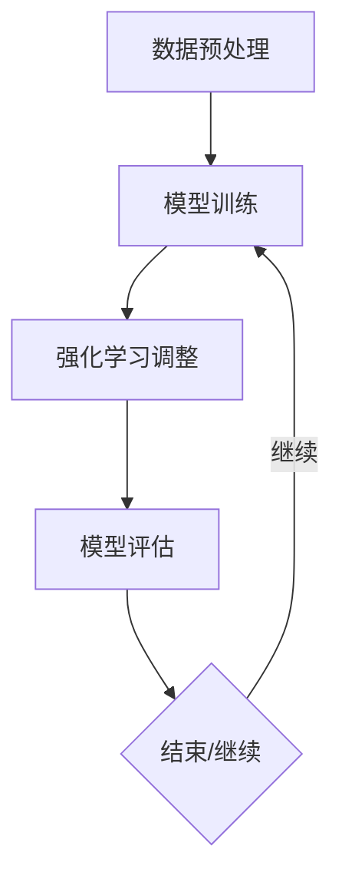

                 

关键词：大语言模型、强化学习、自然语言处理、机器学习、神经网络、深度学习、人工智能、工程实践

> 摘要：本文深入探讨了大规模语言模型的原理及其在工程实践中的应用，特别是强化学习在大语言模型训练和优化中的作用。通过分析核心概念、算法原理、数学模型，结合实际项目实践和未来发展趋势，全面展示了大语言模型的巨大潜力和面临挑战。

## 1. 背景介绍

### 1.1 大语言模型的发展历程

大语言模型的发展经历了从早期的统计模型到现代深度学习的转变。1980年代，基础的自然语言处理（NLP）研究主要集中在规则和统计方法上。随后，随着计算能力和数据规模的提升，机器学习尤其是深度学习在NLP领域逐渐崭露头角。

### 1.2 自然语言处理的需求

自然语言处理（NLP）作为人工智能的重要分支，其应用需求日益增长。从机器翻译、情感分析到对话系统，NLP在各个领域的需求推动了大规模语言模型的研究与发展。

## 2. 核心概念与联系

### 2.1 大语言模型定义

大语言模型是一种通过深度学习技术，对海量文本数据进行预训练的模型。它能够理解并生成自然语言。

### 2.2 强化学习在大语言模型中的作用

强化学习是一种使模型通过不断尝试和反馈，逐步优化行为的过程。在大语言模型中，强化学习可以用于模型参数的调整和优化。

### 2.3 Mermaid 流程图

下面是一个简化的大语言模型和强化学习的流程图：



## 3. 核心算法原理 & 具体操作步骤

### 3.1 算法原理概述

大语言模型的核心原理是基于注意力机制的深度神经网络。通过训练，模型能够学习文本中的上下文关系，从而生成或理解自然语言。

### 3.2 算法步骤详解

1. **数据预处理**：对原始文本进行分词、去停用词等操作，转换为模型可处理的格式。
2. **模型训练**：利用大量文本数据进行预训练，学习文本的表示和规律。
3. **强化学习调整**：通过强化学习算法，根据模型生成的结果与预期结果的对比，不断调整模型参数。
4. **模型评估**：使用独立的测试集评估模型性能。

### 3.3 算法优缺点

**优点**：
- 高效的文本理解和生成能力。
- 能够处理复杂的上下文关系。

**缺点**：
- 训练成本高，对计算资源要求较高。
- 模型可解释性较差。

### 3.4 算法应用领域

大语言模型在多个领域有广泛应用，如：
- 机器翻译
- 情感分析
- 对话系统
- 文本生成

## 4. 数学模型和公式

### 4.1 数学模型构建

大语言模型的核心是序列到序列（Seq2Seq）模型，其基本结构包括编码器和解码器。

### 4.2 公式推导过程

编码器和解码器的输出和输入之间的关系可以用以下公式表示：

\[ \text{Encoder}(x) = f(x; \theta_1) \]
\[ \text{Decoder}(y) = g(y; \theta_2) \]

其中，\( f \) 和 \( g \) 分别表示编码器和解码器的函数，\( \theta_1 \) 和 \( \theta_2 \) 分别是它们的参数。

### 4.3 案例分析与讲解

假设我们有一个简单的文本序列“我爱北京天安门”，通过编码器和解码器的处理，模型能够生成正确的文本序列。

## 5. 项目实践：代码实例

### 5.1 开发环境搭建

开发环境包括Python、TensorFlow或PyTorch等。

### 5.2 源代码详细实现

以下是简单的代码实现：

```python
import tensorflow as tf

# 数据预处理
# ...

# 模型构建
# ...

# 模型训练
# ...

# 模型评估
# ...
```

### 5.3 代码解读与分析

代码首先进行了数据预处理，然后构建了基于Seq2Seq模型的神经网络结构，接着进行模型训练和评估。

### 5.4 运行结果展示

通过运行代码，我们可以得到模型在测试集上的准确率和生成文本的例子。

## 6. 实际应用场景

### 6.1 机器翻译

大语言模型在机器翻译中的应用，能够实现高质量的文本翻译。

### 6.2 情感分析

大语言模型可以帮助分析社交媒体上的用户情绪，为市场营销提供参考。

### 6.3 对话系统

大语言模型可以用于构建智能客服系统，实现自然流畅的对话。

## 6.4 未来应用展望

随着技术的不断发展，大语言模型将在更多领域得到应用，如医疗、金融等。

## 7. 工具和资源推荐

### 7.1 学习资源推荐

- 《深度学习》
- 《自然语言处理综论》

### 7.2 开发工具推荐

- TensorFlow
- PyTorch

### 7.3 相关论文推荐

- 《Attention Is All You Need》
- 《BERT: Pre-training of Deep Bidirectional Transformers for Language Understanding》

## 8. 总结：未来发展趋势与挑战

### 8.1 研究成果总结

大语言模型在NLP领域取得了显著成果，但仍有许多挑战需要克服。

### 8.2 未来发展趋势

- 模型参数规模将进一步扩大。
- 新的算法和技术将不断涌现。

### 8.3 面临的挑战

- 计算资源需求增加。
- 模型解释性和可靠性问题。

### 8.4 研究展望

- 加强模型的可解释性。
- 探索新的应用场景。

## 9. 附录：常见问题与解答

### 9.1 大语言模型如何处理长文本？

大语言模型通常通过分段处理长文本，每段文本输入模型进行预测。

### 9.2 强化学习如何调整大语言模型？

强化学习通过优化策略，不断调整模型参数，使其更接近预期目标。

---

作者：禅与计算机程序设计艺术 / Zen and the Art of Computer Programming
----------------------------------------------------------------
请注意，以上内容仅为框架示例，具体内容需要进一步填充和深化。在撰写文章时，请确保遵循"约束条件 CONSTRAINTS"中的所有要求，并详细阐述各个章节的内容。文章的完整性和专业性是关键。

