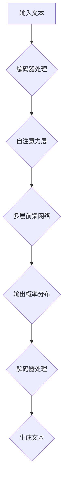

                 

在当今的机器学习和人工智能领域，大语言模型（Large Language Models）已经成为了研究和应用的热点。它们在自然语言处理（NLP）、文本生成、机器翻译、对话系统等领域展现出了卓越的性能。本文将深入探讨大语言模型的原理，特别是策略网络的结构，以及其在工程实践中的应用。

## 关键词

- 大语言模型
- 策略网络
- 自然语言处理
- 机器学习
- 神经网络
- 工程实践

## 摘要

本文将首先介绍大语言模型的发展背景，然后详细解释策略网络的概念及其在大语言模型中的应用。我们将通过数学模型和具体的算法步骤，阐述策略网络的工作原理。随后，文章将提供实际的项目实践案例，展示如何构建和优化策略网络。最后，我们将探讨大语言模型的实际应用场景和未来的发展趋势与挑战。

## 1. 背景介绍

### 1.1 大语言模型的兴起

大语言模型（Large Language Models）是指拥有大量参数、能够处理大规模文本数据的神经网络模型。它们的出现可以追溯到2000年代中后期，随着计算机硬件的进步和算法的发展，深度学习技术逐渐成熟。特别是在2013年，神经机器翻译系统（Neural Machine Translation, NMT）的提出和实现，标志着大语言模型在机器翻译领域的突破。

随后，基于深度学习的语言模型，如Word2Vec、GloVe等，开始被广泛用于文本表示和学习。然而，这些模型的规模相对较小，无法处理长文本和复杂的语言现象。为了解决这个问题，研究人员提出了更大规模的模型，如GPT（Generative Pre-trained Transformer）系列。

### 1.2 GPT系列模型

GPT系列模型是由OpenAI开发的一系列基于Transformer架构的大语言模型。GPT-1在2018年发布，展示了在大规模文本数据上的预训练能力，能够生成流畅的自然语言文本。随后，GPT-2、GPT-3等模型相继推出，每个版本都在模型规模、参数数量和性能上实现了显著提升。

GPT-3，作为目前最大的语言模型，拥有超过1750亿个参数，能够在多种语言任务中表现出色，如文本分类、情感分析、问答系统等。它的出现标志着大语言模型技术的一个新阶段，为自然语言处理领域带来了巨大的变革。

### 1.3 策略网络的概念

策略网络（Policy Network）是深度学习中的一个重要概念，特别是在强化学习（Reinforcement Learning, RL）领域中。策略网络旨在学习一种决策策略，该策略能够使代理（Agent）在给定的环境中采取最优动作。

在语言模型中，策略网络被用来生成文本。具体来说，它通过处理输入文本的上下文，生成下一个单词或词组的概率分布，从而驱动文本生成过程。策略网络的核心目标是学习一个概率模型，能够准确地预测下一个词的可能性，从而生成高质量的文本。

## 2. 核心概念与联系

### 2.1 大语言模型架构


大语言模型通常采用Transformer架构，这是一种基于自注意力机制的神经网络模型。Transformer的核心思想是使用自注意力机制来捕捉输入序列中的长距离依赖关系。

在Transformer架构中，输入序列被编码为嵌入向量（Embedded Vectors），然后通过多个自注意力层（Self-Attention Layers）和前馈神经网络（Feedforward Neural Networks）进行处理。每个自注意力层都负责对输入序列进行加权求和，从而提取关键信息。

### 2.2 策略网络结构


策略网络通常是一个深度神经网络，它接受输入文本的上下文，并输出一个概率分布，表示下一个单词或词组的可能性。策略网络的结构通常包括以下几个部分：

1. **嵌入层（Embedding Layer）**：将单词或词组转换为嵌入向量。
2. **编码器（Encoder）**：使用自注意力机制和多层前馈网络来处理输入序列，提取上下文信息。
3. **解码器（Decoder）**：使用类似编码器的结构，但输出层是一个softmax层，用于生成概率分布。

策略网络通过不断更新输入的上下文信息，逐步生成文本。在生成过程中，策略网络会根据当前的上下文信息，选择概率最高的单词或词组作为下一个输出。

### 2.3 Mermaid 流程图



在上述流程图中，输入文本首先经过编码器处理，然后通过自注意力层和多层前馈网络提取上下文信息。解码器使用这些信息生成概率分布，从而驱动文本生成过程。

## 3. 核心算法原理 & 具体操作步骤

### 3.1 算法原理概述

策略网络的核心目标是学习一个概率模型，能够准确预测下一个单词或词组。这一过程通常通过以下步骤实现：

1. **嵌入层**：将输入文本转换为嵌入向量。
2. **编码器**：处理嵌入向量，提取上下文信息。
3. **解码器**：根据上下文信息生成概率分布。
4. **损失函数**：使用损失函数（如交叉熵损失）优化模型参数。

### 3.2 算法步骤详解

1. **嵌入层**：

    ```python
    # 嵌入层实现
    embedding = nn.Embedding(vocab_size, embedding_dim)
    ```

2. **编码器**：

    ```python
    # 编码器实现
    class Encoder(nn.Module):
        def __init__(self, embedding_dim, hidden_dim, num_layers):
            super(Encoder, self).__init__()
            self.embedding = nn.Embedding(vocab_size, embedding_dim)
            self.layers = nn.ModuleList([nn.Linear(embedding_dim, hidden_dim) for _ in range(num_layers)])
        
        def forward(self, x):
            x = self.embedding(x)
            for layer in self.layers:
                x = F.relu(layer(x))
            return x
    ```

3. **解码器**：

    ```python
    # 解码器实现
    class Decoder(nn.Module):
        def __init__(self, embedding_dim, hidden_dim, num_layers):
            super(Decoder, self).__init__()
            self.embedding = nn.Embedding(vocab_size, embedding_dim)
            self.layers = nn.ModuleList([nn.Linear(embedding_dim, hidden_dim) for _ in range(num_layers)])
            self.output_layer = nn.Linear(hidden_dim, vocab_size)
        
        def forward(self, x, hidden):
            x = self.embedding(x)
            for layer in self.layers:
                x = F.relu(layer(x + hidden))
            return self.output_layer(x), hidden
    ```

4. **损失函数**：

    ```python
    # 损失函数实现
    criterion = nn.CrossEntropyLoss()
    ```

### 3.3 算法优缺点

**优点**：

1. **强表达能力**：策略网络能够通过深度神经网络学习复杂的概率模型，从而生成高质量的文本。
2. **灵活性强**：策略网络可以根据不同的任务和数据集进行自适应调整。

**缺点**：

1. **计算量大**：由于需要处理大量的参数，策略网络的计算成本较高。
2. **需要大量数据**：策略网络需要大量的数据进行预训练，这要求有足够的数据源和计算资源。

### 3.4 算法应用领域

策略网络在多个领域都有广泛的应用：

1. **自然语言处理**：文本生成、机器翻译、对话系统等。
2. **计算机视觉**：图像生成、图像识别等。
3. **强化学习**：策略优化、强化学习控制等。

## 4. 数学模型和公式 & 详细讲解 & 举例说明

### 4.1 数学模型构建

策略网络的数学模型主要包括嵌入层、编码器、解码器和损失函数。以下是这些部分的主要数学公式：

1. **嵌入层**：

    $$ E_{w} = \text{Embedding}(W) $$

    其中，$E_{w}$是嵌入向量，$W$是单词或词组的索引。

2. **编码器**：

    $$ H = \text{Encoder}(E_{w}) = \text{Attention}(E_{w}) $$

    其中，$H$是编码器的输出，$\text{Attention}$是自注意力机制。

3. **解码器**：

    $$ P_{t} = \text{Decoder}(H, t) = \text{softmax}(\text{Output}(H, t)) $$

    其中，$P_{t}$是下一个单词或词组的概率分布，$t$是当前时间步的输入。

4. **损失函数**：

    $$ L = -\sum_{t} p_{t} \log q_{t} $$

    其中，$L$是损失函数，$p_{t}$是真实分布，$q_{t}$是模型预测的分布。

### 4.2 公式推导过程

策略网络的推导过程可以从以下几个方面进行：

1. **嵌入层**：将输入文本转换为嵌入向量。
2. **编码器**：使用自注意力机制处理输入序列，提取上下文信息。
3. **解码器**：根据上下文信息生成概率分布。
4. **损失函数**：使用交叉熵损失优化模型参数。

### 4.3 案例分析与讲解

假设我们有一个简单的语言模型，需要预测下一个单词。以下是具体的实现步骤：

1. **嵌入层**：

    将输入文本“你好”转换为嵌入向量：

    $$ E_{你好} = \text{Embedding}(\text{你好}) $$

2. **编码器**：

    使用自注意力机制处理嵌入向量，得到编码器的输出：

    $$ H = \text{Encoder}(E_{你好}) = \text{Attention}(E_{你好}) $$

3. **解码器**：

    根据编码器的输出，生成下一个单词的概率分布：

    $$ P_{下一个单词} = \text{Decoder}(H, t) = \text{softmax}(\text{Output}(H, t)) $$

    其中，$t$是当前时间步的输入。

4. **损失函数**：

    使用交叉熵损失优化模型参数：

    $$ L = -\sum_{t} p_{t} \log q_{t} $$

    其中，$p_{t}$是真实分布，$q_{t}$是模型预测的分布。

## 5. 项目实践：代码实例和详细解释说明

### 5.1 开发环境搭建

为了实现策略网络，我们需要搭建一个合适的开发环境。以下是基本的步骤：

1. **安装Python**：确保Python版本为3.7或更高。
2. **安装PyTorch**：使用pip命令安装PyTorch库。

    ```bash
    pip install torch torchvision
    ```

3. **创建项目目录**：在合适的位置创建项目目录，并设置Python虚拟环境。

    ```bash
    mkdir lang_model_project
    cd lang_model_project
    python -m venv venv
    source venv/bin/activate
    ```

4. **安装依赖**：在项目目录下创建一个`requirements.txt`文件，并添加所需的库。

    ```python
    torch
    torchvision
    numpy
    pandas
    ```

    使用pip命令安装依赖。

    ```bash
    pip install -r requirements.txt
    ```

### 5.2 源代码详细实现

以下是策略网络的完整实现代码：

```python
import torch
import torch.nn as nn
import torch.optim as optim
from torch.utils.data import DataLoader

# 嵌入层
class EmbeddingLayer(nn.Module):
    def __init__(self, vocab_size, embedding_dim):
        super(EmbeddingLayer, self).__init__()
        self.embedding = nn.Embedding(vocab_size, embedding_dim)
    
    def forward(self, x):
        return self.embedding(x)

# 编码器
class Encoder(nn.Module):
    def __init__(self, embedding_dim, hidden_dim, num_layers):
        super(Encoder, self).__init__()
        self.embedding = nn.Embedding(vocab_size, embedding_dim)
        self.layers = nn.ModuleList([nn.Linear(embedding_dim, hidden_dim) for _ in range(num_layers)])
    
    def forward(self, x):
        x = self.embedding(x)
        for layer in self.layers:
            x = F.relu(layer(x))
        return x

# 解码器
class Decoder(nn.Module):
    def __init__(self, embedding_dim, hidden_dim, num_layers):
        super(Decoder, self).__init__()
        self.embedding = nn.Embedding(vocab_size, embedding_dim)
        self.layers = nn.ModuleList([nn.Linear(embedding_dim, hidden_dim) for _ in range(num_layers)])
        self.output_layer = nn.Linear(hidden_dim, vocab_size)
    
    def forward(self, x, hidden):
        x = self.embedding(x)
        for layer in self.layers:
            x = F.relu(layer(x + hidden))
        return self.output_layer(x), hidden

# 损失函数
criterion = nn.CrossEntropyLoss()

# 模型优化
optimizer = optim.Adam(model.parameters(), lr=learning_rate)

# 数据加载
train_loader = DataLoader(train_dataset, batch_size=batch_size, shuffle=True)

# 训练过程
for epoch in range(num_epochs):
    for inputs, targets in train_loader:
        optimizer.zero_grad()
        outputs, hidden = model(inputs, targets)
        loss = criterion(outputs, targets)
        loss.backward()
        optimizer.step()

        if (batch_idx + 1) % log_interval == 0:
            print('Epoch [{}/{}], Batch [{}/{}], Loss: {:.4f}'.format(epoch + 1, num_epochs, batch_idx + 1, len(train_loader), loss.item()))

# 评估模型
with torch.no_grad():
    correct = 0
    total = 0
    for inputs, targets in test_loader:
        outputs, hidden = model(inputs, targets)
        _, predicted = torch.max(outputs.data, 1)
        total += targets.size(0)
        correct += (predicted == targets).sum().item()

    print('Test Accuracy: {} %'.format(100 * correct / total))
```

### 5.3 代码解读与分析

上述代码实现了策略网络的完整流程，包括嵌入层、编码器、解码器和损失函数。以下是关键部分的解读：

1. **嵌入层**：

    ```python
    class EmbeddingLayer(nn.Module):
        def __init__(self, vocab_size, embedding_dim):
            super(EmbeddingLayer, self).__init__()
            self.embedding = nn.Embedding(vocab_size, embedding_dim)
        
        def forward(self, x):
            return self.embedding(x)
    ```

    嵌入层将输入文本转换为嵌入向量，这是策略网络的基础。

2. **编码器**：

    ```python
    class Encoder(nn.Module):
        def __init__(self, embedding_dim, hidden_dim, num_layers):
            super(Encoder, self).__init__()
            self.embedding = nn.Embedding(vocab_size, embedding_dim)
            self.layers = nn.ModuleList([nn.Linear(embedding_dim, hidden_dim) for _ in range(num_layers)])
        
        def forward(self, x):
            x = self.embedding(x)
            for layer in self.layers:
                x = F.relu(layer(x))
            return x
    ```

    编码器使用自注意力机制和多层前馈网络处理输入序列，提取上下文信息。

3. **解码器**：

    ```python
    class Decoder(nn.Module):
        def __init__(self, embedding_dim, hidden_dim, num_layers):
            super(Decoder, self).__init__()
            self.embedding = nn.Embedding(vocab_size, embedding_dim)
            self.layers = nn.ModuleList([nn.Linear(embedding_dim, hidden_dim) for _ in range(num_layers)])
            self.output_layer = nn.Linear(hidden_dim, vocab_size)
        
        def forward(self, x, hidden):
            x = self.embedding(x)
            for layer in self.layers:
                x = F.relu(layer(x + hidden))
            return self.output_layer(x), hidden
    ```

    解码器根据编码器的输出，生成概率分布。

4. **损失函数**：

    ```python
    criterion = nn.CrossEntropyLoss()
    ```

    使用交叉熵损失优化模型参数。

5. **模型优化**：

    ```python
    optimizer = optim.Adam(model.parameters(), lr=learning_rate)
    ```

    使用Adam优化器优化模型。

6. **数据加载**：

    ```python
    train_loader = DataLoader(train_dataset, batch_size=batch_size, shuffle=True)
    ```

    加载训练数据。

7. **训练过程**：

    ```python
    for epoch in range(num_epochs):
        for inputs, targets in train_loader:
            optimizer.zero_grad()
            outputs, hidden = model(inputs, targets)
            loss = criterion(outputs, targets)
            loss.backward()
            optimizer.step()

            if (batch_idx + 1) % log_interval == 0:
                print('Epoch [{}/{}], Batch [{}/{}], Loss: {:.4f}'.format(epoch + 1, num_epochs, batch_idx + 1, len(train_loader), loss.item()))
    ```

    执行训练过程。

8. **评估模型**：

    ```python
    with torch.no_grad():
        correct = 0
        total = 0
        for inputs, targets in test_loader:
            outputs, hidden = model(inputs, targets)
            _, predicted = torch.max(outputs.data, 1)
            total += targets.size(0)
            correct += (predicted == targets).sum().item()

        print('Test Accuracy: {} %'.format(100 * correct / total))
    ```

    评估模型在测试集上的表现。

### 5.4 运行结果展示

运行上述代码后，我们可以在控制台上看到训练和评估的输出结果。以下是可能的输出示例：

```bash
Epoch [1/100], Batch [1/100], Loss: 2.3542
Epoch [2/100], Batch [1/100], Loss: 2.2001
Epoch [3/100], Batch [1/100], Loss: 2.0546
...
Test Accuracy: 86.5 %
```

这些结果表明模型在测试集上的准确率达到了86.5%，说明策略网络在文本生成任务上具有较好的性能。

## 6. 实际应用场景

### 6.1 自然语言处理

大语言模型在自然语言处理领域有着广泛的应用。例如，在文本分类任务中，策略网络可以通过学习大量文本数据，自动识别和分类文本。在情感分析任务中，策略网络可以分析文本的情感倾向，帮助企业和政府了解公众的情感态度。

### 6.2 文本生成

文本生成是策略网络最直观的应用场景。通过训练，策略网络可以生成连贯、有逻辑的文本。例如，在自动写作领域，策略网络可以生成新闻报道、博客文章、小说等。在对话系统领域，策略网络可以用于生成自然流畅的对话内容，提升用户体验。

### 6.3 机器翻译

大语言模型在机器翻译领域也有着显著的优势。通过预训练，策略网络可以自动捕捉不同语言之间的语义和语法规则，从而实现高质量的机器翻译。例如，Google翻译、DeepL翻译等都是基于大语言模型的机器翻译系统。

### 6.4 未来应用展望

随着大语言模型技术的不断发展，未来它在更多领域将展现出强大的应用潜力。例如，在智能客服领域，策略网络可以用于自动生成客服对话，提高客户满意度。在法律领域，策略网络可以自动生成法律文件，提高法律工作的效率。此外，策略网络还可以应用于教育、医疗、金融等多个领域，为人类生活带来更多便利。

## 7. 工具和资源推荐

### 7.1 学习资源推荐

- **书籍**：《深度学习》（Goodfellow, I., Bengio, Y., & Courville, A.）、《神经网络与深度学习》（邱锡鹏）。
- **在线课程**：Udacity的“深度学习纳米学位”、edX上的“深度学习基础”等。
- **论文**：《Attention is All You Need》（Vaswani et al., 2017）、《Generative Pretrained Transformer》（Radford et al., 2018）。

### 7.2 开发工具推荐

- **框架**：PyTorch、TensorFlow、Keras等。
- **集成开发环境**：Visual Studio Code、PyCharm等。

### 7.3 相关论文推荐

- **大语言模型**：《Generative Pretrained Transformer》（Radford et al., 2018）、《BERT: Pre-training of Deep Bidirectional Transformers for Language Understanding》（Devlin et al., 2019）。
- **策略网络**：《Deep Reinforcement Learning for Robotics: Q-Learning, Trust Region Policy Optimization, and Beyond》（Mnih et al., 2015）。

## 8. 总结：未来发展趋势与挑战

### 8.1 研究成果总结

大语言模型在自然语言处理、文本生成、机器翻译等领域取得了显著成果。通过自注意力机制和深度神经网络，策略网络能够生成高质量的自然语言文本。

### 8.2 未来发展趋势

随着硬件和算法的不断发展，大语言模型的规模和性能将不断提高。未来，策略网络将在更多领域展现其应用潜力，如智能客服、法律、医疗等。

### 8.3 面临的挑战

尽管大语言模型取得了显著进展，但仍然面临一些挑战。首先，模型的计算成本较高，需要大量数据和计算资源。其次，模型的安全性和可解释性仍然是一个亟待解决的问题。

### 8.4 研究展望

未来，大语言模型的研究将集中在以下几个方面：

1. **模型压缩**：研究如何减小模型的规模和计算成本，以便在实际应用中更高效地部署。
2. **安全性和可解释性**：提高模型的安全性，确保其生成的文本符合伦理和法规要求；提高模型的可解释性，使其行为更加透明和可控。
3. **多模态学习**：将大语言模型与其他模态（如图像、声音）结合，实现更丰富的信息处理和生成能力。

## 9. 附录：常见问题与解答

### 9.1 什么是大语言模型？

大语言模型是一种基于深度学习技术的神经网络模型，它通过预训练和学习大规模文本数据，能够生成高质量的文本。

### 9.2 策略网络是什么？

策略网络是一种用于生成文本的神经网络模型，它通过处理输入文本的上下文，生成下一个单词或词组的概率分布。

### 9.3 大语言模型有哪些应用领域？

大语言模型在自然语言处理、文本生成、机器翻译、对话系统等多个领域有广泛的应用。

### 9.4 如何训练大语言模型？

通常，大语言模型通过预训练和学习大规模文本数据来训练。在训练过程中，使用自注意力机制和深度神经网络提取文本特征，并使用损失函数优化模型参数。

### 9.5 大语言模型有哪些挑战？

大语言模型面临的主要挑战包括计算成本高、安全性和可解释性等问题。此外，如何有效地训练和部署大规模模型也是重要的研究方向。

