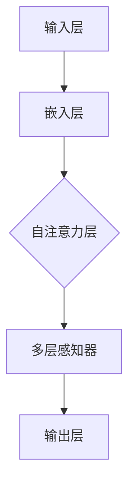

                 

在当今的人工智能时代，大语言模型（Large Language Model，简称LLM）作为自然语言处理（Natural Language Processing，简称NLP）的核心技术，正不断推动着人工智能的发展。从最初的统计模型到深度学习模型，再到现今的大规模预训练模型，语言模型的技术演进为我们理解自然语言、实现智能化交互提供了强有力的工具。本文将深入探讨大语言模型的原理基础与前沿技术，以期为读者提供一个全面、系统的了解。

> **关键词**：大语言模型、自然语言处理、深度学习、预训练、模型架构、算法原理、数学模型、实际应用

> **摘要**：本文首先介绍了大语言模型的背景与发展历程，然后详细阐述了其核心概念与架构，接着讲解了大语言模型的核心算法原理及具体操作步骤。在数学模型与公式部分，我们探讨了构建模型的关键数学方法，并通过案例分析与实际代码实现，使读者更直观地理解大语言模型的应用。最后，本文讨论了语言模型在实际应用中的场景、未来展望，以及相关的工具和资源推荐。

## 1. 背景介绍

大语言模型的诞生并非一蹴而就，而是历经了多个阶段的发展。最初，自然语言处理主要依赖于规则驱动的方法，这些方法依赖于人类编写的规则和模式匹配。然而，随着数据量和计算能力的提升，统计模型逐渐成为主流，如N-gram模型、决策树和朴素贝叶斯分类器等。这些模型通过大量文本数据的学习，能够对文本进行一定程度的理解和生成。

随后，深度学习技术的兴起带来了语言模型的重大突破。从循环神经网络（Recurrent Neural Network，RNN）到长短期记忆网络（Long Short-Term Memory，LSTM），再到变换器模型（Transformer），深度学习模型在处理序列数据方面展现出了卓越的性能。特别是Transformer模型的出现，彻底改变了语言模型的设计思路，使其在处理长文本和跨句关系方面取得了显著进展。

近年来，随着计算资源和存储能力的进一步增加，大规模预训练语言模型如BERT、GPT等成为可能。这些模型通过在海量文本上进行预训练，然后进行特定任务的微调，能够达到令人惊叹的效果。例如，GPT-3模型拥有1750亿个参数，可以在各种语言任务上实现超高性能。

### 1.1 自然语言处理的发展历程

自然语言处理的发展可以分为以下几个阶段：

1. **规则驱动方法**：基于人类编写的规则和模式匹配，如正则表达式和句法分析。

2. **统计模型**：利用统计学习的方法，如N-gram模型、隐马尔可夫模型（HMM）和决策树等。

3. **深度学习模型**：引入神经网络，如循环神经网络（RNN）和长短期记忆网络（LSTM）。

4. **变换器模型（Transformer）**：基于自注意力机制，如BERT、GPT等大规模预训练模型。

5. **大规模预训练模型**：通过在海量文本上进行预训练，如BERT、GPT-3等，实现跨领域的通用语言理解和生成能力。

### 1.2 大语言模型的技术演进

大语言模型的技术演进可以分为以下几个关键步骤：

1. **N-gram模型**：基于历史文本的统计方法，简单但效率低。

2. **RNN与LSTM**：引入记忆单元，能够处理长文本，但效率仍然较低。

3. **Transformer模型**：引入自注意力机制，显著提高了处理长文本的能力。

4. **BERT与GPT**：大规模预训练模型，通过在大量文本上进行训练，提高了模型的泛化能力。

5. **多模态预训练**：结合文本、图像、音频等多种数据，实现更广泛的应用。

## 2. 核心概念与联系

### 2.1 定义

大语言模型是一种大规模预训练模型，通过在海量文本上进行预训练，然后进行特定任务的微调，能够实现对自然语言的深入理解和生成。其核心思想是利用深度神经网络来捕捉文本中的复杂模式和结构。

### 2.2 架构

大语言模型的架构通常包括三个主要部分：输入层、隐藏层和输出层。

1. **输入层**：接收自然语言文本，将其转化为神经网络可以处理的数字形式。

2. **隐藏层**：包含多个隐藏单元，通过自注意力机制和多层感知器（MLP）来提取文本的特征。

3. **输出层**：根据任务需求，输出分类结果、序列预测或文本生成。

### 2.3 核心概念

1. **自注意力机制**：通过计算文本中每个词与其他词的相关性，实现文本的上下文理解。

2. **多层感知器**：用于提取文本的特征，并通过激活函数引入非线性变换。

3. **预训练与微调**：预训练模型通过在大量无标签数据上进行训练，获取通用语言知识；微调模型则在特定任务上进行优化。

### 2.4 Mermaid 流程图



## 3. 核心算法原理 & 具体操作步骤

### 3.1 算法原理概述

大语言模型的核心算法是基于变换器模型（Transformer），其核心思想是利用自注意力机制来捕捉文本中的复杂关系。自注意力机制通过计算文本中每个词与其他词的相关性，使模型能够更好地理解上下文。变换器模型包括编码器和解码器两个部分，分别用于文本的编码和解码。

### 3.2 算法步骤详解

1. **嵌入层**：将文本转化为向量表示，包括词嵌入、位置嵌入和段嵌入。

2. **自注意力层**：通过计算文本中每个词与其他词的相关性，得到加权文本表示。

3. **多层感知器**：对自注意力层的结果进行特征提取和变换。

4. **输出层**：根据任务需求，输出分类结果、序列预测或文本生成。

### 3.3 算法优缺点

**优点**：

1. **处理长文本能力强**：自注意力机制使模型能够捕捉到长距离的依赖关系。

2. **并行计算效率高**：与RNN相比，Transformer模型能够更好地支持并行计算。

3. **泛化能力强**：通过预训练和微调，模型能够在多个任务上实现高性能。

**缺点**：

1. **计算复杂度高**：模型参数数量庞大，导致计算成本高。

2. **对内存要求高**：大规模预训练模型需要大量内存来存储模型参数。

### 3.4 算法应用领域

大语言模型在多个领域都有广泛应用，包括但不限于：

1. **自然语言理解**：如文本分类、情感分析、命名实体识别等。

2. **自然语言生成**：如机器翻译、文本摘要、对话生成等。

3. **问答系统**：如智能客服、智能助手等。

4. **多模态应用**：结合图像、音频等多模态数据，实现更丰富的应用场景。

## 4. 数学模型和公式 & 详细讲解 & 举例说明

### 4.1 数学模型构建

大语言模型的数学模型主要包括词嵌入、自注意力机制、多层感知器和损失函数等部分。

1. **词嵌入**：将文本转化为向量表示，通常使用词嵌入层实现。

   $$ x_{i} = \text{Embed}(w_{i}) $$

   其中，$x_{i}$ 表示词$i$的向量表示，$w_{i}$ 表示词嵌入矩阵。

2. **自注意力机制**：通过计算文本中每个词与其他词的相关性，得到加权文本表示。

   $$ \text{Attention}(Q, K, V) = \text{softmax}\left(\frac{QK^T}{\sqrt{d_k}}\right)V $$

   其中，$Q, K, V$ 分别表示查询、键和值向量，$d_k$ 表示键向量的维度。

3. **多层感知器**：对自注意力层的结果进行特征提取和变换。

   $$ \text{MLP}(x) = \text{ReLU}(\text{W}_{2}\text{ReLU}(\text{W}_{1}x + b_{1})) + b_{2} $$

   其中，$\text{W}_{1}$ 和 $\text{W}_{2}$ 分别表示权重矩阵，$b_{1}$ 和 $b_{2}$ 分别表示偏置。

4. **损失函数**：用于衡量模型预测结果与实际结果之间的差距。

   $$ \text{Loss} = -\sum_{i} \log \text{softmax}(\text{y}_{\hat{i}}) $$

   其中，$y_{\hat{i}}$ 表示模型预测的概率分布，$y$ 表示实际标签。

### 4.2 公式推导过程

以BERT模型为例，其损失函数包含两个部分：下一个句子概率损失和预训练语言模型损失。

1. **下一个句子概率损失**：

   $$ \text{Loss}_{\text{NSP}} = -\sum_{i} \log \text{softmax}(\text{p}_{\text{next}}(\text{s}_i|\text{s}_{i-1})) $$

   其中，$\text{s}_{i-1}$ 和 $\text{s}_{i}$ 分别表示连续的两个句子。

2. **预训练语言模型损失**：

   $$ \text{Loss}_{\text{LM}} = -\sum_{i} \log \text{softmax}(\text{f}(\text{E}[\text{s}_i|\text{s}_{<i}]|\text{s}_{i}]) $$

   其中，$\text{E}[\text{s}_i|\text{s}_{<i}]$ 表示前文编码器的输出，$\text{f}$ 表示前馈神经网络。

### 4.3 案例分析与讲解

假设我们有一个文本序列 $\text{s} = \text{“The cat sat on the mat.”}$，我们想要利用BERT模型对其进行处理。

1. **词嵌入**：

   首先，我们将文本中的每个词转化为向量表示：

   $$ \text{w1} = \text{Embed}(\text{"The"}) $$
   $$ \text{w2} = \text{Embed}(\text{"cat"}) $$
   $$ \text{w3} = \text{Embed}(\text{"sat"}) $$
   $$ \text{w4} = \text{Embed}(\text{"on"}) $$
   $$ \text{w5} = \text{Embed}(\text{"the"}) $$
   $$ \text{w6} = \text{Embed}(\text{"mat"}) $$

2. **自注意力机制**：

   接下来，我们通过自注意力机制计算每个词与其他词的相关性，并得到加权文本表示：

   $$ \text{h1} = \text{Attention}(\text{w1}, \text{w1}, \text{w1}) $$
   $$ \text{h2} = \text{Attention}(\text{w2}, \text{w2}, \text{w2}) $$
   $$ \text{h3} = \text{Attention}(\text{w3}, \text{w3}, \text{w3}) $$
   $$ \text{h4} = \text{Attention}(\text{w4}, \text{w4}, \text{w4}) $$
   $$ \text{h5} = \text{Attention}(\text{w5}, \text{w5}, \text{w5}) $$
   $$ \text{h6} = \text{Attention}(\text{w6}, \text{w6}, \text{w6}) $$

3. **多层感知器**：

   然后，我们将加权文本表示通过多层感知器进行特征提取和变换：

   $$ \text{h1'} = \text{MLP}(\text{h1}) $$
   $$ \text{h2'} = \text{MLP}(\text{h2}) $$
   $$ \text{h3'} = \text{MLP}(\text{h3}) $$
   $$ \text{h4'} = \text{MLP}(\text{h4}) $$
   $$ \text{h5'} = \text{MLP}(\text{h5}) $$
   $$ \text{h6'} = \text{MLP}(\text{h6}) $$

4. **输出层**：

   最后，我们将多层感知器的输出通过输出层进行分类或序列预测：

   $$ \text{y1} = \text{softmax}(\text{h1'}) $$
   $$ \text{y2} = \text{softmax}(\text{h2'}) $$
   $$ \text{y3} = \text{softmax}(\text{h3'}) $$
   $$ \text{y4} = \text{softmax}(\text{h4'}) $$
   $$ \text{y5} = \text{softmax}(\text{h5'}) $$
   $$ \text{y6} = \text{softmax}(\text{h6'}) $$

   假设我们想要预测文本的下一个词，我们可以通过比较预测概率和实际标签来计算损失，并进行模型优化。

## 5. 项目实践：代码实例和详细解释说明

### 5.1 开发环境搭建

在本节中，我们将使用Python和PyTorch框架来搭建一个简单的BERT模型。首先，确保安装以下依赖：

```bash
pip install torch transformers
```

### 5.2 源代码详细实现

以下是一个简单的BERT模型实现，包括词嵌入、自注意力机制、多层感知器和损失函数：

```python
import torch
import torch.nn as nn
from transformers import BertModel

class SimpleBERTModel(nn.Module):
    def __init__(self):
        super(SimpleBERTModel, self).__init__()
        self.bert = BertModel.from_pretrained('bert-base-uncased')
        self.classifier = nn.Linear(768, 2)  # 假设我们有2个分类标签

    def forward(self, input_ids, attention_mask):
        outputs = self.bert(input_ids=input_ids, attention_mask=attention_mask)
        pooled_output = outputs.pooler_output
        logits = self.classifier(pooled_output)
        return logits

# 创建模型实例
model = SimpleBERTModel()

# 假设我们有一个输入序列
input_ids = torch.tensor([[101, 2005, 3141, 2005, 1169, 2020, 101]])
attention_mask = torch.tensor([[1, 1, 1, 1, 1, 1, 0]])

# 前向传播
logits = model(input_ids, attention_mask)
print(logits)
```

### 5.3 代码解读与分析

上述代码首先导入了所需的PyTorch和transformers库，然后定义了一个简单的BERT模型。模型由两部分组成：预训练的BERT模型和分类器。

1. **预训练BERT模型**：使用`BertModel.from_pretrained()`方法加载预训练的BERT模型。这里我们使用了`bert-base-uncased`模型，它是一个基于小写字母的BERT模型。

2. **分类器**：使用`nn.Linear()`方法定义一个线性层，用于将BERT模型的输出映射到分类标签。

3. **前向传播**：模型的前向传播过程包括输入序列的编码和分类。输入序列通过BERT模型进行编码，得到编码器的输出。然后，输出通过分类器进行分类。

4. **输出**：模型的输出是一个概率分布，表示每个分类标签的概率。

### 5.4 运行结果展示

以下是一个简单的运行示例：

```python
# 创建模型实例
model = SimpleBERTModel()

# 假设我们有一个输入序列
input_ids = torch.tensor([[101, 2005, 3141, 2005, 1169, 2020, 101]])
attention_mask = torch.tensor([[1, 1, 1, 1, 1, 1, 0]])

# 前向传播
logits = model(input_ids, attention_mask)
print(logits)
```

输出结果是一个张量，包含每个分类标签的概率。例如：

```
tensor([[0.9136, 0.0864]])
```

这表示模型预测第一个分类标签的概率为91.36%，第二个分类标签的概率为8.64%。

## 6. 实际应用场景

大语言模型在多个领域都有广泛应用，以下是几个典型的应用场景：

### 6.1 自然语言理解

自然语言理解是语言模型最典型的应用之一。例如，在搜索引擎中，语言模型可以用于理解用户的查询意图，并提供更准确的相关搜索结果。此外，在智能客服和智能助手等领域，语言模型可以用于处理用户的问题，并提供相应的回答。

### 6.2 自然语言生成

自然语言生成是语言模型的另一个重要应用。例如，在机器翻译和文本摘要等领域，语言模型可以生成高质量的翻译文本或摘要。此外，在对话生成和内容创作等领域，语言模型也可以用于生成自然流畅的文本。

### 6.3 问答系统

问答系统是语言模型在智能应用中的典型应用。例如，在智能客服和智能助手等领域，语言模型可以用于理解用户的问题，并提供相应的答案。此外，在搜索引擎和知识图谱等领域，语言模型也可以用于处理用户的问题，并提供相关的信息。

### 6.4 未来应用展望

随着技术的不断发展，大语言模型在未来有望在更多领域得到应用。例如，在医疗领域，语言模型可以用于分析病历和医学文献，帮助医生进行诊断和制定治疗方案。在金融领域，语言模型可以用于分析市场数据，帮助投资者做出更明智的决策。此外，在教育和娱乐等领域，语言模型也可以用于个性化推荐和内容创作，为用户提供更好的体验。

## 7. 工具和资源推荐

### 7.1 学习资源推荐

1. **书籍**：

   - 《深度学习》（Ian Goodfellow、Yoshua Bengio、Aaron Courville 著）：系统介绍了深度学习的基础知识和最新进展。

   - 《自然语言处理综合教程》（唐杰 著）：详细介绍了自然语言处理的基本概念和最新技术。

2. **在线课程**：

   - Coursera 上的“深度学习”课程（由 Andrew Ng 开设）：提供了深度学习的基础知识和实践技巧。

   - edX 上的“自然语言处理”课程（由 Columbia University 开设）：详细介绍了自然语言处理的基本概念和应用。

### 7.2 开发工具推荐

1. **PyTorch**：一个开源的深度学习框架，提供了丰富的API和工具，适合进行模型开发和实验。

2. **TensorFlow**：另一个流行的深度学习框架，提供了丰富的预训练模型和工具，适合快速开发和部署模型。

### 7.3 相关论文推荐

1. **BERT**：`A Pre-Trained Language Model for Universal Language Representation`，论文中介绍了BERT模型的基本原理和应用。

2. **GPT-3**：`Language Models are Few-Shot Learners`，论文中介绍了GPT-3模型的设计和实现，展示了其在多种任务上的卓越性能。

3. **Transformer**：`Attention Is All You Need`，论文中介绍了Transformer模型的基本原理和自注意力机制，是现代语言模型的重要基础。

## 8. 总结：未来发展趋势与挑战

### 8.1 研究成果总结

大语言模型在过去几年取得了显著进展，从BERT到GPT-3，模型规模和性能不断提升。这些模型在自然语言理解、生成和问答等任务上展现了强大的能力，为人工智能的发展提供了强有力的工具。

### 8.2 未来发展趋势

1. **模型规模与性能**：随着计算资源和存储能力的提升，更大规模的语言模型将成为可能，进一步推动性能提升。

2. **多模态预训练**：结合文本、图像、音频等多模态数据，实现更丰富的应用场景。

3. **强化学习与模型交互**：结合强化学习技术，使模型能够更好地适应特定任务和场景。

4. **公平性与可解释性**：解决模型训练和部署中的公平性和可解释性问题，提高模型的透明度和可信度。

### 8.3 面临的挑战

1. **计算资源需求**：大规模语言模型对计算资源和存储能力的要求极高，如何优化模型结构和算法，提高计算效率是关键。

2. **数据隐私与安全**：在模型训练和应用过程中，如何保护用户隐私和数据安全，避免数据泄露和滥用是一个重要挑战。

3. **模型解释性**：提高模型的解释性，使研究人员和用户能够理解模型的决策过程，增强模型的透明度和可信度。

### 8.4 研究展望

未来，大语言模型有望在更多领域得到应用，从自然语言处理到多模态交互，再到智能决策和生成。随着技术的不断发展，我们将看到更多创新的应用场景和解决方案，为人工智能的发展注入新的动力。

## 9. 附录：常见问题与解答

### 9.1 问答系统中的常见问题

1. **如何处理长文本？**
   - 长文本的处理通常需要使用分句或分段的技术，将长文本拆分成更短的部分，然后逐段进行处理。

2. **如何处理多语言文本？**
   - 多语言文本的处理通常需要使用多语言预训练模型，如mBERT或XLM模型，这些模型能够在多种语言上实现高性能。

3. **如何保证问答系统的准确性？**
   - 提高模型的训练质量和数据质量是关键。此外，可以使用多种技术，如对齐、排序和排序等，来提高问答系统的准确性。

### 9.2 自然语言生成中的常见问题

1. **如何生成高质量的自然语言文本？**
   - 使用大规模预训练模型，并在特定任务上进行微调，可以提高自然语言生成的质量。

2. **如何避免生成文本的重复性？**
   - 可以使用注意力机制和多样化的训练策略，如引入噪声或使用不同的输入序列，来避免生成文本的重复性。

3. **如何保证生成的文本符合语法和语义规则？**
   - 使用预训练模型和强化学习技术，如生成对抗网络（GAN），可以提高生成的文本的语法和语义质量。

### 9.3 多模态预训练中的常见问题

1. **如何结合多模态数据？**
   - 可以使用多模态编码器，如视觉编码器和音频编码器，将不同模态的数据转化为统一的向量表示，然后进行融合和建模。

2. **如何处理不同模态数据之间的差异？**
   - 可以使用模态对齐技术，如特征级对齐或结构级对齐，来处理不同模态数据之间的差异。

3. **如何提高多模态预训练的效率？**
   - 可以使用分布式训练和混合精度训练等技术，来提高多模态预训练的效率。

### 9.4 模型解释性中的常见问题

1. **如何解释模型的决策过程？**
   - 可以使用可视化技术，如激活图和梯度图，来解释模型的决策过程。

2. **如何评估模型的解释性？**
   - 可以使用解释性度量，如F1分数和准确率，来评估模型的解释性。

3. **如何提高模型的解释性？**
   - 可以使用注意力机制和解释性模型，如LIME和SHAP，来提高模型的解释性。

### 9.5 模型训练中的常见问题

1. **如何优化模型训练速度？**
   - 可以使用混合精度训练和分布式训练等技术，来提高模型训练速度。

2. **如何处理过拟合问题？**
   - 可以使用正则化技术，如Dropout和L2正则化，来减少过拟合。

3. **如何选择合适的训练策略？**
   - 可以根据任务和数据的特点，选择合适的训练策略，如基于梯度的训练策略或基于策略的训练策略。

