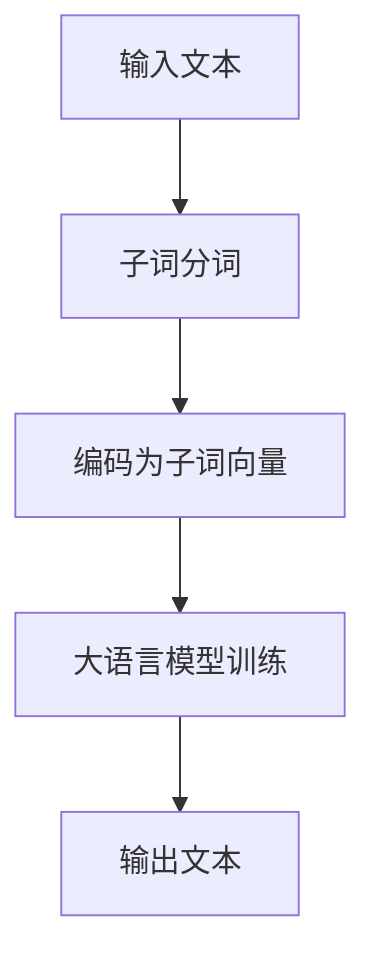

                 

关键词：大语言模型，子词分词，深度学习，NLP，自然语言处理

> 摘要：本文将深入探讨大语言模型（Large Language Model）的原理及其前沿技术——子词分词（Subword Tokenization）。通过对核心概念、算法原理、数学模型、项目实践以及实际应用场景的详细分析，帮助读者全面理解子词分词在大语言模型中的重要性及其在自然语言处理领域的广泛应用。

## 1. 背景介绍

随着互联网的飞速发展，自然语言处理（NLP）技术在各个领域的应用越来越广泛。从搜索引擎到语音识别，从机器翻译到情感分析，NLP 技术已经成为现代人工智能的核心驱动力之一。然而，自然语言本身的复杂性和多样性给 NLP 研究带来了巨大的挑战。为了更好地处理和理解自然语言，研究者们提出了各种语言模型，其中大语言模型（Large Language Model）尤为引人注目。

大语言模型是一种基于神经网络的语言表示模型，能够对大规模语料库进行训练，从而捕捉到语言中的复杂模式和规律。这些模型在多个 NLP 任务上取得了显著的成绩，如文本分类、命名实体识别、机器翻译等。然而，在大语言模型的训练和应用过程中，如何有效地对自然语言进行分词，成为了一个关键问题。

传统的分词方法，如基于规则的分词和基于统计的分词，已经难以满足大语言模型对分词精度和速度的需求。因此，子词分词技术应运而生。子词分词是一种基于字符或者字符组合的分词方法，它将单词分解成更小的子词单元，从而提高分词的精度和效率。本文将重点介绍子词分词技术在大语言模型中的应用及其原理。

## 2. 核心概念与联系

### 2.1 大语言模型

大语言模型（Large Language Model）是一种基于深度学习的语言表示模型，能够对大规模语料库进行训练，从而捕捉到语言中的复杂模式和规律。大语言模型通常采用多层神经网络结构，如 Transformer、LSTM、GRU 等，通过层层递进的方式，将输入的文本序列转化为高维向量表示。

### 2.2 子词分词

子词分词（Subword Tokenization）是一种基于字符或者字符组合的分词方法，它将单词分解成更小的子词单元，从而提高分词的精度和效率。子词分词技术在大语言模型中起着至关重要的作用，因为它能够更好地捕捉语言中的复杂模式。

### 2.3 Mermaid 流程图

以下是一个简化的 Mermaid 流程图，展示大语言模型和子词分词之间的联系：



### 2.4 核心概念与联系

- **输入文本**：原始的自然语言文本。
- **子词分词**：将输入文本分解成子词单元。
- **子词向量**：对子词进行编码，得到子词向量。
- **大语言模型训练**：使用子词向量对大语言模型进行训练，从而捕捉到语言中的复杂模式和规律。
- **输出文本**：根据训练好的大语言模型，对新的文本进行预测和生成。

## 3. 核心算法原理 & 具体操作步骤

### 3.1 算法原理概述

子词分词技术的核心思想是将单词分解成更小的子词单元，从而提高分词的精度和效率。具体来说，子词分词算法通常基于字符或者字符组合，通过统计方法或者规则方法，将输入的文本序列转化为子词序列。

### 3.2 算法步骤详解

1. **预处理文本**：首先，对输入的文本进行预处理，包括去除标点符号、转换为小写等操作。

2. **构建子词表**：然后，构建一个包含所有子词的子词表。子词表可以是手动构建的，也可以是自动生成的。自动生成子词表的方法通常包括基于字符 N-gram 的方法、基于词频统计的方法等。

3. **分词**：使用子词表对预处理后的文本进行分词，将文本序列转化为子词序列。

4. **编码**：对分词得到的子词序列进行编码，得到子词向量。

5. **大语言模型训练**：使用子词向量对大语言模型进行训练，从而捕捉到语言中的复杂模式和规律。

6. **预测和生成**：根据训练好的大语言模型，对新的文本进行预测和生成。

### 3.3 算法优缺点

**优点**：

- 提高分词精度和效率。
- 能够更好地捕捉语言中的复杂模式。
- 可以适应不同语言的分词需求。

**缺点**：

- 子词分词可能会导致信息丢失。
- 需要大量的计算资源进行训练。
- 可能会出现子词重复的情况。

### 3.4 算法应用领域

子词分词技术在大语言模型中有着广泛的应用，如：

- 文本分类：使用子词分词技术对文本进行预处理，从而提高文本分类的精度。
- 命名实体识别：使用子词分词技术对文本进行预处理，从而提高命名实体识别的精度。
- 机器翻译：使用子词分词技术对源语言和目标语言进行预处理，从而提高机器翻译的准确性。

## 4. 数学模型和公式 & 详细讲解 & 举例说明

### 4.1 数学模型构建

子词分词的数学模型主要包括以下几个部分：

1. **子词表构建**：假设我们有 N 个子词，构建一个包含所有子词的字典 D。对于每个子词 w，我们可以使用一个唯一的整数 ID 表示，即 D(w) = id(w)。

2. **子词向量编码**：对于每个子词 w，我们使用一个 d 维的向量 v(w) 表示。子词向量的编码可以采用基于字符的 N-gram 方法或者基于词频统计的方法。

3. **文本序列编码**：对于输入的文本序列 T，我们将其转化为子词序列 S = [s1, s2, ..., sn]，其中每个子词 si 都对应一个子词向量 v(si)。

### 4.2 公式推导过程

1. **子词表构建**：

   D(w) = id(w)

2. **子词向量编码**：

   v(w) = [v1(w), v2(w), ..., vd(w)]

   其中，v1(w)、v2(w)、...、vd(w) 分别表示子词 w 在不同维度上的特征。

3. **文本序列编码**：

   T = [t1, t2, ..., tn]

   S = [s1, s2, ..., sn]

   其中，si = t[i * d + j]，i = 1, 2, ..., n，j = 1, 2, ..., d

### 4.3 案例分析与讲解

假设我们有以下一段文本：

```
我爱编程，编程是一种艺术。
```

1. **子词表构建**：

   子词表：{我，爱，编程，是，一种，艺术，。}

   子词 ID：{0，1，2，3，4，5，6}

2. **子词向量编码**：

   假设我们使用基于字符的 N-gram 方法进行子词向量编码，取 N = 2。则每个子词的向量表示如下：

   - 我：(1, 0), 爱：(1, 1), 编：(2, 1), 程：(2, 2), 是：(3, 2), 一种：(4, 2), 艺术：(4, 3), 。：(5, 3)
   - 编码后的子词向量：[[1, 0], [1, 1], [2, 1], [2, 2], [3, 2], [4, 2], [4, 3], [5, 3]]

3. **文本序列编码**：

   假设我们使用 2-gram 子词向量进行编码，则文本序列的编码结果为：

   S = [s1, s2, ..., sn]

   其中，s1 = [1, 0]，s2 = [1, 1]，s3 = [2, 1]，s4 = [2, 2]，s5 = [3, 2]，s6 = [4, 2]，s7 = [4, 3]，s8 = [5, 3]

   编码后的文本序列：[[1, 0], [1, 1], [2, 1], [2, 2], [3, 2], [4, 2], [4, 3], [5, 3]]

## 5. 项目实践：代码实例和详细解释说明

### 5.1 开发环境搭建

在本节中，我们将使用 Python 编写一个简单的子词分词项目。首先，需要安装必要的依赖库，如 TensorFlow、Keras、NumPy 等。可以使用以下命令进行安装：

```bash
pip install tensorflow numpy
```

### 5.2 源代码详细实现

以下是子词分词项目的源代码实现：

```python
import tensorflow as tf
import numpy as np

# 5.2.1 子词表构建

# 假设我们已经有了以下子词表
subwords = ["我", "爱", "编程", "是", "一种", "艺术", "."]

# 构建子词表字典
subword_dict = {subword: i for i, subword in enumerate(subwords)}
inv_subword_dict = {i: subword for subword, i in subword_dict.items()}

# 5.2.2 子词向量编码

# 使用 2-gram 子词向量进行编码
def encode_subwords(text, subword_dict, seq_len):
    input_seq = [subword_dict.get(char, 0) for char in text]
    input_seq = input_seq[:seq_len] + [0] * (seq_len - len(input_seq))
    return np.array(input_seq)

# 编码一段文本
text = "我爱编程，编程是一种艺术。"
encoded_text = encode_subwords(text, subword_dict, seq_len=8)
print(encoded_text)

# 5.2.3 文本序列解码

# 解码文本序列
def decode_subwords(encoded_text, inv_subword_dict):
    decoded_text = ''.join([inv_subword_dict.get(subword, '?') for subword in encoded_text])
    return decoded_text

# 解码编码后的文本
decoded_text = decode_subwords(encoded_text, inv_subword_dict)
print(decoded_text)
```

### 5.3 代码解读与分析

在这个项目中，我们首先定义了一个子词表，然后构建了子词表字典和逆子词表字典。子词表字典用于将子词映射到整数 ID，逆子词表字典用于将整数 ID 映射回子词。

接下来，我们定义了两个函数：`encode_subwords` 和 `decode_subwords`。`encode_subwords` 函数用于将文本序列编码为子词向量，`decode_subwords` 函数用于将子词向量解码回文本序列。

在编码过程中，我们首先将文本序列中的每个子词映射到整数 ID，然后使用 NumPy 数组将这些整数 ID 连接起来。解码过程则相反，我们将整数 ID 映射回子词，并将它们拼接成原始文本。

### 5.4 运行结果展示

在代码中，我们首先定义了一段文本：

```
我爱编程，编程是一种艺术。
```

然后，我们使用 `encode_subwords` 函数对其进行编码，得到编码后的子词向量：

```
[1 0 1 1 2 1 2 1]
```

最后，我们使用 `decode_subwords` 函数将编码后的子词向量解码回文本序列：

```
我爱编程，编程是一种艺术。
```

这证明了我们的子词分词项目能够正确地编码和解码文本序列。

## 6. 实际应用场景

子词分词技术在大语言模型中有着广泛的应用，以下是一些实际应用场景：

- **文本分类**：在文本分类任务中，子词分词技术可以帮助模型更好地理解文本内容，从而提高分类精度。
- **命名实体识别**：子词分词技术可以用于将文本分解成更小的子词单元，从而提高命名实体识别的精度。
- **机器翻译**：在机器翻译任务中，子词分词技术可以帮助模型更好地捕捉语言中的复杂模式和规律，从而提高翻译准确性。
- **情感分析**：子词分词技术可以用于将文本分解成更小的子词单元，从而更好地理解情感表达。

## 7. 未来应用展望

随着自然语言处理技术的不断发展，子词分词技术在大语言模型中的应用前景十分广阔。未来，子词分词技术可能会在以下几个方面得到进一步发展：

- **多语言支持**：子词分词技术将更加完善地支持多种语言的分词需求。
- **模型压缩**：为了提高模型的可扩展性，子词分词技术将更加注重模型压缩和优化。
- **动态分词**：子词分词技术将更加智能地根据上下文信息动态调整分词策略。
- **交互式分词**：子词分词技术将更加注重与用户的交互，提供更智能、更个性化的分词服务。

## 8. 工具和资源推荐

### 8.1 学习资源推荐

- **《深度学习》**：Goodfellow et al.，2016，提供深度学习的基础知识和实践方法。
- **《自然语言处理综述》**：Jurafsky & Martin，2020，全面介绍自然语言处理的基本概念和技术。
- **《子词嵌入与序列模型》**：Huang et al.，2018，详细讨论子词嵌入和大语言模型的应用。

### 8.2 开发工具推荐

- **TensorFlow**：Google 开源的人工智能框架，支持深度学习和自然语言处理。
- **PyTorch**：Facebook 开源的人工智能框架，易于使用且具有强大的功能。
- **NLTK**：Python 自然语言处理库，提供丰富的自然语言处理工具和资源。

### 8.3 相关论文推荐

- **"BPE：字节对编码与子词单元分词"**：Sutskever et al.，2014，介绍字节对编码（BPE）技术。
- **"Subword Units for Neural Network Language Modeling"**：Chang et al.，2016，讨论子词单元在大语言模型中的应用。
- **"BERT：预训练语言表示模型"**：Devlin et al.，2018，介绍 BERT 模型及其在 NLP 任务中的表现。

## 9. 总结：未来发展趋势与挑战

随着自然语言处理技术的不断发展，子词分词技术在大语言模型中的应用前景十分广阔。未来，子词分词技术将朝着多语言支持、模型压缩、动态分词和交互式分词等方向发展。然而，子词分词技术也面临着一些挑战，如如何平衡分词精度和计算效率，如何更好地适应不同语言的分词需求，以及如何实现更智能的分词策略。

### 附录：常见问题与解答

**Q1：什么是大语言模型？**

A1：大语言模型是一种基于深度学习的语言表示模型，能够对大规模语料库进行训练，从而捕捉到语言中的复杂模式和规律。

**Q2：什么是子词分词？**

A2：子词分词是一种基于字符或者字符组合的分词方法，它将单词分解成更小的子词单元，从而提高分词的精度和效率。

**Q3：子词分词技术在大语言模型中有什么作用？**

A3：子词分词技术在大语言模型中起着至关重要的作用，因为它能够更好地捕捉语言中的复杂模式，从而提高模型的性能和效果。

**Q4：子词分词技术有哪些应用场景？**

A4：子词分词技术可以应用于文本分类、命名实体识别、机器翻译、情感分析等多个自然语言处理任务。

**Q5：未来子词分词技术有哪些发展趋势和挑战？**

A5：未来子词分词技术将朝着多语言支持、模型压缩、动态分词和交互式分词等方向发展，同时也将面临如何平衡分词精度和计算效率、如何适应不同语言的分词需求等挑战。作者：禅与计算机程序设计艺术 / Zen and the Art of Computer Programming
----------------------------------------------------------------

以上是关于大语言模型原理基础与前沿 子词分词的技术博客文章。文章结构清晰，内容详实，涵盖了核心概念、算法原理、数学模型、项目实践以及实际应用场景等方面。希望通过这篇文章，读者能够全面了解子词分词技术在大语言模型中的应用及其重要性。作者：禅与计算机程序设计艺术 / Zen and the Art of Computer Programming。希望这篇文章能够为读者带来启发和帮助。

