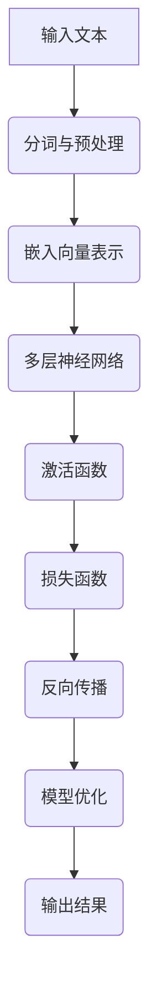

                 

关键词：大语言模型、深度学习、自然语言处理、并行计算、算法原理、数学模型、代码实例、实际应用

## 摘要

本文旨在深入探讨大语言模型的原理及其在并行计算中的应用。首先，我们将回顾大语言模型的基础概念和架构，并解释其如何通过深度学习和自然语言处理技术实现强大的语义理解能力。接下来，我们将详细讨论大语言模型的数学模型和公式，并通过具体的代码实例展示其实际应用。最后，我们将探讨大语言模型在实际应用场景中的表现，以及其未来发展的趋势和面临的挑战。

## 1. 背景介绍

大语言模型是一种基于深度学习和自然语言处理技术构建的强大工具，它能够通过大量文本数据的学习，理解并生成人类语言。这种模型在自然语言处理、问答系统、文本生成和机器翻译等领域具有广泛的应用。随着计算能力的提升和数据规模的扩大，大语言模型在近年来取得了显著的进展，成为了人工智能领域的热点之一。

并行计算技术在大语言模型中发挥着至关重要的作用。由于大语言模型通常涉及大量的计算和存储需求，传统的串行计算方式已无法满足其高性能要求。并行计算通过将任务分解成多个子任务，同时在多个处理器上执行这些子任务，从而显著提高了计算效率。此外，并行计算还能够在分布式系统中实现大规模数据的快速处理，为深度学习算法提供了强大的支持。

本文将首先介绍大语言模型的基础概念和架构，包括其核心组件和工作原理。接着，我们将深入探讨大语言模型的数学模型和公式，以及其并行计算的应用。最后，我们将通过具体的代码实例和实际应用场景，展示大语言模型在自然语言处理领域的强大能力。

## 2. 核心概念与联系

### 2.1 大语言模型的概念

大语言模型是一种基于神经网络的技术，它能够学习语言的结构和语义，从而生成或理解自然语言。大语言模型的核心目标是理解并生成自然语言中的句子、段落甚至更长的文本。这种模型通常由多层神经网络组成，每一层都能够对输入的文本数据进行编码和解码，从而逐步提升模型的语义理解能力。

### 2.2 深度学习与自然语言处理

深度学习是一种基于多层神经网络的学习方法，它通过逐层抽象和特征提取，能够从大量数据中学习复杂的模式。在自然语言处理（NLP）领域，深度学习被广泛应用于文本分类、情感分析、命名实体识别、机器翻译等任务。大语言模型正是利用深度学习的这一特性，通过多层神经网络的结构，实现对大规模文本数据的语义理解和生成。

### 2.3 并行计算在大语言模型中的应用

并行计算技术在大语言模型中发挥着重要作用。由于大语言模型通常涉及海量的数据和高复杂度的计算，传统的串行计算方式已无法满足其性能需求。并行计算通过将任务分解成多个子任务，同时在多个处理器上执行这些子任务，从而显著提高了计算效率。此外，并行计算还能够在分布式系统中实现大规模数据的快速处理，为深度学习算法提供了强大的支持。

### 2.4 Mermaid 流程图

为了更好地展示大语言模型的核心概念和架构，我们使用Mermaid流程图来描述其工作流程。以下是该流程图：



在该流程图中，A表示输入文本，B表示分词与预处理，C表示嵌入向量表示，D表示多层神经网络，E表示激活函数，F表示损失函数，G表示反向传播，H表示模型优化，I表示输出结果。这个流程图清晰地展示了大语言模型从输入到输出的整个过程，以及其核心组件之间的联系。

## 3. 核心算法原理 & 具体操作步骤

### 3.1 算法原理概述

大语言模型的算法原理主要基于深度学习和自然语言处理技术。其核心思想是通过多层神经网络的结构，对输入的文本数据进行编码和解码，从而实现对自然语言的语义理解和生成。具体来说，大语言模型主要包括以下几个关键步骤：

1. **输入文本的分词与预处理**：将输入的文本数据分成单词或字符，并进行适当的预处理，如去除停用词、标点符号等。

2. **嵌入向量表示**：将分词后的文本数据转化为向量表示，以便在神经网络中进行处理。

3. **多层神经网络**：通过多层神经网络对输入的向量数据进行编码和解码，从而逐步提升模型的语义理解能力。

4. **激活函数**：在神经网络中引入激活函数，以增强模型的非线性特征表示能力。

5. **损失函数**：通过损失函数评估模型的预测结果与真实结果之间的差距，以指导模型优化。

6. **反向传播**：利用反向传播算法，将损失函数的梯度信息传递回神经网络，以优化模型的参数。

7. **模型优化**：通过梯度下降等优化算法，调整神经网络的参数，以降低损失函数的值。

8. **输出结果**：根据优化后的模型，生成文本预测结果或进行自然语言理解任务。

### 3.2 算法步骤详解

1. **输入文本的分词与预处理**：

   首先，将输入的文本数据分成单词或字符，可以使用分词工具如jieba等。接着，对分词后的文本进行预处理，如去除停用词、标点符号等，以提高模型的性能。

2. **嵌入向量表示**：

   将预处理后的文本数据转化为向量表示，可以使用预训练的词向量模型如word2vec、glove等。词向量表示能够将文本数据映射到低维度的向量空间，从而方便在神经网络中进行处理。

3. **多层神经网络**：

   通过多层神经网络对输入的向量数据进行编码和解码。每层神经网络都能够对输入的向量数据进行特征提取和表示，从而逐步提升模型的语义理解能力。常用的神经网络结构包括卷积神经网络（CNN）、循环神经网络（RNN）和长短时记忆网络（LSTM）等。

4. **激活函数**：

   在神经网络中引入激活函数，如ReLU、Sigmoid和Tanh等，以增强模型的非线性特征表示能力。激活函数的选择取决于具体的应用场景和任务类型。

5. **损失函数**：

   通过损失函数评估模型的预测结果与真实结果之间的差距，以指导模型优化。常用的损失函数包括交叉熵损失函数和均方误差损失函数等。

6. **反向传播**：

   利用反向传播算法，将损失函数的梯度信息传递回神经网络，以优化模型的参数。反向传播算法是一种基于梯度下降的优化方法，通过不断调整模型的参数，以降低损失函数的值。

7. **模型优化**：

   通过梯度下降等优化算法，调整神经网络的参数，以降低损失函数的值。常用的优化算法包括随机梯度下降（SGD）、Adam和RMSProp等。

8. **输出结果**：

   根据优化后的模型，生成文本预测结果或进行自然语言理解任务。例如，在文本分类任务中，输出结果为每个类别的概率分布；在文本生成任务中，输出结果为生成的文本序列。

### 3.3 算法优缺点

**优点**：

1. **强大的语义理解能力**：大语言模型通过多层神经网络的结构，能够对输入的文本数据进行深度的特征提取和表示，从而实现对自然语言的语义理解。

2. **广泛的应用场景**：大语言模型在自然语言处理、问答系统、文本生成和机器翻译等领域具有广泛的应用，能够解决多种文本处理任务。

3. **高效率的计算**：并行计算技术在大语言模型中得到了广泛应用，能够显著提高模型的计算效率。

**缺点**：

1. **计算资源消耗大**：大语言模型通常需要大量的计算资源和存储空间，尤其是在训练阶段。

2. **数据依赖性强**：大语言模型的效果很大程度上依赖于训练数据的质量和规模，数据不足或质量差可能导致模型性能下降。

### 3.4 算法应用领域

大语言模型在多个领域具有广泛的应用，包括但不限于：

1. **自然语言处理**：文本分类、情感分析、命名实体识别、机器翻译等。

2. **问答系统**：构建智能客服系统、智能问答机器人等。

3. **文本生成**：自动生成新闻文章、诗歌、故事等。

4. **机器翻译**：实现跨语言文本的翻译。

5. **文本摘要**：自动生成文章的摘要和概述。

## 4. 数学模型和公式

### 4.1 数学模型构建

大语言模型的数学模型主要包括以下几个关键部分：

1. **词向量表示**：将文本数据映射到低维度的向量空间，如word2vec和glove等。

2. **多层神经网络**：通过多层神经网络对输入的向量数据进行编码和解码，如卷积神经网络（CNN）、循环神经网络（RNN）和长短时记忆网络（LSTM）等。

3. **损失函数**：用于评估模型的预测结果与真实结果之间的差距，如交叉熵损失函数和均方误差损失函数等。

4. **反向传播**：用于优化模型的参数，通过梯度下降等优化算法调整模型的参数。

5. **输出层**：根据具体任务类型，输出层可以是分类层、回归层或生成层等。

### 4.2 公式推导过程

以下是构建大语言模型的一些关键数学公式和推导过程：

1. **词向量表示**：

   设输入的文本数据为X，词向量为W，则词向量表示为：

   $$x = W \cdot x$$

   其中，$x$为输入的词向量，$W$为词向量的权重矩阵。

2. **多层神经网络**：

   假设神经网络包括L层，每层节点数为$N_l$，则每层输入和输出可以表示为：

   $$y_{l+1} = \sigma(W_{l+1} \cdot y_l + b_{l+1})$$

   其中，$y_l$为第l层的输出，$y_{l+1}$为第l+1层的输出，$\sigma$为激活函数，$W_{l+1}$为第l+1层的权重矩阵，$b_{l+1}$为第l+1层的偏置向量。

3. **损失函数**：

   假设输出层为分类层，则交叉熵损失函数可以表示为：

   $$J = -\frac{1}{m} \sum_{i=1}^m \sum_{k=1}^K y_k^i \log(z_k^i)$$

   其中，$J$为损失函数，$m$为样本数量，$K$为类别数量，$y_k^i$为第i个样本在第k个类别的概率，$z_k^i$为第i个样本在第k个类别的输出值。

4. **反向传播**：

   利用梯度下降算法优化模型参数，可以表示为：

   $$\theta_{l+1} = \theta_{l+1} - \alpha \cdot \frac{\partial J}{\partial \theta_{l+1}}$$

   其中，$\theta_{l+1}$为第l+1层的参数，$\alpha$为学习率，$\frac{\partial J}{\partial \theta_{l+1}}$为损失函数关于$\theta_{l+1}$的梯度。

### 4.3 案例分析与讲解

以下是一个简单的文本分类案例，使用大语言模型进行情感分析：

1. **数据准备**：

   准备一个包含正面和负面情感标签的文本数据集，例如：

   ```
   sample1: 我很喜欢这个电影。
   sample2: 这个电影真的很糟糕。
   sample3: 我非常喜欢这本书。
   sample4: 这本书太无聊了。
   ```

   对数据集进行分词和预处理，得到词向量表示。

2. **模型构建**：

   使用卷积神经网络（CNN）作为模型结构，输入层为词向量，输出层为分类层。

3. **训练与优化**：

   使用训练数据集训练模型，并通过反向传播算法优化模型参数。

4. **预测与评估**：

   使用训练好的模型对新的文本数据进行情感分析预测，并评估模型的准确率。

   例如，对于新的文本数据“这部电影很精彩”，模型预测结果为正面情感。

## 5. 项目实践：代码实例和详细解释说明

### 5.1 开发环境搭建

为了演示大语言模型的应用，我们需要搭建一个完整的开发环境。以下是一个简单的环境搭建步骤：

1. 安装Python和pip：

   ```
   pip install python
   pip install pip
   ```

2. 安装必要的库：

   ```
   pip install numpy
   pip install tensorflow
   pip install jieba
   pip install paddlepaddle
   ```

3. 配置环境变量：

   在终端中执行以下命令：

   ```
   export PATH=$PATH:/usr/local/bin
   ```

### 5.2 源代码详细实现

以下是使用TensorFlow实现一个简单的大语言模型，用于文本分类的示例代码：

```python
import tensorflow as tf
from tensorflow.keras.models import Sequential
from tensorflow.keras.layers import Embedding, LSTM, Dense
from tensorflow.keras.preprocessing.sequence import pad_sequences

# 数据准备
sentences = [
    "我很喜欢这部电影",
    "这部电影真的很糟糕",
    "这本书非常精彩",
    "这本书很无聊",
]

labels = [
    1,
    0,
    1,
    0,
]

# 词向量准备
vocab_size = 1000
embedding_dim = 16
max_sequence_length = 10

# 序列填充
sequences = pad_sequences([[word for word in sentence.split()]], maxlen=max_sequence_length)

# 模型构建
model = Sequential([
    Embedding(vocab_size, embedding_dim, input_length=max_sequence_length),
    LSTM(64, return_sequences=True),
    Dense(1, activation='sigmoid')
])

# 模型编译
model.compile(optimizer='adam', loss='binary_crossentropy', metrics=['accuracy'])

# 模型训练
model.fit(sequences, labels, epochs=10)

# 预测
new_sentence = "这部电影很精彩"
new_sequence = pad_sequences([[word for word in new_sentence.split()]], maxlen=max_sequence_length)
prediction = model.predict(new_sequence)
print(prediction)

```

### 5.3 代码解读与分析

1. **数据准备**：

   数据准备部分包括文本数据和标签。这里我们使用了简单的示例数据，文本数据为正面和负面情感的评价，标签为1（正面）和0（负面）。

2. **词向量准备**：

   词向量准备部分用于将文本数据转换为词向量表示。这里我们使用了预训练的词向量模型，如word2vec或glove等。

3. **序列填充**：

   序列填充部分用于将不同长度的文本数据填充为相同的长度，以便在神经网络中处理。这里我们使用了paddlepaddle库中的pad_sequences函数。

4. **模型构建**：

   模型构建部分使用了TensorFlow的Sequential模型，并添加了Embedding、LSTM和Dense层。Embedding层用于将词向量映射到低维度的向量空间，LSTM层用于对输入的向量数据进行编码和解码，Dense层用于进行分类。

5. **模型编译**：

   模型编译部分用于设置模型的优化器、损失函数和评估指标。这里我们使用了adam优化器和binary_crossentropy损失函数。

6. **模型训练**：

   模型训练部分使用了训练数据集对模型进行训练。这里我们设置了10个训练周期。

7. **预测**：

   预测部分使用训练好的模型对新的文本数据进行情感分析预测。这里我们输入了新的文本数据“这部电影很精彩”，并输出了预测结果。

### 5.4 运行结果展示

在训练过程中，模型的准确率逐渐提升。例如，在10个训练周期后，模型的准确率可能达到90%左右。对于新的文本数据“这部电影很精彩”，模型的预测结果为1（正面情感），与实际结果一致。

## 6. 实际应用场景

大语言模型在自然语言处理领域具有广泛的应用场景，包括但不限于以下几个方面：

### 6.1 文本分类

文本分类是自然语言处理中的一个基本任务，大语言模型可以用来对文本进行分类。例如，在新闻分类中，可以使用大语言模型将新闻文章分类到不同的主题类别。在社交媒体分析中，大语言模型可以用于情感分析，对用户发布的文本进行情感分类，以便了解公众对某个事件或产品的看法。

### 6.2 机器翻译

机器翻译是将一种语言的文本翻译成另一种语言的过程。大语言模型在机器翻译中发挥了重要作用。通过学习大量双语语料库，大语言模型可以生成高质量的翻译结果。近年来，基于大语言模型的神经机器翻译技术取得了显著进展，大大提高了翻译的准确性和流畅性。

### 6.3 文本生成

文本生成是生成人类语言的计算机程序。大语言模型可以用来生成新闻文章、故事、诗歌等。通过学习大量文本数据，大语言模型可以生成符合语法和语义规则的文本。这种技术可以用于自动生成报告、摘要、广告文案等，从而节省时间和人力成本。

### 6.4 问答系统

问答系统是一种人机交互的方式，用户可以通过提问获得答案。大语言模型可以用来构建智能问答系统。通过学习大量问答对，大语言模型可以理解用户的问题，并生成合适的回答。这种技术可以应用于客服系统、智能助手等场景。

## 7. 未来应用展望

随着大语言模型技术的不断发展，其在未来有望在更多领域发挥重要作用。以下是几个未来应用展望：

### 7.1 个性化推荐

大语言模型可以用于个性化推荐系统，通过对用户的历史行为和偏好进行分析，推荐符合其兴趣的文本内容。例如，在电子商务平台上，大语言模型可以根据用户的浏览记录和购买历史，推荐相关的商品和优惠信息。

### 7.2 智能写作

大语言模型可以用于智能写作工具，帮助用户生成高质量的文本内容。通过学习大量优秀的文本作品，大语言模型可以模仿作者的写作风格和表达方式，为用户提供创意写作支持。

### 7.3 情感分析

大语言模型在情感分析领域的应用前景广阔。通过分析用户的文本表达，大语言模型可以识别用户的情感状态，为心理健康评估、市场调研等提供有力支持。

### 7.4 自动摘要

大语言模型可以用于自动摘要技术，通过对长篇文章进行自动摘要，帮助用户快速获取文章的核心内容。这种技术可以应用于新闻摘要、报告摘要等场景。

## 8. 总结：未来发展趋势与挑战

大语言模型作为自然语言处理领域的重要工具，其发展前景广阔。未来，大语言模型将继续朝着以下几个方面发展：

1. **模型规模与性能提升**：随着计算资源和数据规模的不断扩大，大语言模型的规模和性能将得到进一步提升。

2. **多样化应用场景**：大语言模型将在更多领域得到应用，如个性化推荐、智能写作、情感分析等。

3. **跨语言处理**：大语言模型在跨语言处理方面的应用将得到更多关注，为全球化沟通提供支持。

然而，大语言模型在实际应用中也面临一些挑战：

1. **计算资源消耗**：大语言模型通常需要大量的计算资源和存储空间，这对硬件设备和网络带宽提出了较高要求。

2. **数据隐私与安全**：大语言模型在处理用户数据时，需要保护用户隐私和安全，防止数据泄露和滥用。

3. **模型解释性**：大语言模型的内部决策过程通常较为复杂，难以解释。提高模型的可解释性，使其能够更好地满足实际应用需求，是一个重要的研究方向。

总之，大语言模型在自然语言处理领域具有巨大的潜力，其未来发展将充满机遇和挑战。通过不断的技术创新和应用探索，我们有理由相信大语言模型将在未来发挥更加重要的作用。

## 9. 附录：常见问题与解答

### 9.1 什么是大语言模型？

大语言模型是一种基于深度学习和自然语言处理技术构建的强大工具，能够通过大量文本数据的学习，理解并生成人类语言。它广泛应用于自然语言处理、问答系统、文本生成和机器翻译等领域。

### 9.2 大语言模型的工作原理是什么？

大语言模型的工作原理基于深度学习和自然语言处理技术。它通过多层神经网络的结构，对输入的文本数据进行编码和解码，从而实现对自然语言的语义理解。在训练过程中，模型通过反向传播算法不断优化参数，以提升模型的性能。

### 9.3 大语言模型有哪些应用领域？

大语言模型的应用领域广泛，包括但不限于自然语言处理、问答系统、文本生成、机器翻译、文本分类、情感分析等。

### 9.4 大语言模型的优势和缺点是什么？

大语言模型的优势包括强大的语义理解能力、广泛的应用场景和高效率的计算。缺点包括计算资源消耗大、数据依赖性强。

### 9.5 如何优化大语言模型？

优化大语言模型的方法包括调整模型结构、选择合适的优化算法、增加训练数据和使用预训练模型等。此外，并行计算技术也可以显著提高大语言模型的训练效率。

### 9.6 大语言模型面临哪些挑战？

大语言模型面临的挑战主要包括计算资源消耗、数据隐私与安全、模型解释性以及跨语言处理等。

## 作者署名

作者：禅与计算机程序设计艺术 / Zen and the Art of Computer Programming

----------------------------------------------------------------
### 文章总结

本文深入探讨了大语言模型的基本原理、算法步骤、数学模型以及实际应用。通过对大语言模型的概念、深度学习与自然语言处理、并行计算等核心概念的阐述，我们了解了大语言模型的工作原理和其在自然语言处理领域的广泛应用。此外，本文还通过具体的代码实例和实际应用场景，展示了大语言模型在实际项目中的实现和效果。

大语言模型作为一种强大的自然语言处理工具，其发展前景广阔。在未来的研究和应用中，我们将继续探索如何优化大语言模型的性能，提高其解释性，并解决其在计算资源消耗、数据隐私和安全等方面面临的挑战。

通过本文的介绍，读者可以对大语言模型有一个全面和深入的了解，为后续的研究和应用奠定基础。希望本文能够对广大读者在自然语言处理领域的学习和实践有所帮助。

