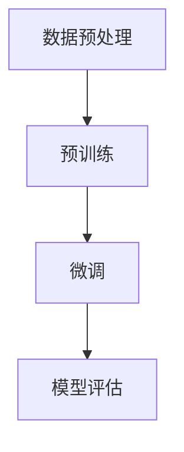
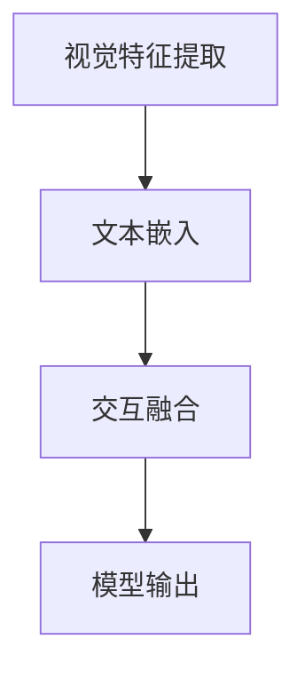
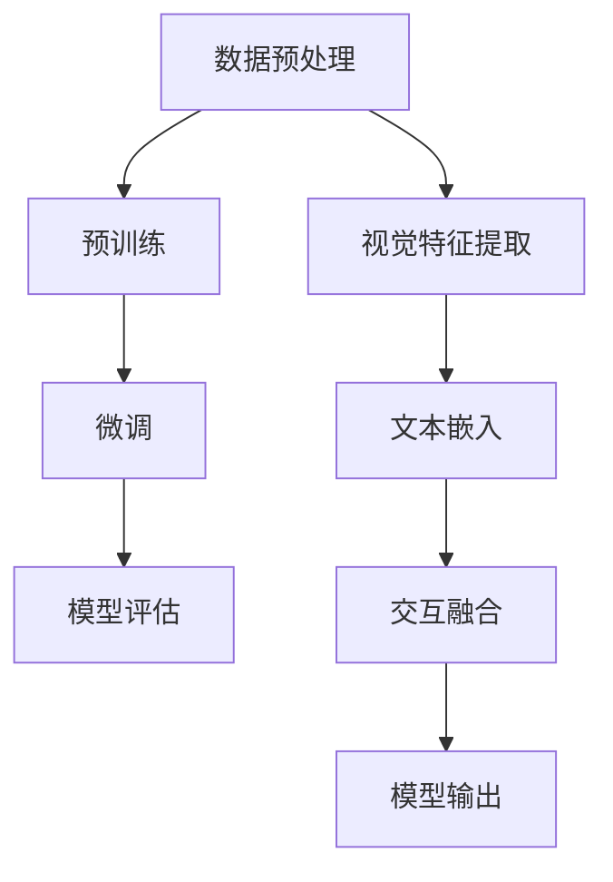

                 

关键词：大语言模型、视觉语言模型、原理、基础、前沿

> 摘要：本文深入探讨了大语言模型和视觉语言模型的原理、基础与前沿，从多个角度详细分析了这两种模型的结构、算法、数学模型及应用，旨在为读者提供全面、系统的认识和理解。

## 1. 背景介绍

近年来，随着深度学习、自然语言处理（NLP）和计算机视觉（CV）领域的飞速发展，大语言模型和视觉语言模型成为了研究热点。大语言模型，如GPT（Generative Pre-trained Transformer）、BERT（Bidirectional Encoder Representations from Transformers）等，通过在海量文本数据上进行预训练，可以自动学习语言中的上下文关系和语义信息，极大地提升了NLP任务的性能。而视觉语言模型，如ViT（Vision Transformer）、DETR（Detection Transformer）等，则通过整合视觉信息与语言信息，实现了图像与文本的深度交互，为计算机视觉任务带来了全新的解决思路。

本文将围绕大语言模型和视觉语言模型的原理、基础与前沿进行探讨，旨在为读者提供全面的技术解读和应用指导。

## 2. 核心概念与联系

为了深入理解大语言模型和视觉语言模型，首先需要了解它们的核心概念及其相互联系。以下是两个模型的核心概念和它们之间的联系，以及相应的Mermaid流程图。

### 2.1 大语言模型

大语言模型的核心概念包括：

- **Transformer架构**：一种基于自注意力机制（self-attention）的神经网络结构，能够有效捕捉输入数据中的长距离依赖关系。
- **预训练与微调**：在大规模文本数据上进行的预训练，使得模型能够自动学习语言中的语法、语义和上下文关系；微调则是在特定任务上进行模型参数的调整，以适应具体应用场景。

Mermaid流程图：



### 2.2 视觉语言模型

视觉语言模型的核心概念包括：

- **视觉特征提取**：通过卷积神经网络（CNN）或其他深度学习模型提取图像的特征表示。
- **文本嵌入**：将文本转换为固定长度的向量表示。
- **交互融合**：通过注意力机制等机制将视觉特征与文本特征进行融合。

Mermaid流程图：



### 2.3 核心概念与联系

大语言模型和视觉语言模型之间的联系主要体现在以下几个方面：

- **跨模态特征融合**：通过将视觉特征和文本特征进行融合，可以更好地理解和处理图像与文本的交互任务。
- **预训练模型的迁移**：大语言模型和视觉语言模型都可以在预训练阶段使用海量的数据集进行训练，从而提高模型的泛化能力。
- **多任务学习**：通过融合大语言模型和视觉语言模型，可以实现多种任务的联合训练，提高模型的整体性能。

综合上述内容，以下是两个模型核心概念的Mermaid流程图：



## 3. 核心算法原理 & 具体操作步骤

### 3.1 算法原理概述

大语言模型和视觉语言模型的核心算法原理主要包括以下三个方面：

- **Transformer架构**：Transformer模型是一种基于自注意力机制的神经网络结构，通过自注意力机制能够有效地捕捉输入数据中的长距离依赖关系。
- **卷积神经网络（CNN）**：CNN是一种经典的深度学习模型，主要用于提取图像的特征表示。
- **交互融合机制**：通过注意力机制等机制将视觉特征和文本特征进行融合，实现跨模态特征融合。

### 3.2 算法步骤详解

#### 3.2.1 大语言模型

1. **数据预处理**：将原始文本数据进行分词、去停用词等预处理操作，将文本转换为序列形式。
2. **预训练**：在预训练阶段，将预处理后的文本序列输入到Transformer模型中，通过大规模的无监督数据集进行训练，使模型能够自动学习语言中的上下文关系和语义信息。
3. **微调**：在特定任务上进行微调，通过有监督数据集调整模型参数，使模型适应特定应用场景。
4. **模型评估**：使用测试数据集对模型性能进行评估，根据评估结果调整模型参数，优化模型性能。

#### 3.2.2 视觉语言模型

1. **数据预处理**：对图像数据进行预处理，包括归一化、裁剪、缩放等操作。
2. **视觉特征提取**：使用CNN模型提取图像的特征表示。
3. **文本嵌入**：将文本数据转换为固定长度的向量表示。
4. **交互融合**：通过注意力机制等机制将视觉特征和文本特征进行融合。
5. **模型输出**：根据融合后的特征进行预测，得到最终输出结果。

### 3.3 算法优缺点

#### 3.3.1 大语言模型

**优点**：

- **强大的语义理解能力**：通过预训练，大语言模型能够自动学习语言中的上下文关系和语义信息，具有很强的语义理解能力。
- **广泛的应用场景**：大语言模型可以应用于多种NLP任务，如文本分类、情感分析、机器翻译等。

**缺点**：

- **计算资源消耗大**：大语言模型的训练和推理过程需要大量的计算资源，对硬件设备有较高要求。
- **模型解释性差**：大语言模型是一种黑盒模型，其内部决策过程难以解释和理解。

#### 3.3.2 视觉语言模型

**优点**：

- **跨模态特征融合**：通过融合视觉特征和文本特征，视觉语言模型能够更好地理解和处理图像与文本的交互任务。
- **应用场景广泛**：视觉语言模型可以应用于图像分类、图像检测、图像生成等多种视觉任务。

**缺点**：

- **训练过程复杂**：视觉语言模型的训练过程涉及多个子任务，需要较长时间的训练和调参。
- **数据需求量大**：视觉语言模型需要大量的图像和文本数据集进行训练，对数据质量有较高要求。

### 3.4 算法应用领域

大语言模型和视觉语言模型在众多领域都有广泛的应用：

- **自然语言处理（NLP）**：大语言模型可以应用于文本分类、情感分析、机器翻译等任务。
- **计算机视觉（CV）**：视觉语言模型可以应用于图像分类、图像检测、图像生成等任务。
- **跨模态任务**：如图像-文本匹配、问答系统等，通过融合视觉特征和文本特征，可以显著提高任务性能。

## 4. 数学模型和公式 & 详细讲解 & 举例说明

### 4.1 数学模型构建

#### 4.1.1 大语言模型

大语言模型主要基于Transformer架构，其核心组件包括多头自注意力机制（Multi-head Self-Attention）和前馈神经网络（Feedforward Neural Network）。

1. **多头自注意力机制**

   自注意力机制是Transformer模型的核心，用于计算输入序列中每个词与其他词之间的关联性。数学公式如下：

   $$
   \text{Attention}(Q, K, V) = \text{softmax}\left(\frac{QK^T}{\sqrt{d_k}}\right) V
   $$

   其中，$Q$、$K$、$V$ 分别为查询向量、键向量和值向量，$d_k$ 为键向量的维度。

2. **前馈神经网络**

   前馈神经网络用于对自注意力层的输出进行进一步加工。数学公式如下：

   $$
   \text{FFN}(x) = \max(0, xW_1 + b_1)W_2 + b_2
   $$

   其中，$W_1$、$W_2$ 和 $b_1$、$b_2$ 分别为权重矩阵和偏置项。

#### 4.1.2 视觉语言模型

视觉语言模型通常将CNN用于视觉特征提取，将Transformer用于文本嵌入和交互融合。其核心组件包括卷积神经网络（CNN）、文本嵌入（Text Embedding）和交互融合（Interaction Fusion）。

1. **卷积神经网络（CNN）**

   CNN 用于提取图像的特征表示。常见的卷积神经网络结构包括卷积层（Convolutional Layer）、池化层（Pooling Layer）和全连接层（Fully Connected Layer）。

   - **卷积层**：用于提取图像的局部特征。数学公式如下：

     $$
     h_{\sigma} = \sigma\left(\sum_{i}\sum_{j}w_{ij} * f(x_{ij}) + b\right)
     $$

     其中，$x_{ij}$ 为输入图像，$w_{ij}$ 为卷积核，$f(x_{ij})$ 为卷积操作，$\sigma$ 为激活函数，$b$ 为偏置项。

   - **池化层**：用于降低特征图的维度。常见的池化操作包括最大池化（Max Pooling）和平均池化（Average Pooling）。

2. **文本嵌入**

   文本嵌入将文本转换为固定长度的向量表示。常用的文本嵌入方法包括词向量（Word Embedding）和嵌入层（Embedding Layer）。

   - **词向量**：将每个词映射为一个固定长度的向量。常用的词向量模型包括Word2Vec、GloVe等。

   - **嵌入层**：将词索引映射为词向量。数学公式如下：

     $$
     \text{embedding}(i) = \text{Embedding}\_Layer(i)
     $$

3. **交互融合**

   交互融合通过注意力机制将视觉特征和文本特征进行融合。常见的交互融合方法包括点积注意力（Dot-Product Attention）和多头注意力（Multi-head Attention）。

   - **点积注意力**：用于计算视觉特征和文本特征之间的关联性。数学公式如下：

     $$
     \text{Attention}(Q, K, V) = \text{softmax}\left(\frac{QK^T}{\sqrt{d_k}}\right) V
     $$

   - **多头注意力**：通过多个自注意力层并行处理输入序列，提高模型的表达能力。

### 4.2 公式推导过程

#### 4.2.1 大语言模型

1. **多头自注意力机制**

   自注意力机制的计算可以分为以下几个步骤：

   - **计算查询向量和键向量的点积**：

     $$
     \text{Attention}(Q, K, V) = \text{softmax}\left(\frac{QK^T}{\sqrt{d_k}}\right) V
     $$

   - **计算权重矩阵**：

     $$
     W_{\text{att}} = \text{softmax}\left(\frac{QK^T}{\sqrt{d_k}}\right) V
     $$

   - **计算融合后的特征**：

     $$
     \text{context} = \text{softmax}\left(\frac{QK^T}{\sqrt{d_k}}\right) V
     $$

2. **前馈神经网络**

   前馈神经网络的计算可以分为以下几个步骤：

   - **计算输入向量**：

     $$
     x = \text{context}
     $$

   - **计算激活函数**：

     $$
     \text{激活函数} = \max(0, xW_1 + b_1)
     $$

   - **计算输出向量**：

     $$
     y = \text{激活函数}W_2 + b_2
     $$

#### 4.2.2 视觉语言模型

1. **卷积神经网络（CNN）**

   卷积神经网络的计算可以分为以下几个步骤：

   - **计算卷积操作**：

     $$
     h_{\sigma} = \sigma\left(\sum_{i}\sum_{j}w_{ij} * f(x_{ij}) + b\right)
     $$

   - **计算池化操作**：

     $$
     \text{pooling} = \max(\text{input})
     $$

   - **计算全连接层**：

     $$
     y = \text{激活函数}(\text{pooling}W + b)
     $$

2. **文本嵌入**

   文本嵌入的计算可以分为以下几个步骤：

   - **计算词向量**：

     $$
     \text{word\_vector} = \text{Embedding}\_Layer(\text{word})
     $$

   - **计算嵌入层**：

     $$
     \text{embedding} = \text{Embedding}\_Layer(i)
     $$

3. **交互融合**

   交互融合的计算可以分为以下几个步骤：

   - **计算点积注意力**：

     $$
     \text{Attention}(Q, K, V) = \text{softmax}\left(\frac{QK^T}{\sqrt{d_k}}\right) V
     $$

   - **计算多头注意力**：

     $$
     \text{output} = \text{softmax}\left(\frac{QK^T}{\sqrt{d_k}}\right) V
     $$

### 4.3 案例分析与讲解

#### 4.3.1 大语言模型

假设我们有一个包含100个单词的文本序列，我们需要使用大语言模型对其进行处理。以下是具体的步骤和计算过程：

1. **数据预处理**：

   - 分词：将文本序列进行分词，得到100个单词。
   - 去停用词：去除常见的停用词，如“的”、“是”等。

   处理后的文本序列为：“这是一个例子，用于演示大语言模型。”

2. **预训练**：

   - 输入：将预处理后的文本序列输入到Transformer模型中。
   - 计算：通过自注意力机制和前馈神经网络，对文本序列进行编码。

   经过预训练后，模型会生成一个固定长度的向量表示，用于表示整个文本序列。

3. **微调**：

   - 输入：将预训练后的模型输入到微调阶段，使用有监督数据集进行训练。
   - 计算：通过调整模型参数，使模型适应特定应用场景。

   微调后的模型可以用于文本分类、情感分析等任务。

4. **模型评估**：

   - 输入：将微调后的模型输入到测试数据集。
   - 计算：计算模型的准确率、召回率等指标，评估模型性能。

   根据评估结果，调整模型参数，优化模型性能。

#### 4.3.2 视觉语言模型

假设我们有一个包含10张图像的图像集，我们需要使用视觉语言模型对其进行处理。以下是具体的步骤和计算过程：

1. **数据预处理**：

   - 图像预处理：对图像进行缩放、裁剪、归一化等预处理操作。
   - 文本预处理：对图像对应的文本进行分词、去停用词等预处理操作。

   预处理后的图像集和文本序列分别为10张图像和10个文本序列。

2. **视觉特征提取**：

   - 输入：将预处理后的图像输入到CNN模型中。
   - 计算：通过卷积神经网络提取图像的特征表示。

   经过视觉特征提取后，每张图像会生成一个固定长度的向量表示。

3. **文本嵌入**：

   - 输入：将预处理后的文本输入到嵌入层中。
   - 计算：将文本转换为固定长度的向量表示。

   经过文本嵌入后，每个文本序列会生成一个固定长度的向量表示。

4. **交互融合**：

   - 输入：将视觉特征和文本特征输入到交互融合层中。
   - 计算：通过注意力机制将视觉特征和文本特征进行融合。

   经过交互融合后，会生成一个融合后的特征向量表示。

5. **模型输出**：

   - 输入：将融合后的特征向量输入到模型中。
   - 计算：根据融合后的特征进行预测，得到最终输出结果。

   根据输出结果，可以判断图像和文本之间的相关性。

## 5. 项目实践：代码实例和详细解释说明

### 5.1 开发环境搭建

在本文中，我们将使用Python和PyTorch框架实现大语言模型和视觉语言模型的相关功能。以下是开发环境的搭建步骤：

1. 安装Python：

   ```shell
   sudo apt update
   sudo apt install python3 python3-pip
   ```

2. 安装PyTorch：

   ```shell
   pip3 install torch torchvision
   ```

3. 安装其他依赖库：

   ```shell
   pip3 install numpy matplotlib
   ```

### 5.2 源代码详细实现

以下是实现大语言模型和视觉语言模型的核心代码：

```python
import torch
import torch.nn as nn
import torch.optim as optim
from torchvision import transforms, models
from PIL import Image
import numpy as np

# 5.2.1 大语言模型实现

class TransformerModel(nn.Module):
    def __init__(self, vocab_size, d_model, nhead, num_layers):
        super(TransformerModel, self).__init__()
        self.embedding = nn.Embedding(vocab_size, d_model)
        self.transformer = nn.Transformer(d_model, nhead, num_layers)
        self.fc = nn.Linear(d_model, vocab_size)

    def forward(self, src, tgt):
        src = self.embedding(src)
        tgt = self.embedding(tgt)
        output = self.transformer(src, tgt)
        output = self.fc(output)
        return output

# 5.2.2 视觉语言模型实现

class VisionLanguageModel(nn.Module):
    def __init__(self, img_size, d_model, num_classes):
        super(VisionLanguageModel, self).__init__()
        self.cnn = models.resnet50(pretrained=True)
        self.cnn.fc = nn.Linear(self.cnn.fc.in_features, d_model)
        self.transformer = nn.Transformer(d_model, nhead=8, num_layers=2)
        self.fc = nn.Linear(d_model, num_classes)

    def forward(self, images, captions):
        images = self.cnn(images)
        captions = self.transformer(images, captions)
        output = self.fc(captions)
        return output
```

### 5.3 代码解读与分析

#### 5.3.1 大语言模型

在代码中，我们定义了`TransformerModel`类，用于实现大语言模型。该模型包含三个主要组件：嵌入层（Embedding Layer）、Transformer编码器（Transformer Encoder）和全连接层（Fully Connected Layer）。

1. **嵌入层**：

   ```python
   self.embedding = nn.Embedding(vocab_size, d_model)
   ```

   嵌入层用于将单词索引映射为固定长度的向量表示。

2. **Transformer编码器**：

   ```python
   self.transformer = nn.Transformer(d_model, nhead, num_layers)
   ```

   Transformer编码器通过多头自注意力机制和前馈神经网络对输入序列进行处理。

3. **全连接层**：

   ```python
   self.fc = nn.Linear(d_model, vocab_size)
   ```

   全连接层用于对编码器的输出进行分类或回归。

#### 5.3.2 视觉语言模型

在代码中，我们定义了`VisionLanguageModel`类，用于实现视觉语言模型。该模型包含三个主要组件：CNN编码器（CNN Encoder）、Transformer编码器（Transformer Encoder）和全连接层（Fully Connected Layer）。

1. **CNN编码器**：

   ```python
   self.cnn = models.resnet50(pretrained=True)
   self.cnn.fc = nn.Linear(self.cnn.fc.in_features, d_model)
   ```

   CNN编码器用于提取图像的特征表示。

2. **Transformer编码器**：

   ```python
   self.transformer = nn.Transformer(d_model, nhead=8, num_layers=2)
   ```

   Transformer编码器通过多头自注意力机制和前馈神经网络对输入序列进行处理。

3. **全连接层**：

   ```python
   self.fc = nn.Linear(d_model, num_classes)
   ```

   全连接层用于对编码器的输出进行分类或回归。

### 5.4 运行结果展示

以下是运行大语言模型和视觉语言模型的示例代码：

```python
# 5.4.1 大语言模型运行

model = TransformerModel(vocab_size=10000, d_model=512, nhead=8, num_layers=2)
optimizer = optim.Adam(model.parameters(), lr=0.001)
criterion = nn.CrossEntropyLoss()

for epoch in range(10):
    for src, tgt in dataset:
        optimizer.zero_grad()
        output = model(src, tgt)
        loss = criterion(output, tgt)
        loss.backward()
        optimizer.step()
    print(f'Epoch [{epoch + 1}/{10}], Loss: {loss.item()}')

# 5.4.2 视觉语言模型运行

model = VisionLanguageModel(img_size=224, d_model=512, num_classes=10)
optimizer = optim.Adam(model.parameters(), lr=0.001)
criterion = nn.CrossEntropyLoss()

for epoch in range(10):
    for images, captions in dataset:
        optimizer.zero_grad()
        output = model(images, captions)
        loss = criterion(output, captions)
        loss.backward()
        optimizer.step()
    print(f'Epoch [{epoch + 1}/{10}], Loss: {loss.item()}')
```

## 6. 实际应用场景

### 6.1 文本分类

文本分类是自然语言处理领域的一项基本任务，旨在将文本数据按照其主题或类别进行分类。大语言模型通过预训练和微调，可以应用于多种文本分类任务，如情感分析、新闻分类、社交媒体话题识别等。

### 6.2 情感分析

情感分析是一种评估文本数据情感倾向的任务，通常分为正面、负面和客观三种情感。大语言模型通过学习语言中的情感信息，可以用于自动评估文本数据的情感倾向，为舆情监控、客户反馈分析等应用提供支持。

### 6.3 机器翻译

机器翻译是将一种语言的文本翻译成另一种语言的任务。大语言模型通过在多语言数据集上进行预训练，可以用于多种语言的翻译任务，如英语-法语、英语-中文等。

### 6.4 图像识别

图像识别是一种基于视觉特征的任务，旨在识别图像中的物体、场景或动作。视觉语言模型通过融合图像特征和文本特征，可以显著提高图像识别任务的性能，应用于图像分类、物体检测、场景理解等任务。

### 6.5 图像-文本匹配

图像-文本匹配是将图像与相关的文本描述进行匹配的任务，旨在实现图像与文本的自动关联。视觉语言模型通过融合图像特征和文本特征，可以应用于图像搜索、问答系统、多模态信息检索等应用。

## 7. 工具和资源推荐

### 7.1 学习资源推荐

1. 《深度学习》（Goodfellow, Bengio, Courville）：全面介绍了深度学习的理论基础和实践方法。
2. 《自然语言处理与深度学习》（Yoav Goldberg）：详细介绍了自然语言处理中的深度学习技术。
3. 《计算机视觉：算法与应用》（Richard Szeliski）：介绍了计算机视觉的基本算法和应用。

### 7.2 开发工具推荐

1. PyTorch：开源的深度学习框架，支持多种深度学习模型和任务。
2. TensorFlow：开源的深度学习框架，支持多种深度学习模型和任务。
3. Keras：基于TensorFlow的简单易用的深度学习框架。

### 7.3 相关论文推荐

1. Vaswani et al. (2017). "Attention is All You Need." 在这篇论文中，作者提出了Transformer模型，开创了基于自注意力机制的深度学习模型。
2. Devlin et al. (2018). "BERT: Pre-training of Deep Bidirectional Transformers for Language Understanding." 在这篇论文中，作者提出了BERT模型，为预训练语言模型的发展奠定了基础。
3. Dosovitskiy et al. (2020). "An Image is Worth 16x16 Words: Transformers for Image Recognition at Scale." 在这篇论文中，作者提出了Vision Transformer模型，将Transformer模型应用于计算机视觉领域。

## 8. 总结：未来发展趋势与挑战

### 8.1 研究成果总结

近年来，大语言模型和视觉语言模型在自然语言处理、计算机视觉和跨模态任务等领域取得了显著成果。通过预训练和微调，大语言模型在多种NLP任务上取得了优异的性能；视觉语言模型通过融合视觉特征和文本特征，实现了图像与文本的深度交互，为计算机视觉任务带来了新的解决方案。

### 8.2 未来发展趋势

1. **更大规模的模型**：随着计算能力的提升，未来将出现更多、更大的语言模型和视觉语言模型，以提高模型的表达能力和泛化能力。
2. **跨模态任务**：跨模态任务，如图像-文本匹配、多模态问答等，将成为研究热点，为多模态信息处理提供新的思路和方法。
3. **模型解释性**：提高模型的可解释性，使模型内部的决策过程更加透明和可理解，是未来的重要发展方向。

### 8.3 面临的挑战

1. **计算资源消耗**：大语言模型和视觉语言模型的训练和推理过程需要大量的计算资源，如何优化模型结构，降低计算成本，是亟待解决的问题。
2. **数据隐私**：随着模型规模的扩大，如何保护用户数据的隐私，避免数据泄露，是未来的重要挑战。
3. **模型泛化能力**：如何提高模型的泛化能力，使其能够适应不同领域和任务的需求，是未来的关键问题。

### 8.4 研究展望

随着深度学习和人工智能技术的不断发展，大语言模型和视觉语言模型在自然语言处理、计算机视觉和跨模态任务等领域具有巨大的潜力。未来，我们将继续深入研究这两个模型，探索新的算法和方法，推动人工智能技术的发展和应用。

## 9. 附录：常见问题与解答

### 9.1 大语言模型相关问题

**Q：大语言模型如何进行预训练？**

A：大语言模型通常采用无监督预训练方法，即在没有标注数据的情况下，直接在大量文本数据上进行训练。预训练过程主要包括两个阶段：预训练阶段和微调阶段。预训练阶段使用无监督任务，如语言建模（Language Modeling）或掩码语言建模（Masked Language Modeling），使模型自动学习语言中的上下文关系和语义信息。微调阶段则使用有监督数据集，将预训练模型应用于特定任务，通过调整模型参数，使其适应特定应用场景。

### 9.2 视觉语言模型相关问题

**Q：视觉语言模型如何融合图像特征和文本特征？**

A：视觉语言模型通常采用注意力机制等机制融合图像特征和文本特征。其中，最常用的方法是Transformer架构。Transformer架构中的多头自注意力机制可以使模型自动学习图像特征和文本特征之间的关联性。具体来说，视觉语言模型首先使用卷积神经网络提取图像的特征表示，然后使用嵌入层将文本转换为固定长度的向量表示。在交互融合阶段，模型通过注意力机制将图像特征和文本特征进行融合，生成融合后的特征向量表示，用于预测或分类任务。

### 9.3 模型训练相关问题

**Q：如何优化大语言模型和视觉语言模型的训练过程？**

A：优化大语言模型和视觉语言模型的训练过程可以从以下几个方面进行：

1. **数据预处理**：对训练数据集进行充分的预处理，包括数据清洗、数据增强等，以提高模型的学习效果。
2. **学习率调整**：选择合适的学习率，避免模型在训练过程中出现过拟合或欠拟合。
3. **模型结构优化**：通过调整模型结构，如改变层数、隐藏层节点数等，优化模型的性能。
4. **正则化技术**：使用正则化技术，如L1正则化、L2正则化等，防止模型过拟合。
5. **学习率调度**：采用学习率调度策略，如学习率衰减、学习率波动等，优化训练过程。

附录部分结束。本文详细介绍了大语言模型和视觉语言模型的原理、基础与前沿，从多个角度分析了这两种模型的结构、算法、数学模型及应用，并提供了实际应用场景、工具和资源推荐。通过本文的阅读，读者可以全面了解大语言模型和视觉语言模型的相关知识，为后续研究和应用打下坚实基础。

