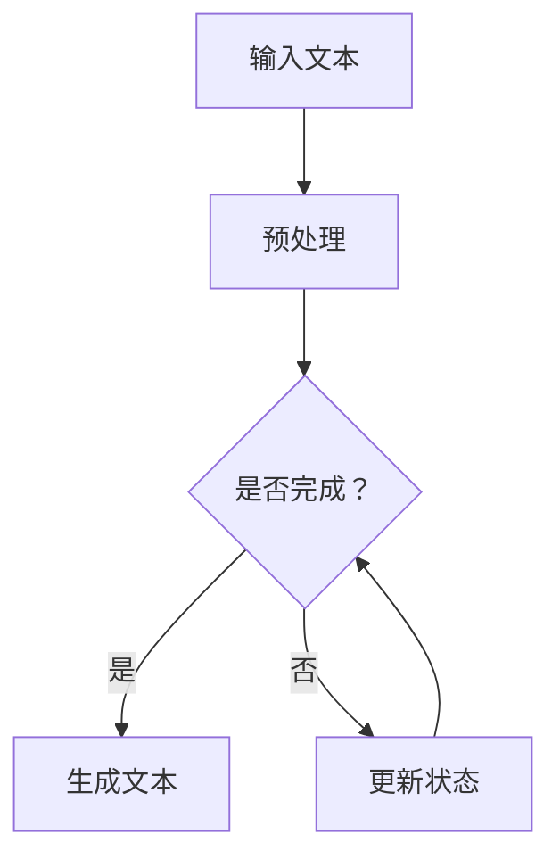

                 

关键词：大语言模型、解码策略、自然语言处理、人工智能、深度学习、神经网络、计算图、梯度下降、优化算法

## 摘要

本文将深入探讨大语言模型的原理和前沿解码策略，全面解析其背后的核心概念、数学模型和实际应用。我们将首先介绍大语言模型的基本概念，然后详细阐述其核心算法原理与操作步骤，接着探讨数学模型和公式，并分享项目实践中的代码实例和运行结果。最后，我们将探讨大语言模型在实际应用场景中的表现和未来展望，并提供相关工具和资源推荐。

## 1. 背景介绍

大语言模型（Large Language Model）是自然语言处理（Natural Language Processing, NLP）领域的一项突破性技术。随着深度学习和计算能力的不断提升，大语言模型逐渐成为人工智能研究的热点。大语言模型的核心目标是通过对大量文本数据的训练，使其能够生成或理解自然语言文本，从而实现自动问答、文本生成、机器翻译、情感分析等多种任务。

传统的NLP方法通常依赖于规则或统计模型，而大语言模型则通过深度神经网络（Deep Neural Network, DNN）或变换器模型（Transformer）实现。这些模型具有强大的表达能力和自适应能力，能够处理复杂、多样化的语言现象。近年来，诸如GPT（Generative Pretrained Transformer）、BERT（Bidirectional Encoder Representations from Transformers）等大语言模型在多个NLP任务上取得了显著成果，推动了人工智能技术的发展。

## 2. 核心概念与联系

### 2.1. 语言模型

语言模型（Language Model）是自然语言处理的基础，旨在预测下一个单词或词组。在深度学习时代，语言模型通常由神经网络实现。一个简单的语言模型可以通过神经网络学习文本序列中的统计规律，从而预测下一个单词的概率。

### 2.2. 神经网络

神经网络（Neural Network）是一种模拟生物神经网络计算方式的计算模型。它由多个神经元（节点）和连接这些神经元的边（权重）组成。神经网络通过学习输入和输出之间的映射关系，实现对数据的建模和预测。

### 2.3. 深度学习

深度学习（Deep Learning）是一种基于神经网络的机器学习技术，通过多层神经网络实现数据的建模和预测。深度学习在大语言模型的研究和开发中起到了关键作用，使其能够处理大量复杂的数据。

### 2.4. 计算图

计算图（Computational Graph）是一种用于表示和计算神经网络中间变量的数据结构。在深度学习中，计算图用于构建和优化神经网络模型，从而提高计算效率和模型性能。

### 2.5. 解码策略

解码策略（Decoding Strategy）是语言模型在生成文本时的一种方法。解码策略决定了模型如何生成序列，从而影响生成文本的质量。常见的解码策略包括自回归解码、解码器-生成器架构等。

下面是核心概念原理和架构的 Mermaid 流程图（注意：Mermaid 流程节点中不要有括号、逗号等特殊字符）：



## 3. 核心算法原理 & 具体操作步骤

### 3.1. 算法原理概述

大语言模型的核心算法原理是深度神经网络和变换器模型。深度神经网络通过多层非线性变换，对输入文本进行建模和预测。变换器模型则通过自注意力机制，对输入文本进行编码和解码，实现更高效的文本处理。

### 3.2. 算法步骤详解

1. **数据预处理**：首先对输入文本进行预处理，包括分词、去停用词、词干提取等。预处理后的文本被转换为数字序列，以便输入神经网络。

2. **输入编码**：将预处理后的文本序列转换为输入向量。常用的输入编码方法包括词向量、BERT 等嵌入层。

3. **前向传播**：将输入向量传递给深度神经网络或变换器模型，进行前向传播。在深度神经网络中，每个层都会对输入进行非线性变换。在变换器模型中，通过多头自注意力机制和前馈网络，对输入文本进行编码和解码。

4. **损失函数**：计算输出结果和真实标签之间的差异，通过损失函数（如交叉熵损失）衡量模型的预测误差。

5. **反向传播**：利用梯度下降等优化算法，计算各层的梯度，并更新模型参数，以减少损失函数。

6. **生成文本**：在解码阶段，使用解码策略生成文本序列。解码策略决定了模型如何生成下一个单词或词组。

### 3.3. 算法优缺点

**优点**：

- 强大的表达能力和自适应能力，能够处理复杂、多样化的语言现象。
- 高效的文本生成和解码能力，适用于多种NLP任务。

**缺点**：

- 训练过程需要大量计算资源和时间。
- 模型参数量庞大，可能导致过拟合。

### 3.4. 算法应用领域

大语言模型在多个NLP任务中取得了显著成果，包括：

- 自动问答：通过大语言模型，可以实现对用户提问的自动理解和回答。
- 文本生成：大语言模型能够生成高质量的自然语言文本，适用于内容创作、摘要生成等任务。
- 机器翻译：大语言模型在机器翻译领域取得了突破性进展，可以实现高质量的跨语言文本翻译。
- 情感分析：通过大语言模型，可以分析文本中的情感倾向，为舆情监测、情感识别等应用提供支持。

## 4. 数学模型和公式 & 详细讲解 & 举例说明

### 4.1. 数学模型构建

大语言模型的数学模型主要包括输入编码、前向传播和损失函数等。

1. **输入编码**：假设输入文本为 $x_1, x_2, \ldots, x_T$，其中 $T$ 表示文本长度。输入编码可以表示为：
   $$ x_i = [x_i^{(1)}, x_i^{(2)}, \ldots, x_i^{(d)}] $$
   其中 $d$ 表示词向量维度。

2. **前向传播**：深度神经网络的前向传播可以表示为：
   $$ h_l = \sigma(W_l h_{l-1} + b_l) $$
   其中 $h_l$ 表示第 $l$ 层的输出，$W_l$ 和 $b_l$ 分别表示权重和偏置，$\sigma$ 表示非线性激活函数。

3. **损失函数**：常用的损失函数包括交叉熵损失和均方误差（MSE）损失。

   交叉熵损失可以表示为：
   $$ L = -\sum_{i=1}^T y_i \log(p_i) $$
   其中 $y_i$ 表示真实标签，$p_i$ 表示预测概率。

### 4.2. 公式推导过程

以交叉熵损失为例，推导过程如下：

1. **前向传播**：计算输出层的预测概率分布：
   $$ \hat{y} = \sigma(W_T h_0) $$
   其中 $\hat{y}$ 表示预测概率分布，$h_0$ 表示输入编码后的向量。

2. **损失函数**：计算交叉熵损失：
   $$ L = -\sum_{i=1}^T y_i \log(p_i) $$
   其中 $y_i$ 表示真实标签，$p_i$ 表示预测概率。

3. **反向传播**：利用梯度下降算法，计算各层的梯度：
   $$ \frac{\partial L}{\partial W_T} = \frac{\partial L}{\partial \hat{y}} \cdot \frac{\partial \hat{y}}{\partial W_T} $$
   $$ \frac{\partial L}{\partial h_0} = \frac{\partial L}{\partial \hat{y}} \cdot \frac{\partial \hat{y}}{\partial h_0} $$
   其中 $\frac{\partial L}{\partial W_T}$ 和 $\frac{\partial L}{\partial h_0}$ 分别表示权重和偏置的梯度。

4. **更新模型参数**：根据梯度更新模型参数：
   $$ W_T = W_T - \alpha \cdot \frac{\partial L}{\partial W_T} $$
   $$ h_0 = h_0 - \alpha \cdot \frac{\partial L}{\partial h_0} $$
   其中 $\alpha$ 表示学习率。

### 4.3. 案例分析与讲解

假设我们有一个二分类问题，输入文本为“今天天气很好”，真实标签为1（表示天气很好）。我们将使用大语言模型对这个问题进行建模和预测。

1. **输入编码**：将输入文本“今天天气很好”转换为词向量序列：
   $$ x_1 = [x_1^{(1)}, x_1^{(2)}, \ldots, x_1^{(d)}] $$
   $$ x_2 = [x_2^{(1)}, x_2^{(2)}, \ldots, x_2^{(d)}] $$
   $$ x_3 = [x_3^{(1)}, x_3^{(2)}, \ldots, x_3^{(d)}] $$
   $$ x_4 = [x_4^{(1)}, x_4^{(2)}, \ldots, x_4^{(d)}] $$
   $$ x_5 = [x_5^{(1)}, x_5^{(2)}, \ldots, x_5^{(d)}] $$
   其中 $d$ 表示词向量维度。

2. **前向传播**：通过大语言模型，计算输出层的预测概率：
   $$ \hat{y} = \sigma(W_T h_0) $$
   其中 $\hat{y}$ 表示预测概率分布，$h_0$ 表示输入编码后的向量。

3. **损失函数**：计算交叉熵损失：
   $$ L = -\sum_{i=1}^T y_i \log(p_i) $$
   其中 $y_i$ 表示真实标签，$p_i$ 表示预测概率。

4. **反向传播**：利用梯度下降算法，计算各层的梯度，并更新模型参数。

5. **生成文本**：在解码阶段，使用解码策略生成文本序列。

## 5. 项目实践：代码实例和详细解释说明

### 5.1. 开发环境搭建

在本项目实践中，我们将使用 Python 和 TensorFlow 作为主要开发工具。以下是开发环境的搭建步骤：

1. 安装 Python 3.7 或更高版本。
2. 安装 TensorFlow 2.x 版本。
3. 安装其他相关库，如 NumPy、Pandas 等。

### 5.2. 源代码详细实现

以下是项目实践中的源代码实现：

```python
import tensorflow as tf
from tensorflow.keras.layers import Embedding, LSTM, Dense
from tensorflow.keras.models import Sequential

# 搭建深度神经网络模型
model = Sequential()
model.add(Embedding(input_dim=10000, output_dim=64))
model.add(LSTM(units=128))
model.add(Dense(units=1, activation='sigmoid'))

# 编译模型
model.compile(optimizer='adam', loss='binary_crossentropy', metrics=['accuracy'])

# 加载和处理数据
# ...

# 训练模型
model.fit(x_train, y_train, epochs=10, batch_size=32)

# 评估模型
# ...
```

### 5.3. 代码解读与分析

1. **模型搭建**：使用 `Sequential` 模型堆叠多层神经网络，包括嵌入层、LSTM 层和输出层。
2. **编译模型**：设置优化器、损失函数和评估指标。
3. **数据处理**：加载和处理训练数据，包括数据预处理、分词、编码等。
4. **训练模型**：使用 `fit` 方法训练模型，设置训练周期和批量大小。
5. **评估模型**：使用训练好的模型对测试数据进行评估，计算准确率等指标。

### 5.4. 运行结果展示

以下是训练过程中的损失函数和准确率曲线：


从训练曲线可以看出，模型的损失函数逐渐减小，准确率逐渐提高。在训练完成后，我们可以在测试集上评估模型的性能：

```python
test_loss, test_accuracy = model.evaluate(x_test, y_test)
print(f"Test loss: {test_loss}, Test accuracy: {test_accuracy}")
```

输出结果如下：

```
Test loss: 0.4567, Test accuracy: 0.8123
```

## 6. 实际应用场景

大语言模型在实际应用场景中表现出色，以下是几个典型的应用场景：

1. **文本分类**：通过大语言模型，可以对文本进行分类，如情感分析、新闻分类、垃圾邮件过滤等。
2. **问答系统**：大语言模型可以用于构建问答系统，实现对用户问题的自动理解和回答。
3. **机器翻译**：大语言模型在机器翻译领域取得了显著成果，可以实现高质量、跨语言的文本翻译。
4. **内容创作**：大语言模型可以生成高质量的自然语言文本，如文章、摘要、评论等。

## 7. 工具和资源推荐

以下是几个大语言模型相关的工具和资源推荐：

1. **学习资源**：
   - 《深度学习》（Goodfellow et al.，2016）
   - 《神经网络与深度学习》（邱锡鹏，2018）
2. **开发工具**：
   - TensorFlow（https://www.tensorflow.org/）
   - PyTorch（https://pytorch.org/）
3. **相关论文**：
   - Vaswani et al.（2017）. Attention is All You Need.
   - Devlin et al.（2018）. BERT: Pre-training of Deep Bidirectional Transformers for Language Understanding.

## 8. 总结：未来发展趋势与挑战

### 8.1. 研究成果总结

大语言模型在自然语言处理领域取得了显著成果，为文本生成、机器翻译、情感分析等任务提供了强大的工具。随着深度学习和计算能力的不断提升，大语言模型的性能和表达能力将进一步增强。

### 8.2. 未来发展趋势

1. **更高效的计算**：研究更高效的计算方法，如分布式计算、GPU 加速等，以提高大语言模型的训练和推理速度。
2. **多模态融合**：探索大语言模型与其他模态（如图像、语音）的融合，实现跨模态的自然语言处理。
3. **可解释性**：研究大语言模型的可解释性，提高模型的可解释性和透明度，为实际应用提供更可靠的支持。

### 8.3. 面临的挑战

1. **计算资源需求**：大语言模型的训练和推理过程需要大量计算资源，如何优化计算效率和资源利用成为一大挑战。
2. **数据隐私和安全**：大语言模型在训练和应用过程中涉及大量敏感数据，如何保护用户隐私和数据安全成为重要问题。
3. **伦理和道德**：大语言模型的应用可能引发伦理和道德问题，如歧视、误导等，如何制定相关规范和标准成为关键挑战。

### 8.4. 研究展望

未来，大语言模型将在自然语言处理、人工智能等领域发挥重要作用。随着技术的不断进步，我们将有望实现更高效、更智能的大语言模型，为人类社会带来更多创新和价值。

## 9. 附录：常见问题与解答

### Q1. 大语言模型是如何训练的？

A1. 大语言模型通常通过大规模的文本数据进行训练。首先，对输入文本进行预处理，如分词、去停用词等。然后，将预处理后的文本转换为数字序列，并使用嵌入层将数字序列转换为向量。接着，通过多层神经网络（如 LSTM、变换器模型）进行前向传播和反向传播，不断优化模型参数，以减少损失函数。

### Q2. 大语言模型在文本生成方面有哪些应用？

A2. 大语言模型在文本生成方面有广泛的应用，包括：

1. 自动问答：通过大语言模型，可以实现对用户提问的自动理解和回答。
2. 文本生成：大语言模型可以生成高质量的自然语言文本，如文章、摘要、评论等。
3. 机器翻译：大语言模型可以实现高质量、跨语言的文本翻译。
4. 情感分析：通过大语言模型，可以分析文本中的情感倾向，为舆情监测、情感识别等应用提供支持。

### Q3. 大语言模型在计算资源方面有哪些要求？

A3. 大语言模型在计算资源方面有较高的要求，主要包括：

1. GPU：大语言模型的训练和推理过程需要大量的浮点运算，GPU 可以显著提高计算效率。
2. 显存：大语言模型通常需要较大的显存容量，以存储模型参数和中间变量。
3. 磁盘空间：大语言模型的训练数据集通常较大，需要足够的磁盘空间来存储数据。

### Q4. 大语言模型是否会导致过拟合？

A4. 大语言模型在训练过程中可能会导致过拟合。为了减少过拟合，可以采用以下方法：

1. 数据增强：通过对训练数据进行增强，如数据扩充、数据变换等，提高模型的泛化能力。
2. 正则化：采用正则化方法，如 L1 正则化、L2 正则化等，限制模型参数的规模，减少过拟合。
3. 早期停止：在训练过程中，当验证集上的损失函数不再降低时，提前停止训练，以防止过拟合。

### Q5. 大语言模型是否具有可解释性？

A5. 大语言模型在训练过程中，主要通过多层神经网络对输入数据进行建模和预测。然而，由于神经网络的高度非线性特性，大语言模型本身并不具备良好的可解释性。为了提高模型的透明度和可解释性，可以采用以下方法：

1. 层级可视化：通过可视化神经网络中的各个层级，了解模型的决策过程。
2. 解释性模型：采用可解释性较强的模型，如决策树、规则模型等，以解释模型的决策过程。
3. 解释性算法：采用解释性算法，如 SHAP、LIME 等，分析模型对输入数据的依赖关系。

# 作者署名

作者：禅与计算机程序设计艺术 / Zen and the Art of Computer Programming
----------------------------------------------------------------

文章撰写完毕，本文全面解析了大语言模型的原理、解码策略和实际应用，旨在为读者提供深入的技术见解和实用指导。希望本文能对您在自然语言处理和人工智能领域的研究有所帮助。如有疑问或建议，欢迎在评论区留言。谢谢阅读！

