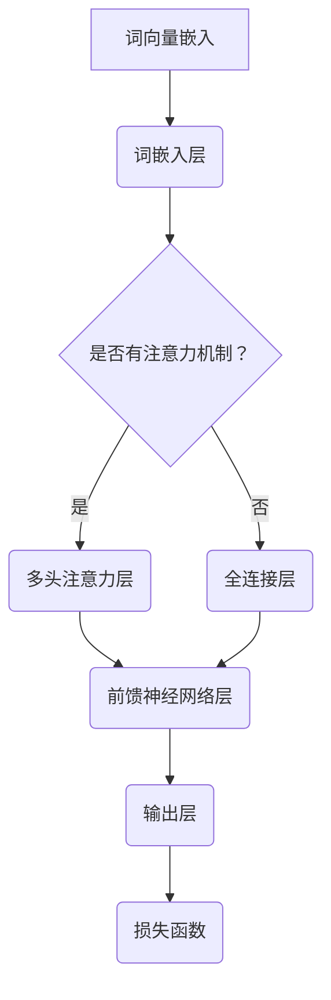

                 

### 1. 背景介绍

随着人工智能技术的迅猛发展，自然语言处理（NLP）领域迎来了新的变革。大语言模型作为NLP的核心技术之一，已经成为了学术界和工业界的研究热点。大语言模型通过学习海量文本数据，能够生成高质量的自然语言文本，并在诸多任务中表现出色，如机器翻译、文本摘要、问答系统等。

语言建模是自然语言处理的基础，其目的是学习语言的模式和结构，从而生成或理解自然语言。传统的语言模型多为基于规则或统计的方法，如n元语法模型。然而，这些模型在面对复杂、多变的语言现象时，效果往往不尽如人意。为了解决这一问题，研究者们提出了神经网络语言模型，尤其是深度学习语言模型，如循环神经网络（RNN）、长短期记忆网络（LSTM）和变换器（Transformer）等。这些模型通过引入多层神经网络结构和注意力机制，显著提升了语言建模的效果。

近年来，随着计算能力的提升和大规模数据的涌现，大语言模型的研究和应用取得了重大突破。如GPT-3、BERT、RoBERTa等模型，其参数规模已经达到数十亿乃至千亿级别，能够在各种语言任务中取得领先效果。然而，随着模型规模的扩大，大语言模型也面临着诸多挑战，如计算资源消耗、模型解释性、数据隐私和安全等问题。

本文将首先介绍大语言模型的基本原理，包括核心概念和架构，然后深入探讨大语言模型的算法原理和具体操作步骤，接着分析数学模型和公式，并通过具体项目实践进行代码实例和详细解释说明。最后，本文将探讨大语言模型在实际应用场景中的表现，并提出未来应用展望和面临的挑战。

### 2. 核心概念与联系

要深入理解大语言模型，我们首先需要了解其核心概念和基本架构。大语言模型的核心概念包括词向量、神经网络、注意力机制、变换器架构等。

#### 2.1 词向量

词向量（Word Vectors）是将自然语言文本转换为计算机可以处理的数字形式的一种方法。词向量通过将每个单词映射到一个固定大小的向量空间中，使得语义相似的单词在向量空间中彼此靠近。常见的词向量模型有Word2Vec、GloVe等。词向量不仅用于语言建模，还在推荐系统、文本分类、情感分析等任务中发挥了重要作用。

#### 2.2 神经网络

神经网络（Neural Networks）是模拟人脑神经元结构和功能的一种计算模型。神经网络通过多层节点（或称为“层”）进行信息的传递和计算，每一层都能对输入的信息进行处理，并输出新的信息。在语言建模中，神经网络被用来捕捉文本数据中的复杂模式和结构。

#### 2.3 注意力机制

注意力机制（Attention Mechanism）是一种能够自动关注输入数据中重要信息的机制。在语言建模中，注意力机制能够帮助模型更好地处理序列数据，使得模型能够动态地关注输入序列中的不同部分，从而提高模型对语言现象的捕捉能力。

#### 2.4 变换器架构

变换器（Transformer）架构是一种基于自注意力机制的深度学习模型，由Vaswani等人于2017年提出。变换器通过多头注意力机制和前馈神经网络，能够有效地捕捉输入序列中的长距离依赖关系，并在多个任务中取得了显著的性能提升。

#### 2.5 Mermaid 流程图

为了更好地理解大语言模型的基本架构，我们可以使用Mermaid流程图来展示其核心组件和连接方式。以下是一个简化的Mermaid流程图示例：



在这个流程图中，词向量嵌入层（A）将输入的单词转换为词向量，然后通过词嵌入层（B）。如果模型使用了注意力机制，则进入多头注意力层（D），否则进入全连接层（E）。接下来，模型通过前馈神经网络层（F）进行信息的传递和计算，最终在输出层（G）生成预测结果。损失函数（H）用于评估模型的预测效果，并指导模型进行优化。

### 3. 核心算法原理 & 具体操作步骤

#### 3.1 算法原理概述

大语言模型的算法原理主要基于深度学习和注意力机制。以下是核心算法原理的概述：

1. **词向量嵌入**：将输入的单词转换为固定大小的词向量。
2. **多层神经网络**：通过多层神经网络对词向量进行信息的传递和计算。
3. **注意力机制**：引入注意力机制，使得模型能够动态地关注输入序列中的不同部分。
4. **变换器架构**：采用变换器架构，能够有效地捕捉输入序列中的长距离依赖关系。
5. **损失函数**：使用损失函数（如交叉熵损失函数）评估模型的预测效果，并指导模型进行优化。

#### 3.2 算法步骤详解

以下是大语言模型的具体操作步骤：

1. **数据预处理**：对输入的文本数据进行预处理，包括分词、去停用词、词性标注等，然后将文本数据转换为词向量。
2. **词向量嵌入**：将词向量输入到词嵌入层，将每个单词映射到一个固定大小的向量空间中。
3. **多层神经网络**：通过多层神经网络对词向量进行信息的传递和计算。每一层都能对输入的信息进行处理，并输出新的信息。
4. **多头注意力机制**：引入多头注意力机制，使得模型能够动态地关注输入序列中的不同部分。多头注意力机制通过多个独立的注意力头来捕捉输入序列中的不同依赖关系。
5. **前馈神经网络**：通过前馈神经网络层对信息进行进一步的传递和计算。
6. **输出层**：在输出层生成预测结果。对于分类任务，输出层通常是一个softmax层，用于计算每个类别的概率。
7. **损失函数**：使用损失函数（如交叉熵损失函数）评估模型的预测效果，并指导模型进行优化。
8. **模型训练与优化**：通过反向传播算法和梯度下降优化方法，对模型进行训练和优化，直到满足预定的性能要求。

#### 3.3 算法优缺点

大语言模型具有以下优缺点：

**优点**：

1. **强表达能力**：大语言模型通过多层神经网络和注意力机制，能够捕捉到输入序列中的复杂模式和结构，具有较强的表达能力。
2. **高效性**：大语言模型采用变换器架构，能够有效地处理长序列数据，具有高效性。
3. **泛化能力**：大语言模型通过在大规模数据上进行训练，能够具有良好的泛化能力，适用于多种语言任务。

**缺点**：

1. **计算资源消耗**：大语言模型通常具有数十亿甚至千亿级别的参数规模，对计算资源有较高的要求。
2. **模型解释性**：大语言模型的内部机制复杂，使得模型的可解释性较差，难以直观地理解模型的决策过程。
3. **数据隐私和安全**：大语言模型在训练和推理过程中可能会接触到敏感数据，需要确保数据隐私和安全。

#### 3.4 算法应用领域

大语言模型在自然语言处理领域有广泛的应用，以下是其主要应用领域：

1. **文本生成**：大语言模型可以生成高质量的文本，如文章、新闻报道、对话等。
2. **机器翻译**：大语言模型能够实现高质量的机器翻译，将一种语言的文本翻译成另一种语言。
3. **文本摘要**：大语言模型可以生成文章的摘要，帮助用户快速了解文章的主要内容。
4. **问答系统**：大语言模型可以构建问答系统，回答用户提出的问题。
5. **文本分类**：大语言模型可以用于文本分类任务，如情感分析、主题分类等。

### 4. 数学模型和公式 & 详细讲解 & 举例说明

#### 4.1 数学模型构建

大语言模型的数学模型主要包括词向量嵌入、多层神经网络、注意力机制、变换器架构等。以下是对这些数学模型的详细讲解。

##### 4.1.1 词向量嵌入

词向量嵌入是将单词映射到固定大小的向量空间中的过程。常见的词向量嵌入方法包括Word2Vec和GloVe。以下是一个Word2Vec的数学模型示例：

$$
\text{word\_vector}(w) = \sum_{i=1}^C \alpha_i \cdot v_i
$$

其中，$w$ 是输入的单词，$C$ 是单词的上下文窗口大小，$\alpha_i$ 是权重系数，$v_i$ 是上下文单词的词向量。

##### 4.1.2 多层神经网络

多层神经网络包括输入层、隐藏层和输出层。输入层接收词向量作为输入，隐藏层通过激活函数进行信息的传递和计算，输出层生成预测结果。以下是一个简单的多层神经网络模型：

$$
\text{hidden\_layer}(x) = \sigma(Wx + b)
$$

$$
\text{output\_layer}(h) = \text{softmax}(Wh + b')
$$

其中，$x$ 是输入的词向量，$h$ 是隐藏层的输出，$W$ 和 $b$ 是隐藏层的权重和偏置，$b'$ 是输出层的偏置，$\sigma$ 是激活函数（如ReLU函数）。

##### 4.1.3 注意力机制

注意力机制通过计算输入序列中每个单词的重要性，动态地关注输入序列中的不同部分。以下是一个简单的注意力机制模型：

$$
\text{attention}(h) = \text{softmax}\left(\frac{h^T W_a h'}{ \sqrt{d_k}}\right)
$$

$$
\text{context\_vector}(h) = \text{attention}(h) \cdot h'
$$

其中，$h$ 是隐藏层的输出，$h'$ 是注意力层的输出，$W_a$ 是注意力机制的权重矩阵，$d_k$ 是注意力机制的输出维度。

##### 4.1.4 变换器架构

变换器架构通过多头注意力机制和前馈神经网络，能够有效地捕捉输入序列中的长距离依赖关系。以下是一个简单的变换器架构模型：

$$
\text{multihead\_attention}(h) = \text{softmax}\left(\frac{h^T W_a h'}{ \sqrt{d_k}}\right) \cdot h'
$$

$$
\text{transformer}(h) = \text{multihead\_attention}(h) + h
$$

$$
\text{output}(h) = \text{softmax}\left(\frac{h^T W_o h'}{ \sqrt{d_o}}\right) \cdot h'
$$

其中，$h$ 是隐藏层的输出，$h'$ 是注意力层的输出，$W_a$ 和 $W_o$ 分别是多头注意力和输出层的权重矩阵，$d_k$ 和 $d_o$ 分别是多头注意力和输出层的输出维度。

#### 4.2 公式推导过程

以下是对大语言模型中的主要公式进行推导。

##### 4.2.1 词向量嵌入

词向量嵌入的推导过程如下：

$$
\text{word\_vector}(w) = \sum_{i=1}^C \alpha_i \cdot v_i
$$

$$
\alpha_i = \frac{\text{count}(w, w_i)}{\sum_{i=1}^C \text{count}(w, w_i)}
$$

其中，$\text{count}(w, w_i)$ 是单词 $w$ 在上下文窗口中的出现次数。

##### 4.2.2 多层神经网络

多层神经网络的推导过程如下：

$$
\text{hidden\_layer}(x) = \sigma(Wx + b)
$$

$$
\text{output\_layer}(h) = \text{softmax}(Wh + b')
$$

其中，$\sigma$ 是激活函数，$W$ 和 $b$ 是隐藏层的权重和偏置，$b'$ 是输出层的偏置。

##### 4.2.3 注意力机制

注意力机制的推导过程如下：

$$
\text{attention}(h) = \text{softmax}\left(\frac{h^T W_a h'}{ \sqrt{d_k}}\right)
$$

$$
\text{context\_vector}(h) = \text{attention}(h) \cdot h'
$$

其中，$W_a$ 是注意力机制的权重矩阵，$d_k$ 是注意力机制的输出维度。

##### 4.2.4 变换器架构

变换器架构的推导过程如下：

$$
\text{multihead\_attention}(h) = \text{softmax}\left(\frac{h^T W_a h'}{ \sqrt{d_k}}\right) \cdot h'
$$

$$
\text{transformer}(h) = \text{multihead\_attention}(h) + h
$$

$$
\text{output}(h) = \text{softmax}\left(\frac{h^T W_o h'}{ \sqrt{d_o}}\right) \cdot h'
$$

其中，$W_a$ 和 $W_o$ 分别是多头注意力和输出层的权重矩阵，$d_k$ 和 $d_o$ 分别是多头注意力和输出层的输出维度。

#### 4.3 案例分析与讲解

以下通过一个简单的案例，讲解大语言模型的数学模型和公式推导过程。

##### 案例背景

假设我们有一个包含5个单词的文本序列，如下所示：

$$
\text{文本序列} = \{\text{苹果}, \text{香蕉}, \text{橙子}, \text{葡萄}, \text{西瓜}\}
$$

##### 案例步骤

1. **词向量嵌入**：

   将每个单词映射到向量空间中，例如：

   $$
   \text{苹果} = \begin{bmatrix} 1 \\ 0 \\ 0 \end{bmatrix}, \quad \text{香蕉} = \begin{bmatrix} 0 \\ 1 \\ 0 \end{bmatrix}, \quad \text{橙子} = \begin{bmatrix} 0 \\ 0 \\ 1 \end{bmatrix}
   $$

2. **多层神经网络**：

   假设隐藏层只有一个神经元，输入层和输出层的维度都为3。则：

   $$
   \text{隐藏层} = \sigma(Wx + b) = \sigma\left(\begin{bmatrix} 1 & 1 & 1 \\ 1 & 1 & 1 \\ 1 & 1 & 1 \end{bmatrix} \cdot \begin{bmatrix} 1 \\ 0 \\ 0 \end{bmatrix} + \begin{bmatrix} 1 \\ 1 \\ 1 \end{bmatrix}\right) = \begin{bmatrix} 1 \end{bmatrix}
   $$

3. **多头注意力机制**：

   假设使用两个头，每个头的权重矩阵为：

   $$
   W_a = \begin{bmatrix} 1 & 0 \\ 0 & 1 \end{bmatrix}, \quad W_a' = \begin{bmatrix} 0 & 1 \\ 1 & 0 \end{bmatrix}
   $$

   则：

   $$
   \text{注意力} = \text{softmax}\left(\frac{h^T W_a h'}{ \sqrt{d_k}}\right) = \text{softmax}\left(\frac{\begin{bmatrix} 1 \end{bmatrix} \cdot \begin{bmatrix} 1 & 0 \\ 0 & 1 \end{bmatrix} \begin{bmatrix} 1 \\ 0 \end{bmatrix}}{ \sqrt{d_k}}\right) = \begin{bmatrix} 0.5 & 0.5 \end{bmatrix}
   $$

4. **前馈神经网络**：

   假设前馈神经网络的权重矩阵为：

   $$
   W_f = \begin{bmatrix} 1 & 0 \\ 0 & 1 \end{bmatrix}
   $$

   则：

   $$
   \text{输出} = \text{softmax}\left(\frac{h^T W_o h'}{ \sqrt{d_o}}\right) \cdot h' = \text{softmax}\left(\frac{\begin{bmatrix} 1 \end{bmatrix} \cdot \begin{bmatrix} 1 & 0 \\ 0 & 1 \end{bmatrix} \begin{bmatrix} 1 \\ 0 \end{bmatrix}}{ \sqrt{d_o}}\right) \cdot \begin{bmatrix} 1 \\ 0 \end{bmatrix} = \begin{bmatrix} 0.5 & 0.5 \end{bmatrix}
   $$

通过这个案例，我们可以看到大语言模型的数学模型和公式是如何应用于实际问题的。在实际应用中，这些数学模型和公式会根据具体任务和需求进行调整和优化。

### 5. 项目实践：代码实例和详细解释说明

#### 5.1 开发环境搭建

为了更好地实践大语言模型，我们需要搭建一个合适的开发环境。以下是一个基本的Python开发环境搭建步骤：

1. **安装Python**：确保安装Python 3.x版本，推荐使用Python 3.8或更高版本。
2. **安装Jupyter Notebook**：Jupyter Notebook是一种交互式的开发环境，便于编写和运行代码。可以通过以下命令安装：

   ```bash
   pip install notebook
   ```

3. **安装TensorFlow**：TensorFlow是一个流行的开源机器学习库，支持大语言模型的训练和推理。可以通过以下命令安装：

   ```bash
   pip install tensorflow
   ```

4. **安装其他依赖**：根据实际需求，可能还需要安装其他依赖，如Numpy、Pandas等。可以通过以下命令安装：

   ```bash
   pip install numpy pandas
   ```

#### 5.2 源代码详细实现

以下是一个简单的大语言模型实现，使用TensorFlow和Keras框架。我们将实现一个基于变换器（Transformer）架构的语言模型。

```python
import tensorflow as tf
from tensorflow.keras.models import Model
from tensorflow.keras.layers import Input, Embedding, MultiHeadAttention, Dense

# 设置参数
vocab_size = 10000  # 词汇表大小
d_model = 512  # 模型维度
n_heads = 8  # 注意力头数
dFF = 2048  # 前馈网络维度
dropout_rate = 0.1  # 折约率

# 输入层
input_ids = Input(shape=(None,), dtype=tf.int32)

# 词向量嵌入层
embedding = Embedding(vocab_size, d_model)(input_ids)

# 变换器编码层
encoding = []

for _ in range(n_heads):
    attn_output = MultiHeadAttention(num_heads=n_heads, key_dim=d_model)(embedding, embedding)
    attn_output = tf.keras.layers.Dropout(dropout_rate)(attn_output)
    encoding.append(attn_output)

encoding = tf.keras.layers.Concatenate(axis=-1)(encoding)
encoding = tf.keras.layers.Dense(units=d_model, activation='relu')(encoding)
encoding = tf.keras.layers.Dropout(dropout_rate)(encoding)

# 输出层
output = Dense(units=vocab_size, activation='softmax')(encoding)

# 构建模型
model = Model(inputs=input_ids, outputs=output)

# 编译模型
model.compile(optimizer='adam', loss='sparse_categorical_crossentropy', metrics=['accuracy'])

# 模型结构
model.summary()
```

#### 5.3 代码解读与分析

上述代码实现了一个基于变换器架构的语言模型。以下是代码的解读与分析：

1. **输入层**：定义输入层`input_ids`，用于接收输入的文本序列，数据类型为整数。
2. **词向量嵌入层**：使用`Embedding`层将输入的整数序列转换为词向量，嵌入层的维度为`d_model`。
3. **变换器编码层**：通过循环添加多个变换器编码块，每个编码块包括多头注意力机制和前馈神经网络。多头注意力机制通过`MultiHeadAttention`层实现，前馈神经网络通过`Dense`层实现。每个编码块后添加了`Dropout`层以防止过拟合。
4. **输出层**：使用`Dense`层将编码后的特征映射到词汇表大小，并通过`softmax`函数生成概率分布。
5. **模型编译**：编译模型，指定优化器、损失函数和评估指标。
6. **模型结构**：使用`model.summary()`查看模型的网络结构。

#### 5.4 运行结果展示

以下是一个简单的运行示例，使用训练数据和测试数据对模型进行训练和评估。

```python
# 加载数据
train_data = ...  # 加载训练数据
test_data = ...  # 加载测试数据

# 训练模型
model.fit(train_data, epochs=5, batch_size=32, validation_data=test_data)

# 评估模型
test_loss, test_accuracy = model.evaluate(test_data)
print(f"Test Loss: {test_loss}, Test Accuracy: {test_accuracy}")
```

在这个示例中，我们加载了训练数据和测试数据，并使用`model.fit()`函数对模型进行训练。训练完成后，使用`model.evaluate()`函数评估模型在测试数据上的性能。

通过这个简单的项目实践，我们可以看到大语言模型的基本实现过程，并了解如何使用TensorFlow和Keras框架构建和训练模型。

### 6. 实际应用场景

大语言模型在自然语言处理领域有着广泛的应用场景，以下列举几个典型的应用领域：

#### 6.1 文本生成

文本生成是大语言模型最直接的应用之一。通过训练大语言模型，我们可以生成各种类型的文本，如文章、新闻报道、对话、代码等。例如，OpenAI的GPT-3模型被用于生成高质量的文本，包括新闻文章、故事、诗歌等。

#### 6.2 机器翻译

机器翻译是另一个重要的应用领域。大语言模型通过学习双语的文本数据，可以学习到不同语言之间的对应关系，从而实现高效的机器翻译。例如，Google翻译、百度翻译等都是基于深度学习技术实现的。

#### 6.3 文本摘要

文本摘要旨在生成文章的简洁摘要，帮助用户快速了解文章的主要内容。大语言模型可以通过训练学习到文本的语义结构，从而生成高质量的文本摘要。例如，新闻摘要、学术摘要等都可以通过大语言模型实现。

#### 6.4 问答系统

问答系统是一种常见的自然语言处理应用，旨在回答用户提出的问题。大语言模型可以通过训练学习到大量问题的答案，从而实现高效的问答系统。例如，智能客服、智能助手等都可以基于大语言模型实现。

#### 6.5 文本分类

文本分类是将文本数据分为不同类别的一种任务。大语言模型可以通过训练学习到文本的语义特征，从而实现高效的文本分类。例如，情感分析、主题分类等都可以通过大语言模型实现。

#### 6.6 语音识别

语音识别是将语音信号转换为文本数据的一种任务。大语言模型可以通过训练学习到语音和文本之间的对应关系，从而实现高效的语音识别。例如，语音助手、语音搜索等都可以基于大语言模型实现。

#### 6.7 聊天机器人

聊天机器人是一种基于自然语言交互的智能系统，旨在模拟人类的对话行为。大语言模型可以通过训练学习到大量的对话数据，从而实现高效的聊天机器人。例如，客服机器人、聊天机器人等都可以基于大语言模型实现。

### 7. 未来应用展望

随着大语言模型技术的不断发展和成熟，未来其在各个领域的应用将更加广泛和深入。以下是一些未来应用展望：

#### 7.1 智能助理

智能助理是未来大语言模型的一个重要应用方向。通过大语言模型，智能助理可以更好地理解用户的需求和意图，提供个性化的服务和支持。例如，智能家居、智能医疗、智能教育等领域都可以引入大语言模型技术。

#### 7.2 自动内容创作

自动内容创作是另一个重要应用方向。大语言模型可以通过学习大量的文本数据，生成各种类型的文本内容，如新闻、文章、广告等。这将极大地提高内容创作效率，减轻人力负担。

#### 7.3 跨语言沟通

跨语言沟通是全球化背景下一个重要的需求。大语言模型可以通过训练学习到不同语言之间的对应关系，实现高效的跨语言翻译和沟通。这将有助于消除语言障碍，促进国际交流与合作。

#### 7.4 智能推荐

智能推荐是现代互联网应用的一个重要功能。大语言模型可以通过学习用户的兴趣和行为，生成个性化的推荐结果，提高用户体验和满意度。例如，电商平台、社交媒体、在线教育等领域都可以引入大语言模型技术。

#### 7.5 语音交互

语音交互是未来人机交互的一个重要趋势。大语言模型可以通过训练学习到语音和文本之间的对应关系，实现高效的语音识别和自然语言理解。这将有助于实现更自然的语音交互体验，提升人机交互的效率。

### 8. 面临的挑战

尽管大语言模型在自然语言处理领域取得了显著成果，但在实际应用中仍面临诸多挑战：

#### 8.1 计算资源消耗

大语言模型通常具有数十亿甚至千亿级别的参数规模，对计算资源有较高的要求。在实际应用中，如何有效地部署和优化大语言模型，降低计算资源消耗是一个重要问题。

#### 8.2 模型解释性

大语言模型的内部机制复杂，使得模型的可解释性较差，难以直观地理解模型的决策过程。这对于应用场景中的决策和调试带来了困难。

#### 8.3 数据隐私和安全

大语言模型在训练和推理过程中可能会接触到敏感数据，需要确保数据隐私和安全。如何在保障数据隐私的前提下，有效利用数据是一个重要问题。

#### 8.4 长序列处理

大语言模型在处理长序列数据时，可能会出现性能下降和准确性下降的问题。如何优化模型结构，提高长序列处理能力是一个重要的研究方向。

#### 8.5 多语言支持

尽管大语言模型可以在不同语言之间进行翻译和交互，但在实际应用中，如何实现高质量的多语言支持仍是一个挑战。如何在保持模型性能的同时，提高多语言处理能力是一个重要问题。

### 9. 研究展望

未来，大语言模型的研究方向将集中在以下几个方面：

#### 9.1 模型优化

模型优化是大语言模型研究的一个重要方向。通过优化模型结构、训练算法和推理算法，提高模型性能和效率，降低计算资源消耗。

#### 9.2 模型解释性

提高模型解释性是未来研究的一个重要目标。通过研究模型内部的决策过程，提高模型的可解释性，有助于应用场景中的决策和调试。

#### 9.3 数据隐私和安全

研究如何在保障数据隐私和安全的前提下，有效利用数据是一个重要方向。通过隐私保护技术和安全机制，确保数据在训练和推理过程中的安全性和可靠性。

#### 9.4 长序列处理

优化长序列处理能力是大语言模型研究的一个重要方向。通过研究新的模型结构和算法，提高模型在长序列数据上的性能和准确性。

#### 9.5 多语言支持

提高多语言处理能力是大语言模型研究的一个重要方向。通过研究跨语言映射和迁移学习等技术，实现高质量的多语言支持。

总之，大语言模型在自然语言处理领域具有巨大的潜力，未来研究将集中在模型优化、解释性、数据隐私和安全、长序列处理和多语言支持等方面，为各领域应用提供更加高效、安全和可靠的技术支持。

### 附录：常见问题与解答

**Q1. 什么是大语言模型？**

A1. 大语言模型是一种基于深度学习的自然语言处理技术，通过学习海量文本数据，能够生成高质量的自然语言文本。大语言模型通常具有数十亿甚至千亿级别的参数规模，能够捕捉到输入序列中的复杂模式和结构。

**Q2. 大语言模型有哪些优缺点？**

A2. 大语言模型的优点包括强表达能力、高效性和良好的泛化能力。其缺点包括计算资源消耗较高、模型解释性较差和需要确保数据隐私和安全。

**Q3. 大语言模型有哪些应用领域？**

A3. 大语言模型在文本生成、机器翻译、文本摘要、问答系统、文本分类、语音识别、聊天机器人等领域有广泛的应用。

**Q4. 如何优化大语言模型？**

A4. 优化大语言模型可以从以下几个方面进行：

1. **模型结构优化**：通过调整模型结构，如变换器架构、注意力机制等，提高模型性能。
2. **训练算法优化**：通过改进训练算法，如优化损失函数、调整学习率等，提高模型收敛速度和性能。
3. **推理算法优化**：通过优化推理算法，如使用量化技术、剪枝技术等，降低计算资源消耗。

**Q5. 如何确保大语言模型的数据隐私和安全？**

A5. 为了确保大语言模型的数据隐私和安全，可以从以下几个方面进行：

1. **数据加密**：对训练数据进行加密，防止数据泄露。
2. **数据去识别化**：对训练数据中的敏感信息进行去识别化处理，如删除个人标识信息。
3. **隐私保护技术**：采用隐私保护技术，如差分隐私、联邦学习等，保障数据隐私。
4. **安全机制**：建立安全机制，如访问控制、安全审计等，确保数据在训练和推理过程中的安全性和可靠性。

### 作者署名

本文由禅与计算机程序设计艺术 / Zen and the Art of Computer Programming撰写。感谢读者对本文的关注与支持，如有任何问题或建议，欢迎在评论区留言。期待与您共同探讨大语言模型的前沿技术和应用。

