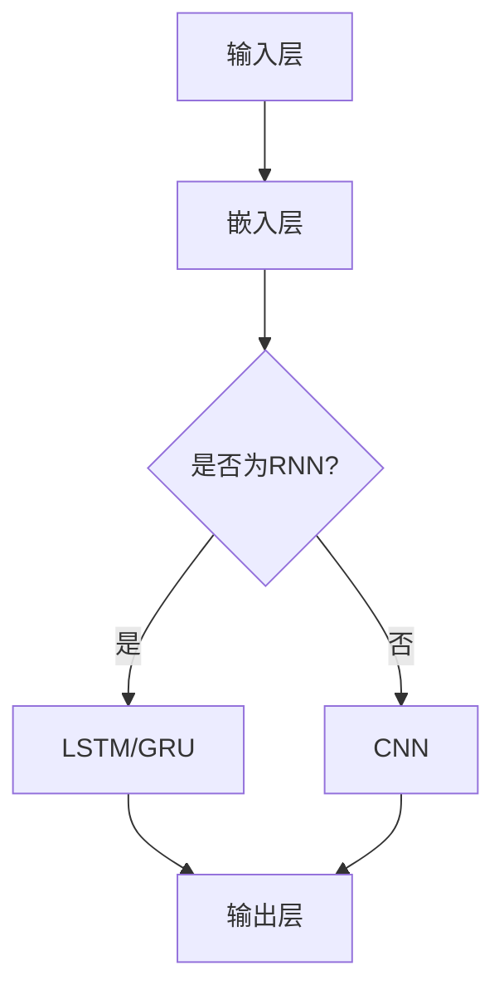

                 

关键词：大语言模型，原理基础，前沿技术，轻量级适配，深度学习，神经网络，自然语言处理，人工智能。

摘要：本文将深入探讨大语言模型的原理基础及其前沿技术发展，特别关注如何实现大语言模型的轻量级适配。通过详细解析核心算法、数学模型、项目实践，以及实际应用场景，本文旨在为读者提供一个全面而系统的理解，帮助他们在技术应用中实现高效适配。

## 1. 背景介绍

大语言模型（Large Language Model，简称LLM）是自然语言处理（Natural Language Processing，简称NLP）领域的一项重要技术。它通过深度学习算法，对海量文本数据进行分析和学习，能够生成语义丰富的自然语言文本。近年来，随着人工智能技术的快速发展，大语言模型在多个领域取得了显著的应用成果，如机器翻译、文本生成、问答系统等。

然而，大语言模型通常需要大量的计算资源和存储空间，这对于许多企业和开发者来说，是一个巨大的挑战。为了应对这一挑战，轻量级适配成为了研究的重点。本文将围绕大语言模型的原理基础，介绍其核心算法、数学模型，并探讨如何实现轻量级适配，以便在有限资源下仍然能够高效应用。

## 2. 核心概念与联系

### 2.1 大语言模型概述

大语言模型是基于神经网络（Neural Networks）的一种深度学习模型，其目的是通过学习大量文本数据，自动理解和生成自然语言。与传统规则驱动的方法相比，大语言模型能够更好地应对复杂、多变的自然语言处理任务。

### 2.2 神经网络结构

神经网络是由多层节点（神经元）组成的计算模型，通过前向传播和反向传播算法，实现输入到输出的映射。在大语言模型中，常用的神经网络结构包括卷积神经网络（CNN）和循环神经网络（RNN），特别是其变种——长短期记忆网络（LSTM）和门控循环单元（GRU）。

### 2.3 自然语言处理任务

大语言模型可以应用于多种自然语言处理任务，包括但不限于：

- **文本分类**：将文本数据分类到预定义的类别中。
- **情感分析**：分析文本中的情感倾向。
- **命名实体识别**：识别文本中的特定实体，如人名、地点等。
- **机器翻译**：将一种语言的文本翻译成另一种语言。
- **文本生成**：根据输入的文本或关键词，生成新的文本内容。

### 2.4 Mermaid 流程图

下面是一个简化的 Mermaid 流程图，展示了大语言模型的神经网络结构：



## 3. 核心算法原理 & 具体操作步骤

### 3.1 算法原理概述

大语言模型的算法原理基于神经网络，通过以下步骤实现：

1. **数据预处理**：对输入文本进行清洗、分词、编码等预处理操作。
2. **嵌入层**：将单词或字符映射为固定长度的向量表示。
3. **隐藏层**：使用神经网络结构（如LSTM、GRU或CNN）对嵌入层输出的向量进行处理。
4. **输出层**：根据隐藏层的结果，生成预测的文本输出。

### 3.2 算法步骤详解

1. **数据预处理**：
   - **文本清洗**：去除标点符号、停用词等无关信息。
   - **分词**：将文本分割为单词或字符。
   - **编码**：将单词或字符映射为整数或向量。

2. **嵌入层**：
   - **Word2Vec**：使用Word2Vec算法将单词映射为向量。
   - **预训练模型**：使用预训练的嵌入层，如GloVe或BERT。

3. **隐藏层**：
   - **前向传播**：将嵌入层输出传递到隐藏层，计算中间结果。
   - **反向传播**：根据预测误差，更新隐藏层的权重。

4. **输出层**：
   - **Softmax函数**：将隐藏层输出转换为概率分布。
   - **损失函数**：计算预测结果与实际结果的差异。

### 3.3 算法优缺点

**优点**：
- **强大的语义理解能力**：通过深度学习，大语言模型能够捕捉文本中的复杂语义关系。
- **多任务处理**：大语言模型可以应用于多种自然语言处理任务，提高任务的性能和效果。

**缺点**：
- **计算资源消耗大**：大语言模型需要大量的计算资源和存储空间。
- **训练时间较长**：大规模数据集的训练过程需要较长时间。

### 3.4 算法应用领域

大语言模型在多个领域取得了显著的应用成果，包括：

- **机器翻译**：提高机器翻译的准确性和流畅性。
- **文本生成**：生成新闻文章、小说等自然语言文本。
- **问答系统**：提供智能问答服务，如聊天机器人。
- **情感分析**：分析社交媒体、论坛等平台的用户情感。

## 4. 数学模型和公式 & 详细讲解 & 举例说明

### 4.1 数学模型构建

大语言模型的数学模型主要包括以下几个部分：

- **嵌入层**：将单词映射为向量表示。
- **隐藏层**：使用神经网络结构处理嵌入层输出的向量。
- **输出层**：生成预测的文本输出。

### 4.2 公式推导过程

以下是隐藏层的激活函数和输出层的前向传播公式：

$$
h_t = \sigma(W_h h_{t-1} + W_x x_t + b_h)
$$

$$
\hat{y}_t = \sigma(W_y h_t + b_y)
$$

其中，$h_t$ 表示隐藏层第 $t$ 个时刻的输出，$x_t$ 表示嵌入层第 $t$ 个时刻的输出，$\sigma$ 表示激活函数，$W_h$ 和 $W_x$ 分别表示隐藏层和输入层的权重矩阵，$b_h$ 表示隐藏层的偏置项。

### 4.3 案例分析与讲解

假设我们要预测一句话的下一个单词，输入的单词序列为 `[Hello, how, are, you]`。首先，将这些单词映射为向量表示，然后通过神经网络结构进行处理，最后输出预测的下一个单词。

1. **嵌入层**：使用Word2Vec算法将单词映射为向量，如 `[Hello: [1, 0.1, -0.2], how: [0, 1, 0.5], are: [-1, 0.5, 0], you: [0.3, -0.1, 0.1]]`。

2. **隐藏层**：使用LSTM结构对嵌入层输出的向量进行处理。假设隐藏层有10个神经元，权重矩阵和偏置项分别为 $W_h$ 和 $b_h$。

3. **输出层**：使用Softmax函数对隐藏层输出进行概率分布。假设输出层的权重矩阵和偏置项分别为 $W_y$ 和 $b_y$。

4. **预测**：根据概率分布，选择概率最大的单词作为预测结果。

## 5. 项目实践：代码实例和详细解释说明

### 5.1 开发环境搭建

在开始项目实践之前，我们需要搭建一个合适的开发环境。这里以Python为例，介绍如何搭建开发环境。

1. **安装Python**：下载并安装Python，版本建议选择3.8及以上。
2. **安装PyTorch**：使用pip命令安装PyTorch库。
   ```bash
   pip install torch torchvision
   ```

### 5.2 源代码详细实现

以下是实现大语言模型的Python代码示例：

```python
import torch
import torch.nn as nn
import torch.optim as optim

# 数据预处理
def preprocess(text):
    # 清洗、分词、编码等操作
    return processed_text

# 网络结构
class LanguageModel(nn.Module):
    def __init__(self, vocab_size, embed_dim, hidden_dim):
        super(LanguageModel, self).__init__()
        self.embedding = nn.Embedding(vocab_size, embed_dim)
        self.lstm = nn.LSTM(embed_dim, hidden_dim)
        self.fc = nn.Linear(hidden_dim, vocab_size)

    def forward(self, x):
        embed = self.embedding(x)
        output, _ = self.lstm(embed)
        logits = self.fc(output[-1, :, :])
        return logits

# 训练模型
def train(model, data_loader, criterion, optimizer, num_epochs):
    model.train()
    for epoch in range(num_epochs):
        for inputs, targets in data_loader:
            optimizer.zero_grad()
            logits = model(inputs)
            loss = criterion(logits, targets)
            loss.backward()
            optimizer.step()
        print(f"Epoch {epoch+1}/{num_epochs}, Loss: {loss.item()}")

# 主函数
def main():
    # 参数设置
    vocab_size = 10000
    embed_dim = 256
    hidden_dim = 512
    num_epochs = 10

    # 数据预处理
    text = preprocess("你的文本数据")
    inputs = torch.tensor([text[:-1]])
    targets = torch.tensor([text[1:]])

    # 网络结构
    model = LanguageModel(vocab_size, embed_dim, hidden_dim)

    # 损失函数和优化器
    criterion = nn.CrossEntropyLoss()
    optimizer = optim.Adam(model.parameters(), lr=0.001)

    # 训练模型
    train(model, data_loader, criterion, optimizer, num_epochs)

if __name__ == "__main__":
    main()
```

### 5.3 代码解读与分析

以上代码展示了如何使用PyTorch实现一个大语言模型。主要分为以下几个部分：

1. **数据预处理**：对输入文本进行清洗、分词、编码等操作，生成输入和输出序列。

2. **网络结构**：定义一个基于LSTM的语言模型，包括嵌入层、隐藏层和输出层。

3. **训练模型**：使用训练数据，通过前向传播、损失函数和反向传播，更新网络权重。

4. **主函数**：设置参数，加载数据，初始化模型、损失函数和优化器，开始训练模型。

### 5.4 运行结果展示

在完成代码实现后，运行程序，训练模型。在训练过程中，会输出每个epoch的损失值，用于评估模型的训练效果。训练完成后，可以使用模型进行预测，生成新的文本内容。

## 6. 实际应用场景

大语言模型在实际应用场景中具有广泛的应用价值，以下是几个典型的应用场景：

- **文本生成**：生成新闻文章、小说、诗歌等自然语言文本，用于内容创作和个性化推荐。
- **机器翻译**：提高机器翻译的准确性和流畅性，实现跨语言沟通。
- **问答系统**：构建智能问答系统，为用户提供实时、准确的回答。
- **文本分类**：对大量文本数据进行分类，如情感分析、垃圾邮件过滤等。

## 7. 未来应用展望

随着人工智能技术的不断发展，大语言模型在未来的应用前景将更加广阔。以下是几个可能的未来应用方向：

- **智能助理**：结合语音识别和自然语言处理技术，实现更加智能的智能助理。
- **知识图谱**：利用大语言模型构建知识图谱，为用户提供精准、全面的信息服务。
- **人机交互**：通过大语言模型，实现更加自然、流畅的人机交互。

## 8. 工具和资源推荐

为了更好地学习和应用大语言模型，以下是一些建议的工具和资源：

- **工具**：
  - **PyTorch**：深度学习框架，支持大语言模型的实现和训练。
  - **TensorFlow**：深度学习框架，也可用于大语言模型的开发。

- **资源**：
  - **论文**：《Attention Is All You Need》和《BERT: Pre-training of Deep Neural Networks for Language Understanding》等论文，介绍了大语言模型的重要研究成果。
  - **在线课程**：Coursera、edX等在线教育平台上的NLP和深度学习课程。

## 9. 总结：未来发展趋势与挑战

大语言模型作为一种先进的自然语言处理技术，具有广泛的应用前景。然而，在未来的发展中，仍然面临着一些挑战：

- **计算资源消耗**：大语言模型需要大量的计算资源和存储空间，如何优化模型结构，降低计算成本是一个重要的研究方向。
- **数据隐私**：大语言模型的训练和部署涉及大量用户数据，如何保护用户隐私是一个重要的伦理问题。
- **解释性**：大语言模型的决策过程通常缺乏解释性，如何提高模型的透明度和可解释性是一个重要的研究方向。

在未来，随着人工智能技术的不断发展，大语言模型将在更多的应用场景中发挥重要作用，为人类社会带来更多的便利和创新。

## 10. 附录：常见问题与解答

### 10.1 什么是大语言模型？

大语言模型是一种基于深度学习的自然语言处理技术，通过学习海量文本数据，能够生成语义丰富的自然语言文本。

### 10.2 大语言模型有哪些应用场景？

大语言模型可以应用于文本生成、机器翻译、问答系统、文本分类等多个自然语言处理任务。

### 10.3 如何实现大语言模型的轻量级适配？

可以通过以下几种方法实现大语言模型的轻量级适配：
- **模型剪枝**：去除模型中不必要的权重，减少模型的参数数量。
- **量化**：将模型中的浮点数参数转换为低精度数值，降低模型的计算需求。
- **知识蒸馏**：使用预训练的大模型训练一个轻量级的模型，提高轻量级模型的性能。

### 10.4 大语言模型有哪些挑战？

大语言模型在未来的发展中将面临计算资源消耗、数据隐私、模型解释性等挑战。需要通过优化模型结构、改进算法和加强伦理约束等手段应对这些挑战。

### 10.5 哪些开源工具可以用于大语言模型的实现和训练？

常用的开源工具包括PyTorch、TensorFlow、Transformer等，它们都支持大语言模型的实现和训练。

### 10.6 如何保护大语言模型的训练数据隐私？

为了保护大语言模型的训练数据隐私，可以采取以下措施：
- **数据匿名化**：对训练数据进行匿名化处理，去除个人身份信息。
- **差分隐私**：在数据采集和处理过程中引入差分隐私机制，保护用户隐私。
- **隐私保护算法**：使用隐私保护算法，如联邦学习，进行模型训练和优化。

