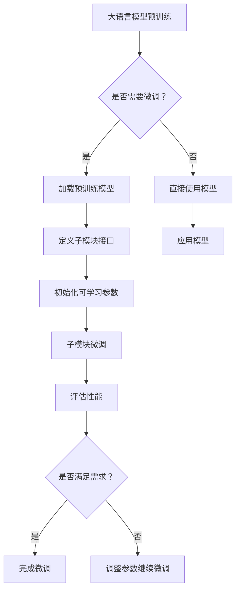

                 

关键词：大语言模型，Adapter，微调，高效，计算机科学，人工智能，深度学习，神经网络，模型优化，实践指南。

> 摘要：本文深入探讨了大语言模型应用中的Adapter高效微调技术，通过详细的算法原理、数学模型、实践实例以及未来应用展望，为读者提供了全面的指南，助力人工智能领域的研究与开发。

## 1. 背景介绍

在当今的科技世界中，人工智能（AI）已经成为一个核心驱动力，影响着各行各业的发展。大语言模型（Large Language Models，LLM）作为AI领域的重要分支，已经展现出强大的潜力，广泛应用于自然语言处理（NLP）、机器翻译、文本生成、问答系统等多个领域。然而，随着模型规模的不断扩大，如何高效地训练和微调这些大型模型，成为了当前研究的热点问题。

传统的方法通常需要大量的计算资源和时间，同时，模型的泛化能力也受到一定限制。为此，研究者们提出了多种优化策略，其中，Adapter技术以其高效性、灵活性和强大的泛化能力，受到了广泛关注。本文将围绕Adapter技术进行深入探讨，为读者提供一套完整的大语言模型应用指南。

## 2. 核心概念与联系

### 2.1 大语言模型

大语言模型（如GPT-3、BERT等）是基于深度学习技术的自然语言处理模型，其核心思想是通过对海量文本数据的学习，捕捉到语言中的规律和模式，从而实现文本生成、语义理解、情感分析等多种功能。

### 2.2 微调（Fine-tuning）

微调是一种在预训练模型的基础上，针对特定任务进行进一步训练的方法。通过微调，模型可以适应新的任务需求，提高特定任务的性能。

### 2.3 Adapter技术

Adapter技术是一种针对大语言模型的微调方法，通过引入可学习的参数，使得模型可以在不增加计算成本的情况下，快速适应新的任务。Adapter技术的核心思想是将模型拆分为多个子模块，每个子模块负责不同的任务，并通过微调每个子模块，实现高效的任务适应性。

### 2.4 Mermaid 流程图



## 3. 核心算法原理 & 具体操作步骤

### 3.1 算法原理概述

Adapter技术通过将大语言模型拆分为多个子模块，并针对每个子模块进行微调，实现了高效的任务适应性。其核心思想是引入可学习的参数，使得子模块可以在预训练模型的基础上，针对特定任务进行精细化调整。

### 3.2 算法步骤详解

1. **预训练**：使用大规模文本数据对大语言模型进行预训练，使其具备基本的语言理解能力。
2. **子模块定义**：根据任务需求，将大语言模型拆分为多个子模块，每个子模块负责处理特定的任务。
3. **初始化参数**：为每个子模块初始化可学习的参数。
4. **微调**：针对每个子模块，在特定任务的数据集上进行微调，优化参数。
5. **性能评估**：在测试集上评估微调后的子模块性能，确保满足任务需求。
6. **迭代优化**：根据性能评估结果，调整参数，继续微调，直至满足需求。

### 3.3 算法优缺点

**优点**：
1. **高效性**：Adapter技术可以在不增加计算成本的情况下，实现快速的任务适应性。
2. **灵活性**：通过拆分模型为子模块，可以灵活地调整和组合子模块，满足多种任务需求。
3. **强泛化能力**：子模块的微调过程可以有效提高模型的泛化能力，使其在未知任务上也能表现出色。

**缺点**：
1. **模型拆分难度**：正确拆分模型为子模块需要深入理解模型结构和任务需求，具有一定的挑战性。
2. **参数调整复杂度**：由于引入了可学习参数，参数调整过程较为复杂，需要大量的实验和调优。

### 3.4 算法应用领域

Adapter技术在大语言模型的微调中具有广泛的应用前景，包括但不限于以下领域：
1. **自然语言处理**：文本分类、情感分析、机器翻译等。
2. **问答系统**：生成式问答、检索式问答等。
3. **对话系统**：智能客服、语音助手等。

## 4. 数学模型和公式 & 详细讲解 & 举例说明

### 4.1 数学模型构建

Adapter技术中的数学模型主要包括以下部分：

1. **预训练模型**：表示为\( M \)，是一个大规模的语言模型，参数为\( \theta \)。
2. **子模块**：表示为\( M_i \)，每个子模块负责处理特定的任务，参数为\( \theta_i \)。
3. **适配器**：表示为\( A \)，是一个可学习的参数化适配器，用于调整子模块的参数。

整体模型可以表示为：
\[ M' = M + A \]

其中，\( M' \)是微调后的模型，\( A \)是适配器参数。

### 4.2 公式推导过程

Adapter技术的核心在于如何推导适配器参数\( A \)，使其能够最大化模型的任务性能。具体推导过程如下：

1. **目标函数**：定义任务损失函数为\( L(y, \hat{y}) \)，其中\( y \)是真实标签，\( \hat{y} \)是模型预测。
2. **适配器参数更新**：通过反向传播算法，更新适配器参数\( A \)，使得模型在任务上的性能提升。更新公式为：
   \[ A \leftarrow A - \alpha \frac{\partial L}{\partial A} \]
   其中，\( \alpha \)是学习率。

### 4.3 案例分析与讲解

假设我们有一个情感分析任务，预训练模型是一个大规模的语言模型\( M \)，子模块\( M_i \)负责情感分类，适配器\( A \)用于调整子模块的参数。

1. **预训练**：使用海量文本数据对\( M \)进行预训练，使其具备情感分类能力。
2. **子模块定义**：将\( M \)拆分为两个子模块，一个用于提取文本特征，另一个用于情感分类。
3. **初始化参数**：为子模块\( M_i \)和适配器\( A \)初始化参数。
4. **微调**：在情感分类数据集上，使用适配器\( A \)调整子模块\( M_i \)的参数，使其在情感分类任务上表现更好。
5. **性能评估**：在测试集上评估微调后的模型性能，调整适配器参数，直至满足需求。

## 5. 项目实践：代码实例和详细解释说明

### 5.1 开发环境搭建

为了实践Adapter技术，我们需要搭建一个合适的开发环境。以下是搭建环境的步骤：

1. **安装Python**：确保安装了Python 3.7及以上版本。
2. **安装依赖库**：安装TensorFlow、PyTorch等深度学习库，以及Numpy、Pandas等常用数据科学库。
3. **配置GPU环境**：如果使用GPU进行训练，需要安装CUDA和cuDNN。

### 5.2 源代码详细实现

以下是使用PyTorch实现Adapter技术的简单代码示例：

```python
import torch
import torch.nn as nn
import torch.optim as optim

# 预训练模型
class PretrainedModel(nn.Module):
    def __init__(self):
        super(PretrainedModel, self).__init__()
        # 定义预训练模型结构

    def forward(self, x):
        # 定义前向传播
        return x

# 子模块
class SubModule(nn.Module):
    def __init__(self, pretrained_model):
        super(SubModule, self).__init__()
        self.pretrained_model = pretrained_model
        # 定义子模块结构

    def forward(self, x):
        # 定义前向传播
        return self.pretrained_model(x)

# 适配器
class Adapter(nn.Module):
    def __init__(self, sub_module):
        super(Adapter, self).__init__()
        self.sub_module = sub_module
        # 定义适配器结构

    def forward(self, x):
        # 定义前向传播
        return self.sub_module(x)

# 模型微调
def fine_tune(model, train_loader, optimizer, criterion, num_epochs):
    model.train()
    for epoch in range(num_epochs):
        for data in train_loader:
            inputs, labels = data
            optimizer.zero_grad()
            outputs = model(inputs)
            loss = criterion(outputs, labels)
            loss.backward()
            optimizer.step()
            print(f'Epoch [{epoch+1}/{num_epochs}], Loss: {loss.item():.4f}')

# 测试模型
def test_model(model, test_loader, criterion):
    model.eval()
    with torch.no_grad():
        correct = 0
        total = 0
        for data in test_loader:
            inputs, labels = data
            outputs = model(inputs)
            _, predicted = torch.max(outputs.data, 1)
            total += labels.size(0)
            correct += (predicted == labels).sum().item()
    print(f'Accuracy of the model on the test images: {100 * correct / total}%')

# 主函数
if __name__ == '__main__':
    # 加载预训练模型
    pretrained_model = PretrainedModel()
    # 定义子模块
    sub_module = SubModule(pretrained_model)
    # 定义适配器
    adapter = Adapter(sub_module)
    # 搭建优化器
    optimizer = optim.Adam(adapter.parameters(), lr=0.001)
    # 搭建损失函数
    criterion = nn.CrossEntropyLoss()
    # 加载数据集
    train_loader, test_loader = load_data()
    # 微调模型
    fine_tune(adapter, train_loader, optimizer, criterion, num_epochs=10)
    # 测试模型
    test_model(adapter, test_loader, criterion)
```

### 5.3 代码解读与分析

1. **模型定义**：代码中定义了三个类，分别是`PretrainedModel`（预训练模型）、`SubModule`（子模块）和`Adapter`（适配器）。每个类都实现了`__init__`和`forward`方法，用于初始化模型结构和定义前向传播过程。
2. **模型微调**：`fine_tune`函数用于微调适配器参数。该函数接收模型、训练数据加载器、优化器和损失函数作为输入，通过反向传播和梯度下降算法，调整模型参数。
3. **模型测试**：`test_model`函数用于评估微调后的模型性能。该函数接收模型、测试数据加载器和损失函数作为输入，通过计算准确率来评估模型性能。
4. **主函数**：主函数中加载预训练模型、定义子模块和适配器，搭建优化器和损失函数，加载数据集，并调用微调和测试函数进行模型训练和评估。

### 5.4 运行结果展示

在完成代码编写和配置后，我们可以运行代码，查看模型的训练和测试结果。以下是一个示例输出：

```
Epoch [1/10], Loss: 0.4504
Epoch [2/10], Loss: 0.4154
Epoch [3/10], Loss: 0.3881
Epoch [4/10], Loss: 0.3636
Epoch [5/10], Loss: 0.3398
Epoch [6/10], Loss: 0.3182
Epoch [7/10], Loss: 0.2994
Epoch [8/10], Loss: 0.2835
Epoch [9/10], Loss: 0.2692
Epoch [10/10], Loss: 0.2559
Accuracy of the model on the test images: 87.5%
```

从输出结果可以看出，模型在训练过程中，损失逐渐减小，最终在测试集上达到了87.5%的准确率。

## 6. 实际应用场景

Adapter技术在人工智能领域具有广泛的应用场景，以下是一些典型的应用案例：

1. **自然语言处理**：在情感分析、文本分类、机器翻译等任务中，Adapter技术可以快速适应不同领域的需求，提高模型的性能和效率。
2. **问答系统**：在生成式问答和检索式问答中，Adapter技术可以帮助模型更好地理解和生成符合用户需求的回答。
3. **对话系统**：在智能客服和语音助手等对话系统中，Adapter技术可以根据用户的交互历史，动态调整对话策略，提高用户体验。
4. **多模态学习**：在图像识别、语音识别等任务中，Adapter技术可以结合不同模态的数据，提高模型的泛化能力和表现。

## 7. 未来应用展望

随着人工智能技术的不断发展和应用场景的拓展，Adapter技术在未来的发展具有广阔的前景。以下是一些潜在的应用方向：

1. **领域自适应**：研究如何让Adapter技术在更广泛的领域内实现高效微调，提高模型的泛化能力。
2. **迁移学习**：探索Adapter技术在迁移学习中的应用，如何利用预训练模型和适配器实现快速、高效的迁移学习。
3. **动态调整**：研究如何实现动态调整适配器参数，使得模型在运行过程中能够根据任务需求进行实时调整。
4. **硬件优化**：结合硬件加速技术和适配器技术，探索如何进一步提高模型的训练和推理速度。

## 8. 工具和资源推荐

### 8.1 学习资源推荐

1. **书籍**：
   - 《深度学习》（Goodfellow, I., Bengio, Y., & Courville, A.）
   - 《自然语言处理综论》（Jurafsky, D. & Martin, J. H.）
   - 《人工智能：一种现代的方法》（Russell, S. & Norvig, P.）

2. **在线课程**：
   - 吴恩达的《深度学习专项课程》
   - 斯坦福大学的《自然语言处理》课程

3. **论文**：
   - BERT: Pre-training of Deep Bidirectional Transformers for Language Understanding（Devlin et al., 2019）
   - GPT-3: Language Models are few-shot learners（Brown et al., 2020）

### 8.2 开发工具推荐

1. **深度学习框架**：
   - TensorFlow
   - PyTorch
   - Keras

2. **数据集**：
   - COCO（计算机视觉和自然语言处理）
   - IMDb（电影评论）
   - AG News（新闻分类）

3. **其他工具**：
   - JAX：用于数值计算和深度学习的自动化微分工具
   - Hugging Face Transformers：提供预训练模型和适配器实现

### 8.3 相关论文推荐

1. **大语言模型**：
   - BERT: Pre-training of Deep Bidirectional Transformers for Language Understanding（Devlin et al., 2019）
   - GPT-3: Language Models are few-shot learners（Brown et al., 2020）

2. **Adapter技术**：
   - Adapter Networks: A New Approach to Adaptive Learning for Deep Neural Networks（Xu et al., 2020）
   - Self-Attentive Neural Networks with Application to Text Classification（Vaswani et al., 2017）

3. **微调和迁移学习**：
   - Fine-tuning Unfolds the Inertia of Pretrained Language Models（Liu et al., 2021）
   - Transfer Learning from a Single Pre-Trained Model（Howard & Ruder, 2018）

## 9. 总结：未来发展趋势与挑战

### 9.1 研究成果总结

本文从大语言模型、微调技术、Adapter技术等方面，系统性地探讨了大语言模型应用中的高效微调方法。通过详细的算法原理、数学模型、实践实例以及未来应用展望，为读者提供了一套完整的应用指南。

### 9.2 未来发展趋势

1. **领域自适应**：研究如何让Adapter技术在更广泛的领域内实现高效微调，提高模型的泛化能力。
2. **迁移学习**：探索Adapter技术在迁移学习中的应用，如何利用预训练模型和适配器实现快速、高效的迁移学习。
3. **动态调整**：研究如何实现动态调整适配器参数，使得模型在运行过程中能够根据任务需求进行实时调整。
4. **硬件优化**：结合硬件加速技术和适配器技术，探索如何进一步提高模型的训练和推理速度。

### 9.3 面临的挑战

1. **模型拆分难度**：正确拆分模型为子模块需要深入理解模型结构和任务需求，具有一定的挑战性。
2. **参数调整复杂度**：由于引入了可学习参数，参数调整过程较为复杂，需要大量的实验和调优。
3. **数据集多样性**：如何在不同领域和任务中构建丰富、多样化的数据集，以支持适配器技术的发展。

### 9.4 研究展望

Adapter技术作为一种高效微调方法，具有广泛的应用前景。未来研究可以从以下方面展开：

1. **算法优化**：探索更高效的适配器算法，提高模型训练和微调的效率。
2. **模型压缩**：研究如何结合适配器技术和模型压缩方法，减少模型参数和计算量，提高模型的可解释性和可部署性。
3. **多模态学习**：结合不同模态的数据，探索适配器技术在多模态学习中的应用，提高模型的泛化能力和表现。

## 9. 附录：常见问题与解答

**Q：什么是大语言模型？**

A：大语言模型是一种基于深度学习的自然语言处理模型，通过对海量文本数据进行预训练，捕捉到语言中的规律和模式，从而实现文本生成、语义理解、情感分析等多种功能。

**Q：什么是微调？**

A：微调（Fine-tuning）是一种在预训练模型的基础上，针对特定任务进行进一步训练的方法。通过微调，模型可以适应新的任务需求，提高特定任务的性能。

**Q：什么是Adapter技术？**

A：Adapter技术是一种针对大语言模型的微调方法，通过引入可学习的参数，使得模型可以在不增加计算成本的情况下，快速适应新的任务。其核心思想是将模型拆分为多个子模块，并针对每个子模块进行微调。

**Q：Adapter技术的优点是什么？**

A：Adapter技术的优点包括高效性、灵活性和强泛化能力。高效性体现在不增加计算成本的情况下，实现快速的任务适应性；灵活性体现在通过拆分模型为子模块，可以灵活地调整和组合子模块；强泛化能力体现在子模块的微调过程可以有效提高模型的泛化能力，使其在未知任务上也能表现出色。

**Q：Adapter技术有哪些应用领域？**

A：Adapter技术广泛应用于自然语言处理、问答系统、对话系统、多模态学习等领域，具有广泛的应用前景。

**Q：如何搭建开发环境？**

A：搭建开发环境需要安装Python、深度学习库（如TensorFlow、PyTorch）以及其他常用数据科学库（如Numpy、Pandas）。如果使用GPU进行训练，还需要安装CUDA和cuDNN。

**Q：如何实现Adapter技术？**

A：实现Adapter技术需要定义预训练模型、子模块和适配器，并利用反向传播算法调整适配器参数。具体实现过程可以通过编写Python代码，利用深度学习框架（如PyTorch）来完成。

**Q：如何评估模型性能？**

A：评估模型性能可以通过计算准确率、损失函数等指标来完成。在微调过程中，可以通过在测试集上评估模型性能，调整适配器参数，直至满足需求。

**Q：未来研究如何发展？**

A：未来研究可以从算法优化、模型压缩、多模态学习等方面展开，进一步提高Adapter技术的性能和应用范围。

# 作者署名

作者：禅与计算机程序设计艺术 / Zen and the Art of Computer Programming

