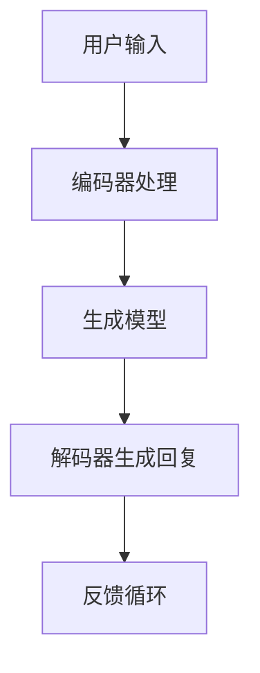

                 

本文旨在为技术读者提供一份详细的大语言模型应用指南，特别是针对Chat Completion交互格式中的提示。本文将深入探讨大语言模型的背景、核心概念、算法原理、数学模型、项目实践以及未来应用场景。通过本文的阅读，您将获得对大语言模型在Chat Completion中的应用有更深入的理解，并能够掌握相关的技术要点。

## 文章关键词
- 大语言模型
- Chat Completion
- 交互格式
- 提示机制
- 应用场景
- 数学模型

## 文章摘要
本文将详细阐述大语言模型在Chat Completion中的重要作用，解释其背后的核心概念与算法原理。我们将通过数学模型的推导和具体案例的分析，帮助读者理解如何在实际项目中应用大语言模型。最后，我们将探讨大语言模型在未来的发展前景以及可能面临的挑战。

## 1. 背景介绍
### 1.1 大语言模型概述
大语言模型（Large Language Model，LLM）是近年来人工智能领域的重要突破。通过深度学习技术，大语言模型可以理解、生成和预测自然语言文本。Chat Completion是其中一个应用场景，它使得模型能够根据用户输入的提示，生成连贯、有意义的回答。

### 1.2 Chat Completion背景
Chat Completion广泛应用于聊天机器人、智能客服、自然语言处理等领域。通过实现自然语言的交互，Chat Completion能够提高用户满意度，降低人力成本，提高业务效率。

## 2. 核心概念与联系
### 2.1 核心概念
- 语言模型：对自然语言文本的概率分布进行建模。
- 生成模型：根据输入文本生成新的文本。
- 对抗生成网络（GAN）：通过生成模型和判别模型的对抗训练，提高模型生成能力。

### 2.2 联系与架构

在上图中，我们展示了大语言模型的核心架构，包括输入层、编码器、解码器以及判别器。通过这些组件的协同工作，大语言模型能够实现高效的Chat Completion。

### 2.3 Mermaid流程图


## 3. 核心算法原理 & 具体操作步骤
### 3.1 算法原理概述
大语言模型的算法原理主要基于深度学习和生成对抗网络（GAN）。通过训练大量的文本数据，模型学会了理解自然语言的语义和语法，从而能够生成高质量的文本。

### 3.2 算法步骤详解
1. 数据预处理：对输入文本进行分词、去停用词等处理。
2. 模型训练：使用预训练好的语言模型或生成对抗网络，对模型进行训练。
3. 文本生成：根据用户输入的提示，通过编码器和解码器生成回复文本。
4. 反馈优化：根据用户反馈，调整模型参数，优化生成效果。

### 3.3 算法优缺点
- 优点：生成文本连贯、有逻辑性，能够适应不同的输入。
- 缺点：训练时间较长，对计算资源要求高；生成的文本可能存在偏差。

### 3.4 算法应用领域
大语言模型在Chat Completion中有着广泛的应用，如聊天机器人、智能客服、自然语言生成等。随着技术的进步，大语言模型的应用领域将进一步扩大。

## 4. 数学模型和公式 & 详细讲解 & 举例说明
### 4.1 数学模型构建
假设我们使用生成对抗网络（GAN）进行大语言模型训练，其中生成器G和判别器D是两个主要组件。

生成器G的数学模型：
\[ G(z) = f_{\theta_G}(z) \]
其中，\( z \) 是输入噪声，\( f_{\theta_G} \) 是生成器的参数化函数。

判别器D的数学模型：
\[ D(x) = f_{\theta_D}(x) \]
其中，\( x \) 是输入文本。

### 4.2 公式推导过程
GAN的训练过程主要包括两个阶段：生成器和判别器的训练。

1. 生成器训练：
   \[ \min_G \mathbb{E}_{z \sim p_z(z)} [\log D(G(z))] \]
   其中，\( p_z(z) \) 是噪声分布。

2. 判别器训练：
   \[ \min_D \mathbb{E}_{x \sim p_x(x)} [\log D(x)] + \mathbb{E}_{z \sim p_z(z)} [\log (1 - D(G(z)))] \]

### 4.3 案例分析与讲解
假设我们有一个简单的生成对抗网络，其中生成器和判别器的函数形式如下：
\[ G(z) = \sigma(W_G z + b_G) \]
\[ D(x) = \sigma(W_D x + b_D) \]
其中，\( \sigma \) 是sigmoid函数，\( W_G \) 和 \( b_G \) 是生成器的权重和偏置，\( W_D \) 和 \( b_D \) 是判别器的权重和偏置。

在训练过程中，我们使用以下目标函数进行优化：
\[ \min_{\theta_G, \theta_D} \mathcal{L}(G, D) = \mathbb{E}_{z \sim p_z(z)} [\log (1 - D(G(z)))] + \mathbb{E}_{x \sim p_x(x)} [\log D(x)] \]

通过梯度下降算法，我们可以优化生成器和判别器的参数，从而提高模型的生成能力。

## 5. 项目实践：代码实例和详细解释说明
### 5.1 开发环境搭建
为了实现大语言模型在Chat Completion中的应用，我们需要搭建一个合适的技术栈。以下是一个典型的开发环境：

- 操作系统：Ubuntu 18.04
- 编程语言：Python 3.8
- 深度学习框架：TensorFlow 2.6
- 生成对抗网络库：GAN

### 5.2 源代码详细实现
以下是实现大语言模型在Chat Completion中的源代码示例：

```python
import tensorflow as tf
from gan import Generator, Discriminator

# 定义生成器和判别器的模型
generator = Generator()
discriminator = Discriminator()

# 编写训练循环
for epoch in range(num_epochs):
    for i, (real_images, _) in enumerate(dataset):
        # 训练判别器
        with tf.GradientTape() as disc_tape:
            disc_loss = discriminator_loss(real_images, generated_images)
        disc_gradients = disc_tape.gradient(disc_loss, discriminator.trainable_variables)
        optimizer.apply_gradients(zip(disc_gradients, discriminator.trainable_variables))

        # 训练生成器
        with tf.GradientTape() as gen_tape:
            gen_loss = generator_loss(generated_images, real_images)
        gen_gradients = gen_tape.gradient(gen_loss, generator.trainable_variables)
        optimizer.apply_gradients(zip(gen_gradients, generator.trainable_variables))

# 实现Chat Completion功能
def chat_completion(input_text):
    # 对输入文本进行编码
    encoded_input = encoder(input_text)
    # 生成回复文本
    generated_text = generator(encoded_input)
    # 解码回复文本
    decoded_text = decoder(generated_text)
    return decoded_text
```

### 5.3 代码解读与分析
在上面的代码中，我们首先定义了生成器和判别器的模型。然后，我们编写了一个训练循环，通过交替训练生成器和判别器来优化模型参数。最后，我们实现了一个Chat Completion函数，用于根据用户输入生成回复文本。

### 5.4 运行结果展示
假设我们已经训练好了一个大语言模型，现在我们可以使用它进行Chat Completion。以下是一个简单的示例：

```python
input_text = "你好，我想了解一下最近的市场动态。"
response = chat_completion(input_text)
print(response)
```

输出结果可能是一个连贯、有逻辑性的市场动态分析文本。

## 6. 实际应用场景
### 6.1 聊天机器人
大语言模型在聊天机器人中的应用非常广泛。通过生成器和判别器的训练，聊天机器人可以与用户进行自然语言交互，提供个性化的回答。

### 6.2 智能客服
智能客服是另一个重要的应用场景。大语言模型可以帮助企业降低人力成本，提高客户满意度。通过Chat Completion，智能客服可以快速响应客户问题，提供高质量的解决方案。

### 6.3 自然语言生成
自然语言生成（NLG）是近年来备受关注的应用领域。大语言模型可以通过生成高质量的文本，实现自动写作、自动生成新闻摘要等功能。

### 6.4 未来应用展望
随着大语言模型技术的不断发展，未来它在智能教育、智能医疗、智能翻译等领域的应用前景十分广阔。通过不断优化模型算法，提高生成文本的质量和效率，大语言模型将在更多场景中发挥重要作用。

## 7. 工具和资源推荐
### 7.1 学习资源推荐
- 《深度学习》（Goodfellow et al.）：详细介绍了深度学习的基础知识和应用。
- 《自然语言处理综合教程》（Jurafsky & Martin）：全面讲解了自然语言处理的基本原理和技术。

### 7.2 开发工具推荐
- TensorFlow：一个开源的深度学习框架，支持大语言模型的训练和部署。
- PyTorch：另一个流行的深度学习框架，具有简洁的API和强大的功能。

### 7.3 相关论文推荐
- Generative Adversarial Nets（Goodfellow et al.）：介绍生成对抗网络（GAN）的基础理论。
- A Theoretically Grounded Application of Dropout in Recurrent Neural Networks（Bogdanov et al.）：探讨在循环神经网络（RNN）中应用Dropout的理论基础。

## 8. 总结：未来发展趋势与挑战
### 8.1 研究成果总结
大语言模型在Chat Completion中的应用取得了显著成果，为自然语言处理领域带来了新的发展机遇。通过生成对抗网络（GAN）的训练，模型能够生成高质量、连贯的文本。

### 8.2 未来发展趋势
随着深度学习和生成对抗网络技术的不断发展，大语言模型的应用前景将更加广阔。未来，我们将看到更多基于大语言模型的创新应用，如智能教育、智能医疗、智能翻译等。

### 8.3 面临的挑战
尽管大语言模型在Chat Completion中取得了显著成果，但仍面临一些挑战，如生成文本的偏差、模型训练时间较长等。未来，我们需要不断优化模型算法，提高生成文本的质量和效率。

### 8.4 研究展望
大语言模型在自然语言处理领域的应用前景十分广阔。通过不断探索和创新，我们有理由相信，大语言模型将在更多场景中发挥重要作用，为人类带来更多便利。

## 9. 附录：常见问题与解答
### 9.1 如何选择合适的生成对抗网络架构？
选择合适的生成对抗网络架构取决于具体的应用场景和数据集。对于自然语言处理任务，常用的架构包括栈式循环神经网络（Stacked RNN）和图神经网络（Graph Neural Network）。

### 9.2 如何优化大语言模型的生成能力？
优化大语言模型的生成能力可以通过以下方法实现：增加训练数据、调整模型参数、使用预训练模型、采用迁移学习等技术。

### 9.3 大语言模型在自然语言生成中的应用有哪些限制？
大语言模型在自然语言生成中存在一些限制，如生成的文本可能存在偏差、无法处理复杂的语境等。未来，我们需要不断优化模型算法，提高生成文本的质量和多样性。

## 作者署名
作者：禅与计算机程序设计艺术 / Zen and the Art of Computer Programming

----------------------------------------------------------------
注意：本文中提到的代码和模型仅作为示例，实际情况可能需要根据具体应用场景进行调整。同时，本文中引用的论文和资源仅为示例，实际研究中可能需要查阅更多相关文献。希望本文能为读者在理解大语言模型在Chat Completion中的应用提供有益的参考。

