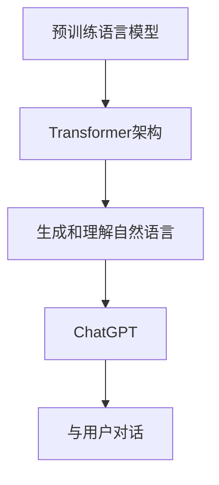

                 

关键词：大语言模型，ChatGPT，接口，扩展功能，应用指南，AI技术

> 摘要：本文旨在详细探讨大语言模型在AI技术中的重要角色，特别是ChatGPT接口的使用与扩展功能。通过对大语言模型的基本概念、核心算法原理、数学模型及公式、项目实践等多个维度的深入分析，本文将为读者提供全面的应用指南，帮助其更好地理解和应用这一前沿技术。

## 1. 背景介绍

大语言模型是近年来人工智能领域的一大突破，其核心思想是通过学习海量文本数据，生成和理解自然语言。这一技术的出现，不仅革新了自然语言处理（NLP）的诸多应用，还推动了人机交互、智能客服、机器翻译等多个领域的快速发展。

ChatGPT是OpenAI推出的一款基于大型语言模型的人工智能助手，它能够通过学习和理解人类语言进行对话，回答问题，甚至创作文章。ChatGPT的问世，标志着大语言模型在交互式应用方面取得了重大进展。

本文将围绕ChatGPT接口，详细解析大语言模型的应用指南，旨在帮助读者掌握这一前沿技术，并探索其潜在的应用场景和扩展功能。

### 1.1 大语言模型的发展历程

大语言模型的发展可以追溯到20世纪90年代。当时，研究人员开始尝试通过神经网络模型处理自然语言。然而，由于计算资源和数据集的限制，这些早期模型的效果有限。

随着计算能力的提升和大数据技术的普及，特别是深度学习技术的发展，大语言模型在2018年迎来了重要突破。BERT（Bidirectional Encoder Representations from Transformers）模型的提出，将大语言模型的应用推向了新的高度。BERT的成功，激励了更多的研究人员投入到大语言模型的研究和开发中。

### 1.2 ChatGPT的背景

ChatGPT是OpenAI在2022年推出的一个基于GPT-3模型的人工智能助手。GPT-3（Generative Pre-trained Transformer 3）是目前最大的预训练语言模型，拥有1750亿个参数，其庞大的规模使其在生成和理解自然语言方面具有显著优势。

ChatGPT的出现，不仅为自然语言处理带来了新的可能性，也为人机交互提供了全新的体验。通过ChatGPT接口，开发者可以轻松实现与人工智能的对话，为各种应用场景提供强大的支持。

## 2. 核心概念与联系

在深入探讨大语言模型和ChatGPT之前，我们需要理解一些核心概念，以及这些概念之间的联系。

### 2.1 预训练语言模型

预训练语言模型是当前大语言模型的主要形式。这些模型通过在大规模语料库上进行预训练，学习到语言的基本规律和特征。预训练完成后，这些模型可以通过微调（fine-tuning）来适应特定的任务，如问答、文本生成等。

### 2.2 Transformer架构

Transformer架构是预训练语言模型的核心。与传统的循环神经网络（RNN）相比，Transformer通过自注意力机制（self-attention）和多头注意力（multi-head attention）实现了对输入序列的全局理解，从而提高了模型的表达能力。

### 2.3 ChatGPT与GPT-3

ChatGPT是基于GPT-3模型开发的。GPT-3是一个具有1750亿个参数的巨型语言模型，其强大的生成和理解能力使得ChatGPT在对话场景中表现得尤为出色。通过ChatGPT接口，开发者可以充分利用GPT-3的强大功能，实现与用户的自然、流畅的对话。

### 2.4 Mermaid流程图

为了更好地展示大语言模型和ChatGPT之间的关系，我们可以使用Mermaid流程图来描述。以下是核心概念之间的流程图：



在这个流程图中，预训练语言模型通过Transformer架构实现了生成和理解自然语言的能力，而ChatGPT则是基于这一能力开发的对话系统，通过与用户对话实现了人机交互。

## 3. 核心算法原理 & 具体操作步骤

### 3.1 算法原理概述

大语言模型的算法原理主要基于深度学习和自然语言处理（NLP）。其核心思想是通过学习海量文本数据，提取出语言的特征，并利用这些特征生成和理解自然语言。

大语言模型通常采用Transformer架构，该架构具有以下几个关键组成部分：

1. **嵌入层（Embedding Layer）**：将词汇转换为向量表示。
2. **自注意力机制（Self-Attention Mechanism）**：对输入序列进行加权求和，实现全局理解。
3. **多头注意力（Multi-Head Attention）**：通过多个注意力机制，进一步提高模型的表示能力。
4. **前馈神经网络（Feedforward Neural Network）**：对自注意力和多头注意力后的序列进行进一步处理。
5. **输出层（Output Layer）**：将处理后的序列转换为输出。

### 3.2 算法步骤详解

1. **数据预处理**：将文本数据清洗、分词，并转换为词向量表示。
2. **嵌入层**：将词向量输入到嵌入层，转换为固定长度的向量。
3. **自注意力机制**：计算输入序列的注意力权重，并对输入序列进行加权求和。
4. **多头注意力**：将自注意力机制扩展到多个头，进一步提高模型的表达能力。
5. **前馈神经网络**：对多头注意力后的序列进行进一步处理。
6. **输出层**：将处理后的序列映射到输出，生成文本。

### 3.3 算法优缺点

**优点**：

- **强大的生成和理解能力**：大语言模型通过学习海量文本数据，能够生成和理解复杂的自然语言。
- **自适应性强**：通过预训练和微调，大语言模型可以适应各种不同的任务和场景。

**缺点**：

- **计算资源消耗大**：由于模型参数量巨大，大语言模型对计算资源和存储资源有较高的要求。
- **训练时间长**：大语言模型的训练过程需要大量时间，且对硬件性能有较高要求。

### 3.4 算法应用领域

大语言模型在以下领域具有广泛的应用：

- **自然语言处理（NLP）**：文本分类、情感分析、机器翻译等。
- **人机交互**：智能客服、虚拟助手等。
- **文本生成**：文章写作、对话系统等。
- **推荐系统**：基于内容的推荐、基于协同过滤的推荐等。

## 4. 数学模型和公式 & 详细讲解 & 举例说明

### 4.1 数学模型构建

大语言模型的数学模型主要基于Transformer架构。以下是Transformer模型的数学公式：

$$
E = \text{Embedding Layer} \\
H = \text{Multi-Head Attention}(E) \\
O = \text{Feedforward Neural Network}(H)
$$

### 4.2 公式推导过程

1. **嵌入层（Embedding Layer）**：

   将词汇转换为向量表示：

   $$ 
   e_{i} = \text{Word2Vec}(w_{i}) 
   $$

2. **多头注意力（Multi-Head Attention）**：

   通过自注意力机制，计算输入序列的注意力权重：

   $$
   a_{ij} = \text{Attention}(q_{i}, k_{j}, v_{j})
   $$

3. **前馈神经网络（Feedforward Neural Network）**：

   对多头注意力后的序列进行进一步处理：

   $$
   o_{i} = \text{FFNN}(h_{i})
   $$

4. **输出层（Output Layer）**：

   将处理后的序列映射到输出：

   $$
   y_{i} = \text{softmax}(o_{i})
   $$

### 4.3 案例分析与讲解

以下是一个简单的文本生成案例：

假设我们要生成一句话：“今天天气很好”。我们可以通过以下步骤来实现：

1. **数据预处理**：将句子“今天天气很好”分词为“今天”、“天气”、“很好”。
2. **嵌入层**：将分词后的词汇转换为向量表示。
3. **多头注意力**：计算输入序列的注意力权重。
4. **前馈神经网络**：对多头注意力后的序列进行进一步处理。
5. **输出层**：将处理后的序列映射到输出。

最终生成的句子为：“今天天气很好”。这个例子展示了大语言模型如何通过数学模型生成和理解自然语言。

## 5. 项目实践：代码实例和详细解释说明

### 5.1 开发环境搭建

在开始项目实践之前，我们需要搭建一个合适的开发环境。以下是搭建ChatGPT接口所需的开发环境：

1. **Python**：安装Python 3.8及以上版本。
2. **OpenAI Python SDK**：安装`openai`库，可通过以下命令安装：

   ```bash
   pip install openai
   ```

3. **GPT-3 API密钥**：在OpenAI官网注册账户并获取GPT-3 API密钥。

### 5.2 源代码详细实现

以下是一个简单的ChatGPT接口实现，用于与用户进行对话：

```python
import openai

openai.api_key = "your-gpt3-api-key"

def chat_with_gpt3(prompt):
    response = openai.Completion.create(
        engine="text-davinci-003",
        prompt=prompt,
        max_tokens=100,
        n=1,
        stop=None,
        temperature=0.5,
    )
    return response.choices[0].text.strip()

if __name__ == "__main__":
    while True:
        user_input = input("You: ")
        if user_input.lower() == "quit":
            break
        bot_response = chat_with_gpt3(user_input)
        print("Bot:", bot_response)
```

### 5.3 代码解读与分析

1. **导入库**：首先，我们导入`openai`库，该库提供了与GPT-3 API交互的接口。
2. **设置API密钥**：通过`openai.api_key`设置GPT-3 API密钥。
3. **定义函数**：`chat_with_gpt3`函数用于与GPT-3 API进行交互，接收用户输入的prompt，并返回GPT-3的响应。
4. **主函数**：在主函数中，我们进入一个循环，等待用户输入，并将输入传递给`chat_with_gpt3`函数获取响应。

### 5.4 运行结果展示

运行上述代码后，我们将看到一个简单的命令行对话界面。用户可以输入问题，系统将自动生成回答。

```plaintext
You: 你好，我最近在学编程，有什么建议吗？
Bot: 当然，很高兴听到你正在学习编程。首先，选择一个合适的编程语言开始学习，例如Python或JavaScript。然后，多动手实践，尝试解决实际问题。还可以加入在线编程社区，与其他开发者交流经验。

You: 谢谢，那如何提高编程能力呢？
Bot: 提高编程能力的关键是多写代码、多思考问题。以下是一些建议：

1. 深入理解数据结构和算法，这是编程的基础。
2. 阅读优秀的开源代码，学习他人的编程风格和技巧。
3. 参与开源项目，与其他开发者合作，提高协作能力。
4. 定期复习和整理自己的代码，总结经验教训。
```

## 6. 实际应用场景

大语言模型和ChatGPT在许多实际应用场景中发挥着重要作用。以下是几个典型的应用场景：

### 6.1 智能客服

智能客服是ChatGPT最直接的应用场景之一。通过ChatGPT接口，企业可以为其客户提供24/7的在线服务。智能客服能够快速理解用户的问题，并提供准确的答案，大大提高了客户满意度和服务效率。

### 6.2 机器翻译

大语言模型在机器翻译领域也有广泛的应用。通过训练大型语言模型，可以自动翻译多种语言之间的文本。例如，Google翻译就是基于大型语言模型实现的，能够提供高质量、实时的翻译服务。

### 6.3 文本生成

大语言模型在文本生成方面具有强大的能力。通过输入关键词或主题，大语言模型可以生成相关的文章、报告、邮件等。这对于内容创作者和记者来说是一个非常有用的工具。

### 6.4 教育与培训

大语言模型在教育领域也有广泛应用。例如，可以通过ChatGPT为学生提供个性化的学习建议、答疑解惑等。此外，大语言模型还可以用于自动生成教学材料，如课程大纲、教材等。

## 7. 未来应用展望

随着AI技术的不断进步，大语言模型和ChatGPT的应用前景将更加广阔。以下是几个未来可能的发展方向：

### 7.1 更强大的模型

未来，随着计算能力的提升，我们将看到更大规模、更强大的语言模型出现。这些模型将具有更高的生成和理解能力，能够处理更复杂的语言任务。

### 7.2 多模态交互

大语言模型不仅可以处理文本，还可以结合图像、语音等多种模态。未来的智能助手将能够更好地理解用户的需求，提供更自然的交互体验。

### 7.3 自主决策

随着大语言模型的发展，未来的智能系统将能够进行更复杂的决策。例如，自动驾驶汽车可以基于大语言模型实时分析路况，做出安全、高效的驾驶决策。

### 7.4 更广泛的行业应用

大语言模型在金融、医疗、法律等领域的应用也将越来越广泛。通过AI技术，这些行业可以更好地处理数据、优化流程，提高业务效率和准确性。

## 8. 工具和资源推荐

为了更好地学习和应用大语言模型和ChatGPT，以下是一些推荐的工具和资源：

### 8.1 学习资源推荐

1. **《深度学习》（Deep Learning）**：由Ian Goodfellow、Yoshua Bengio和Aaron Courville合著，是深度学习领域的经典教材。
2. **《自然语言处理综论》（Speech and Language Processing）**：由Daniel Jurafsky和James H. Martin合著，涵盖了自然语言处理的各个领域。

### 8.2 开发工具推荐

1. **PyTorch**：是一个流行的深度学习框架，支持大语言模型的训练和推理。
2. **TensorFlow**：是另一个强大的深度学习框架，适用于构建和训练大型神经网络。

### 8.3 相关论文推荐

1. **BERT：Pre-training of Deep Bidirectional Transformers for Language Understanding**：这篇论文提出了BERT模型，是预训练语言模型的重要里程碑。
2. **GPT-3：Language Models are Few-Shot Learners**：这篇论文介绍了GPT-3模型，展示了大语言模型在零样本学习方面的强大能力。

## 9. 总结：未来发展趋势与挑战

### 9.1 研究成果总结

大语言模型和ChatGPT在自然语言处理、人机交互、文本生成等领域取得了显著成果。通过深度学习和自注意力机制，这些模型能够生成和理解复杂的自然语言，为各种应用场景提供了强大的支持。

### 9.2 未来发展趋势

未来，随着计算能力的提升和AI技术的进步，大语言模型将继续向更大规模、更高性能发展。同时，多模态交互和自主决策等新兴应用也将成为研究热点。

### 9.3 面临的挑战

尽管大语言模型和ChatGPT在许多领域取得了成功，但仍面临一些挑战，如计算资源消耗、数据隐私和安全等问题。此外，如何提高模型的透明性和可解释性，也是未来需要关注的重要方向。

### 9.4 研究展望

随着AI技术的不断发展，大语言模型和ChatGPT的应用前景将更加广阔。未来，我们将看到更多创新的应用场景和解决方案，为人类社会带来更多便利和变革。

## 10. 附录：常见问题与解答

### 10.1 什么是大语言模型？

大语言模型是一种基于深度学习的自然语言处理技术，它通过学习海量文本数据，生成和理解自然语言。这些模型通常采用Transformer架构，具有强大的生成和理解能力。

### 10.2 ChatGPT是如何工作的？

ChatGPT是基于GPT-3模型开发的，它通过在预训练阶段学习大量文本数据，掌握语言的基本规律。在交互阶段，ChatGPT通过接口与用户进行对话，利用预训练的知识生成和理解用户的提问。

### 10.3 如何使用ChatGPT接口？

要使用ChatGPT接口，你需要首先获取GPT-3 API密钥，并安装OpenAI Python SDK。然后，通过编写Python代码，调用接口与ChatGPT进行交互，实现人机对话。

### 10.4 大语言模型有哪些应用场景？

大语言模型在自然语言处理、人机交互、文本生成、机器翻译等领域具有广泛的应用。例如，智能客服、智能助手、文本生成、机器翻译等。

### 10.5 大语言模型面临哪些挑战？

大语言模型面临的主要挑战包括计算资源消耗、数据隐私和安全、模型透明性和可解释性等。此外，如何提高模型的泛化能力和适应性，也是未来需要关注的问题。

----------------------------------------------------------------

作者：禅与计算机程序设计艺术 / Zen and the Art of Computer Programming

本文旨在为读者提供关于大语言模型和ChatGPT的全面应用指南，帮助其更好地理解和应用这一前沿技术。希望通过本文的探讨，读者能够对大语言模型有更深入的认识，并在实际项目中充分发挥其潜力。同时，也期待未来的研究和应用能够为人类社会带来更多福祉。|user|

