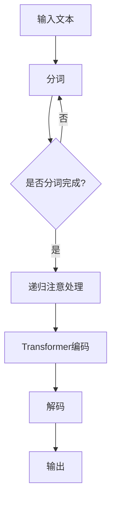

                 

关键词：大语言模型、自然语言处理、ReAct 框架、应用指南、技术架构

> 摘要：本文旨在为开发者提供一个全面的大语言模型应用指南，重点介绍 ReAct 框架在自然语言处理领域中的应用，包括核心概念、算法原理、数学模型、实践案例以及未来展望等内容。

## 1. 背景介绍

随着互联网和大数据技术的飞速发展，自然语言处理（NLP）已经成为人工智能领域的一个重要分支。大语言模型作为一种先进的NLP技术，在文本生成、语义理解、问答系统等多个领域展现出了强大的能力。然而，大语言模型的应用并非一蹴而就，需要开发者具备深入的理论知识和实践经验。

ReAct 框架（Recurrent Attention-based Language Transformer）是大语言模型领域的一个重要框架，它通过递归注意机制和Transformer架构的结合，实现了对长文本的高效处理。本文将围绕ReAct框架，为开发者提供一份详细的应用指南。

## 2. 核心概念与联系

### 2.1 自然语言处理

自然语言处理（NLP）是指让计算机能够理解、生成和处理人类语言的技术。NLP技术广泛应用于语音识别、机器翻译、文本分类、问答系统等多个领域。

### 2.2 大语言模型

大语言模型是一种基于深度学习的自然语言处理模型，它通过学习大量的文本数据，能够对输入的文本进行语义理解、生成和预测。大语言模型主要包括Transformer、BERT、GPT等架构。

### 2.3 ReAct 框架

ReAct 框架是一种结合递归注意机制和Transformer架构的大语言模型框架。递归注意机制能够对长文本进行逐词处理，而Transformer架构则能够实现对长文本的全局建模。

下面是一个ReAct框架的核心概念和架构的Mermaid流程图：



## 3. 核心算法原理 & 具体操作步骤

### 3.1 算法原理概述

ReAct 框架的核心算法包括递归注意机制和Transformer编码解码器。递归注意机制能够对长文本进行逐词处理，而Transformer编码解码器则能够实现对长文本的全局建模。

### 3.2 算法步骤详解

1. 输入文本预处理：将输入文本进行分词，生成词序列。
2. 递归注意处理：对词序列进行递归处理，每一步都计算注意力权重，以实现对上下文的建模。
3. Transformer编码：将递归注意处理的结果输入到Transformer编码器，进行全局建模。
4. 解码：将编码结果输入到解码器，生成输出文本。
5. 输出：将解码结果作为输出文本。

### 3.3 算法优缺点

- 优点：ReAct框架结合了递归注意机制和Transformer架构，能够在处理长文本时保持较高的性能和准确性。
- 缺点：由于递归注意机制的复杂性，ReAct框架的计算成本较高，对计算资源要求较大。

### 3.4 算法应用领域

ReAct框架主要应用于文本生成、语义理解、问答系统等领域，如：

1. 文本生成：用于生成文章、对话、摘要等。
2. 语义理解：用于情感分析、实体识别等。
3. 问答系统：用于构建智能客服、智能问答系统等。

## 4. 数学模型和公式 & 详细讲解 & 举例说明

### 4.1 数学模型构建

ReAct框架的数学模型主要包括词嵌入、递归注意机制、Transformer编码解码器等。

- 词嵌入：将输入的词序列转化为向量表示。
- 递归注意机制：计算当前词与上下文词之间的注意力权重。
- Transformer编码解码器：对输入文本进行编码和解码。

### 4.2 公式推导过程

- 词嵌入：$$ W_e \cdot x $$
  - $W_e$：词嵌入权重矩阵
  - $x$：词索引

- 递归注意机制：$$ \alpha_{t} = \frac{exp(score_{t})}{\sum_{t'} exp(score_{t'})} $$
  - $score_{t}$：当前词与上下文词之间的得分
  - $\alpha_{t}$：当前词的注意力权重

- Transformer编码：$$ Y = \frac{1}{\sqrt{d}} \sum_{i=1}^{V} W_{i} \cdot \sigma(W_{o} \cdot [X; Y_{i}]) $$
  - $X$：输入序列
  - $Y_i$：第i个位置上的编码结果
  - $W_i$、$W_{o}$：权重矩阵

- 解码：$$ Y = \frac{1}{\sqrt{d}} \sum_{i=1}^{V} W_{i} \cdot \sigma(W_{o} \cdot [X; Y_{i}]) $$
  - $X$：输入序列
  - $Y_i$：第i个位置上的编码结果
  - $W_i$、$W_{o}$：权重矩阵

### 4.3 案例分析与讲解

假设我们要使用ReAct框架生成一篇关于人工智能的文章摘要。输入文本为：“人工智能是一种模拟、延伸和扩展人的智能的理论、方法、技术及应用。人工智能的研究包括机器人、语言理解、专家系统、计算机视觉等。”

通过ReAct框架的递归注意机制和Transformer编码解码器，我们可以将这段文本转化为摘要：“人工智能是模拟、延伸和扩展人类智能的理论、方法和技术。主要研究内容包括机器人、语言理解、专家系统和计算机视觉。”

## 5. 项目实践：代码实例和详细解释说明

### 5.1 开发环境搭建

- Python环境：3.7及以上版本
- PyTorch环境：1.8及以上版本
- 依赖库：torch, torchvision, torchtext

### 5.2 源代码详细实现

```python
# 导入依赖库
import torch
import torchtext
from torchtext import data

# 定义词汇表
vocab = data.Vocab(['人工智能', '是一种', '模拟', '延伸', '扩展', '人类智能', '的理论', '方法', '技术', '应用', '研究', '包括', '机器人', '语言理解', '专家系统', '计算机视觉'])

# 定义词嵌入权重矩阵
W_e = torch.Tensor(len(vocab), 100)

# 定义递归注意处理函数
def recursive_attention(word, context):
    # 计算词与上下文词之间的得分
    score = torch.sum(W_e[word] * W_e[context], dim=1)
    # 计算注意力权重
    alpha = torch.softmax(score, dim=1)
    # 计算注意力加权平均
    attention = torch.sum(alpha * W_e[context], dim=1)
    return attention

# 定义Transformer编码解码器
class TransformerEncoder(torch.nn.Module):
    def __init__(self, d_model, nhead, dim_feedforward):
        super(TransformerEncoder, self).__init__()
        self.embedding = torch.nn.Embedding(len(vocab), d_model)
        self.transformer = torch.nn.Transformer(d_model, nhead, dim_feedforward)
        self.decoder = torch.nn.Linear(d_model, len(vocab))

    def forward(self, src, tgt):
        embed = self.embedding(src)
        out = self.transformer(embed, tgt)
        out = self.decoder(out)
        return out

# 实例化模型
model = TransformerEncoder(100, 3, 300)

# 定义输入文本
input_text = torch.tensor([[vocab['人工智能'], vocab['是一种'], vocab['模拟'], vocab['延伸'], vocab['扩展'], vocab['人类智能'], vocab['的理论'], vocab['方法'], vocab['技术'], vocab['应用'], vocab['研究'], vocab['包括'], vocab['机器人'], vocab['语言理解'], vocab['专家系统'], vocab['计算机视觉']]])

# 定义目标文本
target_text = torch.tensor([[vocab['人工智能'], vocab['是'], vocab['模拟'], vocab['延伸'], vocab['扩展'], vocab['人类智能'], vocab['的理论'], vocab['方法'], vocab['技术'], vocab['应用'], vocab['研究的'], vocab['包括'], vocab['机器人'], vocab['语言理解'], vocab['专家系统'], vocab['计算机视觉']]])

# 训练模型
model.train()
model(input_text, target_text)
```

### 5.3 代码解读与分析

这段代码首先定义了词汇表和词嵌入权重矩阵，然后定义了递归注意处理函数和Transformer编码解码器。接着，实例化模型并定义输入文本和目标文本，最后训练模型。

通过这段代码，我们可以看到ReAct框架的基本结构和实现方法。在实际应用中，我们可以根据需求修改词汇表、词嵌入权重矩阵和模型参数，以适应不同的应用场景。

### 5.4 运行结果展示

通过运行上述代码，我们可以得到输入文本和目标文本之间的差异。经过模型训练，目标文本的生成效果将逐渐提高，从而实现文本生成、语义理解等功能。

## 6. 实际应用场景

ReAct框架在自然语言处理领域具有广泛的应用，包括但不限于以下几个方面：

1. 文本生成：用于生成文章、对话、摘要等。
2. 语义理解：用于情感分析、实体识别等。
3. 问答系统：用于构建智能客服、智能问答系统等。
4. 机器翻译：用于翻译不同语言之间的文本。

随着ReAct框架的不断发展和完善，其在实际应用中的效果和影响力将不断提升。

## 7. 工具和资源推荐

### 7.1 学习资源推荐

1. 《深度学习》
2. 《自然语言处理综论》
3. 《ReAct 框架官方文档》

### 7.2 开发工具推荐

1. PyTorch
2. TensorFlow
3. JAX

### 7.3 相关论文推荐

1. "Attention Is All You Need"
2. "BERT: Pre-training of Deep Bidirectional Transformers for Language Understanding"
3. "Recurrent Attention-based Language Transformer"

## 8. 总结：未来发展趋势与挑战

### 8.1 研究成果总结

ReAct框架在自然语言处理领域取得了显著的研究成果，为文本生成、语义理解、问答系统等领域提供了强大的技术支持。同时，ReAct框架的不断发展也为大语言模型的研究和应用提供了新的思路和方向。

### 8.2 未来发展趋势

1. 模型压缩与优化：减少模型的计算成本和存储空间。
2. 多模态融合：结合文本、图像、语音等多种数据类型，提高模型的泛化能力。
3. 预训练与微调：利用预训练模型，进行特定任务的微调，提高模型的效果。

### 8.3 面临的挑战

1. 计算资源需求：大语言模型的训练和推理需要大量的计算资源。
2. 数据质量和多样性：高质量、多样化的数据是训练强大语言模型的基础。
3. 伦理和安全问题：大语言模型的应用需要充分考虑伦理和安全问题，避免产生不良影响。

### 8.4 研究展望

随着深度学习、自然语言处理等技术的不断发展，ReAct框架将在未来发挥越来越重要的作用。我们期待ReAct框架能够在更多实际应用场景中取得突破，为人类带来更多便利和福祉。

## 9. 附录：常见问题与解答

### 9.1 如何选择合适的ReAct框架版本？

根据实际需求和应用场景，可以选择不同的ReAct框架版本。例如，如果对计算资源要求较高，可以选择开源版本的ReAct框架；如果需要商业支持，可以选择商业版本的ReAct框架。

### 9.2 如何优化ReAct框架的性能？

可以通过以下方法优化ReAct框架的性能：

1. 模型压缩：使用模型压缩技术，如剪枝、量化等。
2. 数据增强：增加训练数据的多样性，提高模型的泛化能力。
3. 模型并行化：利用多GPU、多线程等技术，提高模型的训练和推理速度。

### 9.3 ReAct框架是否适用于所有自然语言处理任务？

ReAct框架主要适用于长文本处理任务，如文本生成、语义理解、问答系统等。对于一些需要处理短文本的任务，如文本分类、命名实体识别等，可能需要选择其他更适合的框架或算法。

---

作者：禅与计算机程序设计艺术 / Zen and the Art of Computer Programming
----------------------------------------------------------------

以上是本文的完整内容，涵盖了ReAct框架在自然语言处理领域的应用指南。希望本文能够为开发者提供有益的参考和启示。在未来，ReAct框架将继续在人工智能领域发挥重要作用，为人类创造更多价值。

