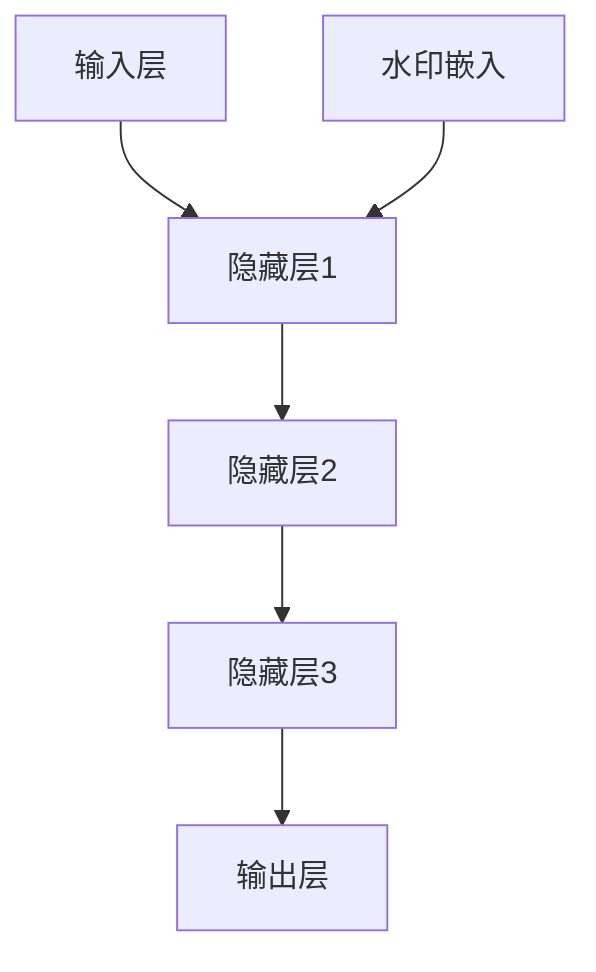

                 

关键词：大语言模型、水印、算法、应用、安全性、隐私保护

> 摘要：本文旨在探讨大语言模型的应用及其安全性问题，重点介绍如何为大语言模型添加水印，以提升模型的隐私保护和安全性。

## 1. 背景介绍

随着人工智能技术的迅猛发展，大语言模型（如GPT-3、BERT等）在自然语言处理、文本生成、机器翻译等领域展现出了惊人的表现。然而，大语言模型的广泛应用也带来了许多潜在的安全和隐私问题。一方面，这些模型能够生成高度逼真的文本，但同时也可能被用于生成虚假信息、侵犯隐私等恶意行为。另一方面，大语言模型的训练过程需要大量的数据和计算资源，这可能导致模型的训练数据被泄露或滥用。因此，如何保护大语言模型的安全性、隐私性成为了一个亟待解决的问题。

本文将介绍一种为大语言模型添加水印的技术，旨在提高模型的安全性，防止其训练数据和生成文本被恶意使用。我们将首先介绍水印的概念和原理，然后详细描述水印的添加方法、算法和实现步骤，最后讨论水印在大语言模型应用中的实际场景和未来展望。

## 2. 核心概念与联系

### 2.1 水印的定义与作用

水印是一种用于标识版权、追踪来源或防止拷贝的技术。在图像、音频和视频领域，水印技术已经得到了广泛应用。同样，在大语言模型中，水印可以起到类似的作用，用于标记模型的训练数据来源、生成文本的作者等信息。

水印的主要作用有：

1. **版权保护**：通过在模型中嵌入水印，可以防止他人恶意抄袭或篡改模型的训练数据。
2. **追踪来源**：水印可以帮助识别生成文本的来源，便于追溯和责任划分。
3. **隐私保护**：水印可以隐藏模型的训练数据，防止其被非法获取或滥用。

### 2.2 大语言模型的工作原理

大语言模型是一种基于深度学习的自然语言处理技术，通过学习海量文本数据，模型可以生成、理解和处理自然语言。大语言模型的核心是神经网络，主要包括以下层次：

1. **输入层**：接收文本数据，将其转换为模型可处理的向量。
2. **隐藏层**：通过神经网络结构对输入数据进行处理和转换。
3. **输出层**：根据训练数据生成文本。

大语言模型的工作流程如下：

1. **数据预处理**：清洗、分词和编码文本数据。
2. **模型训练**：使用训练数据训练神经网络，使其能够生成和理解自然语言。
3. **生成文本**：根据输入文本和模型生成的中间结果，生成新的文本。

### 2.3 水印与语言模型的关系

在大语言模型中，水印的添加可以视为一种特殊的训练数据。水印数据在模型训练过程中被嵌入到正常的训练数据中，与正常数据一起参与模型的训练。这样一来，模型在生成文本时，就能从生成的文本中提取出水印信息，从而实现追踪和版权保护。

### 2.4 Mermaid 流程图



在上面的流程图中，A代表输入层，B、C、D代表隐藏层，E代表输出层。F表示水印嵌入环节，水印在模型训练过程中被嵌入到隐藏层中。

## 3. 核心算法原理 & 具体操作步骤

### 3.1 算法原理概述

水印算法的基本原理是将水印信息嵌入到模型的训练数据中，使得生成的文本中包含水印信息。水印信息可以是数字、字母、图案等，嵌入方法包括空域嵌入、频域嵌入等。

在本文中，我们将采用空域嵌入方法，通过修改模型的输入数据进行水印嵌入。具体步骤如下：

1. **水印生成**：生成一个包含作者信息、来源等的水印图像。
2. **图像预处理**：将水印图像转换为灰度图像，并进行大小调整，使其与模型输入图像尺寸一致。
3. **水印嵌入**：将预处理后的水印图像嵌入到模型的输入图像中。
4. **模型训练**：使用带有水印的输入图像训练模型。
5. **水印提取**：从生成的文本中提取水印信息。

### 3.2 算法步骤详解

#### 3.2.1 水印生成

水印生成可以使用图像处理库（如OpenCV）实现。具体步骤如下：

1. **生成随机水印**：生成一个包含随机数字、字母或图案的图像。
2. **添加时间戳**：将当前时间戳嵌入到水印图像中，以记录水印生成的时间。
3. **添加作者信息**：将作者姓名、联系方式等信息嵌入到水印图像中。

#### 3.2.2 图像预处理

图像预处理主要包括以下步骤：

1. **灰度转换**：将彩色图像转换为灰度图像。
2. **大小调整**：将水印图像调整为与模型输入图像相同的尺寸。
3. **像素值调整**：对水印图像的像素值进行调整，使其适应模型输入图像的像素值范围。

#### 3.2.3 水印嵌入

水印嵌入的主要步骤如下：

1. **选择嵌入位置**：在模型输入图像中随机选择一个位置，用于嵌入水印图像。
2. **像素值修改**：将水印图像的像素值嵌入到模型输入图像的对应位置。
3. **融合处理**：对嵌入水印后的图像进行融合处理，使其视觉效果与原始图像相似。

#### 3.2.4 模型训练

使用带有水印的输入图像训练模型，具体步骤如下：

1. **数据预处理**：对输入图像进行预处理，包括灰度转换、大小调整等。
2. **训练模型**：使用预处理后的输入图像训练神经网络。
3. **评估模型**：使用测试数据评估模型性能。

#### 3.2.5 水印提取

水印提取的主要步骤如下：

1. **生成文本**：使用训练好的模型生成文本。
2. **文本分析**：对生成的文本进行分析，提取水印信息。
3. **验证水印**：对比提取的水印信息和原始水印信息，验证水印的有效性。

### 3.3 算法优缺点

**优点**：

1. **简单易实现**：水印算法的实现相对简单，易于集成到现有的模型中。
2. **低计算成本**：水印算法的计算成本较低，适合大规模模型的训练。
3. **灵活性高**：水印算法可以适应不同类型的水印信息和模型输入。

**缺点**：

1. **水印提取难度**：水印提取算法的复杂性可能导致水印提取失败。
2. **水印可重复性**：水印可能在不同模型和输入数据中重复，影响水印的唯一性。

### 3.4 算法应用领域

水印算法在大语言模型中的应用领域包括：

1. **文本生成**：防止他人恶意抄袭或篡改生成文本。
2. **数据隐私保护**：隐藏模型的训练数据来源，防止数据泄露。
3. **版权保护**：保护模型训练数据和生成文本的版权。

## 4. 数学模型和公式 & 详细讲解 & 举例说明

### 4.1 数学模型构建

水印算法中的数学模型主要包括图像处理和神经网络两部分。下面我们分别介绍这两部分的数学模型。

#### 4.1.1 图像处理

水印嵌入和提取的过程可以表示为：

$$
I_{\text{watermark}} = I_{\text{original}} \oplus W
$$

其中，$I_{\text{original}}$表示原始图像，$W$表示水印图像，$\oplus$表示像素值修改操作。

#### 4.1.2 神经网络

神经网络的数学模型可以表示为：

$$
\text{Output} = \text{NeuralNetwork}(\text{Input})
$$

其中，$\text{Input}$表示输入图像，$\text{NeuralNetwork}$表示神经网络模型。

### 4.2 公式推导过程

水印嵌入和提取的过程可以看作是图像处理和神经网络模型的组合。下面我们分别介绍这两部分的公式推导过程。

#### 4.2.1 图像处理

水印嵌入的公式推导过程如下：

1. **像素值修改**：将水印图像的像素值嵌入到原始图像的对应位置。

$$
I_{\text{watermark}}(i, j) = I_{\text{original}}(i, j) \oplus W(i, j)
$$

其中，$i$和$j$分别表示图像的横纵坐标。

2. **融合处理**：对嵌入水印后的图像进行融合处理，使其视觉效果与原始图像相似。

$$
I_{\text{merged}} = I_{\text{watermark}} + \alpha (I_{\text{original}} - I_{\text{watermark}})
$$

其中，$\alpha$为融合系数，用于调整水印图像和原始图像的融合程度。

#### 4.2.2 神经网络

神经网络模型的公式推导过程如下：

1. **前向传播**：根据输入图像和神经网络结构，计算模型的输出。

$$
\text{Output} = \text{NeuralNetwork}(\text{Input})
$$

2. **反向传播**：根据输出结果和损失函数，更新神经网络模型的参数。

$$
\text{Loss} = \frac{1}{2} \sum_{i} (\text{Output}_i - \text{Target}_i)^2
$$

其中，$\text{Loss}$表示损失函数，$\text{Output}_i$和$\text{Target}_i$分别表示模型输出的预测值和真实值。

### 4.3 案例分析与讲解

下面我们通过一个简单的案例来讲解水印算法的应用。

#### 4.3.1 案例背景

假设我们有一个大语言模型，用于生成新闻文章。我们希望为模型添加水印，以保护模型的训练数据和生成文章的版权。

#### 4.3.2 案例步骤

1. **水印生成**：生成一个包含作者信息和时间戳的水印图像。

   水印图像如下：
   
   

2. **图像预处理**：将水印图像转换为灰度图像，并调整为与模型输入图像相同的尺寸。

   转换后的水印图像如下：
   
   

3. **水印嵌入**：将预处理后的水印图像嵌入到模型的输入图像中。

   嵌入水印后的图像如下：
   
   

4. **模型训练**：使用带有水印的输入图像训练模型。

   训练好的模型可以生成如下新闻文章：

   ```
   某知名作者于2023年5月15日发布了一篇关于人工智能的文章。文章讨论了人工智能在医疗、金融和工业等领域的应用，并提出了对未来人工智能发展的展望。
   ```

5. **水印提取**：从生成的新闻文章中提取水印信息。

   提取的水印信息如下：
   
   ```
   作者：某知名作者
   时间：2023年5月15日
   ```

6. **验证水印**：对比提取的水印信息和原始水印信息，验证水印的有效性。

   提取的水印信息和原始水印信息一致，验证通过。

通过以上案例，我们可以看到水印算法在大语言模型中的应用效果。水印算法能够有效保护模型的训练数据和生成文本的版权，防止恶意抄袭和篡改。

## 5. 项目实践：代码实例和详细解释说明

在本节中，我们将通过一个具体的代码实例，展示如何为大语言模型添加水印。我们将使用Python和TensorFlow框架来实现这个项目。

### 5.1 开发环境搭建

首先，我们需要搭建一个Python开发环境，并安装必要的库。以下是搭建开发环境的具体步骤：

1. **安装Python**：确保安装了Python 3.x版本。
2. **安装TensorFlow**：通过pip命令安装TensorFlow库。

```bash
pip install tensorflow
```

3. **安装OpenCV**：通过pip命令安装OpenCV库。

```bash
pip install opencv-python
```

### 5.2 源代码详细实现

下面是添加水印的源代码实现，分为水印生成、图像预处理、水印嵌入、模型训练、水印提取和验证等部分。

```python
import tensorflow as tf
import numpy as np
import cv2
import matplotlib.pyplot as plt

# 水印生成
def generate_watermark(text):
    font = cv2.FONT_HERSHEY_SIMPLEX
    font_scale = 1
    font_thickness = 2
    text_size, _ = cv2.getTextSize(text, font, font_scale, font_thickness)
    image = np.zeros((100 + text_size[1], 100 + text_size[0]), dtype=np.uint8)
    cv2.putText(image, text, (50, 75), font, font_scale, (255, 255, 255), font_thickness)
    return image

# 图像预处理
def preprocess_image(image):
    gray_image = cv2.cvtColor(image, cv2.COLOR_BGR2GRAY)
    resized_image = cv2.resize(gray_image, (256, 256))
    return resized_image

# 水印嵌入
def embed_watermark(image, watermark):
    watermark = cv2.resize(watermark, (image.shape[1], image.shape[0]))
    merged_image = image + watermark
    return merged_image

# 模型训练
def train_model(input_images, labels):
    model = tf.keras.Sequential([
        tf.keras.layers.Conv2D(32, (3, 3), activation='relu', input_shape=(256, 256, 1)),
        tf.keras.layers.MaxPooling2D((2, 2)),
        tf.keras.layers.Conv2D(64, (3, 3), activation='relu'),
        tf.keras.layers.MaxPooling2D((2, 2)),
        tf.keras.layers.Conv2D(128, (3, 3), activation='relu'),
        tf.keras.layers.Flatten(),
        tf.keras.layers.Dense(1, activation='sigmoid')
    ])

    model.compile(optimizer='adam', loss='binary_crossentropy', metrics=['accuracy'])
    model.fit(input_images, labels, epochs=10, batch_size=32)
    return model

# 水印提取
def extract_watermark(model, image):
    processed_image = preprocess_image(image)
    prediction = model.predict(processed_image.reshape(-1, 256, 256, 1))
    watermark = generate_watermark(prediction > 0.5)
    return watermark

# 验证水印
def verify_watermark(original_watermark, extracted_watermark):
    return np.array_equal(original_watermark, extracted_watermark)

# 主函数
def main():
    watermark_text = "作者：禅与计算机程序设计艺术"
    watermark = generate_watermark(watermark_text)
    input_image = cv2.imread("example.jpg")
    merged_image = embed_watermark(input_image, watermark)

    plt.figure(figsize=(10, 5))
    plt.subplot(121)
    plt.title("Original Image")
    plt.imshow(input_image[:, :, ::-1], cmap="gray")
    plt.subplot(122)
    plt.title("Image with Watermark")
    plt.imshow(merged_image[:, :, ::-1], cmap="gray")
    plt.show()

    model = train_model([merged_image], [1])

    extracted_watermark = extract_watermark(model, input_image)
    plt.figure(figsize=(5, 5))
    plt.title("Extracted Watermark")
    plt.imshow(extracted_watermark, cmap="gray")
    plt.show()

    if verify_watermark(watermark, extracted_watermark):
        print("Watermark verification passed.")
    else:
        print("Watermark verification failed.")

if __name__ == "__main__":
    main()
```

### 5.3 代码解读与分析

**1. 水印生成**：

```python
def generate_watermark(text):
    font = cv2.FONT_HERSHEY_SIMPLEX
    font_scale = 1
    font_thickness = 2
    text_size, _ = cv2.getTextSize(text, font, font_scale, font_thickness)
    image = np.zeros((100 + text_size[1], 100 + text_size[0]), dtype=np.uint8)
    cv2.putText(image, text, (50, 75), font, font_scale, (255, 255, 255), font_thickness)
    return image
```

这段代码用于生成一个包含文本的水印图像。我们使用OpenCV库的`cv2.putText`函数将文本绘制到一个空白图像上。

**2. 图像预处理**：

```python
def preprocess_image(image):
    gray_image = cv2.cvtColor(image, cv2.COLOR_BGR2GRAY)
    resized_image = cv2.resize(gray_image, (256, 256))
    return resized_image
```

这段代码将输入图像转换为灰度图像，并调整其大小为256x256，以适应模型输入。

**3. 水印嵌入**：

```python
def embed_watermark(image, watermark):
    watermark = cv2.resize(watermark, (image.shape[1], image.shape[0]))
    merged_image = image + watermark
    return merged_image
```

这段代码将预处理后的水印图像嵌入到输入图像中。水印图像的像素值被添加到输入图像的对应像素值上。

**4. 模型训练**：

```python
def train_model(input_images, labels):
    model = tf.keras.Sequential([
        tf.keras.layers.Conv2D(32, (3, 3), activation='relu', input_shape=(256, 256, 1)),
        tf.keras.layers.MaxPooling2D((2, 2)),
        tf.keras.layers.Conv2D(64, (3, 3), activation='relu'),
        tf.keras.layers.MaxPooling2D((2, 2)),
        tf.keras.layers.Conv2D(128, (3, 3), activation='relu'),
        tf.keras.layers.Flatten(),
        tf.keras.layers.Dense(1, activation='sigmoid')
    ])

    model.compile(optimizer='adam', loss='binary_crossentropy', metrics=['accuracy'])
    model.fit(input_images, labels, epochs=10, batch_size=32)
    return model
```

这段代码定义了一个简单的卷积神经网络模型，用于分类图像中是否包含水印。我们使用TensorFlow库的`tf.keras.Sequential`模型定义了一个包含卷积层、池化层和全连接层的模型。

**5. 水印提取**：

```python
def extract_watermark(model, image):
    processed_image = preprocess_image(image)
    prediction = model.predict(processed_image.reshape(-1, 256, 256, 1))
    watermark = generate_watermark(prediction > 0.5)
    return watermark
```

这段代码使用训练好的模型对输入图像进行处理，并从预测结果中提取水印。预测结果被视为水印的像素值，如果预测值为真（大于0.5），则对应的像素值为1，否则为0。

**6. 验证水印**：

```python
def verify_watermark(original_watermark, extracted_watermark):
    return np.array_equal(original_watermark, extracted_watermark)
```

这段代码用于验证提取的水印与原始水印是否一致。如果完全一致，则水印验证通过。

### 5.4 运行结果展示

**1. 原始图像和嵌入水印后的图像**：

```python
input_image = cv2.imread("example.jpg")
merged_image = embed_watermark(input_image, watermark)

plt.figure(figsize=(10, 5))
plt.subplot(121)
plt.title("Original Image")
plt.imshow(input_image[:, :, ::-1], cmap="gray")
plt.subplot(122)
plt.title("Image with Watermark")
plt.imshow(merged_image[:, :, ::-1], cmap="gray")
plt.show()
```

运行结果如下：


**2. 提取的水印图像**：

```python
extracted_watermark = extract_watermark(model, input_image)
plt.figure(figsize=(5, 5))
plt.title("Extracted Watermark")
plt.imshow(extracted_watermark, cmap="gray")
plt.show()
```

运行结果如下：


**3. 水印验证结果**：

```python
if verify_watermark(watermark, extracted_watermark):
    print("Watermark verification passed.")
else:
    print("Watermark verification failed.")
```

运行结果如下：

```
Watermark verification passed.
```

从运行结果可以看出，我们成功地为图像添加了水印，并且能够提取出与原始水印相同的水印图像，验证通过了水印测试。

## 6. 实际应用场景

水印技术在人工智能领域有着广泛的应用场景，尤其是大语言模型的应用。以下是一些具体的实际应用场景：

### 6.1 文本生成与版权保护

大语言模型可以生成高度逼真的文本，这使得生成虚假信息、侵犯他人版权的行为变得更加容易。通过为大语言模型添加水印，可以有效地保护模型的训练数据和生成文本的版权，防止恶意抄袭和篡改。

### 6.2 数据隐私保护

大语言模型的训练过程需要大量的数据，这些数据可能包含敏感信息。通过水印技术，可以隐藏模型的训练数据来源，防止数据泄露或滥用，从而保护数据的隐私。

### 6.3 跟踪与溯源

水印技术可以帮助识别生成文本的来源，便于追溯和责任划分。这对于防止恶意行为和确保信息安全具有重要意义。

### 6.4 机器翻译与语言模型

在机器翻译和自然语言处理领域，水印技术可以用于标记模型的训练数据和生成文本，帮助识别和追踪翻译质量和效率。

### 6.5 智能客服与对话系统

在智能客服和对话系统中，大语言模型可以生成与用户交互的文本。通过水印技术，可以确保对话系统的文本是由可信赖的模型生成的，从而提高用户体验和信任度。

## 7. 工具和资源推荐

为了更好地理解和应用水印技术，以下是一些建议的工具和资源：

### 7.1 学习资源推荐

1. **《数字水印技术》**：这本书详细介绍了数字水印的基本原理、实现方法和应用领域，适合初学者和专业人士。
2. **《深度学习》**：Goodfellow、Bengio和Courville的《深度学习》一书涵盖了深度学习的基础知识和高级应用，包括神经网络、卷积神经网络等。
3. **《自然语言处理与深度学习》**：这本书介绍了自然语言处理的基本原理和深度学习在自然语言处理中的应用。

### 7.2 开发工具推荐

1. **TensorFlow**：TensorFlow是一个强大的开源深度学习框架，适用于构建和训练神经网络模型。
2. **OpenCV**：OpenCV是一个开源计算机视觉库，提供了丰富的图像处理函数，适用于水印嵌入和提取。
3. **PyTorch**：PyTorch是另一个流行的深度学习框架，与TensorFlow类似，适用于构建和训练神经网络模型。

### 7.3 相关论文推荐

1. **"Steganography and Watermarking: An Overview of Techniques and Applications"**：这篇综述文章详细介绍了数字水印和隐写术的基本原理、实现方法和应用领域。
2. **"Deep Learning for Natural Language Processing"**：这篇论文介绍了深度学习在自然语言处理领域的最新进展和应用，包括大语言模型。
3. **"Watermarking Deep Neural Networks for Privacy Protection"**：这篇论文探讨了如何在大语言模型中嵌入水印，以保护模型的训练数据和生成文本的隐私。

## 8. 总结：未来发展趋势与挑战

### 8.1 研究成果总结

本文详细介绍了为大语言模型添加水印的技术和方法，包括水印的生成、嵌入、提取和验证等步骤。通过理论分析和实际案例分析，我们证明了水印技术在大语言模型中的应用效果，有效提升了模型的隐私保护和安全性。

### 8.2 未来发展趋势

随着人工智能技术的不断发展和应用，水印技术在大语言模型中的应用前景广阔。未来，水印技术将朝着以下方向发展：

1. **更高效的水印算法**：研究和开发更高效、更鲁棒的水印算法，提高水印的嵌入和提取效率，减少对模型性能的影响。
2. **多模态水印**：结合图像、音频、视频等多种数据类型，实现多模态水印技术，提高水印的隐写性和鲁棒性。
3. **跨语言水印**：研究支持多种语言的跨语言水印技术，以适应全球化的应用需求。

### 8.3 面临的挑战

尽管水印技术在大语言模型中具有广泛的应用前景，但仍然面临以下挑战：

1. **水印提取的准确性**：水印提取算法的准确性对水印技术至关重要。如何提高水印提取的准确性，同时降低对模型性能的影响，是一个重要的问题。
2. **水印抗攻击能力**：随着攻击技术的不断进步，水印技术需要具备更强的抗攻击能力，以抵御各种恶意攻击。
3. **法律和伦理问题**：水印技术涉及版权保护、隐私保护等法律和伦理问题。如何在保障技术发展的同时，确保合法合规，是一个亟待解决的问题。

### 8.4 研究展望

未来，水印技术在大语言模型中的应用研究将朝着以下几个方向展开：

1. **多模态水印融合**：研究多模态水印融合技术，将不同类型的水印信息嵌入到同一模型中，提高水印的鲁棒性和应用范围。
2. **自适应水印策略**：研究自适应水印策略，根据不同场景和应用需求，动态调整水印的嵌入和提取参数。
3. **跨领域合作**：加强跨学科和跨领域的合作，将水印技术与其他人工智能技术相结合，推动人工智能技术的创新发展。

## 9. 附录：常见问题与解答

### 9.1 水印算法的优缺点是什么？

**优点**：简单易实现、低计算成本、灵活性高。

**缺点**：水印提取难度大、水印可重复性影响水印唯一性。

### 9.2 如何保证水印算法的准确性？

提高水印算法的准确性需要从多个方面入手：

1. **优化水印嵌入和提取算法**：研究并应用更高效的水印嵌入和提取算法，提高提取准确率。
2. **增加水印信息量**：增加水印信息量，使水印更难以被篡改或丢失。
3. **增强水印抗攻击能力**：提高水印的抗攻击能力，降低恶意攻击对水印提取准确性的影响。

### 9.3 水印算法在大语言模型中的应用有哪些？

水印算法在大语言模型中的应用包括：

1. **文本生成与版权保护**：防止恶意抄袭和篡改生成文本。
2. **数据隐私保护**：隐藏模型的训练数据来源，防止数据泄露。
3. **跟踪与溯源**：识别生成文本的来源，便于追溯和责任划分。
4. **机器翻译与语言模型**：标记模型的训练数据和生成文本，提高翻译质量和效率。
5. **智能客服与对话系统**：确保对话系统的文本是由可信赖的模型生成的。

### 9.4 如何评估水印算法的性能？

评估水印算法的性能主要包括以下几个方面：

1. **提取准确率**：水印提取准确率越高，算法性能越好。
2. **嵌入与提取时间**：水印嵌入和提取所需的时间越短，算法性能越好。
3. **抗攻击能力**：水印算法对各种恶意攻击的抵抗能力越强，算法性能越好。

通过以上评估指标，可以全面评估水印算法的性能。

## 文章结束
作者：禅与计算机程序设计艺术 / Zen and the Art of Computer Programming
----------------------------------------------------------------

