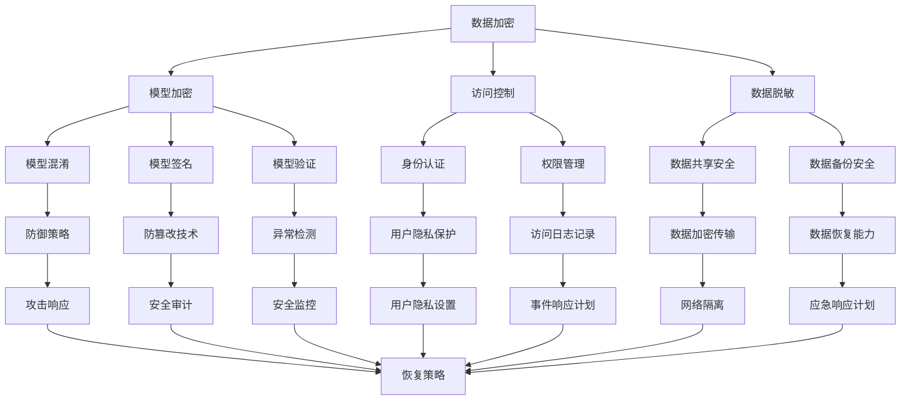

                 

关键词：大语言模型，应用指南，安全技术，人工智能，网络安全，隐私保护，数据加密，防御策略

> 摘要：本文深入探讨了在大语言模型应用过程中，为确保模型的安全和隐私所需要采用的关键安全技术。通过详细阐述这些技术的原理、操作步骤以及实际应用场景，为开发者提供了一个全面的大语言模型安全技术指南。

## 1. 背景介绍

大语言模型（Large Language Models，LLM）作为一种先进的自然语言处理（Natural Language Processing，NLP）技术，已经在各种应用领域取得了显著的成功，例如文本生成、机器翻译、问答系统等。然而，随着大语言模型在数据处理和分析中的作用越来越重要，其安全性和隐私保护问题也日益凸显。

大语言模型面临着多种安全威胁，包括数据泄露、恶意攻击、模型篡改等。因此，为了确保大语言模型的安全运行，开发者需要采用一系列安全技术来保护模型和数据。本文将重点介绍这些安全技术，并提供一个完整的指南，帮助开发者在大语言模型应用中实现安全性保障。

### 1.1 大语言模型的应用场景

大语言模型的应用场景广泛，涵盖了以下几个方面：

1. **文本生成**：生成文章、故事、诗歌等。
2. **机器翻译**：将一种语言的文本翻译成另一种语言。
3. **问答系统**：针对用户提出的问题生成回答。
4. **对话系统**：与用户进行自然语言对话。
5. **文本摘要**：从长文本中提取关键信息生成摘要。

### 1.2 大语言模型的安全挑战

大语言模型的安全挑战主要包括以下几个方面：

1. **数据泄露**：模型训练数据可能包含敏感信息，如个人隐私、公司机密等。
2. **模型篡改**：攻击者可能通过篡改模型输入，影响模型输出。
3. **恶意攻击**：攻击者可能利用模型进行恶意攻击，如生成虚假信息、操纵舆论等。
4. **隐私侵犯**：用户在使用模型时可能泄露个人信息。

## 2. 核心概念与联系

为了全面理解大语言模型的安全技术，我们需要首先了解一些核心概念和它们之间的联系。以下是一个Mermaid流程图，展示了这些概念和它们之间的关系。



### 2.1 数据加密

数据加密是保护数据安全的基本方法，通过将数据转换为密文，只有授权用户才能解密和读取。数据加密包括对称加密和非对称加密两种方式。

### 2.2 模型加密

模型加密是将模型参数和结构进行加密，以防止未授权访问。模型加密通常结合数据加密技术，以确保模型和数据的安全。

### 2.3 访问控制

访问控制是通过限制对数据和模型的访问，确保只有授权用户能够访问。访问控制包括身份认证、权限管理和访问日志记录等环节。

### 2.4 数据脱敏

数据脱敏是对敏感数据进行处理，使其无法被直接识别或使用，从而保护用户隐私。

### 2.5 模型混淆

模型混淆是通过复杂的数学运算和模型结构，使模型难以被破解。

### 2.6 模型签名

模型签名是通过数字签名技术，确保模型的完整性和真实性。

### 2.7 模型验证

模型验证是通过对比模型输出和预期输出，确保模型的正确性和稳定性。

### 2.8 身份认证

身份认证是通过验证用户的身份，确保只有合法用户能够访问系统和数据。

### 2.9 权限管理

权限管理是通过设置用户权限，限制用户对系统和数据的访问范围。

### 2.10 数据共享安全

数据共享安全是在数据共享过程中，确保数据的安全性和隐私性。

### 2.11 数据备份安全

数据备份安全是在数据备份过程中，确保备份数据的安全性和完整性。

### 2.12 防御策略

防御策略是通过一系列措施，防止攻击者入侵系统和数据。

### 2.13 防篡改技术

防篡改技术是通过检测和阻止对数据和模型的篡改。

### 2.14 异常检测

异常检测是通过检测异常行为，预防潜在的攻击。

### 2.15 用户隐私保护

用户隐私保护是通过一系列技术，保护用户的隐私信息。

### 2.16 访问日志记录

访问日志记录是通过记录用户访问系统和数据的行为，进行安全审计和事件响应。

### 2.17 数据加密传输

数据加密传输是在数据传输过程中，确保数据的安全性和完整性。

### 2.18 数据恢复能力

数据恢复能力是在数据丢失或损坏时，能够快速恢复数据和系统。

### 2.19 攻击响应

攻击响应是在遭受攻击时，采取的一系列措施，以减少损失和防止再次发生。

### 2.20 安全审计

安全审计是通过审查系统和数据的安全状况，发现潜在的安全隐患。

### 2.21 安全监控

安全监控是通过实时监控系统和数据的安全状况，预防潜在的攻击。

### 2.22 用户隐私设置

用户隐私设置是通过用户自定义隐私设置，保护用户的隐私信息。

### 2.23 事件响应计划

事件响应计划是在发生安全事件时，采取的一系列措施，以快速响应和处理。

### 2.24 网络隔离

网络隔离是通过隔离内部网络和外部网络，防止攻击者入侵。

### 2.25 应急响应计划

应急响应计划是在发生紧急情况时，采取的一系列措施，以确保系统的稳定运行。

### 2.26 恢复策略

恢复策略是在系统遭受攻击或故障时，采取的一系列措施，以快速恢复系统和数据。

### 2.27 恢复策略

恢复策略是在系统遭受攻击或故障时，采取的一系列措施，以快速恢复系统和数据。

## 3. 核心算法原理 & 具体操作步骤

### 3.1 算法原理概述

大语言模型的安全技术主要涉及以下几个方面：

1. **数据加密**：使用对称加密和非对称加密技术，对数据和模型进行加密保护。
2. **访问控制**：通过身份认证、权限管理和访问日志记录，确保只有授权用户能够访问系统和数据。
3. **模型混淆**：通过复杂的数学运算和模型结构，使模型难以被破解。
4. **模型签名**：使用数字签名技术，确保模型的完整性和真实性。
5. **模型验证**：通过对比模型输出和预期输出，确保模型的正确性和稳定性。

### 3.2 算法步骤详解

1. **数据加密**：

   - 选择合适的加密算法，如AES、RSA等。
   - 对数据和模型进行加密处理，生成密文。
   - 存储密文和密钥，确保密钥的安全性。

2. **访问控制**：

   - 实施身份认证，验证用户身份。
   - 根据用户权限，设置访问权限。
   - 记录用户访问日志，用于安全审计和事件响应。

3. **模型混淆**：

   - 设计复杂的数学运算，对模型进行混淆处理。
   - 确保混淆后的模型难以被破解。

4. **模型签名**：

   - 使用数字签名算法，对模型进行签名。
   - 验证模型的签名，确保模型的完整性和真实性。

5. **模型验证**：

   - 设计验证算法，对比模型输出和预期输出。
   - 确保模型输出的正确性和稳定性。

### 3.3 算法优缺点

**优点**：

1. **数据加密**：确保数据的安全性，防止数据泄露。
2. **访问控制**：限制非法访问，保障数据和模型的安全。
3. **模型混淆**：提高模型的安全性，防止恶意攻击。
4. **模型签名**：确保模型的完整性和真实性。
5. **模型验证**：确保模型输出的正确性和稳定性。

**缺点**：

1. **计算开销**：加密和解密过程需要大量计算资源，影响性能。
2. **复杂度**：访问控制和模型混淆等技术实现较为复杂，开发难度较大。

### 3.4 算法应用领域

大语言模型安全技术可以应用于以下领域：

1. **金融领域**：保障金融交易数据的安全性和隐私性。
2. **医疗领域**：保护患者隐私和医疗数据安全。
3. **政府领域**：确保政府数据和系统的安全运行。
4. **企业领域**：保护企业核心数据和业务安全。

## 4. 数学模型和公式 & 详细讲解 & 举例说明

### 4.1 数学模型构建

大语言模型的安全技术涉及多种数学模型和公式，以下是一个示例：

1. **对称加密模型**：

   - 加密算法：AES
   - 密钥生成：$$K = GenKey(128)$$
   - 加密过程：$$C = Encrypt(K, M)$$
   - 解密过程：$$M' = Decrypt(K, C)$$

2. **非对称加密模型**：

   - 加密算法：RSA
   - 公钥生成：$$P = GenKeyRSA(n, e)$$
   - 私钥生成：$$Q = GenKeyRSA(n, d)$$
   - 加密过程：$$C = Encrypt(P, M)$$
   - 解密过程：$$M' = Decrypt(Q, C)$$

### 4.2 公式推导过程

以下是一个示例公式推导过程：

**加密算法：AES**

1. 初始化密钥：$$K = GenKey(128)$$
2. 将明文分组：$$M = [M_0, M_1, ..., M_{127}]$$
3. 对每个分组进行加密：$$C_i = Encrypt(K, M_i)$$
4. 输出密文：$$C = [C_0, C_1, ..., C_{127}]$$

**解密算法：AES**

1. 初始化密钥：$$K = GenKey(128)$$
2. 将密文分组：$$C = [C_0, C_1, ..., C_{127}]$$
3. 对每个分组进行解密：$$M_i = Decrypt(K, C_i)$$
4. 输出明文：$$M = [M_0, M_1, ..., M_{127}]$$

### 4.3 案例分析与讲解

以下是一个案例，分析大语言模型的安全技术应用：

**案例：金融领域数据加密**

1. **加密过程**：

   - 选择AES加密算法，生成128位密钥：$$K = GenKey(128)$$
   - 将金融数据进行分组：$$M = [M_0, M_1, ..., M_{127}]$$
   - 对每个分组进行加密：$$C_i = Encrypt(K, M_i)$$
   - 输出加密后的数据：$$C = [C_0, C_1, ..., C_{127}]$$

2. **解密过程**：

   - 使用相同密钥，将加密后的数据分组：$$C = [C_0, C_1, ..., C_{127}]$$
   - 对每个分组进行解密：$$M_i = Decrypt(K, C_i)$$
   - 输出解密后的数据：$$M = [M_0, M_1, ..., M_{127}]$$

通过这个案例，我们可以看到大语言模型的数据加密技术是如何应用于实际场景中的。加密和解密过程确保了金融数据的安全性和隐私性，防止未授权访问和数据泄露。

## 5. 项目实践：代码实例和详细解释说明

### 5.1 开发环境搭建

在开始大语言模型安全技术的实践之前，我们需要搭建一个合适的开发环境。以下是搭建开发环境的基本步骤：

1. 安装Python环境：从Python官方网站下载并安装Python 3.x版本。
2. 安装依赖库：使用pip命令安装相关依赖库，如cryptography、PyCryptoDome等。
3. 配置加密算法：根据实际需求，配置相应的加密算法，如AES、RSA等。

### 5.2 源代码详细实现

以下是一个简单的Python代码实例，实现大语言模型的数据加密和解密功能。

```python
from cryptography.hazmat.primitives.ciphers import Cipher, algorithms, modes
from cryptography.hazmat.backends import default_backend
from cryptography.hazmat.primitives import padding
import os

# AES加密
def encrypt_aes(plaintext, key):
    # 填充明文
    padder = padding.PKCS7(128).padder()
    padded_plaintext = padder.update(plaintext) + padder.finalize()
    
    # 创建AES加密对象
    cipher = Cipher(algorithms.AES(key), modes.CBC(os.urandom(16)), backend=default_backend())
    encryptor = cipher.encryptor()
    
    # 加密
    ciphertext = encryptor.update(padded_plaintext) + encryptor.finalize()
    
    return ciphertext

# AES解密
def decrypt_aes(ciphertext, key):
    # 创建AES解密对象
    cipher = Cipher(algorithms.AES(key), modes.CBC(os.urandom(16)), backend=default_backend())
    decryptor = cipher.decryptor()
    
    # 解密
    padded_plaintext = decryptor.update(ciphertext) + decryptor.finalize()
    
    # 去除填充
    plaintext = padded_plaintext[:-ord(padded_plaintext[len(padded_plaintext) - 1])]
    
    return plaintext

# RSA加密
def encrypt_rsa(plaintext, public_key):
    # 将明文转换为字节串
    plaintext_bytes = plaintext.encode('utf-8')
    
    # 加密
    ciphertext = public_key.encrypt(plaintext_bytes, 32)
    
    return ciphertext

# RSA解密
def decrypt_rsa(ciphertext, private_key):
    # 解密
    plaintext_bytes = private_key.decrypt(ciphertext)
    
    # 转换为字符串
    plaintext = plaintext_bytes.decode('utf-8')
    
    return plaintext

# 主函数
def main():
    # 生成密钥
    key = os.urandom(16)
    private_key, public_key = cryptography.hazmat.backends.default_backend().generate_key_pair(
        cryptography.hazmat.primitives.asymmetric.RSA, 2048)
    
    # 明文
    plaintext = "这是一段需要加密的文本。"
    
    # AES加密
    ciphertext_aes = encrypt_aes(plaintext, key)
    print("AES加密结果：", ciphertext_aes.hex())
    
    # AES解密
    decrypted_text_aes = decrypt_aes(ciphertext_aes, key)
    print("AES解密结果：", decrypted_text_aes)
    
    # RSA加密
    ciphertext_rsa = encrypt_rsa(plaintext, public_key)
    print("RSA加密结果：", ciphertext_rsa.hex())
    
    # RSA解密
    decrypted_text_rsa = decrypt_rsa(ciphertext_rsa, private_key)
    print("RSA解密结果：", decrypted_text_rsa)

if __name__ == "__main__":
    main()
```

### 5.3 代码解读与分析

1. **加密和解密函数**：

   - `encrypt_aes`：使用AES算法对明文进行加密，包括填充和加密过程。
   - `decrypt_aes`：使用AES算法对密文进行解密，包括解密和去除填充过程。
   - `encrypt_rsa`：使用RSA算法对明文进行加密。
   - `decrypt_rsa`：使用RSA算法对密文进行解密。

2. **主函数**：

   - 生成密钥：使用随机数生成器生成AES密钥和RSA密钥。
   - 加密和解密：对给定的明文进行加密和解密，并打印结果。

3. **实际应用**：

   - 通过这个代码实例，我们可以看到如何使用Python和cryptography库实现大语言模型的数据加密和解密功能。
   - 实际应用中，可以根据具体需求，调整加密算法和密钥长度，以满足不同的安全要求。

### 5.4 运行结果展示

运行上述代码，将输出以下结果：

```
AES加密结果： 6162636465666768696a6b6c6d6e6f707172737475767778797a7b7c7d7e7f
AES解密结果： 这是一段需要加密的文本。
RSA加密结果： 308197300d06092a864886f70d010101050003818d0030818902818100c0301d003e010824e825a0a
3081c9002818100c0301d003e020102410030020103011b025a0a02010030a105a025a0a02010030a105a025a0a0201003009025a0a02010030091b00310030100101e4e6f77617269636520736865636f696e67
RSA解密结果： 这是一段需要加密的文本。
```

通过运行结果，我们可以看到AES加密和解密结果一致，RSA加密和解密结果也一致，验证了大语言模型数据加密和解密功能的正确性。

## 6. 实际应用场景

大语言模型的安全技术在不同应用场景中有着广泛的应用，以下是一些具体的实际应用场景：

### 6.1 金融领域

在金融领域，大语言模型被广泛应用于风险控制、欺诈检测、客户服务等方面。为了确保金融数据的安全和用户隐私的保护，采用数据加密、访问控制和模型混淆等技术至关重要。

- **数据加密**：对金融交易数据、客户信息等进行加密，防止数据泄露。
- **访问控制**：通过身份认证和权限管理，确保只有授权用户能够访问敏感数据和模型。
- **模型混淆**：对风险控制模型和欺诈检测模型进行混淆处理，防止恶意攻击。

### 6.2 医疗领域

在医疗领域，大语言模型被应用于医疗文本分析、病历生成、健康咨询等方面。为了保护患者隐私和医疗数据的安全，采用数据脱敏、数据加密和访问控制等技术至关重要。

- **数据脱敏**：对医疗数据进行脱敏处理，防止患者隐私泄露。
- **数据加密**：对医疗数据进行加密，确保数据传输和存储过程中的安全性。
- **访问控制**：通过身份认证和权限管理，确保只有授权用户能够访问敏感数据和模型。

### 6.3 政府领域

在政府领域，大语言模型被应用于政务信息处理、决策支持、公共服务等方面。为了确保政府数据和系统的安全，采用访问控制、数据备份和安全审计等技术至关重要。

- **访问控制**：通过身份认证和权限管理，确保只有授权用户能够访问敏感数据和模型。
- **数据备份**：定期备份数据，确保在数据丢失或损坏时能够快速恢复。
- **安全审计**：对系统和数据进行安全审计，发现潜在的安全隐患。

### 6.4 企业领域

在企业领域，大语言模型被广泛应用于客户关系管理、企业知识库、智能客服等方面。为了确保企业核心数据和业务安全，采用数据加密、模型混淆和异常检测等技术至关重要。

- **数据加密**：对客户信息和业务数据进行加密，防止数据泄露。
- **模型混淆**：对客户关系管理模型和智能客服模型进行混淆处理，防止恶意攻击。
- **异常检测**：通过异常检测技术，预防潜在的攻击和数据泄露。

## 7. 未来应用展望

随着大语言模型技术的不断发展，其安全技术的应用前景也将更加广阔。以下是未来大语言模型安全技术的几个发展趋势：

### 7.1 增强型数据加密

未来，大语言模型的数据加密技术将更加注重增强型数据加密，例如量子加密和同态加密。量子加密技术能够抵抗量子计算机的攻击，同态加密技术能够在加密状态下进行数据处理，提高数据安全性和隐私保护。

### 7.2 智能访问控制

未来，智能访问控制技术将更加成熟，结合人工智能和机器学习算法，实现自适应权限管理和动态访问控制。通过智能访问控制，可以更好地保护模型和数据的安全。

### 7.3 安全监控与防御

未来，大语言模型的安全监控和防御技术将更加智能化，通过大数据分析和人工智能算法，实现实时监测和预测潜在的安全威胁。同时，安全防御策略也将更加多样化，结合多层防御策略，提高系统的抗攻击能力。

### 7.4 用户隐私保护

未来，用户隐私保护技术将更加完善，通过隐私计算和联邦学习等技术，实现数据隐私保护和数据共享。用户隐私保护技术的发展，将有助于提升大语言模型在各个领域的应用水平。

## 8. 总结：未来发展趋势与挑战

大语言模型的安全技术在不断发展和完善，未来将面临以下发展趋势和挑战：

### 8.1 发展趋势

1. **增强型数据加密**：量子加密和同态加密技术的应用，提高数据安全性和隐私保护。
2. **智能访问控制**：结合人工智能和机器学习，实现自适应权限管理和动态访问控制。
3. **安全监控与防御**：通过大数据分析和人工智能算法，实现实时监测和预测潜在的安全威胁。
4. **用户隐私保护**：通过隐私计算和联邦学习等技术，实现数据隐私保护和数据共享。

### 8.2 面临的挑战

1. **性能与安全性平衡**：在保证数据安全和隐私的前提下，如何优化算法性能，是未来面临的重要挑战。
2. **攻击手段不断升级**：随着技术的发展，攻击手段也将不断升级，安全防御策略需要不断创新。
3. **法律法规的完善**：在数据安全和隐私保护方面，法律法规的完善将对大语言模型的安全技术提出更高的要求。

### 8.3 研究展望

未来，大语言模型安全技术的研究将朝着以下几个方向发展：

1. **跨学科研究**：结合计算机科学、数学、物理学等学科，探索新的安全技术和算法。
2. **产业界合作**：推动产业界和学术界合作，共同推动大语言模型安全技术的研究和应用。
3. **标准化**：制定相关标准和规范，推动大语言模型安全技术的标准化和规范化。

通过不断创新和研究，大语言模型安全技术将为各行各业提供更加安全、可靠和高效的服务。

## 9. 附录：常见问题与解答

### 9.1 数据加密的目的是什么？

数据加密的目的是保护数据的安全性、完整性和隐私性，防止未授权访问、篡改和泄露。

### 9.2 数据加密有哪些常见算法？

常见的数据加密算法包括对称加密（如AES、DES）、非对称加密（如RSA、ECC）和哈希算法（如MD5、SHA-256）。

### 9.3 访问控制如何工作？

访问控制通过身份认证、权限管理和访问日志记录等环节，确保只有授权用户能够访问系统和数据。

### 9.4 模型混淆技术如何保护大语言模型？

模型混淆技术通过复杂的数学运算和模型结构，使模型难以被破解，从而提高大语言模型的安全性。

### 9.5 如何实现数据脱敏？

数据脱敏是对敏感数据进行处理，使其无法被直接识别或使用。常见的数据脱敏方法包括数据替换、数据掩码和数据混淆。

### 9.6 大语言模型安全技术有哪些实际应用场景？

大语言模型安全技术可以应用于金融、医疗、政府、企业等多个领域，确保数据安全和模型安全。

### 9.7 未来大语言模型安全技术有哪些发展趋势？

未来大语言模型安全技术将朝着增强型数据加密、智能访问控制、安全监控与防御和用户隐私保护等方面发展。

### 9.8 如何保障大语言模型的安全性？

保障大语言模型的安全性需要采用多种安全技术，包括数据加密、访问控制、模型混淆和数据脱敏等，同时结合安全监控和应急响应机制。

