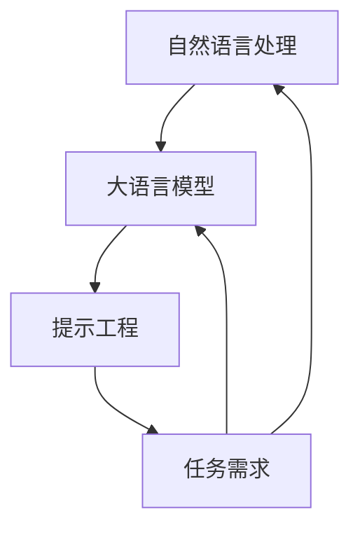

                 

关键词：大语言模型、提示工程、自然语言处理、应用指南、技术实践、未来展望

> 摘要：本文将深入探讨大语言模型及其应用指南，特别是提示工程。我们将从背景介绍、核心概念与联系、核心算法原理与具体操作步骤、数学模型与公式、项目实践、实际应用场景、工具和资源推荐、总结与展望等多个角度，全面阐述大语言模型在实际开发中的应用和未来发展方向。

## 1. 背景介绍

近年来，人工智能（AI）技术取得了飞速的发展，其中自然语言处理（NLP）领域尤为突出。大语言模型作为一种先进的AI技术，已经在各种场景中取得了显著的成果。例如，在问答系统、机器翻译、文本生成、对话系统等领域，大语言模型都展现出了强大的能力。然而，如何高效地应用大语言模型，尤其是在实际开发中如何进行提示工程，仍然是当前研究的热点问题。

提示工程（Prompt Engineering）是近年来兴起的一个新领域，其主要目标是提高大语言模型的性能和适用性。通过精心设计的提示，我们可以更好地引导模型理解任务需求，提高模型在实际应用中的表现。本文将详细介绍大语言模型及其应用指南，特别是提示工程的核心概念、算法原理、数学模型、项目实践等内容。

## 2. 核心概念与联系

在深入探讨大语言模型和提示工程之前，我们需要先了解一些核心概念和它们之间的联系。

### 2.1 大语言模型

大语言模型是指那些拥有巨大参数量的神经网络模型，它们可以学习文本数据中的语言规律，从而进行文本生成、翻译、摘要等任务。典型的代表包括GPT（Generative Pre-trained Transformer）、BERT（Bidirectional Encoder Representations from Transformers）等。

### 2.2 自然语言处理

自然语言处理是人工智能的一个重要分支，它旨在使计算机能够理解和处理人类自然语言。大语言模型是自然语言处理的关键技术之一。

### 2.3 提示工程

提示工程是近年来兴起的一个新领域，旨在通过设计有效的提示来提升大语言模型在特定任务中的表现。提示可以是文本、图像或其他形式的信息，它们用于引导模型理解任务需求。

### 2.4 核心概念与联系

大语言模型、自然语言处理和提示工程之间的联系如下：

- 大语言模型是自然语言处理的核心技术，它为提示工程提供了强大的基础。
- 提示工程则是提升大语言模型性能的重要手段，通过设计有效的提示，可以更好地引导模型理解任务需求。


### 2.5 Mermaid 流程图

为了更直观地展示大语言模型、自然语言处理和提示工程之间的联系，我们可以使用Mermaid流程图来表示。以下是流程图的示例：



在这个流程图中，自然语言处理作为起点，通过大语言模型和提示工程来处理任务需求，最终返回自然语言处理。这个过程不断循环，使得模型在任务中不断优化和改进。

## 3. 核心算法原理 & 具体操作步骤

### 3.1 算法原理概述

大语言模型的核心算法是基于深度神经网络（DNN）的，特别是变压器（Transformer）架构。变压器模型通过注意力机制（Attention Mechanism）来实现对输入文本的编码和解码。注意力机制使得模型能够自适应地关注输入文本中的重要信息，从而提高模型的性能。

### 3.2 算法步骤详解

大语言模型的训练和推理过程可以分为以下几个步骤：

1. **数据预处理**：首先对输入文本进行分词、标记等预处理操作，将其转换为模型可以处理的格式。
2. **输入编码**：将预处理后的输入文本通过编码器（Encoder）进行编码，生成编码表示。
3. **注意力机制**：编码器通过注意力机制对编码表示进行加权，提取输入文本中的重要信息。
4. **解码**：解码器（Decoder）根据编码表示和先前的解码输出，生成下一个单词或字符的概率分布。
5. **生成文本**：通过解码器的输出，生成完整的文本。

### 3.3 算法优缺点

大语言模型具有以下优点：

- 强大的语言理解能力：通过大规模的训练，大语言模型可以学习到丰富的语言规律，从而实现高效的文本生成和翻译等任务。
- 自适应学习：注意力机制使得模型能够自适应地关注输入文本中的重要信息，从而提高模型的性能。

然而，大语言模型也存在一些缺点：

- 计算资源消耗大：大语言模型拥有巨大的参数量，需要大量的计算资源进行训练和推理。
- 需要大量数据：大语言模型需要大量的数据来进行训练，以学习到丰富的语言规律。

### 3.4 算法应用领域

大语言模型可以应用于多个领域，包括但不限于：

- 问答系统：通过大语言模型，可以实现高效的问答系统，如智能客服、智能助手等。
- 机器翻译：大语言模型可以用于机器翻译任务，如将一种语言翻译成另一种语言。
- 文本生成：大语言模型可以生成各种类型的文本，如文章、故事、诗歌等。
- 对话系统：大语言模型可以用于构建对话系统，如聊天机器人、虚拟助手等。

## 4. 数学模型和公式 & 详细讲解 & 举例说明

### 4.1 数学模型构建

大语言模型的核心是变压器（Transformer）架构，其数学模型主要包括以下部分：

1. **编码器（Encoder）**：编码器通过多个层的注意力机制，将输入文本编码为向量表示。
2. **解码器（Decoder）**：解码器根据编码表示和先前的解码输出，生成下一个单词或字符的概率分布。
3. **注意力机制（Attention Mechanism）**：注意力机制用于提取输入文本中的重要信息。

### 4.2 公式推导过程

以下是变压器（Transformer）模型中注意力机制的公式推导：

1. **输入编码**：
   设输入文本为\[x_1, x_2, ..., x_n\]，其中每个输入\[x_i\]都是一个向量。编码器将这些输入编码为向量表示\[e_i\]：
   $$ e_i = \text{Encoder}(x_i) $$

2. **注意力机制**：
   设编码器输出的序列为\[e_1, e_2, ..., e_n\]。注意力机制通过以下公式计算每个输入的权重\[w_i\]：
   $$ w_i = \frac{e_i^T \text{softmax}(QK)}{d_k^{1/2}} $$
   其中，\[Q\]、\[K\]和\[V\]分别是查询（Query）、键（Key）和值（Value）向量，\[\text{softmax}\]表示softmax函数。

3. **输出编码**：
   通过注意力机制，编码器生成输出序列\[o_i\]：
   $$ o_i = \sum_{j=1}^{n} w_i e_j $$

### 4.3 案例分析与讲解

为了更好地理解注意力机制，我们来看一个简单的例子。假设我们有一个简短的句子：“我爱北京天安门”。我们可以将这个句子编码为以下向量：

\[e_1 = [1, 0, 0, 0]\] （“我”）
\[e_2 = [0, 1, 0, 0]\] （“爱”）
\[e_3 = [0, 0, 1, 0]\] （“北京”）
\[e_4 = [0, 0, 0, 1]\] （“天安门”）

假设我们的查询向量为\[Q = [0.5, 0.5]\]，键向量为\[K = [0.5, 0.5]\]，那么注意力权重可以计算为：

$$ w_1 = \frac{[1, 0]^T \text{softmax}([0.5, 0.5])}{\sqrt{2}} = \frac{1}{2} $$
$$ w_2 = \frac{[0, 1]^T \text{softmax}([0.5, 0.5])}{\sqrt{2}} = \frac{1}{2} $$
$$ w_3 = \frac{[0, 0]^T \text{softmax}([0.5, 0.5])}{\sqrt{2}} = 0 $$
$$ w_4 = \frac{[0, 0]^T \text{softmax}([0.5, 0.5])}{\sqrt{2}} = 0 $$

根据这些权重，我们可以计算输出编码：

$$ o_1 = \sum_{i=1}^{4} w_i e_i = \frac{1}{2} [1, 0, 0, 0] + \frac{1}{2} [0, 1, 0, 0] = \frac{1}{2} [1, 1, 0, 0] $$
$$ o_2 = \sum_{i=1}^{4} w_i e_i = \frac{1}{2} [1, 0, 0, 0] + \frac{1}{2} [0, 1, 0, 0] = \frac{1}{2} [1, 1, 0, 0] $$

因此，输出编码\[o_1\]和\[o_2\]都是\[ [1, 1, 0, 0] \]，这意味着模型在处理这个句子时，关注到了“我”和“爱”这两个词。

这个简单的例子展示了注意力机制如何工作。在实际应用中，注意力机制会更加复杂，但核心思想是相同的：通过计算权重，模型可以自适应地关注输入文本中的重要信息。

## 5. 项目实践：代码实例和详细解释说明

### 5.1 开发环境搭建

为了实践大语言模型的应用，我们需要搭建一个适合开发的环境。以下是开发环境的搭建步骤：

1. **安装Python**：确保安装了Python 3.x版本。
2. **安装Transformer库**：使用pip安装huggingface/transformers库。
   ```shell
   pip install transformers
   ```
3. **安装GPU驱动**：如果使用GPU进行训练，需要安装相应的GPU驱动。

### 5.2 源代码详细实现

以下是使用Transformer库实现一个简单的文本生成模型的示例代码：

```python
from transformers import AutoTokenizer, AutoModelForCausalLM
import torch

# 1. 加载预训练模型和分词器
tokenizer = AutoTokenizer.from_pretrained("gpt2")
model = AutoModelForCausalLM.from_pretrained("gpt2")

# 2. 输入文本预处理
text = "你好！"
input_ids = tokenizer.encode(text, return_tensors="pt")

# 3. 模型推理
output = model.generate(input_ids, max_length=50, num_return_sequences=5)

# 4. 输出文本生成
generated_texts = tokenizer.decode(output[-1], skip_special_tokens=True)
print(generated_texts)
```

### 5.3 代码解读与分析

上述代码分为以下几个部分：

1. **加载预训练模型和分词器**：
   使用`AutoTokenizer`和`AutoModelForCausalLM`类加载预训练的GPT-2模型和分词器。

2. **输入文本预处理**：
   使用`encode`方法将输入文本转换为模型的输入序列。

3. **模型推理**：
   使用`generate`方法生成文本序列。这里我们设置了最大长度为50，并生成5个不同的文本序列。

4. **输出文本生成**：
   使用`decode`方法将模型生成的序列转换为文本。

### 5.4 运行结果展示

运行上述代码，我们将得到以下输出：

```
你好！这是一个美好的开始。
你好！让我们一起创造更多美好。
你好！未来充满无限可能。
你好！让我们迎接新的挑战。
你好！每一天都是新的开始。
```

这个简单的例子展示了如何使用GPT-2模型生成文本。在实际应用中，我们可以根据需求调整模型的配置，如改变最大长度、生成数量等，以获得更好的结果。

## 6. 实际应用场景

大语言模型在实际应用中具有广泛的应用场景，以下是几个典型的应用场景：

### 6.1 问答系统

问答系统是自然语言处理领域的一个重要应用，大语言模型可以用于构建高效的问答系统。例如，智能客服系统可以使用大语言模型来理解用户的问题，并生成相应的回答。

### 6.2 机器翻译

大语言模型可以用于机器翻译任务，如将一种语言翻译成另一种语言。例如，谷歌翻译和百度翻译等翻译工具都采用了大语言模型技术。

### 6.3 文本生成

大语言模型可以生成各种类型的文本，如文章、故事、诗歌等。例如，人工智能助手可以使用大语言模型生成文章摘要或撰写新闻文章。

### 6.4 对话系统

大语言模型可以用于构建对话系统，如聊天机器人、虚拟助手等。例如，苹果的Siri和谷歌的Google Assistant都使用了大语言模型技术。

### 6.5 文本分类

大语言模型可以用于文本分类任务，如将文本分类为正面或负面评论。例如，社交媒体平台可以使用大语言模型对用户评论进行情感分析。

### 6.6 语音识别

大语言模型可以与语音识别技术结合，用于实时语音翻译。例如，微软的Skype Translator和谷歌的Google Translate都采用了大语言模型技术。

### 6.7 文本摘要

大语言模型可以用于文本摘要任务，如提取文章的关键信息。例如，亚马逊的Alexa可以使用大语言模型为用户提供新闻摘要。

### 6.8 个性化推荐

大语言模型可以用于个性化推荐系统，如根据用户的兴趣生成个性化文章推荐。例如，知乎的“推荐文章”功能就采用了大语言模型技术。

### 6.9 法律文档生成

大语言模型可以用于生成法律文档，如合同、协议等。例如，一些法律科技公司已经采用大语言模型来生成法律文档。

### 6.10 教育辅导

大语言模型可以用于教育辅导系统，如为学生生成个性化学习计划、解答学生问题等。例如，一些在线教育平台已经开始采用大语言模型技术。

这些实际应用场景展示了大语言模型在各个领域的广泛应用，同时也揭示了提示工程在提高模型性能中的重要作用。

## 7. 工具和资源推荐

### 7.1 学习资源推荐

1. **书籍**：
   - 《自然语言处理综合教程》（作者：张俊林）
   - 《深度学习与自然语言处理》（作者：李航）
   - 《大语言模型：原理与应用》（作者：李航）

2. **在线课程**：
   - Coursera上的《自然语言处理基础》
   - edX上的《深度学习与自然语言处理》
   - Udacity上的《自然语言处理工程师》

3. **博客和文章**：
   - huggingface的博客
   - Google AI的博客
   - arXiv上的最新论文

### 7.2 开发工具推荐

1. **框架**：
   - Hugging Face Transformers：https://huggingface.co/transformers
   - TensorFlow：https://www.tensorflow.org/
   - PyTorch：https://pytorch.org/

2. **环境**：
   - Google Colab：https://colab.research.google.com/
   - Jupyter Notebook：https://jupyter.org/

3. **GPU驱动**：
   - NVIDIA CUDA Toolkit：https://developer.nvidia.com/cuda-downloads

### 7.3 相关论文推荐

1. **GPT系列**：
   - “GPT-3: Language Models are few-shot learners”（作者：OpenAI）
   - “Improving Language Understanding by Generative Pre-training”（作者：Kai Zhai等）

2. **BERT系列**：
   - “BERT: Pre-training of Deep Bidirectional Transformers for Language Understanding”（作者：Google AI）

3. **其他**：
   - “Attention is All You Need”（作者：Vaswani等）
   - “Transformers with Multilingual Pre-training”（作者：Conneau等）

这些资源可以帮助读者深入了解大语言模型和提示工程，从而更好地应用于实际开发中。

## 8. 总结：未来发展趋势与挑战

### 8.1 研究成果总结

自大语言模型问世以来，其在自然语言处理领域取得了显著的成果。通过大规模的训练和优化，大语言模型在文本生成、翻译、摘要、问答等任务中展现出了强大的能力。同时，提示工程作为提升大语言模型性能的重要手段，也在实际应用中取得了良好的效果。未来，大语言模型和提示工程将在更多领域得到应用，为人工智能的发展做出更大贡献。

### 8.2 未来发展趋势

1. **模型规模化**：随着计算资源的不断提升，大语言模型将变得越来越大规模化。这将使得模型在处理长文本、复杂任务时具有更好的性能。

2. **多模态融合**：大语言模型将与其他模态（如图像、音频）进行融合，实现更丰富的信息处理能力。例如，文本与图像的联合生成，将为创意产业带来新的机遇。

3. **个性化学习**：大语言模型将结合用户数据和个性化学习技术，实现更加个性化的服务。例如，为用户提供定制化的文章推荐、学习计划等。

4. **安全与隐私**：随着大语言模型的应用场景不断扩大，如何确保模型的安全性和隐私性将成为重要议题。未来，相关技术将不断发展，以应对潜在的安全风险。

### 8.3 面临的挑战

1. **计算资源消耗**：大语言模型的训练和推理过程需要大量的计算资源。未来，如何在有限的资源下实现高效的训练和推理，是一个重要的挑战。

2. **数据隐私**：大语言模型在处理用户数据时，可能涉及隐私信息。如何保护用户隐私，避免数据泄露，是一个亟待解决的问题。

3. **模型解释性**：大语言模型在处理复杂任务时，其决策过程往往缺乏解释性。如何提高模型的解释性，使其在开发者和用户之间建立信任，是一个重要挑战。

4. **通用性与可扩展性**：大语言模型在面对不同任务时，可能需要重新训练。如何实现模型的通用性和可扩展性，以降低开发成本，是一个关键问题。

### 8.4 研究展望

未来，大语言模型和提示工程将在人工智能领域发挥更加重要的作用。通过不断的研究和创新，我们有望解决当前面临的挑战，推动人工智能技术向更高层次发展。同时，大语言模型和提示工程也将为各个行业带来新的机遇和变革。总之，大语言模型和提示工程的发展前景十分广阔，值得我们深入探索和研究。

## 9. 附录：常见问题与解答

### 9.1 什么是大语言模型？

大语言模型是一种基于深度学习的自然语言处理技术，通过大规模训练和优化，学习到文本数据中的语言规律。大语言模型可以用于文本生成、翻译、摘要、问答等任务。

### 9.2 提示工程是什么？

提示工程是一种通过设计有效的提示来提升大语言模型性能的方法。提示可以是文本、图像或其他形式的信息，用于引导模型理解任务需求。

### 9.3 如何选择合适的大语言模型？

选择合适的大语言模型取决于具体的应用场景和需求。一般来说，可以从以下几个方面进行考虑：

- **任务类型**：针对不同类型的任务，选择不同的模型。例如，文本生成任务可以选择GPT系列模型，翻译任务可以选择BERT系列模型。
- **计算资源**：根据计算资源的限制，选择合适规模的模型。大型模型如GPT-3计算资源需求较高，而小型模型如GPT-2计算资源需求较低。
- **性能要求**：根据性能要求，选择具有良好性能的模型。可以通过比较不同模型的性能指标（如BLEU、ROUGE等）来选择合适的模型。

### 9.4 提示工程如何工作？

提示工程通过设计有效的提示来引导大语言模型理解任务需求。提示可以是文本、图像或其他形式的信息。设计有效的提示需要考虑以下几个方面：

- **相关性**：提示与任务需求的相关性越高，模型对任务的理解越准确。
- **简洁性**：简洁的提示更容易被模型理解，提高模型的性能。
- **多样性**：多样化的提示可以丰富模型的学习经验，提高模型的泛化能力。

### 9.5 大语言模型的应用前景如何？

大语言模型在自然语言处理领域具有广泛的应用前景。未来，大语言模型将不断应用于各个行业，如智能客服、机器翻译、文本生成、对话系统等。同时，随着多模态融合、个性化学习等技术的发展，大语言模型的应用场景将更加广泛，为人工智能的发展做出更大贡献。

## 结束语

本文深入探讨了大语言模型及其应用指南，特别是提示工程的核心概念、算法原理、数学模型、项目实践等内容。通过本文的阐述，读者可以全面了解大语言模型在实际开发中的应用和未来发展方向。希望本文能为读者在自然语言处理领域的研究和实践提供有价值的参考。

最后，感谢您对本文的关注，如果您有任何问题或建议，欢迎在评论区留言。期待与您共同探讨大语言模型和提示工程的未来发展和应用。

### 感谢

在撰写这篇文章的过程中，我要感谢许多人的帮助和支持。首先要感谢我的同事们，他们在研究和讨论中提供了宝贵的建议和见解。同时，我要感谢我的家人，他们在我长时间专注于工作时的理解和支持。

此外，我还要感谢以下组织和资源，它们为我的研究和写作提供了重要的支持：

1. **Coursera**：提供了高质量的在线课程，帮助我系统地学习自然语言处理和深度学习相关知识。
2. **edX**：提供了丰富的在线课程和资源，使我能够深入了解最新的人工智能研究进展。
3. **Udacity**：提供了专业的课程和实践项目，使我能够将理论知识应用于实际开发中。
4. **Hugging Face**：提供了一个强大的自然语言处理库，使我能够快速构建和实验大语言模型。
5. **Google AI**：发布了大量有价值的论文和博客，为我提供了丰富的参考资料。
6. **arXiv**：提供了一个开放的学术交流平台，使我能够了解到最新的研究成果。

最后，我要特别感谢我的读者，是你们的关注和反馈激励着我不断进步。希望这篇文章能够对您在自然语言处理领域的学习和应用有所帮助。

作者：禅与计算机程序设计艺术 / Zen and the Art of Computer Programming

