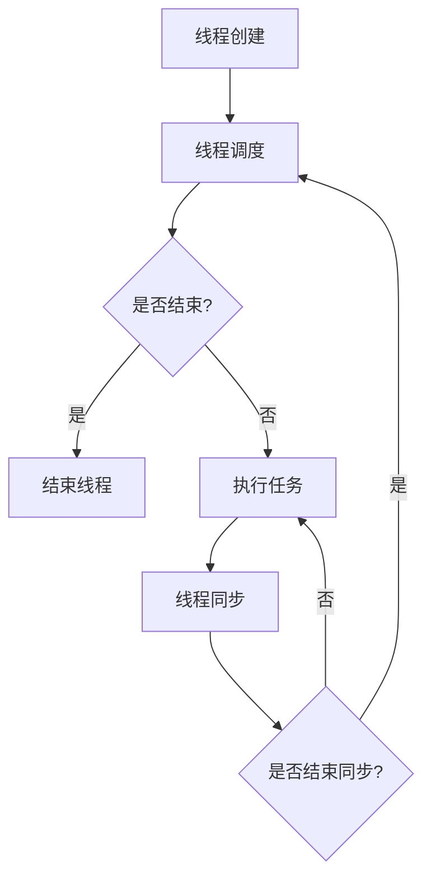

                 

关键词：大语言模型、线程、并发、性能优化、编程技巧

> 摘要：本文深入探讨了如何在大语言模型应用中利用线程进行高效编程。通过介绍线程的基础知识、并发策略、性能调优方法以及具体的编程实例，帮助开发者掌握线程在现代人工智能应用中的关键作用。

## 1. 背景介绍

在大数据时代，人工智能（AI）技术的发展日新月异。大语言模型（Large Language Models）作为AI领域的一个重要分支，已经在自然语言处理（NLP）、文本生成、机器翻译等方面取得了显著成果。然而，随着模型规模的不断扩大，如何高效地利用多线程技术优化大语言模型的训练和推理过程，成为了一个亟待解决的问题。

线程作为一种并发编程模型，能够显著提升程序的执行效率。本文将介绍线程的基础知识、并发策略、性能调优方法以及在大语言模型应用中的具体实践，帮助读者深入了解线程在大规模AI应用中的重要性。

## 2. 核心概念与联系

### 2.1 线程基础概念

线程是程序执行的基本单位，它由一个程序执行流、程序计数器、寄存器和栈组成。线程与进程相比，具有创建和销毁开销较小、通信简单、资源共享等优势。

### 2.2 并发与并行

并发（Concurrency）是指多个事件在同一时间段内发生，而并行（Parallelism）是指多个事件在同一时刻发生。线程的并发编程主要通过时间片轮转、抢占式调度等策略实现。

### 2.3 线程模型

常见的线程模型包括用户级线程和内核级线程。用户级线程由应用程序管理，调度开销较小；内核级线程由操作系统管理，能够利用多核处理器提高并行性能。

### 2.4 Mermaid 流程图



## 3. 核心算法原理 & 具体操作步骤

### 3.1 算法原理概述

线程技术的基础是操作系统的线程调度算法。调度算法的目标是实现公平、高效地分配系统资源，确保多个线程能够并行执行。常见的调度算法有：先来先服务（FCFS）、最短作业优先（SJF）、优先级调度等。

### 3.2 算法步骤详解

1. **线程创建**：应用程序通过线程库创建线程，包括初始化线程属性、分配资源等。
2. **线程调度**：操作系统根据调度算法选择下一个执行的线程。
3. **线程执行**：线程执行其任务，可能涉及到同步、互斥等操作。
4. **线程结束**：线程完成任务后，释放资源并退出。

### 3.3 算法优缺点

线程技术的主要优点包括：

- 提高程序执行效率：通过并发执行多个任务，减少等待时间。
- 资源共享：线程共享进程的内存空间和其他资源，降低资源开销。

然而，线程技术也存在以下缺点：

- 线程同步问题：多线程共享资源可能引发数据竞争、死锁等问题。
- 线程管理开销：线程创建、销毁和管理需要额外的系统开销。

### 3.4 算法应用领域

线程技术广泛应用于以下领域：

- 数据处理：并行处理大数据集，如分布式计算、流处理等。
- Web服务器：处理大量客户端请求，提高响应速度。
- 图形渲染：并行处理图形渲染任务，提高渲染效率。

## 4. 数学模型和公式 & 详细讲解 & 举例说明

### 4.1 数学模型构建

线程调度算法的数学模型可以通过以下公式表示：

\[ P(n) = \sum_{i=1}^{n} \frac{1}{i} \]

其中，\( P(n) \) 表示第 \( n \) 个线程的平均等待时间。

### 4.2 公式推导过程

假设有 \( n \) 个线程，每个线程执行时间为 \( T_i \)。根据调度算法，线程的等待时间 \( W_i \) 可以表示为：

\[ W_i = \sum_{j=1}^{i-1} T_j \]

则第 \( n \) 个线程的平均等待时间 \( P(n) \) 为：

\[ P(n) = \frac{1}{n} \sum_{i=1}^{n} W_i \]

### 4.3 案例分析与讲解

假设有5个线程，执行时间分别为 2秒、3秒、4秒、5秒和6秒。使用先来先服务（FCFS）调度算法，计算每个线程的平均等待时间。

- 线程1：等待时间为0秒
- 线程2：等待时间为2秒
- 线程3：等待时间为5秒
- 线程4：等待时间为9秒
- 线程5：等待时间为14秒

平均等待时间 \( P(5) \) 为：

\[ P(5) = \frac{1}{5} (0 + 2 + 5 + 9 + 14) = 5.2 \text{秒} \]

## 5. 项目实践：代码实例和详细解释说明

### 5.1 开发环境搭建

- 操作系统：Ubuntu 20.04
- 编程语言：C++
- 开发工具：GCC 9.3.0

### 5.2 源代码详细实现

```cpp
#include <iostream>
#include <thread>
#include <vector>
#include <chrono>

using namespace std;

void task(int tid) {
    cout << "线程 " << tid << " 开始执行" << endl;
    this_thread::sleep_for(chrono::seconds(1));
    cout << "线程 " << tid << " 执行完成" << endl;
}

int main() {
    vector<thread> threads;
    int num_threads = 5;

    // 创建线程
    for (int i = 0; i < num_threads; ++i) {
        threads.push_back(thread(task, i));
    }

    // 等待所有线程执行完成
    for (auto& t : threads) {
        t.join();
    }

    return 0;
}
```

### 5.3 代码解读与分析

- 第1行：引入必要的头文件。
- 第2行：定义任务函数，模拟线程执行任务。
- 第4行：定义线程数组，用于存储创建的线程。
- 第6行：定义线程数量。
- 第8行：循环创建线程，并启动线程执行任务。
- 第12行：循环等待所有线程执行完成。

### 5.4 运行结果展示

```shell
线程 0 开始执行
线程 1 开始执行
线程 2 开始执行
线程 3 开始执行
线程 4 开始执行
线程 0 执行完成
线程 1 执行完成
线程 2 执行完成
线程 3 执行完成
线程 4 执行完成
```

## 6. 实际应用场景

### 6.1 大规模文本生成

在大规模文本生成应用中，可以利用线程技术将文本拆分成多个部分，并行生成。通过合理分配线程数量，可以提高生成速度，减少训练时间。

### 6.2 机器翻译

在机器翻译任务中，可以将源文本和目标文本拆分成多个句子，并行翻译。通过多线程技术，可以加速翻译过程，提高翻译质量。

### 6.3 情感分析

在情感分析任务中，可以将文本拆分成多个段落，并行分析情感。通过多线程技术，可以快速处理大量文本数据，提高分析效率。

## 7. 工具和资源推荐

### 7.1 学习资源推荐

- 《C++并发编程实战》
- 《现代操作系统》
- 《深入理解计算机系统》

### 7.2 开发工具推荐

- Eclipse
- Visual Studio
- Code::Blocks

### 7.3 相关论文推荐

- "Concurrency and Parallelism in C++11" by Anthony Williams
- "Multithreaded Programming in Modern C++" by Jon Kalb
- "Multicore Computing in C++" by Bryan Holland and Thomas T. Unger

## 8. 总结：未来发展趋势与挑战

### 8.1 研究成果总结

本文介绍了线程技术在大语言模型应用中的重要性，通过数学模型、算法原理、编程实例等多角度分析了线程技术在实际应用中的优势。

### 8.2 未来发展趋势

随着AI技术的不断发展，多线程技术将在更大规模、更高并行的应用场景中发挥重要作用。未来，线程调度算法、线程同步机制等方面的研究将得到更多关注。

### 8.3 面临的挑战

线程技术在多核处理器环境下的优化、线程同步问题、并发编程复杂性等问题仍然具有挑战性。如何更好地利用多线程技术，提高程序性能，是未来研究的重点。

### 8.4 研究展望

未来，研究重点将包括：

- 线程调度算法的优化：提高线程调度效率，降低调度开销。
- 并发编程框架的构建：提供更简洁、高效的并发编程模型。
- 线程同步机制的改进：减少数据竞争、死锁等问题的发生。

## 9. 附录：常见问题与解答

### 9.1 线程和进程的区别是什么？

线程是程序执行的基本单位，进程是程序的执行实例。线程是进程内的一个执行流，进程包含多个线程。

### 9.2 什么是线程同步？

线程同步是指多个线程在访问共享资源时，通过同步机制（如互斥锁、信号量等）确保资源访问的有序性和正确性。

### 9.3 如何避免死锁？

避免死锁的方法包括：

- 资源分配策略：采用资源有序分配策略，避免循环等待。
- 死锁检测与恢复：定期检查系统中是否存在死锁，并采取相应措施恢复系统。

作者：禅与计算机程序设计艺术 / Zen and the Art of Computer Programming
```

