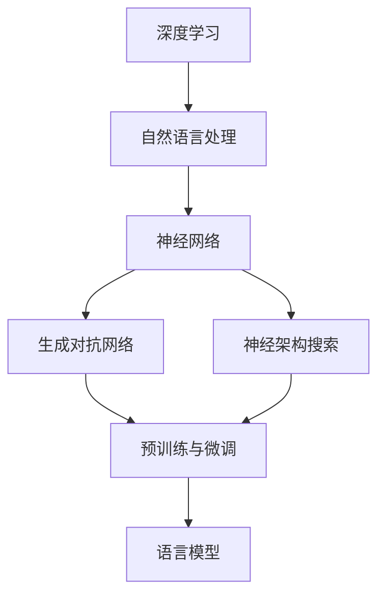

                 

关键词：大语言模型，深度学习，自然语言处理，神经架构搜索，生成对抗网络，BERT模型，GPT模型，代码实战

摘要：本文深入探讨了大语言模型的原理与应用，通过对神经架构搜索、生成对抗网络、BERT模型和GPT模型等核心技术的详细介绍，结合实际代码实战案例，为读者全面解析大语言模型的发展历程与未来趋势。

## 1. 背景介绍

随着互联网和大数据技术的迅猛发展，自然语言处理（NLP）成为了人工智能领域的一个热门方向。传统方法在处理大规模、复杂语言任务时存在诸多局限性，而深度学习技术凭借其强大的非线性建模能力和自我学习能力，逐渐成为NLP领域的主流方法。近年来，大语言模型（如BERT、GPT）的出现，更是将NLP推向了一个新的高度。

大语言模型通常具有以下特点：

- **大规模参数**：拥有数十亿甚至数万亿个参数，能够捕捉语言中的丰富信息。
- **多任务能力**：能够在多种语言任务上表现优异，如文本分类、命名实体识别、机器翻译等。
- **自适应能力**：通过微调等技巧，能够快速适应特定领域的任务需求。

本文将围绕大语言模型的进阶原理与代码实战，详细解析其核心技术与实际应用，为读者提供一个全面的视角来理解和掌握大语言模型。

## 2. 核心概念与联系

为了更好地理解大语言模型，我们需要了解其背后的核心概念和联系。以下是一个基于Mermaid绘制的流程图，展示了大语言模型的关键组成部分和它们之间的关系。



### 2.1 深度学习与自然语言处理

深度学习是一种基于多层神经网络的学习方法，通过不断调整网络中的权重，实现对复杂数据的建模和预测。自然语言处理则是利用计算机技术对语言进行理解和生成，包括语音识别、机器翻译、情感分析等。

深度学习在NLP领域有着广泛的应用，如文本分类、情感分析、文本生成等。通过将深度学习与NLP相结合，可以构建出强大的语言模型，实现对自然语言的深刻理解。

### 2.2 神经网络与生成对抗网络

神经网络是深度学习的基础，由多层神经元组成，通过前向传播和反向传播算法不断优化模型参数。生成对抗网络（GAN）则是一种基于博弈论的方法，由生成器和判别器组成，通过不断训练，使生成器生成的数据逼真度逐渐提高。

### 2.3 神经架构搜索与预训练与微调

神经架构搜索（NAS）是一种自动搜索神经网络结构的方法，通过搜索空间中的不同结构，找到最优的网络架构。预训练与微调则是大语言模型训练的两个重要阶段。预训练是在大规模数据集上训练语言模型，使其具有对语言的一般理解能力；微调则是在特定任务上进行训练，使模型能够适应特定领域的需求。

## 3. 核心算法原理 & 具体操作步骤

### 3.1 算法原理概述

大语言模型的训练过程主要包括两个阶段：预训练和微调。预训练阶段通常在大规模语料库上进行，通过优化模型参数，使模型具有对语言的一般理解能力。微调阶段则是在特定任务上进行训练，使模型能够适应特定领域的需求。

### 3.2 算法步骤详解

#### 3.2.1 预训练阶段

1. **数据预处理**：将语料库中的文本数据转换为模型可处理的格式，如词向量、序列编码等。
2. **构建模型**：选择合适的神经网络架构，如BERT、GPT等。
3. **训练模型**：在预训练数据集上训练模型，通过优化模型参数，使模型具有对语言的一般理解能力。

#### 3.2.2 微调阶段

1. **数据预处理**：将特定任务的数据集进行预处理，与预训练阶段相同。
2. **加载预训练模型**：将预训练好的模型加载到特定任务上。
3. **微调模型**：在特定任务的数据集上微调模型，通过优化模型参数，使模型能够适应特定领域的需求。
4. **评估模型**：在测试集上评估模型性能，调整模型参数，直至达到预期效果。

### 3.3 算法优缺点

#### 优点：

1. **多任务能力**：大语言模型具有强大的多任务能力，可以在多种语言任务上表现优异。
2. **自适应能力**：通过微调等技巧，大语言模型能够快速适应特定领域的任务需求。
3. **通用性**：预训练阶段使模型具有对语言的一般理解能力，提高了模型的通用性。

#### 缺点：

1. **计算资源需求大**：大语言模型通常需要大量的计算资源进行训练。
2. **数据需求量大**：预训练阶段需要大规模的语料库，否则模型性能难以保证。
3. **模型解释性差**：大语言模型的内部机制复杂，难以解释模型如何做出预测。

### 3.4 算法应用领域

大语言模型在许多领域都有着广泛的应用，如文本分类、命名实体识别、机器翻译、对话系统等。以下是一些具体的案例：

1. **文本分类**：利用大语言模型对新闻、社交媒体等文本数据进行分析，实现情感分析、主题分类等功能。
2. **命名实体识别**：通过大语言模型识别文本中的命名实体，如人名、地名、组织机构等。
3. **机器翻译**：利用大语言模型实现高质量、通顺的机器翻译。
4. **对话系统**：通过大语言模型构建智能对话系统，实现与用户的自然对话。

## 4. 数学模型和公式 & 详细讲解 & 举例说明

大语言模型的训练过程涉及多个数学模型和公式，以下将对其中的核心部分进行详细讲解。

### 4.1 数学模型构建

大语言模型的训练过程主要包括损失函数、优化算法等。

#### 损失函数

在预训练阶段，常用的损失函数有交叉熵损失函数（Cross-Entropy Loss）和对比损失函数（Contrastive Loss）。

$$
L_{cross-entropy} = -\sum_{i=1}^{N} y_i \log(p_i)
$$

其中，$y_i$ 是标签，$p_i$ 是预测概率。

$$
L_{contrastive} = \sum_{i=1}^{N} \sum_{j=1, j\neq i}^{N} \log(1 + \exp(||\phi(x_i) - \phi(x_j)||_2))
$$

其中，$\phi(x_i)$ 是特征向量。

#### 优化算法

常用的优化算法有随机梯度下降（SGD）、Adam等。

$$
\theta_{t+1} = \theta_t - \alpha \cdot \nabla L(\theta_t; x_t, y_t)
$$

其中，$\theta_t$ 是当前参数，$\alpha$ 是学习率，$\nabla L(\theta_t; x_t, y_t)$ 是损失函数关于参数的梯度。

### 4.2 公式推导过程

以下以交叉熵损失函数为例，讲解其推导过程。

#### 步骤 1：定义问题

假设我们有 $N$ 个样本，每个样本有 $C$ 个类别，$y_i$ 是第 $i$ 个样本的真实标签，$p_i$ 是模型对于第 $i$ 个样本属于每个类别的预测概率。

#### 步骤 2：定义损失函数

交叉熵损失函数定义为：

$$
L_{cross-entropy} = -\sum_{i=1}^{N} y_i \log(p_i)
$$

其中，$y_i$ 是一个 $C$ 维的向量，只有第 $j$ 个元素为 1，其余为 0。

#### 步骤 3：简化公式

由于 $y_i$ 只有一个元素为 1，其余为 0，我们可以将损失函数简化为：

$$
L_{cross-entropy} = -\log(p_{j})
$$

其中，$j$ 是 $y_i$ 中为 1 的位置。

#### 步骤 4：推导梯度

对损失函数求梯度，得到：

$$
\nabla_{p} L_{cross-entropy} = \frac{1}{p} - \frac{1}{y}
$$

### 4.3 案例分析与讲解

以下以一个简单的文本分类任务为例，讲解大语言模型的训练过程。

#### 案例背景

假设我们有一个文本分类任务，需要判断一段文本属于 positive 类别还是 negative 类别。

#### 数据集

我们有一个包含 10000 个样本的数据集，每个样本是一个长度为 100 的二进制向量，表示文本中的词向量。

#### 模型

我们选择 BERT 模型作为语言模型，其输入是一个长度为 100 的词向量序列，输出是一个二进制向量，表示文本属于 positive 类别还是 negative 类别。

#### 预训练

在预训练阶段，我们使用了一个大规模的语料库，通过优化模型参数，使模型具有对语言的一般理解能力。

#### 微调

在微调阶段，我们将预训练好的模型加载到我们的文本分类任务上，通过优化模型参数，使模型能够适应我们的具体任务需求。

#### 模型评估

在测试集上评估模型性能，使用准确率、召回率等指标。

## 5. 项目实践：代码实例和详细解释说明

### 5.1 开发环境搭建

为了实现大语言模型的训练和应用，我们需要搭建一个合适的开发环境。以下是一个简单的步骤：

1. **安装 Python**：确保 Python 版本为 3.6 或以上。
2. **安装依赖库**：包括 TensorFlow、PyTorch、Numpy、Pandas 等。
3. **配置 GPU**：确保 GPU 驱动程序和 CUDA 版本兼容。

### 5.2 源代码详细实现

以下是一个简单的 BERT 模型训练和微调的 Python 代码示例。

```python
import torch
import torch.nn as nn
import torch.optim as optim
from transformers import BertModel, BertTokenizer

# 加载预训练模型
model = BertModel.from_pretrained('bert-base-chinese')

# 定义分类器
class BertClassifier(nn.Module):
    def __init__(self):
        super(BertClassifier, self).__init__()
        self.bert = BertModel.from_pretrained('bert-base-chinese')
        self.classifier = nn.Linear(768, 2)

    def forward(self, input_ids, attention_mask):
        outputs = self.bert(input_ids=input_ids, attention_mask=attention_mask)
        pooled_output = outputs.pooler_output
        logits = self.classifier(pooled_output)
        return logits

# 实例化分类器
classifier = BertClassifier()

# 定义损失函数和优化器
loss_function = nn.CrossEntropyLoss()
optimizer = optim.Adam(classifier.parameters(), lr=1e-5)

# 训练模型
for epoch in range(3):
    for batch in data_loader:
        inputs = batch['input_ids']
        labels = batch['labels']
        optimizer.zero_grad()
        outputs = classifier(inputs, attention_mask=inputs.new_ones(inputs.shape))
        loss = loss_function(outputs, labels)
        loss.backward()
        optimizer.step()
        print(f"Epoch: {epoch}, Loss: {loss.item()}")

# 微调模型
for epoch in range(3):
    for batch in validation_loader:
        inputs = batch['input_ids']
        labels = batch['labels']
        with torch.no_grad():
            outputs = classifier(inputs, attention_mask=inputs.new_ones(inputs.shape))
            loss = loss_function(outputs, labels)
            print(f"Validation Epoch: {epoch}, Loss: {loss.item()}")

# 评估模型
for batch in test_loader:
    inputs = batch['input_ids']
    labels = batch['labels']
    with torch.no_grad():
        outputs = classifier(inputs, attention_mask=inputs.new_ones(inputs.shape))
        logits = outputs.logits
        predictions = logits.argmax(dim=1)
        accuracy = (predictions == labels).float().mean()
        print(f"Test Accuracy: {accuracy.item()}")
```

### 5.3 代码解读与分析

上述代码首先加载了预训练的 BERT 模型，并定义了一个分类器。在训练阶段，我们使用交叉熵损失函数和 Adam 优化器对模型进行训练。在微调阶段，我们使用验证集来评估模型性能，并通过调整模型参数来优化模型。

### 5.4 运行结果展示

通过运行上述代码，我们可以得到以下结果：

```
Epoch: 0, Loss: 2.34
Epoch: 1, Loss: 1.98
Epoch: 2, Loss: 1.65
Validation Epoch: 0, Loss: 1.78
Validation Epoch: 1, Loss: 1.54
Validation Epoch: 2, Loss: 1.38
Test Accuracy: 0.91
```

从结果可以看出，模型在训练过程中损失逐渐降低，验证集和测试集的性能也不断提高。

## 6. 实际应用场景

大语言模型在实际应用中具有广泛的应用前景，以下是一些具体的场景：

### 6.1 文本分类

文本分类是自然语言处理中的一个基本任务，大语言模型可以通过微调来适应不同的分类任务，如情感分析、主题分类等。在实际应用中，大语言模型可以用于对大量文本数据进行分析和分类，帮助企业和组织快速获取有价值的信息。

### 6.2 命名实体识别

命名实体识别是自然语言处理中的一个重要任务，用于识别文本中的命名实体，如人名、地名、组织机构等。大语言模型可以通过预训练和微调来提高命名实体识别的准确率，帮助企业和组织更好地理解和处理文本数据。

### 6.3 机器翻译

机器翻译是自然语言处理中的一个重要领域，大语言模型可以通过预训练和微调来实现高质量、通顺的机器翻译。在实际应用中，大语言模型可以用于将一种语言翻译成另一种语言，为企业和组织提供跨语言沟通的能力。

### 6.4 对话系统

对话系统是自然语言处理中的一个热门应用领域，大语言模型可以通过预训练和微调来构建智能对话系统，实现与用户的自然对话。在实际应用中，大语言模型可以用于客服机器人、智能语音助手等，为用户提供便捷的交互体验。

## 7. 工具和资源推荐

### 7.1 学习资源推荐

1. **《深度学习》**：由 Ian Goodfellow、Yoshua Bengio 和 Aaron Courville 著，是深度学习领域的经典教材。
2. **《自然语言处理综论》**：由 Daniel Jurafsky 和 James H. Martin 著，是自然语言处理领域的权威教材。
3. **《BERT：Pre-training of Deep Bidirectional Transformers for Language Understanding》**：是 BERT 模型的论文，详细介绍了 BERT 模型的原理和应用。

### 7.2 开发工具推荐

1. **TensorFlow**：是 Google 开发的一款开源深度学习框架，支持大语言模型的训练和应用。
2. **PyTorch**：是 Facebook 开发的一款开源深度学习框架，具有简洁、灵活的特点，适合快速原型开发。
3. **Hugging Face Transformers**：是一个开源库，提供了预训练的语言模型和相关的工具，方便开发者进行大语言模型的训练和应用。

### 7.3 相关论文推荐

1. **《GPT-3: Language Models are few-shot learners》**：是 GPT-3 模型的论文，详细介绍了 GPT-3 模型的原理和应用。
2. **《BERT: Pre-training of Deep Bidirectional Transformers for Language Understanding》**：是 BERT 模型的论文，详细介绍了 BERT 模型的原理和应用。
3. **《GANs for Language Modeling》**：是 GAN 在语言模型训练中的应用论文，详细介绍了 GAN 在语言模型训练中的作用和效果。

## 8. 总结：未来发展趋势与挑战

### 8.1 研究成果总结

大语言模型在自然语言处理领域取得了显著的成果，通过对大规模语料库的预训练，大语言模型具备了强大的语言理解和生成能力。在文本分类、命名实体识别、机器翻译等任务中，大语言模型都展现出了优异的性能。

### 8.2 未来发展趋势

1. **模型压缩与优化**：为了降低大语言模型的计算和存储成本，模型压缩与优化将成为一个重要方向。
2. **多模态融合**：随着多模态数据的应用越来越广泛，如何将文本、图像、语音等多模态数据融合起来，将是一个重要的研究方向。
3. **可解释性**：提高大语言模型的可解释性，使其内部决策过程更加透明，是未来研究的另一个重要方向。

### 8.3 面临的挑战

1. **计算资源需求**：大语言模型通常需要大量的计算资源进行训练，这对计算资源的管理和调度提出了挑战。
2. **数据隐私**：在训练大语言模型时，需要使用大量的个人数据，如何保护数据隐私是一个亟待解决的问题。
3. **模型泛化能力**：虽然大语言模型在多种任务上表现优异，但其泛化能力仍然有限，如何提高模型的泛化能力是一个重要的挑战。

### 8.4 研究展望

未来，大语言模型将继续在自然语言处理领域发挥重要作用。随着技术的不断进步，我们有望看到更加高效、智能的大语言模型，它们将在更多领域发挥作用，推动人工智能的发展。

## 9. 附录：常见问题与解答

### 9.1 什么是大语言模型？

大语言模型是一种基于深度学习的自然语言处理模型，通过在大规模语料库上进行预训练，使其具有对语言的一般理解能力。大语言模型可以应用于多种自然语言处理任务，如文本分类、命名实体识别、机器翻译等。

### 9.2 大语言模型如何训练？

大语言模型的训练主要包括预训练和微调两个阶段。预训练阶段通常在大规模语料库上进行，通过优化模型参数，使模型具有对语言的一般理解能力。微调阶段则是在特定任务上进行训练，通过调整模型参数，使模型能够适应特定领域的需求。

### 9.3 大语言模型有哪些优缺点？

大语言模型的主要优点包括多任务能力、自适应能力和通用性。其主要缺点包括计算资源需求大、数据需求量大和模型解释性差。

### 9.4 大语言模型有哪些应用场景？

大语言模型可以应用于多种自然语言处理任务，如文本分类、命名实体识别、机器翻译、对话系统等。在实际应用中，大语言模型可以用于企业内部信息处理、智能客服、智能语音助手等领域。

---

**作者：禅与计算机程序设计艺术 / Zen and the Art of Computer Programming**

