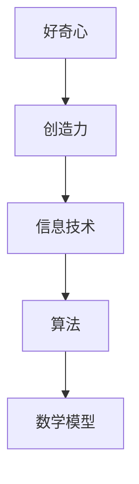

                 

 **关键词**：好奇心、创造力、IT领域、技术博客、算法、数学模型、应用场景

> **摘要**：本文将探讨好奇心与创造力在信息技术领域的融合，如何激发创新思维，推动技术进步。通过分析核心概念、算法原理、数学模型以及实际应用，展示这两者如何成为探索的双翼，引领我们在技术前沿不断前行。

## 1. 背景介绍

在信息技术迅速发展的今天，好奇心与创造力已成为推动科技进步的重要力量。无论是人工智能、大数据，还是云计算、物联网，这些前沿技术都离不开对未知领域的探索和创新。好奇心激发了对新知识、新技术的渴望，而创造力则将这些渴望转化为实际成果。

### 1.1 好奇心

好奇心是指人类天生对未知事物的探究欲望。在信息技术领域，好奇心表现为对新技术、新算法的持续关注，对问题解决的深刻思考，以及对技术本质的追问。好奇心使我们不断寻求新的解决方案，从而推动技术的不断进步。

### 1.2 创造力

创造力是指在解决问题时产生新颖、有用想法的能力。在信息技术领域，创造力表现为设计出独特的算法、构建出创新的应用、提出新的理论框架等。创造力使我们在技术竞争中脱颖而出，推动技术的革新和发展。

### 1.3 二者的关系

好奇心与创造力相辅相成，共同推动着技术进步。好奇心激发我们对新技术的探索，而创造力则将这些探索转化为实际成果。没有好奇心，我们就无法发现新的问题；没有创造力，我们就无法解决问题。二者相互依存，共同构成了探索的双翼。

## 2. 核心概念与联系

为了更好地理解好奇心与创造力的关系，我们首先需要明确一些核心概念，并探讨它们之间的联系。

### 2.1 信息技术

信息技术（IT）是指利用计算机、网络和通信设备等工具对信息进行获取、处理、存储、传输和利用的过程。信息技术涵盖了计算机科学、网络技术、数据库技术、人工智能等多个领域。

### 2.2 算法

算法是指解决特定问题的一系列步骤或规则。在信息技术领域，算法是实现计算、数据分析和智能决策的核心。算法的创新和优化是推动技术进步的重要动力。

### 2.3 数学模型

数学模型是用数学语言描述现实世界的抽象模型。在信息技术领域，数学模型被广泛应用于数据分析和算法设计。数学模型有助于我们更好地理解问题本质，找到有效的解决方案。

### 2.4 关系图

以下是好奇心、创造力、信息技术、算法和数学模型之间的关系图：



## 3. 核心算法原理 & 具体操作步骤

在本节中，我们将探讨一个在信息技术领域具有重要应用的算法，并详细讲解其原理和操作步骤。

### 3.1 算法原理概述

我们选择的人工智能领域的经典算法——深度神经网络（DNN）。深度神经网络是一种基于多层神经元的计算模型，能够通过学习大量数据自动提取特征并实现复杂函数的逼近。DNN在图像识别、自然语言处理和智能决策等领域具有广泛的应用。

### 3.2 算法步骤详解

深度神经网络的实现主要包括以下几个步骤：

1. **数据预处理**：将输入数据标准化，并进行归一化处理。
2. **构建网络结构**：设计并构建深度神经网络的层次结构，包括输入层、隐藏层和输出层。
3. **前向传播**：将输入数据通过网络的各个层次进行传播，得到输出结果。
4. **反向传播**：计算输出结果与实际结果之间的误差，并更新网络权重。
5. **优化算法**：选择合适的优化算法（如梯度下降法）来调整网络权重，以最小化误差。
6. **评估与测试**：在测试集上评估模型的性能，并进行参数调整。

### 3.3 算法优缺点

深度神经网络具有以下优点：

1. **强大的学习能力**：能够自动提取复杂的特征，从而在多个领域取得显著效果。
2. **广泛的应用**：在图像识别、自然语言处理、智能决策等领域具有广泛的应用。
3. **自适应能力**：能够根据不同的数据集和任务动态调整网络结构。

然而，深度神经网络也存在一些缺点：

1. **计算复杂度高**：深度神经网络训练过程涉及大量的矩阵运算，计算复杂度较高。
2. **对数据依赖性大**：深度神经网络性能很大程度上取决于数据集的质量和规模。
3. **可解释性差**：深度神经网络内部决策过程复杂，难以解释和理解。

### 3.4 算法应用领域

深度神经网络在以下领域具有广泛的应用：

1. **计算机视觉**：图像分类、目标检测、人脸识别等。
2. **自然语言处理**：语言模型、机器翻译、情感分析等。
3. **智能决策**：推荐系统、金融风控、医疗诊断等。

## 4. 数学模型和公式 & 详细讲解 & 举例说明

在本节中，我们将介绍深度神经网络中常用的数学模型和公式，并进行详细讲解和举例说明。

### 4.1 数学模型构建

深度神经网络中的数学模型主要包括以下几个方面：

1. **激活函数**：激活函数用于引入非线性特性，常见的激活函数有Sigmoid、ReLU、Tanh等。
2. **损失函数**：损失函数用于评估模型预测结果与实际结果之间的差距，常见的损失函数有均方误差（MSE）、交叉熵等。
3. **优化算法**：优化算法用于调整网络权重，以最小化损失函数，常见的优化算法有梯度下降法、Adam等。

### 4.2 公式推导过程

以下是一个简单的深度神经网络模型，包括输入层、一个隐藏层和一个输出层。我们将使用矩阵形式推导其前向传播和反向传播过程。

#### 前向传播

输入层到隐藏层的传播过程可以表示为：

\[ z^{(1)} = W^{(1)} \cdot a^{(0)} + b^{(1)} \]
\[ a^{(1)} = \sigma(z^{(1)}) \]

其中，\( a^{(0)} \) 是输入向量，\( W^{(1)} \) 是输入层到隐藏层的权重矩阵，\( b^{(1)} \) 是隐藏层偏置向量，\( \sigma \) 是激活函数。

隐藏层到输出层的传播过程可以表示为：

\[ z^{(2)} = W^{(2)} \cdot a^{(1)} + b^{(2)} \]
\[ a^{(2)} = \sigma(z^{(2)}) \]

其中，\( a^{(1)} \) 是隐藏层输出向量，\( W^{(2)} \) 是隐藏层到输出层的权重矩阵，\( b^{(2)} \) 是输出层偏置向量。

#### 反向传播

反向传播过程用于计算网络权重的梯度，并更新网络参数。以下是一个简单的梯度计算过程：

\[ \delta^{(2)} = (a^{(2)} - y) \cdot \sigma'(z^{(2)}) \]
\[ \delta^{(1)} = (W^{(2)} \cdot \delta^{(2)}) \cdot \sigma'(z^{(1)}) \]

其中，\( \delta^{(2)} \) 和 \( \delta^{(1)} \) 分别是输出层和隐藏层的误差项，\( y \) 是实际输出，\( \sigma' \) 是激活函数的导数。

### 4.3 案例分析与讲解

假设我们有一个简单的二分类问题，数据集包含100个样本，每个样本有2个特征。我们使用一个单隐藏层深度神经网络进行训练。

#### 数据预处理

输入数据归一化处理，使得每个特征的值都在0到1之间。

#### 网络结构

输入层：2个神经元  
隐藏层：4个神经元  
输出层：2个神经元

#### 激活函数

输入层和隐藏层使用ReLU激活函数，输出层使用Sigmoid激活函数。

#### 损失函数

使用交叉熵损失函数。

#### 优化算法

使用Adam优化算法。

#### 训练过程

训练过程中，每次迭代计算前向传播和反向传播的梯度，并更新网络权重。

#### 性能评估

在测试集上评估模型的准确率，并调整超参数以优化性能。

## 5. 项目实践：代码实例和详细解释说明

在本节中，我们将通过一个实际项目来展示如何将深度神经网络应用于图像分类问题。

### 5.1 开发环境搭建

- Python版本：3.8  
- TensorFlow版本：2.6

### 5.2 源代码详细实现

以下是一个简单的深度神经网络模型，用于对MNIST手写数字数据集进行分类。

```python
import tensorflow as tf
from tensorflow.keras import layers

# 数据预处理
mnist = tf.keras.datasets.mnist
(x_train, y_train), (x_test, y_test) = mnist.load_data()
x_train, x_test = x_train / 255.0, x_test / 255.0

# 网络结构
model = tf.keras.Sequential([
    layers.Flatten(input_shape=(28, 28)),
    layers.Dense(128, activation='relu'),
    layers.Dense(10, activation='softmax')
])

# 损失函数和优化算法
model.compile(optimizer='adam',
              loss='sparse_categorical_crossentropy',
              metrics=['accuracy'])

# 训练过程
model.fit(x_train, y_train, epochs=5)

# 性能评估
test_loss, test_acc = model.evaluate(x_test, y_test, verbose=2)
print('\nTest accuracy:', test_acc)
```

### 5.3 代码解读与分析

1. **数据预处理**：使用TensorFlow的mnist数据集，对图像进行归一化处理。
2. **网络结构**：构建一个简单的单隐藏层深度神经网络，输入层使用Flatten层将图像展平为一维向量，隐藏层使用128个神经元的ReLU激活函数，输出层使用10个神经元的softmax激活函数。
3. **损失函数和优化算法**：使用交叉熵损失函数和Adam优化算法。
4. **训练过程**：使用fit方法对模型进行训练，每次迭代计算前向传播和反向传播的梯度，并更新网络权重。
5. **性能评估**：在测试集上评估模型的准确率。

通过这个实际项目，我们展示了如何使用深度神经网络进行图像分类。在实际应用中，可以进一步优化网络结构、调整超参数，以提高模型的性能。

## 6. 实际应用场景

深度神经网络在信息技术领域具有广泛的应用。以下是一些典型的实际应用场景：

1. **计算机视觉**：图像识别、目标检测、人脸识别等。例如，自动驾驶系统使用深度神经网络进行道路和行人检测。
2. **自然语言处理**：语言模型、机器翻译、情感分析等。例如，智能客服系统使用深度神经网络进行文本分类和语义理解。
3. **智能决策**：推荐系统、金融风控、医疗诊断等。例如，电商平台使用深度神经网络进行商品推荐和用户行为分析。

随着深度神经网络技术的不断发展和优化，其在更多领域将发挥重要作用。

## 7. 未来应用展望

随着信息技术的快速发展，深度神经网络的应用前景将更加广阔。以下是未来的一些可能发展趋势：

1. **硬件加速**：利用GPU、TPU等硬件加速深度神经网络的训练和推理，提高计算效率。
2. **模型压缩**：通过模型压缩技术，减小深度神经网络的参数规模，降低计算复杂度。
3. **自适应学习**：开发自适应学习能力强的深度神经网络，实现更高效的知识迁移和适应能力。
4. **泛化能力提升**：通过研究深度神经网络的泛化能力，提高其在不同领域和任务上的表现。

## 8. 工具和资源推荐

为了更好地学习和应用深度神经网络技术，以下是几款推荐的学习资源和开发工具：

### 8.1 学习资源推荐

1. **《深度学习》（Ian Goodfellow等著）**：经典的深度学习教材，详细介绍了深度神经网络的理论和实践。
2. **TensorFlow官方文档**：官方提供的详细文档和教程，帮助用户快速上手TensorFlow框架。
3. **Keras中文社区**：Keras是一个高层神经网络API，提供了丰富的预训练模型和工具，适合初学者使用。

### 8.2 开发工具推荐

1. **Google Colab**：Google提供的免费云端GPU资源，适合进行深度学习实验和开发。
2. **TensorBoard**：TensorFlow提供的可视化工具，用于分析和调试深度学习模型。
3. **PyTorch**：另一种流行的深度学习框架，具有灵活的动态计算图和强大的社区支持。

### 8.3 相关论文推荐

1. **“A Guide to Training Your First Neural Network”**：一篇关于深度神经网络入门的教程，适合初学者阅读。
2. **“Deep Learning, Volume 1: The MIT Press Essential Knowledge Series”**：Ian Goodfellow等人撰写的深度学习经典教材，详细介绍了深度神经网络的理论和实践。
3. **“Convolutional Neural Networks for Visual Recognition”**：一篇关于卷积神经网络在计算机视觉领域应用的经典论文，对深度神经网络的发展具有重要影响。

## 9. 总结：未来发展趋势与挑战

在信息技术领域，好奇心与创造力将继续发挥重要作用。未来，随着硬件加速、模型压缩和自适应学习等技术的发展，深度神经网络的应用将更加广泛和高效。然而，我们也面临着一些挑战，如模型的可解释性、计算复杂度和数据隐私等。只有不断探索和创新，才能在技术前沿不断前行。

## 10. 附录：常见问题与解答

### 10.1 好奇心与创造力如何结合？

好奇心和创造力是相辅相成的。好奇心激发我们对新知识、新技术的探索，而创造力则将这些探索转化为实际成果。具体来说，我们可以通过以下几种方式结合好奇心和创造力：

1. **持续学习**：保持对新技术的好奇心，不断学习新知识，提升自己的技能。
2. **实践应用**：将所学知识应用到实际项目中，通过实践锻炼创造力。
3. **跨领域合作**：与其他领域的专家合作，拓宽视野，激发创新思维。
4. **反思与总结**：在项目完成后，反思经验教训，总结成果，不断提高自己的能力。

### 10.2 深度神经网络有哪些优缺点？

深度神经网络具有以下优点：

1. **强大的学习能力**：能够自动提取复杂的特征，从而在多个领域取得显著效果。
2. **广泛的应用**：在图像识别、自然语言处理、智能决策等领域具有广泛的应用。
3. **自适应能力**：能够根据不同的数据集和任务动态调整网络结构。

然而，深度神经网络也存在一些缺点：

1. **计算复杂度高**：深度神经网络训练过程涉及大量的矩阵运算，计算复杂度较高。
2. **对数据依赖性大**：深度神经网络性能很大程度上取决于数据集的质量和规模。
3. **可解释性差**：深度神经网络内部决策过程复杂，难以解释和理解。

### 10.3 如何优化深度神经网络？

以下是一些优化深度神经网络的方法：

1. **数据增强**：通过旋转、缩放、翻转等操作增加数据多样性，提高模型的泛化能力。
2. **模型压缩**：通过剪枝、量化等技术减小模型参数规模，降低计算复杂度。
3. **正则化**：使用L1、L2正则化项防止模型过拟合。
4. **优化算法**：使用Adam、RMSprop等优化算法，提高训练效率。

### 10.4 深度神经网络如何应用于实际问题？

深度神经网络可以应用于各种实际问题，以下是一些常见的应用场景：

1. **计算机视觉**：图像分类、目标检测、人脸识别等。
2. **自然语言处理**：语言模型、机器翻译、情感分析等。
3. **智能决策**：推荐系统、金融风控、医疗诊断等。

通过设计合适的网络结构、选择合适的训练数据和优化算法，我们可以将深度神经网络应用于实际问题，实现智能化的解决方案。

---

**作者：禅与计算机程序设计艺术 / Zen and the Art of Computer Programming**

