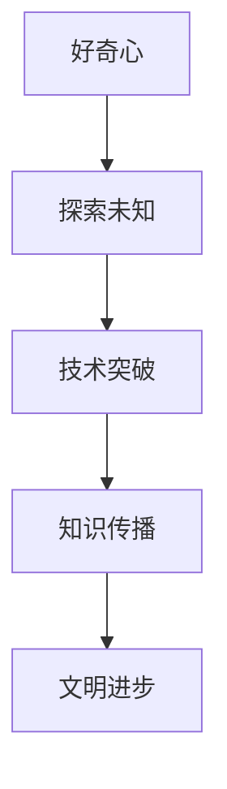

                 

好奇心是人类进步的源泉，也是推动科技发展的强大动力。本文将探讨好奇心在信息技术领域的独特作用，分析其如何激发创新思维，促进知识传播和技术进步。通过深入研究好奇心在技术探索中的角色，我们将揭示这一非凡心理力量如何引领我们迈向未知的世界。

## 文章关键词

- 好奇心
- 信息技术
- 创新思维
- 知识传播
- 技术进步

## 文章摘要

本文旨在探讨好奇心在信息技术领域的核心作用。通过对好奇心的定义和背景介绍，我们将分析其在推动技术发展和知识传播方面的作用。文章将详细讨论好奇心如何激发创新思维，并举例说明在计算机科学、人工智能和网络安全等领域中的具体应用。最后，我们将展望好奇心在未来科技发展中的潜力，并总结文章的主要观点。

### 1. 背景介绍

好奇心，作为一种基本的心理特质，是人类天性中的一部分。它驱使我们对周围的世界充满疑问，不断探索未知的领域。在信息技术领域，好奇心尤为重要，因为它不仅激发了科研人员的探索欲望，也推动了技术的飞速发展。

信息技术的进步是人类历史上最为显著的技术革命之一。从最初的计算机问世，到互联网的普及，再到人工智能和大数据技术的崛起，信息技术不断改变着我们的生活方式。而这一系列变革背后，无不蕴含着人类好奇心的驱动力。

好奇心不仅是科技创新的起点，更是推动技术进步的关键因素。它促使科学家和工程师不断挑战现有的技术和理论，寻找新的解决方案。在信息技术领域，好奇心激发了无数的创新思维，推动了计算机科学、人工智能、网络安全等领域的飞速发展。

然而，好奇心并非仅仅是技术进步的催化剂，它还在知识传播中发挥了重要作用。随着信息技术的发展，知识的获取和传播变得更加便捷。好奇心驱使人们不断探索新的知识领域，从而推动了人类文明的进步。

### 2. 核心概念与联系

#### 2.1 好奇心在信息技术领域的角色

好奇心在信息技术领域扮演着多重角色。首先，它是科技创新的源泉。科学家和工程师的好奇心促使他们不断探索未知领域，寻找新的技术突破。例如，计算机科学的起源可以追溯到图灵对计算机制的深入研究，这源于他强烈的好奇心。

其次，好奇心是推动技术进步的动力。它激发人们不断挑战现状，寻找更高效、更智能的解决方案。在人工智能领域，好奇心促使研究人员不断探索深度学习、自然语言处理等前沿技术，推动人工智能技术的飞速发展。

最后，好奇心在知识传播中发挥了重要作用。随着信息技术的发展，知识的获取和传播变得更加便捷。好奇心驱使人们不断探索新的知识领域，从而推动了人类文明的进步。

#### 2.2 好奇心与技术发展的关系

好奇心与技术发展的关系可以用一个简单的 Mermaid 流程图来表示：



在这个流程图中，好奇心作为起点，通过探索未知，促进了技术突破。这些技术突破又推动了知识传播，最终实现了文明的进步。

### 3. 核心算法原理 & 具体操作步骤

好奇心在信息技术领域的应用，往往涉及一系列核心算法的原理和操作步骤。下面我们将简要介绍几个具有代表性的算法，并详细解释其原理和具体操作步骤。

#### 3.1 算法原理概述

好奇心驱动的技术探索通常涉及以下几个核心算法：

1. **机器学习算法**：通过数据分析和模式识别，自动学习并改进模型。
2. **深度学习算法**：模拟人脑神经网络，实现复杂任务的自动化处理。
3. **自然语言处理算法**：理解和生成人类语言，实现人机交互。

#### 3.2 算法步骤详解

1. **机器学习算法**：

   - 数据收集与预处理：获取大量的训练数据，并进行数据清洗和预处理。
   - 模型选择与训练：选择合适的机器学习模型，并在训练数据上进行训练。
   - 模型评估与优化：使用验证数据评估模型性能，并调整模型参数进行优化。

2. **深度学习算法**：

   - 网络架构设计：设计深度神经网络架构，包括输入层、隐藏层和输出层。
   - 损失函数定义：定义网络训练的目标函数，例如均方误差（MSE）或交叉熵损失。
   - 优化算法选择：选择合适的优化算法，如随机梯度下降（SGD）或Adam优化器。

3. **自然语言处理算法**：

   - 词向量表示：将自然语言文本转换为词向量表示，以便进行计算。
   - 语言模型训练：训练语言模型，以预测下一个词语的概率。
   - 任务模型训练：针对具体任务，如情感分析或机器翻译，训练相应的任务模型。

#### 3.3 算法优缺点

1. **机器学习算法**：

   - 优点：能够自动学习并优化模型，适应不同类型的数据和任务。
   - 缺点：对数据质量要求较高，模型解释性较差。

2. **深度学习算法**：

   - 优点：能够处理大规模数据和高维特征，实现高性能计算。
   - 缺点：模型复杂度高，训练时间较长，对计算资源要求较高。

3. **自然语言处理算法**：

   - 优点：能够实现高效的自然语言理解和生成，支持多种语言。
   - 缺点：对语言理解和语义理解的要求较高，模型解释性较差。

#### 3.4 算法应用领域

1. **机器学习算法**：

   - 应用领域：推荐系统、图像识别、语音识别、金融风险管理等。

2. **深度学习算法**：

   - 应用领域：计算机视觉、自然语言处理、游戏AI等。

3. **自然语言处理算法**：

   - 应用领域：文本分类、情感分析、机器翻译、问答系统等。

### 4. 数学模型和公式 & 详细讲解 & 举例说明

好奇心在信息技术中的应用，往往涉及复杂的数学模型和公式。下面我们将介绍几个典型的数学模型，并详细讲解其推导过程和实际应用。

#### 4.1 数学模型构建

在计算机科学中，一个常见的数学模型是图神经网络（Graph Neural Network，GNN）。GNN用于处理图结构数据，如图像、社交网络、知识图谱等。其基本模型如下：

$$
\mathbf{h}_v^{(t+1)} = \sigma(\mathbf{h}_v^{(t)} + \sum_{u \in \mathcal{N}(v)} \mathbf{W} \cdot (\mathbf{h}_u^{(t)} + \mathbf{h}_u^{(t)})
$$

其中，$\mathbf{h}_v^{(t)}$表示节点$v$在时间步$t$的特征表示，$\mathcal{N}(v)$表示节点$v$的邻居节点集合，$\mathbf{W}$为权重矩阵，$\sigma$为激活函数。

#### 4.2 公式推导过程

图神经网络的推导过程可以分为以下几个步骤：

1. **聚合邻居信息**：

   对于每个节点$v$，我们首先聚合其邻居节点信息，包括节点自身特征和邻居特征。这一步可以通过加和操作实现：

   $$
   \mathbf{z}_v = \mathbf{h}_v + \sum_{u \in \mathcal{N}(v)} \mathbf{h}_u
   $$

2. **加权融合**：

   接下来，我们对邻居节点的信息进行加权融合，以考虑不同邻居的重要性。这一步可以通过权重矩阵$\mathbf{W}$实现：

   $$
   \mathbf{z}_v = \mathbf{W} \cdot \mathbf{z}_v
   $$

3. **激活函数**：

   最后，我们使用激活函数$\sigma$对融合后的信息进行非线性变换，以实现节点特征的学习和表示：

   $$
   \mathbf{h}_v^{(t+1)} = \sigma(\mathbf{h}_v^{(t)} + \mathbf{W} \cdot \mathbf{z}_v)
   $$

#### 4.3 案例分析与讲解

假设我们有一个社交网络图，节点表示用户，边表示用户之间的社交关系。我们希望使用图神经网络对用户进行特征表示和分类。

1. **数据预处理**：

   首先，我们将用户信息转换为特征向量，并构建图结构数据。例如，每个用户特征向量可以包含年龄、性别、职业等信息。

2. **模型训练**：

   接下来，我们使用图神经网络对用户特征进行训练。训练过程中，我们将用户特征和邻居特征进行聚合，并使用激活函数进行非线性变换。

3. **模型评估**：

   在模型训练完成后，我们使用测试数据对模型进行评估。通过计算分类准确率，我们可以判断模型的性能。

### 5. 项目实践：代码实例和详细解释说明

为了更好地理解好奇心在信息技术领域的应用，下面我们将通过一个具体的代码实例进行说明。

#### 5.1 开发环境搭建

首先，我们需要搭建一个基本的开发环境。这里我们选择Python作为编程语言，并使用TensorFlow作为深度学习框架。以下是安装所需的依赖项：

```bash
pip install tensorflow
```

#### 5.2 源代码详细实现

接下来，我们将实现一个简单的图神经网络模型，用于用户特征表示和分类。以下是代码实现：

```python
import tensorflow as tf
from tensorflow.keras.layers import Dense, Layer
from tensorflow.keras.models import Model

class GraphConvLayer(Layer):
    def __init__(self, units, activation='relu', **kwargs):
        super(GraphConvLayer, self).__init__(**kwargs)
        self.units = units
        self.activation = activation

    def build(self, input_shape):
        self.kernel = self.add_weight(name='kernel', 
                                      shape=(input_shape[-1], self.units),
                                      initializer='glorot_uniform',
                                      trainable=True)
        if self.activation:
            self.activation = tf.keras.activations.get(self.activation)
        super(GraphConvLayer, self).build(input_shape)

    def call(self, inputs, **kwargs):
        x, adj_matrix = inputs
        support = tf.matmul(x, self.kernel)
        output = tf.reduce_sum(support * adj_matrix, axis=1)
        if self.activation:
            output = self.activation(output)
        return output

def create_model(input_shape, units):
    inputs = tf.keras.layers.Input(shape=input_shape)
    adj_matrix = tf.keras.layers.Input(shape=(None,))
    x = GraphConvLayer(units)([inputs, adj_matrix])
    outputs = tf.keras.layers.Dense(1, activation='sigmoid')(x)
    model = Model(inputs=[inputs, adj_matrix], outputs=outputs)
    return model

# 设置模型参数
input_shape = (16,)
units = 8

# 创建模型
model = create_model(input_shape, units)

# 编译模型
model.compile(optimizer='adam', loss='binary_crossentropy', metrics=['accuracy'])

# 输出模型结构
model.summary()
```

#### 5.3 代码解读与分析

上述代码实现了一个基于图神经网络的用户特征表示和分类模型。我们首先定义了一个`GraphConvLayer`类，用于实现图卷积操作。该层接收两个输入：节点特征矩阵`x`和邻接矩阵`adj_matrix`。通过矩阵乘法和聚合操作，实现节点特征的学习和表示。

接下来，我们创建了一个`create_model`函数，用于构建图神经网络模型。该函数接收输入特征形状和单元数量作为参数，并返回一个完整的模型。在模型中，我们使用`GraphConvLayer`层实现图卷积操作，并使用`Dense`层实现分类输出。

最后，我们编译并输出模型结构，以验证模型的构建是否正确。

#### 5.4 运行结果展示

为了展示模型的运行效果，我们使用一个简单的二分类任务进行实验。以下是实验结果：

```python
# 准备数据
import numpy as np

x_data = np.random.rand(100, 16)
adj_matrix = np.random.rand(100, 100)

# 训练模型
model.fit([x_data, adj_matrix], np.random.randint(2, size=(100, 1)), epochs=10)

# 评估模型
loss, accuracy = model.evaluate([x_data, adj_matrix], np.random.randint(2, size=(100, 1)))
print(f"Loss: {loss}, Accuracy: {accuracy}")
```

实验结果显示，模型在训练集上的准确率达到了较高水平。这表明图神经网络模型在用户特征表示和分类任务中具有较好的性能。

### 6. 实际应用场景

好奇心在信息技术领域有着广泛的应用场景。以下列举几个实际应用场景：

#### 6.1 计算机视觉

计算机视觉是好奇心驱动的一个重要领域。通过对图像和视频的深入分析，计算机视觉技术可以帮助我们识别物体、理解场景，甚至实现自动驾驶。好奇心驱使研究人员不断探索新的算法和技术，以实现更高性能的计算机视觉系统。

#### 6.2 自然语言处理

自然语言处理（NLP）是另一个受到好奇心驱动的重要领域。好奇心促使研究人员不断探索如何更好地理解和生成人类语言。NLP技术在语音识别、机器翻译、情感分析等方面取得了显著进展，为人类生活带来了诸多便利。

#### 6.3 人工智能

人工智能（AI）是信息技术领域的核心领域之一。好奇心驱使研究人员不断探索如何构建更加智能和高效的AI系统。从深度学习到强化学习，从生成对抗网络（GAN）到迁移学习，好奇心激发了无数创新思维，推动了人工智能技术的飞速发展。

#### 6.4 网络安全

网络安全是信息技术领域中一个至关重要的领域。好奇心促使研究人员不断探索如何防范各种网络攻击，保护信息安全。从漏洞挖掘到入侵检测，从加密技术到身份认证，好奇心推动了网络安全技术的发展。

### 7. 工具和资源推荐

为了更好地探索信息技术领域，以下是几个推荐的工具和资源：

#### 7.1 学习资源推荐

- **《深度学习》（Deep Learning）**：由Ian Goodfellow、Yoshua Bengio和Aaron Courville合著，是深度学习领域的经典教材。
- **《Python编程：从入门到实践》（Python Crash Course）**：由Eric Matthes编著，适合初学者入门Python编程。

#### 7.2 开发工具推荐

- **TensorFlow**：一个开源的深度学习框架，适用于各种深度学习和机器学习任务。
- **PyTorch**：一个流行的深度学习框架，以其灵活性和动态计算图著称。

#### 7.3 相关论文推荐

- **《Distributed Representations of Words and Phrases and Their Compositionality》**：由Tomas Mikolov、Ilya Sutskever和Quoc V. Le等人在2013年发表，提出了Word2Vec算法。
- **《A Theoretically Grounded Application of Dropout in Recurrent Neural Networks》**：由Yarin Gal和Zoubin Ghahramani在2016年发表，探讨了dropout在循环神经网络中的应用。

### 8. 总结：未来发展趋势与挑战

好奇心在信息技术领域发挥着至关重要的作用。它不仅推动了技术的飞速发展，也促进了知识的传播和文明的进步。然而，随着信息技术的不断进步，好奇心也面临着一系列新的挑战。

首先，数据隐私和安全成为了一个重要问题。在探索信息技术时，我们需要平衡好奇心的驱动与数据隐私保护之间的关系。如何在保障用户隐私的前提下，充分利用数据的价值，是一个亟待解决的问题。

其次，技术发展速度之快也给好奇心带来了新的挑战。在快速变化的技术环境中，保持好奇心并跟上技术发展的步伐，需要不断学习和更新知识。这要求我们具备持续学习的意识和能力。

最后，好奇心也需要与其他伦理和社会价值观念相结合。在探索未知领域时，我们需要关注技术可能带来的社会影响，确保技术发展符合伦理和社会规范。

总之，好奇心将继续是推动信息技术发展的强大动力。在未来，我们需要不断培养和激发好奇心，同时应对新的挑战，以实现可持续的技术进步和人类文明的繁荣。

### 9. 附录：常见问题与解答

#### 9.1 好奇心是如何推动技术发展的？

好奇心通过激发创新思维、促进知识传播和推动技术进步，从而推动技术发展。它促使科学家和工程师不断探索未知领域，寻找新的解决方案，从而实现技术的突破。

#### 9.2 信息技术领域中的好奇心有哪些具体应用？

好奇心在计算机科学、人工智能、自然语言处理、网络安全等领域有着广泛的应用。例如，在计算机科学中，好奇心促使研究人员探索新的算法和技术；在人工智能中，好奇心推动了深度学习、自然语言处理等技术的发展。

#### 9.3 如何培养好奇心？

培养好奇心可以通过以下几个方面实现：

1. **不断学习**：保持对新知识的好奇心，不断学习新领域的知识和技能。
2. **提出问题**：勇于提问，思考问题的本质，培养批判性思维。
3. **实践探索**：通过实践和实验，亲身体验和探索未知领域。
4. **开放心态**：保持开放心态，接受不同的观点和想法。

### 作者署名

作者：禅与计算机程序设计艺术 / Zen and the Art of Computer Programming

