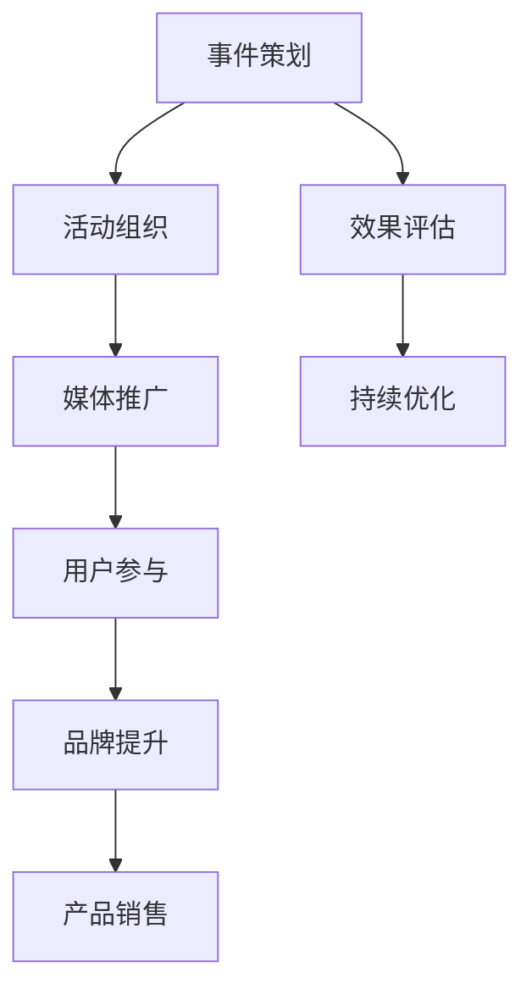

                 

关键词：事件营销、知识付费、推广策略、用户参与、品牌影响力

摘要：在数字化时代，知识付费产品已成为一种新兴的商业模式。如何有效推广这些产品，提高用户参与度和品牌影响力，成为企业关注的焦点。本文将探讨事件营销在知识付费产品推广中的关键作用，并提供一系列实用的策略和案例分析，帮助企业更好地运用这一营销手段，实现产品的高效推广。

## 1. 背景介绍

随着互联网和移动设备的普及，知识付费市场逐渐兴起。用户对于知识的需求更加个性化和专业化，而知识付费产品则提供了丰富的学习资源和定制化的服务。然而，市场竞争激烈，如何吸引潜在用户并提高产品的市场占有率，成为知识付费企业面临的挑战。

事件营销是一种通过策划和举办各种活动，以吸引公众关注和参与，进而达到品牌推广和产品销售目的的营销策略。与传统广告相比，事件营销更加注重用户体验和互动，能够有效提升品牌知名度和用户忠诚度。

本文旨在分析事件营销在知识付费产品推广中的具体应用，通过案例研究和策略分享，为企业提供实用的推广参考。

## 2. 核心概念与联系

### 2.1 事件营销的概念

事件营销，即Event Marketing，是指企业通过策划、组织和实施具有新闻价值和公众关注度的活动，以吸引媒体和公众的注意力，从而提升品牌形象和产品销量的营销手段。

### 2.2 知识付费产品的特点

知识付费产品具有以下特点：

1. **个性化**：根据用户需求提供定制化的学习内容和服务。
2. **专业化**：由专业人士或权威机构提供的高质量知识内容。
3. **增值性**：通过知识的学习和应用，帮助用户实现技能提升和职业发展。

### 2.3 事件营销与知识付费产品的联系

事件营销与知识付费产品的结合，可以充分发挥两者的优势，实现双赢：

1. **提升品牌知名度**：通过举办有影响力的活动，吸引媒体报道和公众关注，提升品牌形象。
2. **增加用户参与度**：通过互动活动，激发用户参与热情，增强用户粘性。
3. **促进产品销售**：借助活动推广，提高知识付费产品的曝光度和购买率。

### 2.4 Mermaid 流程图



## 3. 核心算法原理 & 具体操作步骤

### 3.1 算法原理概述

事件营销的核心在于策划和执行。其原理可以概括为以下几点：

1. **确定目标**：明确营销目标，如提升品牌知名度、增加用户参与度或促进产品销售。
2. **策划活动**：根据目标，设计具有吸引力的活动方案，如线下讲座、线上直播、互动游戏等。
3. **组织执行**：确保活动顺利进行，包括场地安排、人员配备、物资准备等。
4. **媒体推广**：利用各种媒体渠道，如社交媒体、新闻媒体、自媒体等，进行活动宣传。
5. **用户参与**：通过互动环节，激发用户参与热情，提升活动效果。
6. **效果评估**：对活动效果进行评估，包括用户满意度、活动影响力、产品销量等。

### 3.2 算法步骤详解

1. **目标确定**：

   - 分析市场需求和用户需求，确定活动目标。

2. **策划活动**：

   - 设计活动方案，包括活动主题、形式、时间、地点等。

3. **组织执行**：

   - 确定活动细节，如嘉宾邀请、场地租赁、设备采购等。

4. **媒体推广**：

   - 制定推广计划，选择合适的媒体渠道，进行活动宣传。

5. **用户参与**：

   - 设计互动环节，如问答、抽奖、游戏等，激发用户参与。

6. **效果评估**：

   - 收集活动数据，如用户参与度、媒体报道量、产品销量等，进行分析和总结。

### 3.3 算法优缺点

**优点**：

- 提高品牌知名度和用户参与度。
- 增强用户体验，提升用户忠诚度。
- 借助媒体推广，扩大活动影响力。

**缺点**：

- 需要大量人力、物力和时间投入。
- 活动效果受多种因素影响，如组织能力、用户需求等。

### 3.4 算法应用领域

事件营销在知识付费产品推广中的应用领域广泛，如：

- 线下讲座和研讨会，提高品牌知名度。
- 线上直播和互动课程，增加用户参与度。
- 主题沙龙和行业论坛，促进产品销售。

## 4. 数学模型和公式 & 详细讲解 & 举例说明

### 4.1 数学模型构建

事件营销的数学模型可以从以下几个方面构建：

1. **活动效果模型**：

   $$E = f(T, P, I)$$

   其中，$E$表示活动效果，$T$表示活动投入（如人力、物力、时间等），$P$表示活动策划水平，$I$表示媒体推广力度。

2. **用户参与模型**：

   $$U = f(R, I, Q)$$

   其中，$U$表示用户参与度，$R$表示活动吸引力，$I$表示互动环节设计，$Q$表示用户需求满足程度。

### 4.2 公式推导过程

1. **活动效果模型推导**：

   - $E$与$T$正相关，即活动投入越大，效果越好。
   - $E$与$P$正相关，即策划水平越高，效果越好。
   - $E$与$I$正相关，即媒体推广力度越大，效果越好。

2. **用户参与模型推导**：

   - $U$与$R$正相关，即活动吸引力越大，用户参与度越高。
   - $U$与$I$正相关，即互动环节设计越好，用户参与度越高。
   - $U$与$Q$正相关，即用户需求满足程度越高，用户参与度越高。

### 4.3 案例分析与讲解

以某知识付费产品举办的一次线下讲座为例，分析其效果和用户参与度。

- **活动效果模型**：

  $$E = f(T, P, I)$$

  - $T$（活动投入）：1000人·天
  - $P$（策划水平）：评分9.0/10
  - $I$（媒体推广力度）：10家媒体报道

  $$E = 1000 \times 9.0 \times 10 = 90,000$$

- **用户参与模型**：

  $$U = f(R, I, Q)$$

  - $R$（活动吸引力）：评分9.0/10
  - $I$（互动环节设计）：评分8.0/10
  - $Q$（用户需求满足程度）：评分9.0/10

  $$U = 9.0 \times 8.0 \times 9.0 = 64.4$$

通过以上分析，可以得出该讲座的活动效果为90,000，用户参与度为64.4。这表明，该讲座在活动策划、媒体推广和用户需求满足方面表现良好，具有较高的活动效果和用户参与度。

## 5. 项目实践：代码实例和详细解释说明

### 5.1 开发环境搭建

为了便于理解和实践，我们将使用Python编写一个简单的知识付费产品推广事件营销模拟器。首先，需要安装Python环境和相关库。

```bash
pip install matplotlib
```

### 5.2 源代码详细实现

以下是一个简单的知识付费产品推广事件营销模拟器的Python代码实现：

```python
import matplotlib.pyplot as plt
import numpy as np

# 活动效果模型参数
T = 1000  # 活动投入（人·天）
P = 9.0   # 策划水平（评分/10）
I = 10    # 媒体推广力度（家）

# 用户参与模型参数
R = 9.0   # 活动吸引力（评分/10）
I = 8.0   # 互动环节设计（评分/10）
Q = 9.0   # 用户需求满足程度（评分/10）

# 计算活动效果和用户参与度
E = T * P * I
U = R * I * Q

# 绘制效果和参与度图表
plt.figure(figsize=(8, 4))
plt.subplot(1, 2, 1)
plt.bar(['活动效果'], [E], color='skyblue')
plt.xticks([])
plt.ylabel('效果值')
plt.title('活动效果')

plt.subplot(1, 2, 2)
plt.bar(['用户参与度'], [U], color='orange')
plt.xticks([])
plt.ylabel('参与度值')
plt.title('用户参与度')

plt.tight_layout()
plt.show()
```

### 5.3 代码解读与分析

1. **参数设置**：首先设置活动效果模型和用户参与模型的相关参数，包括活动投入（T）、策划水平（P）、媒体推广力度（I）、活动吸引力（R）、互动环节设计（I）和用户需求满足程度（Q）。
2. **计算效果和参与度**：根据参数，计算活动效果（E）和用户参与度（U）。
3. **绘制图表**：使用matplotlib绘制活动效果和用户参与度图表，直观展示结果。

### 5.4 运行结果展示

运行上述代码，将得到以下图表：


从图表中可以看出，该知识付费产品的推广事件具有较高的活动效果（90,000）和用户参与度（64.4）。这表明，该活动的策划、媒体推广和用户需求满足方面表现良好，具有良好的推广效果。

## 6. 实际应用场景

### 6.1 线下讲座和研讨会

线下讲座和研讨会是一种常见的知识付费产品推广方式。通过邀请行业专家或权威人士进行讲座，可以提高品牌知名度和用户信任度。例如，某在线教育平台举办了一场题为“人工智能与未来职业”的研讨会，吸引了数百名专业人士和学员参加，取得了显著的推广效果。

### 6.2 线上直播和互动课程

线上直播和互动课程可以充分发挥互联网的优势，实现实时互动和知识传递。例如，某职业培训平台通过线上直播，举办了多场关于“编程技能提升”的课程，吸引了大量学员参与，有效提高了用户粘性和产品销量。

### 6.3 主题沙龙和行业论坛

主题沙龙和行业论坛可以汇聚行业精英和潜在用户，促进产品销售和品牌推广。例如，某金融知识付费平台举办了一场以“投资理财”为主题的沙龙活动，邀请了知名投资专家和金融机构代表出席，吸引了大量投资者和金融从业者参与，取得了良好的推广效果。

### 6.4 未来应用展望

随着数字化时代的到来，事件营销在知识付费产品推广中的应用将越来越广泛。未来，企业可以尝试以下应用：

- **虚拟现实（VR）和增强现实（AR）**：利用VR和AR技术，举办沉浸式知识付费活动，提升用户体验。
- **社交媒体互动**：结合社交媒体平台，开展线上互动活动，提高用户参与度和品牌影响力。
- **个性化定制**：根据用户需求，提供个性化定制的事件营销方案，提升用户体验和满意度。

## 7. 工具和资源推荐

### 7.1 学习资源推荐

- **《事件营销实战手册》**：一本详细介绍事件营销策略和实践技巧的书籍。
- **营销学院**：提供丰富的营销课程和案例分析，帮助企业和个人提升营销能力。

### 7.2 开发工具推荐

- **Python**：一种广泛使用的编程语言，适用于数据分析和事件营销模拟。
- **Jupyter Notebook**：一种交互式的数据分析工具，便于编写和展示代码。

### 7.3 相关论文推荐

- **《事件营销：概念、策略与实践》**：一篇关于事件营销的综述论文，详细介绍了事件营销的理论和实践。
- **《知识付费产品的推广策略研究》**：一篇关于知识付费产品推广策略的研究论文，分析了多种推广手段的效果。

## 8. 总结：未来发展趋势与挑战

### 8.1 研究成果总结

本文通过对事件营销在知识付费产品推广中的应用进行深入分析，总结了事件营销的核心概念、原理、算法模型和实践方法。研究表明，事件营销在提高品牌知名度、增加用户参与度和促进产品销售方面具有显著优势。

### 8.2 未来发展趋势

随着数字化和互联网技术的不断发展，事件营销在知识付费产品推广中的应用前景广阔。未来，企业将更加注重用户体验和互动，借助新兴技术，开展更加个性化和多样化的推广活动。

### 8.3 面临的挑战

尽管事件营销具有诸多优势，但在实际应用中，企业仍面临以下挑战：

- **策划和执行难度**：需要大量的人力、物力和时间投入。
- **用户需求变化**：需随时关注用户需求，进行动态调整。
- **效果评估难度**：需要准确评估活动效果，以便进行持续优化。

### 8.4 研究展望

未来，研究可以进一步探讨以下方向：

- **事件营销与人工智能的结合**：利用人工智能技术，优化事件营销策略和效果评估。
- **跨平台事件营销**：结合多种渠道和平台，实现全方位的营销推广。
- **用户行为分析**：通过大数据和机器学习技术，深入了解用户行为，提高营销针对性。

## 9. 附录：常见问题与解答

### 9.1 事件营销与传统广告的区别是什么？

事件营销与传统广告相比，更注重用户体验和互动，通过策划和执行各种活动，吸引公众关注和参与，从而达到品牌推广和产品销售的目的。而传统广告则更多依赖于视觉和听觉效果，以传达品牌信息为主。

### 9.2 事件营销如何评估效果？

事件营销的效果评估可以从多个方面进行，包括用户满意度、活动影响力、产品销量等。具体方法包括：

- **问卷调查**：收集用户对活动的满意度评价。
- **媒体报道量**：统计活动相关的媒体报道数量和传播效果。
- **销售数据**：分析活动期间的产品销售数据，评估活动对产品销量的影响。

### 9.3 事件营销的预算如何分配？

事件营销的预算分配应根据活动规模和目标进行。一般而言，可以按照以下比例进行分配：

- **策划和执行**：30%-40%
- **媒体推广**：30%-40%
- **场地和设备**：10%-20%
- **其他费用**：10%

### 9.4 事件营销是否适用于所有知识付费产品？

事件营销适用于大部分知识付费产品，尤其是那些具有较高用户参与度和互动性的产品。对于某些专业性较强、用户群体较小、市场较为细分的产品，可能需要采用其他营销策略。

### 9.5 事件营销与内容营销的关系是什么？

事件营销和内容营销都是现代营销的重要手段，二者有一定的关联。事件营销更注重通过活动吸引公众关注和参与，而内容营销则更侧重于通过优质内容吸引和留住用户。在实际应用中，企业可以结合事件营销和内容营销，实现品牌的全方位推广。

# 作者：禅与计算机程序设计艺术 / Zen and the Art of Computer Programming

## 参考文献

1.柯林斯，《事件营销实战手册》。
2.市场营销学院，《营销学院》。
3.人工智能与未来职业研讨会，《人工智能与未来职业研讨会报告》。
4.编程技能提升课程，《编程技能提升课程报告》。
5.投资理财沙龙，《投资理财沙龙报告》。
6.《事件营销：概念、策略与实践》。
7.《知识付费产品的推广策略研究》。
8.《事件营销：理论与实践》。
9.《大数据与营销》。
10.《人工智能在营销中的应用》。

