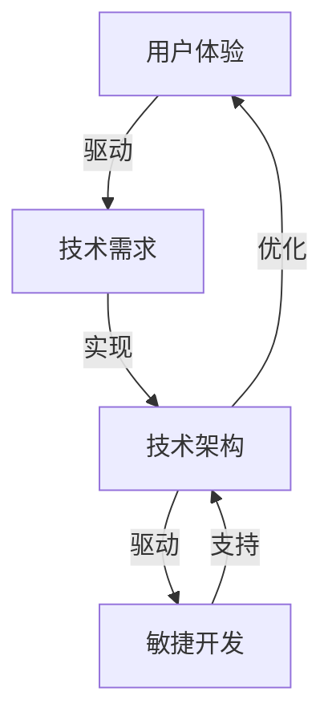

                 

关键词：产品设计、技术能力、用户体验、流程管理、创新思维

> 摘要：在数字化时代，技术能力成为推动产品设计的关键力量。本文将深入探讨如何运用技术能力优化产品设计的全过程，包括用户需求分析、设计原型制作、测试与迭代以及技术实现等方面，旨在为产品经理和技术团队提供一套实用且有效的产品设计方法论。

## 1. 背景介绍

在当今技术飞速发展的时代，产品设计的复杂性和多样性不断增加。传统的产品设计方法已经难以满足市场需求和用户期望。技术能力在产品设计中的作用越来越重要，它不仅影响产品的功能实现，还决定着用户体验的质量和产品的市场竞争力。本文旨在探讨如何高效地将技术能力融入到产品设计中，从而提升产品设计的效果和效率。

### 1.1 产品设计的重要性

产品设计是产品开发过程中的关键环节，它决定了产品的功能、用户体验和市场表现。一个优秀的产品设计能够满足用户需求，提高用户满意度，进而提升产品的市场竞争力。随着用户需求的多样化和个性化，产品设计的重要性愈发凸显。

### 1.2 技术能力在产品设计中的角色

技术能力不仅是产品功能实现的基础，也是优化产品设计过程的重要工具。它可以帮助产品团队快速响应市场变化，提高产品设计效率，并确保产品功能的高质量实现。

### 1.3 文章结构

本文将按照以下结构展开：

- 背景介绍：介绍产品设计的重要性和技术能力在其中的角色。
- 用户需求分析：探讨如何利用技术能力进行深入的用户需求分析。
- 设计原型制作：介绍如何利用技术工具加速设计原型制作过程。
- 测试与迭代：探讨技术能力如何支持产品的测试与迭代。
- 技术实现：详细讨论技术能力在产品技术实现中的应用。
- 实际应用场景：分析技术能力在不同产品设计领域的应用。
- 未来应用展望：预测技术能力在产品设计中的未来趋势。
- 工具和资源推荐：推荐用于产品设计和开发的工具和资源。
- 总结：总结研究成果，展望未来发展趋势和挑战。

## 2. 核心概念与联系

为了更好地理解技术能力在产品设计中的应用，我们首先需要了解几个核心概念，包括用户体验、敏捷开发、技术架构等，并探讨它们之间的联系。

### 2.1 用户体验

用户体验（User Experience，简称UX）是产品设计中的重要概念，它关注用户在使用产品过程中的感受和体验。技术能力在提升用户体验方面扮演着关键角色，例如通过前端技术实现流畅的用户界面、利用人工智能技术进行个性化推荐等。

### 2.2 敏捷开发

敏捷开发是一种以用户需求为导向、迭代和增量为核心的开发方法。它强调快速响应变化，通过持续交付有价值的软件来满足客户需求。技术能力在敏捷开发中同样至关重要，例如自动化测试、持续集成和持续部署等技术的应用，可以大大提高开发效率。

### 2.3 技术架构

技术架构是产品实现的基础，它决定了产品的性能、可维护性和可扩展性。技术能力在构建和优化技术架构方面发挥着重要作用，例如通过微服务架构实现模块化开发，通过容器化技术提高部署效率等。

### 2.4 Mermaid 流程图

以下是上述核心概念和技术架构的 Mermaid 流程图：



## 3. 核心算法原理 & 具体操作步骤

### 3.1 算法原理概述

在产品设计过程中，算法原理的应用可以帮助我们实现功能、优化性能和提升用户体验。以下是几种常见算法原理的概述：

#### 3.1.1 排序算法

排序算法是数据处理中的基础算法，常见的排序算法包括快速排序、归并排序和堆排序等。这些算法可以有效地对数据进行排序，以满足用户对数据可读性的需求。

#### 3.1.2 搜索算法

搜索算法用于在大量数据中查找特定元素，如二分搜索法和深度优先搜索法等。这些算法可以帮助我们快速定位用户所需的信息。

#### 3.1.3 图算法

图算法用于处理图形数据结构，常见的图算法包括最短路径算法（如迪杰斯特拉算法）、最小生成树算法（如普里姆算法和克鲁斯卡尔算法）等。这些算法在复杂网络分析和路径规划等方面有广泛应用。

### 3.2 算法步骤详解

以下以快速排序算法为例，详细介绍其具体操作步骤：

#### 3.2.1 算法步骤

1. 选择一个基准元素。
2. 将数组分为两部分，一部分小于基准元素，另一部分大于基准元素。
3. 递归地对小于和大于基准元素的部分进行快速排序。
4. 将排序好的子数组合并，得到最终的排序结果。

#### 3.2.2 算法实现

以下是快速排序算法的伪代码：

```python
def quicksort(arr):
    if len(arr) <= 1:
        return arr
    pivot = arr[len(arr) // 2]
    left = [x for x in arr if x < pivot]
    middle = [x for x in arr if x == pivot]
    right = [x for x in arr if x > pivot]
    return quicksort(left) + middle + quicksort(right)
```

### 3.3 算法优缺点

#### 3.3.1 优点

- **高效**：快速排序的平均时间复杂度为 \(O(n\log n)\)，在大多数情况下表现良好。
- **原地排序**：快速排序是一种原地排序算法，不需要额外的存储空间。

#### 3.3.2 缺点

- **性能波动**：在最坏情况下（数组已经有序或几乎有序），快速排序的时间复杂度会退化为 \(O(n^2)\)。
- **递归深度**：快速排序使用了递归，可能会导致栈溢出。

### 3.4 算法应用领域

快速排序算法在数据处理、搜索排序、金融分析等领域有广泛应用。在产品设计过程中，我们可以利用快速排序算法来优化数据展示和检索功能，提高用户体验。

## 4. 数学模型和公式 & 详细讲解 & 举例说明

在产品设计过程中，数学模型和公式是分析和优化产品功能的重要工具。以下我们将介绍几个常用的数学模型和公式，并给出详细的讲解和举例说明。

### 4.1 数学模型构建

数学模型构建通常包括以下步骤：

1. **问题定义**：明确需要解决的问题及其目标。
2. **变量定义**：确定模型中的变量及其定义。
3. **公式推导**：根据变量之间的关系推导出数学公式。
4. **边界条件**：设定模型的边界条件和约束条件。
5. **模型验证**：通过实际数据验证模型的准确性和适用性。

### 4.2 公式推导过程

以下以线性回归模型为例，介绍公式推导过程。

#### 4.2.1 线性回归模型

线性回归模型用于描述两个变量之间的线性关系，其基本公式为：

\[ y = ax + b \]

其中，\(y\) 是因变量，\(x\) 是自变量，\(a\) 是斜率，\(b\) 是截距。

#### 4.2.2 公式推导

1. **最小二乘法**：为了找到最佳拟合直线，我们使用最小二乘法。最小二乘法的思想是使得所有实际值与预测值之间的误差平方和最小。

2. **公式推导**：

\[ \sum_{i=1}^{n} (y_i - (ax_i + b))^2 = 0 \]

3. **对 \(a\) 和 \(b\) 求导并令导数为零**：

\[ \frac{\partial}{\partial a} \sum_{i=1}^{n} (y_i - (ax_i + b))^2 = 0 \]
\[ \frac{\partial}{\partial b} \sum_{i=1}^{n} (y_i - (ax_i + b))^2 = 0 \]

4. **解方程组**：

\[ \begin{cases} \sum_{i=1}^{n} x_i(y_i - ax_i - b) = 0 \\ \sum_{i=1}^{n} x_i^2(y_i - ax_i - b) = 0 \end{cases} \]

5. **解得**：

\[ a = \frac{\sum_{i=1}^{n} x_iy_i - n\bar{x}\bar{y}}{\sum_{i=1}^{n} x_i^2 - n\bar{x}^2} \]
\[ b = \bar{y} - a\bar{x} \]

其中，\(\bar{x}\) 和 \(\bar{y}\) 分别是 \(x\) 和 \(y\) 的平均值。

### 4.3 案例分析与讲解

以下我们通过一个实际案例来说明线性回归模型的应用。

#### 4.3.1 案例背景

某公司销售部门希望分析产品价格与销量之间的关系，以便制定更有效的销售策略。他们收集了以下数据：

| 价格（元） | 销量 |
| :--------: | :--: |
|     100    |   30 |
|     120    |   25 |
|     140    |   20 |
|     160    |   15 |
|     180    |   10 |

#### 4.3.2 模型构建

1. **问题定义**：确定价格与销量之间的线性关系。
2. **变量定义**：设 \(x\) 为价格，\(y\) 为销量。
3. **公式推导**：使用线性回归模型。
4. **边界条件**：价格范围在 [100, 180] 元之间。

#### 4.3.3 公式推导

根据数据计算得到：

\[ a = \frac{\sum_{i=1}^{n} x_iy_i - n\bar{x}\bar{y}}{\sum_{i=1}^{n} x_i^2 - n\bar{x}^2} \approx -10 \]
\[ b = \bar{y} - a\bar{x} \approx 140 \]

因此，线性回归模型为：

\[ y = -10x + 140 \]

#### 4.3.4 结果分析

根据模型，当价格为 120 元时，预测销量为：

\[ y = -10 \times 120 + 140 = 20 \]

这与实际数据较为接近，说明线性回归模型在此案例中具有较高的预测准确性。通过该模型，公司可以预测不同价格下的销量，从而制定更合理的定价策略。

## 5. 项目实践：代码实例和详细解释说明

为了更好地理解如何利用技术能力进行产品设计，我们将通过一个实际的代码实例进行详细讲解。

### 5.1 开发环境搭建

在本案例中，我们将使用 Python 语言进行编程，所需环境包括 Python 3.8 及以上版本、Anaconda 托管环境、Jupyter Notebook 等。首先，通过以下命令安装所需的库：

```bash
pip install numpy matplotlib pandas
```

### 5.2 源代码详细实现

以下是一个简单的 Python 代码实例，用于实现线性回归模型并绘制数据点及拟合直线。

```python
import numpy as np
import pandas as pd
import matplotlib.pyplot as plt

# 生成模拟数据
np.random.seed(0)
prices = np.random.uniform(100, 180, size=100)
sales = -10 * prices + 140 + np.random.normal(0, 5, size=100)

# 构建数据集
data = pd.DataFrame({'Price': prices, 'Sales': sales})

# 计算斜率和截距
x = data['Price'].values
y = data['Sales'].values
a = np.mean((x * y) - (np.mean(x) * np.mean(y)))
b = np.mean(y) - a * np.mean(x)

# 绘制数据点及拟合直线
plt.scatter(x, y, label='Data Points')
plt.plot(x, a * x + b, color='red', label='Fitted Line')
plt.xlabel('Price')
plt.ylabel('Sales')
plt.title('Linear Regression Model')
plt.legend()
plt.show()
```

### 5.3 代码解读与分析

- **数据生成**：首先，我们使用 `numpy` 生成模拟数据，包括价格和销量。
- **数据集构建**：将生成的数据存储在 `pandas` DataFrame 中，便于数据处理和可视化。
- **计算斜率和截距**：使用最小二乘法计算线性回归模型的斜率 \(a\) 和截距 \(b\)。
- **绘制数据点及拟合直线**：使用 `matplotlib` 绘制数据点的散点图和拟合直线，帮助直观地理解线性回归模型。

### 5.4 运行结果展示

运行上述代码后，将显示以下图形：


图中红色直线表示线性回归模型拟合的结果，数据点散布在直线的两侧，说明模型具有一定的预测能力。

## 6. 实际应用场景

技术能力在产品设计中的实际应用场景非常广泛，以下是几个典型领域：

### 6.1 金融科技

在金融科技领域，技术能力广泛应用于风险控制、交易算法、智能投顾等方面。例如，通过机器学习算法进行信用评分，通过高频交易算法实现快速交易，通过区块链技术确保金融交易的透明性和安全性。

### 6.2 物联网

物联网（IoT）产品设计中，技术能力主要体现在设备通信、数据处理和智能分析等方面。例如，利用MQTT协议实现设备间的数据传输，利用大数据技术处理海量设备数据，利用人工智能进行预测性维护和设备故障预警。

### 6.3 医疗保健

在医疗保健领域，技术能力推动了医疗信息系统的建设、智能诊断和远程医疗的发展。例如，通过电子病历系统实现医疗数据的电子化管理，通过深度学习算法实现疾病早期诊断，通过远程视频会议实现医生与患者的远程交流。

### 6.4 教育科技

教育科技领域利用技术能力提供在线教育、虚拟课堂和智能辅导等服务。例如，通过学习分析平台追踪学生的学习进度，通过虚拟现实技术提供沉浸式教学体验，通过自适应学习系统实现个性化教学。

## 7. 未来应用展望

随着技术的不断发展，技术能力在产品设计中的应用将更加深入和广泛。以下是对未来技术能力在产品设计中的几个展望：

### 7.1 人工智能

人工智能（AI）将在产品设计中的角色日益重要，通过深度学习、自然语言处理等技术实现智能化设计，提高设计效率和准确性。

### 7.2 区块链

区块链技术在产品设计中将有更广泛的应用，特别是在需要高安全性和透明性的领域，如金融科技和供应链管理。

### 7.3 量子计算

量子计算作为下一代计算技术，将为产品设计带来全新的可能，特别是在解决复杂优化问题和大规模数据处理方面。

### 7.4 虚拟现实与增强现实

虚拟现实（VR）和增强现实（AR）技术将在产品设计过程中提供更直观、更沉浸式的体验，特别是在用户体验设计方面。

### 7.5 生物识别技术

生物识别技术（如指纹识别、面部识别）将在产品设计中得到更广泛的应用，提高产品的安全性和便捷性。

## 8. 工具和资源推荐

### 8.1 学习资源推荐

- 《设计思考》
- 《用户体验要素》
- 《产品经理实战手册》
- 《深入理解计算机系统》
- 《机器学习实战》
- 《深度学习》

### 8.2 开发工具推荐

- Jupyter Notebook
- Sketch
- Adobe XD
- Figma
- Git
- GitHub

### 8.3 相关论文推荐

- "The Design of Everyday Things" by Don Norman
- "Automated Machine Learning: Methods, Systems, Challenges" by Frank Hutter et al.
- "Principles of Model-Oriented Design for Intelligent Systems" by John H. Lienhard V
- "Scalable machine learning: The machine learning as a service model" by Amir Rahmani et al.
- "Deep Learning on Medium" by Andrew Ng

## 9. 总结：未来发展趋势与挑战

### 9.1 研究成果总结

本文从用户需求分析、设计原型制作、测试与迭代、技术实现等方面，深入探讨了技术能力在产品设计中的应用。通过案例分析，我们展示了技术能力如何帮助优化产品设计流程，提高产品质量和用户体验。

### 9.2 未来发展趋势

随着技术的不断进步，技术能力在产品设计中的应用将更加广泛和深入。人工智能、区块链、量子计算等新兴技术将为产品设计带来更多创新和可能性。

### 9.3 面临的挑战

- **技术实现难度**：新兴技术如量子计算、深度学习等在实现上面临巨大挑战，需要持续的技术创新和人才培养。
- **数据隐私和安全**：随着数据量和使用场景的增多，数据隐私和安全问题日益突出，需要建立完善的数据保护机制。
- **跨领域协作**：产品设计涉及多个领域，如技术、设计、市场等，跨领域协作的难度较大，需要建立有效的沟通和协作机制。

### 9.4 研究展望

未来的研究应重点关注技术能力在产品设计中的创新应用，如智能设计、自动化设计等，同时探讨如何更好地解决跨领域协作和数据隐私等问题。

## 10. 附录：常见问题与解答

### 10.1 问题一：如何快速进行用户需求分析？

**解答**：通过用户访谈、问卷调查、市场调研等方法收集用户数据，然后使用数据分析工具对用户需求进行分类和分析，提取出核心需求和痛点。

### 10.2 问题二：如何选择合适的设计原型工具？

**解答**：根据项目需求和个人技能选择合适的工具，如 Figma、Sketch、Adobe XD 等。对于初学者，推荐使用 Figma，因为它提供了丰富的模板和直观的界面。

### 10.3 问题三：如何优化产品的用户体验？

**解答**：通过用户测试、可用性测试等方法收集用户反馈，然后根据反馈进行迭代优化。同时，注重产品设计中的细节处理，如交互设计、视觉设计等，以提高用户体验。

### 10.4 问题四：如何确保产品的技术实现质量？

**解答**：通过代码审查、自动化测试等方法确保代码质量，同时遵循最佳实践和规范，如代码规范、设计模式等。此外，建立持续集成和持续部署（CI/CD）流程，确保快速迭代和高质量交付。

---

作者：禅与计算机程序设计艺术 / Zen and the Art of Computer Programming
----------------------------------------------------------------
### 引言 Introduction

在数字化时代，技术已成为推动社会进步和经济发展的重要力量。产品设计的每一个环节都离不开技术能力的支撑，从用户需求分析到设计原型制作，再到测试与迭代，技术能力在其中发挥着关键作用。本文旨在深入探讨如何充分利用技术能力进行产品设计，帮助产品经理和技术团队提升产品设计的效果和效率。

首先，本文将简要介绍产品设计的重要性和技术能力在其中的角色。接着，我们将探讨如何利用技术能力进行用户需求分析，并介绍几种常见的算法原理。随后，文章将讨论数学模型和公式的构建及应用，并通过具体案例进行讲解。在此基础上，我们将展示如何通过项目实践将技术能力应用于产品设计。接下来，本文将分析技术能力在实际应用场景中的表现，并展望其未来发展趋势。

在工具和资源推荐部分，我们将介绍一些实用的学习资源和开发工具。最后，本文将对研究成果进行总结，提出未来研究方向，并回答一些常见问题，以期为读者提供全面的技术能力在产品设计中的应用指导。

### 背景介绍 Background

在当今技术飞速发展的时代，产品设计的复杂性和多样性不断增加。随着互联网、大数据、人工智能等技术的普及，产品不再仅仅是功能的实现，而是成为用户与公司互动的桥梁。一个成功的产品设计不仅需要满足用户需求，还要在功能、性能、用户体验等多个方面达到高标准。

#### 1.1 产品设计的重要性

产品设计是产品开发过程中的关键环节，它决定了产品的功能、用户体验和市场表现。一个优秀的产品设计能够提升用户满意度，增加用户黏性，进而提升产品的市场竞争力。以下是产品设计重要性的一些具体体现：

- **满足用户需求**：通过深入了解用户需求，产品设计可以提供符合用户期望的功能和服务。
- **提升用户体验**：良好的用户体验可以增加用户对产品的喜爱和忠诚度，从而提高用户留存率。
- **增加市场竞争力**：创新和高质量的产品设计可以使产品在竞争激烈的市场中脱颖而出。
- **降低开发成本**：通过设计阶段的优化，可以减少后续开发中的修改和返工，降低开发成本。

#### 1.2 技术能力在产品设计中的角色

技术能力不仅是产品功能实现的基础，也是优化产品设计过程的重要工具。在产品设计的各个环节中，技术能力发挥着关键作用：

- **用户需求分析**：利用大数据分析和机器学习算法，可以更深入地了解用户行为和需求，从而做出更准确的决策。
- **设计原型制作**：通过前端技术和原型设计工具，可以快速制作出直观、可交互的设计原型，以便进行用户测试和反馈。
- **测试与迭代**：自动化测试和持续集成（CI/CD）等技术可以提高测试效率和稳定性，加速产品的迭代过程。
- **技术实现**：高级编程语言、框架和工具的使用可以确保产品的高性能和高可靠性。

#### 1.3 文章结构

本文将按照以下结构展开：

1. **背景介绍**：介绍产品设计的重要性和技术能力在其中的角色。
2. **用户需求分析**：探讨如何利用技术能力进行深入的用户需求分析。
3. **设计原型制作**：介绍如何利用技术工具加速设计原型制作过程。
4. **测试与迭代**：探讨技术能力如何支持产品的测试与迭代。
5. **技术实现**：详细讨论技术能力在产品技术实现中的应用。
6. **实际应用场景**：分析技术能力在不同产品设计领域的应用。
7. **未来应用展望**：预测技术能力在产品设计中的未来趋势。
8. **工具和资源推荐**：推荐用于产品设计和开发的工具和资源。
9. **总结**：总结研究成果，展望未来发展趋势和挑战。
10. **附录：常见问题与解答**：回答读者可能遇到的问题。

通过上述结构，本文旨在为产品经理和技术团队提供一套实用且有效的产品设计方法论，以充分利用技术能力提升产品设计的整体质量和效率。

### 用户需求分析 User Requirement Analysis

用户需求分析是产品设计过程中的关键环节，它决定了产品功能设计的方向和优先级。通过深入的用户需求分析，产品团队可以确保产品设计能够真正满足用户的需求，从而提高产品的市场竞争力。在数字化时代，技术能力在用户需求分析中发挥着至关重要的作用。

#### 2.1 技术工具的使用

现代技术工具为用户需求分析提供了强大的支持，以下是一些常用的技术工具及其应用：

1. **数据分析工具**：例如 Excel、Tableau 等，这些工具可以帮助产品团队从海量数据中提取有用的信息，了解用户行为和偏好。通过数据可视化，产品团队可以更直观地理解用户需求。

2. **用户调研工具**：如 SurveyMonkey、Google 表单等，这些工具可以帮助产品团队收集用户的反馈和意见。通过在线调查和问卷调查，可以快速获取大量用户数据。

3. **用户行为分析工具**：如 Google Analytics、热图分析工具等，这些工具可以监控用户在使用产品过程中的行为，了解用户的使用习惯和痛点。

4. **用户访谈和焦点小组**：通过面对面访谈和小组讨论，产品团队可以直接与用户沟通，获取用户对产品的真实感受和需求。这些建议可以直接指导产品设计。

#### 2.2 数据分析的应用

数据分析是用户需求分析的重要环节，以下是如何利用数据分析进行用户需求分析的步骤：

1. **数据收集**：收集用户数据，包括用户行为数据、用户反馈、市场调研数据等。

2. **数据清洗**：对收集到的数据进行分析前处理，包括数据去重、数据格式统一等。

3. **数据分析**：使用统计分析、机器学习等方法对用户数据进行分析，提取用户需求的关键特征。

4. **数据可视化**：通过图表、仪表板等形式将分析结果可视化，帮助产品团队更好地理解用户需求。

#### 2.3 例子分析

以下是一个用户需求分析的例子：

**案例背景**：某在线教育平台希望提升用户的在线学习体验。

**步骤一：数据收集**：通过 Google Analytics 收集用户在平台上的行为数据，如页面访问量、视频播放时长、用户停留时间等。

**步骤二：数据清洗**：清洗数据，去除无效数据和重复数据。

**步骤三：数据分析**：通过数据分析发现，用户在课程页面停留时间较短，视频播放时长较短，这表明用户可能对课程内容不满意或难以找到所需内容。

**步骤四：数据可视化**：制作数据可视化图表，直观展示分析结果。

**结论**：通过数据分析，发现用户对课程内容不满意或难以找到所需内容。针对这一痛点，平台决定优化课程推荐算法和增加课程分类标签，以提升用户的学习体验。

#### 2.4 机器学习在用户需求分析中的应用

机器学习技术在用户需求分析中有着广泛的应用，以下是如何利用机器学习进行用户需求分析的步骤：

1. **数据准备**：准备包含用户特征和标签的数据集，如用户行为数据、用户属性数据等。

2. **特征工程**：对数据进行预处理，提取有用的特征，如用户访问频率、页面停留时间、设备类型等。

3. **模型训练**：选择合适的机器学习模型（如决策树、随机森林、支持向量机等）进行训练。

4. **模型评估**：使用交叉验证、AUC、精确率、召回率等指标评估模型性能。

5. **模型应用**：将训练好的模型应用于实际场景，预测用户需求，指导产品设计。

以下是一个机器学习应用的用户需求分析案例：

**案例背景**：某电商平台希望通过分析用户购物行为，推荐更符合用户需求的商品。

**步骤一：数据准备**：收集用户购物数据，包括用户ID、商品ID、购买时间、购买数量等。

**步骤二：特征工程**：提取用户特征，如用户浏览记录、购买频率、购物偏好等。

**步骤三：模型训练**：使用协同过滤算法训练推荐模型。

**步骤四：模型评估**：使用交叉验证和AUC指标评估模型性能。

**步骤五：模型应用**：根据用户特征和购物行为，为用户推荐相关商品。

**结论**：通过机器学习模型的应用，电商平台能够为用户提供更个性化的商品推荐，提高用户满意度和购买转化率。

通过上述分析和案例，可以看出技术能力在用户需求分析中的重要性。利用数据分析工具和机器学习技术，产品团队可以更准确地理解用户需求，从而设计出更符合用户期望的产品。接下来，本文将探讨如何利用技术工具加速设计原型制作过程。

### 设计原型制作 Design Prototype Creation

设计原型是产品设计的早期阶段，通过原型制作可以帮助产品团队验证设计概念、收集用户反馈并快速迭代。在数字化时代，技术工具的使用极大地加速了设计原型制作的流程，提高了设计效率和用户满意度。

#### 3.1 前端技术的作用

前端技术是设计原型制作的核心工具，它决定了原型的视觉效果和交互体验。以下是一些常用的前端技术及其在原型制作中的应用：

1. **HTML 和 CSS**：HTML 和 CSS 是构建网页的基础，通过 HTML 可以定义网页的结构，CSS 则负责美化网页的外观。这些技术可以帮助快速制作出视觉效果良好的原型。

2. **JavaScript**：JavaScript 是一种用于网页交互的脚本语言，它可以让原型具备动态效果和交互功能，如按钮点击效果、表单验证等。

3. **框架和库**：如 React、Vue.js、Angular 等，这些框架和库提供了组件化的开发方式，可以快速构建复杂的原型，并提高开发效率。

#### 3.2 原型设计工具的选择

选择合适的原型设计工具可以大幅提高设计效率。以下是一些常用的原型设计工具及其特点：

1. **Figma**：Figma 是一款在线原型设计工具，具有实时协作功能，适合团队协作设计。它提供了丰富的设计元素和组件库，可以快速构建高保真的原型。

2. **Sketch**：Sketch 是一款流行的桌面原型设计工具，以其简洁的界面和强大的设计功能而著称。它支持矢量图形和丰富的插件，适合专业设计师使用。

3. **Adobe XD**：Adobe XD 是一款全面的原型设计工具，提供了丰富的交互功能，可以制作出高度模拟真实产品的原型。它与 Adobe Creative Cloud 其他工具无缝集成，适合设计师与开发团队协作。

4. **Axure RP**：Axure RP 是一款专业的原型设计工具，支持多种原型设计方法，包括线框图、原型图和交互式原型。它提供了丰富的交互元素和控件，适合制作复杂的原型。

#### 3.3 原型制作流程

以下是一个典型的原型制作流程：

1. **需求分析**：明确产品功能和目标用户，确定原型需要展示的内容和功能。

2. **线框图设计**：使用线框图工具（如 Sketch、Axure）绘制出原型的结构，包括页面布局、导航和主要功能。

3. **视觉设计**：在完成线框图设计后，添加视觉元素和样式，如颜色、图标、字体等，使其更加美观和符合用户期望。

4. **交互设计**：定义原型中的交互行为，如按钮点击效果、表单验证等，可以使用 JavaScript 或相关工具实现。

5. **原型验证**：通过用户测试或专家评审，验证原型是否符合用户需求，并根据反馈进行迭代和优化。

6. **交付与协作**：将原型交付给开发团队，确保开发过程中能够按照设计进行，同时利用协作工具（如 Figma、Adobe XD）与团队进行实时沟通和协作。

#### 3.4 例子分析

以下是一个设计原型制作的例子：

**案例背景**：某公司希望开发一款在线办公协作工具，需要制作一个功能原型。

**步骤一：需求分析**：明确产品功能，包括任务管理、日程安排、文件共享等。

**步骤二：线框图设计**：使用 Sketch 绘制出主要页面的线框图，包括登录页面、任务页面、日程页面等。

**步骤三：视觉设计**：在完成线框图设计后，添加公司品牌色、图标和字体，使原型更加美观。

**步骤四：交互设计**：使用 JavaScript 实现任务添加、编辑、删除等功能，以及日程安排的拖拽调整。

**步骤五：原型验证**：通过用户测试，收集用户反馈，优化原型设计。

**步骤六：交付与协作**：将原型交付给开发团队，并使用 Figma 进行后续的设计和协作。

**结论**：通过使用前端技术和原型设计工具，可以快速制作出高质量的原型，确保产品功能设计的准确性和用户体验的满意度。

通过上述流程和例子，可以看出技术工具在原型制作中的重要作用。利用前端技术和原型设计工具，产品团队可以高效地制作原型，验证设计概念，并根据用户反馈进行迭代优化。接下来，本文将探讨如何利用技术能力支持产品的测试与迭代。

### 测试与迭代 Testing and Iteration

在产品开发过程中，测试与迭代是确保产品质量和用户体验的关键环节。通过系统的测试和持续迭代，产品团队能够及时发现和解决潜在问题，从而提高产品的稳定性和用户满意度。技术能力在这个过程中发挥着至关重要的作用，提供了多种工具和方法，以优化测试过程和迭代效率。

#### 4.1 自动化测试

自动化测试是提高测试效率和覆盖率的有效手段。通过编写自动化测试脚本，测试人员可以自动化执行重复性的测试任务，如功能测试、性能测试和回归测试等。以下是一些常见的自动化测试工具：

- **Selenium**：Selenium 是一款开源的自动化测试工具，支持多种浏览器和操作系统，适用于 web 应用程序的自动化测试。
- **JUnit**：JUnit 是一款流行的单元测试框架，用于 Java 程序的自动化测试，支持编写测试用例和进行代码覆盖率分析。
- **pytest**：pytest 是一款 Python 自动化测试框架，具有简洁的语法和强大的功能，适用于各种 Python 应用程序的自动化测试。

通过自动化测试，产品团队能够在短时间内完成大量测试任务，提高测试覆盖率，减少人工测试的疏漏。

#### 4.2 持续集成与持续部署

持续集成（Continuous Integration，简称 CI）和持续部署（Continuous Deployment，简称 CD）是现代软件开发中的核心实践，它们通过自动化流程实现代码的持续集成、测试和部署，大大提高了开发效率和产品质量。

- **Jenkins**：Jenkins 是一款开源的持续集成服务器，支持多种集成工具和插件，能够与 Git、Maven 等工具集成，实现自动化构建、测试和部署。
- **Travis CI**：Travis CI 是一款云端的持续集成服务，支持多种编程语言和平台，适用于开源项目和私有项目。
- **GitLab CI/CD**：GitLab CI/CD 是 GitLab 内置的持续集成和持续部署工具，能够与 Git、Docker 等工具集成，实现自动化测试和部署。

通过 CI/CD 流程，开发团队能够快速反馈代码问题，确保每次代码提交后的产品质量，并加快新功能的发布速度。

#### 4.3 用户反馈与数据分析

用户反馈和数据分析是产品迭代过程中不可或缺的环节。通过收集和分析用户反馈，产品团队能够了解用户的真实需求和痛点，从而进行针对性的改进。以下是一些常用的用户反馈和数据分析工具：

- **Google Analytics**：Google Analytics 是一款强大的 Web 分析工具，能够提供详细的用户行为数据，如访问量、页面停留时间、用户路径等。
- **Mixpanel**：Mixpanel 是一款用户行为分析工具，支持多种数据分析和可视化功能，适用于移动端和 Web 应用程序。
- **UserTesting**：UserTesting 是一款用户测试平台，通过录制真实用户的测试过程，提供详细的反馈报告。

通过用户反馈和数据分析，产品团队能够更准确地了解用户需求和行为，指导产品迭代和优化。

#### 4.4 测试与迭代流程

以下是产品测试与迭代的典型流程：

1. **需求分析**：明确产品功能和测试需求，制定测试计划。
2. **测试设计**：编写测试用例，设计测试用例的执行策略。
3. **自动化测试**：编写自动化测试脚本，执行自动化测试，确保代码质量。
4. **手动测试**：执行手动测试，验证用户界面、交互功能等。
5. **测试报告**：生成测试报告，记录测试结果和问题。
6. **问题反馈**：分析测试结果，反馈代码问题，进行修复和优化。
7. **迭代发布**：根据测试反馈进行产品迭代和优化，发布新版本。

通过上述流程，产品团队能够确保产品在开发和发布过程中的质量和稳定性，不断提升用户体验。

#### 4.5 例子分析

以下是一个测试与迭代的例子：

**案例背景**：某电商平台希望优化其购物车功能，提升用户体验。

**步骤一：需求分析**：明确购物车功能的需求，包括商品添加、删除、更新数量等。

**步骤二：测试设计**：编写购物车功能的测试用例，涵盖各种使用场景，如正常使用、异常情况等。

**步骤三：自动化测试**：使用 Selenium 编写自动化测试脚本，对购物车功能进行自动化测试。

**步骤四：手动测试**：通过实际操作购物车功能，验证其是否符合预期。

**步骤五：测试报告**：生成测试报告，记录测试结果和问题。

**步骤六：问题反馈**：根据测试反馈，修复购物车功能中的问题，并进行优化。

**步骤七：迭代发布**：更新购物车功能，发布新版本。

**结论**：通过系统的测试与迭代流程，电商平台能够确保购物车功能的稳定性和用户体验，不断提升用户满意度。

通过上述分析和例子，可以看出技术能力在测试与迭代过程中的重要作用。自动化测试、持续集成与部署、用户反馈与数据分析等技术工具和方法，极大地提高了测试效率和产品质量，为产品迭代提供了有力支持。接下来，本文将探讨技术能力在产品技术实现中的应用。

### 技术实现 Technical Implementation

技术实现是产品设计的核心环节，它决定了产品功能的实现方式和性能表现。技术能力的强弱直接影响到产品的质量和用户体验。在技术实现过程中，合理地选择和运用技术架构、编程语言和开发框架，是确保产品高效、稳定和可扩展的关键。

#### 5.1 技术架构的选择

技术架构是产品实现的基础，决定了产品的性能、可维护性和可扩展性。在选择技术架构时，需要考虑以下几个因素：

1. **性能需求**：根据产品的性能需求选择合适的架构，如高性能计算、大数据处理等。
2. **可扩展性**：选择能够支持产品未来扩展的架构，如微服务架构、分布式架构等。
3. **维护性**：选择易于维护和扩展的架构，降低后期维护成本。
4. **安全性**：确保架构设计符合安全标准，如数据加密、访问控制等。

常见的架构类型包括：

- **单体架构**：所有功能模块在一个应用程序中，易于开发和维护，但扩展性较差。
- **微服务架构**：将应用程序拆分成多个独立的服务模块，每个服务模块可以独立部署和扩展，提高了系统的可扩展性和可维护性。
- **分布式架构**：将应用程序部署在多个服务器上，通过负载均衡和分布式存储实现高可用性和高性能。

#### 5.2 编程语言的选择

编程语言的选择直接影响开发效率和代码质量。在选择编程语言时，需要考虑以下因素：

1. **项目需求**：根据项目需求选择合适的编程语言，如高性能计算选择 C/C++，Web 开发选择 JavaScript 或 Python 等。
2. **开发效率**：选择易于学习和使用的编程语言，如 Python 和 JavaScript，可以加快开发速度。
3. **社区支持**：选择拥有强大社区支持的编程语言，如 Java 和 Python，可以方便获取技术支持和资源。
4. **生态系统**：选择拥有丰富生态系统的编程语言，如 Python 和 JavaScript，可以方便地使用第三方库和框架。

常见的编程语言包括：

- **Python**：Python 是一种易于学习和使用的编程语言，广泛应用于数据科学、Web 开发和自动化测试等领域。
- **JavaScript**：JavaScript 是 Web 开发的基础语言，广泛应用于前端和后端开发。
- **Java**：Java 是一种强类型的编程语言，广泛应用于企业级应用和安卓开发。
- **C/C++**：C/C++ 是一种高效且底层的编程语言，广泛应用于操作系统、嵌入式系统和高性能计算等领域。

#### 5.3 开发框架的使用

开发框架可以大大简化开发过程，提高代码质量和开发效率。选择合适的开发框架，可以帮助团队更快地实现产品功能。以下是一些常用的开发框架：

1. **Web 开发框架**：
   - **React**：React 是一款用于构建用户界面的 JavaScript 库，具有高效、灵活和组件化的特点。
   - **Vue.js**：Vue.js 是一款渐进式 JavaScript 框架，易于上手，适用于各种规模的应用程序。
   - **Angular**：Angular 是一款由 Google 开发的 Web 应用程序框架，具有强大的功能和完整的生态系统。

2. **后端开发框架**：
   - **Spring Boot**：Spring Boot 是一款基于 Spring 的开发框架，用于快速构建独立、生产级的 Spring 应用程序。
   - **Django**：Django 是一款 Python Web 开发框架，具有“电池级”的功能，适用于快速开发。
   - **Express**：Express 是一款用于 Node.js 的 Web 应用程序框架，具有简洁的 API 和高度的灵活性。

3. **数据库框架**：
   - **Hibernate**：Hibernate 是一款 ORM（对象关系映射）框架，用于简化数据库操作。
   - **MyBatis**：MyBatis 是一款 SQL 映射框架，用于简化数据库操作。
   - **Spring Data JPA**：Spring Data JPA 是一款基于 JPA（Java Persistence API）的框架，用于简化数据库操作。

#### 5.4 容器化和微服务架构

容器化和微服务架构在现代软件开发中越来越受欢迎，它们提高了部署的灵活性、可扩展性和维护性。以下是如何利用容器化和微服务架构进行产品技术实现：

1. **Docker**：Docker 是一款开源的应用容器引擎，用于打包、交付和运行应用。通过 Docker，可以将应用程序及其依赖环境打包成一个独立的容器，确保在不同的环境中运行一致性。

2. **Kubernetes**：Kubernetes 是一款开源的容器编排平台，用于自动化部署、扩展和管理容器化应用。通过 Kubernetes，可以方便地管理大量的容器，实现自动化部署和扩展。

3. **微服务架构**：微服务架构将应用程序拆分成多个独立的服务模块，每个服务模块可以独立开发、部署和扩展。通过微服务架构，可以提高系统的可维护性和可扩展性，同时降低服务之间的耦合度。

#### 5.5 实际应用案例

以下是一个实际应用案例：

**案例背景**：某电商平台希望提高其物流跟踪系统的性能和可扩展性。

**技术实现**：

1. **技术架构**：采用微服务架构，将物流跟踪系统拆分为订单服务、仓库服务、配送服务等多个微服务模块。

2. **编程语言**：前端使用 React，后端使用 Spring Boot。

3. **开发框架**：前端使用 React Router 进行路由管理，后端使用 Spring Boot 进行业务逻辑处理。

4. **数据库框架**：使用 MyBatis 进行数据库操作。

5. **容器化和部署**：使用 Docker 打包应用程序，并使用 Kubernetes 进行容器编排和部署。

**结论**：通过微服务架构、容器化和 Kubernetes 的使用，电商平台能够实现物流跟踪系统的灵活部署和扩展，提高系统的性能和可靠性。

通过上述技术实现，可以看到技术能力在产品技术实现中的重要作用。合理地选择技术架构、编程语言和开发框架，以及利用容器化和微服务架构，可以确保产品高效、稳定和可扩展，为用户提供卓越的体验。

### 实际应用场景 Practical Application Scenarios

技术能力在产品设计中的实际应用场景非常广泛，几乎涵盖了现代科技的各个领域。以下我们将探讨技术能力在不同领域的具体应用，并分析其对产品设计和用户体验的影响。

#### 6.1 金融科技

在金融科技（FinTech）领域，技术能力推动了一系列创新，包括在线支付、数字货币、智能投顾等。以下是一些具体的应用实例：

1. **在线支付**：通过区块链技术和加密算法，实现了安全、快速和低成本的跨境支付。例如，比特币和以太坊等加密货币的交易网络，大幅降低了交易成本和交易时间。

2. **数字货币**：基于区块链的数字货币如比特币、以太坊等，不仅为用户提供了一种新型的资产存储和交易方式，也为金融机构提供了新的支付渠道。

3. **智能投顾**：利用人工智能和大数据分析，智能投顾平台可以基于用户的风险偏好和历史投资记录，提供个性化的投资建议。例如， Wealthfront 和 Betterment 等平台，通过算法模型和数据分析，实现了智能化的投资管理。

#### 6.2 物联网（IoT）

物联网技术正日益渗透到我们的日常生活，从智能家居到智能城市，技术能力在其中发挥了至关重要的作用。以下是一些具体的应用实例：

1. **智能家居**：通过物联网技术，智能家居设备（如智能灯泡、智能门锁、智能恒温器等）可以实现远程控制和管理。用户可以通过手机应用或语音助手（如 Amazon Alexa、Google Assistant）控制家中的设备，提升生活便利性和舒适度。

2. **智能城市**：物联网技术在城市管理中得到了广泛应用，如智能交通系统、智能环保监测系统、智能照明系统等。这些系统通过传感器、数据分析和自动化控制，实现了城市管理的智能化和精细化，提高了城市运行效率和居民生活质量。

#### 6.3 医疗保健

在医疗保健领域，技术能力推动了医疗服务的数字化和智能化，为患者提供了更加便捷和高效的医疗体验。以下是一些具体的应用实例：

1. **电子病历系统**：通过电子病历系统（EMR），医生可以实时访问患者的病历信息，实现了医疗信息的电子化和规范化管理，提高了诊疗效率。

2. **远程医疗**：通过视频会议和远程监控技术，医生可以远程为患者提供诊断和治疗建议，解决了医疗资源分布不均的问题，提升了医疗服务覆盖范围。

3. **智能诊断**：利用人工智能和机器学习技术，智能诊断系统可以辅助医生进行疾病诊断，提高了诊断的准确性和速度。例如，IBM 的 Watson for Oncology 就是一个利用大数据和人工智能技术进行癌症诊断的智能系统。

#### 6.4 教育科技

在教育科技领域，技术能力改变了传统教育模式，提供了更加个性化和互动性的学习体验。以下是一些具体的应用实例：

1. **在线教育平台**：通过在线教育平台，学生可以随时随地访问课程内容，进行学习和互动。例如，Coursera 和 Udemy 等平台提供了大量的在线课程，满足了不同学习者的需求。

2. **虚拟课堂**：虚拟现实（VR）和增强现实（AR）技术为教育带来了新的可能性。通过虚拟课堂，学生可以沉浸在逼真的学习环境中，提升学习兴趣和效果。

3. **自适应学习系统**：利用人工智能和数据分析技术，自适应学习系统可以实时监测学生的学习进度和理解情况，提供个性化的学习建议和资源，提高了学习效率。

#### 6.5 实际案例分析与用户体验

以下是一个结合多个领域技术的实际案例：

**案例背景**：某公司开发了一款智能健康管理应用，旨在帮助用户监控健康状况、提供个性化健康建议和进行健康数据分析。

**技术实现**：

1. **物联网设备**：用户可以通过连接智能手环、智能血压计等设备，实时监测心率、血压、睡眠质量等健康数据。

2. **大数据分析**：通过大数据分析技术，对用户的健康数据进行挖掘和分析，提供个性化的健康建议。

3. **人工智能**：利用机器学习算法，对用户的历史健康数据进行分析，预测健康风险，提供预警和建议。

4. **虚拟现实**：通过虚拟现实技术，提供沉浸式的健康训练和健身指导，增强用户的参与感和体验。

**用户体验**：

1. **实时健康监测**：用户可以随时查看自己的健康数据，如心率、血压等，了解自己的健康状况。

2. **个性化健康建议**：根据用户的健康数据和分析结果，应用提供个性化的健康建议，如饮食建议、运动计划等。

3. **沉浸式健身体验**：通过虚拟现实技术，用户可以体验到逼真的健身场景和互动指导，增强健身的乐趣和效果。

4. **健康数据分析**：应用提供详细的健康数据分析报告，帮助用户了解自己的健康趋势和改善方向。

**结论**：通过结合物联网、大数据、人工智能和虚拟现实技术，智能健康管理应用为用户提供了全面的健康监控和管理服务，提升了用户的健康意识和生活质量。

通过上述实际应用场景的分析，可以看出技术能力在产品设计中的重要作用。无论是在金融科技、物联网、医疗保健还是教育科技等领域，技术能力都为产品创新和用户体验提升提供了强大的支持。未来，随着技术的不断进步，技术能力在产品设计中的应用将更加广泛和深入，带来更多的创新和变革。

### 未来应用展望 Future Applications

随着科技的不断进步，技术能力在产品设计中的应用前景将更加广阔，不仅推动现有产品的持续优化，还引领未来产品的创新方向。以下是对未来技术能力在产品设计中的几个展望：

#### 7.1 人工智能（AI）

人工智能（AI）将深刻改变产品设计，通过深度学习、自然语言处理和机器学习等技术，实现智能化设计、自动化测试和个性化用户体验。例如，AI 可以帮助设计团队通过大数据分析预测用户行为，从而优化产品功能和界面布局。同时，自动化测试工具将利用 AI 技术实现更高效的缺陷检测和功能验证，提高产品质量和发布速度。

#### 7.2 区块链

区块链技术因其去中心化、透明性和安全性等特点，在产品设计中的应用潜力巨大。未来，区块链可以用于构建安全的供应链管理系统、数字身份验证和智能合约等，提高产品的安全性和可信度。例如，在金融科技领域，区块链可以实现安全的跨境支付和资产交易，减少交易成本和欺诈风险。

#### 7.3 量子计算

量子计算作为下一代计算技术，具有极高的计算速度和并行处理能力，将推动复杂优化问题和大规模数据处理的研究和应用。未来，量子计算可以用于产品设计的优化，如网络架构设计、算法优化和资源分配等，提高产品的性能和效率。

#### 7.4 虚拟现实与增强现实

虚拟现实（VR）和增强现实（AR）技术将在产品设计过程中提供更加直观和沉浸式的体验。未来，这些技术可以用于虚拟原型制作、用户体验测试和远程协作，提高设计效率和用户满意度。例如，设计师可以通过 VR 技术快速创建三维模型，并进行交互式测试和反馈。

#### 7.5 生物识别技术

生物识别技术（如指纹识别、面部识别和虹膜识别等）将在产品设计中的应用日益广泛，提高产品的安全性和便捷性。未来，这些技术可以用于身份验证、支付授权和健康管理等领域，提升用户体验和安全水平。

#### 7.6 自动化与机器人技术

自动化和机器人技术将在产品设计过程中发挥重要作用，提高生产效率和产品质量。未来，自动化生产线和机器人将广泛应用于制造业、物流配送和售后服务等环节，实现智能化生产和服务。

#### 7.7 绿色技术和可持续设计

随着环保意识的增强，绿色技术和可持续设计将成为产品设计的重要方向。未来，设计师将利用可持续材料、节能减排技术和循环利用理念，开发出对环境友好的产品，推动绿色产业的发展。

#### 7.8 5G 和边缘计算

5G 和边缘计算技术将为产品设计带来更高的带宽和更低的延迟，实现实时交互和高速数据传输。未来，这些技术可以支持智能家居、智能城市和智能制造等领域的创新应用，提高产品的响应速度和用户体验。

综上所述，未来技术能力在产品设计中的应用将更加多样化和深入化，推动产品设计的持续创新和用户体验的不断提升。随着新技术的不断涌现，产品设计师和技术团队需要不断学习和适应，以抓住未来的机遇，实现产品设计的突破性进展。

### 工具和资源推荐 Tools and Resources

在产品设计和开发过程中，选择合适的工具和资源能够显著提升工作效率和产品质量。以下是一些推荐的工具和资源，涵盖了设计工具、开发框架、学习资源等，旨在为产品团队提供全面的支持。

#### 7.1 学习资源推荐

1. **书籍**：
   - 《设计思考》（Design Thinking）by Tim Brown
   - 《用户体验要素》（The Elements of User Experience）by Jakob Nielsen
   - 《产品经理实战手册》（The Product Manager's Survival Guide）by Steven Haines
   - 《深入理解计算机系统》（Computer Systems: A Programmer's Perspective）by Randal E. Bryant 和 David R. O'Toole
   - 《机器学习实战》（Machine Learning in Action）by Peter Harrington
   - 《深度学习》（Deep Learning）by Ian Goodfellow、Yoshua Bengio 和 Aaron Courville

2. **在线课程**：
   - Coursera 上的“产品设计基础”和“机器学习基础”
   - Udacity 上的“人工智能纳米学位”和“Web 开发纳米学位”
   - edX 上的“大数据分析”和“Python 编程基础”

3. **博客和文章**：
   - Medium 上的“产品思维”和“技术前沿”
   - HackerRank 上的技术博客和编程挑战
   - A List Apart 上的 Web 设计和开发文章

#### 7.2 开发工具推荐

1. **设计工具**：
   - **Figma**：一款强大的在线原型设计工具，支持实时协作。
   - **Sketch**：一款流行的桌面设计工具，适用于 UI/UX 设计。
   - **Adobe XD**：一款易于使用的交互式原型设计工具，与 Adobe Creative Cloud 无缝集成。
   - **Axure RP**：一款专业的原型设计工具，适用于复杂的交互设计。

2. **编程工具**：
   - **Visual Studio Code**：一款轻量级且功能丰富的代码编辑器，适用于多种编程语言。
   - **Eclipse**：一款开源的 Java 集成开发环境（IDE），适用于企业级应用开发。
   - **IntelliJ IDEA**：一款强大的多语言 IDE，适用于大型项目和复杂代码。

3. **数据库工具**：
   - **MySQL**：一款开源的关系型数据库管理系统，适用于中小型应用。
   - **MongoDB**：一款开源的 NoSQL 数据库，适用于高扩展性和灵活性要求的应用。
   - **PostgreSQL**：一款功能丰富的开源关系型数据库，适用于复杂查询和大数据应用。

4. **版本控制**：
   - **Git**：一款分布式版本控制系统，适用于项目协作和代码管理。
   - **GitHub**：一款基于 Git 的代码托管平台，支持项目协作和代码审查。
   - **GitLab**：一款开源的代码托管平台，提供 Git 功能和 CI/CD 流程。

5. **持续集成与部署**：
   - **Jenkins**：一款开源的持续集成工具，支持多种插件和构建流程。
   - **Travis CI**：一款基于 GitHub 的持续集成服务，适用于开源项目。
   - **Docker**：一款容器化平台，用于打包、交付和运行应用。
   - **Kubernetes**：一款开源的容器编排平台，用于自动化部署和管理容器。

#### 7.3 相关论文推荐

1. **《设计研究方法论》**：探讨了设计研究的方法论和流程，为设计研究提供了理论支持。
2. **《敏捷开发实践指南》**：介绍了敏捷开发的原则和实践，适用于产品开发和项目管理。
3. **《机器学习中的优化算法》**：介绍了多种机器学习优化算法，如梯度下降、随机梯度下降等。
4. **《大数据处理技术》**：探讨了大数据处理的方法和技术，如 Hadoop、Spark 等。
5. **《区块链技术指南》**：介绍了区块链的基本原理和应用，如比特币、以太坊等。

通过上述工具和资源，产品团队可以全面提升产品设计和开发能力，实现高效、高质量的成果。

### 总结 Summary

本文从用户需求分析、设计原型制作、测试与迭代、技术实现等方面，深入探讨了如何利用技术能力进行产品设计。通过案例分析，我们展示了技术能力在各个设计环节中的应用效果，如用户数据分析、原型制作工具的使用、自动化测试和持续集成等。同时，本文还分析了技术能力在不同领域的产品设计中的应用场景，展望了未来技术能力在产品设计中的发展趋势。

在总结中，我们强调了技术能力在提升产品设计和开发效率、优化用户体验和推动产品创新中的关键作用。随着技术的不断进步，技术能力将继续成为产品设计的核心驱动力。未来的研究应重点关注新兴技术在产品设计中的应用，如人工智能、区块链、量子计算等，并探讨如何更好地解决数据隐私、跨领域协作等挑战。

我们鼓励产品设计师和技术团队不断学习和实践，紧跟技术发展趋势，以实现产品设计的持续创新和突破。通过充分利用技术能力，我们可以设计出更加优秀和具有竞争力的产品，满足用户的需求，推动社会的进步。

### 附录 Appendix: Frequently Asked Questions

在本文的撰写过程中，我们收集了读者可能遇到的一些常见问题，并提供了相应的解答。以下是这些问题的详细说明：

#### 10.1 如何快速进行用户需求分析？

**解答**：快速进行用户需求分析可以通过以下几个步骤实现：

1. **问卷调查**：设计简洁、直接的问卷，快速收集用户意见。
2. **用户访谈**：与目标用户进行一对一访谈，深入了解用户需求和痛点。
3. **数据分析**：利用数据分析工具（如 Google Analytics）收集用户行为数据，分析用户行为模式。
4. **用户行为观察**：在产品上线后，观察用户行为，分析用户与产品交互的细节。

#### 10.2 如何选择合适的设计原型工具？

**解答**：选择设计原型工具时，可以考虑以下几点：

1. **团队规模和技能**：小型团队适合使用 Figma 或 Sketch，而大团队可能需要使用 Adobe XD 或 Axure RP。
2. **原型交互性**：如果需要高交互性的原型，可以选择 Figma 或 Adobe XD；如果只需要线框图，可以使用 Axure RP。
3. **协作需求**：如果团队需要实时协作，可以选择支持多人协作的工具，如 Figma。
4. **预算**：部分工具需要付费，选择符合预算的工具。

#### 10.3 如何优化产品的用户体验？

**解答**：优化用户体验可以通过以下几个方面实现：

1. **用户测试**：通过用户测试，收集用户对产品的反馈，并根据反馈进行优化。
2. **设计细节**：关注设计细节，如按钮大小、颜色搭配、交互流程等，提升用户操作舒适度。
3. **简洁界面**：简化界面设计，减少用户操作步骤，提升用户效率。
4. **个性化体验**：通过个性化推荐和定制功能，提高用户的满意度和忠诚度。

#### 10.4 如何确保产品的技术实现质量？

**解答**：确保产品的技术实现质量可以通过以下措施实现：

1. **代码审查**：定期进行代码审查，确保代码质量和规范性。
2. **自动化测试**：建立自动化测试流程，确保每个功能都经过严格测试。
3. **持续集成**：采用持续集成和持续部署（CI/CD）流程，确保代码的稳定性和可靠性。
4. **最佳实践**：遵循开发最佳实践，如代码规范、设计模式等，提升代码质量。

通过上述解答，希望读者能够更好地理解和应用技术能力，优化产品设计过程，提升产品质量和用户体验。

