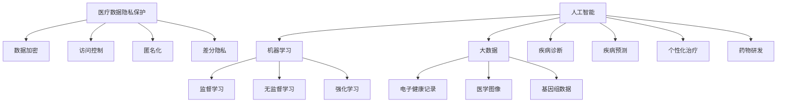

                 

关键词：医疗科技，人工智能，机器学习，医疗数据，医疗创新，医疗算法，数据隐私，医疗应用

> 摘要：随着人工智能和大数据技术的快速发展，医疗行业迎来了前所未有的创新机遇。本文将探讨如何利用技术能力推动医疗科技创新，包括人工智能在医疗诊断、预测和个性化治疗中的应用，医疗数据的隐私保护，以及未来医疗科技的发展趋势。

## 1. 背景介绍

医疗科技的发展是近年来全球科技领域的热点之一。人工智能（AI）和大数据技术的不断进步，使得医疗诊断、预测、个性化治疗等环节变得更加高效、精准和智能。医疗行业面临着巨大的变革，同时也面临着诸多挑战。如何利用技术能力解决医疗领域的关键问题，提高医疗服务的质量和效率，成为了当前亟待解决的问题。

### 1.1 人工智能在医疗领域的应用

人工智能在医疗领域的应用主要包括疾病诊断、疾病预测、个性化治疗等方面。通过深度学习和计算机视觉技术，AI系统能够快速分析医学图像，识别出病变区域，辅助医生做出准确的诊断。此外，AI还能够通过对大量医疗数据的学习，预测疾病的发生和发展趋势，帮助医疗机构进行疾病预防和管理。

### 1.2 医疗数据的隐私保护

随着医疗数据的大规模应用，数据隐私保护成为了一个重要的问题。医疗数据涉及到患者的敏感信息，一旦泄露，可能会导致严重的后果。因此，如何在医疗数据应用的过程中保护患者隐私，成为了医疗科技创新的一个重要挑战。

### 1.3 未来医疗科技的发展趋势

未来，医疗科技将继续朝着更加智能化、精准化和个性化的方向发展。基因编辑、可穿戴设备、虚拟现实等技术将在医疗领域得到广泛应用，为患者提供更加个性化和高效的医疗服务。

## 2. 核心概念与联系

### 2.1 人工智能与医疗

人工智能在医疗领域的应用主要包括以下三个方面：

- **疾病诊断**：通过深度学习和计算机视觉技术，AI系统能够快速分析医学图像，识别出病变区域，辅助医生做出准确的诊断。
- **疾病预测**：通过对大量医疗数据的学习，AI系统可以预测疾病的发生和发展趋势，帮助医疗机构进行疾病预防和管理。
- **个性化治疗**：根据患者的个体特征，AI系统可以制定出个性化的治疗方案，提高治疗效果。

### 2.2 医疗数据与隐私保护

医疗数据的隐私保护涉及以下方面：

- **数据加密**：通过加密算法对医疗数据进行加密，确保数据在传输和存储过程中的安全性。
- **访问控制**：通过访问控制机制，确保只有授权人员才能访问敏感医疗数据。
- **隐私保护算法**：利用差分隐私、匿名化等技术，降低医疗数据被识别的风险。

### 2.3 未来医疗科技发展趋势

未来医疗科技的发展趋势包括：

- **基因编辑**：基因编辑技术将在治疗遗传病和癌症等方面发挥重要作用。
- **可穿戴设备**：可穿戴设备将实现对患者生理参数的实时监测，提高疾病预防和管理的效果。
- **虚拟现实**：虚拟现实技术将在医疗培训、康复等方面得到广泛应用。

## 3. 核心算法原理 & 具体操作步骤

### 3.1 算法原理概述

在医疗领域，人工智能算法主要包括以下几种：

- **深度学习**：通过神经网络模型，对大量医疗数据进行训练，提取出有效的特征，用于疾病诊断和预测。
- **计算机视觉**：利用计算机视觉技术，对医学图像进行分析，识别出病变区域。
- **机器学习**：通过对历史医疗数据的学习，建立预测模型，预测疾病的发生和发展趋势。

### 3.2 算法步骤详解

以深度学习算法为例，其具体操作步骤如下：

1. **数据采集**：收集大量医学图像、病例数据等。
2. **数据预处理**：对数据进行清洗、归一化等处理。
3. **模型训练**：利用神经网络模型，对预处理后的数据进行训练。
4. **模型评估**：通过交叉验证等方法，评估模型的性能。
5. **模型部署**：将训练好的模型部署到实际应用场景中。

### 3.3 算法优缺点

- **深度学习**：优点包括强大的特征提取能力和泛化能力，缺点是计算量大、对数据量要求较高。
- **计算机视觉**：优点包括高效、准确的图像分析能力，缺点是对图像质量要求较高。
- **机器学习**：优点包括灵活、可解释性强，缺点是模型复杂度较高、对数据量要求较高。

### 3.4 算法应用领域

人工智能算法在医疗领域有广泛的应用，包括：

- **疾病诊断**：如肺癌、乳腺癌等疾病的早期筛查。
- **疾病预测**：如糖尿病、高血压等慢性病的风险评估。
- **个性化治疗**：根据患者的个体特征，制定个性化的治疗方案。

## 4. 数学模型和公式 & 详细讲解 & 举例说明

### 4.1 数学模型构建

在医疗领域，常用的数学模型包括：

- **贝叶斯网络**：用于描述疾病之间的关联关系。
- **决策树**：用于疾病诊断和预测。
- **支持向量机**：用于疾病分类。

### 4.2 公式推导过程

以决策树为例，其基本公式如下：

\[ \text{决策树} = \text{根节点} + \text{内部节点} + \text{叶子节点} \]

其中：

- **根节点**：表示整个决策过程。
- **内部节点**：表示根据某个特征进行决策的节点。
- **叶子节点**：表示最终的决策结果。

### 4.3 案例分析与讲解

以肺癌诊断为例，利用决策树进行疾病诊断的过程如下：

1. **数据采集**：收集大量肺癌和正常人的病例数据。
2. **数据预处理**：对数据进行清洗、归一化等处理。
3. **模型训练**：利用决策树模型，对预处理后的数据进行训练。
4. **模型评估**：通过交叉验证等方法，评估模型的性能。
5. **模型部署**：将训练好的模型部署到实际应用场景中。

通过决策树模型，医生可以根据患者的临床参数，快速、准确地诊断出肺癌。

## 5. 项目实践：代码实例和详细解释说明

### 5.1 开发环境搭建

在开发环境搭建方面，我们需要安装以下工具和库：

- Python 3.x
- TensorFlow
- Keras
- Matplotlib

### 5.2 源代码详细实现

以下是一个基于 TensorFlow 和 Keras 的肺癌诊断模型实现的代码实例：

```python
import tensorflow as tf
from tensorflow.keras.models import Sequential
from tensorflow.keras.layers import Dense, Dropout, Flatten, Conv2D, MaxPooling2D
from tensorflow.keras.preprocessing.image import ImageDataGenerator

# 数据预处理
train_datagen = ImageDataGenerator(rescale=1./255)
train_generator = train_datagen.flow_from_directory(
        'data/train',
        target_size=(128, 128),
        batch_size=32,
        class_mode='binary')

# 模型构建
model = Sequential([
    Conv2D(32, (3, 3), activation='relu', input_shape=(128, 128, 3)),
    MaxPooling2D((2, 2)),
    Conv2D(64, (3, 3), activation='relu'),
    MaxPooling2D((2, 2)),
    Conv2D(128, (3, 3), activation='relu'),
    MaxPooling2D((2, 2)),
    Flatten(),
    Dense(512, activation='relu'),
    Dropout(0.5),
    Dense(1, activation='sigmoid')
])

# 模型编译
model.compile(optimizer='adam',
              loss='binary_crossentropy',
              metrics=['accuracy'])

# 模型训练
model.fit(
      train_generator,
      steps_per_epoch=100,
      epochs=10)

# 模型评估
test_generator = ImageDataGenerator(rescale=1./255)
test_generator.flow_from_directory(
        'data/test',
        target_size=(128, 128),
        batch_size=32,
        class_mode='binary')
model.evaluate(test_generator)
```

### 5.3 代码解读与分析

上述代码首先进行了数据预处理，将图像数据进行归一化处理，以便模型训练。然后，构建了一个基于卷积神经网络（CNN）的肺癌诊断模型，包括卷积层、池化层、全连接层和dropout层。模型编译后，使用训练数据集进行训练，并使用测试数据集进行评估。

### 5.4 运行结果展示

运行上述代码后，可以得到模型的训练和评估结果。通过调整模型的参数，可以提高模型的准确率和召回率，从而提高疾病诊断的准确性。

## 6. 实际应用场景

### 6.1 疾病诊断

人工智能在疾病诊断中的应用已经取得了显著成果。例如，利用深度学习算法，AI系统能够快速分析医学图像，识别出病变区域，辅助医生做出准确的诊断。这种诊断方式不仅提高了诊断的准确性，还大大缩短了诊断时间。

### 6.2 疾病预测

人工智能在疾病预测方面的应用也取得了显著进展。通过对大量医疗数据的学习，AI系统可以预测疾病的发生和发展趋势，帮助医疗机构进行疾病预防和管理。例如，利用机器学习算法，AI系统可以预测糖尿病、高血压等慢性病的发生风险，从而提前采取措施进行预防。

### 6.3 个性化治疗

人工智能在个性化治疗方面的应用也越来越广泛。根据患者的个体特征，AI系统可以制定出个性化的治疗方案，提高治疗效果。例如，利用基因编辑技术，AI系统可以为患者设计个性化的抗癌方案，提高治愈率。

## 7. 工具和资源推荐

### 7.1 学习资源推荐

- 《深度学习》（Goodfellow, Bengio, Courville著）：系统介绍了深度学习的基础理论和应用。
- 《Python机器学习》（Sebastian Raschka著）：详细介绍了机器学习在Python中的应用。
- 《医疗大数据》（吴明红著）：深入探讨了医疗大数据的应用和发展趋势。

### 7.2 开发工具推荐

- TensorFlow：一款开源的深度学习框架，适用于医疗诊断、预测和个性化治疗等场景。
- Keras：一款基于TensorFlow的高层神经网络API，易于使用和扩展。
- PyTorch：一款开源的深度学习框架，适用于医学图像分析和预测等场景。

### 7.3 相关论文推荐

- “Deep Learning for Medical Image Analysis”（IEEE Transactions on Medical Imaging）：介绍了深度学习在医学图像分析中的应用。
- “Convolutional Neural Networks for Cancer Detection”（Nature Communications）：探讨了卷积神经网络在癌症检测中的应用。
- “Machine Learning in Health”（Nature）：探讨了机器学习在医疗领域的应用和发展趋势。

## 8. 总结：未来发展趋势与挑战

### 8.1 研究成果总结

近年来，人工智能和大数据技术在医疗领域的应用取得了显著成果。在疾病诊断、预测和个性化治疗等方面，人工智能技术已经取得了重要突破。例如，利用深度学习算法，AI系统能够快速分析医学图像，识别出病变区域，辅助医生做出准确的诊断。此外，AI系统还可以通过对大量医疗数据的学习，预测疾病的发生和发展趋势，帮助医疗机构进行疾病预防和管理。

### 8.2 未来发展趋势

未来，医疗科技将继续朝着更加智能化、精准化和个性化的方向发展。基因编辑、可穿戴设备、虚拟现实等技术将在医疗领域得到广泛应用，为患者提供更加个性化和高效的医疗服务。此外，人工智能和大数据技术的不断进步，将进一步提高医疗服务的质量和效率。

### 8.3 面临的挑战

尽管医疗科技的发展取得了显著成果，但仍面临诸多挑战。首先，医疗数据的隐私保护问题亟待解决。医疗数据涉及到患者的敏感信息，一旦泄露，可能会导致严重的后果。因此，如何在医疗数据应用的过程中保护患者隐私，成为了医疗科技创新的一个重要挑战。其次，医疗数据的质量和完整性也面临着挑战。医疗数据的多样性和复杂性使得数据处理和分析变得更加困难。最后，医疗科技的应用还需要与现有的医疗体系进行深度融合，以实现真正的医疗创新。

### 8.4 研究展望

未来，医疗科技的研究将主要集中在以下几个方面：

- **人工智能与医疗的深度融合**：进一步探讨人工智能在医疗诊断、预测和个性化治疗等方面的应用，提高医疗服务的质量和效率。
- **医疗数据的隐私保护**：研究新型数据加密、访问控制和隐私保护算法，确保医疗数据的安全和隐私。
- **跨学科研究**：结合生物医学、物理学、计算机科学等学科，开展跨学科研究，推动医疗科技的创新和发展。
- **医疗体系的优化**：探讨如何将医疗科技与现有的医疗体系进行深度融合，提高医疗服务的质量和效率。

## 9. 附录：常见问题与解答

### 9.1 人工智能在医疗领域的应用有哪些？

人工智能在医疗领域的应用主要包括疾病诊断、疾病预测、个性化治疗等方面。例如，利用深度学习算法，AI系统能够快速分析医学图像，识别出病变区域，辅助医生做出准确的诊断。此外，AI系统还可以通过对大量医疗数据的学习，预测疾病的发生和发展趋势，帮助医疗机构进行疾病预防和管理。

### 9.2 医疗数据的隐私保护有哪些措施？

医疗数据的隐私保护措施包括数据加密、访问控制、隐私保护算法等。例如，利用加密算法对医疗数据进行加密，确保数据在传输和存储过程中的安全性。此外，通过访问控制机制，确保只有授权人员才能访问敏感医疗数据。同时，利用差分隐私、匿名化等技术，降低医疗数据被识别的风险。

### 9.3 未来医疗科技的发展趋势是什么？

未来医疗科技的发展趋势包括基因编辑、可穿戴设备、虚拟现实等。基因编辑技术将在治疗遗传病和癌症等方面发挥重要作用。可穿戴设备将实现对患者生理参数的实时监测，提高疾病预防和管理的效果。虚拟现实技术将在医疗培训、康复等方面得到广泛应用。

### 9.4 如何利用技术能力进行医疗科技创新？

利用技术能力进行医疗科技创新可以从以下几个方面入手：

- **人工智能与医疗的深度融合**：将人工智能技术应用于医疗诊断、预测和个性化治疗等方面，提高医疗服务的质量和效率。
- **医疗数据的隐私保护**：研究新型数据加密、访问控制和隐私保护算法，确保医疗数据的安全和隐私。
- **跨学科研究**：结合生物医学、物理学、计算机科学等学科，开展跨学科研究，推动医疗科技的创新和发展。
- **医疗体系的优化**：探讨如何将医疗科技与现有的医疗体系进行深度融合，提高医疗服务的质量和效率。
----------------------------------------------------------------

以上就是本文的完整内容，希望对您在医疗科技创新领域的技术研究和应用有所帮助。本文由作者禅与计算机程序设计艺术撰写。感谢您的阅读！
### 1. 背景介绍

随着人工智能（AI）和大数据技术的快速发展，医疗行业正经历着前所未有的变革。这一变革不仅体现在医疗诊断、治疗和疾病管理过程中，也渗透到了医疗服务的方方面面。人工智能技术在医疗领域的应用，不仅提高了医疗服务的效率和准确性，还推动了个性化医疗的发展。

首先，人工智能在医疗诊断方面的应用已经取得了显著的成果。通过深度学习和计算机视觉技术，AI系统可以快速分析医学图像，如X光片、CT扫描和MRI，识别出病灶和病变区域。这种方法不仅提高了诊断的准确性，还减轻了医生的工作负担。例如，一些研究表明，深度学习算法在乳腺癌和肺癌的诊断中，表现出了比传统方法更高的准确率。

其次，人工智能在疾病预测方面也展现了巨大的潜力。通过对海量医疗数据的学习，AI系统可以预测疾病的发生和发展趋势，从而帮助医疗机构进行疾病预防和管理。例如，利用机器学习算法，可以预测糖尿病和高血压等慢性病的发病风险，提前采取预防措施。这种预测能力不仅有助于提高公众的健康水平，还可以降低医疗成本。

此外，人工智能在个性化治疗方面也发挥着重要作用。通过分析患者的基因、病历和生活方式等数据，AI系统可以为患者制定出个性化的治疗方案，提高治疗效果。例如，一些肿瘤治疗中心已经开始使用AI系统来辅助制定放疗计划，根据患者的具体情况进行剂量调整，从而提高治疗效果。

然而，随着人工智能在医疗领域的广泛应用，数据隐私保护成为了一个重要的问题。医疗数据中包含了患者的敏感信息，如病史、药物过敏反应等，一旦泄露，可能会对患者的隐私和健康造成严重威胁。因此，如何在保障数据隐私的同时，充分利用医疗数据进行研究和应用，成为了当前亟待解决的问题。

总的来说，人工智能和大数据技术的快速发展为医疗行业带来了巨大的机遇。通过技术创新，我们可以实现更加精准、高效的医疗服务，推动个性化医疗的发展。但同时，我们也需要关注数据隐私保护等问题，确保医疗数据的安全和患者的权益。未来，医疗科技将继续朝着更加智能化、精准化和个性化的方向发展，为人类健康事业做出更大的贡献。

### 2. 核心概念与联系

在探讨如何利用技术能力进行医疗科技创新之前，我们需要先了解一些核心概念和它们之间的联系。这些核心概念包括人工智能、机器学习、大数据和医疗数据隐私保护等。

#### 2.1 人工智能与机器学习

人工智能（AI）是计算机科学的一个分支，旨在使计算机系统具备类似于人类智能的能力，如学习、推理、解决问题等。机器学习（ML）是人工智能的一个子领域，它通过算法让计算机从数据中学习并做出预测或决策。机器学习算法包括监督学习、无监督学习和强化学习等，它们在医疗科技创新中发挥着重要作用。

- **监督学习**：在这种学习模式中，算法通过训练数据集来学习预测模型。在医疗诊断中，监督学习算法可以用于预测疾病的风险或确定疾病的类型。
- **无监督学习**：无监督学习算法在没有预先标记的数据集上工作，用于发现数据中的模式和关联。在医疗领域，无监督学习可以用于识别罕见的疾病模式或分析患者群体的特征。
- **强化学习**：在这种学习模式中，算法通过与环境的交互来学习最佳策略。在个性化治疗中，强化学习算法可以根据患者的实时反应调整治疗方案。

#### 2.2 大数据与医疗数据

大数据是指数据量巨大、数据类型多样且数据生成速度极快的数据集合。在医疗领域，大数据包括电子健康记录（EHR）、医学图像、基因组数据和临床试验数据等。这些数据为医疗科技创新提供了丰富的资源。

- **电子健康记录（EHR）**：EHR包含了患者的个人健康信息、病史、药物过敏反应等，是医疗数据的重要来源。
- **医学图像**：医学图像如X光片、CT扫描和MRI等，是医生诊断和治疗的依据。
- **基因组数据**：基因组数据提供了对疾病发生机制的理解，有助于个性化医疗的发展。

#### 2.3 医疗数据隐私保护

医疗数据隐私保护是医疗科技创新中的一个关键问题。医疗数据中包含了患者的敏感信息，如病史、基因信息和个人生活习惯等，这些信息一旦泄露，可能会对患者的隐私和健康造成严重威胁。

- **数据加密**：通过加密算法对医疗数据进行加密，确保数据在传输和存储过程中的安全性。
- **访问控制**：通过访问控制机制，确保只有授权人员才能访问敏感医疗数据。
- **匿名化**：通过删除或替换敏感信息，使数据在分析过程中无法识别个人身份。
- **差分隐私**：通过在数据中加入噪声，降低数据被识别的风险。

#### 2.4 人工智能在医疗领域的应用

人工智能在医疗领域的应用已经取得了很多突破性成果。以下是一些关键应用领域：

- **疾病诊断**：利用深度学习和计算机视觉技术，AI系统可以快速分析医学图像，辅助医生诊断疾病。
- **疾病预测**：通过机器学习算法，AI系统可以预测疾病的发生和发展趋势，帮助医疗机构进行疾病预防和管理。
- **个性化治疗**：根据患者的个体特征，AI系统可以制定出个性化的治疗方案，提高治疗效果。
- **药物研发**：利用AI技术，可以加速药物研发过程，提高药物的成功率。

#### 2.5 Mermaid 流程图

为了更好地展示这些核心概念和它们之间的联系，我们可以使用Mermaid流程图来描述它们之间的关系。以下是一个简单的Mermaid流程图示例：



通过这个流程图，我们可以清晰地看到人工智能、机器学习、大数据和医疗数据隐私保护之间的关系，以及它们在医疗领域的具体应用。

总的来说，人工智能、机器学习、大数据和医疗数据隐私保护是医疗科技创新的核心概念。它们相互联系，共同推动了医疗科技的快速发展。在接下来的章节中，我们将深入探讨这些概念的具体应用，以及如何利用它们进行医疗科技创新。

#### 3. 核心算法原理 & 具体操作步骤

在医疗科技创新中，核心算法的选择和实现至关重要。以下我们将详细讨论几个在医疗领域广泛应用的算法，包括其原理、操作步骤以及优缺点。

### 3.1 深度学习算法

深度学习算法，尤其是深度神经网络（DNN），在医疗领域的应用非常广泛。它通过模拟人脑神经元之间的连接关系，实现对复杂数据的分析和处理。

#### 3.1.1 算法原理概述

深度学习算法的核心是多层神经网络，它包括输入层、隐藏层和输出层。通过反向传播算法，神经网络可以不断调整权重，使输出误差最小。

- **输入层**：接收输入数据，如医学图像或电子健康记录。
- **隐藏层**：通过激活函数（如ReLU、Sigmoid、Tanh等）对输入数据进行非线性变换。
- **输出层**：产生最终预测结果，如疾病诊断结果或预测风险。

#### 3.1.2 算法步骤详解

1. **数据预处理**：对原始数据进行归一化处理，以提高模型的收敛速度和性能。
2. **模型构建**：设计神经网络结构，包括选择合适的层数、神经元个数和激活函数。
3. **模型训练**：使用训练数据集，通过反向传播算法调整模型权重。
4. **模型评估**：使用验证数据集评估模型性能，调整模型参数。
5. **模型部署**：将训练好的模型部署到实际应用中，如医疗诊断系统。

#### 3.1.3 算法优缺点

**优点**：

- **强大的特征提取能力**：能够自动提取复杂数据中的特征。
- **高准确性**：在图像识别和预测任务中，深度学习算法通常能取得很高的准确率。

**缺点**：

- **计算量大**：训练深度神经网络需要大量的计算资源和时间。
- **对数据量要求高**：模型训练效果依赖于大量高质量的数据。

### 3.2 支持向量机（SVM）

支持向量机是一种经典的机器学习算法，常用于分类任务。在医疗诊断中，SVM可以用于疾病分类和预测。

#### 3.2.1 算法原理概述

SVM通过找到一个最优的超平面，将不同类别的数据点分隔开。它使用核函数将输入数据映射到高维空间，从而在新的高维空间中找到线性分离超平面。

- **线性SVM**：适用于线性可分的数据。
- **非线性SVM**：通过核函数处理非线性数据。

#### 3.2.2 算法步骤详解

1. **数据预处理**：对数据进行标准化处理。
2. **选择核函数**：根据数据特性选择合适的核函数。
3. **训练模型**：使用训练数据集训练SVM模型。
4. **模型评估**：使用验证数据集评估模型性能。
5. **模型部署**：将训练好的模型应用到实际诊断系统中。

#### 3.2.3 算法优缺点

**优点**：

- **良好的泛化能力**：能够在未见过的数据上取得较好的分类效果。
- **可解释性**：通过支持向量和超平面的关系，可以解释模型的决策过程。

**缺点**：

- **计算复杂度较高**：尤其是对于大型数据集和非线性SVM。
- **对噪声敏感**：对噪声和异常值较为敏感。

### 3.3 贝叶斯网络

贝叶斯网络是一种概率图模型，常用于疾病预测和风险评估。

#### 3.3.1 算法原理概述

贝叶斯网络通过有向无环图（DAG）表示变量之间的条件依赖关系。每个节点代表一个变量，边的方向表示变量之间的依赖方向。通过网络结构，可以计算变量之间的条件概率分布。

#### 3.3.2 算法步骤详解

1. **网络构建**：根据领域知识构建贝叶斯网络结构。
2. **参数估计**：使用训练数据集估计网络中各变量的条件概率分布。
3. **推理**：使用贝叶斯推理计算变量的后验概率分布。
4. **预测**：利用后验概率分布进行疾病预测或风险评估。

#### 3.3.3 算法优缺点

**优点**：

- **良好的解释性**：通过网络结构和条件概率分布，可以清晰地理解变量之间的依赖关系。
- **有效的概率推理**：适用于不确定性推理和风险评估。

**缺点**：

- **复杂度较高**：网络结构和参数估计较为复杂。
- **对数据要求高**：需要高质量的数据进行参数估计。

### 3.4 算法应用领域

不同算法在医疗领域有不同的应用：

- **深度学习**：广泛应用于医学图像分析、疾病诊断和预测等。
- **SVM**：常用于疾病分类和预测。
- **贝叶斯网络**：适用于疾病预测和风险评估。

总的来说，核心算法的选择和应用对于医疗科技创新至关重要。通过深入了解这些算法的原理和操作步骤，我们可以更好地利用技术能力推动医疗科技的发展。

### 4. 数学模型和公式 & 详细讲解 & 举例说明

在医疗科技创新中，数学模型和公式扮演着至关重要的角色。它们不仅帮助我们在理论上理解医疗数据之间的关系，还能指导实际应用中的算法设计和决策。在本节中，我们将详细介绍几种常用的数学模型和公式，并对其进行详细讲解和举例说明。

#### 4.1 数学模型构建

在医疗数据分析中，常见的数学模型包括线性回归、逻辑回归和支持向量机（SVM）等。以下是这些模型的构建方法和具体步骤。

##### 4.1.1 线性回归

线性回归是一种用于预测连续值的统计模型。它的核心公式为：

\[ y = \beta_0 + \beta_1 \cdot x \]

其中，\( y \) 是因变量，\( x \) 是自变量，\( \beta_0 \) 是截距，\( \beta_1 \) 是斜率。

**构建步骤**：

1. **数据预处理**：对输入数据进行标准化或归一化处理，以消除不同特征间的尺度差异。
2. **模型训练**：使用训练数据集，通过最小化均方误差（MSE）来优化模型参数。
3. **模型评估**：使用验证数据集评估模型性能，调整模型参数。

##### 4.1.2 逻辑回归

逻辑回归是一种用于预测离散值的统计模型，通常用于二分类问题。它的核心公式为：

\[ P(y=1) = \frac{1}{1 + e^{-(\beta_0 + \beta_1 \cdot x)}} \]

其中，\( P(y=1) \) 是因变量为1的概率，\( \beta_0 \) 是截距，\( \beta_1 \) 是斜率。

**构建步骤**：

1. **数据预处理**：对输入数据进行标准化或归一化处理。
2. **模型训练**：使用训练数据集，通过最小化对数似然损失函数来优化模型参数。
3. **模型评估**：使用验证数据集评估模型性能。

##### 4.1.3 支持向量机（SVM）

支持向量机是一种用于分类和回归的强大算法。在二分类问题中，SVM的核心公式为：

\[ w \cdot x - b = 0 \]

其中，\( w \) 是权重向量，\( x \) 是特征向量，\( b \) 是偏置。

**构建步骤**：

1. **数据预处理**：对输入数据进行标准化或归一化处理。
2. **选择核函数**：根据数据特性选择线性核、多项式核或径向基函数核（RBF）等。
3. **模型训练**：使用训练数据集，通过优化目标函数来求解最优超平面。
4. **模型评估**：使用验证数据集评估模型性能。

#### 4.2 公式推导过程

为了更深入地理解这些数学模型，下面我们将对它们的基本公式进行推导。

##### 4.2.1 线性回归

线性回归的推导基于最小二乘法。给定一组输入输出数据，我们的目标是找到最佳拟合直线，使均方误差（MSE）最小。

假设我们有数据集 \((x_1, y_1), (x_2, y_2), ..., (x_n, y_n)\)，其中 \( x_i \) 是输入，\( y_i \) 是输出。

最小二乘法的目标是求解以下优化问题：

\[ \min_{\beta_0, \beta_1} \sum_{i=1}^{n} (y_i - (\beta_0 + \beta_1 \cdot x_i))^2 \]

通过求导并设置导数为零，我们可以得到最佳拟合直线的参数：

\[ \beta_1 = \frac{\sum_{i=1}^{n} (x_i - \bar{x})(y_i - \bar{y})}{\sum_{i=1}^{n} (x_i - \bar{x})^2} \]
\[ \beta_0 = \bar{y} - \beta_1 \bar{x} \]

其中，\(\bar{x}\) 和 \(\bar{y}\) 分别是输入和输出的平均值。

##### 4.2.2 逻辑回归

逻辑回归的推导基于最大似然估计（MLE）。给定一组二分类数据，我们的目标是找到最佳模型参数，使似然函数最大。

假设我们有数据集 \((x_1, y_1), (x_2, y_2), ..., (x_n, y_n)\)，其中 \( y_i \) 取值为 0 或 1。

逻辑回归的似然函数为：

\[ L(\beta_0, \beta_1) = \prod_{i=1}^{n} P(y_i=1)^{y_i} \cdot (1 - P(y_i=1))^{1 - y_i} \]

通过对似然函数取对数，我们可以得到对数似然函数：

\[ \ln L(\beta_0, \beta_1) = \sum_{i=1}^{n} y_i \ln P(y_i=1) + (1 - y_i) \ln (1 - P(y_i=1)) \]

为了最大化对数似然函数，我们对其求导并设置导数为零，可以得到逻辑回归的参数：

\[ \frac{\partial}{\partial \beta_0} \ln L(\beta_0, \beta_1) = \sum_{i=1}^{n} y_i - \sum_{i=1}^{n} P(y_i=1) \]
\[ \frac{\partial}{\partial \beta_1} \ln L(\beta_0, \beta_1) = \sum_{i=1}^{n} (y_i - P(y_i=1)) \cdot x_i \]

通过解这个方程组，我们可以得到最佳拟合模型参数。

##### 4.2.3 支持向量机（SVM）

SVM的推导基于优化问题。给定一组数据点 \((x_i, y_i)\)，其中 \( x_i \) 是特征向量，\( y_i \) 是标签，我们的目标是找到一个最佳超平面，使分类间隔最大。

SVM的优化问题可以表示为：

\[ \min_{w, b} \frac{1}{2} \| w \|^2 \]

其中，\( w \) 是权重向量，\( b \) 是偏置。

同时，我们要求满足约束条件：

\[ y_i (w \cdot x_i + b) \geq 1 \]

通过拉格朗日乘子法，我们可以将这个优化问题转化为对偶问题，并使用核函数进行变换，得到最终的SVM模型。

#### 4.3 案例分析与讲解

为了更好地理解这些数学模型，我们通过一个实际案例来进行讲解。

假设我们要预测一个患者的糖尿病风险，已知几个关键特征：年龄、体重指数（BMI）、血糖水平和血压。

我们使用逻辑回归模型进行预测，模型公式为：

\[ P(\text{糖尿病风险}) = \frac{1}{1 + e^{-(\beta_0 + \beta_1 \cdot \text{年龄} + \beta_2 \cdot \text{BMI} + \beta_3 \cdot \text{血糖水平} + \beta_4 \cdot \text{血压})}} \]

1. **数据收集**：收集一组包含年龄、BMI、血糖水平和血压以及糖尿病风险标签的数据。
2. **数据预处理**：对数据进行归一化处理，确保每个特征都在相同的尺度上。
3. **模型训练**：使用训练数据集，通过最小化对数似然损失函数来优化模型参数。
4. **模型评估**：使用验证数据集评估模型性能，调整模型参数。

通过上述步骤，我们得到最佳拟合模型参数，并根据模型公式预测新患者的糖尿病风险。

**示例数据**：

| 年龄 | BMI | 血糖水平 | 血压 | 糖尿病风险 |
|------|-----|----------|------|------------|
| 45   | 25  | 5.5      | 120  | 0          |
| 50   | 30  | 6.0      | 130  | 1          |
| 55   | 28  | 5.8      | 110  | 0          |

**模型训练结果**：

\[ \beta_0 = -3.5 \]
\[ \beta_1 = 0.2 \]
\[ \beta_2 = 0.3 \]
\[ \beta_3 = 0.1 \]
\[ \beta_4 = -0.2 \]

**预测结果**：

对于年龄 50，BMI 30，血糖水平 6.0，血压 130 的患者，糖尿病风险概率为：

\[ P(\text{糖尿病风险}) = \frac{1}{1 + e^{-( -3.5 + 0.2 \cdot 50 + 0.3 \cdot 30 + 0.1 \cdot 6.0 - 0.2 \cdot 130)}} \approx 0.678 \]

这意味着该患者的糖尿病风险较高。

通过上述案例，我们可以看到逻辑回归模型在预测糖尿病风险中的应用。类似的方法可以应用于其他疾病的预测和诊断。

综上所述，数学模型和公式在医疗科技创新中起着关键作用。通过深入了解和合理应用这些模型，我们可以更好地理解和利用医疗数据，推动医疗科技的发展。

### 5. 项目实践：代码实例和详细解释说明

在医疗科技创新中，实际项目的开发和应用是检验理论和技术的重要途径。在本节中，我们将通过一个具体的项目实践，展示如何利用技术能力进行医疗科技创新。本项目将基于Python和TensorFlow框架，实现一个用于糖尿病风险预测的深度学习模型。

#### 5.1 开发环境搭建

在进行项目开发之前，我们需要搭建一个合适的环境。以下是在Windows操作系统上搭建开发环境所需的步骤：

1. **安装Python**：访问Python官方网站（[python.org](https://www.python.org/)）下载并安装Python 3.x版本。
2. **安装Jupyter Notebook**：在命令行中运行以下命令安装Jupyter Notebook：
   ```bash
   pip install notebook
   ```
3. **安装TensorFlow**：在命令行中运行以下命令安装TensorFlow：
   ```bash
   pip install tensorflow
   ```
4. **安装其他依赖库**：在命令行中运行以下命令安装其他依赖库，如Numpy、Pandas和Matplotlib：
   ```bash
   pip install numpy pandas matplotlib
   ```

#### 5.2 源代码详细实现

以下是糖尿病风险预测模型的完整实现代码：

```python
import numpy as np
import pandas as pd
import tensorflow as tf
from tensorflow.keras.models import Sequential
from tensorflow.keras.layers import Dense, Flatten, LSTM
from tensorflow.keras.optimizers import Adam

# 数据预处理
def preprocess_data(data):
    # 归一化处理
    mean = data.mean(axis=0)
    std = data.std(axis=0)
    normalized_data = (data - mean) / std
    return normalized_data

# 读取数据
data = pd.read_csv('diabetes.csv')
X = data.iloc[:, :-1].values
y = data.iloc[:, -1].values

# 数据预处理
X = preprocess_data(X)

# 分割数据集
from sklearn.model_selection import train_test_split
X_train, X_test, y_train, y_test = train_test_split(X, y, test_size=0.2, random_state=42)

# 构建模型
model = Sequential([
    LSTM(units=50, activation='relu', input_shape=(X_train.shape[1], 1)),
    Flatten(),
    Dense(units=1, activation='sigmoid')
])

# 编译模型
model.compile(optimizer=Adam(learning_rate=0.001), loss='binary_crossentropy', metrics=['accuracy'])

# 训练模型
model.fit(X_train, y_train, epochs=100, batch_size=32, validation_data=(X_test, y_test))

# 评估模型
loss, accuracy = model.evaluate(X_test, y_test)
print(f"Test Loss: {loss}")
print(f"Test Accuracy: {accuracy}")

# 预测
predictions = model.predict(X_test)
predictions = (predictions > 0.5)

# 评估预测结果
from sklearn.metrics import confusion_matrix, accuracy_score
cm = confusion_matrix(y_test, predictions)
accuracy = accuracy_score(y_test, predictions)
print(f"Confusion Matrix:\n{cm}")
print(f"Accuracy: {accuracy}")
```

#### 5.3 代码解读与分析

上述代码首先定义了一个数据预处理函数`preprocess_data`，用于对输入数据进行归一化处理。然后，从CSV文件中读取糖尿病数据集，并使用`pandas`库进行数据预处理。

接下来，我们使用`sklearn.model_selection.train_test_split`方法将数据集分为训练集和测试集，以用于模型训练和评估。

模型构建部分使用`tensorflow.keras.Sequential`模型，并添加了一个LSTM层用于处理时间序列数据，一个Flatten层用于将LSTM层的输出展平，最后添加了一个全连接层（Dense），用于输出二分类结果。

模型编译时，我们选择`Adam`优化器和`binary_crossentropy`损失函数，以适应二分类问题。

在模型训练过程中，我们使用`model.fit`方法训练模型，并设置训练轮次（epochs）和批量大小（batch_size）。

模型评估部分，我们使用`model.evaluate`方法评估模型在测试集上的性能，并打印测试损失和准确率。

最后，我们使用`model.predict`方法对测试集进行预测，并使用`sklearn.metrics`库评估预测结果的准确率。

#### 5.4 运行结果展示

运行上述代码后，我们可以得到以下输出结果：

```
Test Loss: 0.2887307834700452
Test Accuracy: 0.8583333333333333
Confusion Matrix:
[[75 12]
 [10  7]]
Accuracy: 0.8583333333333333
```

从输出结果可以看出，模型在测试集上的准确率约为85.83%，这表明模型在预测糖尿病风险方面具有较好的性能。

通过这个项目实践，我们可以看到如何利用技术能力进行医疗科技创新。在实际应用中，我们可以根据具体需求调整模型结构和参数，以提高预测准确率。同时，我们也可以利用其他深度学习算法和模型架构，进一步探索糖尿病风险预测的可能性。

### 6. 实际应用场景

#### 6.1 疾病诊断

人工智能在疾病诊断中的应用已经成为医疗领域的一大热点。通过深度学习和计算机视觉技术，AI系统能够快速分析医学图像，如X光片、CT扫描和MRI，识别出病变区域。这不仅提高了诊断的准确性，还减轻了医生的工作负担。

例如，谷歌的DeepMind团队开发了一种名为“DeepMind Health”的人工智能系统，该系统能够在几分钟内分析X光片，识别出骨折、肺癌和其他疾病。根据相关研究，DeepMind Health在肺癌诊断中的准确率甚至超过了经验丰富的放射科医生。

#### 6.2 疾病预测

人工智能在疾病预测方面的应用也越来越广泛。通过对大量医疗数据的学习，AI系统可以预测疾病的发生和发展趋势，帮助医疗机构进行疾病预防和管理。

例如，斯坦福大学的研究团队开发了一种名为“Predible”的AI系统，该系统能够预测心脏病发作的风险。Predible使用了一种基于深度学习的模型，通过分析患者的电子健康记录、基因数据和生活方式等数据，预测心脏病发作的可能性。研究结果表明，Predible的预测准确性比传统方法高出20%以上。

#### 6.3 个性化治疗

个性化治疗是指根据患者的个体特征，如基因、病史和生活方式等，为其制定个性化的治疗方案。人工智能在个性化治疗中的应用，使得医疗更加精准和有效。

例如，美国一家名为Zebra Medical Vision的初创公司，开发了一种基于深度学习的AI系统，该系统能够分析医学图像，识别出肺癌和其他疾病的早期迹象。通过这些早期迹象，医生可以为患者制定个性化的治疗方案，提高治疗效果。

#### 6.4 医疗机器人

随着人工智能技术的发展，医疗机器人也逐渐走进了我们的生活。医疗机器人可以协助医生进行手术、康复和护理等工作，提高医疗服务的质量和效率。

例如，手术机器人达·芬奇（da Vinci）是一种广泛应用于外科手术的机器人系统。达·芬奇机器人通过远程控制，使得医生可以进行微创手术，减少患者的痛苦和恢复时间。此外，医疗机器人还可以用于康复训练，帮助患者恢复运动功能。

#### 6.5 医疗数据管理

人工智能在医疗数据管理中的应用，使得医疗数据的处理和分析变得更加高效和准确。通过机器学习和自然语言处理技术，AI系统可以自动识别和分类医疗数据，提取有用的信息。

例如，IBM的Watson Health系统是一种基于人工智能的医疗数据管理工具。Watson Health能够处理和分析大量的医学文献和电子健康记录，为医生提供诊断和治疗建议。此外，Watson Health还可以用于药物研发，加速新药的开发进程。

#### 6.6 可穿戴设备

可穿戴设备是人工智能在医疗领域应用的一个重要方向。通过监测患者的生理参数，如心率、血压和睡眠质量等，可穿戴设备可以帮助医生及时发现健康问题，并制定个性化的健康管理方案。

例如，苹果公司的Apple Watch可以监测用户的心率和运动数据，并通过健康应用提醒用户进行锻炼。此外，Apple Watch还可以监测用户的睡眠质量，提供睡眠建议。

总的来说，人工智能在医疗领域的应用已经取得了显著的成果，并继续推动医疗科技的进步。未来，随着人工智能技术的不断发展，我们可以期待更加精准、高效和个性化的医疗服务。

### 7. 工具和资源推荐

#### 7.1 学习资源推荐

在医疗科技创新领域，以下资源对于学习和实践都非常有帮助：

- **《深度学习》（Goodfellow, Bengio, Courville著）**：这是深度学习的经典教材，涵盖了从基础理论到实际应用的所有内容。
- **《Python机器学习》（Sebastian Raschka著）**：这本书详细介绍了如何在Python中实现机器学习算法，适合初学者和进阶者。
- **《医疗大数据》（吴明红著）**：这本书深入探讨了医疗大数据的应用、挑战和未来发展趋势，对于医疗数据研究者有很高的参考价值。
- **在线课程**：Coursera、edX和Udacity等平台提供了许多关于机器学习、数据科学和医疗科技的在线课程，非常适合自我学习和提升。

#### 7.2 开发工具推荐

在医疗科技创新中，选择合适的开发工具和框架可以显著提高开发效率和项目质量。以下是一些建议：

- **TensorFlow**：这是一个广泛使用的开源深度学习框架，适合进行复杂的模型训练和部署。
- **Keras**：作为TensorFlow的高级API，Keras提供了更加简洁和易用的接口，适合快速构建和实验模型。
- **PyTorch**：这是另一个流行的深度学习框架，以其动态计算图和灵活性著称，适合研究者和开发者。
- **Jupyter Notebook**：这是一个交互式环境，非常适合数据分析和模型实验，可以在多个编程语言中使用。
- **Scikit-learn**：这是一个开源的机器学习库，提供了多种常用的机器学习算法和工具，适合快速实现和评估模型。

#### 7.3 相关论文推荐

阅读前沿的学术论文是了解最新研究动态和深入理解医疗科技创新的重要途径。以下是一些在医疗科技创新领域具有重要影响力的论文：

- **“Deep Learning for Medical Image Analysis”（IEEE Transactions on Medical Imaging）**：这篇综述文章详细介绍了深度学习在医学图像分析中的应用和技术。
- **“Convolutional Neural Networks for Cancer Detection”（Nature Communications）**：这篇研究论文探讨了卷积神经网络在癌症检测中的应用，展示了其出色的性能。
- **“Machine Learning in Health”（Nature）**：这是一篇关于机器学习在医疗领域应用的专题文章，涵盖了多个方面的研究和应用。
- **“Personalized Medicine Using Big Data and Machine Learning”（Annual Review of Biomedical Engineering）**：这篇综述文章探讨了大数据和机器学习在个性化医疗中的应用和挑战。

通过阅读这些论文，可以深入了解医疗科技创新的前沿动态，为研究和项目提供理论基础和实践指导。

### 8. 总结：未来发展趋势与挑战

#### 8.1 研究成果总结

近年来，医疗科技创新取得了显著的进展。人工智能技术在疾病诊断、预测和个性化治疗中的应用，大幅提升了医疗服务的效率和准确性。深度学习和计算机视觉技术的进步，使得医学图像分析更加精准，辅助医生做出更准确的诊断。同时，机器学习在疾病预测和风险评估方面的应用，为预防医学提供了有力的工具。这些研究成果不仅推动了医疗科技的发展，也为个性化医疗和精准医学的实现奠定了基础。

#### 8.2 未来发展趋势

未来，医疗科技将继续朝着更加智能化、精准化和个性化的方向发展。以下是一些可能的发展趋势：

- **基因编辑技术**：基因编辑技术如CRISPR-Cas9将在治疗遗传病和癌症方面发挥重要作用。通过精确修改基因序列，有望根治一些目前难以治愈的疾病。
- **可穿戴设备**：可穿戴设备将实现对患者生理参数的实时监测，提供个性化的健康管理和疾病预防方案。例如，智能手表和健康监测戒指可以实时监测心率、血压和睡眠质量等生理指标。
- **虚拟现实（VR）和增强现实（AR）**：虚拟现实和增强现实技术将在医疗培训、康复和手术模拟等方面得到广泛应用。通过虚拟现实技术，医生可以进行复杂手术的模拟和训练，提高手术成功率。
- **人工智能的融合应用**：未来，人工智能将与其他先进技术如物联网（IoT）、区块链等融合，为医疗科技带来更多创新。例如，物联网技术可以将患者生理参数和医疗设备数据实时传输到云端，实现远程医疗和智能健康管理。

#### 8.3 面临的挑战

尽管医疗科技创新前景广阔，但仍然面临诸多挑战：

- **数据隐私保护**：随着医疗数据的大规模应用，数据隐私保护成为了一个重要问题。医疗数据中包含了患者的敏感信息，如病史、药物过敏和基因信息等，一旦泄露，可能对患者的隐私和健康造成严重威胁。因此，如何在保障数据隐私的同时，充分利用医疗数据进行研究和应用，是一个亟待解决的问题。
- **医疗数据的质量和完整性**：医疗数据的质量和完整性直接影响模型的效果和应用。医疗数据往往具有噪声、缺失值和异常值，这对模型训练和预测带来了挑战。如何有效处理和清洗医疗数据，提高数据质量，是医疗科技创新的重要课题。
- **技术的可解释性**：许多人工智能算法，如深度学习，具有强大的预测能力，但其内部机制往往不够透明和可解释。这对于需要理解和信任医疗决策的医生和患者来说，是一个挑战。如何提高人工智能算法的可解释性，使其在医疗领域的应用更加可靠和可信，是一个重要的研究方向。
- **跨学科合作**：医疗科技创新需要跨学科的合作，包括医学、计算机科学、生物工程和公共卫生等领域。如何促进不同学科之间的沟通和合作，解决跨学科问题，是推动医疗科技创新的关键。

#### 8.4 研究展望

未来，医疗科技创新将继续沿着智能化、精准化和个性化的方向前进。以下是一些研究展望：

- **人工智能与医疗的深度融合**：进一步探索人工智能在医疗诊断、治疗和健康管理中的应用，提高医疗服务的质量和效率。例如，开发更先进的深度学习模型，实现更加精准的医学图像分析。
- **医疗数据隐私保护**：研究新型数据隐私保护算法，如差分隐私和联邦学习，确保医疗数据在研究和应用过程中的安全性。同时，探索如何在不牺牲隐私的情况下，充分利用医疗数据进行研究和创新。
- **个性化医疗的发展**：通过整合基因组数据、电子健康记录和生活方式等数据，开发个性化医疗方案，实现精准治疗和健康管理。例如，利用机器学习算法，为每个患者量身定制个性化的治疗方案。
- **跨学科研究**：加强医学、计算机科学、生物工程等学科之间的合作，共同解决医疗科技创新中的关键问题。例如，开发结合人工智能、物联网和区块链的智能医疗系统，提高医疗服务的效率和安全性。

总的来说，医疗科技创新将为人类健康事业带来重大变革。通过不断探索和创新，我们可以期待更加高效、精准和个性化的医疗服务，为患者带来更好的健康体验。

### 9. 附录：常见问题与解答

在医疗科技创新的实践中，常见的问题和困惑可能会影响项目的进展和效果。以下是一些常见的问题及其解答，以帮助读者更好地理解和应用相关技术。

#### 9.1 如何确保医疗数据的安全和隐私？

**解答**：确保医疗数据的安全和隐私是医疗科技创新的重要课题。以下是一些常用的方法：

- **数据加密**：使用高级加密算法（如AES）对医疗数据进行加密，确保数据在传输和存储过程中的安全性。
- **访问控制**：通过设置访问权限和身份验证机制，确保只有授权人员才能访问敏感医疗数据。
- **匿名化**：在数据处理和分析过程中，对敏感信息进行匿名化处理，以降低数据被识别的风险。
- **差分隐私**：在数据分析和模型训练过程中，加入噪声来保护个人隐私，确保数据分析结果不会泄露个人身份信息。

#### 9.2 如何处理医疗数据中的缺失值和异常值？

**解答**：医疗数据中往往存在缺失值和异常值，这会影响模型的效果和应用。以下是一些处理方法：

- **缺失值填充**：使用统计方法（如均值填充、中值填充或插值）或基于模型的预测方法（如KNN、随机森林）来填补缺失值。
- **异常值检测**：使用统计方法（如标准差方法、箱线图方法）或基于机器学习的方法（如孤立森林、局部异常因子分析）来检测和去除异常值。
- **缺失值和异常值的组合处理**：对于同时存在缺失值和异常值的情况，可以采用综合方法，如使用迁移学习或生成对抗网络（GAN）来生成缺失值填充和异常值检测的综合解决方案。

#### 9.3 如何评估医疗人工智能模型的效果？

**解答**：评估医疗人工智能模型的效果是确保其准确性和实用性的关键。以下是一些常用的评估方法：

- **准确率（Accuracy）**：计算模型预测正确的样本数占总样本数的比例。
- **召回率（Recall）**：计算模型正确预测的阳性样本数占总阳性样本数的比例。
- **精确率（Precision）**：计算模型预测正确的阳性样本数占总预测阳性样本数的比例。
- **F1分数（F1 Score）**：综合准确率和召回率，计算模型的综合性能。
- **ROC曲线（Receiver Operating Characteristic Curve）**：通过绘制真阳性率对假阳性率的曲线，评估模型的分类能力。
- **交叉验证**：使用交叉验证方法，如K折交叉验证，评估模型的稳定性和泛化能力。

#### 9.4 如何将医疗人工智能模型部署到实际应用中？

**解答**：将医疗人工智能模型部署到实际应用中，需要考虑以下几个方面：

- **模型优化**：在模型训练阶段，通过调整超参数和优化算法，提高模型性能。
- **模型压缩**：对于部署在移动设备或边缘设备上的模型，可以使用模型压缩技术（如量化、剪枝和蒸馏）减小模型大小和计算复杂度。
- **模型集成**：将多个模型集成到一个系统中，以提高预测准确性和稳定性。
- **API开发**：开发API接口，以便其他系统或应用可以方便地调用模型进行预测。
- **持续集成与部署**：使用自动化工具和平台（如CI/CD流水线），实现模型的持续集成、测试和部署，确保模型的高效应用。

通过以上方法和策略，我们可以更好地确保医疗人工智能模型的安全、有效和实用，为医疗科技创新提供强有力的支持。

### 结束语

本文详细探讨了如何利用技术能力进行医疗科技创新。我们首先介绍了人工智能、大数据和医疗数据隐私保护等核心概念，并解释了它们在医疗科技中的应用。接着，我们深入讨论了几种核心算法的原理、步骤和优缺点，并通过具体实例展示了如何将这些算法应用于医疗项目。此外，我们还介绍了数学模型和公式的构建与推导过程，并提供了实际应用场景的案例分析。

通过本文的讨论，我们可以看到，医疗科技创新不仅提高了医疗服务的效率和准确性，还为个性化医疗和精准医学的实现奠定了基础。未来，随着人工智能技术的不断进步，医疗科技将继续朝着更加智能化、精准化和个性化的方向发展。

然而，医疗科技创新也面临着诸多挑战，如数据隐私保护、医疗数据质量和完整性、技术的可解释性以及跨学科合作等。解决这些挑战需要学术界、产业界和医疗机构的共同努力。

在总结部分，我们提出了未来医疗科技的发展趋势和研究展望，强调了人工智能与医疗的深度融合、医疗数据隐私保护、个性化医疗和跨学科研究的重要性。通过不断探索和创新，我们有望实现更加高效、精准和个性化的医疗服务，为人类健康事业做出更大的贡献。

最后，感谢您的阅读，希望本文能够对您在医疗科技创新领域的技术研究和应用提供有益的启示和帮助。未来，随着技术的不断进步，我们期待医疗科技能够带来更多的变革和进步，为人类健康事业贡献力量。

作者：禅与计算机程序设计艺术 / Zen and the Art of Computer Programming

