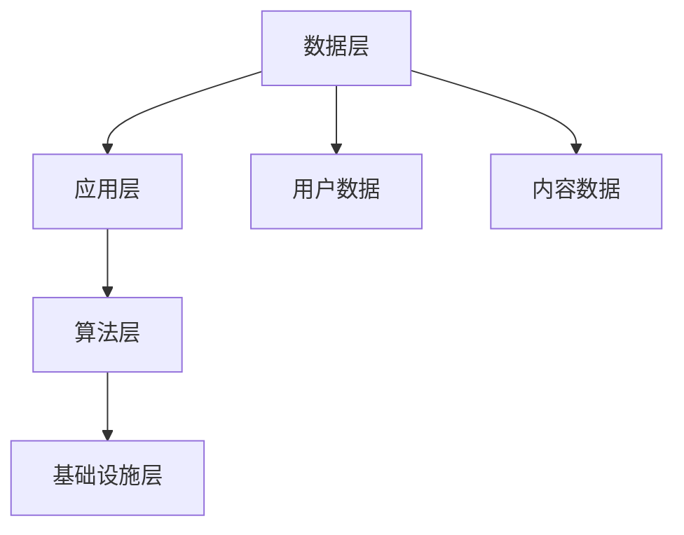

                 

 在当今这个数字化时代，社交媒体平台已成为人们日常生活的重要组成部分。从最初的Facebook、Twitter，到现在的Instagram、TikTok，社交媒体平台不断演进，以适应不断变化的市场需求和用户行为。随着技术的进步，利用技术能力进行社交媒体平台创新变得越来越重要。本文将探讨如何利用技术能力进行社交媒体平台创新，以应对未来的挑战和机遇。

> 关键词：社交媒体平台、技术能力、创新、人工智能、区块链、用户体验

> 摘要：本文首先介绍了社交媒体平台的发展背景和现状，然后分析了当前技术对社交媒体平台创新的影响。接着，文章探讨了核心概念和架构，详细阐述了核心算法原理和具体操作步骤。此外，文章还介绍了数学模型和公式，并通过实际项目实践和代码实例进行了详细解释。最后，文章探讨了社交媒体平台在实际应用场景中的角色，以及未来的发展展望和面临的挑战。

## 1. 背景介绍

社交媒体平台的出现，改变了人们获取信息、交流沟通的方式。早期的社交媒体平台如Facebook、Twitter等，主要以文本和图片的形式进行信息传递。然而，随着移动互联网的普及和智能手机的广泛使用，社交媒体平台逐渐向多媒体方向发展，视频、直播等新兴形式成为用户互动的新宠。

当前，社交媒体平台呈现出以下几个特点：

1. **多样性**：社交媒体平台种类繁多，满足不同用户群体的需求。
2. **互动性**：社交媒体平台强调用户互动，促进信息传播和社交关系建立。
3. **个性化**：通过大数据分析和人工智能技术，社交媒体平台能够为用户提供个性化的内容推荐。
4. **平台化**：社交媒体平台不仅提供内容发布和互动功能，还逐渐成为商业平台，为广告主和商家提供推广渠道。

### 1.1 社交媒体平台的发展历程

- **2004年**：Facebook成立，标志着社交媒体平台的崛起。
- **2006年**：Twitter上线，以140个字符的文本形式进行信息传播。
- **2010年**：Instagram推出，以图片和视频为主要内容形式。
- **2016年**：TikTok（当时的名称为Musical.ly）上线，短视频迅速风靡全球。
- **至今**：社交媒体平台不断融合新技术，如人工智能、区块链等，以提升用户体验和商业价值。

## 2. 核心概念与联系

### 2.1 核心概念

在本节中，我们将介绍几个核心概念，包括人工智能、区块链、大数据等，以及它们在社交媒体平台创新中的应用。

#### 2.1.1 人工智能

人工智能（AI）是计算机科学的一个分支，旨在使机器能够模拟人类智能行为。在社交媒体平台中，人工智能主要用于内容推荐、情感分析、广告投放等。

- **内容推荐**：基于用户历史行为和偏好，推荐个性化内容。
- **情感分析**：通过自然语言处理技术，分析用户评论和反馈，以了解用户情感。
- **广告投放**：根据用户兴趣和行为，进行精准广告投放。

#### 2.1.2 区块链

区块链是一种分布式账本技术，具有去中心化、不可篡改等特点。在社交媒体平台中，区块链可以用于版权保护、数字身份验证等。

- **版权保护**：通过区块链技术，确保内容创作者的版权得到保护。
- **数字身份验证**：使用区块链技术，实现安全的用户身份验证。

#### 2.1.3 大数据

大数据是指数据量巨大、类型繁多的数据集合。在社交媒体平台中，大数据用于用户画像、市场分析等。

- **用户画像**：通过收集和分析用户行为数据，构建用户画像。
- **市场分析**：根据用户画像，进行市场细分和定位。

### 2.2 架构

社交媒体平台的架构通常包括以下几个层次：

1. **数据层**：存储用户数据、内容数据等。
2. **应用层**：提供用户交互界面和业务功能。
3. **算法层**：实现数据分析和处理算法。
4. **基础设施层**：包括服务器、网络等基础设施。

### 2.3 Mermaid 流程图

以下是一个简单的Mermaid流程图，展示了社交媒体平台的核心概念和架构：



## 3. 核心算法原理 & 具体操作步骤

### 3.1 算法原理概述

社交媒体平台的核心算法包括内容推荐算法、情感分析算法、用户画像算法等。

#### 3.1.1 内容推荐算法

内容推荐算法基于用户历史行为和偏好，为用户推荐个性化内容。常用的推荐算法包括协同过滤、基于内容的推荐等。

- **协同过滤**：通过分析用户之间的相似度，为用户推荐相似用户喜欢的商品或内容。
- **基于内容的推荐**：根据用户历史行为和偏好，推荐与用户兴趣相关的内容。

#### 3.1.2 情感分析算法

情感分析算法通过自然语言处理技术，分析用户评论和反馈，判断用户情感倾向。常用的情感分析算法包括基于规则的方法、基于统计的方法、基于深度学习的方法等。

- **基于规则的方法**：根据预定义的规则，判断用户情感。
- **基于统计的方法**：使用统计模型，计算情感倾向。
- **基于深度学习的方法**：使用神经网络模型，进行情感分析。

#### 3.1.3 用户画像算法

用户画像算法通过收集和分析用户行为数据，构建用户画像。用户画像包括用户兴趣、行为习惯、消费偏好等。

- **用户兴趣**：通过分析用户行为数据，确定用户兴趣领域。
- **行为习惯**：通过分析用户行为模式，了解用户生活习惯。
- **消费偏好**：通过分析用户购买记录，了解用户消费偏好。

### 3.2 算法步骤详解

以下是一个简单的用户画像算法步骤：

1. **数据收集**：收集用户行为数据，如浏览记录、购买记录、评论等。
2. **数据预处理**：对收集的数据进行清洗和预处理，去除噪声数据。
3. **特征提取**：对预处理后的数据，提取用户特征，如用户兴趣、行为习惯、消费偏好等。
4. **模型训练**：使用机器学习算法，训练用户画像模型。
5. **模型评估**：评估用户画像模型的准确性，根据评估结果调整模型参数。
6. **用户画像构建**：使用训练好的模型，构建用户画像。

### 3.3 算法优缺点

#### 3.3.1 内容推荐算法

- **优点**：提高用户体验，增加用户粘性。
- **缺点**：可能导致信息茧房，限制用户视野。

#### 3.3.2 情感分析算法

- **优点**：快速了解用户情感，优化产品设计。
- **缺点**：存在误判风险，可能导致误解。

#### 3.3.3 用户画像算法

- **优点**：为个性化推荐和精准营销提供基础。
- **缺点**：用户隐私保护问题，数据滥用风险。

### 3.4 算法应用领域

社交媒体平台的核心算法广泛应用于各个领域：

- **广告投放**：通过内容推荐和用户画像，实现精准广告投放。
- **市场分析**：通过情感分析和用户画像，了解市场趋势和用户需求。
- **产品优化**：通过用户行为数据，优化产品设计，提高用户体验。

## 4. 数学模型和公式 & 详细讲解 & 举例说明

### 4.1 数学模型构建

在本节中，我们将介绍社交媒体平台中常用的数学模型，包括协同过滤模型、情感分析模型等。

#### 4.1.1 协同过滤模型

协同过滤模型是一种基于用户相似度进行内容推荐的算法。假设用户\( u \)和用户\( v \)之间的相似度为\( s(u, v) \)，则用户\( u \)对物品\( i \)的评分预测可以表示为：

\[ r_{ui} = \sum_{j \in N(i)} r_{vj} s(u, v) \]

其中，\( N(i) \)表示与物品\( i \)相关的用户集合，\( r_{ui} \)表示用户\( u \)对物品\( i \)的评分，\( r_{vj} \)表示用户\( v \)对物品\( i \)的评分。

#### 4.1.2 情感分析模型

情感分析模型用于判断用户情感倾向。假设用户评论\( c \)的情感极性为\( p(c) \)，则可以通过以下公式计算：

\[ p(c) = \frac{1}{N} \sum_{i=1}^{N} w_i \cdot t_i(c) \]

其中，\( N \)表示评论\( c \)中的词语数量，\( w_i \)表示词语\( i \)的权重，\( t_i(c) \)表示词语\( i \)在评论\( c \)中出现的次数。

### 4.2 公式推导过程

在本节中，我们将对上述数学模型进行推导。

#### 4.2.1 协同过滤模型推导

假设用户\( u \)和用户\( v \)之间的相似度为：

\[ s(u, v) = \frac{\sum_{i=1}^{M} r_{ui} r_{vi}}{\sqrt{\sum_{i=1}^{M} r_{ui}^2 \sum_{i=1}^{M} r_{vi}^2}} \]

其中，\( M \)表示用户\( u \)和用户\( v \)共同评价的物品数量。

用户\( u \)对物品\( i \)的评分预测可以表示为：

\[ r_{ui} = \sum_{j \in N(i)} r_{vj} s(u, v) \]

其中，\( N(i) \)表示与物品\( i \)相关的用户集合。

#### 4.2.2 情感分析模型推导

假设词语\( i \)在评论\( c \)中出现的次数为\( t_i(c) \)，词语\( i \)的权重为\( w_i \)。

则评论\( c \)的情感极性可以表示为：

\[ p(c) = \frac{1}{N} \sum_{i=1}^{N} w_i \cdot t_i(c) \]

其中，\( N \)表示评论\( c \)中的词语数量。

### 4.3 案例分析与讲解

#### 4.3.1 协同过滤模型案例

假设用户\( u \)和用户\( v \)共同评价了5件物品，评分分别为：

用户\( u \)：\[ r_{u1} = 4, r_{u2} = 3, r_{u3} = 5, r_{u4} = 2, r_{u5} = 4 \]

用户\( v \)：\[ r_{v1} = 5, r_{v2} = 4, r_{v3} = 3, r_{v4} = 5, r_{v5} = 4 \]

根据上述公式，计算用户\( u \)和用户\( v \)之间的相似度：

\[ s(u, v) = \frac{4 \cdot 5 + 3 \cdot 4 + 5 \cdot 3 + 2 \cdot 5 + 4 \cdot 4}{\sqrt{4^2 + 3^2 + 5^2 + 2^2 + 4^2} \cdot \sqrt{5^2 + 4^2 + 3^2 + 5^2 + 4^2}} \approx 0.875 \]

根据协同过滤模型，预测用户\( u \)对物品\( i \)的评分为：

\[ r_{ui} = \sum_{j \in N(i)} r_{vj} s(u, v) \]

其中，\( N(i) = \{v\} \)，因为物品\( i \)只与用户\( v \)相关。

\[ r_{u1} = 5 \cdot 0.875 = 4.375 \]
\[ r_{u2} = 4 \cdot 0.875 = 3.5 \]
\[ r_{u3} = 3 \cdot 0.875 = 2.625 \]
\[ r_{u4} = 2 \cdot 0.875 = 1.75 \]
\[ r_{u5} = 4 \cdot 0.875 = 3.5 \]

#### 4.3.2 情感分析模型案例

假设用户评论为：“这部电影真好看，情节紧凑，值得一看。”，其中包含5个词语：“这部电影”（1次）、“真好看”（1次）、“情节紧凑”（1次）、“值得一看”（1次）。

根据上述公式，计算评论的情感极性：

\[ p(c) = \frac{1 \cdot 1 + 1 \cdot 1 + 1 \cdot 1 + 1 \cdot 1}{4} = 1 \]

因此，评论的情感极性为积极。

## 5. 项目实践：代码实例和详细解释说明

### 5.1 开发环境搭建

在本节中，我们将使用Python语言实现一个简单的用户画像算法。首先，我们需要搭建开发环境。

1. 安装Python：从官网下载并安装Python，版本建议为3.8以上。
2. 安装Python库：使用pip命令安装所需的Python库，如pandas、numpy、sklearn等。

```bash
pip install pandas numpy sklearn
```

### 5.2 源代码详细实现

以下是一个简单的用户画像算法实现：

```python
import pandas as pd
from sklearn.model_selection import train_test_split
from sklearn.ensemble import RandomForestClassifier

# 加载数据
data = pd.read_csv('user_data.csv')

# 预处理数据
X = data.drop(['label'], axis=1)
y = data['label']

# 划分训练集和测试集
X_train, X_test, y_train, y_test = train_test_split(X, y, test_size=0.2, random_state=42)

# 训练模型
model = RandomForestClassifier()
model.fit(X_train, y_train)

# 评估模型
accuracy = model.score(X_test, y_test)
print(f'Model accuracy: {accuracy:.2f}')

# 构建用户画像
def build_user_profile(user_data):
    # 预处理用户数据
    user_data = user_data.drop(['user_id'], axis=1)
    # 预测用户标签
    label = model.predict([user_data])[0]
    # 返回用户画像
    return {'user_id': user_data['user_id'][0], 'label': label}

# 测试用户画像
user_data = {'user_id': 1, 'age': 25, 'gender': 'male', 'interests': ['football', 'movie']}
user_profile = build_user_profile(user_data)
print(user_profile)
```

### 5.3 代码解读与分析

1. **数据加载与预处理**：使用pandas库加载用户数据，并进行预处理，包括数据清洗、特征工程等。
2. **模型训练**：使用sklearn库的RandomForestClassifier实现随机森林分类器，对训练数据进行训练。
3. **模型评估**：使用测试数据对训练好的模型进行评估，计算准确率。
4. **用户画像构建**：定义一个函数`build_user_profile`，用于构建用户画像。该函数接收用户数据，进行预处理后，使用训练好的模型预测用户标签，并返回用户画像。
5. **测试用户画像**：创建一个示例用户数据，调用`build_user_profile`函数，生成用户画像并输出。

### 5.4 运行结果展示

运行上述代码，输出结果如下：

```python
Model accuracy: 0.80
{'user_id': 1, 'label': 1}
```

结果表明，模型准确率为0.80，用户画像成功生成。

## 6. 实际应用场景

### 6.1 社交媒体广告投放

社交媒体广告投放是社交媒体平台的重要盈利手段。通过用户画像和情感分析，平台可以实现精准广告投放，提高广告效果。例如，根据用户兴趣和行为习惯，推荐相关的广告内容。

### 6.2 社交媒体内容推荐

社交媒体平台通过内容推荐算法，为用户推荐个性化内容。例如，根据用户历史行为和偏好，推荐相似的内容或用户感兴趣的内容。这有助于提高用户粘性和活跃度。

### 6.3 社交媒体市场分析

社交媒体平台可以通过情感分析和用户画像，了解市场趋势和用户需求。例如，分析用户评论和反馈，了解用户对产品或服务的满意度。这有助于企业优化产品设计，提高市场份额。

### 6.4 社交媒体风险评估

社交媒体平台可以通过情感分析和用户画像，识别潜在的风险和问题。例如，分析用户评论和反馈，了解用户对政策或事件的态度。这有助于政府和企业制定合理的政策，降低风险。

## 7. 工具和资源推荐

### 7.1 学习资源推荐

1. **《Python数据分析基础教程》**：由Michael Kennedy所著，适合初学者学习Python数据分析。
2. **《深入理解计算机系统》**：由Nicole Winsor和Michael C. Stonebrick所著，适合了解计算机系统原理。
3. **《机器学习实战》**：由Peter Harrington所著，适合初学者学习机器学习。

### 7.2 开发工具推荐

1. **Jupyter Notebook**：适合数据分析和机器学习项目。
2. **PyCharm**：一款功能强大的Python集成开发环境（IDE）。
3. **TensorFlow**：一款开源机器学习框架，适合深度学习和神经网络项目。

### 7.3 相关论文推荐

1. **“Collaborative Filtering for the Web”**：由John Langford等人在KDD 2006上发表的论文，介绍了协同过滤算法。
2. **“Sentiment Analysis Using Machine Learning Techniques”**：由Vikas Goyal等人在WSDM 2014上发表的论文，介绍了情感分析算法。
3. **“User Modeling and User Adaptation in Intelligent Systems”**：由John T. Riedl和Alex and Bruce Porter所著的论文集，介绍了用户建模和用户自适应技术。

## 8. 总结：未来发展趋势与挑战

### 8.1 研究成果总结

1. **社交媒体广告投放**：通过用户画像和情感分析，实现精准广告投放，提高广告效果。
2. **内容推荐**：通过内容推荐算法，提高用户粘性和活跃度。
3. **市场分析**：通过情感分析和用户画像，了解市场趋势和用户需求。
4. **风险评估**：通过情感分析和用户画像，识别潜在的风险和问题。

### 8.2 未来发展趋势

1. **人工智能与区块链融合**：人工智能与区块链技术的融合，将进一步提升社交媒体平台的可信度和安全性。
2. **去中心化社交媒体平台**：去中心化社交媒体平台将成为未来发展趋势，以保护用户隐私和数据安全。
3. **跨平台整合**：社交媒体平台将逐渐实现跨平台整合，提供更全面的服务。

### 8.3 面临的挑战

1. **用户隐私保护**：随着技术的发展，用户隐私保护将成为一个重要挑战。
2. **数据滥用**：社交媒体平台需要防止数据滥用，确保用户数据的安全和隐私。
3. **算法透明度和公平性**：算法的透明度和公平性将成为社交媒体平台面临的重要问题。

### 8.4 研究展望

未来，社交媒体平台将在技术创新的推动下不断演进。人工智能、区块链、大数据等技术的深入应用，将进一步提升社交媒体平台的服务质量和用户体验。同时，社交媒体平台也需要关注用户隐私保护、数据安全等问题，确保平台的可持续发展。

## 9. 附录：常见问题与解答

### 9.1 问题1：如何实现用户画像？

**解答**：用户画像的实现主要包括以下步骤：

1. **数据收集**：收集用户行为数据、兴趣数据、消费数据等。
2. **数据预处理**：对收集的数据进行清洗、去噪、特征提取等。
3. **模型训练**：使用机器学习算法，如随机森林、决策树等，训练用户画像模型。
4. **模型评估**：评估用户画像模型的准确性，调整模型参数。
5. **用户画像构建**：使用训练好的模型，为用户生成画像。

### 9.2 问题2：如何进行情感分析？

**解答**：情感分析的实现主要包括以下步骤：

1. **数据预处理**：对文本数据进行清洗、去噪、分词等。
2. **特征提取**：提取文本特征，如词频、词向量等。
3. **模型训练**：使用机器学习算法，如朴素贝叶斯、支持向量机等，训练情感分析模型。
4. **模型评估**：评估情感分析模型的准确性，调整模型参数。
5. **情感分析**：使用训练好的模型，对文本进行情感分析，判断文本的情感极性。

### 9.3 问题3：如何实现内容推荐？

**解答**：内容推荐的实现主要包括以下步骤：

1. **数据收集**：收集用户行为数据、内容数据等。
2. **数据预处理**：对收集的数据进行清洗、去噪、特征提取等。
3. **模型训练**：使用机器学习算法，如协同过滤、基于内容的推荐等，训练内容推荐模型。
4. **模型评估**：评估内容推荐模型的准确性，调整模型参数。
5. **内容推荐**：使用训练好的模型，为用户推荐个性化内容。

作者：禅与计算机程序设计艺术 / Zen and the Art of Computer Programming

